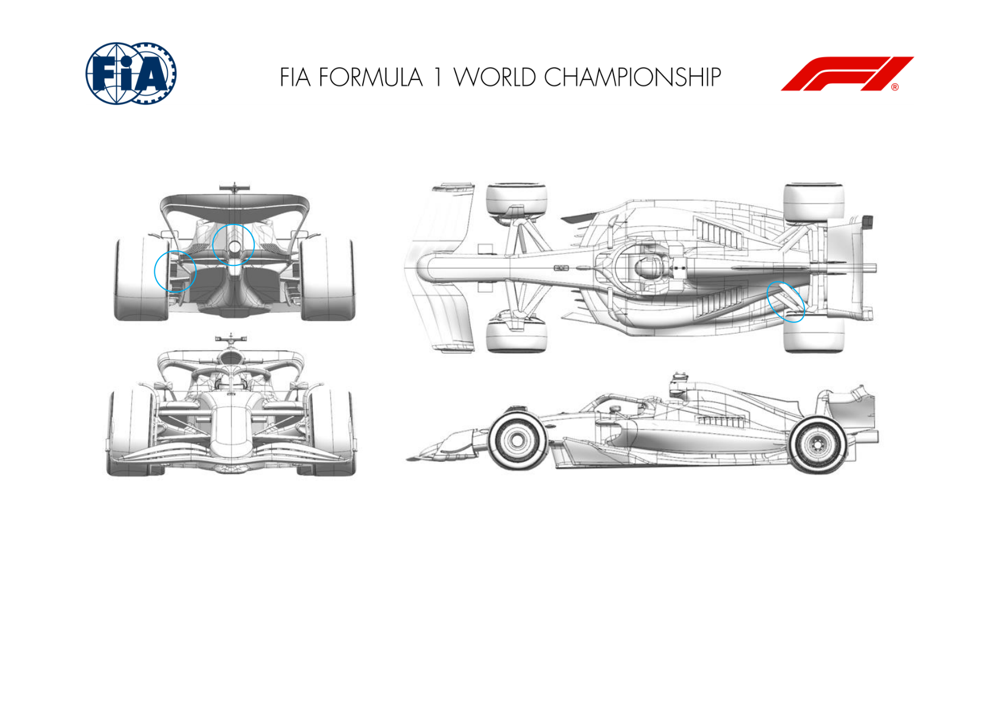
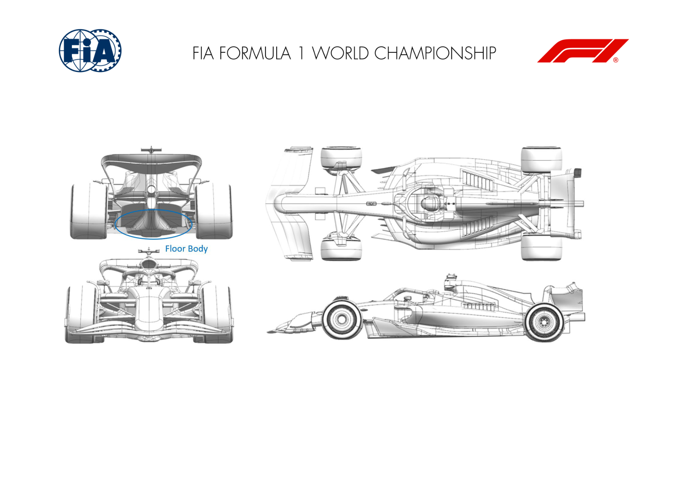
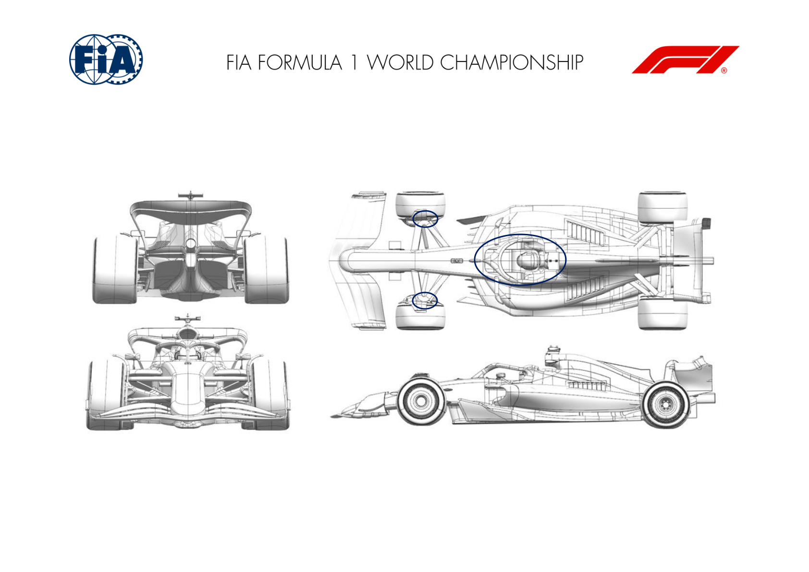
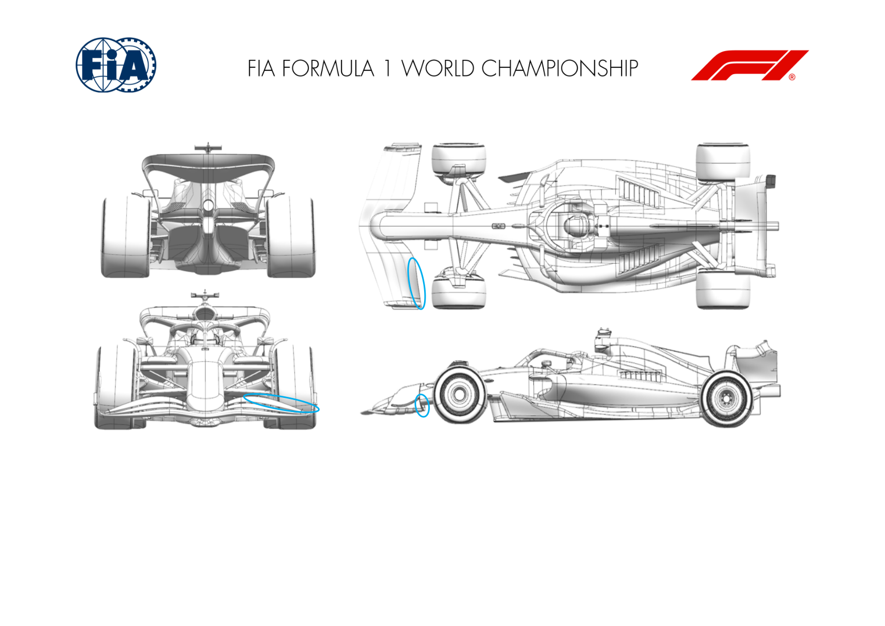
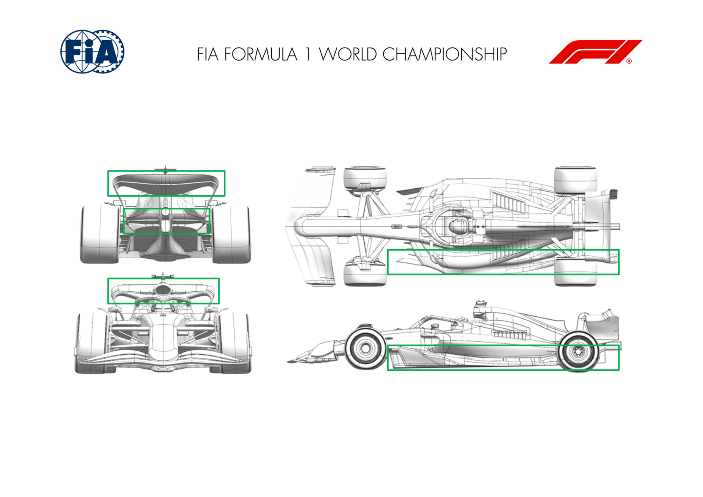

2025 JAPANESE GRAND PRIX

04 - 06 April 2025

From The FIA Formula One Media Delegate Document 9

To All Teams, All Officials Date 04 April 2025

Time 08:50

Title Car Presentation Submissions

Description Car Presentation Submissions

Enclosed 2025 Japanese Grand Prix - Car Presentation Submissions.pdf

Roman De Lauw

The FIA Formula One Media Delegate

Car Presentation – Japanese Grand Prix

McLaren Formula 1 Team

No updates submitted for this event.

Car Presentation – Japanese Grand Prix

SCUDERIA FERRARI HP

No updates submitted for this event.

Car Presentation – Japanese Grand Prix

Red Bull Racing

| No. | Updated component | Primary reason for update | Geometric differences | Description |
| --- | --- | --- | --- | --- |
| 1 | Coke/Engine Cover | Reliability | Revision to central exit aspect ratio Subtle changes to reduce the losses incurred by the upper and lower rear wings for more cooling. |  |
| 2 | Rear corner | Reliability | Enlarged exit duct with blanking options | In preparation for upcoming races, a larger exit duct has been prepared with scope to blank primarily for Suzuka |
| 3 | Rear Suspension | Performance - Local Load | Mild revision to lower wishbone shroud and fairing into the rear wheel bodywork. | Gap between races allowed a revised wishbone shroud better aligned to the local flow conditions to be applied with attendant fairing into the brake duct assembly. |

Car Presentation – Japanese Grand Prix

Mercedes-AMG PETRONAS F1 Team

No updates submitted for this event.

Car Presentation – Japanese Grand Prix

Aston Martin Aramco F1 Team

No updates submitted for this event.

Car Presentation – Japanese Grand Prix

BWT Alpine F1 Team

No updates submitted for this event.

Car Presentation – Japanese Grand Prix

MONEYGRAM HAAS F1 TEAM

| No. | Updated component | Primary reason for update | Geometric differences | Description |
| --- | --- | --- | --- | --- |
| 1 | Floor Body | Performance - Local Load | Central floor re-shaped | This geometry changes the floor volume in floor proximity, aiming to improve stability when the car is running at low ride-heights in high speed corners. |

Car Presentation – Japanese Grand Prix

Visa Cash App Racing Bulls

| No. | Updated component | Primary reason for update | Geometric differences | Description |
| --- | --- | --- | --- | --- |
| 1 | Halo | Performance - Flow Conditioning | Reprofiled Halo shroud and interface to chassis. | The airflow passing over the Halo passes towards the back of the car and can influence the rear wing and floor performance. This update improves the flow quality downstream of the Halo. |

Car Presentation – Japanese Grand Prix

ATLASSIAN WILLIAMS RACING

| No. | Updated component | Primary reason for update | Geometric differences | Description |
| --- | --- | --- | --- | --- |
| 1 | Front Wing Flap | Performance – Local Load | The rearward most element of the front wing has an longer chord length and features a more pronounced ‘dip’ in its profile. The details of the connection to the | The updated flap geometry produces more local load, which wing. The interaction of the subsequent flow with the front suspension and brake duct furniture is different, which leads |
| 2 | Front Wing Endplate | Performance – Flow Conditioning | The new endplate has a reprofiled lower rear edge and a slightly modified connection to the front wing flap. | Working in conjunction with the new flap, the revisions to the endplate modify the flow leaving the front wing assembly and improve its interaction with the downstream aero devices. |

Car Presentation – Japanese Grand Prix

Stake F1 Team KICK Sauber

| No. | Updated component | Primary reason for update | Geometric differences | Description |
| --- | --- | --- | --- | --- |
| 1 | Floor Body | Performance - Local Load | Changes to several areas of the floor: floor fence, outboard floor and diffuser. | All changes together are aiming to have better flow field entering the underfloor and improving flow quality all along the floor. |
| 2 | Rear Wing | Performance - Local Load | Changes to main plane. | Changes to the main plane geometry to increase overall efficiency and improved cleanliness of the rear wing assembly. |
| 3 | Beam Wing | Performance - Local Load | Adding an upper element to the already existing beam wing main plane. | The addition of the forward element leads to an efficient load increase as well as a positive response on characteristics. |

