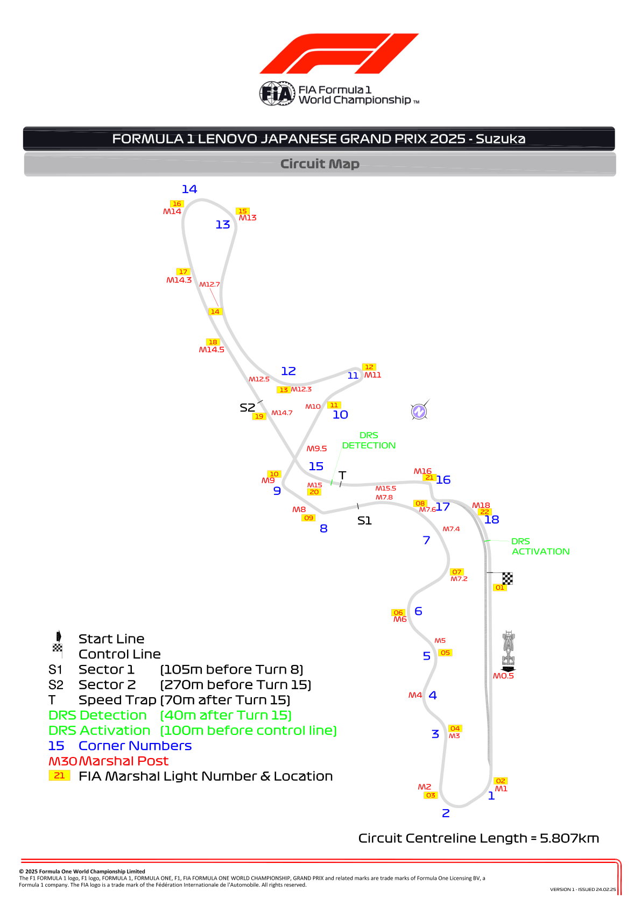
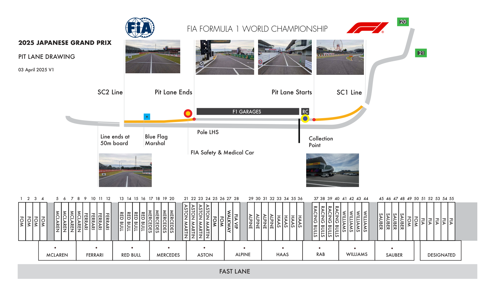
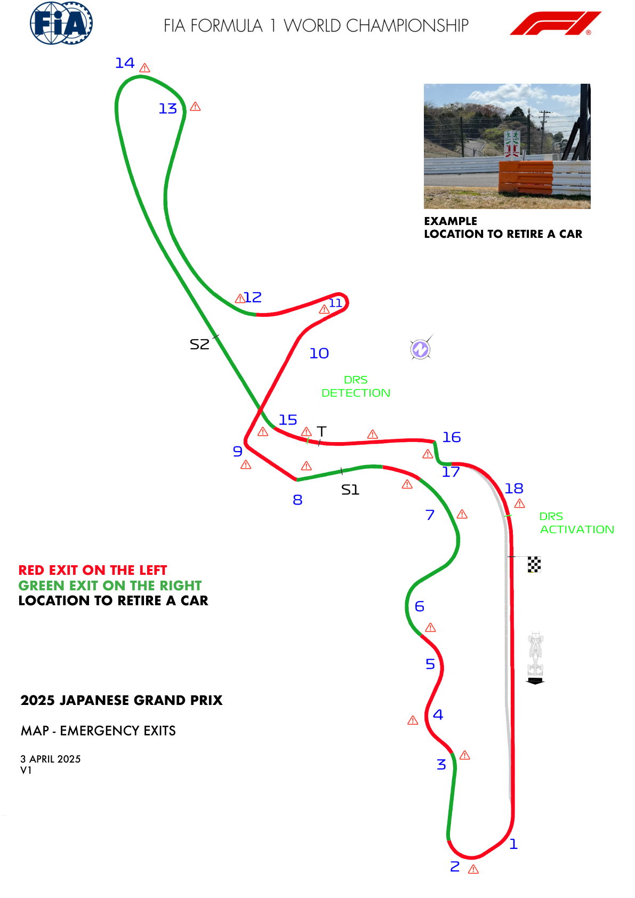
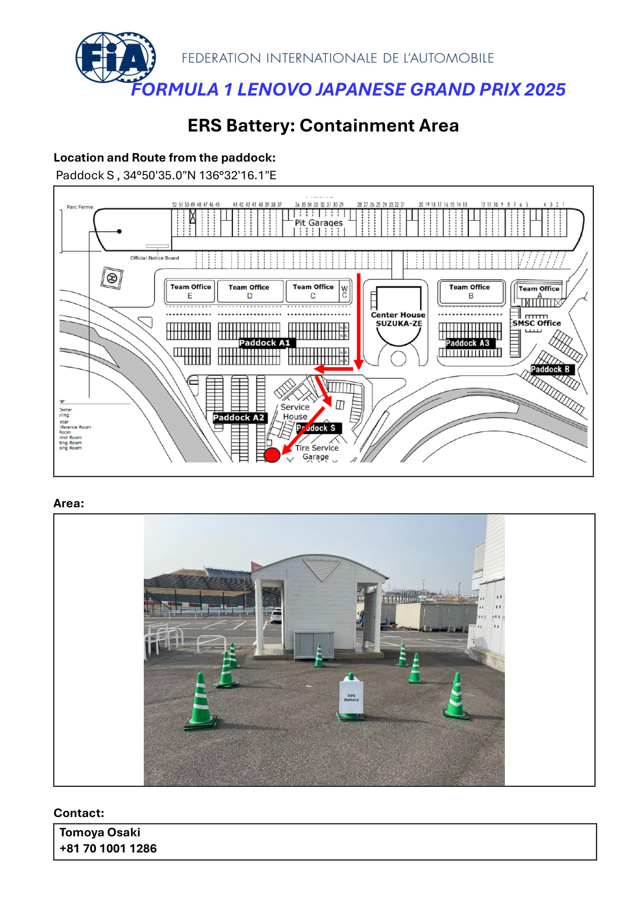
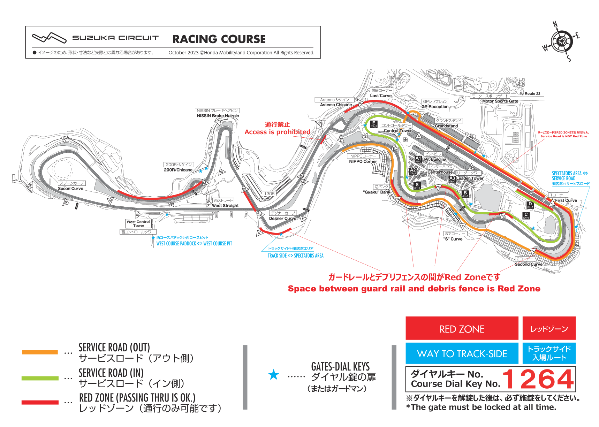

2025 JAPANESE GRAND PRIX

04 - 06 April 2025

From The FIA Formula One Race Director Document 5

To All Teams, All Officials Date 03 April 2025

Time 19:32

Title Event Notes - Circuit Map, Pit Lane, Quarantine and Red Zone

Description Event Notes - Circuit Map, Pit Lane, Quarantine and Red Zone

Enclosed Maps Japan 2025.pdf

Rui Marques

The FIA Formula One Race Director

