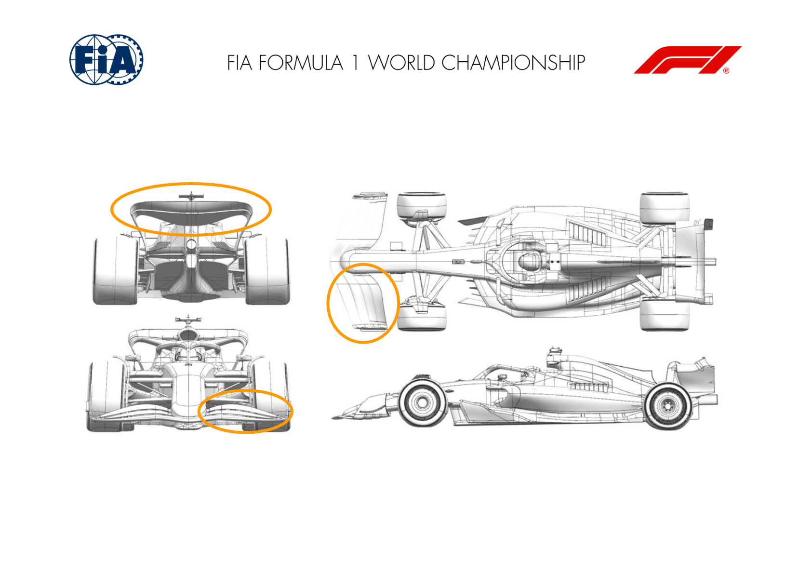
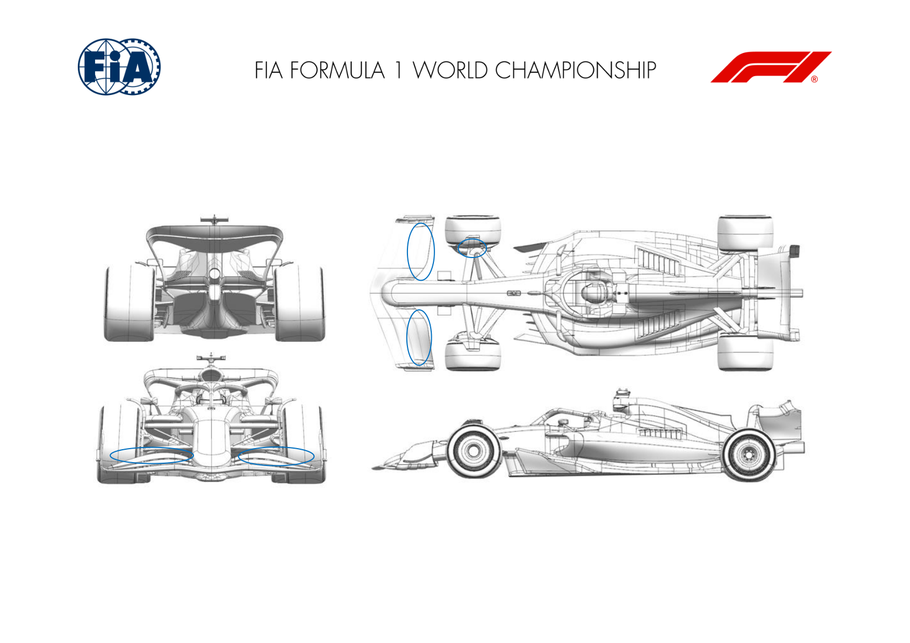
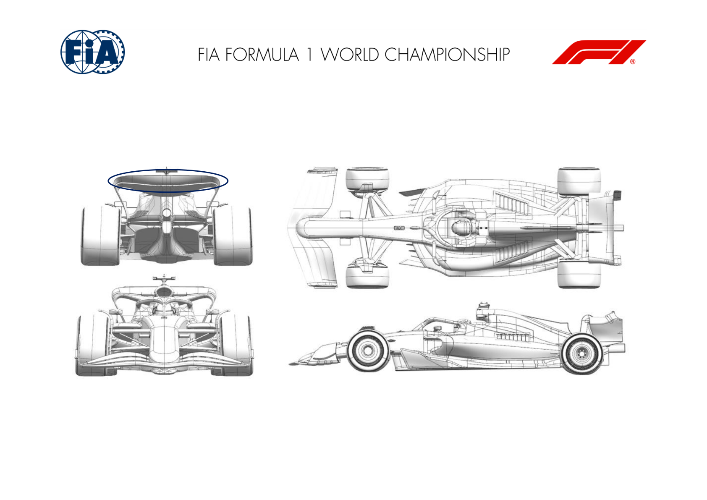

2025 LAS VEGAS GRAND PRIX

20 - 22 November 2025

From The FIA Formula One Media Delegate Document 7

To All Teams, All Officials Date 20 November 2025

Time 13:54

Title Car Presentation Submissions

Description Car Presentation Submissions

Enclosed 2025 Las Vegas Grand Prix - Car Presentation Submissions.pdf

Roman De Lauw

The FIA Formula One Media Delegate

Car Presentation – Las Vegas Grand Prix

McLaren Formula 1 Team

| No. | Updated component | Primary reason for update | Geometric differences | Description |
| --- | --- | --- | --- | --- |
| 1 | Front Wing | Circuit specific - Balance Range | Trimmed Front Wing Flap | A trim has been applied to the front wing flap in order to extend balance range in combination with the low downforce rear wing. |
| 2 | Rear Wing | Circuit specific - Drag Range | Reduced Chord Rear Wing Flap | Two options of reduced chord rear wing flap providing the ability to reduce drag and downforce further the low downforce wing assembly. |

Car Presentation – Las Vegas Grand Prix

*SCUDERIA FERRARI HP*

No updates submitted for this event.

Car Presentation – USA Las Vegas Grand Prix

Red Bull Racing

| No. | Updated component | Primary reason for update | Geometric differences | Description |
| --- | --- | --- | --- | --- |
| 1 | Front wing | Balance range | Front wing flaps with reduced cambers and chords | To meet the expected balance requirements of the circuit in Las Vegas for a range of rear wing levels, a make from front wing flap has been prepared with reduced cambers and chords. |

Car Presentation – 2025 Las Vegas Grand Prix

*Mercedes-AMG PETRONAS F1 Team*

No updates submitted for this event.

Car Presentation – Las Vegas Grand Prix

Aston Martin Aramco F1 Team

No updates submitted for this event.

Car Presentation – Las Vegas Grand Prix

BWT Alpine F1 Team

No updates submitted for this event.

Car Presentation – Las Vegas Grand Prix

*MoneyGram Haas F1 Team*

No updates submitted for this event.

Car Presentation – Las Vegas Grand Prix

Visa Cash App Racing Bulls

| No. | Updated component | Primary reason for update | Geometric differences | Description |
| --- | --- | --- | --- | --- |
| 1 | Rear Wing | Circuit specific - Drag Range | Updated rear wing flap profile. | The upper rear wing flap has been changed to meet the needs of the target downforce & efficiency level for the circuit. |

Car Presentation – Las Vegas Grand Prix

*ATLASSIAN WILLIAMS RACING*

No updates submitted for this event.

Car Presentation – Las Vegas Grand Prix

Stake F1 Team KICK Sauber

No updates submitted for this event.
