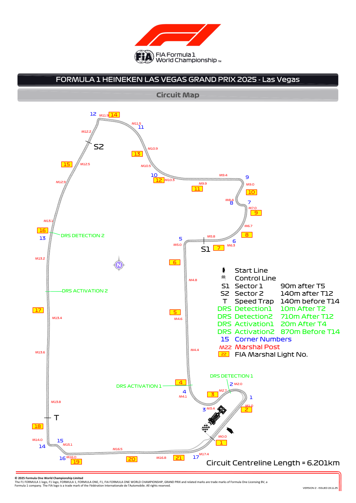
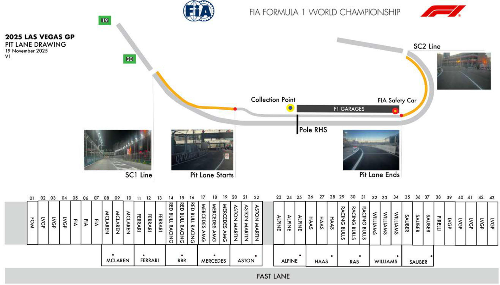
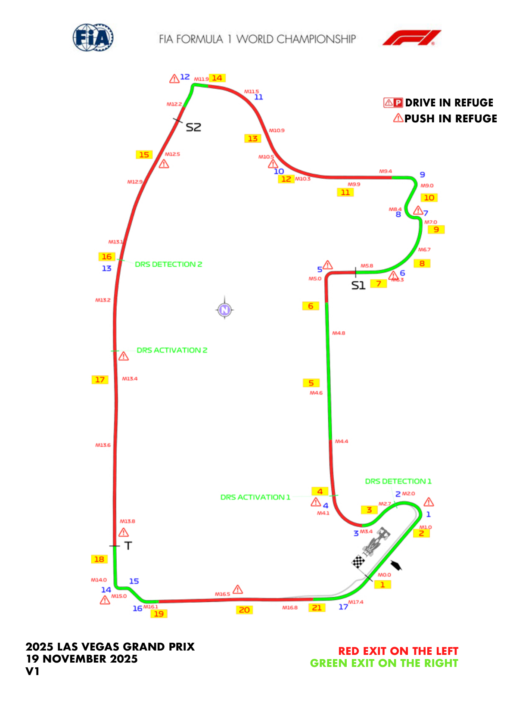
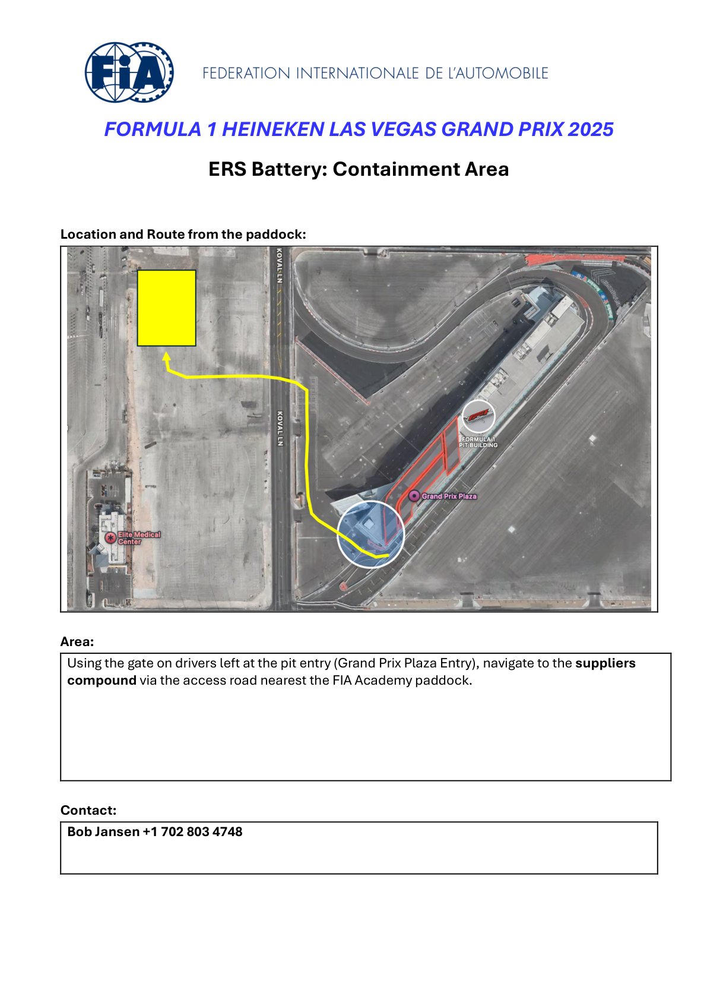
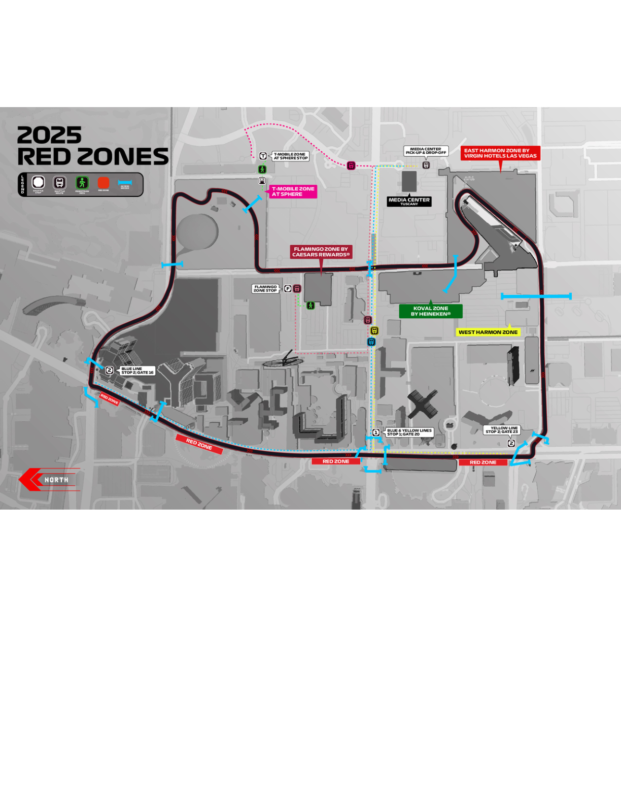

2025 LAS VEGAS GRAND PRIX

20 - 22 November 2025

From The FIA Formula One Race Director Document 2

To All Teams, All Officials Date 19 November 2025

Time 21:49

Title Event Notes - Circuit Map V2, Pit Lane Drawing, Emergency Map Exits, Quarantine Zone and Red Zones

Description Event Notes - Circuit Map V2, Pit Lane Drawing, Emergency Map Exits, Quarantine Zone and Red Zones

Enclosed Maps.pdf

Rui Marques

The FIA Formula One Race Director

