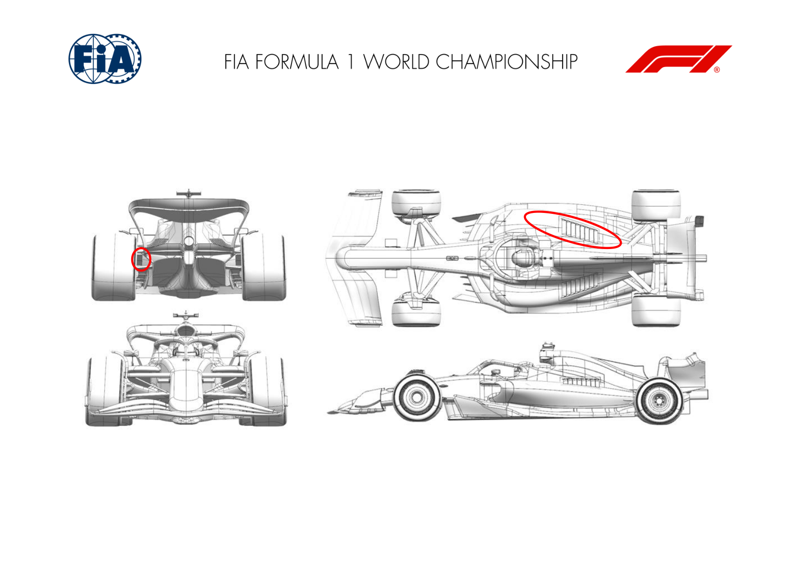
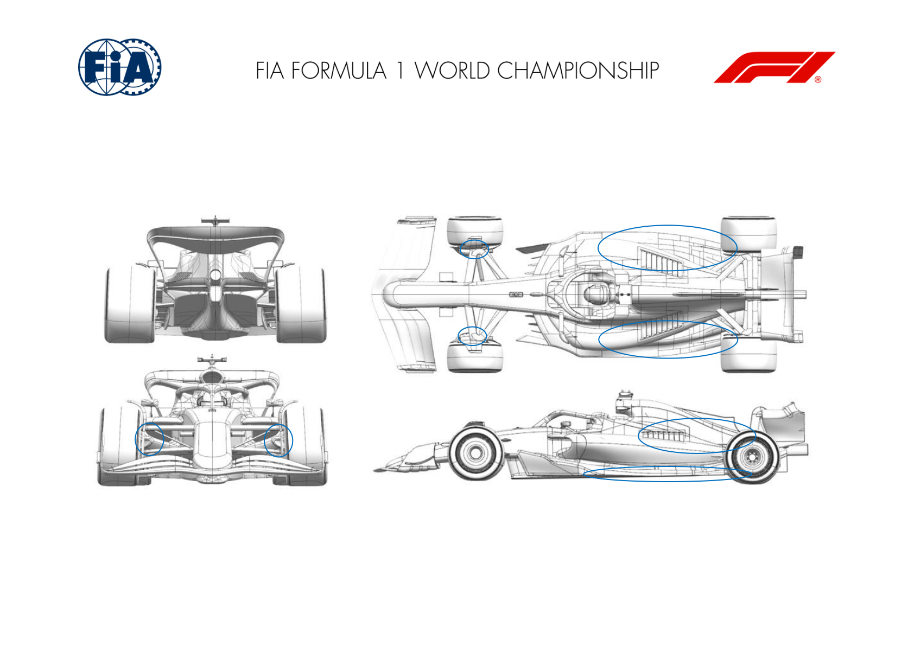
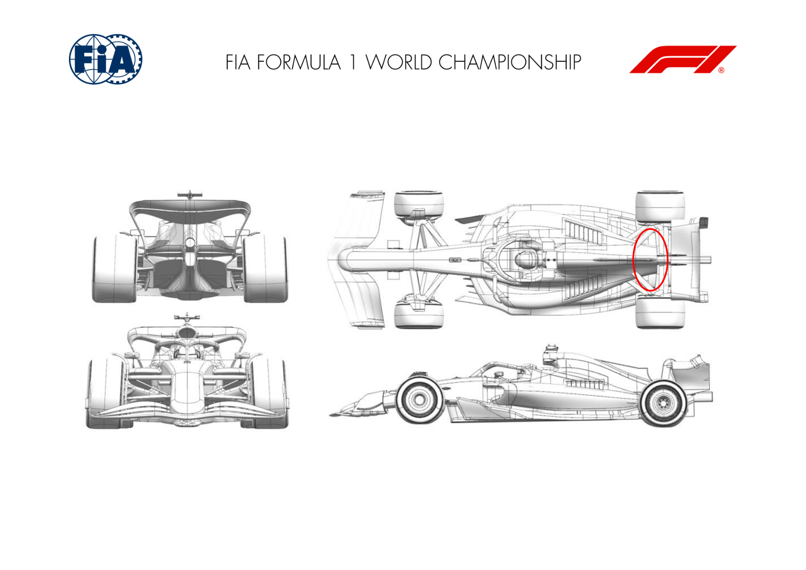
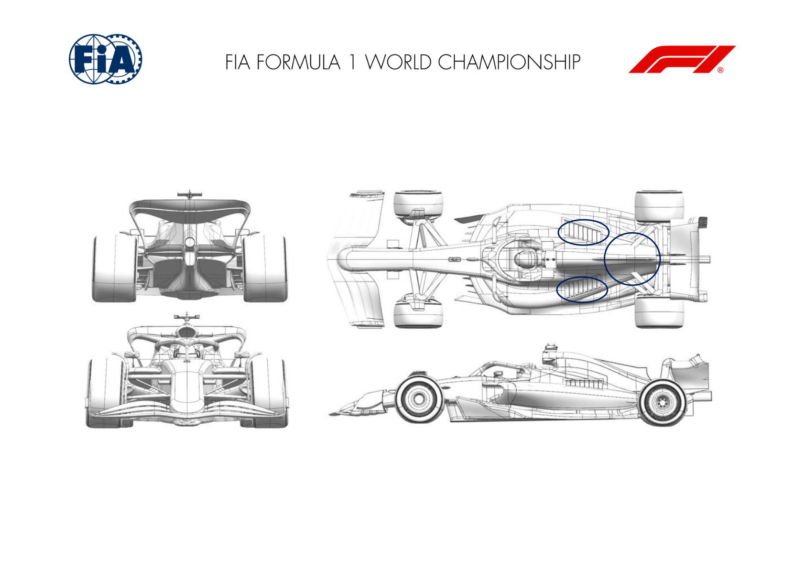
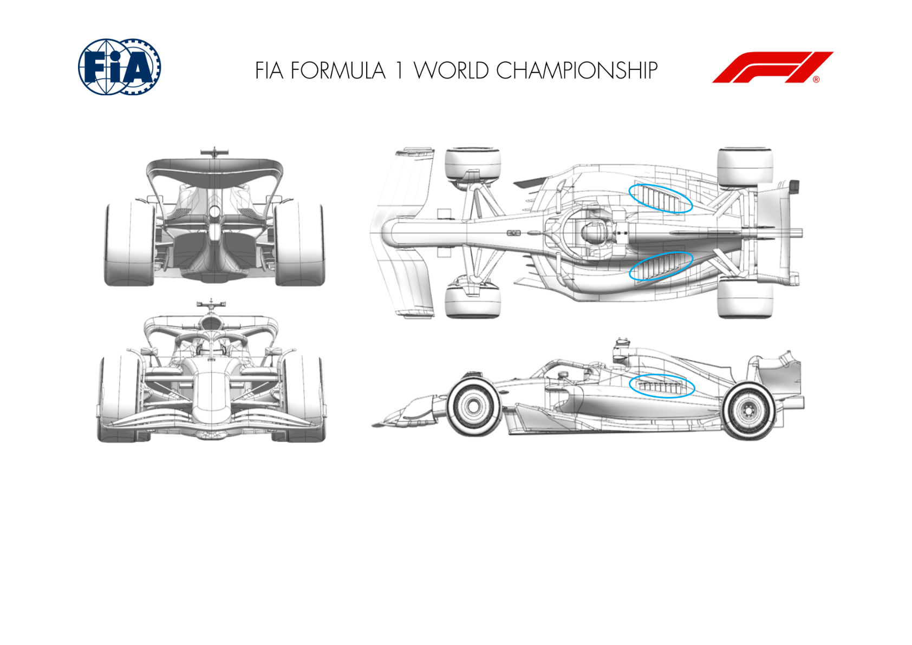

2025 MEXICO CITY GRAND PRIX

24 - 26 October 2025

From The FIA Formula One Media Delegate Document 7

To All Teams, All Officials Date 24 October 2025

Time 09:56

Title Car Presentation Submissions

Description Car Presentation Submissions

Enclosed 2025 Mexico City Grand Prix - Car Presentation Submissions.pdf

Roman De Lauw

The FIA Formula One Media Delegate

Car Presentation – Mexico Grand Prix

McLaren Formula 1 Team

No updates submitted for this event.

Car Presentation – Mexico City Grand Prix

*SCUDERIA FERRARI HP*

| No. | Updated component | Primary reason for update | Geometric differences | Description |
| --- | --- | --- | --- | --- |
| 1 | Cooling Louvres | Circuit specific - Cooling Range | Additional bodywork exit louvres | Specific to the requirements of the Mexico City circuit, these new bodywork exit louvres are extending the top end of the engine cooling capacity, at the expense of car efficiency |
| 2 | Rear Corner | Circuit specific - Cooling Range | Enlarged rear brake duct inboard exit | As for the engine cooling options, this update targets an increased cooling capacity for the rear brakes to cope with the requirements of the Mexico City circuit |

Car Presentation – Mexican Grand Prix

Red Bull Racing

| No. | Updated component | Primary reason for update | Geometric differences | Description |
| --- | --- | --- | --- | --- |
| 1 | Front corner | Reliability | Enlarged front brake inlet and outlet ducting | Given the rigours of brake cooling in the reduced atmospheric pressure of Mexico city, larger inlet and exit caps have been prepared for this race to simply recover air mass flow. |
| 2 | Engine Cover | Reliability | Redistributed topbody exit areas | In work carried out for the previous cooling revision, more benefit was found from redistributing the exit air and given scope to introduce via an update to existing tooling, this can be deployed in Mexico. In addition, a wider louvre exit panel is available to recover mass flow in the ambient conditions encountered. |
| 3 | Floor body | Local load | Subtle revisions to the upper surface at the radiator duct inlet and to the sidepod split line | As a make from the previous specification of floor, a new upper surface rearwards of the outer floor fence plus sidepod split line are offered, the latter to accommodate the sidepod revision. These offer the cooling benefit noted above a small increase in load. |
| 4 | Edge wing | Local load | A subtle revision to the leading edge of the floor wing | To draw benefit from the lowered upper floor surface and made from the previous edge wing specification, a revised leading edge region extracts a little more load whilst maintaining flow stability. |

Car Presentation – 2025 Mexico City Grand Prix

*Mercedes-AMG PETRONAS F1 Team*

No updates submitted for this event.

Car Presentation – Mexican Grand Prix

Aston Martin Aramco F1 Team

No updates submitted for this event.

Car Presentation – Mexico Grand Prix

BWT Alpine F1 Team

| No. | Updated component | Primary reason for update | Geometric differences | Description |
| --- | --- | --- | --- | --- |
| 1 | Coke/Engine | Circuit specific - Cooling Range | Addition of a lip to the bodywork exit | Consequence of the high cooling demand of the Mexico City track, the bodywork exit has been coolers. |

Car Presentation – Mexico Grand Prix

*MoneyGram Haas F1 Team*

No updates submitted for this event.

Car Presentation – Mexican Grand Prix

Visa Cash App Racing Bulls

| No. | Updated component | Primary reason for update | Geometric differences | Description |
| --- | --- | --- | --- | --- |
| 1 | Coke/Engine Cover | Circuit specific - Cooling Range | Larger rear upper exit | The main cooling exit at the rear of the bodywork has been enlarged, to increase the available engine cooling. |
| 2 | Cooling Louvres | Circuit specific - Cooling Range | Larger louvre panel. | The louvre panels used at circuits with high engine cooling requirements have been made larger to increase engine cooling. |

Car Presentation – Mexico City Grand Prix

*ATLASSIAN WILLIAMS RACING*

| No. | Updated component | Primary reason for update | Geometric differences | Description |
| --- | --- | --- | --- | --- |
| 1 | Cooling Louvres | Circuit specific - Cooling Range | Additional louvre panels are available for this event. The number of louvres is increased compared to past events. Versions are available with 'wide' and 'narrow' louvres. | The increased number/size of louvres increases the flow of air through the cooling system, which helps compensate for the relatively low air density in Mexico City. The higher cooling panels have a negative effect on downforce and drag and therefore will only be used if necessary to cool the PU in the ambient conditions of this weekend. |

Car Presentation – Mexican Grand Prix

Stake F1 Team KICK Sauber

| No. | Updated component | Primary reason for update | Geometric differences | Description |
| --- | --- | --- | --- | --- |
| 1 | Cooling Louvres | Circuit specific - Cooling Range | Additional sidepod louvres | An increased mass flow rate is required for the particular ambient conditions in Mexico City. This update is providing a higher maximum cooling level. |

