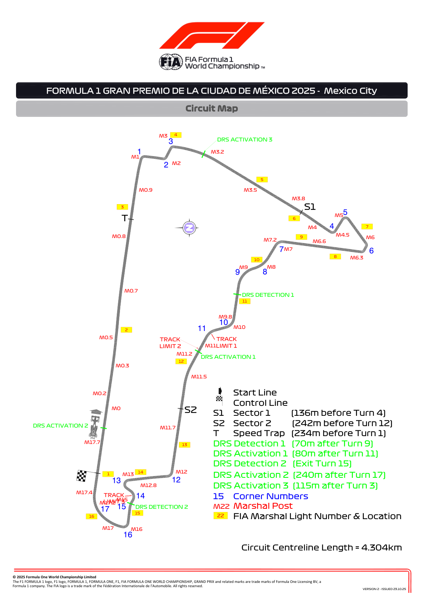
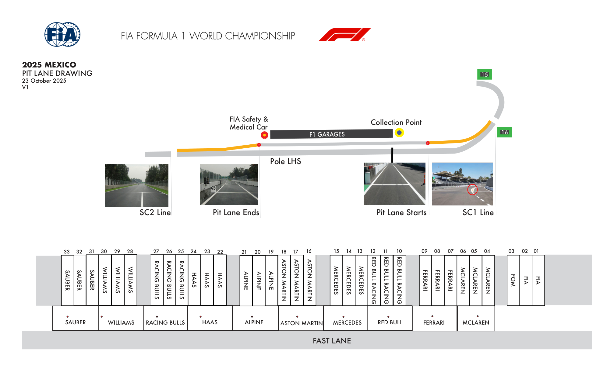
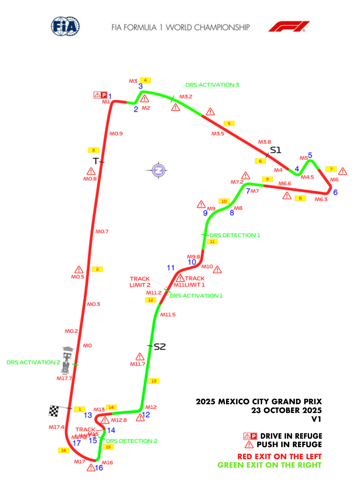
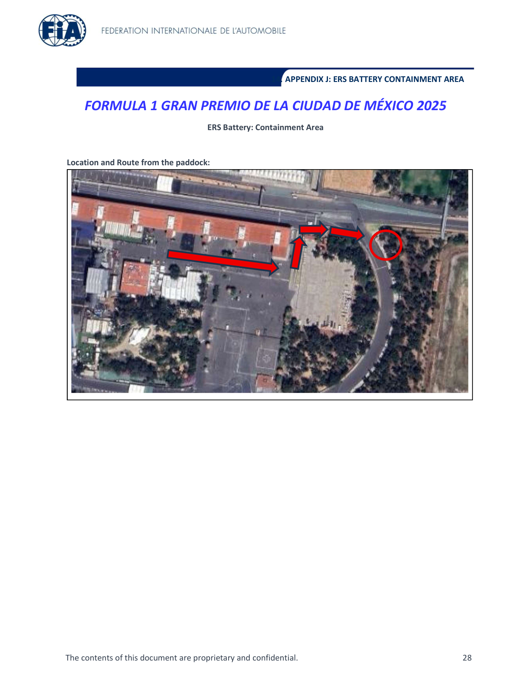
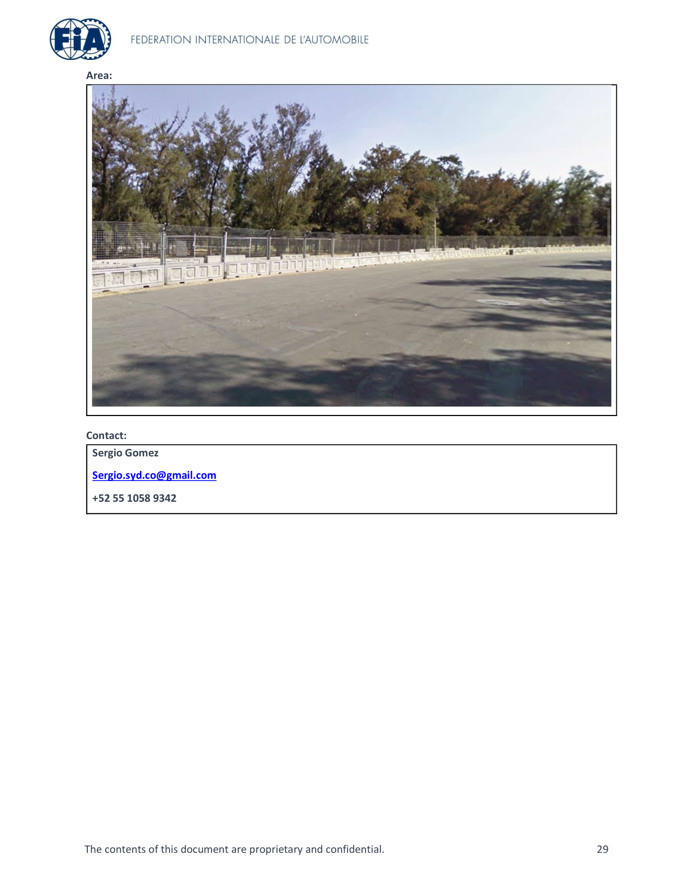

2025 MEXICO CITY GRAND PRIX

24 - 26 October 2025

From The FIA Formula One Race Director Document 3

To All Teams, All Officials Date 23 October 2025

Time 17:17

Title Event Notes - Circuit Map, Pit Lane Drawing, Emergency Exits Map and Quarantine Zone Area

Description Event Notes - Circuit Map, Pit Lane Drawing, Emergency Exits Map and Quarantine Zone Area

Enclosed Maps.pdf

Rui Marques

The FIA Formula One Race Director

