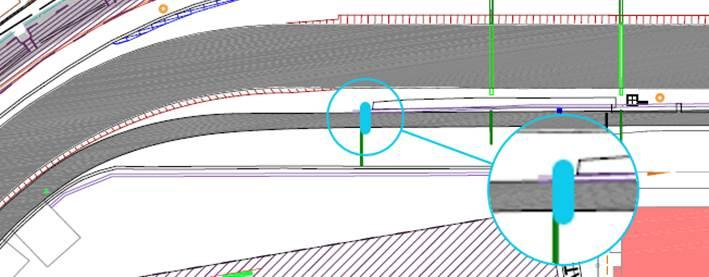
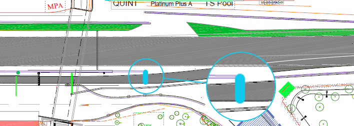
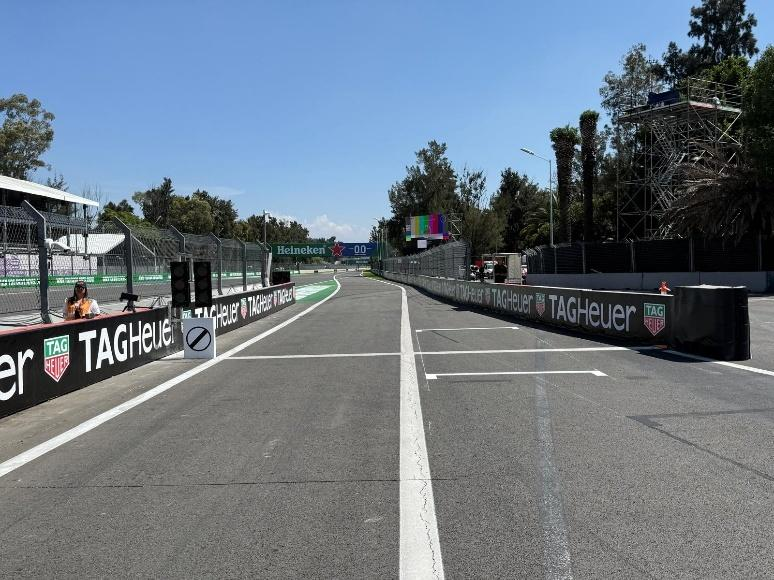
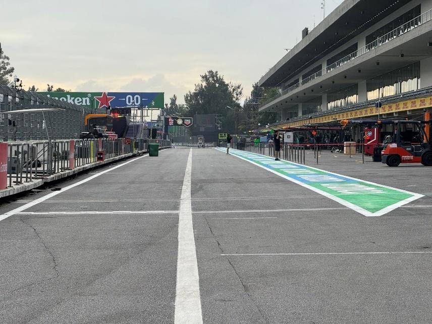
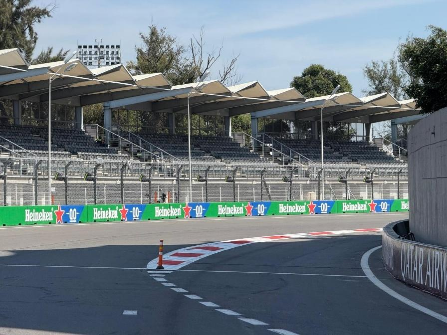
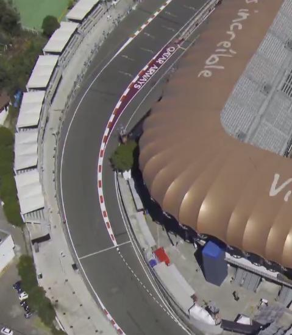
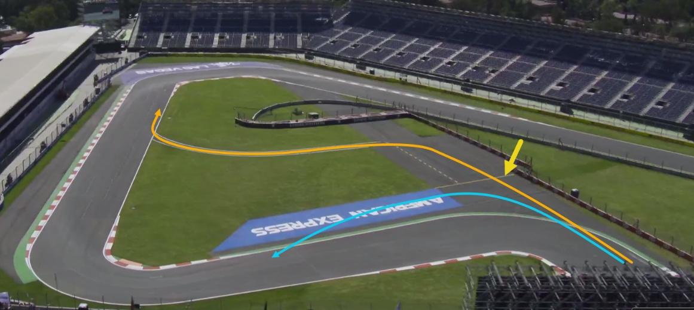
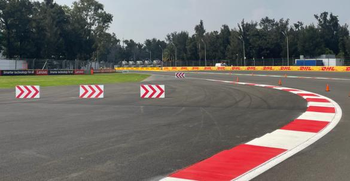
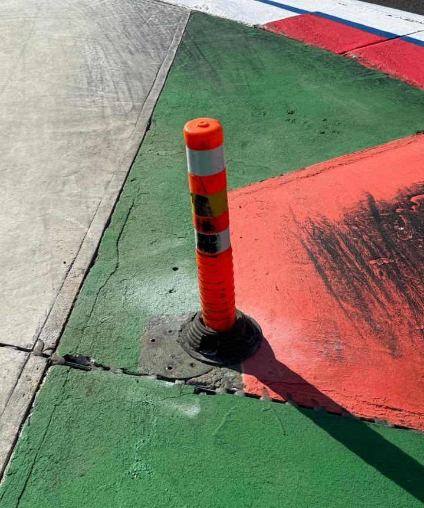
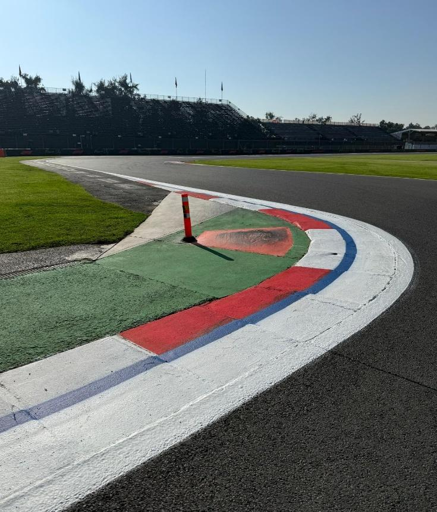

2025 MEXICO CITY GRAND PRIX

24 - 26 October 2025

From The FIA Formula One Race Director Document 20

To All Teams, All Officials Date 25 October 2025

Time 09:32

Title Race Director's Event Notes V3

Description Race Director's Event Notes V3

Enclosed 2025 Mexico City Grand Prix Event NotesV3.pdf

Rui Marques

The FIA Formula One Race Director

2025 M C G P EXICO ITY RAND RIX

24 – 26 October 2025

From The FIA Formula One Race Director

To All Officials, All Teams Date 25 October 2025

EVENT NOTES V3 General Instructions

1. Laps during Qualifying Sessons and Reconnaissance Lap(s), In order to ensure that cars are not driven unnecessarily slowly on in laps during and after the end of the Qualifying or during reconnaissance laps when the pit exit is opened for the Race, drivers must stay below the maximum time set by the FIA between the Safety Car lines shown on the pit lane map. Teams and Drivers will be informed of the maximum time after the Practice Session 2. For the safe and orderly conduct of the Event, other than in exceptional circumstances accepted as such by the Stewards, any driver that exceeds the maximum time from the Second Safety Car Line to the First Safety Car Line on ANY lap during and after the Qualifying sessions, including in- laps and out-laps or during reconnaissance laps when the pit exit is opened for the Race, may be deemed to be going unnecessarily slowly. For the avoidance of doubt, this does not supersede Articles 33.4 and 37.5 of the FIA Formula One Sporting Regulations, which apply to the entire Circuit, furthermore this includes the pit lane as well. Incidents will normally be investigated after the Qualifying sessions or the Race.

2. Parc Fermé

The Parc Fermé cameras must be always uncovered and operational during the Event.

3. Lapping during the Race

The International Sporting Code (ISC) requires drivers who are caught by another car to allow the faster driver past at the first available opportunity. The F1 marshalling system will be set to give a pre-warning when the faster car is within 3.0s of the car about to be lapped, this should be used by the team of the slower car to warn their driver he is soon going to be lapped and that allowing the faster car through should be considered a priority. When the faster car is within 1.2s of the car about to be lapped blue light panels will be shown to the slower car (in addition to blue light panels, blue cockpit lights and a message on the timing monitors) and the driver must allow the following driver to overtake at the first available opportunity.

4. Article 55.15 Sporting Regulations

“In order to avoid the likelihood of accidents before the safety car returns to the pits, from the point at which the lights on the car are turned out drivers must proceed at a pace which involves no erratic acceleration or braking nor any manoeuvre which is likely to endanger other drivers or impede the restart”.

1

5. ERS safety check after covers off In accordance with the provisions of Article 40.2 k of the Sporting Regulations, as work required by the Technical Delegate; Each morning, immediately after covers are removed when the cars are under parc fermé conditions (Articles 40.7 and 40.8), all Teams must connect the umbilical to their cars and start a telemetry data logging for the sole purpose of checking the car ERS safety status.

6. Pit Lane Safety Article 26.3 of the Sporting Regulations states: “Save where these Sporting Regulations require

otherwise, pit lane and track discipline and safety measures will be the same for all Free Practice

sessions, the Qualifying session as for the Race.” Additionally, Article 34.13 of the Sporting

Regulations states: “Team personnel are only allowed in the pit lane immediately before they are

required to work on a car and must withdraw as soon as the work is complete.”

For the safe and orderly conduct of the event, in the context of the race only, the requirements of

Article 34.13 are considered to apply until such time as all cars able to do so have completed the

Race and have entered the designated Parc Ferme area. Following the end-of-session signal,

described in Article 59.1, and when the Race Director considers it safe to do so, the message “ALL

PASS HOLDERS MAY ACCESS THE PIT LANE” will be sent to all competitors using the official

messaging system; this being the signal to all competitors that the requirements of Article 34.13

are no longer applicable, and thus holders of passes not valid for access to the Pit Lane (i.e. passes

other than those marked “Pit Lane” or “Pit Lane All Times”) may enter the pit lane.

Competitors are reminded that in accordance with the International Sporting Code, Article 9.15.1

“The Competitor shall be responsible for all acts or omissions on the part of any person taking part

in, or providing a service in connection with, a Competition or a Championship on their behalf,

including in particular their employees, direct or indirect, their Drivers, mechanics, consultants,

service providers, or passengers, as well as any person to whom the Competitor has allowed

access to the Reserved Areas.

7. Lap times in each Practice Sessions, Qualifying sessions and the Race Only lap times which have been completed on the track will be included for the purpose of any classification.

8. Finishing the Race For the purpose of finishing the Race, pursuant to Article 59.1 of the FIA Formula One Sporting Regulations, the “Line” referred to will be the Control Line on the track and not in the Pit Lane.

Event Specific Instructions

9. Marshalling System 9.1 A car entering the Pit Lane will be subject to the marshalling state (i.e. yellow flag or double yellow flag) of the associated sector until it passes the blue line marked on the image below. (image below updated)

2

9.2 A car leaving the Pit Lane will be subject to the marshalling system state i.e. yellow flag or double yellow flag of the sector into which it is emerging after it passes the blue line marked on the image below.

10. Specific Technical Procedures

Please note that the FIA have introduced an Appendix Index File which contains all the relevant and active Appendix documents, Technical and Sporting Directives. The latest version of this Index file (“2025 Formula 1 Appendix – iss 13 – 2025-10-10.xlsx”) and all relevant documents can be found on the FIA SFTP site.

Competitors are hereby required to ensure compliance with these directives for the safe and orderly conduct of the Event.

11. Support Races team barrier placement and movements Team barrier placement prior to and during support category sessions. No more than five (5) meters from the garages. Please ensure that your pit stop gantry arms are moved back towards the garage during all support category activities. Support Category competition vehicles will be released from the marshalling area no earlier than 15 minutes prior to the opening of Pit Exit for their respective sessions.

12. Practice starts 12.1 During the Free Practice sessions and the reconnaissance laps prior to the Race, practice starts may be carried out in the merging lane to the right-hand side of the fast lane, using one of the painted grid boxes shown in the image below. Cars queuing to perform a practice start must be in the merging lane, to allow sufficient space for cars not wishing to do a practice start to pass.

3

12.2 For the avoidance of doubt, practice starts may not be carried out during the Qualifying Session. 12.3 Practice starts after the Free Practices will be performed according to Article 38.3 of the Sporting Regulations. 12.4 If the Free Practice session is resumed with less than 2 minutes remaining, for the purpose of facilitating practice starts on the grid as provided for in Article 38.3 of the Sporting Regulations, any car wishing to leave the pit lane must proceed down the pit lane without undue delay and exit the pit lane without leaving a significant gap to the car ahead.

13. Article 34.8 Sporting Regulations (…) Any car(s) driven to the end of the pit lane prior to the start or re-start of a Free Practice session, Qualifying session must form up in a line in the fast lane and leave in the order they got there (…) It is noted that a car will be considered to be “in the fast lane” when a tyre has crossed the solid white line separating the fast lane from the inner lane, in this context crossing means that all of a tyre should be beyond the far side, with respect to the garages, of the line separating the fast lane from the inner lane.

For the avoidance of doubt, ISC Appendix L, Chapter IV, Article 5b) states that: Once a car has left its garage or pit stop position it should blend into the fast lane as soon as it is safe to do so, and without unnecessarily impeding cars which are already in the fast lane. Thus, after the start or re-start of the Free Practice sessions, Qualifying session, if there is a suitable gap in a queue of cars in the fast lane, such that a driver can blend into the fast lane safely and without unnecessarily impeding cars already in the fast lane, they are free to do so. Furthermore, it is noted that during the Free Practice session, Qualifying session a car driving in the inner lane, parallel to the fast lane, will not be considered to have blended into the fast lane at

4

the earliest opportunity. Additionally, ISC Appendix L, Chapter IV, Article 5d) states that: Cars in either the fast lane or working lane may not overtake other cars in the fast lane except in exceptional circumstances. In this context a “stopped car” is one which has an obvious mechanical problem.

14. Lines at the Pit Entry and Pit Exit 14.1 In accordance with Chapter 4, Articles 4 and 6 of Appendix L to the ISC drivers must follow the procedures at pit entry and pit exit. 14.2 Pertaining to Chapter 4, Article 4 of Appendix L to the ISC any driver passing to the right hand side of the bollard at pit entry will be considered as entering the pit lane.

14.3 During the reconnaissance laps prior to the Race drivers are allowed to cross the white line separating the pit exit road from the circuit. 14.4 For the safety and ordely conduct of the event, no part of a tyre of a car entering the pit lane may cross the white line painted on the left hand side of the pit entry road (as highligted in the picture below). For the avoidance of doubt, crossing means that the outside of any tyre should not go beyond the outside, with respect to the pit entry road, of this line.

5

15. Stopping the Qualifying Session For the safe and orderly conduct of the event, should any period of the Qualifying Session be stopped with less than 75 seconds remaining, the Race Director with the agreement of the Stewards may decide that the relevant period of the Qualifying session will not be resumed, i.e. that part of the competition will be stopped.

16. Post Qualifying Session drivers weighing Any driver who has finished participating in the Qualifying Session after Q1 or Q2 must proceed through the pit lane directly to the FIA scales immediately after they have returned to their team’s garage. The drivers may not drink anything or do anything which increases their weight before it is recorded by the FIA. Any driver who stops on the track during the Qualifying sessions and is not required to visit the Medical Centre must proceed to the FIA scales to get their weight recorded before returning to his team. Drivers who finish within the top 10 must proceed to the FIA scales immediately when out of their cars without contact with any other person.

17. DRS during Free Practice sessions, Qualifying Sessions and the Race DRS Detection will be automatically disabled in each individual zone if any of the light panels in that zone are displaying yellow.

The zone and corresponding light panels are as follows: a) DRS activation 1: 11, 12, 13 b) DRS activation 2: 1, 2, 3 c) DRS activation 3: 4, 5, 6

18. Track Limits 18.1 In accordance with the provisions of Article 33.3 of the Sporting Regulations, the white lines define the track edges. During Qualifying and the Race, each time a driver fails to negotiate the lap within the track limits, this will result in that lap time being invalidated by the Stewards. Additionally, if a driver fails to negotiate turn 17, this may result in that lap time and the immediately following lap time being invalidated by the Stewards. 18.2 For the safe and orderly conduct of the event, any driver who misses the apex of Turn 4, enters the run-off area, and crosses the solid yellow line painted across the run-off area (yellow arrow in the image below) with all 4 wheels may only re-join the circuit after Turn 5 using the asphalt rejoin route (highlighted orange in the image below). Drivers may only use the grass if it is clearly unavoidable.

18.3 Any driver whose car passes completely behind the red and white kerb at the apex of Turn 11 must re-join the track by keeping to the right of the first polystyrene block arrangement and then wholly to the left of the second polystyrene block parallel to the on the exit of the corner.

6

19. Unsafe or Unknown ERS Status If the status of the ERS changes to unsafe or unknown, the relevant team will be required to send mechanics to the race control door area, in the pit lane side. They will then be picked up by car to be brought to their car at the end of the session.

20. Leaving the garage before and during all Practice Sessions 20.1 Before the start of the Practice Sessions, Qualifying Session no cars may enter the pit lane to proceed to pit exit until 5 minutes before the start of the session. 20.2 If the Free Practice Sessions, Qualifying Session is suspended, cars may only enter the Fast Lane after the re-start time is confirmed via the official messaging system.

21. Fire extinguishers around the circuit Indicated by white boards with a red fire extinguisher attached to the debris fences.

22. Places to remove cars from the track Indicated by fluorescent orange panels/paintings on the barriers.

23. Removing cars from the grid Cars may be removed from the grid through the gates adjacent to the grid positions 6 and 18.

24. Race Suspension or Starting Procedure Suspension In case of Race suspension or Starting Procedure suspension, (except in case of Article 57.2 of the Sporting Regulations – stopping on the grid), cars will be stopped in the fast lane with the first car stopped in the vicinity of the last team garage.

25. Car number light panels for the start On the right-hand side of the grid.

26. Changes to the Circuit - Asphalt grinding at Turn 12 near the 150 meters brake marker.

- Blue line behind the white line added at the turns: 3 apex, 5 apex and exit, 6 apex and exit, 9 apex. - Double the white line at the apex of Turn 2 - The bollard at the apex of Turn 2 was moved closer to the track.

7

27. Parc Ferme after Race The podium cars will stop at Turn 13 for the podium ceremony under parc ferme conditions all the other cars will proceed to pit lane to the parc ferme area.

Rui Marques

The FIA Formula One Race Director

8
