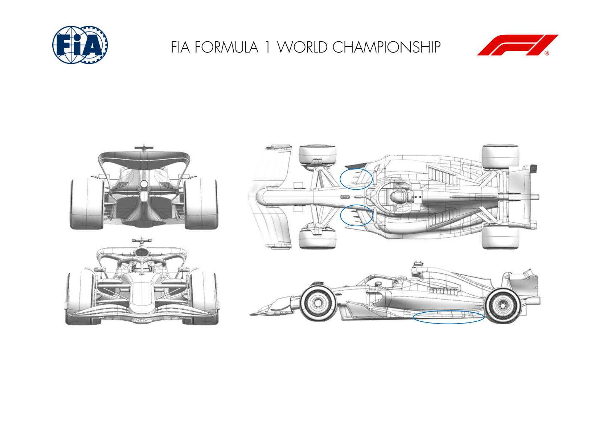
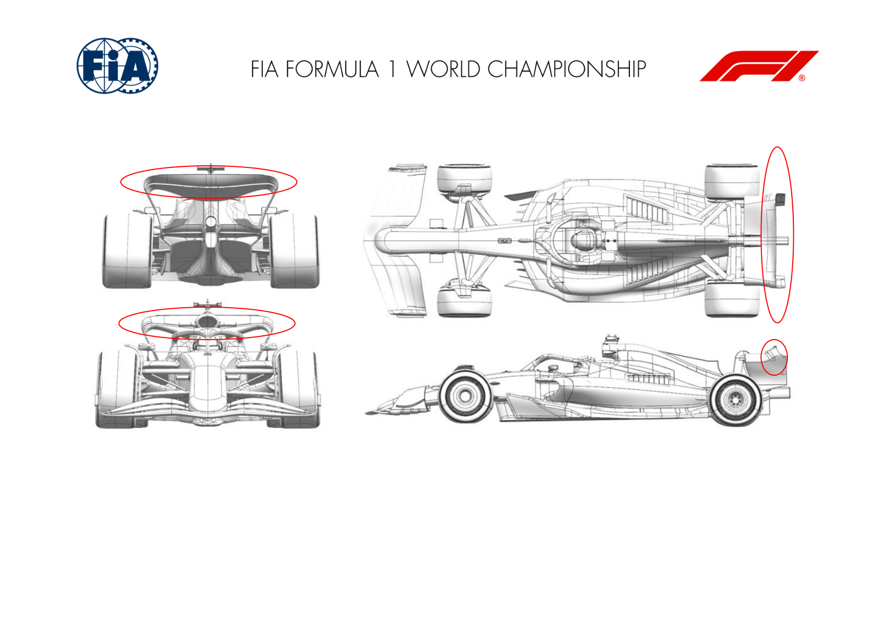
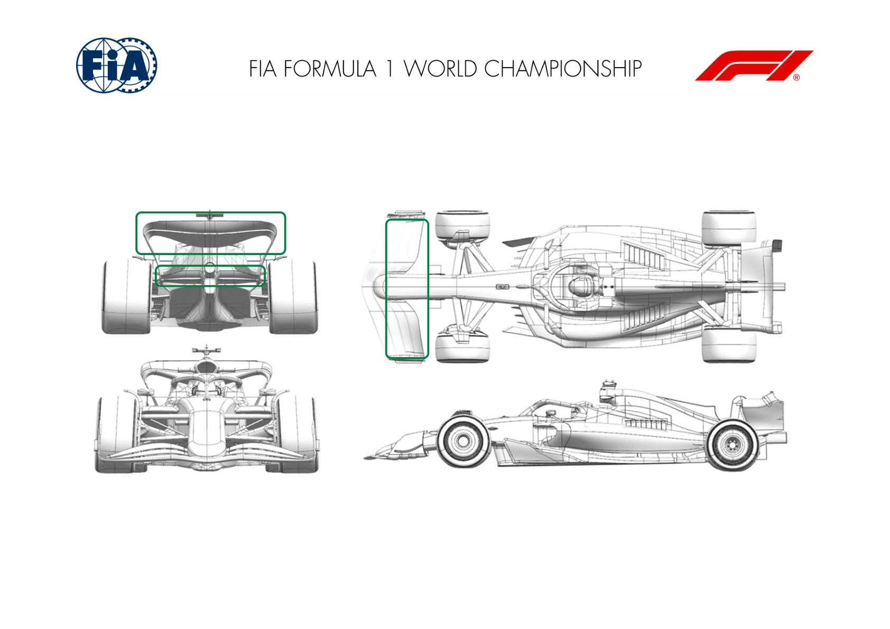
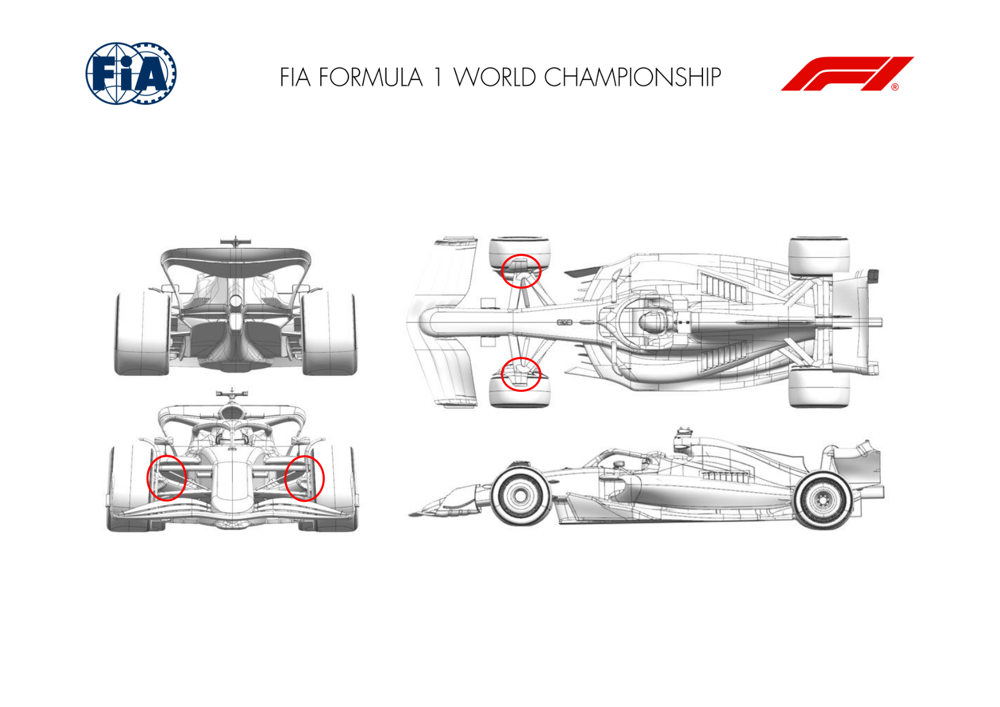
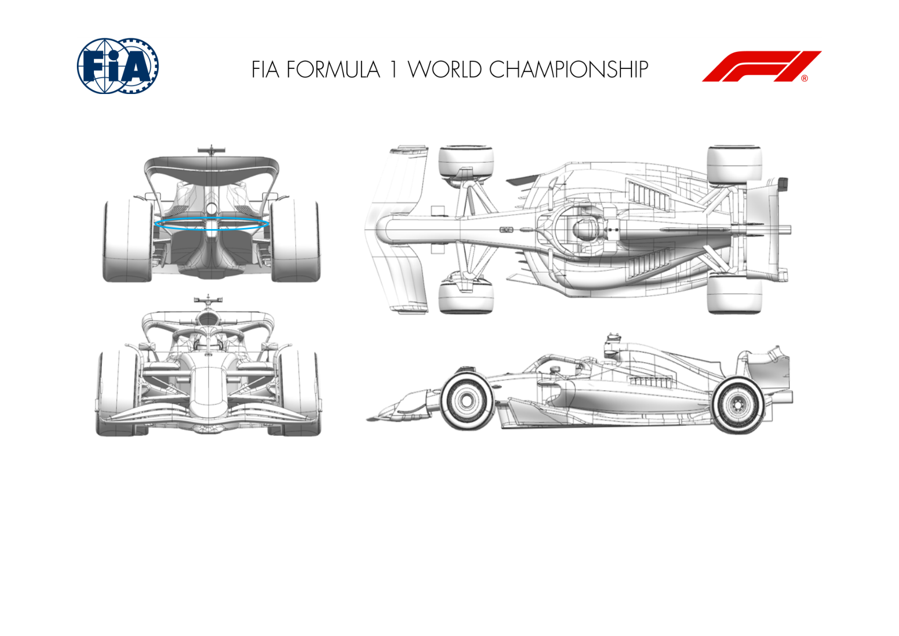
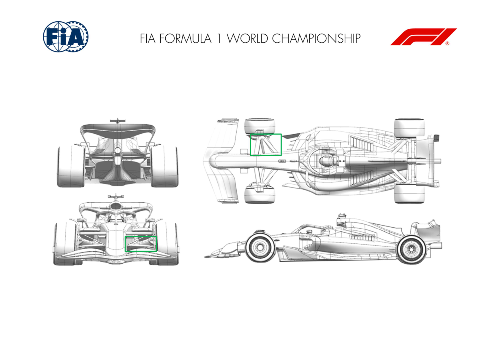

2025 MIAMI GRAND PRIX

02 - 04 May 2025

From The FIA Formula One Media Delegate Document 8

To All Teams, All Officials Date 02 May 2025

Time 09:55

Title Car Presentation Submissions

Description Car Presentation Submissions

Enclosed 2025 Miami Grand Prix - Car Presentation Submissions.pdf

Roman De Lauw

The FIA Formula One Media Delegate

Car Presentation – Miami Grand Prix

McLaren Formula 1 Team

No updates submitted for this event.

Car Presentation – Miami Grand Prix

*SCUDERIA FERRARI HP*

No updates submitted for this event.

Car Presentation – USA Miami Grand Prix

Red Bull Racing

| No. | Updated component | Primary reason for update | Geometric differences | Description |
| --- | --- | --- | --- | --- |
| 1 | Floor Fences | Performance - Local Load | Re-positioned floor fences Re-optimisation of the fences to extract a small increase in load for the same flow stability. |  |
| 2 | Floor Edge | Performance - Local Load | New surfaces with increased camber locally To further optimise, more camber has been applied to the edge wing for more local load. |  |

Car Presentation – 2025 Miami Grand Prix

*Mercedes-AMG PETRONAS F1 Team*

| No. | Updated component | Primary reason for update | Geometric differences | Description |
| --- | --- | --- | --- | --- |
| 1 | Rear wing | Performance – local load/circuit specific | Camber change to flap. | A circuit specific flap update. Reduced camber aimed at reducing local downforce and drag along an efficiency slope appropriate for Miami. |

Car Presentation – Miami Grand Prix

Aston Martin Aramco F1 Team

| No. | Updated component | Primary reason for update | Geometric differences | Description |
| --- | --- | --- | --- | --- |
| 1 | Front Wing | Circuit specific - Balance Range | Front wing flap with less aggressive profiles. | This flap is lower loaded to reduce the amount of front downforce in proportion to the lower level rear wings typically run at this track. |
| 2 | Rear Wing | Circuit specific - Drag Range | Rear wing with reduced front view area and less aggressive profiles. | This beam wing has lower loading than the previous version and works in conjunction with the upper wing for this event to achieve the required drag range. |
| 3 | Beam Wing | Circuit specific - Drag Range | Single element beam wing. | This is a less aggressive upper wing cascade with lower load and drag than previous versions for use at this circuit efficiency. |

Car Presentation – Miami Grand Prix

BWT Alpine F1 Team

| No. | Updated component | Primary reason for update | Geometric differences | Description |
| --- | --- | --- | --- | --- |
| 1 | Front Corner | Performance - Flow Conditioning | Revised Front Brake Duct | The front brake duct inlet has been re-designed for a local flow optimisation. The new geometry also offers a gain in brake cooling efficiency. |
| 2 | Front Suspension | Performance - Flow Conditioning | Re-profiled Front Suspension Geometry | Members of the front suspension geometry have been re-profiled to optimise the flow quality |

Car Presentation – Miami Grand Prix

*MoneyGram Haas F1 Team*

No updates submitted for this event.

Car Presentation – Miami Grand Prix

Visa Cash App Racing Bulls

No updates submitted for this event.

Car Presentation – JAPANESE Grand Prix

*ATLASSIAN WILLIAMS RACING*

| No. | Updated component | Primary reason for update | Geometric differences | Description |
| --- | --- | --- | --- | --- |
| 1 | Beam Wing | Circuit Specific – Drag Range | The new main beam wing element, which is an optional fit, has a shorter chord than the previous beam wing that ran with this main rear wing assembly. | The shorter chord beam wing works with the main rear wing assembly to efficiently reduce both downforce and drag. The use of this beam wing is a setup option that might be suitable for the layout of the Miami circuit. |

Car Presentation – Miami Grand Prix

Stake F1 Team KICK Sauber

| No. | Updated component | Primary reason for update | Geometric differences | Description |
| --- | --- | --- | --- | --- |
| 1 | Front Suspension | Performance - Flow Conditioning | Updated front suspension cover design | This update regarding the lower wishbone covers is aiming to improve local flow structures travelling all along the car. |

