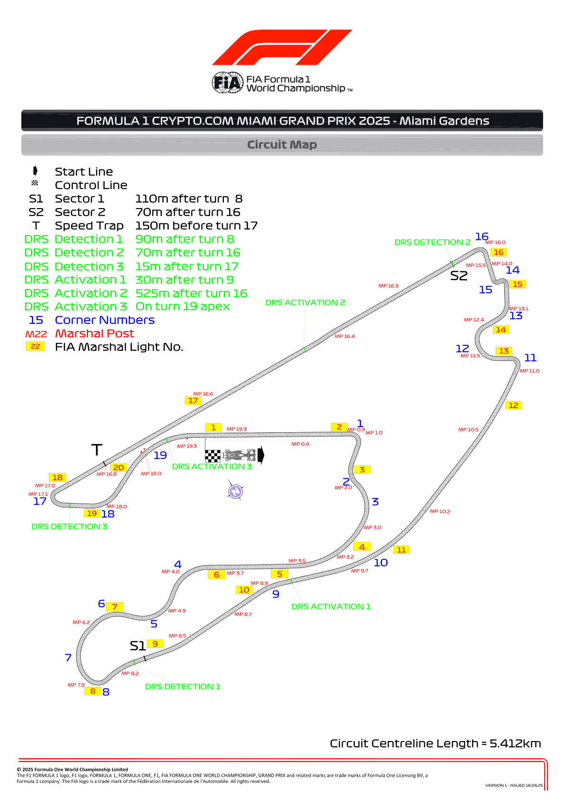
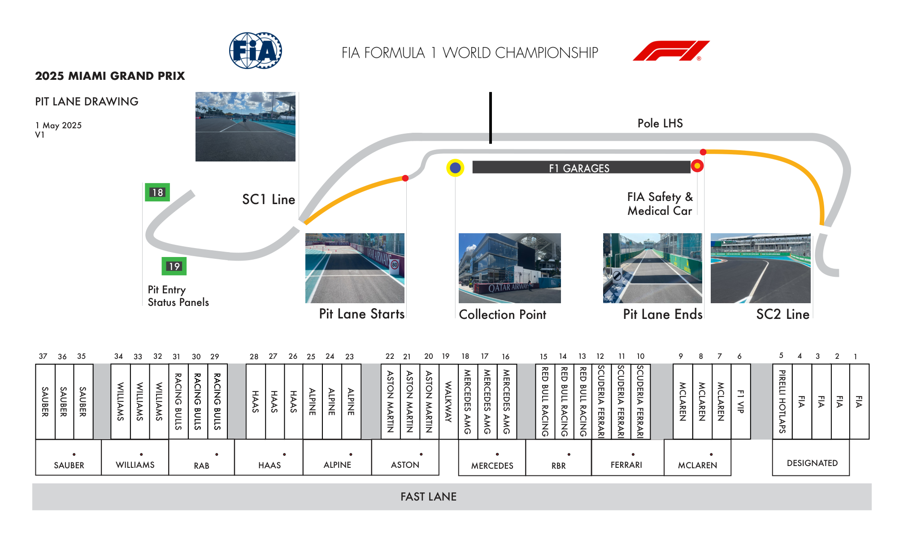
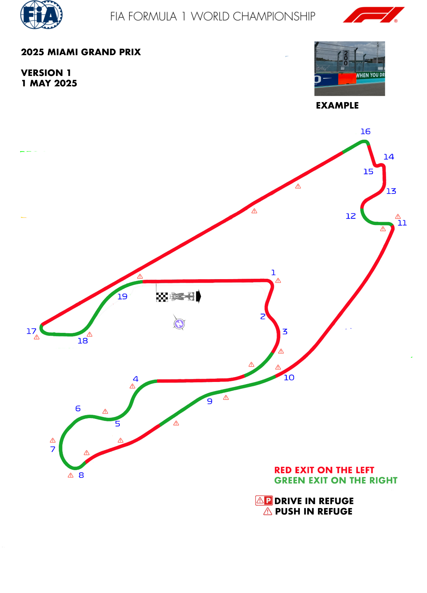
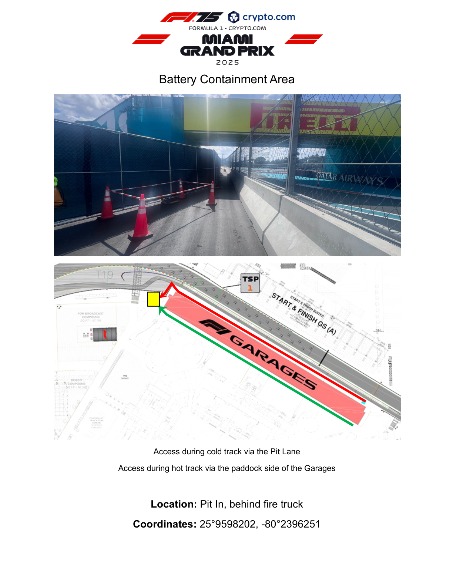
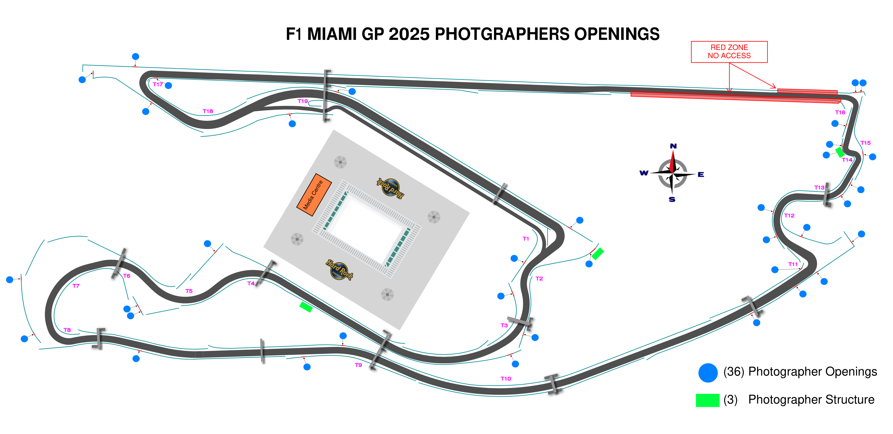

2025 MIAMI GRAND PRIX

02 - 04 May 2025

From The FIA Formula One Race Director Document 5

To All Teams, All Officials Date 01 May 2025

Time 17:57

Title Event Notes - Circuit Map, Pit Lane, Quarantine Zone, Emergency Exits and Red Zones

Description Event Notes - Circuit Map, Pit Lane, Quarantine Zone, Emergency Exits and Red Zones

Enclosed Maps Miami.pdf

Rui Marques

The FIA Formula One Race Director

