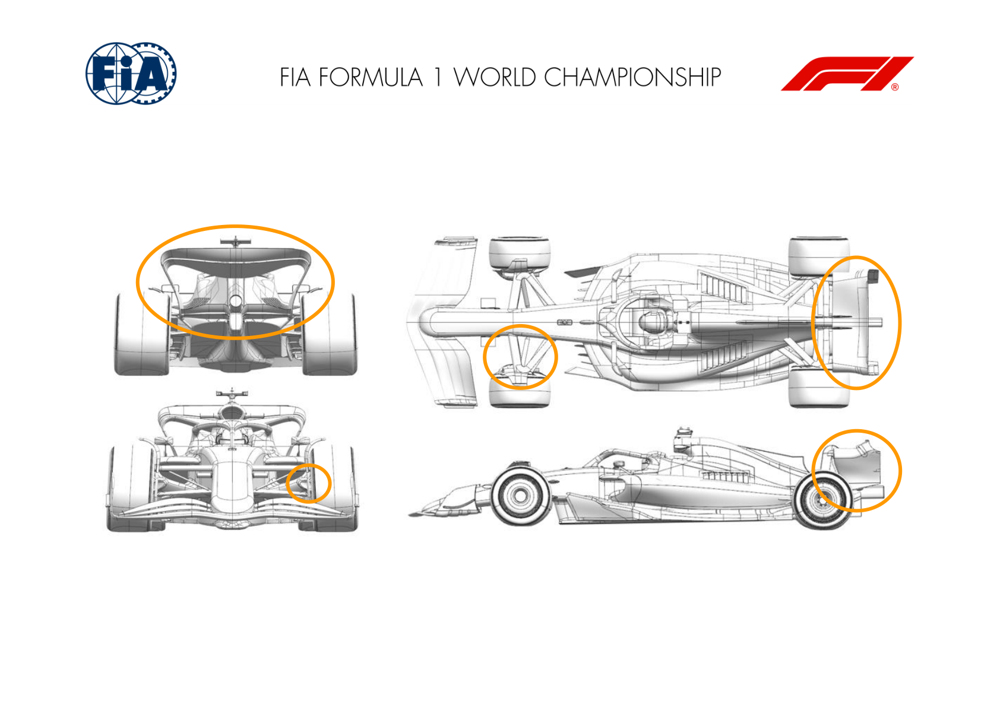
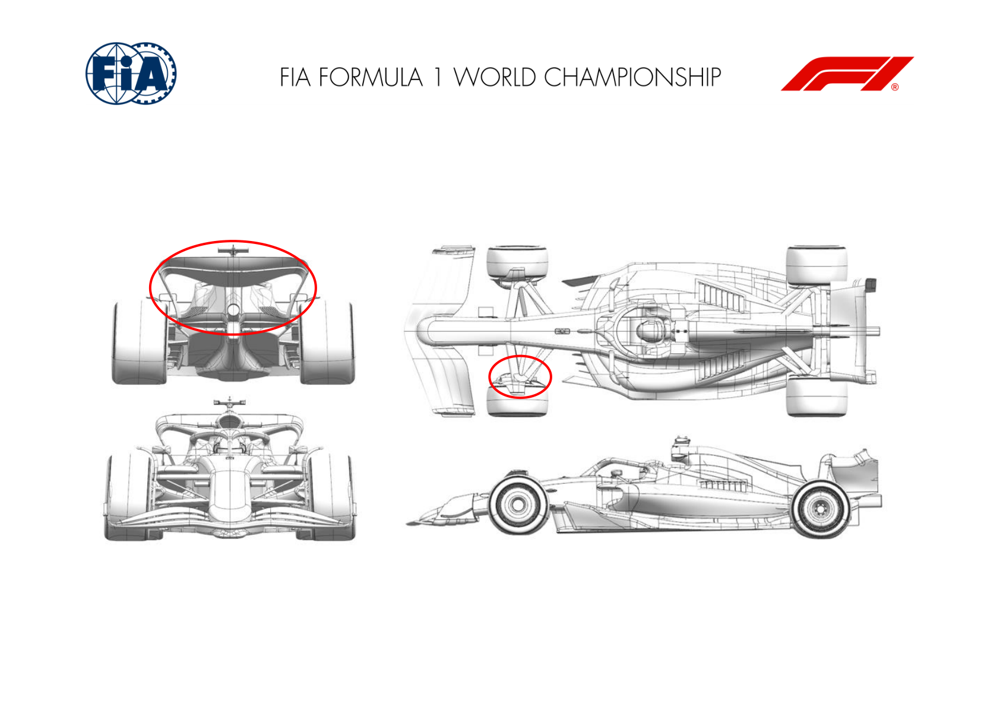
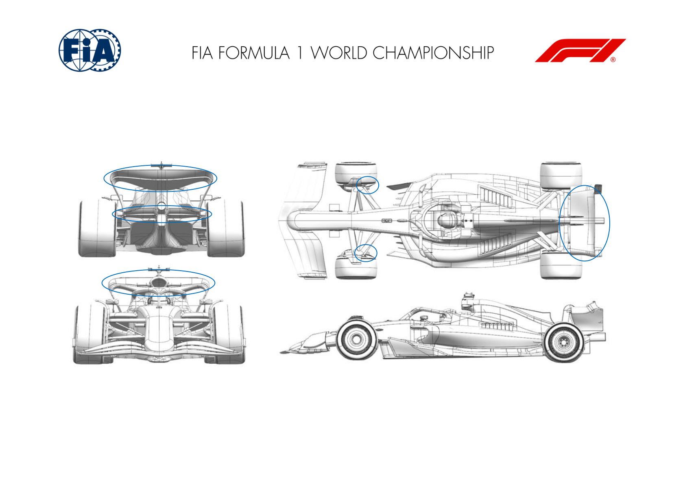
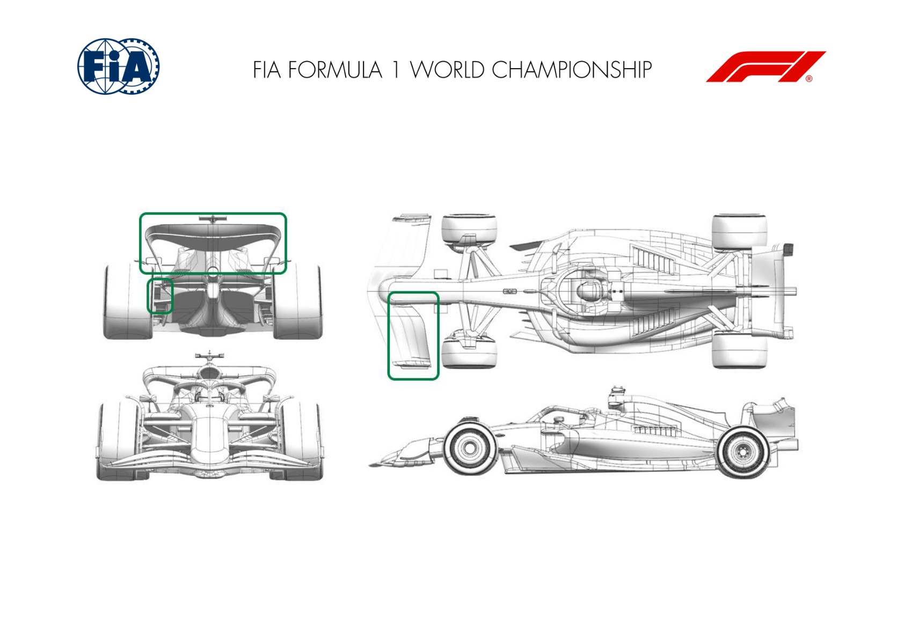
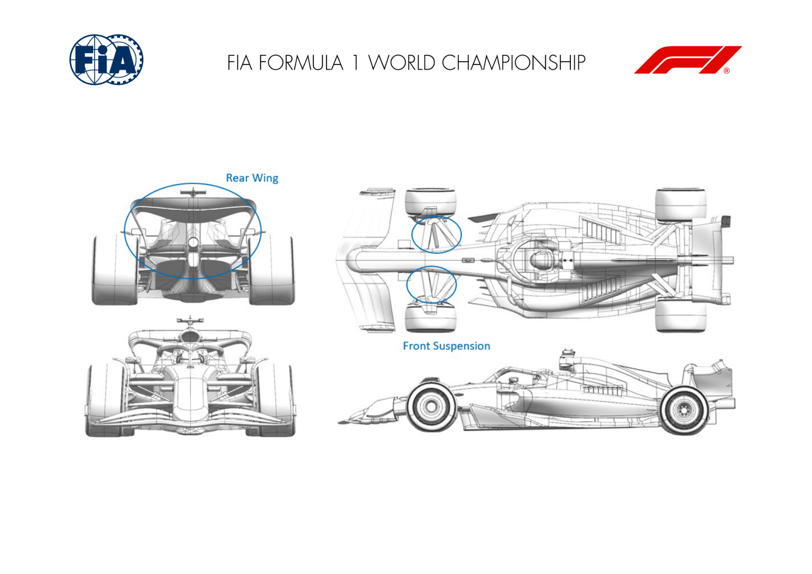
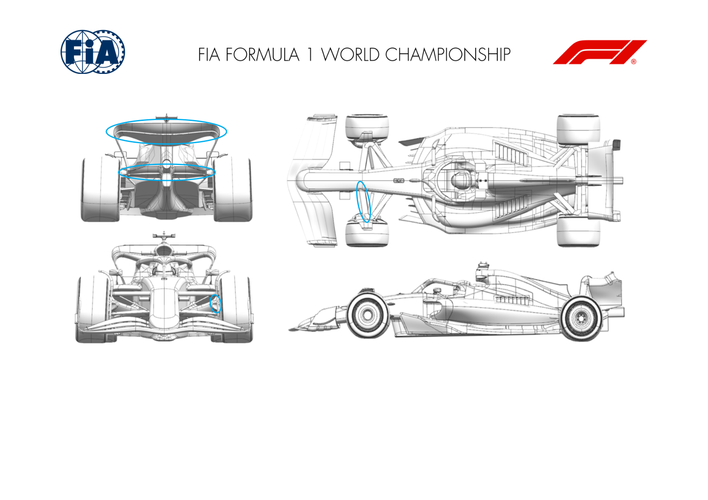
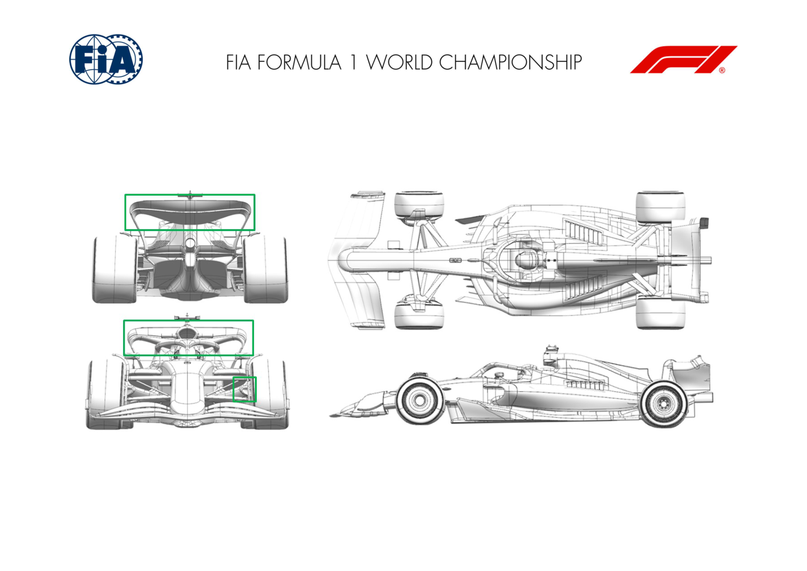

2025 MONACO GRAND PRIX

23 - 25 May 2025

From The FIA Formula One Media Delegate Document 11

To All Teams, All Officials Date 23 May 2025

Time 11:28

Title Car Presentation Submissions

Description Car Presentation Submissions

Enclosed 2025 Monaco Grand Prix - Car Presentation Submissions.pdf

Roman De Lauw

The FIA Formula One Media Delegate

Car Presentation – Monaco Grand Prix

McLaren Formula 1 Team

| No. | Updated component | Primary reason for update | Geometric differences | Description |
| --- | --- | --- | --- | --- |
| 1 | Rear Wing | Circuit specific - Drag Range | Medium-High Downforce Rear Wing | A medium-high Downforce Rear Wing sitting between the medium and high downforce Rear Wing assemblies has been made available for this track, featuring an efficient reduction in Drag compared to the high downforce wing. |
| 2 | Beam Wing | Circuit specific - Drag Range | Medium-High Downforce Beam Wing | In order to ensure the high downforce Rear Wing assembly is suitable across multiple circuits, a Beamwing with medium-high level of load has been designed alongside the aforementioned assembly. |
| 3 | Beam Wing | Circuit specific - Drag Range | Medium Downforce Beam Wing | In order to ensure the high downforce Rear Wing assembly is suitable across multiple circuits, a Beamwing with a medium level of load has been designed alongside the aforementioned assembly. |
| 4 | Front Suspension | Performance - Mechanical Setup | Front Suspension Geometry Update | In order to deal with the unique cornering challenges that this circuit brings, the front suspension geometry has been modified. |
| 5 | Front Corner | Circuit specific - Cooling Range | Increased Front Brake Cooling Option | Given the significant brake cooling demand of this circuit, an option to increase brake cooling on the front axle is available to deploy should this be required. |

Car Presentation – Monaco Grand Prix

*SCUDERIA FERRARI HP*

| No. | Updated component | Primary reason for update | Geometric differences | Description |
| --- | --- | --- | --- | --- |
| 1 | Front Suspension | Circuit specific | Modification to trackrod / suspension fairings and FBD scoop clearance Monaco specific front suspension and corner modifications to allow for greater single wheel angle necessary on this particular circuit layout |  |
| 2 | Front Corner |  |  |  |
| 3 | Beam Wing | Circuit specific - Drag Range | Higher Downforce Top Rear Wing and Lower Rear Wing designs Introduction of more loaded Top and Lower Rear Wing main and flap profiles, carried over from 2024. This is track specific, with the aim to cover the low aerodynamic efficiency requirements of the Monaco street circuit. |  |
| 4 | Rear Wing |  |  |  |

Car Presentation – Monaco Grand Prix

Red Bull Racing

| No. | Updated component | Primary reason for update | Geometric differences | Description |
| --- | --- | --- | --- | --- |
| 1 | Rear wing | Performance - Local Load | Enlarged rear wing upper and beam, for camber and chord | The Monaco circuit rearwards aerodynamic load and the enlarged rear wing plus beam wing provides this at the lower car speeds encountered |
| 2 | Front Suspension | Reliability | Revised wishbone faring To attain greater steering lock, the lower wishbone fairing has been altered to clear the wheel |  |
| 3 | Front Corner | Reliability | Revised exit duct and gaitor | To attain the necessary cooling for the front brakes, a larger exit duct is available with a consequential trim to the gaitor sealing the upper wishbone. |

Car Presentation – 2025 Monaco Grand Prix

*Mercedes-AMG PETRONAS F1 Team*

No updates submitted for this event.

Car Presentation – Monaco Grand Prix

Aston Martin Aramco F1 Team

| No. | Updated component | Primary reason for update | Geometric differences | Description |
| --- | --- | --- | --- | --- |
| 1 | Front Wing | Circuit specific - Balance Range | Front wing flap with more aggressive profiles. | This is a higher loaded front wing flap to achieve the desired car setup to balance the more powerful rear wing also introduced at this event. |
| 2 | Rear Wing | Circuit specific - Drag Range | More aggressive rear wing with more surface area. | This rear wing generates more load than the versions which have been used previously this season and is introduced due the characteristics of this circuit. |
| 3 | Rear Corner | Circuit specific - Cooling Range | The inlet is increased and the exit duct and the vanes surrounding it have been revised. | The inlet and exit changes increase flow through the duct and hence cooling. The geometry has increased loading on the surfaces of the devices so raising the local load generated in the area. |

Car Presentation – Monaco Grand Prix

BWT Alpine F1 Team

| No. | Updated component | Primary reason for update | Geometric differences | Description |
| --- | --- | --- | --- | --- |
| 1 | Front Suspension | Performance – Mechanical Setup | New trackrod fairing and supports to suit Monaco racetrack | This modification to the front suspension increases the road wheel angle. This modification is needed for the specific circuit characteristics. |
| 2 | Rear Wing | Circuit specific - Drag Range | More loaded top rear wing main plane | The top rear wing is more loaded, delivering more downforce and offering the best lap-time for the specific circuit characteristics of Monaco |
| 3 | Beam Wing | Circuit specific - Drag Range | Rear beam wing designed to work with the top rear wing update | Similar to the rear wing, the beam wing features more load with the objective of delivering the best lap-time around Monaco. |

w

Car Presentation – 2025 Monaco Grand Prix

MONEYGRAM HAAS F1 TEAM

| No. | Updated component | Primary reason for update | Geometric differences | Description |
| --- | --- | --- | --- | --- |
| 1 | Rear Wing | Performance - Local Load | More cambered RW profile cluster | This circuit-specific rear wing uses the full regulation box to maximize downforce, accepting the associated drag increase, which is less penalizing in Monaco compared to other circuits |
| 2 | Beam Wing | Performance - Local Load | More cambered Lower Rear Wing Profiles | This option is tailored to operate with the more aggressive rear wing design, continuing to aim for increased downforce. |
| 3 | Front Suspension | Performance - Mechanical Setup | Front Trackrod position | A minor adjustment to the front trackrod was needed to meet the circuit-specific steering angle requirements. |

Car Presentation – Monaco Grand Prix

Visa Cash App Racing Bulls

| No. | Updated component | Primary reason for update | Geometric differences | Description |
| --- | --- | --- | --- | --- |
| 1 | Front Corner | Circuit specific – Mechanical Setup | The shape of the cooling exit duct and trackrod ends has been adjusted to increase clearance for high steer angles | The steering angle required at Monaco increases the clearance requirements between suspension & these clearance issues with a minimal change on aerodynamic performance. |
| 2 | Beam Wing | Circuit specific - Drag Range | A new double-element high downforce beam wing. | The highly cambered and high incidence elements increase the downforce generated by the beam wing, whilst aerodynamically supporting the flow attachment of the upper wing. |
| 3 | Rear Wing | Circuit specific - Drag Range | A new max downforce upper wing. | The camber of the upper wing profiles is increased to maximise the load generated. The tip shape helps to improve the overall efficiency. |

Car Presentation – MONACO Grand Prix

*ATLASSIAN WILLIAMS RACING*

| No. | Updated component | Primary reason for update | Geometric differences | Description |
| --- | --- | --- | --- | --- |
| 1 | Rear Wing | Circuit specific - Drag Range Circuit specific Drag Range | The rear wing for Monaco is a larger wing overall with a high angle of attack. It is the 2024 RWing that we ran in Monaco last year. | The larger upper rear wing delivers more downforce and drag than the medium downforce wing that we raced in, for example, Imola. The increase in downforce and drag is achieved at an efficiency that is suitable to street circuits such as Monaco. |
| 2 | Beam Wing | Circuit specific - Drag Range | The beam wing that compliments the high downforce The larger beam wings and pylon wing work together to generate more downforce and drag than the medium downforce versions. They also support the flow to the upper elements to ensure that they work efficiently and remain stable. upper rear wing is larger than the previous version. It is also a 2024 geometry. There is also a Fwd RLW element downforce assembly. A small pylon wing completes this rear wing assembly. | The larger beam wings and pylon wing work together to generate more downforce and drag than the medium downforce versions. They also support the flow to the upper stable. |
| 3 | Front Suspension | Performance - Mechanical Setup | There are some modifications to the front steering This minor mechanical adjustment allows a greater rotation of the road wheels for a given rotation of the steering wheel. This update provides the steering lock required to tackle the hairpin in Monaco. geometry that are Monaco specific. Although physically new parts for 2025, they mimic the changes that we routinely make for this circuit. The modifications permit boot surfaces to accommodate the additional steering. |  |
| 4 | Front Corner | Circuit specific - Cooling Range | There is a larger exit available for the front brake duct. This increases the brake disc/caliper cooling, which is appropriate for Monaco. | The larger exit simply allows more air to flow through the brake duct assembly and therefore provides more cooling to lower straight-line speed in Monaco and the increased brake duty. |

Car Presentation – Monaco Grand Prix

Stake F1 Team KICK Sauber

| No. | Updated component | Primary reason for update | Geometric differences | Description |
| --- | --- | --- | --- | --- |
| 1 | Rear Wing | Circuit specific - Drag Range | High downforce rear wing assembly | For this specific track and future events, we have introduced a new high-downforce rear wing assembly, which efficiently increases load. |
| 2 | Front Corner | Circuit specific - Cooling Range | New front brake duct design | The new design offers an increased brake system cooling flow to accommodate the low average airspeed of this specific track. |

