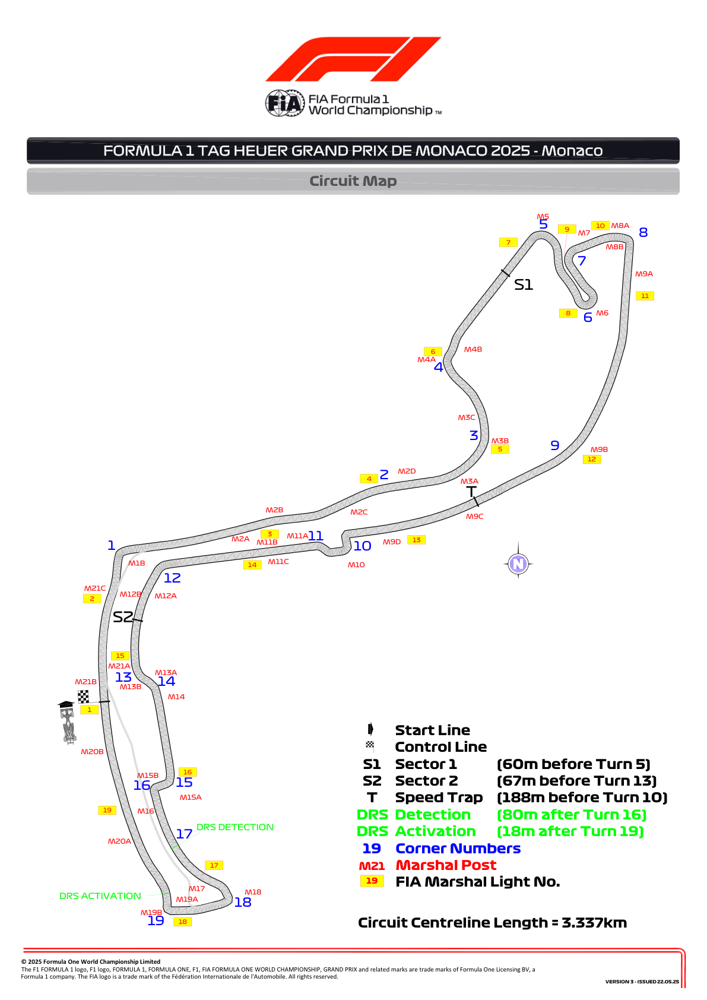
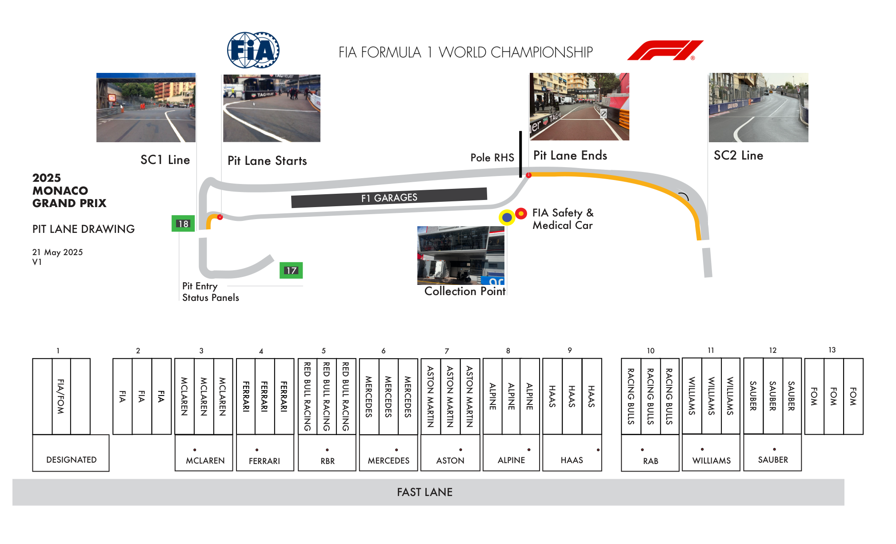
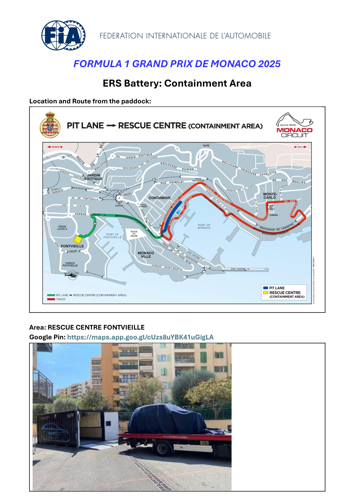
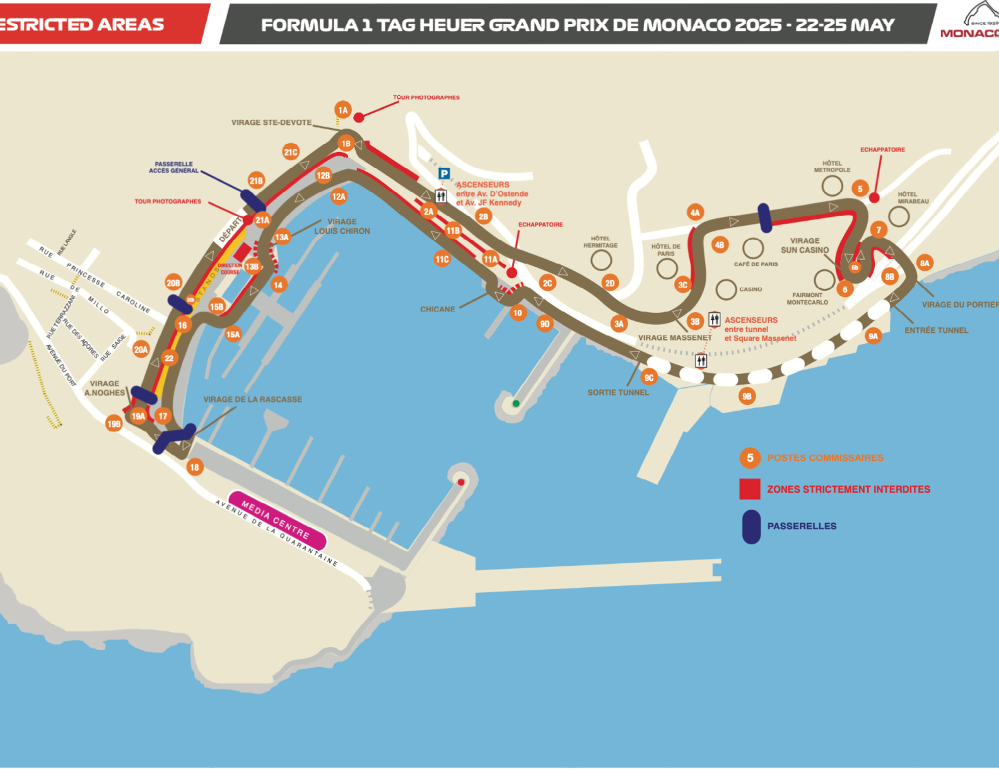

2025 MONACO GRAND PRIX

23 - 25 May 2025

From The FIA Formula One Race Director Document 7

To All Teams, All Officials Date 22 May 2025

Time 19:30

Title Race Director's Event Notes - Circuit Map, Pit Lane Map, ERS Battery Containment Area, Red Zones

Description Race Director's Event Notes - Circuit Map, Pit Lane Map, ERS Battery Containment Area, Red Zones

Enclosed Maps V1.pdf

Rui Marques

The FIA Formula One Race Director

