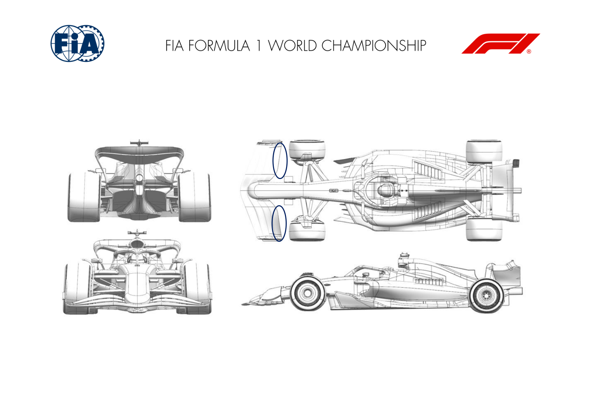

2025 QATAR GRAND PRIX

28 - 30 November 2025

From The FIA Formula One Media Delegate Document 8

To All Teams, All Officials Date 28 November 2025

Time 13:52

Title Car Presentation Submissions

Description Car Presentation Submissions

Enclosed 2025 Qatar Grand Prix - Car Presentation Submissions.pdf

Roman De Lauw

The FIA Formula One Media Delegate

Car Presentation – Qatar Grand Prix

McLaren Formula 1 Team

No updates submitted for this event.

Car Presentation – Qatar Grand Prix

*SCUDERIA FERRARI HP*

No updates submitted for this event.

Car Presentation – R23 Qatar Grand Prix

Red Bull Racing

No updates submitted for this event.

Car Presentation – 2025 Qatar Grand Prix

*Mercedes-AMG PETRONAS F1 Team*

No updates submitted for this event.

Car Presentation – Qatar Grand Prix

Aston Martin Aramco F1 Team

No updates submitted for this event.

Car Presentation – Qatar Grand Prix

BWT Alpine F1 Team

No updates submitted for this event.

Car Presentation – Qatar Grand Prix

*MoneyGram Haas F1 Team*

No updates submitted for this event.

Car Presentation – Qatar Grand Prix

Visa Cash App Racing Bulls

| No. | Updated component | Primary reason for update | Geometric differences | Description |
| --- | --- | --- | --- | --- |
| 1 | Front Wing | Circuit specific - Balance Range | Gurney option for front flap | An optional gurney has been created for the front wing flap, to provide additional front downforce to suit the balance requirements of the circuit. |

Car Presentation – Qatar Grand Prix

*ATLASSIAN WILLIAMS RACING*

No updates submitted for this event.

Car Presentation – Qatar Grand Prix

KICK Sauber F1 Team

No updates submitted for this event.
