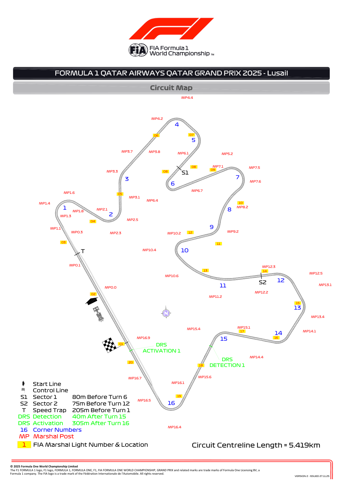
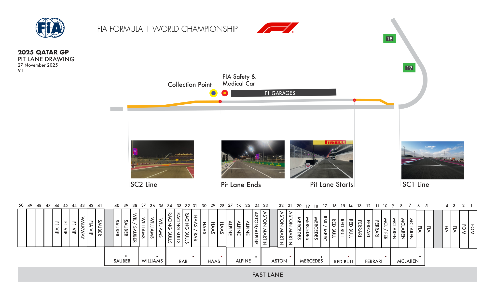
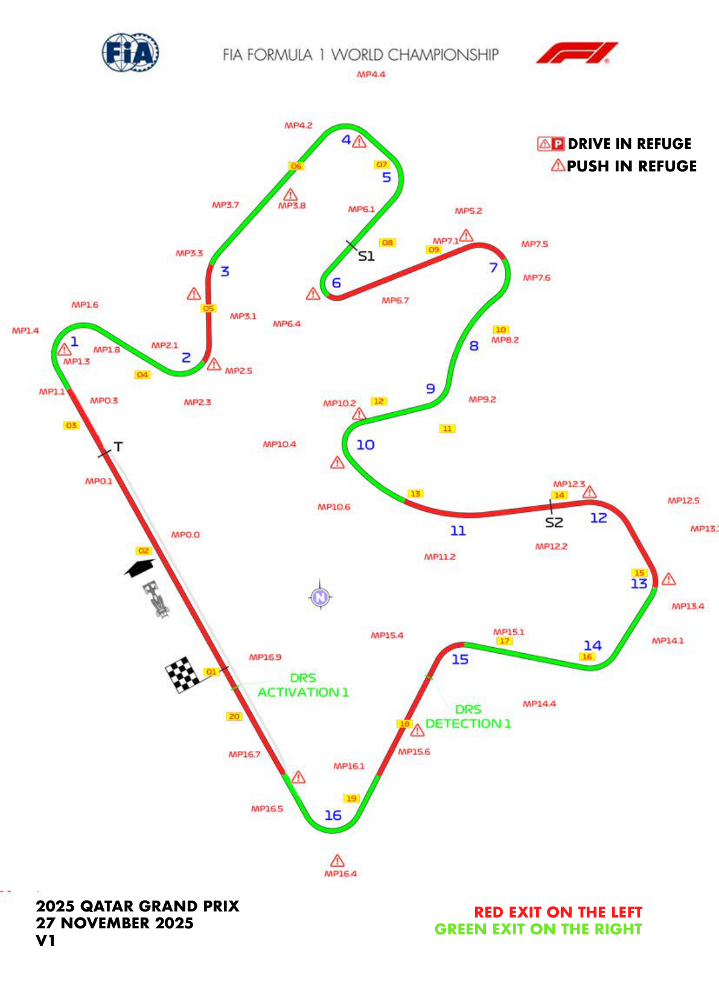
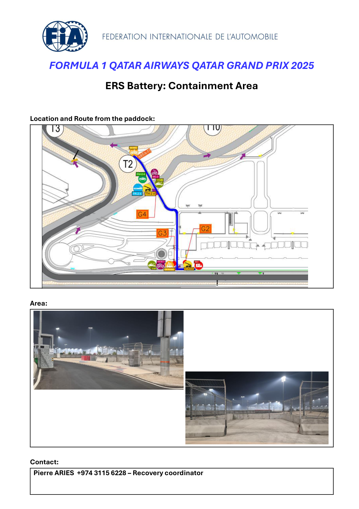
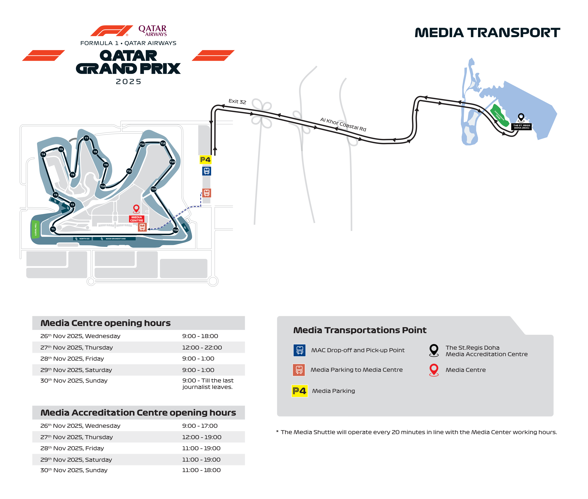

2025 QATAR GRAND PRIX

28 - 30 November 2025

From The FIA Formula One Race Director Document 4

To All Teams, All Officials Date 27 November 2025

Time 16:28

Title Event Notes - Circuit Map. Pit Lane Drawing, Emergency Exits Map, ERS Battery Containment Area, Red Zones Map

Description Event Notes - Circuit Map. Pit Lane Drawing, Emergency Exits Map, ERS Battery Containment Area, Red Zones Map

Enclosed Maps.pdf

Rui Marques

The FIA Formula One Race Director

