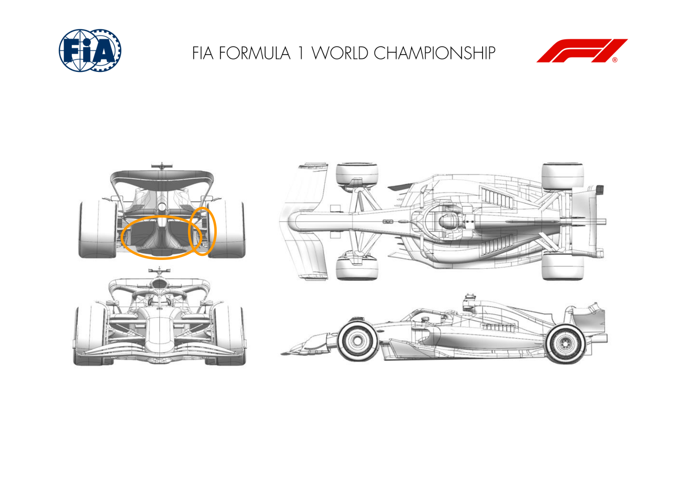
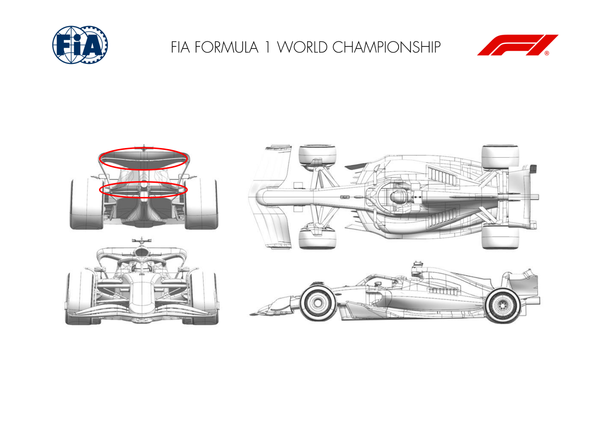
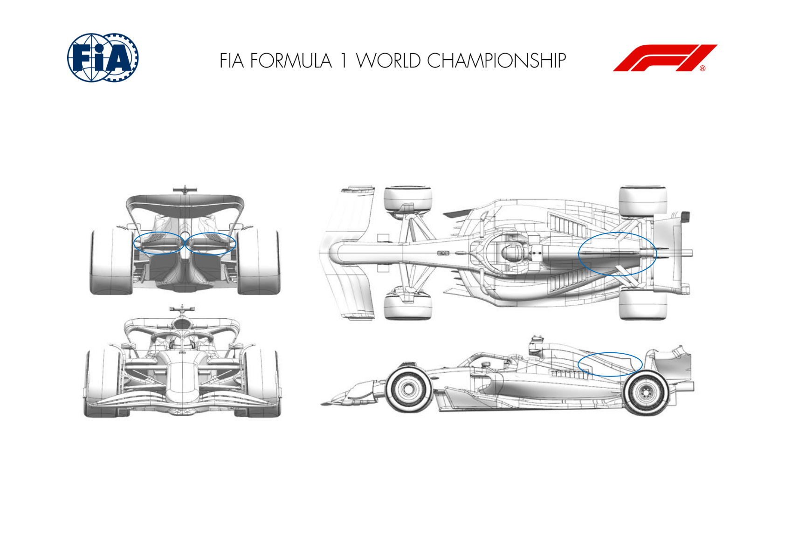
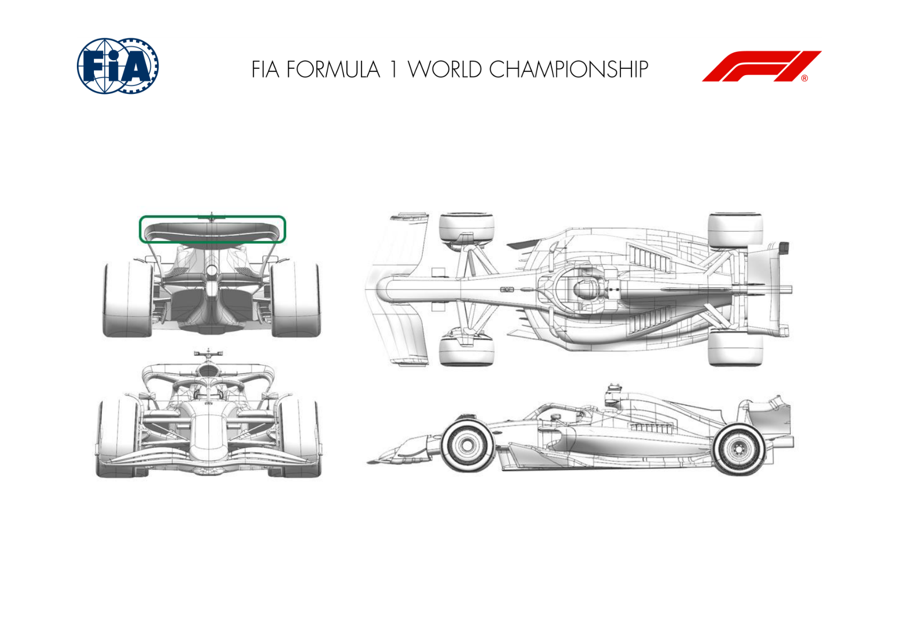
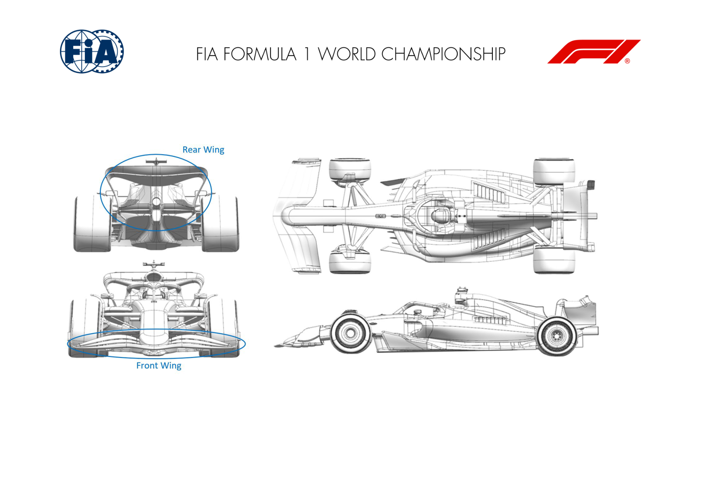
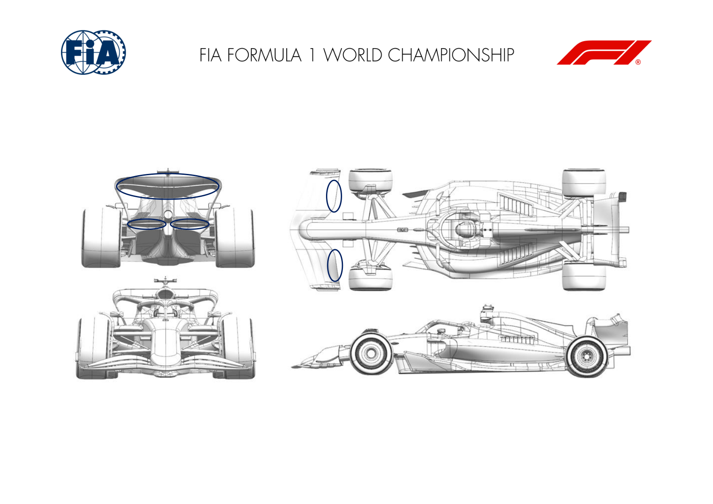
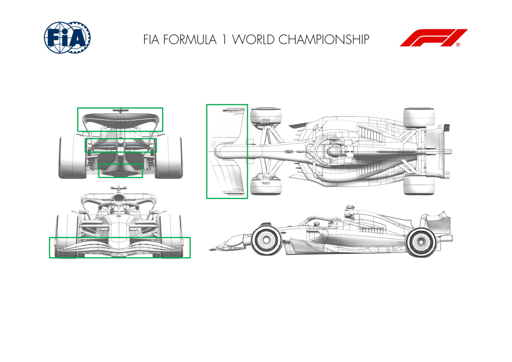

2025 SAUDI ARABIAN GRAND PRIX

18 - 20 April 2025

From The FIA Formula One Media Delegate Document 7

To All Teams, All Officials Date 18 April 2025

Time 13:49

Title Car Presentation Submissions

Description Car Presentation Submissions

Enclosed 2025 Saudi Arabian Grand Prix - Car Presentation Submissions.pdf

Roman De Lauw

The FIA Formula One Media Delegate

Car Presentation – Saudi Arabian Grand Prix

McLaren Formula 1 Team

| No. | Updated component | Primary reason for update | Geometric differences | Description |
| --- | --- | --- | --- | --- |
| 1 | Diffuser | Performance - Flow Conditioning | Reshaped Diffuser | The diffuser has been reshaped to improve overall flow conditioning in this area, with the aim of gaining aerodynamic performance. |
| 2 | Rear Corner | Performance - Flow Conditioning | New Rear Brake Duct Winglet arrangement | The revised Rear Brake Duct Winglet arrangement results in an improvement in local flowfield around the rear corner translating to an increase in aerodynamic efficiency. |

Car Presentation – Saudi Arabian Grand Prix

*SCUDERIA FERRARI HP*

| No. | Updated component | Primary reason for update | Geometric differences | Description |
| --- | --- | --- | --- | --- |
| 1 | Rear Wing | Performance - Drag reduction | Decambered / shorter chord top rear wing flap element | Adapting to the peculiarities of the Jeddah circuit aerodynamic efficiency requirements, this option is adding granularity in the available downforce level options on the baseline rear wing |
| 2 | Rear Wing | Performance – Drag reduction | Offloaded top rear wing | This top wing and lower beam wing options are low/medium downforce events, and provide a |
| 3 | Beam Wing | Performance - Drag reduction | Offloaded single element lower beam wing | larger step compared to the flap described above. The lower beam wing can be combined with different top wing assemblies |

Car Presentation – Saudi Arabian Grand Prix

Red Bull Racing

| No. | Updated component | Primary reason for update | Geometric differences | Description |
| --- | --- | --- | --- | --- |
| 1 | Coke/Engine Cover | Reliability | Enlarged central exit. | Demands of circuit in Jeddah with the forecast ambient temperatures require the use of a larger topbody to reject the heat needed for cooling |
| 2 | Beam Wing | Performance - Local Load | Reduced chord and camber lower or beam wing A step to reduce the downforce at a given speed to observe the lift/drag requirements for this circuit. |  |

Car Presentation – 2025 Saudi Arabian Grand Prix

*Mercedes-AMG PETRONAS F1 Team*

No updates submitted for this event.

Car Presentation – Saudi Arabian Grand Prix

Aston Martin Aramco F1 Team

| No. | Updated component | Primary reason for update | Geometric differences | Description |
| --- | --- | --- | --- | --- |
| 1 | Rear Wing | Circuit specific - Drag Range | Less aggressive rear wing flap to fit an existing assembly. | Part of standard development to provide a wing with less load and hence drag to suit the characteristics of this circuit. |

Car Presentation – Saudi Arabian Grand Prix

BWT Alpine F1 Team

No updates submitted for this event.

Car Presentation – 2025 Saudi Arabian Grand Prix

MONEYGRAM HAAS F1 TEAM

| No. | Updated component | Primary reason for update | Geometric differences | Description |
| --- | --- | --- | --- | --- |
| 1 | Rear Wing | Circuit specific - Drag Range | Decambered Rear Wing assemblies | Two carry-over Rear Wings from VF24 will be available on track. Both with reduced drag and load level, achieved by raising and decambering the profiles. |
| 2 | Front Wing | Circuit specific - Balance Range | With the lower drag levels a relaxed FW Flap profile is required. | In order to achieve a correct balance level with the introduction of above-mentioned less loaded Rear Wings a less powerful FW Flap is available as well. |

Car Presentation – Saudi Arabian Grand Prix

Visa Cash App Racing Bulls

| No. | Updated component | Primary reason for update | Geometric differences | Description |
| --- | --- | --- | --- | --- |
| 1 | Front Wing | Circuit specific - Balance Range | The chord length of the front wing flap has been reduced. | Shortening the chord of the flap results in less load being generated by the front wing at a given flap angle, allowing the car to be balanced for the lower rear wing levels expected at this circuit. |
| 2 | Rear Wing | Circuit specific - Drag Range | Reduced camber & incidence wing elements. | An efficient reduction in drag & downforce is achieved by de-cambering the upper wing and raising the leading edge, making it a good option for this circuit to achieve the optimum lap time. |
| 3 | Beam Wing | Circuit specific - Drag Range | Reduced chord & incidence lower element. | Further efficient drag reduction is achieved by reducing the load generated by the lower element of the beam wing. |

Car Presentation – Saudia Arabia Grand Prix

*Atlassian Williams Racing*

No updates submitted for this event.

Car Presentation – Saudi Arabian Grand Prix

Stake F1 Team KICK Sauber

| No. | Updated component | Primary reason for update | Geometric differences | Description |
| --- | --- | --- | --- | --- |
| 1 | Front Wing | Circuit specific - Balance Range | Low balance front wing flap design | The smaller front wing flap reduces the load generated by the front wing to ensure that we can rebalance the low-drag rear wing introduced for this circuit. |
| 2 | Floor Body | Performance - Local Load | Changes to central floor geometry | This change is aiming to improve flow characteristics around the rear floor, for efficient downforce gain. |
| 3 | Beam Wing | Circuit specific - Drag Range | Newly designed beam wing and rear wing endplate. | Combined change of beam wing and rear wing endplate geometry to increase overall efficiency at lower downforce levels. |
| 4 | Rear Wing Endplate | Circuit specific - Drag Range | Newly designed beam wing and rear wing endplate. | Combined change of beam wing and rear wing endplate geometry to increase overall efficiency at lower downforce levels. |
| 5 | Rear Wing | Circuit specific - Drag Range | Low drag rear wing assembly | efficiently. We can combine the main plane with several flaps to tune load and drag. |

