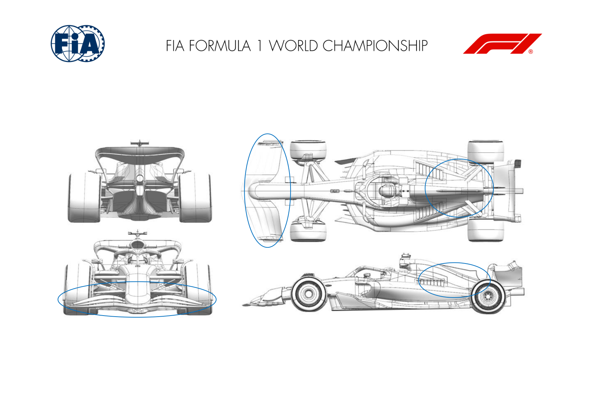

2025 SINGAPORE GRAND PRIX

03 - 05 October 2025

From The FIA Formula One Media Delegate Document 10

To All Teams, All Officials Date 03 October 2025

Time 14:45

Title Car Presentation Submissions

Description Car Presentation Submissions

Enclosed 2025 Singapore Grand Prix - Car Presentation Submissions.pdf

Cameron Kelleher

The FIA Formula One Media Delegate

Car Presentation – Singapore Grand Prix

McLaren Formula 1 Team

No updates submitted for this event.

Car Presentation – Singapore Grand Prix

*SCUDERIA FERRARI HP*

No updates submitted for this event.

Car Presentation – Singapore Grand Prix

Red Bull Racing

| No. | Updated component | Primary reason for update | Geometric differences | Description |
| --- | --- | --- | --- | --- |
| 1 | Front wing | Performance - Local Load | Locally increased cambers to extract more load | An evolution of the design taking further research to increase the camber of some wing sections to extract more load whilst maintaining flow stability. |
| 2 | Engine Cover | Reliability | Increased topbody exit areas | Enlarged exit from the overall topbody which is more efficient than opening louvres or creating larger louvres to raise the overall cooling capacity. |

Car Presentation – 2025 Singapore Grand Prix

*Mercedes-AMG PETRONAS F1 Team*

| No. | Updated component | Primary reason for update | Geometric differences | Description |
| --- | --- | --- | --- | --- |
| 1 | Front Wing | Performance – Local Load | Reprofiled front wing flap. | The reprofiled front wing drops the local load to allow an appropriate car balance to be achieved for this circuit. |

Car Presentation – Singapore Grand Prix

Aston Martin Aramco F1 Team

No updates submitted for this event.

Car Presentation – Singapore Grand Prix

BWT Alpine F1 Team

No updates submitted for this event.

Car Presentation – Singapore Grand Prix

*MoneyGram Haas F1 Team*

No updates submitted for this event.

Car Presentation – Singapore Grand Prix

Visa Cash App Racing Bulls

No updates submitted for this event.

Car Presentation – Singapore Grand Prix

*ATLASSIAN WILLIAMS RACING*

No updates submitted for this event.

Car Presentation – Singapore Grand Prix

Stake F1 Team KICK Sauber

No updates submitted for this event.
