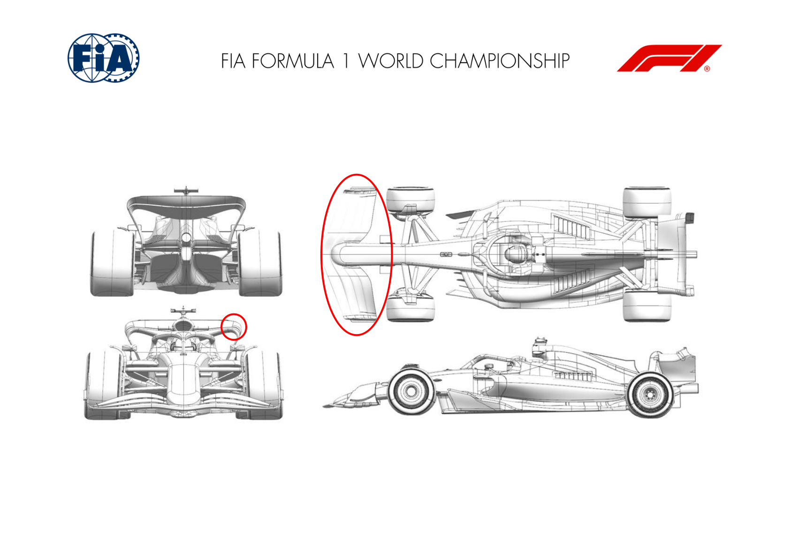
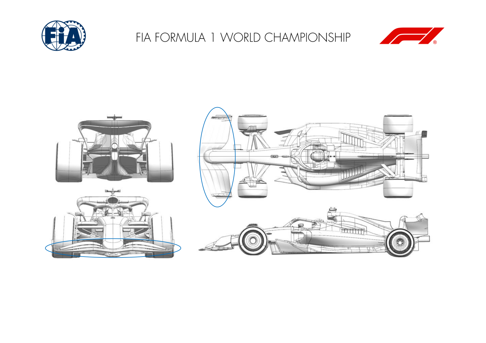
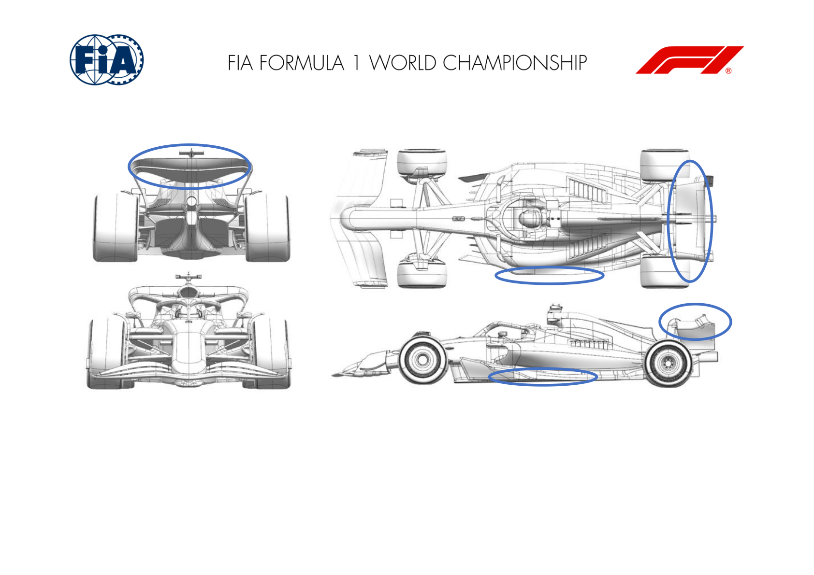
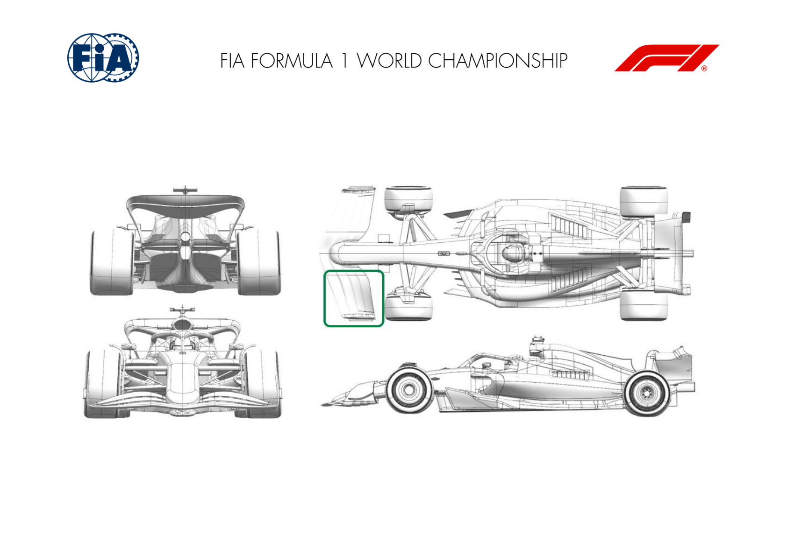
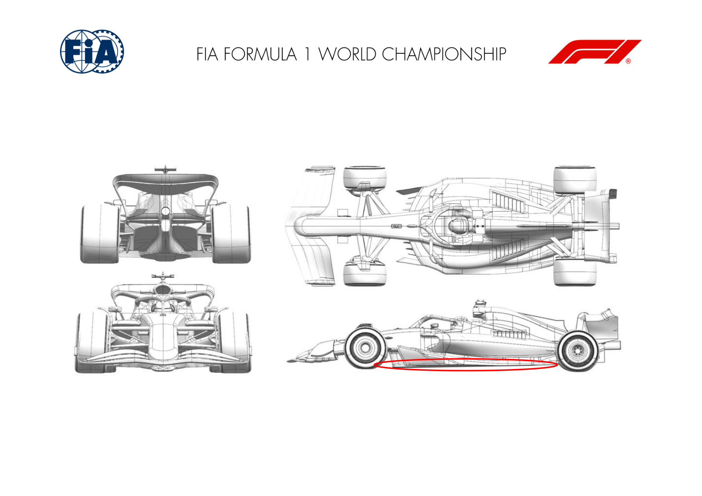
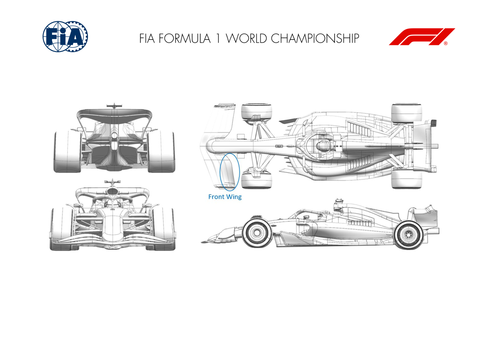
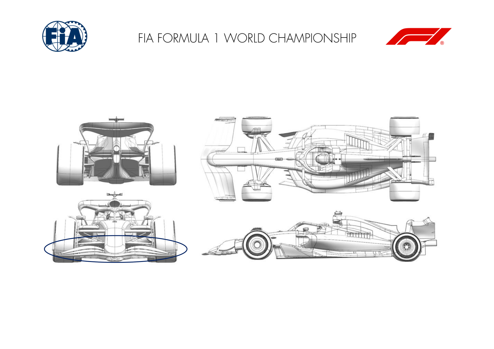
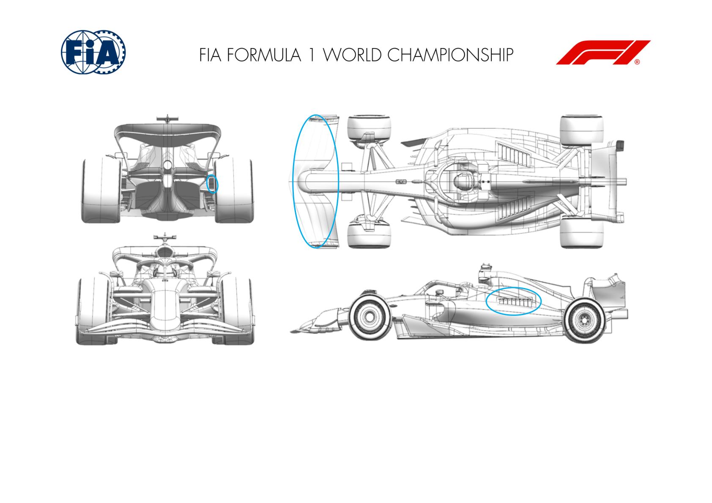
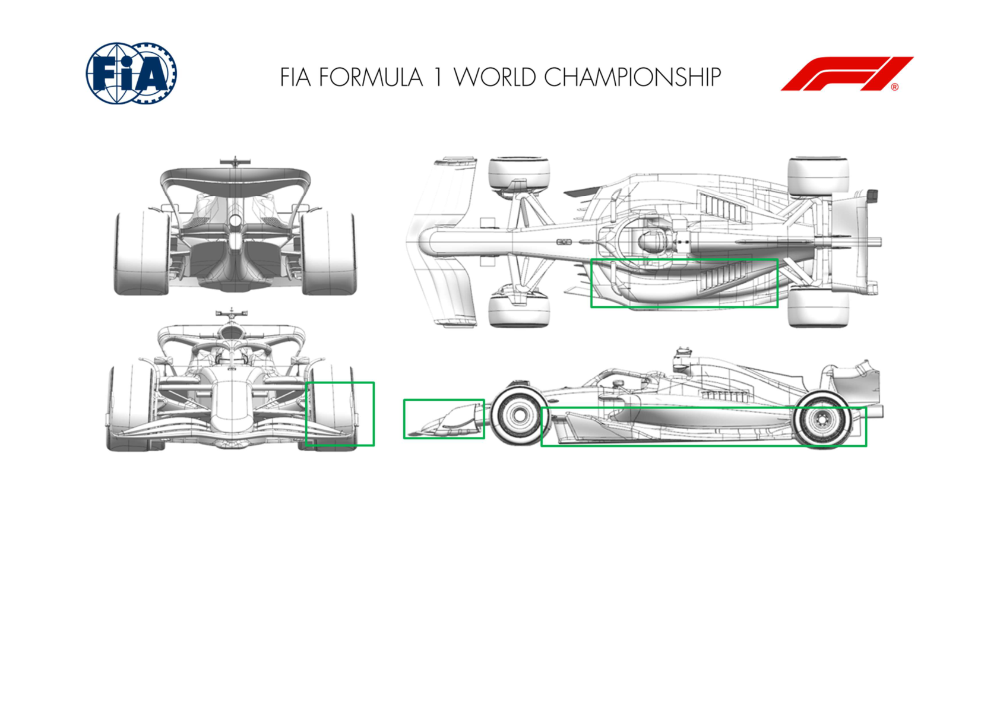

2025 SPANISH GRAND PRIX

30 May - 01 June 2025

From The FIA Formula One Media Delegate Document 8

To All Teams, All Officials Date 30 May 2025

Time 10:56

Title Car Presentation Submissions

Description Car Presentation Submissions

Enclosed 2025 Spanish Grand Prix - Car Presentation Submissions.pdf

Roman De Lauw

The FIA Formula One Media Delegate

Car Presentation – Spanish Grand Prix

McLaren Formula 1 Team

No updates submitted for this event.

Car Presentation – Spanish Grand Prix

*SCUDERIA FERRARI HP*

| No. | Updated component | Primary reason for update | Geometric differences | Description |
| --- | --- | --- | --- | --- |
| 1 | Front Wing | Performance - Local Load | Update of chordwise and spanwise loading distribution of the wing elements, together with a revised endplate and outboard tip rolls | Not track specific, this front wing introduction is phased with the update of the articles 3.15.4 and 3.15.5 of the technical regulations, effective from the Spanish Grand Prix onwards |
| 2 | Rear Wing | Circuit specific - Drag Range | Redesign of the outboard tip and roll on the high downforce top rear wing | The high downforce top rear wing, carried over from 2024 and made available in Imola, received a local update to the outboard tip and roll geometries. Local flow features are improved, returning an efficient load increase. |

Car Presentation – Spanish Grand Prix

Red Bull Racing

| No. | Updated component | Primary reason for update | Geometric differences | Description |
| --- | --- | --- | --- | --- |
| 1 | Front wing | Performance - Local Load | First and second elements revised primarily in section. Flap elements and tips are consequential to the first two elements. | In order to comply with the revisions to the 2025 F1 Technical Regulations applicable from the Spanish GP, the front wing geometry has been revised to gain stiffness at minimal weight cost and then iterated to pursue the load characteristics sought. |

Car Presentation – 2025 Spanish Grand Prix

*Mercedes-AMG PETRONAS F1 Team*

| No. | Updated component | Primary reason for update | Geometric differences | Description |
| --- | --- | --- | --- | --- |
| 1 | Floor Edge | Performance – Local Load | Increased chord floor edge wing with additional vanes | Additional vane elements and flap chord increases mass flow under forward floor, increasing vorticity shed from the fence system, increasing floor load. |
| 2 | Floor Fences | Performance - Flow Conditioning | Reprofiled inboard fence | New fence profile has improved local pressure distribution and position of vorticity, improving both local and downstream load through better onset flow. |
| 3 | Rear Wing | Performance - Local Load | Reprofiled mainplane and flap elements | Circuit specific rear wing, with increased camber aimed at gaining local downforce and drag along an efficiency slope appropriate for Barcelona. |

Car Presentation – Spanish Grand Prix

Aston Martin Aramco F1 Team

| No. | Updated component | Primary reason for update | Geometric differences | Description |
| --- | --- | --- | --- | --- |
| 1 | Front Wing | Performance - Local Load | Revised tip detail between the front wing elements and the endplate. Main wing sections also revised for compliance with TD018H. | The revised tip detail improves the flowfield around the outboard end of the wing increasing the load generated in that area. Changes in section are for structural reasons. |

Car Presentation – Spanish Grand Prix

BWT Alpine F1 Team

| No. | Updated component | Primary reason for update | Geometric differences | Description |
| --- | --- | --- | --- | --- |
| 1 | Floor Fences | Performance – Local load | Reprofiled floor fences | The floor fences have been optimised locally to improve the quality of the underfloor structures. This results in an improved flow delivery to the entire floor and generates local load. |
| 2 | Floor Body | Performance – Local load | Local changes to the shape of the floor | Local and subtle modifications have been done to fences and improve the flowfield quality. |

Car Presentation – 2025 Spanish Grand Prix

MONEYGRAM HAAS F1 TEAM

| No. | Updated component | Primary reason for update | Geometric differences | Description |
| --- | --- | --- | --- | --- |
| 1 | Front Wing | Performance - Mechanical Setup Performance Mechanical Setup | Updated Front Wing Construction | The 2025 Technical Regulations were updated on April 7th to include more stringent FW flap deflection requirements, effective from May 28th. Consequently, a new FW construction was necessary to comply with these new requisites. |

Car Presentation – Spanish Grand Prix

Visa Cash App Racing Bulls

| No. | Updated component | Primary reason for update | Geometric differences | Description |
| --- | --- | --- | --- | --- |
| 1 | Front Wing | Performance - Flow Conditioning | The elements of the mainplane are new, featuring a lower central section. | The centre section of the wing is loaded further relative to the outboard, modifying the downstream flow conditions. This update also addresses the increased FW stiffness requirements for race 09 onwards. |
| 2 | Front Wing Endplate | Performance - Flow Conditioning | The connection between the tips & the FWEP has been updated. | The flow around the FW tips is highly three dimensional. The revised detail around the tips helps to reduce the losses created from this flow field. |
| 3 | Nose | Performance - Flow Conditioning | The lower surface of the nose has been raised whilst the tip has been lowered. | The nose tip drops down to meet the new FW sections, whilst the raised lower surface helps to increase the load generated by the centre section of the wing, which in turn modifies the downstream flow around the car. |

Car Presentation – SPAIN Grand Prix

*ATLASSIAN WILLIAMS RACING*

| No. | Updated component | Primary reason for update | Geometric differences | Description |
| --- | --- | --- | --- | --- |
| 1 | Front Wing | Performance - Flow Conditioning | The front wing assembly is updated to satisfy the new The combined geometric and construction changes reduce the deflection to adhere to the latest regulations. The geometric updates alter the flow pattern off the front wing and change the performance of both the front brake duct furniture and the forward floor. deflection regulations. In addition, we have taken the opportunity to update the geometry of the rearward flap and FWEP. The outboard section of the rearward flap has a more backed-off profile, and the vertical section of the endplate has a revised camber geometry. |  |
| 2 | Rear Corner | Circuit specific - Cooling Range | There is a revised exit geometry for the rear brake duct, which constricts the flow through the brake duct. | The revised exit geometry changes the flow rate through the brake duct and affects the brake cooling in a way that is suitable for the braking demands of Barcelona. |
| 3 | Cooling Louvres | Circuit specific - Cooling Range | A new optional cooling louvre panel is available for this event. It increases the number of large louvres to the maximum that the panel can accommodate. | This update simply increases the flow through the radiators and therefore increases the PU cooling at the cost of downforce and drag. This will be our new maximum cooling setup, which may be of use in Barcelona, but is more likely to be needed later in the season. |

Car Presentation – Spanish Grand Prix

KICK Sauber F1 Team

| No. | Updated component | Primary reason for update | Geometric differences | Description |
| --- | --- | --- | --- | --- |
| 1 | Floor Body | Performance - Local Load | Changes to several areas of the floor: Floor fence, outboard floor edge and diffuser. | Modifications are targeted at improved flow field conditions for the underfloor from front to back, gaining some efficient and balanced downforce. |
| 2 | Coke/Engine Cover | Performance - Local Load | Changes to engine cover design. | the new floor developments and associated interactions, modifying floor top surface flow conditions. |
| 3 | Front Wing | Performance - Local Load | Small change to the transition between the mainplane and the front wing endplate. | Local front wing end plate developments to improve outboard front wing performance and efficiency and also encourage better downstream flow quality. |

