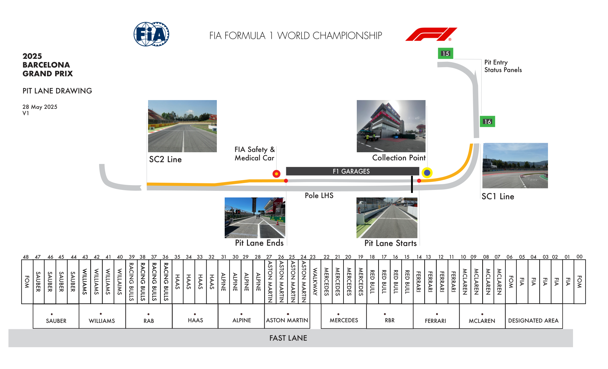
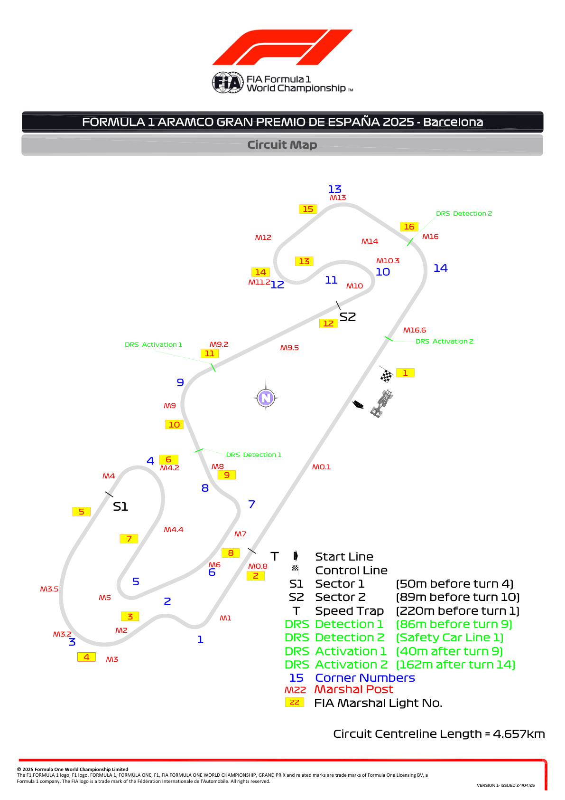
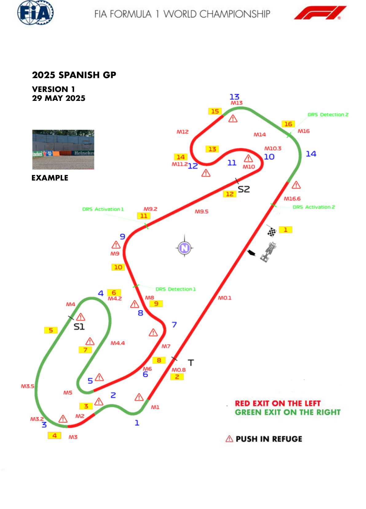
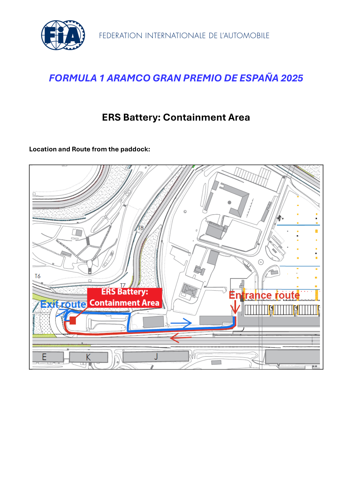
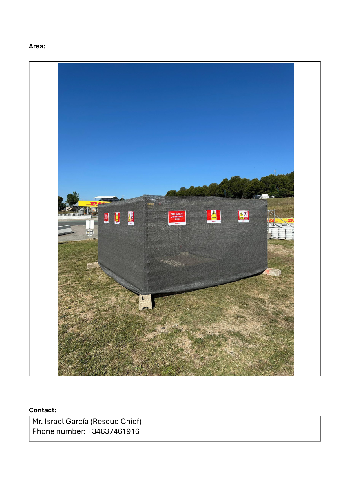
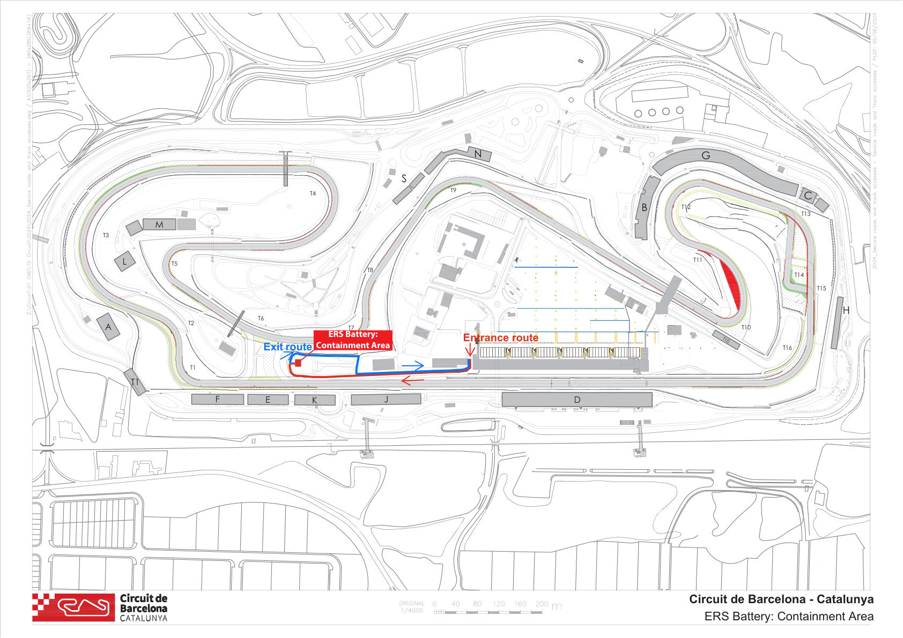
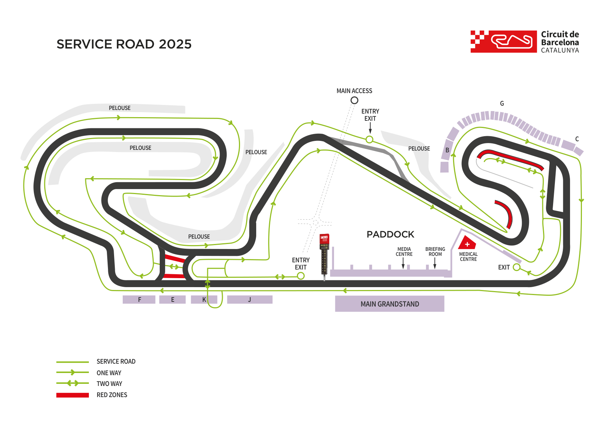

2025 SPANISH GRAND PRIX

30 May - 01 June 2025

From The FIA Formula One Race Director Document 3

To All Teams, All Officials Date 29 May 2025

Time 17:52

Title Race Director Event Notes - Circuit Map, Pit Lane, Quarantine Zone and Red Zones

Description Race Director Event Notes - Circuit Map, Pit Lane, Quarantine Zone and Red Zones

Enclosed Maps V1.pdf

Rui Marques

The FIA Formula One Race Director

