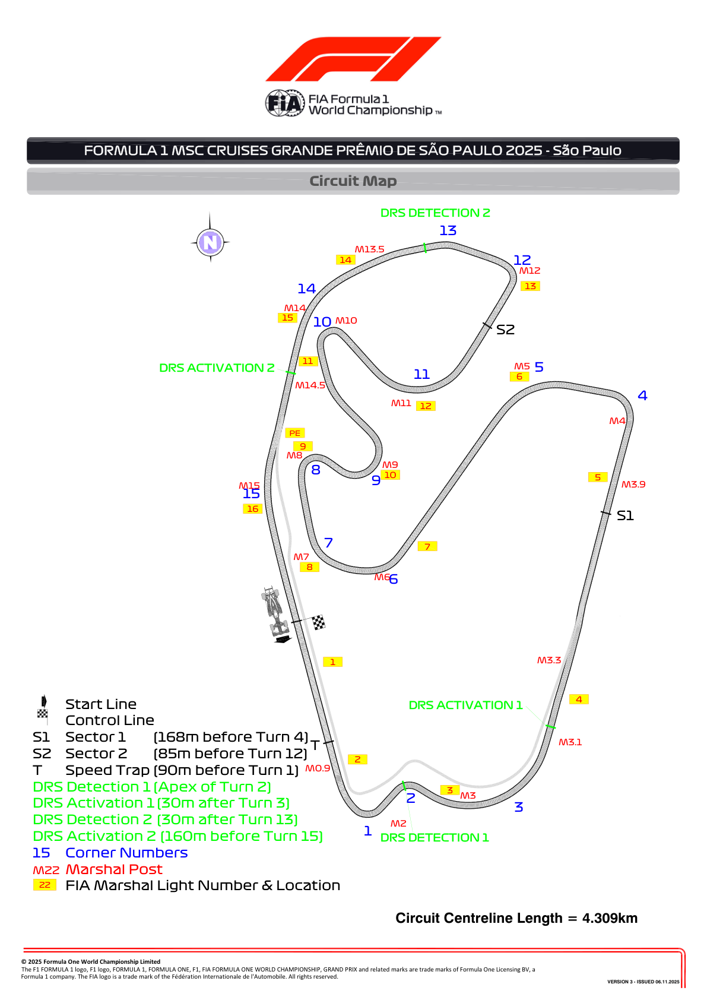
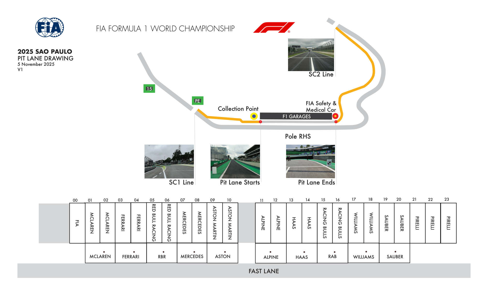
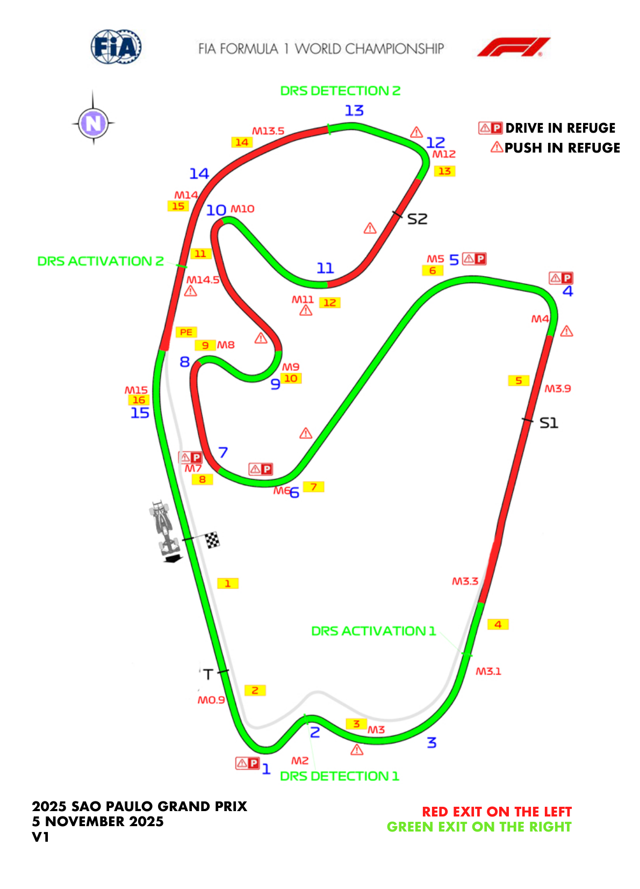
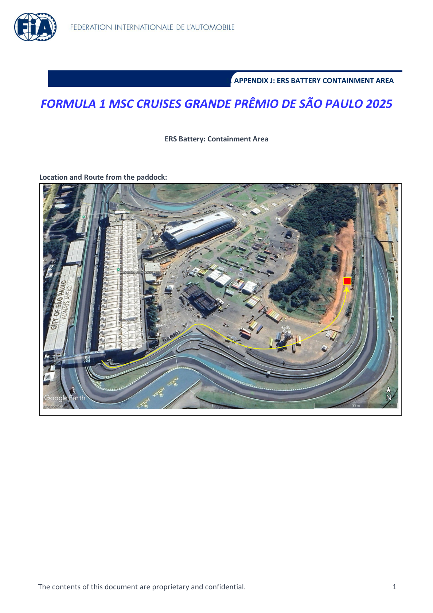
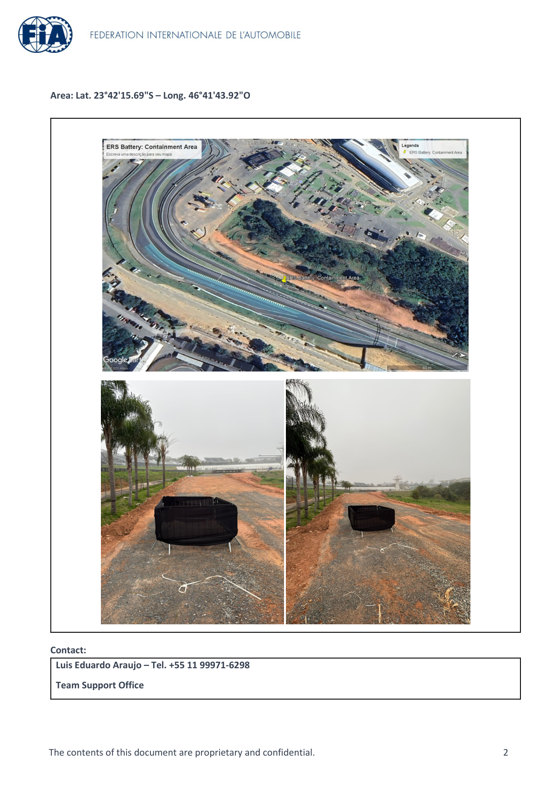
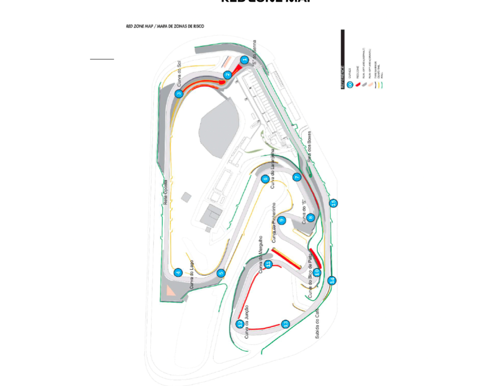

2025 SÃO PAULO GRAND PRIX

07 - 09 November 2025

From The FIA Formula One Race Director Document 5

To All Teams, All Officials Date 06 November 2025

Time 18:14

Title Event Notes - Circuit Map, Pit Lane Drawing, Emergency Exits Map, Quarantine Zone and Red Zones Map

Description Event Notes - Circuit Map, Pit Lane Drawing, Emergency Exits Map, Quarantine Zone and Red Zones Map

Enclosed Maps.pdf

Rui Marques

The FIA Formula One Race Director

