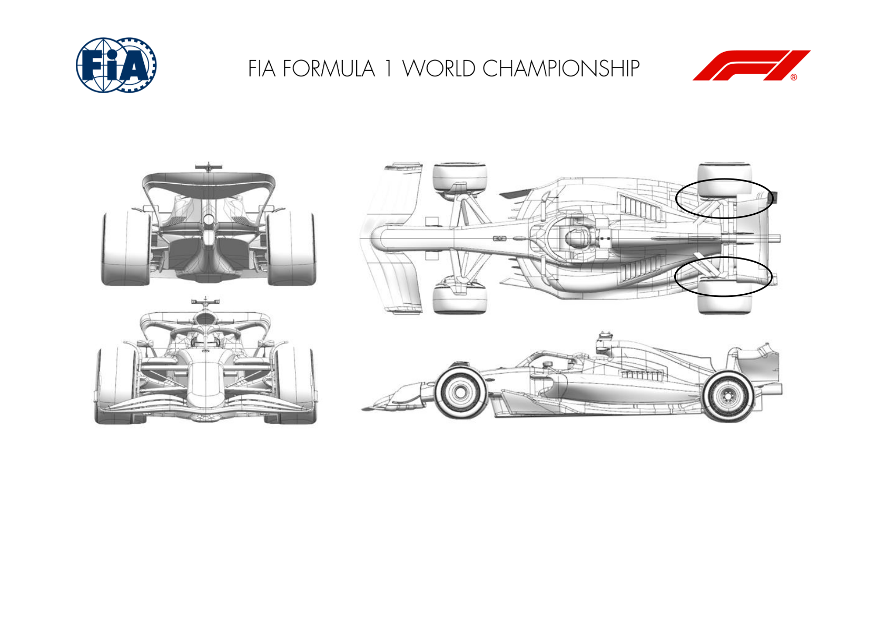
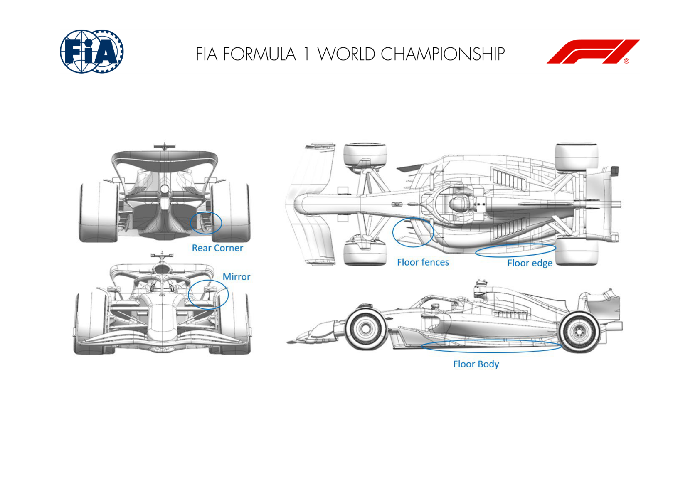

2025 UNITED STATES GRAND PRIX

17 - 19 October 2025

From The FIA Formula One Media Delegate Document 10

To All Teams, All Officials Date 17 October 2025

Time 09:54

Title Car Presentation Submissions

Description Car Presentation Submissions

Enclosed 2025 United States Grand Prix - Car Presentation Submissions.pdf

Roman De Lauw

The FIA Formula One Media Delegate

Car Presentation – United States Grand Prix

McLaren Formula 1 Team

No updates submitted for this event.

Car Presentation – United States Grand Prix

*SCUDERIA FERRARI HP*

No updates submitted for this event.

Car Presentation – R19 USA Austin Grand Prix

Red Bull Racing

No updates submitted for this event.

Car Presentation – 2025 United States Grand Prix

*Mercedes-AMG PETRONAS F1 Team*

| No. | Updated component | Primary reason for update | Geometric differences | Description |
| --- | --- | --- | --- | --- |
| 1 | Rear Corner | Performance – Local Load | Reprofiled upper lip and reduced span winglets. | Upper lip camber reduced to improve local flow quality around top wishbone, and winglet span reduced to increase tyre clearance. |

Car Presentation – United States Grand Prix

Aston Martin Aramco F1 Team

No updates submitted for this event.

Car Presentation – United States Grand Prix

BWT Alpine F1 Team

No updates submitted for this event.

Car Presentation – 2025 USA Grand Prix

MONEYGRAM HAAS F1 TEAM

| No. | Updated component | Primary reason for update | Geometric differences | Description |
| --- | --- | --- | --- | --- |
| 1 | Floor Body | Performance - Local Load | Expansion rate changed on main floor This update builds on the R12 upgrade by refining the floor fences and outboard edge to increase aerodynamic load, with a focus on high-speed corner performance. | This update builds on the R12 upgrade by refining |
| 2 | Floor Fences | Performance - Local Load | Fences re-aligned | the floor fences and outboard edge to increase aerodynamic load, with a focus on high-speed corner performance. |
| 3 | Floor Edge | Performance - Local Load | Smaller Floor edge wing |  |
| 4 | Rear Corner | Performance - Flow Conditioning | Refined Rear Corner Winglet The new floor required an optimization of the rear corner winglet. |  |
| 5 | Sidepod Inlet | Performance - Flow Conditioning | Revised Mirror stay A minor refinement of the Mirror stay to improve flow alignment. |  |

Car Presentation – United States Grand Prix

Visa Cash App Racing Bulls

No updates submitted for this event.

Car Presentation – United States Grand Prix

*ATLASSIAN WILLIAMS RACING*

No updates submitted for this event.

Car Presentation – United States Grand Prix

Stake F1 Team KICK Sauber

No updates submitted for this event.
