2026 AUSTRALIAN GRAND PRIX

06 - 08 March 2026

From The FIA Formula One Media Delegate Document 9

To All Teams, All Officials Date 06 March 2026

Time 10:00

Title Car Presentation Submissions

Description Car Presentation Submissions

Enclosed 2026 Australian Grand Prix - Car Presentation Submissions.pdf

Roman De Lauw

The FIA Formula One Media Delegate

Car Presentation – Australian Grand Prix

McLaren Mastercard F1 Team

| No. | Updated component | Primary reason for update | Geometric differences | Description |
| --- | --- | --- | --- | --- |
| 1 | Floor | Performance - Flow Conditioning | Revised floor geometry | New floor edge geometry, resulting in better flow control around the rear tyres aiming at improved floor and rear corner aerodynamic load. |
| 2 | Rear Suspension | Performance - Flow Conditioning | Updated Rear Suspension Fairing | New fairing around the Rear Suspension mounting points resulting in improved flow conditioning around the Rear impact structure aiming at improved diffuser performance. |
| 3 | Rear Wing | Performance – Local Load | New Rear Wing | A new Rear Wing geometry featuring revised mainplane and flap elements, gaining aerodynamic load throughout all conditions while maintaining efficiency. |

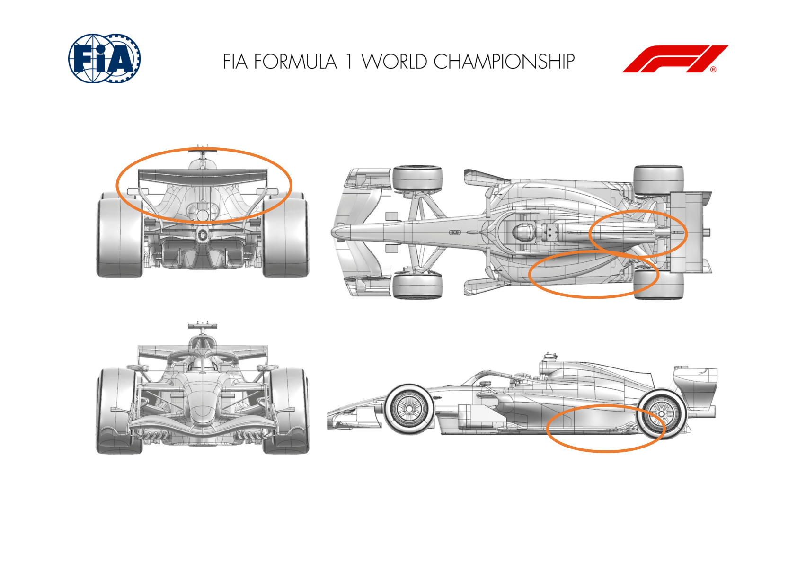

Car Presentation – 2026 Australian Grand Prix

*Mercedes-AMG PETRONAS F1 Team*

| No. | Updated component | Primary reason for update | Geometric differences | Description |
| --- | --- | --- | --- | --- |
| 1 | Bodywork | Performance – Local Load | Compared to the 2026 starting point, the R01 bodywork is more downwash in sideview, with a high inlet. | Down-washing the bodywork pulls high energy flow down onto the rear of the car. The high inlet increases the stream tube to the rear floor. |
| 2 | Front Wing | Performance – Local Load | Compared to the 2026 starting point, the R01 front wing has increased camber and no strake. | Increasing element chamber increases the front wing load, with the spanwise loading chosen to optimise the onset flow to the floor. |
| 3 | Rear Wing | Performance – Local Load | Compared to the 2026 starting point, the R01 rear wing has increased camber. | Increased rear wing camber to increase wing load, with the chord of the elements optimised to find the right balance between SLM closed Cz and SLM open Cx. |

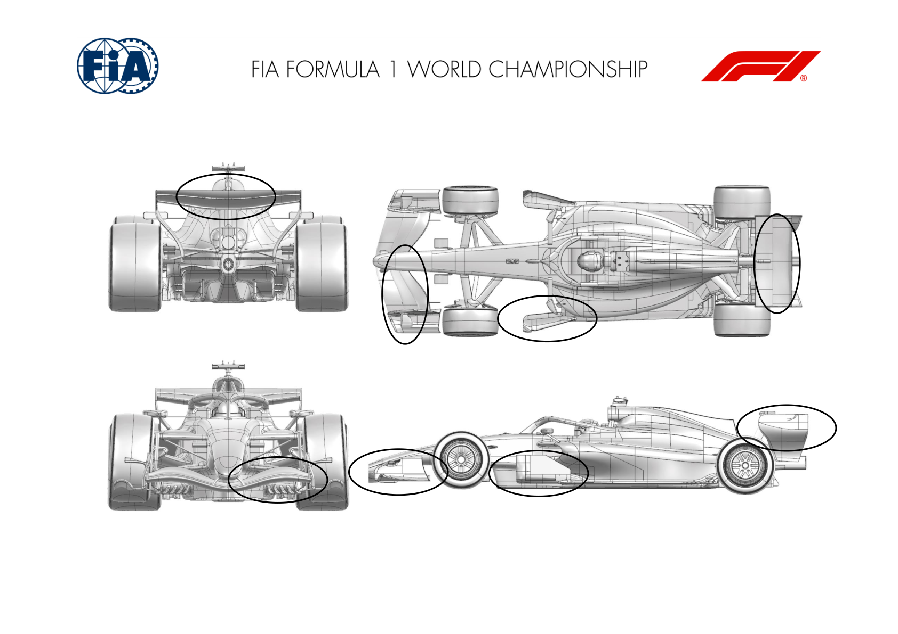

Car Presentation – Australian Grand Prix

Oracle Red Bull Racing

| No. | Updated component | Primary reason for update | Geometric differences | Description |
| --- | --- | --- | --- | --- |
| 1 | Front Wing | Performance - Local Load | Revised to comply with 2026 regulations. | Up to 3 elements for 2026 by regulation, with allowance to attach at either first or second element with those rearward able to move for balance and SM drag reduction. The ORBR design attaches at the first element allowing both flaps to perform the SM/CM change. |
| 2 | Nose | Performance - Local Load | Revised to comply with 2026 regulations. | Nose profile revised by regulation and the need for SM actuation of the front wing flap or flaps with concurrent or separate balance adjusters. ORBR design places all the adjustments within the nosebox. |
| 3 | Rear Wing | Performance - Local Load | Revised to comply with 2026 regulations. | Mandated to be supported on two pylons intersecting the underside of the mainplane. One or two element flap assembly actuating to engage SM and reduce drag. Chord length of the mainplane is to team design and the endplates have returned to be perpendicular panels at the ends of the elements. ORBR design places the actuator on centreline. |

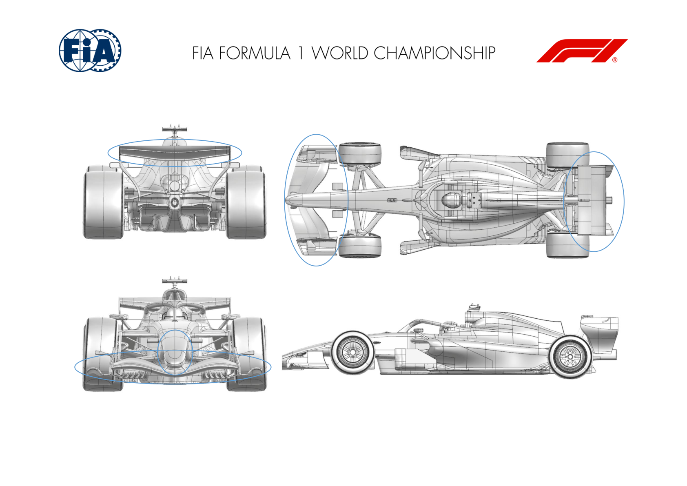

Car Presentation – Australian Grand Prix

*Scuderia Ferrari HP*

| No. | Updated component | Primary reason for update | Geometric differences | Description |
| --- | --- | --- | --- | --- |
| 1 | Front Wing | Performance - Flow Conditioning | Narrower span / longer chord front wing with SM system integration | A significant geometrical difference compared to previous generation of cars is the front wing. Design focus has been on optimizing balance range and aerodynamic characteristics around the new 2026 regulations, whilst properly integrating the newly introduced SM system, with a centerline actuator solution retained for us and that rotates the 2 flap elements together |
| 2 | Floor Body / Diffuser | Performance - Flow Conditioning | Reduced floor dimensions and simplified underbody | The transition between 2025 and 2026 represents a significant shift in underfloor aerodynamic philosophy. By making the floor flatter and with less authority on front vortical structures as well as the removal of complex floor edges, the main development focus has been on understanding how to extract maximum performance across the entire car operating envelope |
| 3 | Rear Wing | Performance – Local load | Three-element active rear wing | Key aspect for this new era has been on developing a top rear wing solution around a three-element arrangement without relying on interactions with the lower beam wing, which was a dominant factor with the 2025 topology. Given the importance of SM mode in 2026, maximizing SM effect has been a point of focus |

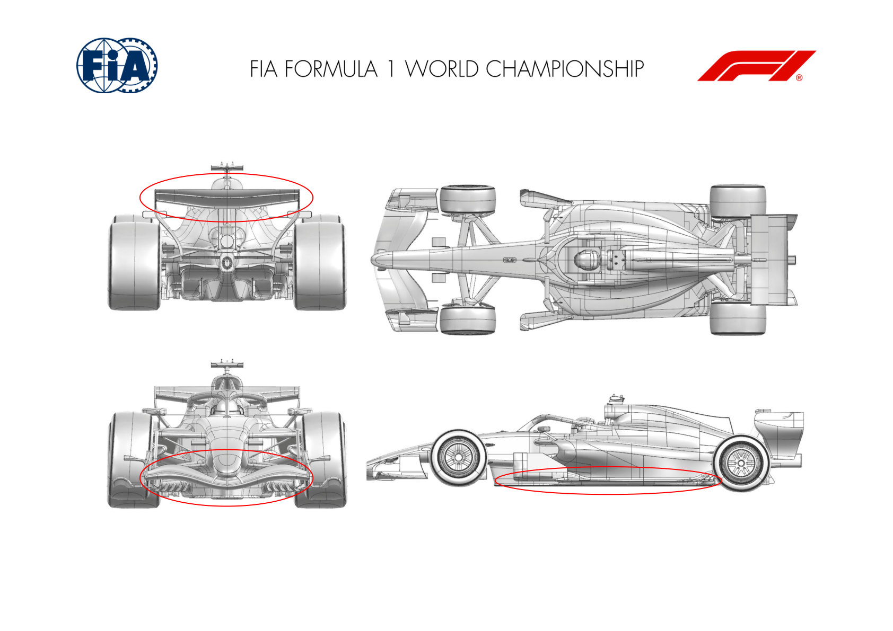

Car Presentation – AUSTRALIAN Grand Prix

*ATLASSIAN WILLIAMS F1*

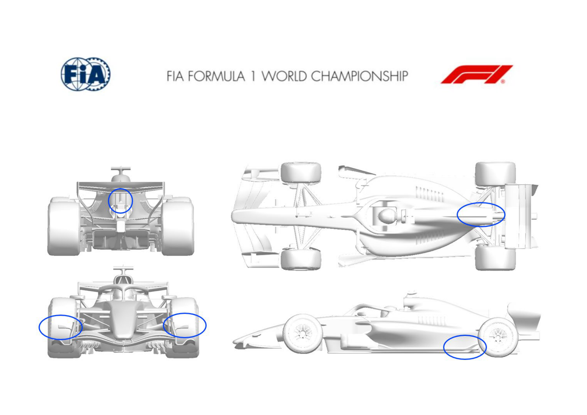

Car Presentation – Australian Grand Prix

Visa Cash App Racing Bulls

| No. | Updated component | Primary reason for update | Geometric differences | Description |
| --- | --- | --- | --- | --- |
| 1 | Floor Body | Performance – Flow Conditioning | Updated keel, floor leading edge devices, and rear floor. | The updated forward floor components improve the flow quality under the floor, allowing the floor to generate more downforce. |
| 2 | Coke/Engine Cover | Performance – Flow Conditioning | The top deck of the engine cover has been reshaped. | Airflow to the rear of the car is improved by modifying the flowfield around the bodywork, allowing the rear wing to work more effectively. |
| 3 | Cooling Louvres | Circuit specific - Cooling Range | Additional configurations of cooling louvres, with increased & decreased openings. | Opening or closing the louvres in the bodywork allows the cooling level for the engine to be tuned to the circuit conditions. |
| 4 | Rear Corner | Performance - Local Load | The geometry of the winglets on the rear corner has been updated. | Additional downforce is generated on the rear corner by the winglets around the suspension, at an efficiency suitable for the circuit characteristics. |

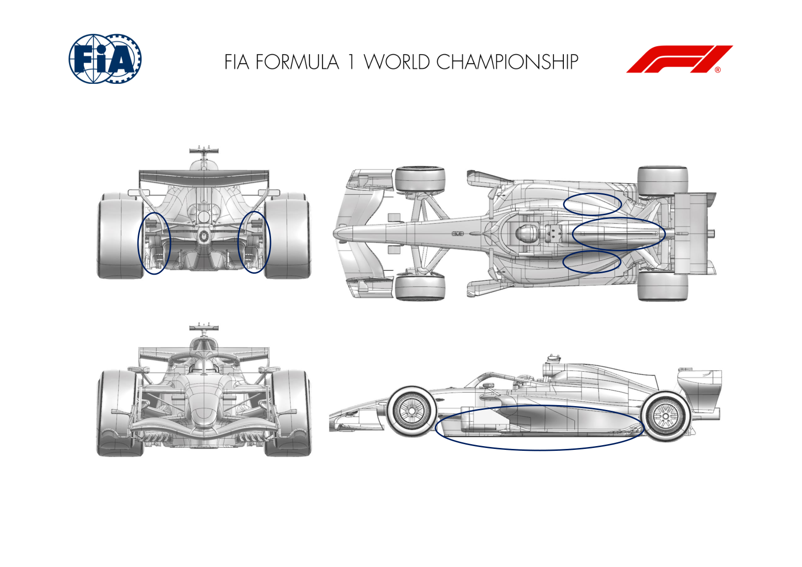

Car Presentation – Australian Grand Prix

Aston Martin Aramco F1 Team

| No. | Updated component | Primary reason for update | Geometric differences | Description |
| --- | --- | --- | --- | --- |
| 1 | Front Wing | Performance - Local Load | Three element narrow front wing. The wing is mounted to the nose from the second element. SM is achieved with a moveable third element. | The front wing optimises spanwise loading whilst delivering the required aerobalance range, which is achieved varying incidence of the rear element. |
| 2 | Front Wing Endplate | Performance - Flow Conditioning | The front wing endplate includes a diveplane on the outboard side and an OB foot with a channel on the lower surface. | The front wing endplate manages the circulation at the tip of the wing and positions downstream features around the front tyre. |
| 3 | Nose | Performance - Local Load | The nose is higher and now separated from the front wing elements. Pylons are attached to the nose the front wing from which the front wing is mounted. | The volume of the nose is created to guide the upstream flow around the central front wing elements and manage the upwash from the wing. |
| 4 | Sidepod Inlet | Performance - Flow Conditioning | The sidepod inlet is high and predominantly facing upwards. This creates a large undercut volume underneath that leads into the rest of the bodywork. | The inlet is sized to capture the massflow required to provide sufficient cooling. Externally flow is managed to the coke and deck. |
| 5 | Coke/Engine Cover | Performance - Local Load | The large undercut from the sidepod is continued to The purpose of the bodywork is to manage flow from the new front end regulations. the rear of the car. The top deck slopes down towards the rear of the car, with cooling exits more centrally on the engine cover. |  |
| 7 | Diffuser | Performance - Local Load | The diffuser extends rearward from the flat floor and carries the diffuser winglet defined by the regulations. A single fence is positioned within the diffuser. | The purpose of the diffuser is to manage the expansion of the flow from beneath the floor creating load on the lower surface. The winglet is adapted to the local flowfield to maximise performance. |
| 8 | Rear Wing | Performance - Local Load | Three element rear wing with the pylons mounted to the lower surface of the first element. The rwd two elements are activated in SM mode, reducing their incidence. | In CM the rear wing is optimised to provide maximum load while remaining stable and consistent. The SM deployment angle is defined to reduce drag as much as possible. |

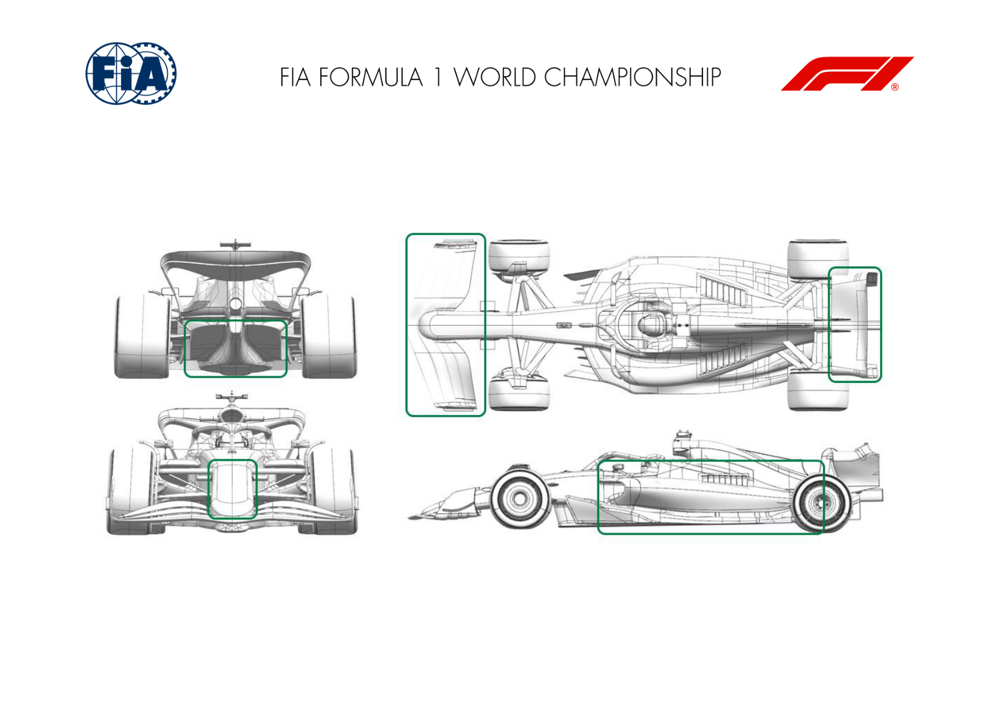

Car Presentation – Australian Grand Prix

HAAS

| No. | Updated component | Primary reason for update | Geometric differences | Description |
| --- | --- | --- | --- | --- |
| 1 | Front Wing | Performance - Local Load | The 2026 Technical Regulations introduce a revised layout for the Front Wings | Haas features a three-element wing. The newly introduced SM Adjuster is positioned on the centerline beneath the nose and actuates both flap elements. The geometries have been optimized to deliver high load in Corner Mode and reduced drag in Straight Mode. |
| 2 | Front Wing Endplate | Performance - Flow Conditioning | The 2026 Technical Regulations introduce a revised layout for the Front Wing Endplates. | The endplate is engineered for optimal tyre-wake control, incorporating a high-mounted diveplane and a channelled footplate to enhance local flow conditioning and improve downstream aerodynamic flow. |
| 3 | Floor Body | Performance - Local Load | The 2026 Technical Regulations introduce a revised layout for the Floor. | The 2026 floor architecture features a predominantly flat underbody, with only a limited allowance for front inboard devices and a floorboard as defined by the regulations. Our geometry incorporates a substantial vertical vane to condition and manage the tyre-wake structures, complemented by a series of horizontal aerofoils that promote localised load extraction. This combination enhances vortex stability, preserves floor sealing, and improves the underfloor mass-flow distribution. |
| 4 | Floor Edge | Performance - Flow Conditioning | The 2026 Technical Regulations introduce a revised layout for the Floor Edge. | The floor edge incorporates a multi-slot geometry combined with an upper fence, engineered to mitigate tyre-contact-patch–induced pressure losses and reinforce the robustness of the floor’s sealing vortex system. This configuration enhances shear-layer stability, preserves underfloor mass-flow continuity, and reduces the susceptibility of the diffuser to wake-related load drop-off. |
| 5 | Diffuser | Performance - Local Load | The 2026 Technical Regulations introduce a revised layout for the diffuser geometry. | The 2026 diffuser incorporates a single primary fence per side, while the FIA-mandated outboard devices—previously mounted to the rear corner assemblies up to 2025—are now integrated directly into the outboard diffuser structure. The central expansion volume extends laterally alongside the rear impact structure, maximising underfloor mass-flow extraction and enhancing the diffuser’s overall pressure-recovery efficiency. |
| 6 | Rear Wing | Performance - Local Load | The 2026 Technical Regulations allow for a three element upper Rear Wing configuration within a reduced legality volume compared to previous ‑ seasons. | Haas employs a three-element upper rear-wing assembly, with the SM mechanism providing simultaneous actuation of both flap elements. The mainplane is configured with a relatively low camber, while the flap cluster adopts an aggressive geometry to maximise downforce generation in Corner Mode (CM). In Straight Mode (SM), the system targets a substantial drag reduction by unloading the flap pair and exploiting the flat mainplane to minimise pressure-drag contribution |
| 7 | Beam Wing | Performance - Local Load | The 2026 Technical Regulations allow only a simplified lower-wing element. | The 2026 rear-structure geometry is deliberately simplified in compliance with the regulatory constraints. The beam wing is aligned with the incoming flow and functions primarily as a structural and aerodynamic interface, supporting both the floor assembly and the upper rear-wing system. |

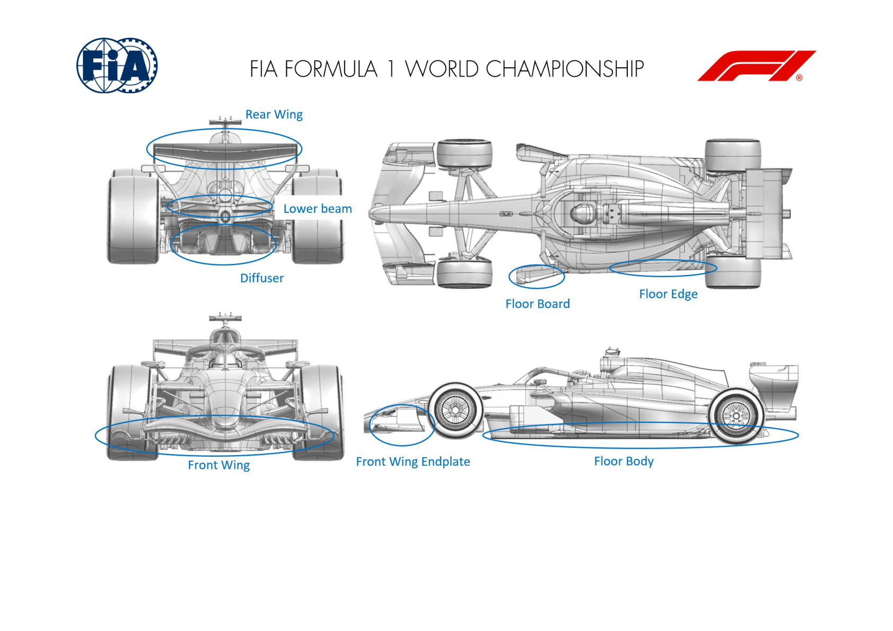

Car Presentation – Australian Grand Prix

BWT Alpine F1 Team

| No. | Updated component | Primary reason for update | Geometric differences | Description |
| --- | --- | --- | --- | --- |
| 1 | Front Wing | Performance - Local Load | Complete new front wing design in accordance with the 2026 regulations | The front wing has been completely redesigned to tackle the challenge of the new regulations. Its objective remains to produce load in Corner Mode, but also ensure drag is reduced at higher speeds, on the straights when in Straight Mode. |
| 2 | Coke/Engine Cover | Performance - Flow Conditioning | Complete new bodywork | The bodywork has been designed to accommodate the new ’26 power unit and ensure its cooling. It has also been designed with the objective of delivering high quality flow towards the rear end in all operating conditions. |
| 3 | Rear Wing | Performance - Local Load | Complete new rear wing design in accordance with the 2026 regulations | With no beam wing in 2026, and new regulations allowing the rear wing to be in Straight Mode in most of the straight lines, the rear wing was completely redesigned to ensure load is generated without any local flow field instabilities. |

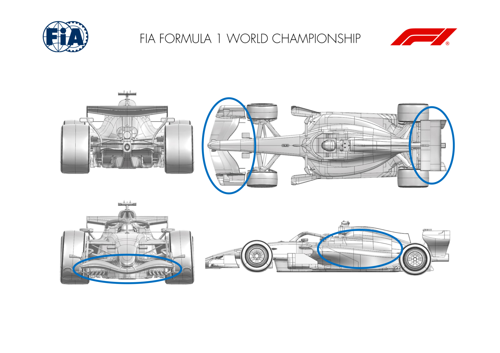

Car Presentation – Australian Grand Prix

Audi Revolut F1 Team

| No. | Updated component | Primary reason for update | Geometric differences | Description |
| --- | --- | --- | --- | --- |
| 1 | Front Wing | Performance - Flow Conditioning | Separate SLM actuators for each side of the front wing flap. | Our approach is focused on matching the desired flow conditions aft of the front wing for the front suspension and bodywork immediately behind it. The separate SLM actuators for each side of the front wing flap are part of that intent. |
| 2 | Sidepod Inlet | Performance - Flow Conditioning | Unique geometry, shaped to work closely with the floor and rear bodywork. | Our solution to the cooling inlets and front of sidepod geometry is unique, it is a philosophy which links with how our floor and bodywork aft of the sidepod front work as an aerodynamic system from front to back. |
| 3 | Sidepod Body | Performance - Flow Conditioning | “Down-wash” geometry, with the upper surface of the sidepod sloping downwards towards the back of the car. | Most teams encourage a level of "down-wash" for the main body of the sidepods, which is generated by the upper surface sloping downwards towards the back of the car, whilst also generating "in-wash" through a narrowing of the bodywork towards the back of the car. Our sidepods are heavily down wash biased - possibly the most extreme on the grid, whilst other have found a different compromise or reverted to a heavy in-wash bias. |

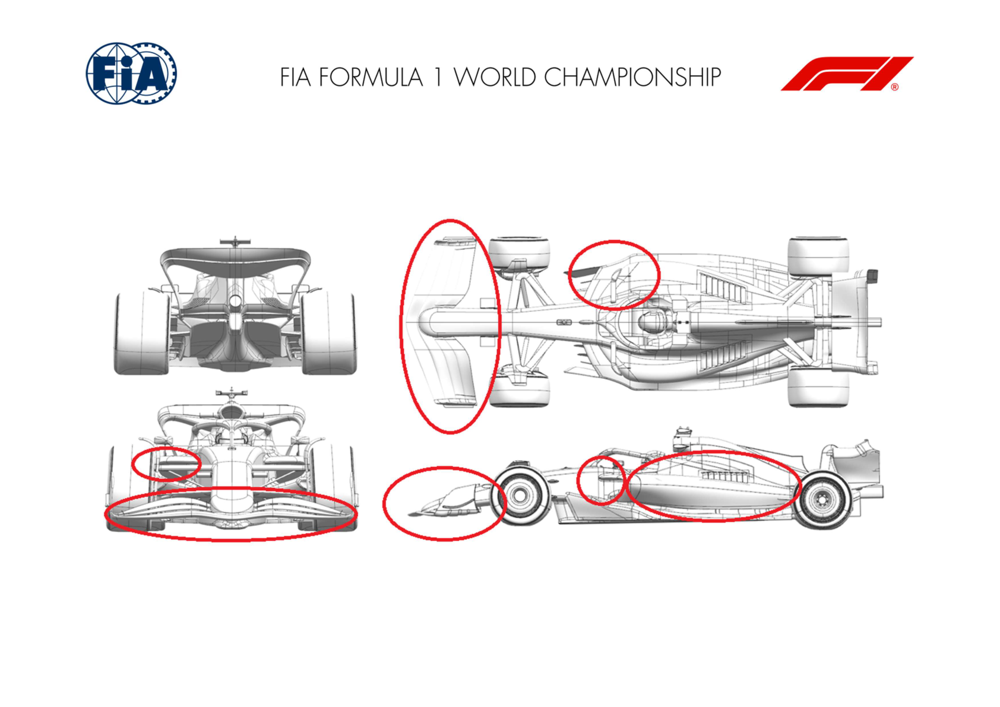

Car Presentation – Australian Grand Prix

Cadillac

| No. | Updated component | Primary reason for update | Geometric differences | Description |
| --- | --- | --- | --- | --- |
| 1 | Front Wing | Performance - Local Load | Updated flap design with revised spanwise loading. | Revised the front flap design with an updated spanwise load distribution to enhance overall front wing performance and improve balance characteristics. |
| 2 | Front Wing Endplate | Performance – Local Load | Updated end plate design with revised inboard detail. | Updated design to enhance the aerodynamic load characteristics of the front wing, reduce sensitivity to varying operating conditions, and deliver more consistent and predictable performance across a range of speeds and flow environments. |
| 3 | Rear Wing | Performance – Local Load | Updated design with revised flap loading. | Improved yaw characteristics whilst being designed to maximise aerodynamic load when cornering and maximise the drag reduction when SLM is active. |

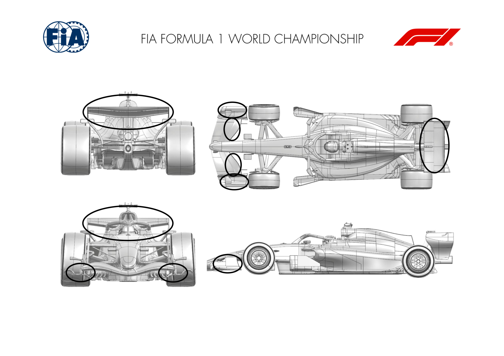
