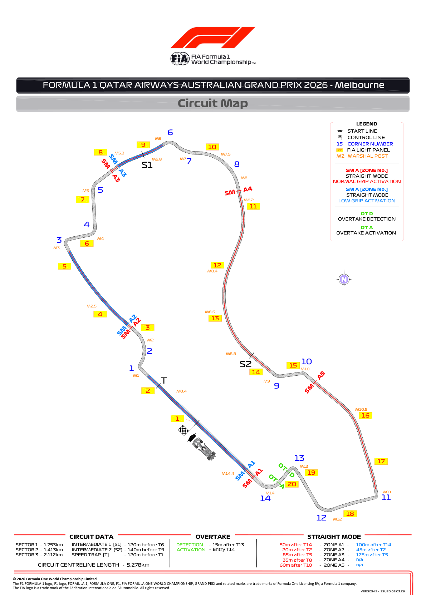
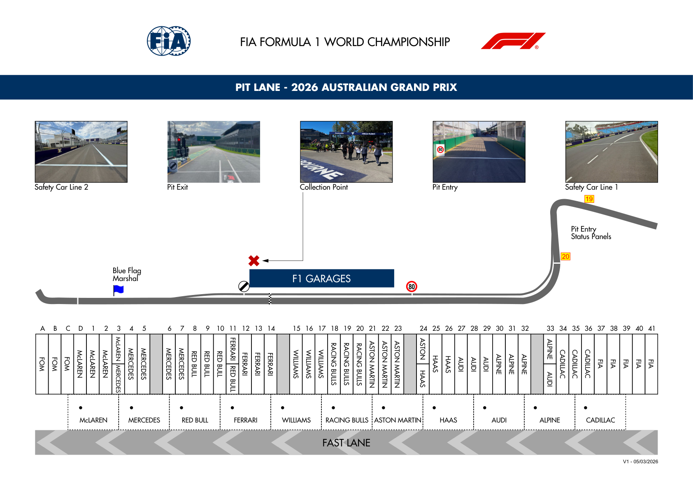
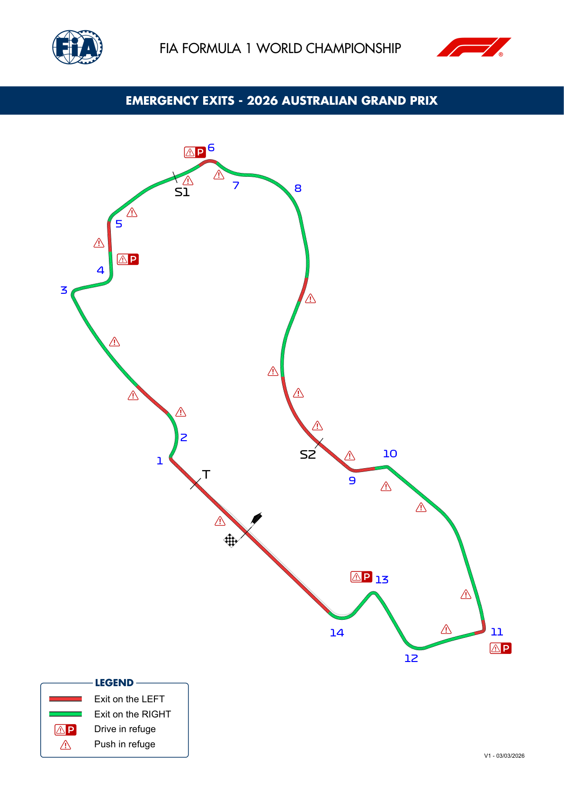
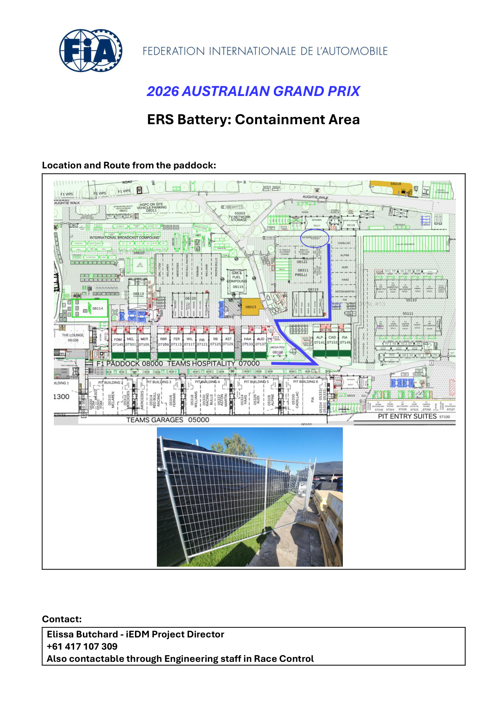

2026 AUSTRALIAN GRAND PRIX

06 - 08 March 2026

From The FIA Formula One Race Director Document 5

To All Teams, All Officials Date 05 March 2026

Time 17:26

Title Competition Notes - Circuit Map, Pit Lane Drawing, Emergency Exits Map and Quarantine Zone

Description Competition Notes - Circuit Map, Pit Lane Drawing, Emergency Exits Map and Quarantine Zone

Enclosed 01AUS - Maps.pdf

Rui Marques

The FIA Formula One Race Director

