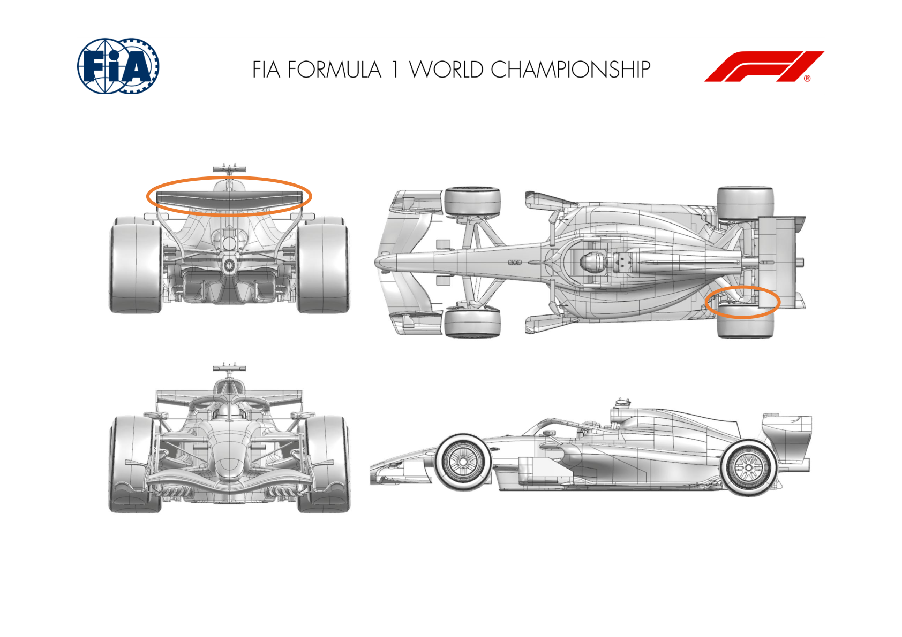
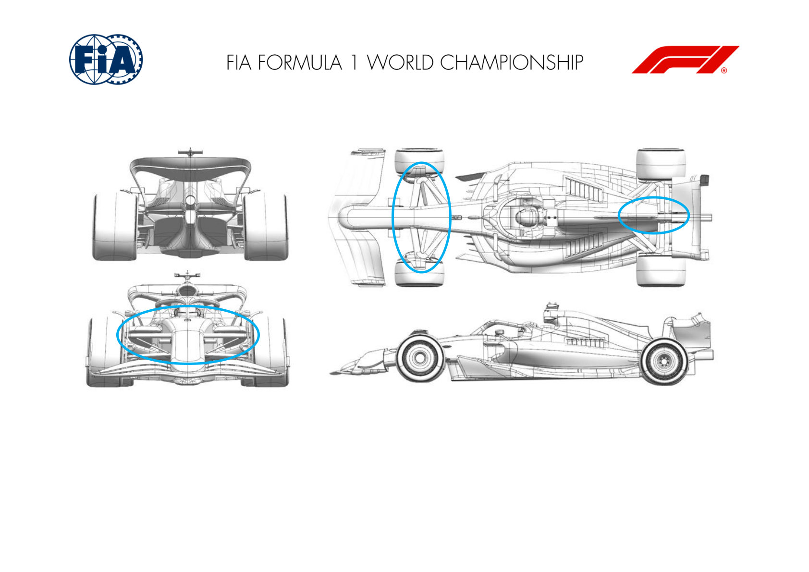
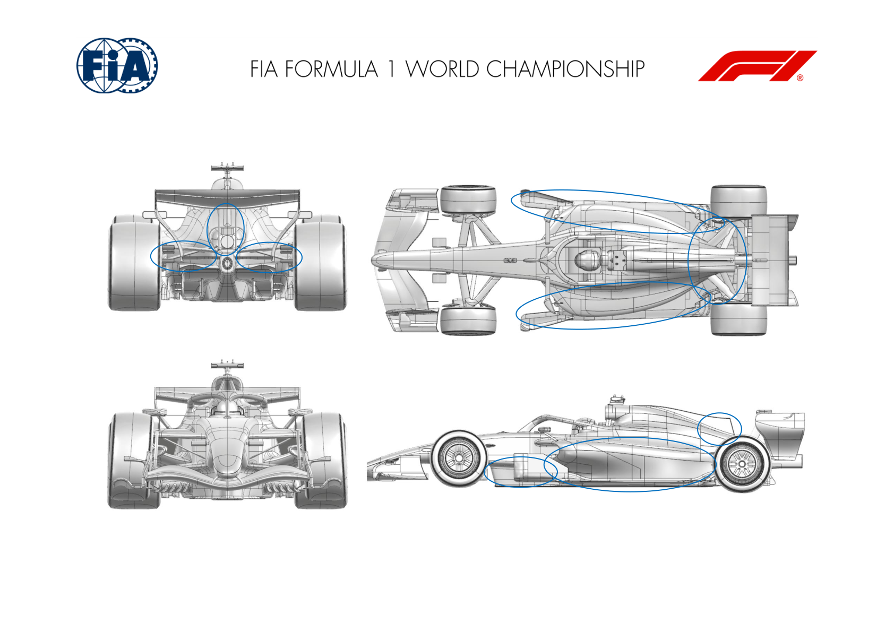
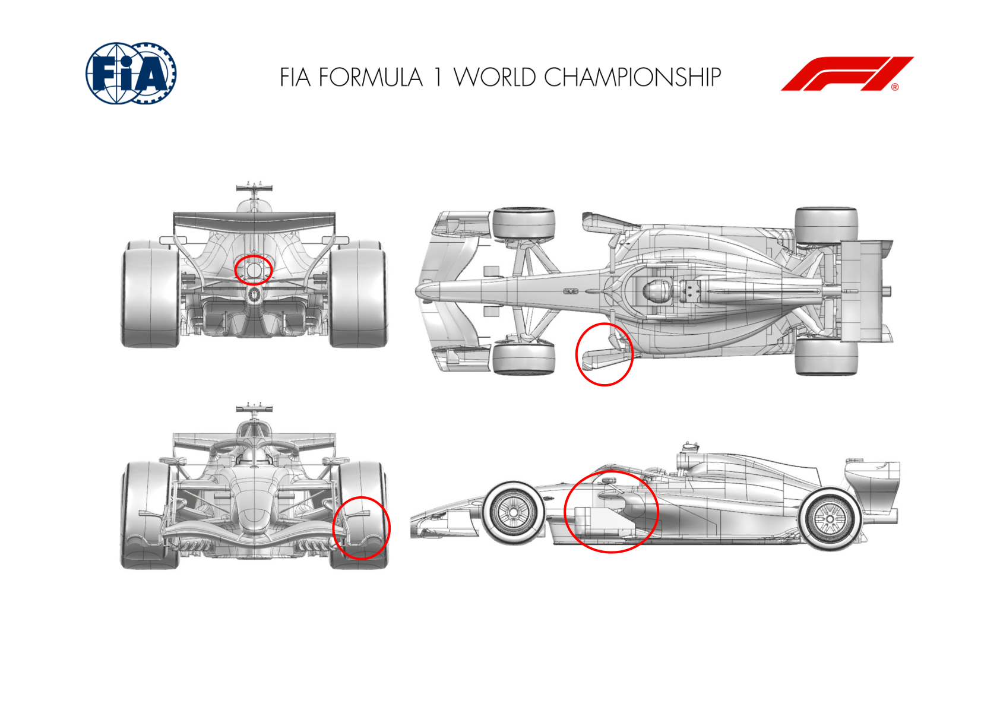
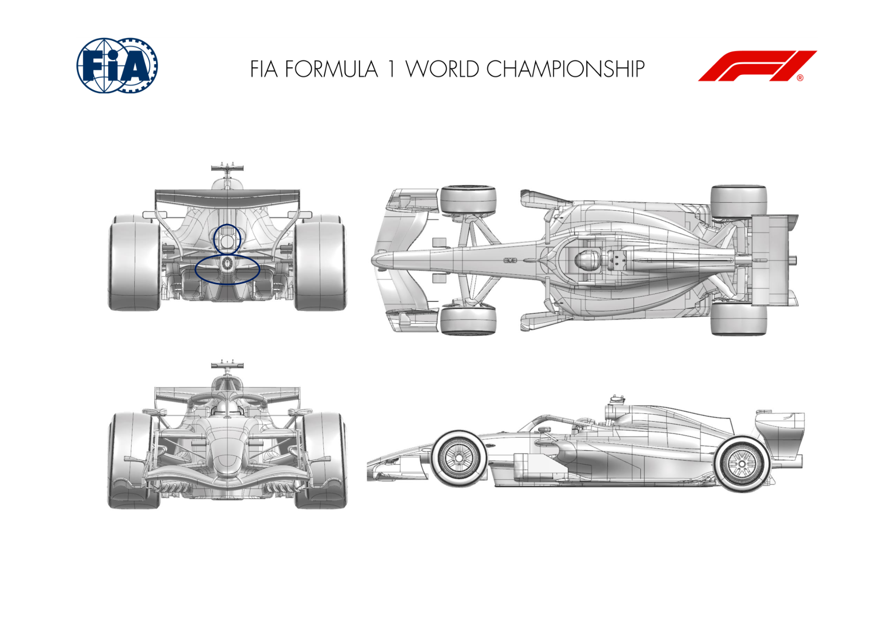
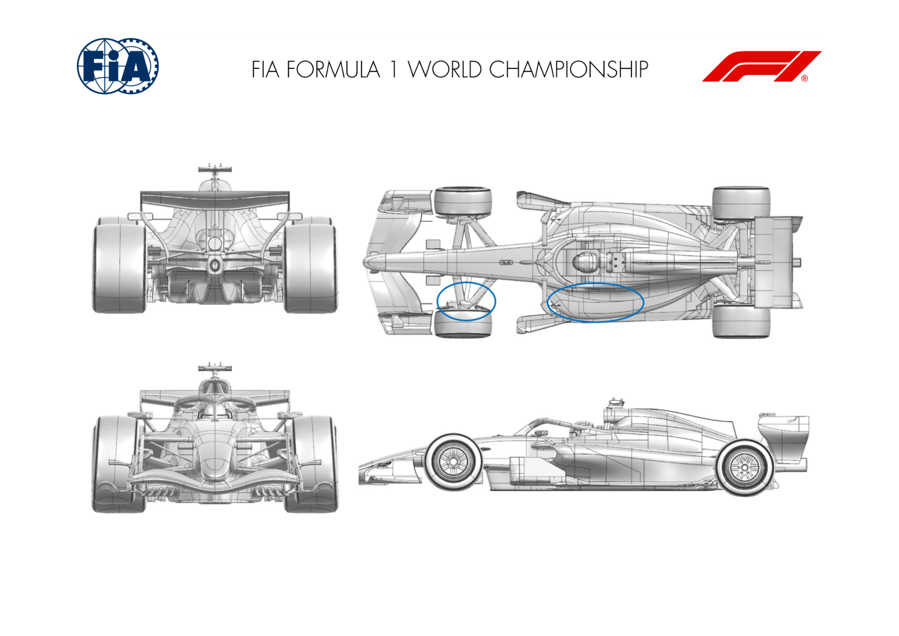
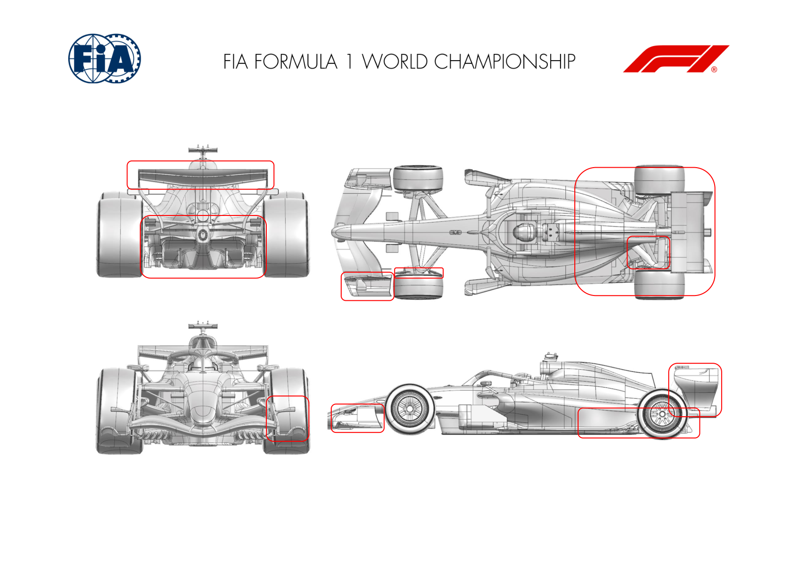
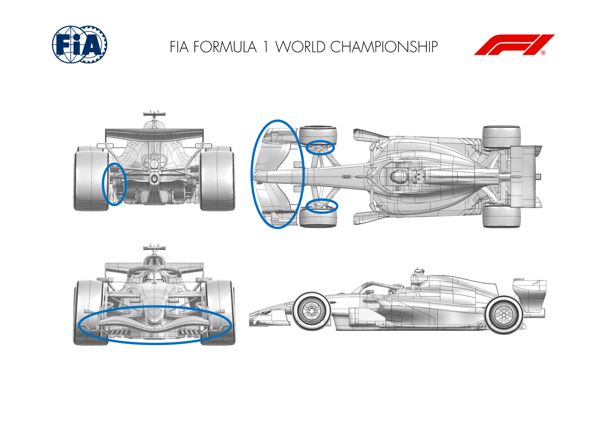
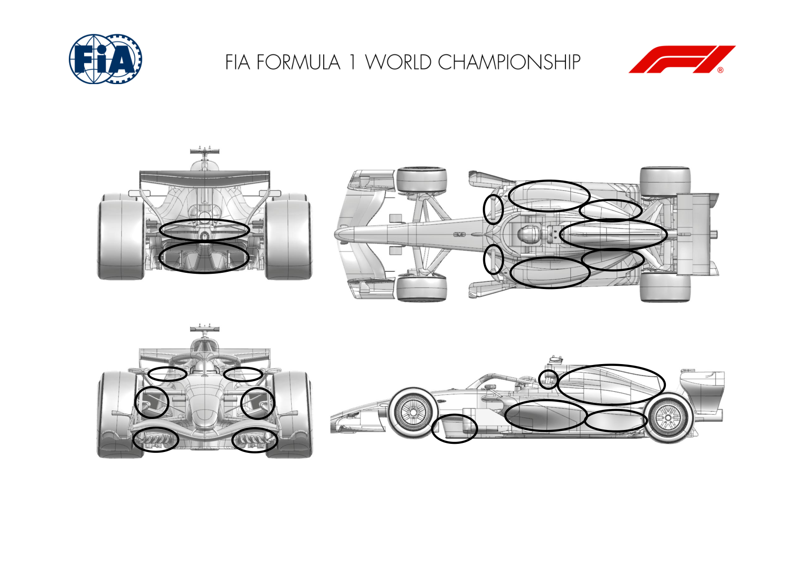

2026 AUSTRIAN GRAND PRIX

26 - 28 Jun 2026

From The FIA Formula 1 Media Delegate Document 14

To All Teams, All Officials Date 26 June 2026

Time 10:56

Title Car Presentation Submissions

Description Car Presentation Submissions

Enclosed 2026 Austrian Grand Prix - Car Presentation Submissions.pdf

Roman De Lauw

The FIA Formula 1 Media Delegate

Car Presentation – Austrian Grand Prix

McLaren Mastercard F1 Team

| No. | Updated component | Primary reason for update | Geometric differences | Description |
| --- | --- | --- | --- | --- |
| 1 | Rear Corner | Performance - Flow Conditioning | Revised Rear Brake Duct Inlet | The rear brake duct inlet has been revised, targeting an improvement in local flow conditioning and resultant gain in aerodynamic load generated around the rear corner. |
| 2 | Rear Wing | Performance - Drag reduction | Alternative Straight Line Mode Flap Position | The rear wing has been modified to deploy the flap to an alternative position in straight line mode resulting in a larger reduction in drag. |

Car Presentation – 2026 Austrian Grand Prix

*Mercedes-AMG PETRONAS F1 Team*

| No. | Updated component | Primary reason for update | Geometric differences | Description |
| --- | --- | --- | --- | --- |
| 1 | Front Suspension | Performance - Flow Conditioning | Leg fairing angle of attack adjustment | Leg fairing angle of attacked adjusted to improve alignment to onset flow throughout ride height range, resulting in improved flow to the rear of the car. |
| 2 | Coke/Engine Cover | Cooling Range | Narrower rear exit A narrower rear exit allows more cooling range tuning, biasing more cooling flow to the louvres rather than the rear exit. |  |

Car Presentation – Austrian Grand Prix

Oracle Red Bull Racing.

| No. | Updated component | Primary reason for update | Geometric differences | Description |
| --- | --- | --- | --- | --- |
| 1 | Sidepod Inlet | Reliability | Revised sidepod inlet geometry extending downwards and rearwards | Optimised following earlier changes upstream the sidepod inlet has been re-profiled and re-positioned to capture air with good enough pressure for the radiators. This led to re-profiling to meet the floor. |
| 2 | Engine Cover | Reliability | Revised sidepod panels to meet the new inlet geometry then following the floor junction profile | Having altered the inlet, the consequence was then to re-optimise the sidepod profiles simultaneously Minor changes to the central engine cover and cooling louvres. |
| 3 | Floor Floor Board | Performance - Local Load Performance – flow conditioning | Subtle revisions to the surfaces including forward floor as well as the junction line with the topbody Subtle profile changes to the louvres and supports between | A further iteration of optimisation to compliment the new sidepod inlet, extending to the forward floor and then to the sidepod all to generate more local load and extract performance As part of the sidepod revision, a floor board change was also accomplished to offer another iteration of design to improve the downstream conditions for the sidepod and beyond. |
| 4 | Rear Suspension | Performance - Local Load | Reprofiled fairings and junctions to the tail/gearbox and into the rear wheel bodywork | Revisions to the fairings to better match the upstream conditions and maintain flow stability whilst extracting more local load. |
| 5 | Rear Corner | Performance - Local Load | Revised for the rear suspension fairings and attendant winglets | Primarily inboard of the rear wheels to accommodate the fairing revisions and blends into the wheel bodywork keeping the surfaces tidy whilst maintaining flow stability. |

| No. | Updated component | Primary reason for update | Geometric differences | Description |
| --- | --- | --- | --- | --- |
| 6 | Rear Wing | Performance - Local Load | Revised pylon profiles | Given the pylons now by regulation contact the mainplane underside, the interface is sensitive and revised with pylon changes to the same element profiles seeking to extract more load and at least maintain flow stability. |
| 7 | Exhaust Tailpipe | Performance - Local Load | Revised overlap between the tailpipe exit profile and the supporting tailpipe bracket | A subtle re-positioning of the tailpipe has enabled the last portion, which is regulated to circulated and within a limited angle range to have greater overlap with the one permitted supporting bracket to extract more local load. |

Car Presentation – Austrian Grand Prix

Scuderia Ferrari HP

| No. | Updated component | Primary reason for update | Geometric differences | Description |
| --- | --- | --- | --- | --- |
| 1 | Front Wing Endplate | Performance - Local Load | Revised front wing endplate with new diveplane and new footplate vane arrangement | Further step applied to the new geometry introduced in the previous race in Spain, consolidating the original flow features and performance objectives of this front wing |
| 2 | RV Tail | Performance - Local Load | Removal of the central RV Tail element Free Practice test Item, not track specific and focused on data gathering and correlation exercise |  |
| 3 | Floor Board | Performance – Correlation | Front floor board elements optimisation, single vertical element Free practice test items, focused on aerodynamic correlation. Aim is to understand on-track behaviour and gather data in normal running conditions |  |
| 4 | Mirror stay |  | Shorter mirror vertical stay and connection to sidepod |  |

Car Presentation – Austrian Grand Prix

Williams

No Updates

Car Presentation – Austrian Grand Prix

Visa Cash App Racing Bulls

| No. | Updated component | Primary reason for update | Geometric differences | Description |
| --- | --- | --- | --- | --- |
| 1 | Exhaust Tailpipe | Performance – Flow Conditioning | Lowered tailpipe with new bracket | The tailpipe position helps with the flow management around the rear of the car, allowing the rear wing to perform efficiently. |
| 2 | Diffuser | Performance – Flow Conditioning | Revised diffuser trailing edge devices | Further refinement of the diffuser trailing edge devices, providing improved aerodynamic flow conditioning at the back of the car. |

Car Presentation – Austrian Grand Prix

Aston Martin Aramco F1 Team

No updates submitted for this event.

Car Presentation – Austrian Grand Prix

*TGR HAAS F1 TEAM*

| No. | Updated component | Primary reason for update | Geometric differences | Description |
| --- | --- | --- | --- | --- |
| 1 | Front Corner | Performance - Flow Conditioning | Revised Front Brake Duct design | The FBD geometry was refined to provide a smoother flow path, reducing local losses and improving downstream flow quality towards the rear of the car. The revised scoop configuration required a concurrent optimisation of the suspension leg fairings to preserve aerodynamic efficiency. |
| 2 | Cooling Louvres | Circuit specific - Cooling Range | Additional Gill option | The circuit-specific operating conditions required an additional increase in cooling capacity, achieved through the introduction of two additional apertures on the upper surface of the sidepod. |

Car Presentation – Austrian Grand Prix

Audi Revolut F1 Team

| No. | Updated component | Primary reason for update | Geometric differences | Description |
| --- | --- | --- | --- | --- |
| 1 | Front Wing Endplate | Performance – Local Load | Updated front wing endplate design | The updated FWEP design leads to local load gain and improves flow structures and characteristics of the car. |
| 2 | Front Corner | Performance – Flow Conditioning | Updated lower deflector stay layout | For this event a rearrangement of the lower deflector’s stays is introduced to improve local flow conditions on the front corner. |
| 3 | Floor | Performance – Local Load | Updated rear floor design | New rear floor design resulting in a load improvement at the rear of the car, also altering rear axle load characteristic. |
| 4 | Rear Corner | Performance – Flow Conditioning | Updated lower deflector design | In combination with the rear floor update the rear deflector geometries were adapted to manage the new flow conditions in this area. |
| 5 | Rear Suspension | Performance – Local Load | Updated rear suspension design | In combination with the rear floor update the rear flow conditions in this area. |
| 6 | Beam Wing | Performance – Local Load | Updated lower beam wing design | The rear beam wing is part of the overall rear end update. This change compliments the new flow conditions around the new rear wing. |
| 7 | Rear Wing | Performance – Local Load | Updated rear wing design | The new rear wing design results in improved local load at the rear axle together with complimenting development. |

Car Presentation – Austria Grand Prix

BWT Alpine F1 Team

| No. | Updated component | Primary reason for update | Geometric differences | Description |
| --- | --- | --- | --- | --- |
| 1 | Front Wing | Performance – Local Load | New front wing design | Evolution of the front wing design as part of our in season development, delivering incremental aerodynamic gains and improving flow management. |
| 2 | Front Wing Endplate | Performance – Local Load | New front wing design | The front wing endplate has been part of the redesign to improve downstream flow control and enhance overall aerodynamic efficiency. |
| 3 | Nose | Performance – Local Load | New front wing design | The nose has been updated to better integrate the new front wing design and deliver better aerodynamic performance across the front end. |
| 4 | Front Corner | Performance - Flow Conditioning | Revised front corner geometry | The front corner has been redesigned to work flow management and aerodynamic efficiency. |
| 5 | Diffuser | Performance - Flow Conditioning | Addition of a winglet | An aero winglet has been added to improve local flow management and deliver efficient aerodynamic load towards the rear end. |

Car Presentation – Austrian Grand Prix

Cadillac

| No. | Updated component | Primary reason for update | Geometric differences | Description |
| --- | --- | --- | --- | --- |
| 1 | Sidepod Inlet | Performance – Cooling Range | Larger and reprofiled sidepod inlet area | The sidepod inlet has been reprofiled and enlarged as part of a broader bodywork update, increasing the intake area to efficiently increase power unit cooling capacity |
| 2 | Engine Cover | Performance – Cooling Range | Resurfaced engine cover and updated fin profile | The engine cover has been updated as part of wider bodywork update to facilitate increase in power unit cooling capacity whilst also improving flow quality to the rear of the car |
| 3 | Sidepod / Coke | Performance – Flow Conditioning | Resurfaced top deck and increased undercut with redefined coke profile | The sidepod top deck has been resurfaced to facilitate increased power unit cooling capacity, to rear corners and suspension |
| 4 | Cooling Louvres | Performance – Cooling Range | Updated sidepod top deck and engine cover louvres | The sidepod top deck and engine cover louvres updates to the underlying geometry, allowing the ability to tune the cooling capacity to specific circuit requirements |
| 5 | Mirror Stay | Performance – Flow Conditioning | Change of incidence and updated mirror stay profiles | The mirror stays have been updated to improve flow conditioning to the rear of the car, minimising losses and improving rear aerodynamic load across the range of operating conditions and attitudes |
| 6 | Roll Hoop Leg Fairings | Performance – Flow Conditioning | Reprofiled roll hoop leg fairing surfaces | The roll hoop stays have been reprofiled to improve aerodynamic stability and therefore improve the flow conditioning to the rear of the car across a wider range of yaw angles |

| No. | Updated component | Primary reason for update | Geometric differences | Description |
| --- | --- | --- | --- | --- |
| 7 | Floor Bib | Performance – Local Load | Updated bib and keel geometry | The bib and keel geometry has been updated to increase local load and improve flow conditioning to the rear of the car and diffuser |
| 8 | Floor Leading Edge | Performance – Local Load | Reprofiled floor surfaces with updated leading-edge devices | The floor leading edge surfaces and devices have local load and improve the flow quality to the rear of the car and diffuser |
| 9 | Diffuser | Performance – Local Load | Updated diffuser surface geometry | The rear floor and diffuser surfaces have been rear of the car whilst retaining favourable characteristics throughout the car's operating envelope |
| 10 | Beam Wing | Performance – Local Load | Reprofiled beam wing surfaces | The beam wing has been updated as part of the wider floor update, to increase load aerodynamic load at the rear of the car |

