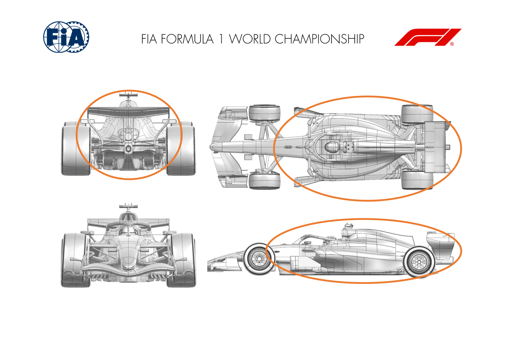
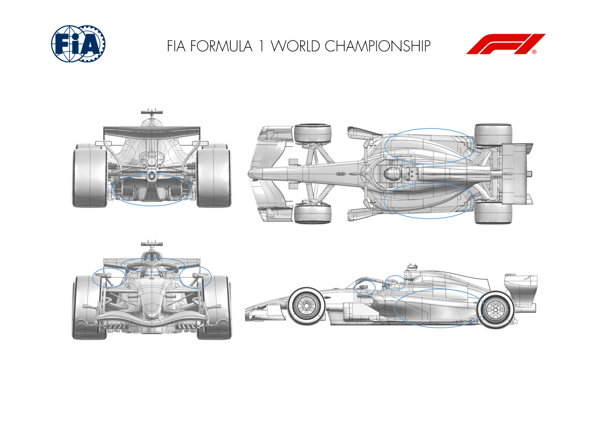
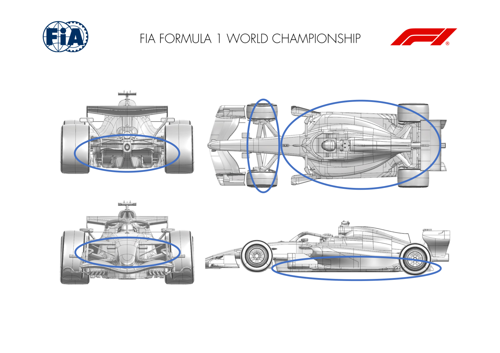
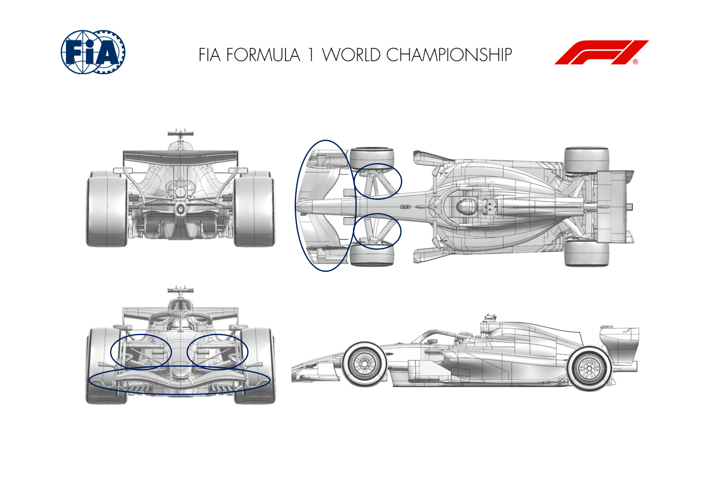
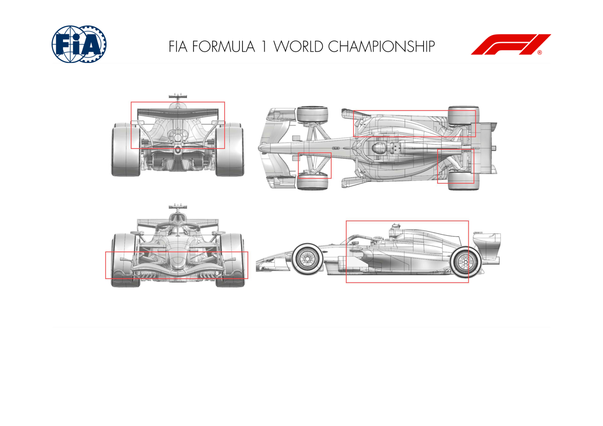
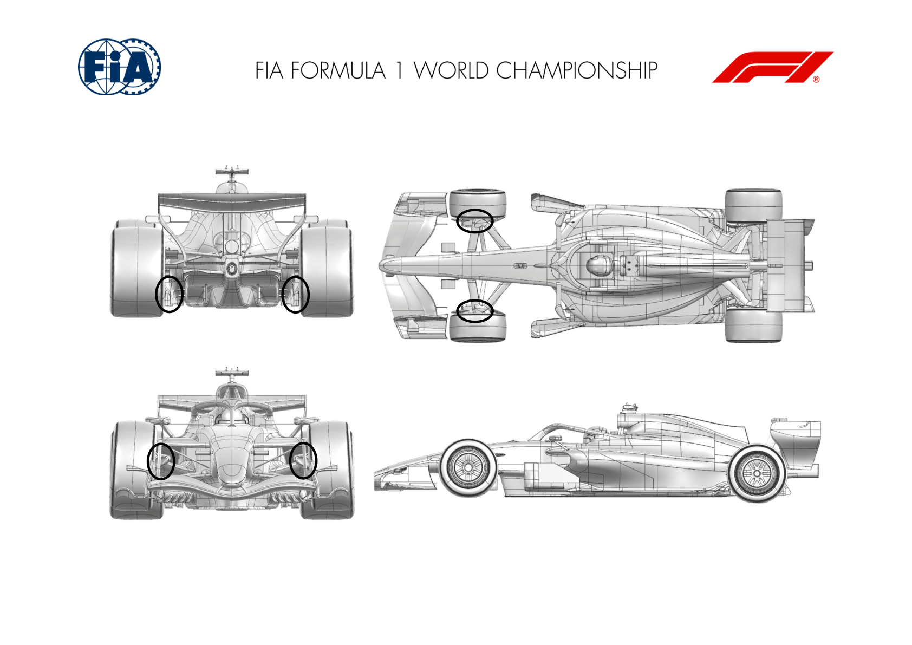

2026 AZERBAIJAN GRAND PRIX

24 - 26 September 2026

From The FIA Formula 1 Media Delegate Document 11

To All Teams, All Officials Date 24 September 2026

Time 09:50

Title Car Presentation Submissions

Description Car Presentation Submissions

Enclosed 2026 Azerbaijan Grand Prix - Car Presentation Submissions.pdf

Cameron Kelleher

The FIA Formula 1 Media Delegate

Car Presentation – Azerbaijan Grand Prix

McLaren Mastercard F1 Team

| No. | Updated component | Primary reason for update | Geometric differences | Description |
| --- | --- | --- | --- | --- |
| 1 | Sidepod Inlet | Performance - Flow Conditioning | Revised Sidepod Inlet Shape | The sidepod inlet has been revised aiming at improved flow conditioning towards the rear of the car for improved aerodynamic performance. |
| 2 | Coke/Engine Cover | Performance - Flow Conditioning | Revised Engine Cover and Coke Line | The engine cover and coke line have been revised in conjunction with the new sidepod inlet enhancing the flow conditioning downstream. |
| 3 | Coke/Engine Cover | Performance - Flow Conditioning | Alternative Sidepod Shape | An alternative sidepod shape is available as an option for the aforementioned bodywork, resulting in a change of resultant aerodynamic properties. |
| 4 | Cooling Louvres | Circuit specific - Cooling Range | New Louvre Layout | As part of the new bodywork package, cooling louvre layout and position have been altered for maximum aerodynamic performance at various cooling levels. |
| 5 | Floor Edge | Performance – Local Load | Revised Floor Edge Shape | The flow conditioning changes from the bodywork are utilised by a revised floor edge design, resulting in improved aerodynamic performance. |
| 6 | Diffuser | Performance – Local Load | Revised Diffuser Layout | In conjunction with the floor edge, the diffuser has been revised, aiming at extracting more aerodynamic performance from the new flow topology. |
| 7 | Rear Suspension | Performance - Flow Conditioning | Revised Rear Suspension Fairings | The changes in upstream aerodynamic flow conditions incentivise a modification to the rear suspension fairings to maximise aerodynamic performance. |

| No. | Updated component | Primary reason for update | Geometric differences | Description |
| --- | --- | --- | --- | --- |
| 8 | Rear Wing | Performance - Drag reduction | Alternative Straight Line Mode Flap Position | The medium isochronal rear wing has been modified to deploy the flap to an alternative position in straight line mode, resulting in a larger reduction in drag. |

Car Presentation – 2026 Azerbaijan Grand Prix

Mercedes-AMG PETRONAS F1 Team

No updates submitted for this event.

Car Presentation – Azerbaijan Grand Prix

Oracle Red Bull Racing

| No. | Updated component | Primary reason for update | Geometric differences | Description |
| --- | --- | --- | --- | --- |
| 1 | Floor Body & Diffuser | Performance - Local Load | Revised floor and diffuser geometries. | The realisation of development iterations sees a new floor geometry with subtle changes within the permitted geometry to extract more local load whilst maintaining flow stability. |
| 2 | Sidepod | Performance - Local Load | Revised split line to the floor | Accompanying the new floor, the sidepod has been revised with a new junction or split line to the floor, to supplement the floor changes yielding more local load. |
| 3 | Cooling louvres | Reliability | Revised to suit the sidepod | To blend the new sidepod to existing surrounding geometry, the cooling louvres have been revised whilst maintaining the range of cooling levels offered previously. |
| 4 | Mirrors | Flow Conditioning | Revised mirror geometry | Also accompanying the floor and sidepod, the mirror assembly geometry has been revised to aid the downstream conditioning and supplement the local load increase. |
| 5 | Halo | Flow Conditioning | Revised halo fairing geometry | A small change to revise a turning vane on the the flow stability and therefore load generation. |

Car Presentation – Azerbaijan Grand Prix

SCUDERIA FERRARI HP

No updates submitted for this event.

Car Presentation – Azerbaijan Grand Prix

Williams

| No. | Updated component | Primary reason for update | Geometric differences | Description |
| --- | --- | --- | --- | --- |
| 1 | Floor | Performance - Local Load | An updated Floor Bodywork Assembly has been introduced, including new Floor Leading Edge devices, Floor Body and Floor Corner geometry. | We have modified the forward and outboard regions of the floor to extract more performance both locally and across the main underfloor surfaces. |
| 2 | Tail | Performance - Local Load | A revised Tail geometry has been introduced to suit the new Floor update. | The new surfaces work together with the new floor to generate increased performance locally around the RIS. |
| 3 | Front Corner | Performance - Flow Conditioning | Reprofiled surfaces have been applied to the Front Brake Duct flow conditioning devices. | The forward and rearward regions of the Front improved interaction with the Front Wing and an improved downstream flow field with the rest of the car. |
| 4 | Rear Suspension | Performance - Local Load | A change in suspension cladding orientation. | To suit the new onset flow, the surfaces on the rear suspension have been realigned to offer additional performance in the rear corner. |
| 5 | Rear Corner | Performance - Local Load | The Rear Brake Duct furniture has been modified with new leading edge features. | The previously described geometry changes have unlocked a new flow field opportunity in the rear corner and we have been able to extract additional performance in this region by retuning these devices. |

Car Presentation – Azerbaijan Grand Prix

Visa Cash App Racing Bulls

| No. | Updated component | Primary reason for update | Geometric differences | Description |
| --- | --- | --- | --- | --- |
| 1 | Front Wing | Performance – Flow Conditioning | New front wing assembly | The new front wing geometry helps establish a clean flow field, which leads to improved it. |
| 2 | Front Corner | Performance – Flow Conditioning | New brake duct and front lip Working in conjunction with the new front wing, the front corner & suspension updates help manage the flow downstream and around the car, allowing the floor to perform effectively. |  |
| 3 | Front Suspension | Performance – Flow Conditioning | Profile changes to suspension legs |  |

Car Presentation – Azerbaijan Grand Prix

Aston Martin Aramco F1 Team

No updates submitted for this event.

Car Presentation – Baku Grand Prix

TGR HAAS F1 TEAM

No update for this event

Car Presentation – Azerbaijan Grand Prix

Audi Revolut F1 Team

| No. | Updated component | Primary reason for update | Geometric differences | Description |
| --- | --- | --- | --- | --- |
| 1 | Front Wing | Performance – Flow conditioning | Full FW + Nose Fairing A full new front wing is introduced alongside an update nose fairing to deliver a better flow to the rest of the car while covering the balance levels of the new package. |  |
| 2 | Front Wing Endplate |  |  |  |
| 3 | Nose |  |  |  |
| 4 | Front Suspension | Performance – Flow conditioning | New front suspensions covers | The front suspension fairings were revised to complement the revised front wing and nose and support the aerodynamic intent of the new package. |
| 5 | Floor Body | Performance – Local load | New floor A new floor is introduced for this event. All surfaces are new and designed to deliver a consistent load increase. |  |
| 6 | Floor leading edge devices |  |  |  |
| 7 | Diffuser |  |  |  |

| No. | Updated component | Primary reason for update | Geometric differences | Description |
| --- | --- | --- | --- | --- |
| 8 | Halo | Performance – Flow conditioning | New bodywork and halo fairing | Revised bodywork and associated cooling options are introduced to work with the updated package and improve management of the downstream flow structures. |
| 9 | Coke/Engine Cover |  |  |  |
| 10 | Rear Suspension | Performance – Local load | New Rear suspension covers and rear brake duct furniture | The rear suspension covers and brake duct elements have been revised to complement the updated rear end flow field and improve aerodynamic performance. |
| 11 | Rear Corner |  |  |  |
| 12 | Beam Wing | Performance – Local load | New rear wing assembly | A revised rear wing assembly is introduced featuring updated elements designed to operate as part of the overall aerodynamic package. |
| 13 | Rear Wing |  |  |  |
| 14 | Rear Wing Endplate |  |  |  |

Car Presentation – Azerbaijan Grand Prix

BWT Alpine F1 Team

No updates submitted for this event.

Car Presentation – Azerbaijan Grand Prix

Cadillac

| No. | Updated component | Primary reason for update | Geometric differences | Description |
| --- | --- | --- | --- | --- |
| 1 | Front Corner | Performance – Brake Cooling | Updated brake cooling inlet and exit duct profiles | The front corner geometry has been revised to increase the available brake cooling capacity, whilst maintaining flow quality to the rear of the car |
| 2 | Front Suspension | Performance – Flow Conditioning | Revised suspension fairing surfaces | The front suspension fairing surfaces have been front corner and brake duct geometry |
| 3 | Diffuser | Performance – Local Load | Revised winglet lower edge geometry | The profile of the lower shedding edge of the rear aerodynamic load across the operating envelope of the car |

