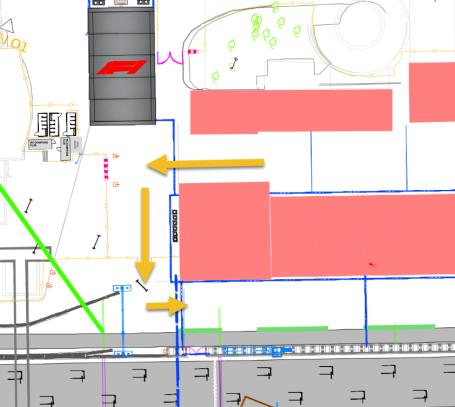
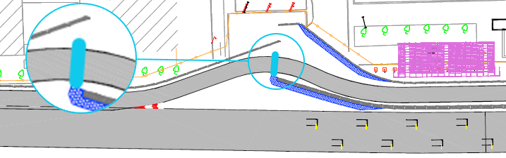
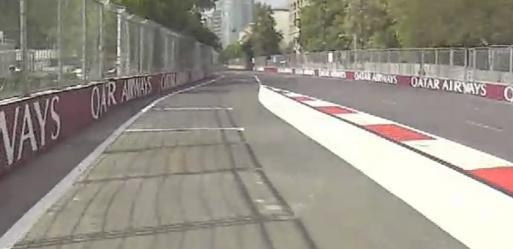
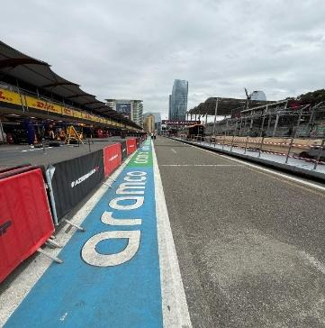
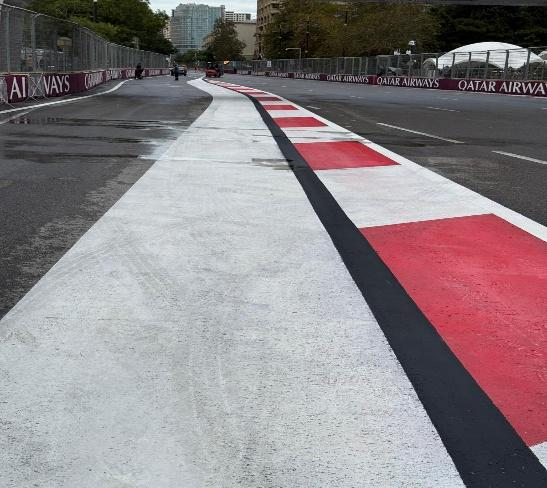
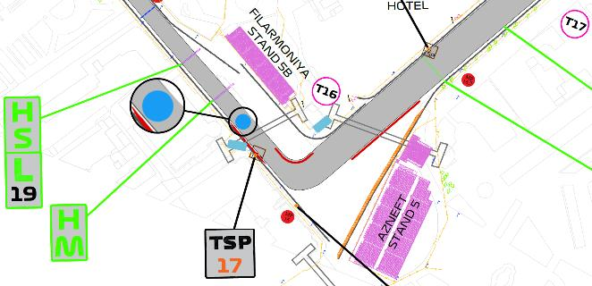
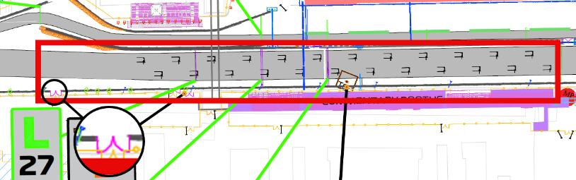

2026 AZERBAIJAN GRAND PRIX

24 - 26 September 2026

From The FIA Formula 1 Race Director Document 56

To All Teams, All Officials Date 26 September 2026

Time 12:12

Title Race Director's Competition Notes V3

Description Race Director's Competition Notes V3

Enclosed 2026 AzerbaijanGrand Prix Competition Notes V3.pdf

Rui Marques

The FIA Formula 1 Race Director

2026 A ZERBAIJAN G RAND P RIX

24 – 26 September 2026

From The FIA Formula 1 Race Director

To All Officials, All Teams Date 26 September 2026

COMPETITION NOTES V3 (changes in magenta)

General Instructions

1. Laps during Qualifying Session and Reconnaissance Lap(s), For the safe and orderly conduct of the Competition, other than in exceptional circumstances accepted as such by the Stewards, any driver that exceeds the maximum time from the Second Safety Car Line to the First Safety Car Line on ANY lap during and after the Qualifying Session, including in- laps and out-laps or during reconnaissance laps when the pit exit is opened for the Race, may be deemed to be going unnecessarily slowly. Teams and Drivers will be informed of the maximum time after the second Practice Session. For the avoidance of doubt, this does not supersede Articles B1.8.5 and B4.1.1 of the FIA F1 Regulations, which apply to the entire Circuit, furthermore this includes the pit lane as well. Incidents will normally be investigated after the Qualifying Session or the Race.

2. Lapping during the Race

The International Sporting Code (ISC) requires drivers who are caught by another car to allow the faster driver past at the first available opportunity. The F1 marshalling system will be set to give a pre-warning when the faster car is within 3.0s of the car about to be lapped, this should be used by the team of the slower car to warn their driver he is soon going to be lapped and that allowing the faster car through should be considered a priority. When the faster car is within 1.2s of the car about to be lapped blue light panels will be shown to the slower car (in addition to blue light panels, blue cockpit lights and a message on the timing monitors) and the driver must allow the following driver to overtake at the first available opportunity.

3. Article B5.13.6 of the FIA F1 Regulations In order to avoid the likelihood of accidents before the safety car returns to the pits, from the point at which the orange lights on the safety car are extinguished drivers must proceed at a pace which involves no erratic acceleration or braking nor any other manoeuvre which is likely to endanger other drivers or impede the restart.

4. ERS Safety Check after Covers Off In accordance with the provisions set out in Appendix B2, Section 12.1 of the FIA F1 Regulations, as work required by the Technical Delegate; Each morning, immediately after covers are removed when the cars are under parc fermé conditions (Articles B3.4.1, B3.4.2 and B3.4.3), all Teams must connect the umbilical to their cars and start a telemetry data logging for the sole

1

purpose of checking the car ERS safety status. 5. Pit Lane Safety Article B1.6.2c of the FIA F1 Regulations states: “Team personnel are only allowed in the Pit Lane immediately before they are required to work on a Car and must withdraw as soon as the work is complete.” For the safe and orderly conduct of the competition, in the context of the race only, the requirements of Article B1.6.2c are considered to apply until such time as all cars able to do so have completed the Race and have entered the designated Parc Ferme area. Following the end-of-session signal, described in Article B2.5.3, and when the Race Director considers it safe to do so, the message “ALL PASS HOLDERS MAY ACCESS THE PIT LANE” will be sent to all competitors using the official messaging system; this being the signal to all competitors that the requirements of Article B1.6.2c are no longer applicable, and thus holders of passes not valid for access to the Pit Lane (i.e. passes other than those marked “Pit Lane” or “Pit Lane All Times”) may enter the Pit Lane. Competitors are reminded that in accordance with the ISC, Article 9.15.1 “The Competitor shall be responsible for all acts or omissions on the part of any person taking part in, or providing a service in connection with, a Competition or a Championship on their behalf, including in particular their employees, direct or indirect, their Drivers, mechanics, consultants, service providers, or passengers, as well as any person to whom the Competitor has allowed access to the Reserved Areas.

6. Lap times in all LTCS and TTCS Only lap times which have been completed on the track will be included for the purpose of any classification.

7. Starting Procedure 7.1 For the safe and orderly conduct of the Competition, once all F1 Cars starting from the grid have returned to the grid at the end of the formation lap or laps prior to the Race or a Standing Start Resumption, the starting grid light panels will be illuminated blue (flashing) for 5 seconds and the information panel on the start gantry will display the message “Pre-Start”, following which the light sequence defined in to Article B5.7.2 of the FIA F1 Regulations will commence. 7.2 Article B1.8.4 states “the light signals displayed on the trackside light panels have the same meaning as flag signals”. For the avoidance of doubt, the starting grid panels are not considered a track side light panel, i.e, the display of a yellow starting procedure panel is for information propose only, without any regulatory instruction, according to Appendix H, Article 2.5.5 b) to the ISC.

8. Finishing the Race For the purpose of finishing the Race, pursuant to Article B2.5.3 of the FIA F1 Regulations, the “Line” referred to will be the Control Line on the track and not in the Pit Lane.

9. Double Waved Yellow Flag For the safe and orderly conduct of the competition, in addition to the provisions of the Article B1.8.4b, any driver passing through a double waved yellow flag marshalling sector during a Free Practice session will have that lap time deleted.

2

Competition Specific Instructions 10. Parc Fermé Team Personnel permitted access to the Parc Fermé area for the sole purpose of fitting cooling fans and undertaking any work required by those officials charged with supervision of parc fermé, may enter Parc Fermé using the route shown below:

11. Marshalling System 11.1 A car entering the Pit Lane will be subject to the marshalling state (i.e. yellow flag or double yellow flag) of the associated sector until it passes the blue line marked on the image below.

11.2 A car leaving the Pit Lane will be subject to the marshalling system state i.e. yellow flag or double yellow flag of the sector into which it is emerging after it passes the blue line marked on the image below.

12. Support Races team barrier placement and movements Team barrier placement prior to and during all support category Practice Sessions and Races: No more than (4) four meter from the garage. Please ensure that your pit stop gantry arms are moved back towards the garage during all support category activities. Support Crews and Trolleys will be released into Pit Lane no earlier than 30 minutes prior to the opening of pit exit for their respective sessions. Support Category competition vehicles will be released from the marshalling area no earlier than 15 minutes prior to the opening of pit exit for their respective sessions.

13. Practice starts 13.1 During Free Practice sessions and Reconnaissance Laps, practice starts may be carried out in the pit exit road on the left-hand side using one of the painted grid boxes shown in the image below. Cars queuing to perform a practice must keep to the left-hand side of the Pit Exit Road to allow sufficient space for cars not wishing to do a practice start to pass. Cars NOT wishing to perform a practice start

3

may overtake any car queuing to do a practice start but may not cross (refer to Chapter IV article 6c of the appendix L of the ISC) the white line adjacent to the track edge. (as highlighted in the image bellow with a blue arrow).

13.2 Practice starts after the Free Practice sessions will be performed according to Article B4.2.2 of the FIA F1 Regulations. 13.3 For the safe and orderly conduct of the competition, pursuant to article B4.2.2, any driver on track when the end of session signal is shown for the Free Practice 2 session, may complete two further laps, for the sole purpose of stopping on the grid to perform practice starts on each of these laps. 13.4 If the Free Practice session is resumed with less than 2 minutes remaining, for the purpose of facilitating practice starts on the grid as provided for in Article B4.2.2 of the FIA F1 Regulations, any car wishing to leave the Pit Lane must proceed down the Pit Lane without undue delay and exit the Pit Lane without leaving a significant gap to the car ahead. 13.5 For the avoidance of doubt, practice starts may not be carried out during the Qualifying session. 13.6 Practice starts during the reconnaissance laps prior to the Race: Practice starts may be carried out in the pit exit road on the left-hand side using one of the painted grid boxes and must NOT cross the white line separating the Pit Exit Road from the circuit. Cars NOT wishing to perform a practice start should leave the pit lane and MUST cross the white line separating the Pit Exit Road from the track at the earliest opportunity and join the “normal” racing line. All such cars MUST NOT cross back into the Pit Exit Road. 13.7 Under no circumstances can drivers perform a practice start if another F1 Car remains stationary in front of them.

14. Article B1.6.3d of the FIA F1 Regulations (…) Any car(s) driven to the end of the Pit Lane prior to the start or re-start of a LTCS must form up in a line in the Fast Lane and leave in the order they got there (…) It is noted that a car will be considered to be “in the fast lane” when a tyre has crossed the solid white line separating the fast lane from the inner lane, in this context crossing means that all of a tyre should be beyond the far side, with respect to the garages, of the line separating the fast lane from the inner lane.

For the avoidance of doubt, Appendix L, Chapter IV, Article 5 b) to the ISC states that: Once a car has left its garage or pit stop position it should blend into the fast lane as soon as it is safe to do so, and without unnecessarily impeding cars which are already in the fast lane. Thus, after the start or re-start of the Free Practice session or the Qualifying Session, if there is a suitable gap in a queue of cars in the fast lane, such that a driver can blend into the fast lane safely and without unnecessarily impeding cars already in the fast lane, they are free to do so.

4

Furthermore, it is noted that during the Free Practice sessions and Qualifying, a car driving in the inner lane, parallel to the fast lane, will not be considered to have blended into the fast lane at the earliest opportunity. Additionally, Appendix L, Chapter IV, Article 5 d) to the ISC states that: Cars in either the fast lane or working lane may not overtake other cars in the fast lane except in exceptional circumstances. In this context a “stopped car” is one which has an obvious mechanical problem.

15. Lines at the Pit Entry and Pit Exit 15.1 In accordance with Appendix L, Chapter IV, Articles 4 and 6 to the ISC drivers must follow the procedures at pit entry and pit exit.

15.2 Pertaining to Appendix L, Chapter IV, Article 4 to the ISC, any driver passing to the right left-hand side of the intersection of the dashed line with the continuous line (as indicated in the image below) will be considered as entering the pit lane.

15.3 For the safety and ordely conduct of the event, no part of a tyre of a car exiting the pit lane may cross the line painted in the pit exit road for the purpose of separating cars leaving the pit lane from those on the track. For the avoidance of doubt, crossing means that the outside of any tyre should not go beyond the outside, with respect to the pit exit road, of this line.

16. Stopping the Qualifying Session Pursuant to Article B4.3.1b of the FIA F1 Regulations, should any period of the Qualifying Session be interrupted with less than 100 seconds remaining, the relevant period of the Qualifying Session will not be resumed.

17. Post Qualifying Session drivers weighing Any driver who has finished participating in the Qualifying Session after Q1 or Q2, must proceed through the pit lane directly to the FIA scales immediately after they have returned to their team’s

5

garage. The drivers may not drink anything or do anything which increases their weight before it is recorded by the FIA. Any driver who stops on the track during the Qualifying Session and is not required to visit the Medical Centre must proceed to the FIA scales to get their weight recorded before returning to his team. Drivers who finish within the top 10 must proceed to the FIA scales immediately when out of their cars without contact with any other person.

18. ERS Hazard Status If the ERS is in a Hazard Status, the relevant team will be required to send mechanics to the pit entry area near race control. This will be done after the session. They will then be picked up by car and taken to their F1 car.

19. Leaving the garage before and during all Sessions 19.1 Before the start of the Free Practice sessions or Qualifying, or prior to the pit exit opening for the reconnaissance laps, no cars may enter the pit lane to proceed to pit exit until 5 minutes before the scheduled start time or announced start time in the case of a delayed session. 19.2 If the Free Practice sessions or Qualifying, or any period thereof is delayed or stopped, cars may only enter the Fast Lane after the re-start time is confirmed via the official messaging system.

20. Places to remove cars from the track Indicated by fluorescent orange panels/paintings on the barriers.

21. Removing cars from the grid Cars may be removed from the grid through the gate adjacent to the start line, grid position 1 and 15.

22. Race Suspension or Starting Procedure Suspension 22.1 In case of Race suspension or Starting Procedure suspension, (except in case of Article B5.14.3 of the FIA F1 Regulations – stopping on the grid), cars will be stopped in the fast lane. The first car must stop in the vicinity of the last team garage. 22.2 Safety Car Resumption Point: Safety Car will leave the pit lane 1 minute before the resumption and wait for the F1 cars before Turn 16. (as per the image below).

22.3 When pit exit is open for the resumption of the race, in accordance with Article B5.15.2f, cars must exit the pit lane without undue delay and without leaving a significant gap to the car ahead.

23. Grid Panel Placement On the left-hand side of the grid.

24. Grid Procedure Article B5.2.4 of the FIA F1 Regulations states that “Any F1 Car which does not complete a reconnaissance lap and reach the grid under its own power will not be permitted to start the TTCS from the grid.”. In the context of this article the grid shall be considered to be the section of track starting from the front of marked grid box #1 and finishing according to the drawing below.

6

25. Light panels: In case of an incident, double yellow light panel will be mirrored on the following panels:

• Panel 8 will be mirrored on panel 7.

• Panel 11 will be mirrored on panel 10.

26. Changes to the Circuit:

• Resurfacing sections at T2, T3, and T4.

• Resurfacing patch before Turn 7.

• Resurfacing patch at Turn 19.

• Removal of apex painted kerbs.

• Removal of painted kerbs.

• Realign the right-hand side white line at the pit entry road

• Realign the white line at the exit of Turn 1 on the right-hand side.

• Widen white line at the apex of Turn 15.

• Blue line added at the exit of Turn 16 on the right-hand side.

27. Traffic Management during Free Practices and Qualifying Session

• Cars on out laps or slow laps should keep extreme left (i.e. not “offline” in middle of track) from exit T16 through to Entry T18

• We consider that Teams / Drivers can and should manage traffic gaps before T18 (going as slowly as required being on the extreme left) to ensure that they can transit between the apex of T18 and apex of T19 without impeding an approaching car that is trying to set a competitive lap time.

• Cars on out laps or slow laps should keep “extreme” right exit T19 until they achieve relevant speed to open the following lap.

Rui Marques

The FIA Formula 1 Race Director

7
