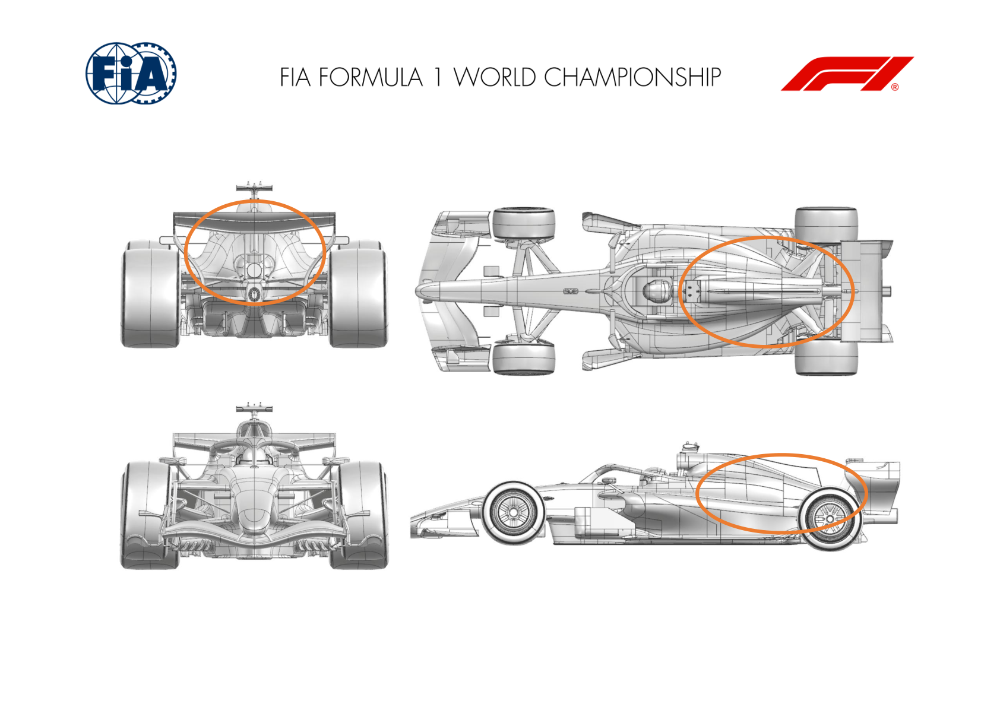
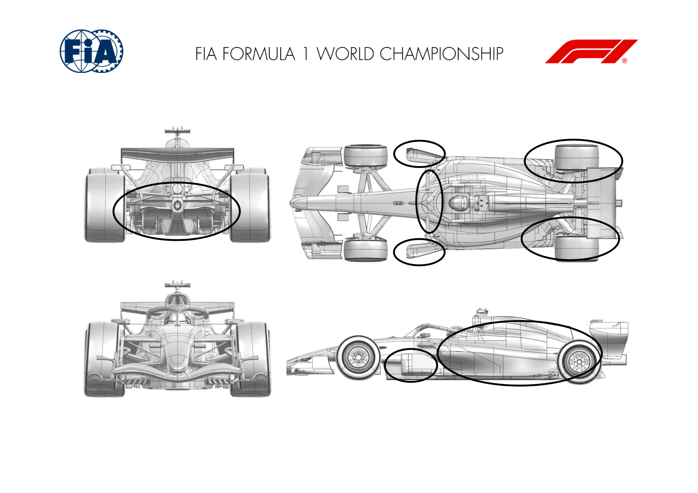
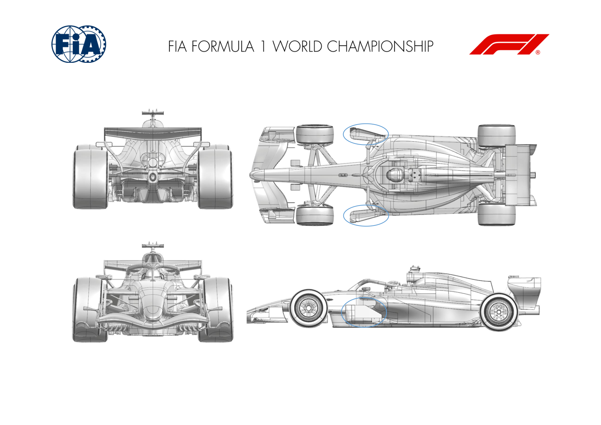
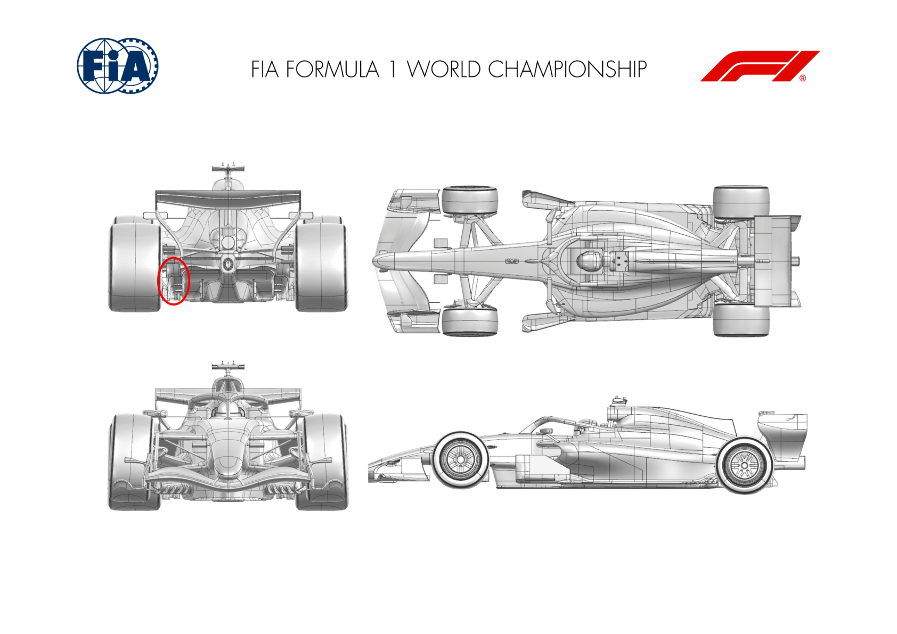
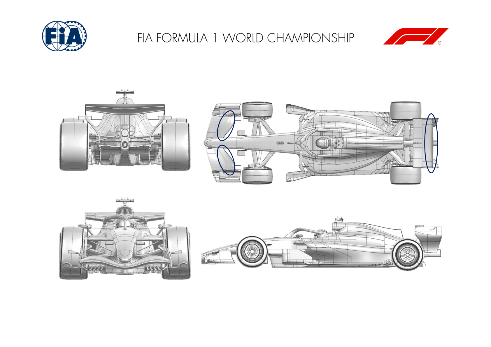
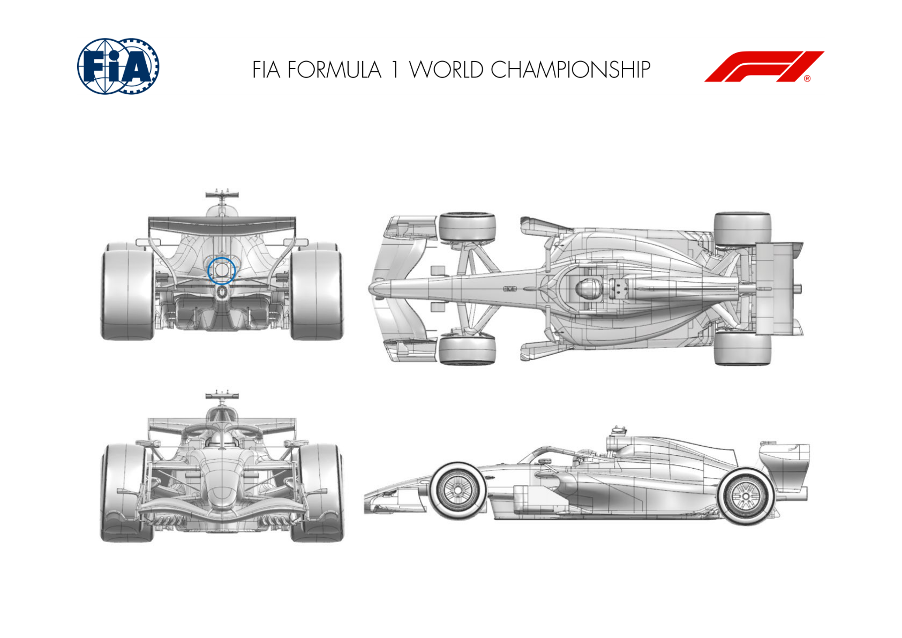
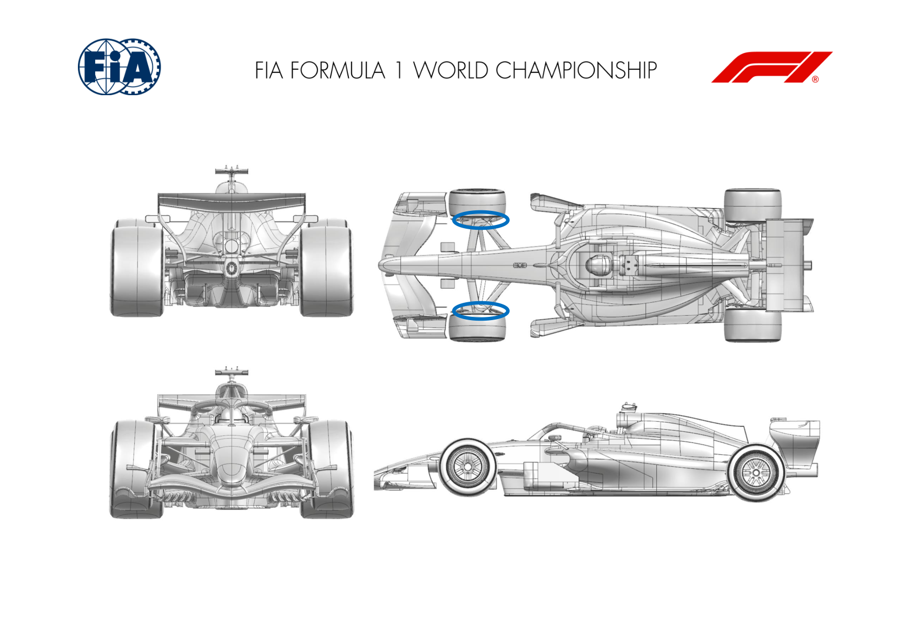

2026 BAHRAIN GRAND PRIX IN MALAYSIA

02 - 04 October 2026

From The FIA Formula 1 Media Delegate Document 12

To All Teams, All Officials Date 02 October 2026

Time 10:03

Title Car Presentation Submissions

Description Car Presentation Submissions

Enclosed 2026 Bahrain Grand Prix in Malaysia - Car Presentation Submissions.pdf

Roman De Lauw

The FIA Formula 1 Media Delegate

Car Presentation – Bahrain Grand Prix

McLaren Mastercard F1 Team

| No. | Updated component | Primary reason for update | Geometric differences | Description |
| --- | --- | --- | --- | --- |
| 1 | Coke/Engine Cover | Circuit specific - Cooling Range | High Cooling Bodywork | To meet the high cooling demands of this and the upcoming circuits, a new engine cover aiming at increased cooling massflow has been designed. |

Car Presentation – 2026 Bahrain Grand Prix in Malaysia

Mercedes-AMG PETRONAS F1 Team

| No. | Updated component | Primary reason for update | Geometric differences | Description |
| --- | --- | --- | --- | --- |
| 1 | Floor Board | Performance – Local Load | Reprofiled horizontal elements, and vertical slotted upper element added. | Reprofiled elements and new vertical elements added to improve local pressure distribution, reduce separations at the extremes of the operating envelope, and improve flow to the rear of the car, resulting in increased load. |
| 2 | Floor Leading Edge | Performance - Flow Conditioning | Reprofiled and additional down-washing elements added. | Additional down-washing elements increase local load and outwash, improving flow to the rear of the car and increasing rear floor load. |
| 3 | Floor Corner | Performance - Flow Conditioning | Additional slots and reprofiled elements. | Re-optimisation of floor corner slot arrangement to both increase local load and to also improve flow into the diffuser and hence rear load. |
| 4 | Floor Body | Performance – Local Load | Reprofiled diffuser roof, sidewall, and winglet. | Through re-optimisation of the diffuser roof and sidewall we have increased local load and improved robustness throughout the operating envelope. |
| 5 | Rear Suspension | Performance – Local Load | Reprofiled suspension fairings. | Track rod and driveshaft camber re-distributed to increase local load whilst improving coupling with diffuser winglet and rear drum furniture. |
| 6 | Rear Corner | Performance – Local Load | Rear winglet span and position change. | Chord and position of the rear drum winglets re optimised to work with above fairing update and to improve rear tyre wake control across the operating envelope. |
| 7 | Rear Bodywork | Performance - Flow Conditioning | Reduce volume, increased sideview ramp. | Reduce volume and increased sideview ramp increases downwash to the rear floor and rear drum, resulting in more load. |

Car Presentation – Bahrain (Sepang) Grand Prix

Oracle Red Bull Racing

| No. | Updated component | Primary reason for update | Geometric differences | Description |
| --- | --- | --- | --- | --- |
| 1 | Floor Board | Performance - Local Load | Revised Floor Board geometry | Applied above the existing floor foot geometry, the new board realises development work to extract more load locally whilst maintaining flow stability behind the front tyres. |

Car Presentation – Bahrain Grand Prix

Scuderia Ferrari HP

| No. | Updated component | Primary reason for update | Geometric differences | Description |
| --- | --- | --- | --- | --- |
| 1 | Diffuser | Performance - Local Load | Diffuser outboard winglet cascade element development | Not Sepang track specific, this very localized development around the diffuser winglet cascade is providing a favourable additional downforce across the entire car operating envelope |

Car Presentation – Bahrain Grand Prix

Williams

No Updates

Car Presentation – Bahrain Grand Prix in Malaysia

Visa Cash App Racing Bulls

| No. | Updated component | Primary reason for update | Geometric differences | Description |
| --- | --- | --- | --- | --- |
| 1 | Front Wing | Circuit specific - Balance Range | New front flap | A longer chord flap for the front wing that was introduced at the previous event increases the load that can be generated by the wing, meeting the aero balance requirements for this circuit. |
| 2 | Rear Wing | Performance - Local Load | Revised rear wing auxiliary components | An improved design of the rear wing support effectively, increasing the efficiency of load generated. |

Car Presentation – Bahrain Grand Prix

Aston Martin Aramco F1 Team

No updates submitted for this event.

Car Presentation – Bahrain Grand Prix

*TGR HAAS F1 TEAM*

| No. | Updated component | Primary reason for update | Geometric differences | Description |
| --- | --- | --- | --- | --- |
| 1 | Rear Impact Structure | Performance – Local Load | Updated Rear Impact Structure geometry | An additional Rear Impact Structure device will be available on track, enabling targeted tuning of the car’s characteristics for this circuit. |

Car Presentation – Bahrain Grand Prix in Malaysia

Audi Revolut F1 Team

No updates submitted for this event.

Car Presentation – Bahrain Grand Prix

BWT Alpine F1 Team

| No. | Updated component | Primary reason for update | Geometric differences | Description |
| --- | --- | --- | --- | --- |
| 1 | Front Corner | Performance – Brake Cooling | Revised front drum exit | The front drum exit has been trimmed to increase brake cooling capacity, improving thermal management for the upcoming high-demand tracks. |

Car Presentation – Bahrain Grand Prix

Cadillac

No updates for this event
