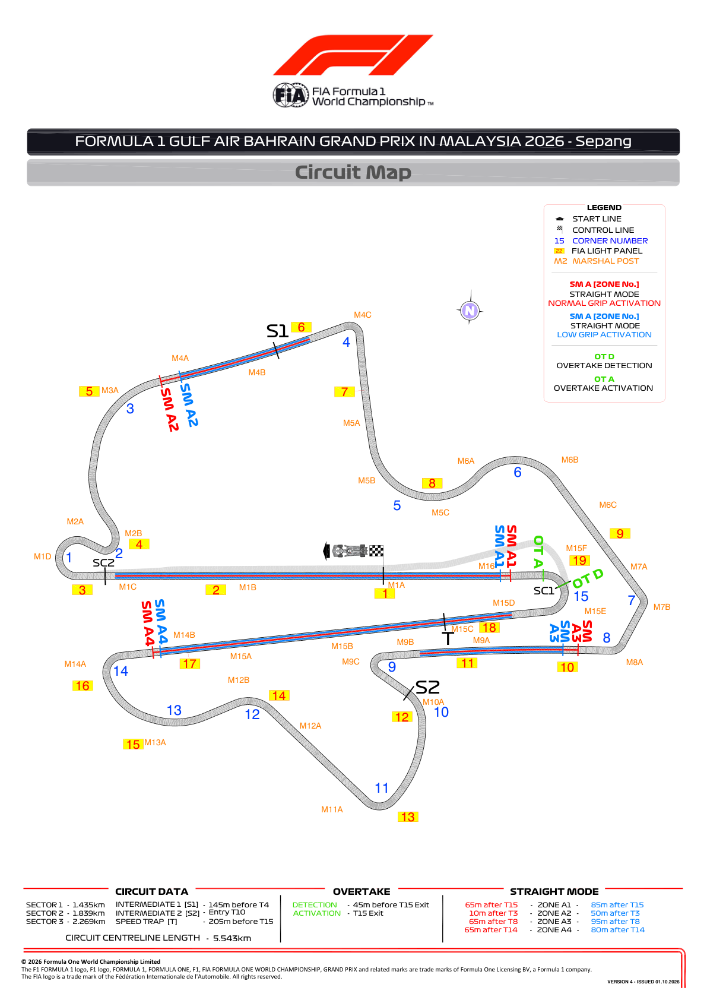
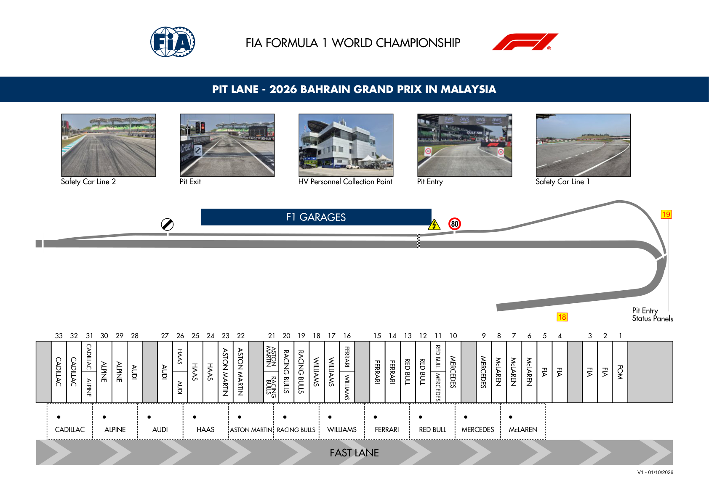
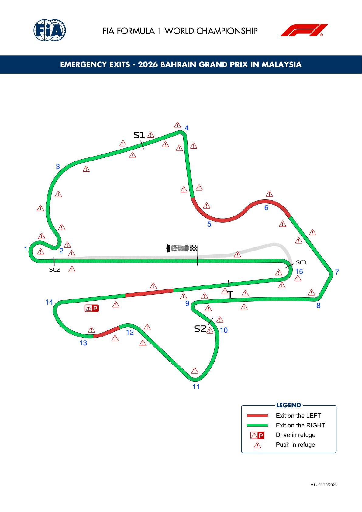
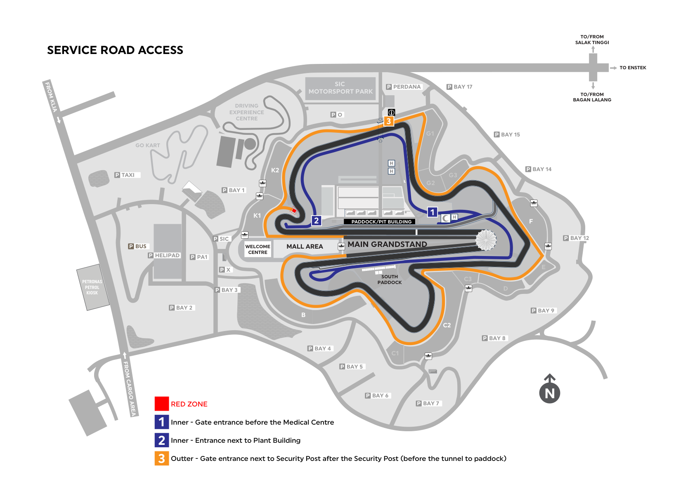

2026 BAHRAIN GRAND PRIX IN MALAYSIA

02 - 04 October 2026

From The FIA Formula 1 Race Director Document 7

To All Teams, All Officials Date 01 October 2026

Time 18:43

Title Circuit Map, Pit Lane Drawing, Emergency Exits Map and Red Zone

Description Circuit Map, Pit Lane Drawing, Emergency Exits Map and Red Zone

Enclosed 16BRN - Maps.pdf

Rui Marques

The FIA Formula 1 Race Director

