2026 BAHRAIN GRAND PRIX IN MALAYSIA

02 - 04 October 2026

From The FIA Formula 1 Race Director Document 28

To All Teams, All Officials Date 03 October 2026

Time 11:14

Title Race Director's Competition Notes V2

Description Race Director's Competition Notes V2

Enclosed 2026 Bahrain Grand Prix Competition Notes V2.pdf

Rui Marques

The FIA Formula 1 Race Director

2026 B AHRAIN G RAND P RIX IN M ALAYSIA

2 – 4 October 2026

From The FIA Formula 1 Race Director

To All Officials, All Teams Date 03 October 2026

COMPETITION NOTES V2 (changes in magenta)

General Instructions

1. Laps during Qualifying Session and Reconnaissance Lap(s), For the safe and orderly conduct of the Competition, other than in exceptional circumstances accepted as such by the Stewards, any driver that exceeds the maximum time from the Second Safety Car Line to the First Safety Car Line on ANY lap during and after the Qualifying Session, including in- laps and out-laps or during reconnaissance laps when the pit exit is opened for the Race, may be deemed to be going unnecessarily slowly. Teams and Drivers will be informed of the maximum time after the second Practice Session. For the avoidance of doubt, this does not supersede Articles B1.8.5 and B4.1.1 of the FIA F1 Regulations, which apply to the entire Circuit, furthermore this includes the pit lane as well. Incidents will normally be investigated after the Qualifying Session or the Race.

2. Lapping during the Race

The International Sporting Code (ISC) requires drivers who are caught by another car to allow the faster driver past at the first available opportunity. The F1 marshalling system will be set to give a pre-warning when the faster car is within 3.0s of the car about to be lapped, this should be used by the team of the slower car to warn their driver he is soon going to be lapped and that allowing the faster car through should be considered a priority. When the faster car is within 1.2s of the car about to be lapped blue light panels will be shown to the slower car (in addition to blue light panels, blue cockpit lights and a message on the timing monitors) and the driver must allow the following driver to overtake at the first available opportunity.

1

Competition Specific Instructions 3. Parc Fermé Team Personnel permitted access to the Parc Fermé area for the sole purpose of fitting cooling fans and undertaking any work required by those officials charged with supervision of parc fermé, may enter Parc Fermé using the route shown below:

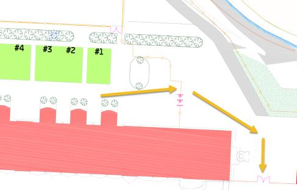

4. Marshalling System 4.1 A car entering the Pit Lane will be subject to the marshalling state (i.e. yellow flag or double yellow flag) of the associated sector until it passes the blue line marked on the image below.

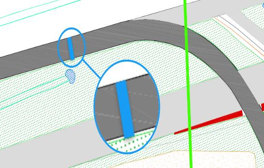

4.2 A car leaving the Pit Lane will be subject to the marshalling system state i.e. yellow flag or double yellow flag of the sector into which it is emerging after it passes the blue line marked on the image below.

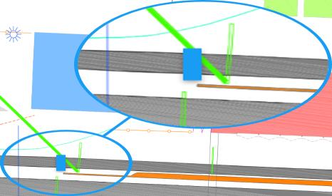

5. Support Races team barrier placement and movements Team barrier placement prior to and during all support category Practice Sessions and Races: No more than (3) three meters from the garage. Please ensure that your pit stop gantry arms are moved back towards the garage during all support category activities. Support Crews and Trolleys will be released into Pit Lane no earlier than 30 minutes prior to the opening of pit exit for their respective sessions. Support Category competition vehicles will be released from the marshalling area no earlier than 15 minutes prior to the opening of pit exit for their respective sessions.

6. Practice starts 6.1 During Free Practice sessions, practice starts may be carried out after the pit exit lights on the right- hand side using one of the painted grid boxes shown in the image below. Cars queuing to perform a practice must keep to the right-hand side to allow sufficient space for cars not wishing to do a practice start to pass.

2

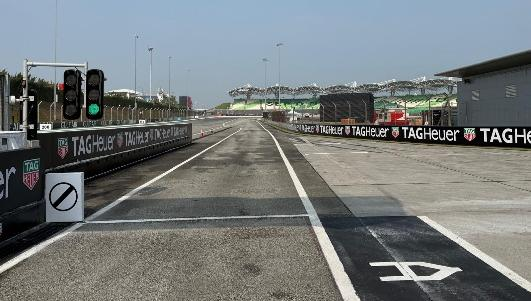

6.2 Practice starts after the Free Practice sessions will be performed according to Article B4.2.2 of the FIA F1 Regulations. 6.3 For the safe and orderly conduct of the competition, pursuant to article B4.2.2, any driver on track when the end of session signal is shown for the Free Practice 2 session, may complete two further laps, for the sole purpose of stopping on the grid to perform practice starts on each of these laps. 6.4 If the Free Practice session is resumed with less than 2 minutes remaining, for the purpose of facilitating practice starts on the grid as provided for in Article B4.2.2 of the FIA F1 Regulations, any car wishing to leave the Pit Lane must proceed down the Pit Lane without undue delay and exit the Pit Lane without leaving a significant gap to the car ahead. 6.5 For the avoidance of doubt, practice starts may not be carried out during the Qualifying session. 6.6 Practice starts during the reconnaissance laps prior to the Race: Practice starts may be carried out in the pit exit road on the right-hand side in the vicinity of the white line as indicated (yellow arrow) in the drawing picture below and must NOT cross the white line separating the Pit Exit Road from the circuit. Cars NOT wishing to perform a practice start should leave the pit lane and MUST cross the white line separating the Pit Exit Road from the track at the earliest opportunity and join the “normal” racing line. All such cars MUST NOT cross back into the Pit Exit Road. (new picture)

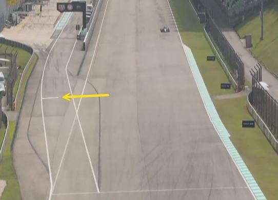

6.7 Under no circumstances can drivers perform a practice start if another F1 Car remains stationary in front of them.

7. Article B1.6.3d of the FIA F1 Regulations (…) Any car(s) driven to the end of the Pit Lane prior to the start or re-start of a LTCS must form up in a line in the Fast Lane and leave in the order they got there (…) It is noted that a car will be considered to be “in the fast lane” when a tyre has crossed the solid white line separating the fast lane from the inner lane, in this context crossing means that all of a tyre should be beyond the far side, with respect to the garages, of the line separating the fast lane from the inner lane.

3

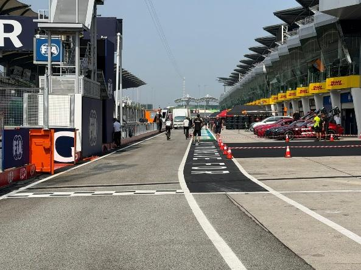

For the avoidance of doubt, Appendix L, Chapter IV, Article 5 b) to the ISC states that: Once a car has left its garage or pit stop position it should blend into the fast lane as soon as it is safe to do so, and without unnecessarily impeding cars which are already in the fast lane. Thus, after the start or re-start of the Free Practice session or the Qualifying Session, if there is a suitable gap in a queue of cars in the fast lane, such that a driver can blend into the fast lane safely and without unnecessarily impeding cars already in the fast lane, they are free to do so. Furthermore, it is noted that during the Free Practice sessions and Qualifying, a car driving in the inner lane, parallel to the fast lane, will not be considered to have blended into the fast lane at the earliest opportunity. Additionally, Appendix L, Chapter IV, Article 5 d) to the ISC states that: Cars in either the fast lane or working lane may not overtake other cars in the fast lane except in exceptional circumstances. In this context a “stopped car” is one which has an obvious mechanical problem.

8. Lines at the Pit Entry and Pit Exit 8.1 In accordance with Appendix L, Chapter IV, Articles 4 and 6 to the ISC drivers must follow the procedures at pit entry and pit exit. 8.2 Pertaining to Appendix L, Chapter IV, Article 4 to the ISC, any driver passing to the right -hand side of the bollard (as indicated in the image below) will be considered as entering the pit lane (new location of the bollard).

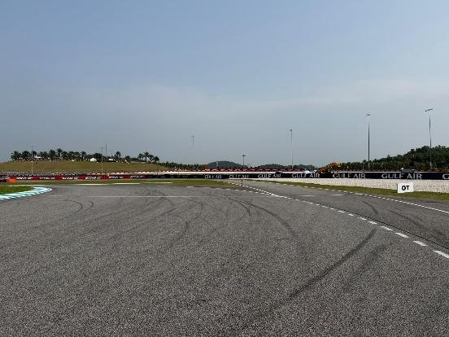

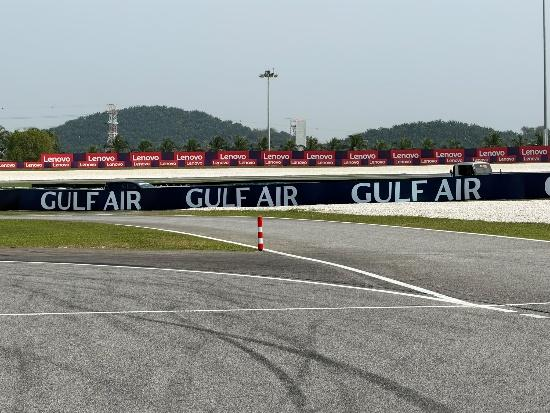

8.3 For the safe and orderly conduct of the event, during any live session and while the pit exit is open prior to the start of the race, team personnel are not allowed to cross the red line in the picture below.

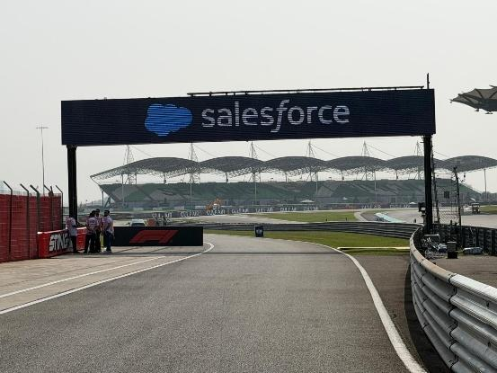

4

9. Stopping the Qualifying Session Pursuant to Article B4.3.1b of the FIA F1 Regulations, should any period of the Qualifying Session be interrupted with less than 90 seconds remaining, the relevant period of the Qualifying Session will not be resumed.

10. ERS Hazard Status If the ERS is in a Hazard Status, the relevant team will be required to send mechanics to the pit entry area near race control. This will be done after the session. They will then be picked up by car and taken to their F1 car.

11. Leaving the garage before and during all Sessions 11.1 Before the start of the Free Practice sessions or Qualifying, or prior to the pit exit opening for the reconnaissance laps, no cars may enter the pit lane to proceed to pit exit until 5 minutes before the scheduled start time or announced start time in the case of a delayed session. 11.2 If the Free Practice sessions or Qualifying, or any period thereof is delayed or stopped, cars may only enter the Fast Lane after the re-start time is confirmed via the official messaging system.

12. Removing cars from the grid Cars may be removed from the grid through the gate adjacent to the start line.

13. Race Suspension or Starting Procedure Suspension 13.1 In case of Race suspension or Starting Procedure suspension, (except in case of Article B5.14.3 of the FIA F1 Regulations – stopping on the grid), cars will be stopped in the fast lane. The first car must stop in the vicinity of the last team garage. 13.2 Safety Car Resumption Point: Safety Car will leave the pit lane before the resumption and wait for the F1 cars before Turn 12. (as per the image below).

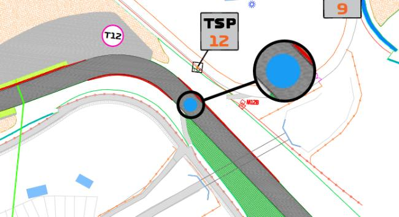

14. Grid Panel Placement On the left-hand side of the grid.

15. Grid Procedure Article B5.2.4 of the FIA F1 Regulations states that “Any F1 Car which does not complete a reconnaissance lap and reach the grid under its own power will not be permitted to start the TTCS from the grid.”. In the context of this article the grid shall be considered to be the section of track starting from the front of marked grid box #1 and finishing in red line (SM signs) in the picture below.

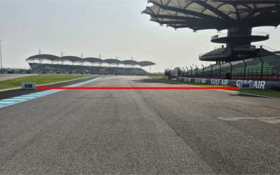

5

16. Light panels: In case of an incident, double yellow light panel will be mirrored on the following panels:

• Panel 8 will be mirrored on panel 7.

17. Track Limits 17.1 During any LTCS, each time a driver fails to negotiate Turn 15, will result in that lap time and the immediately following lap time may be invalidated by the Stewards. 17.2 The dotted white line intersecting the pit exit road marks the track edge.

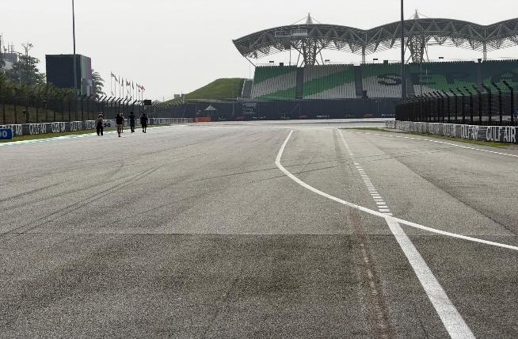

18. Detection Line The detection line referred to in Article B7.2.1, is at the same location of the Safety Car Line 1, therefore, will not be painted in yellow. OT boards are installed on both sides of the track.

19. Safety Car Procedures For the safe and orderly conduct of the Competition, and specifically to ensure that all Competitors receive consistent information regarding any Safety Car deployment, pursuant to Articles B5.13.1 [Deployment of Safety Car] and B5.13.6 [Withdrawal of Safety Car] of the FIA F1 Regulations, “waved yellow flags and “SC” boards” will NOT be used at this Competition. For the avoidance of doubt, when the order is given to deploy the Safety Car the message “SAFETY CAR DEPLOYED” will be sent to all Competitors and all Trackside Light Panels will display “SC”. Furthermore, to ensure that all Competitors receive consistent information regarding the withdrawal of the Safety Car, when the instruction to extinguish the orange lights on the Safety Car is given, the message “SAFETY CAR LIGHTS OFF” will be sent to all Competitors. For the avoidance of doubt, as the leader approaches the Control Line a green light panel will be displayed at the Control Line and all other Trackside Lights Panel will clear i.e. will cease to display “SC”. Pursuant to Article B5.13.8, if the Safety Car is still deployed at the beginning of the last lap, or is deployed during the last lap, unless the Race Director deems the continued presence of the Safety Car after the end-of-session signal is required, it will enter the Pit Lane at the end of the lap and the F1 Cars must proceed to take the end-of-session signal without overtaking before the Control Line. In such circumstance, the Trackside Light Panels will continue to display “SC” but, as the Safety Car is approaching the Pit Entry Road, the orange lights on the Safety Car will be extinguished and the message “SAFETY CAR LIGHTS OFF” will be sent to all Competitors. This will be the signal to all Competitors and drivers that the Safety Car will be entering the Pit Lane at the end of that lap.

Rui Marques

The FIA Formula 1 Race Director

6
