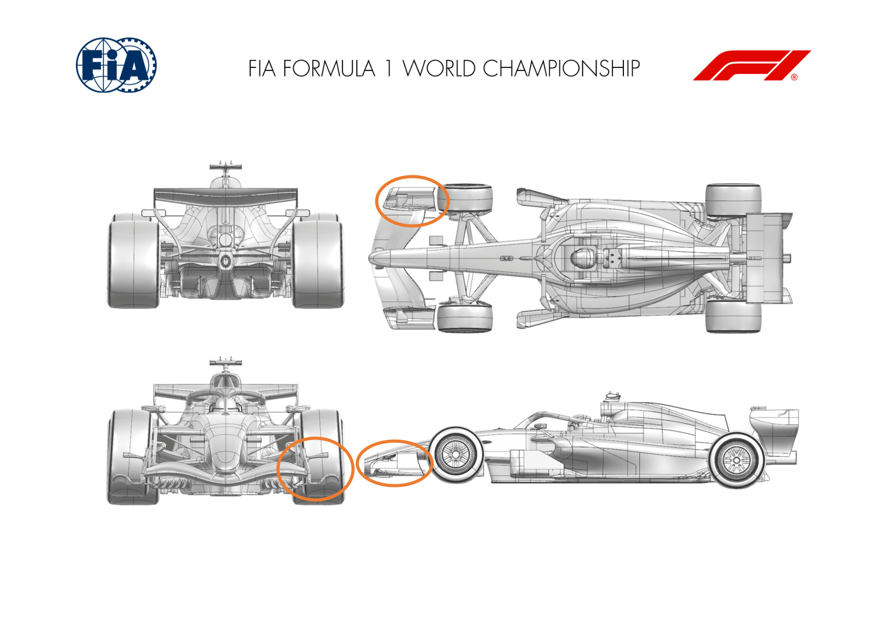
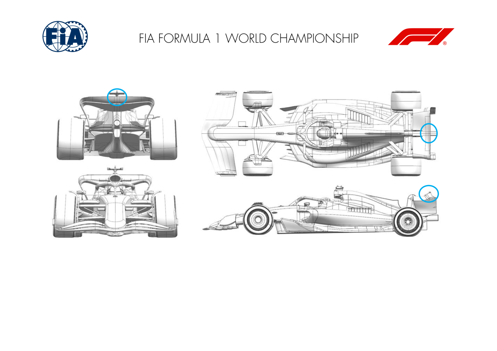
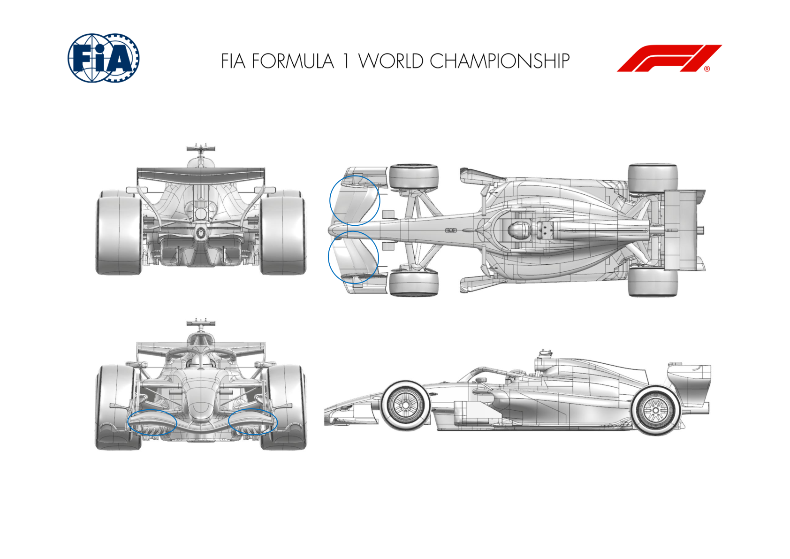
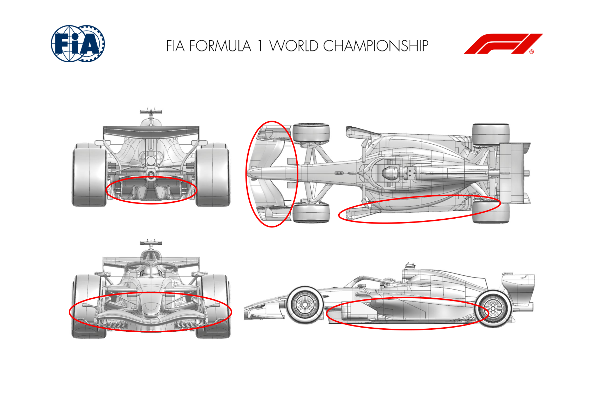
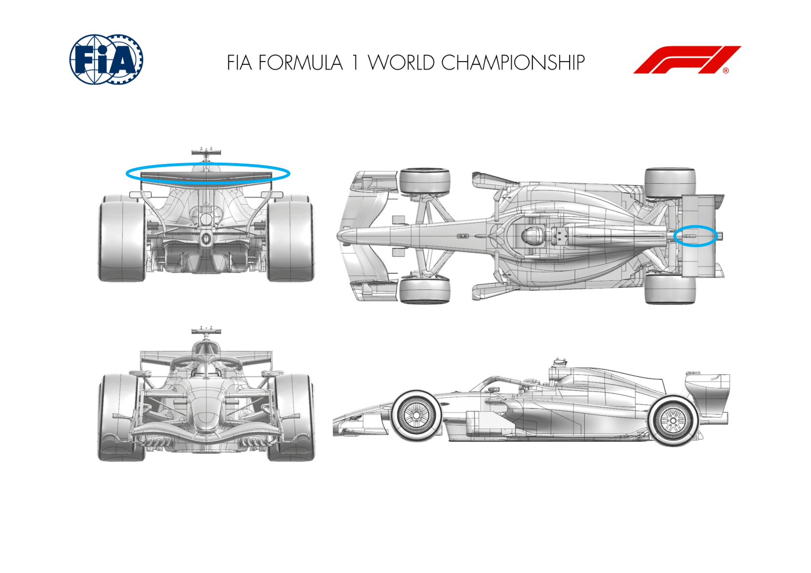
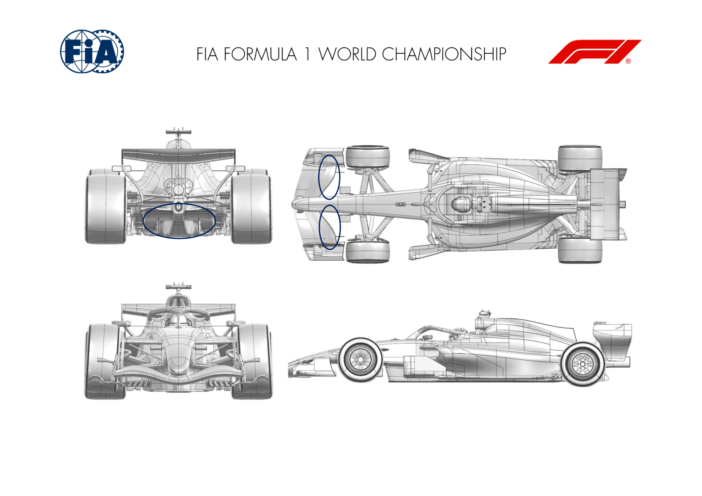
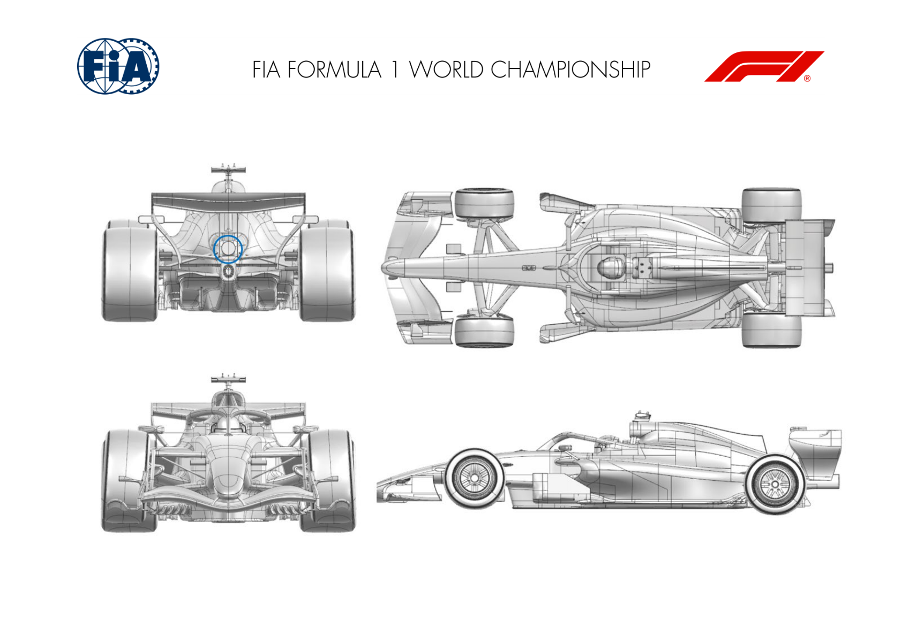
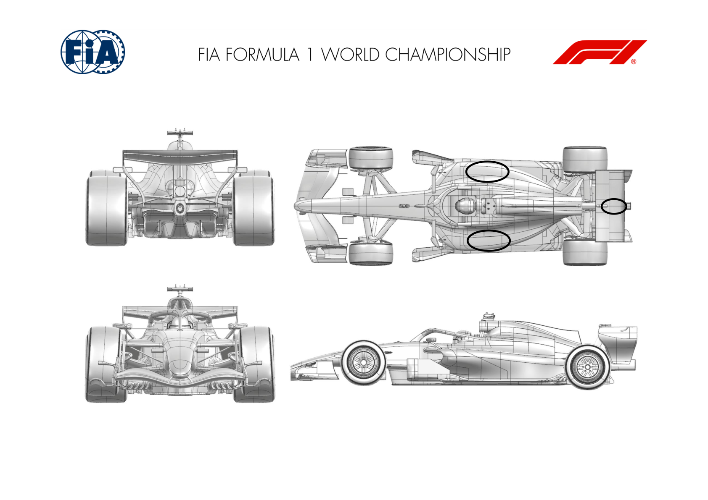

2026 BARCELONA-CATALUNYA GRAND PRIX

12 - 14 June 2026

From The FIA Formula 1 Media Delegate Document 14

To All Teams, All Officials Date 12 June 2026

Time 10:57

Title Car Presentation Submissions

Description Car Presentation Submissions

Enclosed 2026 Barcelona-Catalunya Grand Prix - Car Presentation Submissions.pdf

Roman De Lauw

The FIA Formula 1 Media Delegate

Car Presentation – Spanish Grand Prix

McLaren Mastercard F1 Team

| No. | Updated component | Primary reason for update | Geometric differences | Description |
| --- | --- | --- | --- | --- |
| 1 | Front Wing | Performance - Flow Conditioning | Revised Front Wing Endplate | The front wing endplate has been modified, resulting in an improvement of aerodynamic flow conditioning and subsequently enhanced aerodynamic overall performance. |

Car Presentation – 2026 Barcelona-Catalunya Grand Prix

*Mercedes-AMG PETRONAS F1 Team*

| No. | Updated component | Primary reason for update | Geometric differences | Description |
| --- | --- | --- | --- | --- |
| 1 | Rear Wing | Performance - Local Load | Small winglets added on centreline to rear wing. | These winglets increase the camber of the upper rear wing on centreline, generating downforce and drag at a ratio attractive for this event. |

Car Presentation – Barcelona Grand Prix

Oracle Red Bull Racing.

| No. | Updated component | Primary reason for update | Geometric differences | Description |
| --- | --- | --- | --- | --- |
| 1 | Front Wing | Local load and flow conditioning. | The wing element geometries have been revised where these meet the endplate | Achieved by modifying existing parts, a new geometry of the elements near the end plate becomes available. Aim being to improve the local load whilst maintaining flow stability. |
| 2 | Front wing | Balance range | Camber increase of the front wing flaps. | Should the front wing load demand exceed expectations, a more cambered flap assembly has been produced to offer more local load. |
| 3 |  |  |  |  |
| 4 |  |  |  |  |

Car Presentation – Barcelona-Catalunya Grand Prix

SCUDERIA FERRARI HP

| No. | Updated component | Primary reason for update | Geometric differences | Description |
| --- | --- | --- | --- | --- |
| 1 | Front Wing | Performance - Local Load | Revised front wing footplate with new vanes arrangement and endplate diveplane addition, optimized wing elements spanwise loading distribution. New SM mechanism links and integration in the nose, revised nose shape with raised lower surface Evolution of the front wing platform raced so far, with enhanced tip flow features coming with front wheel wake control benefits as well as increased aero balance capacity. More integrated SM mechanism links returns tidier centre line flow features. It also comes with flap lips modulation. |  |
| 2 | Front Wing Endplate |  |  |  |
| 3 | Nose |  |  |  |
| 4 | Floor Body | Performance - Local Load | Reduced keel volume. Redesigned front floor leading edge profiles and claws, front floor board elements optimisation (horizontal and vertical ones). Optimisation of rearward floor corner winglets, reprofiling of diffuser sidewall cutout. Updated diffuser winglet angle of attack and diffuser / tail expansion profile Benefiting from an improved onset flow quality, this entire floor update is targeting overall aerodynamic load increase across the main car operating window as well as flow features robustness improvements together with improved flow topology and energy towards the rear corners |  |
| 5 | Floor Board |  |  |  |
| 6 | Floor Edge |  |  |  |
| 7 | Diffuser |  |  |  |
| 8 | Sidepod/Coke | Performance - Flow Conditioning | Inflated sidepod shoulder and adapted cokeline | This geometry has been developed in conjunction with the floor update and manipulates front wheel wake together with the floor board update, as well as the rebalancing the front floor pressurisation |

Car Presentation – Barcelona-Catalunya Grand Prix

*Williams*

| No. | Updated component | Primary reason for update | Geometric differences | Description |
| --- | --- | --- | --- | --- |
| 1 | Rear Wing | Performance – Local Load | SM Fairing Winglets and Third Element local extensions Different SM fairing geometry with added winglets offering local load for high downforce tracks. Local trailing edge extensions added on the rear wing third element for efficient load increase. |  |

Car Presentation – Monaco Grand Prix

Visa Cash App Racing Bulls

| No. | Updated component | Primary reason for update | Geometric differences | Description |
| --- | --- | --- | --- | --- |
| 1 | Front Wing | Circuit specific - Balance Range | Extra flap gurney options available | Additional front wing load is generated by adding Gurney flaps to the trailing edge. This provides extended balance range for the car for setup optimisation during the weekend. |
| 2 | Diffuser / Rear Crash Structure | Performance – Flow Conditioning | Updated diffuser profile & integration with rear crash structure | Provides improved aerodynamic flow conditioning at the back of the car, to aid with efficient load generation from the floor. |

Car Presentation – Barcelona-Catalunya Grand Prix

Aston Martin Aramco F1 Team

No updates submitted for this event.

Car Presentation – Barcelona Grand Prix

TGR HAAS F1 Team

| No. | Updated component | Primary reason for update | Geometric differences | Description |
| --- | --- | --- | --- | --- |
| 1 | Rear Impact Structure | Performance – Local Load | Simplified Rear Impact Structure geometry | An alternative Rear Impact Structure device will be available on track, enabling targeted tuning of the car’s characteristics for this circuit. |

Car Presentation – Barcelona-Catalunya Grand Prix

Audi Revolut F1 Team

No updates submitted for this event.

Car Presentation – Barcelona-Catalunya Grand Prix

BWT Alpine F1 Team

No updates submitted for this event.

Car Presentation – Barcelona Grand Prix

Cadillac

| No. | Updated component | Primary reason for update | Geometric differences | Description |
| --- | --- | --- | --- | --- |
| 1 | Cooling Louvres | Performance – Cooling Range | Addition of cooling louvres to upper surface of rear Sidepod | The addition of louvres to the upper surface of the rear sidepod has been implemented to increase the power unit cooling range |
| 2 | Rear Wing | Performance – Drag Reduction | Addition of SLM actuator fairing | Reintroduction of an SLM mechanism fairing to the previous event, to re-instate the availability of low drag mode on this wing |

