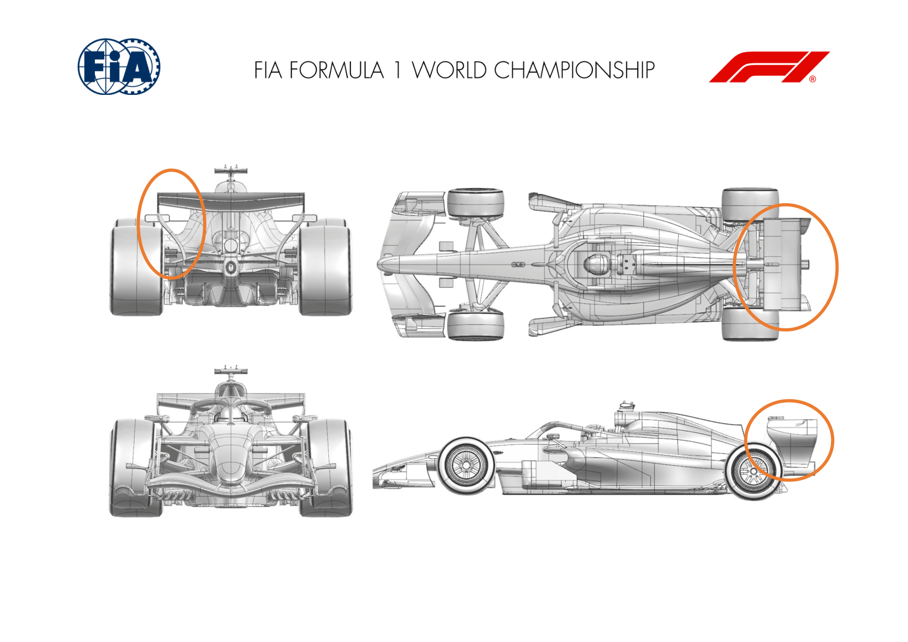
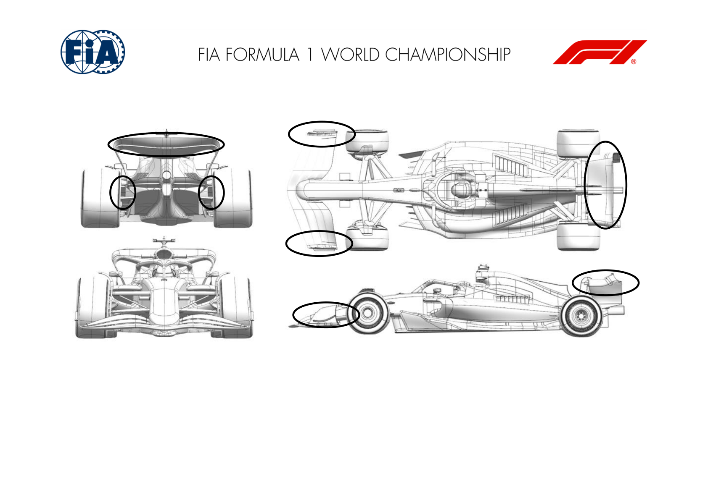
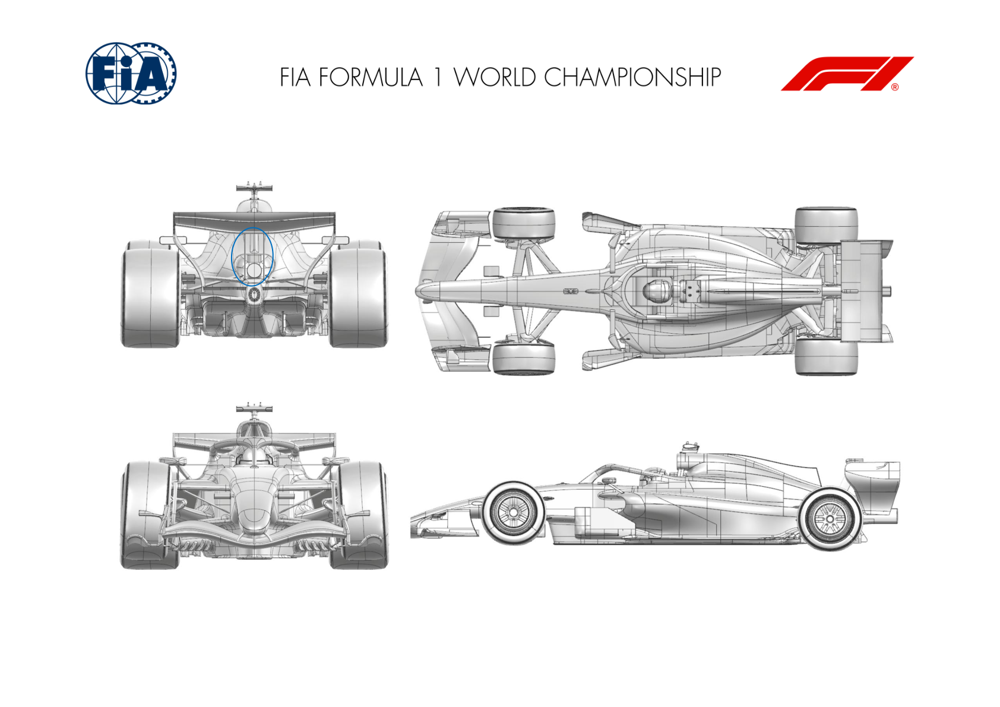
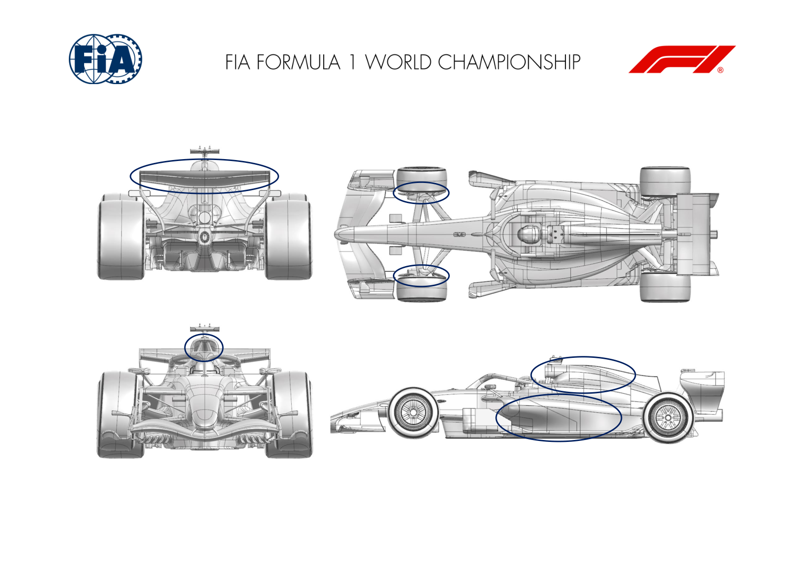
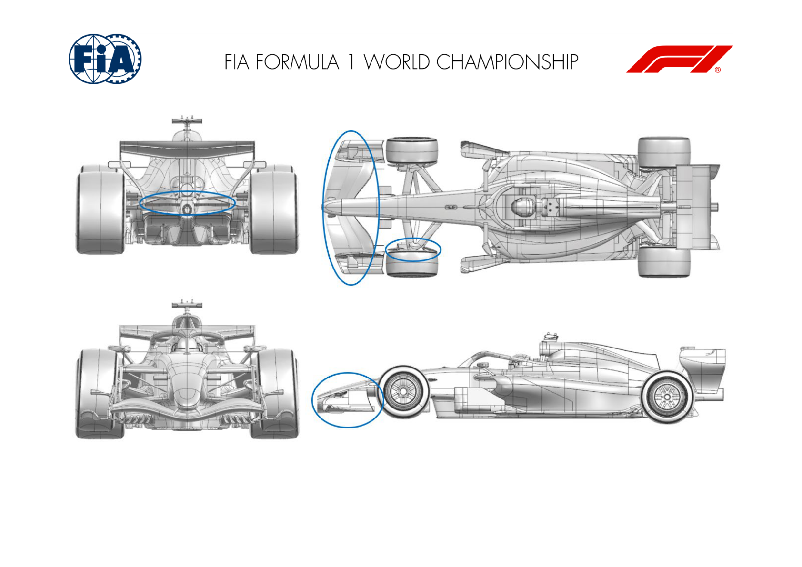
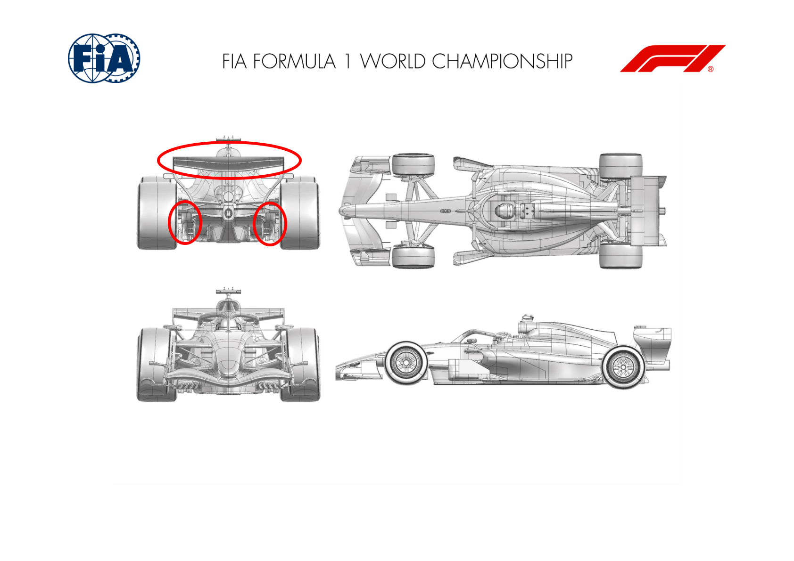
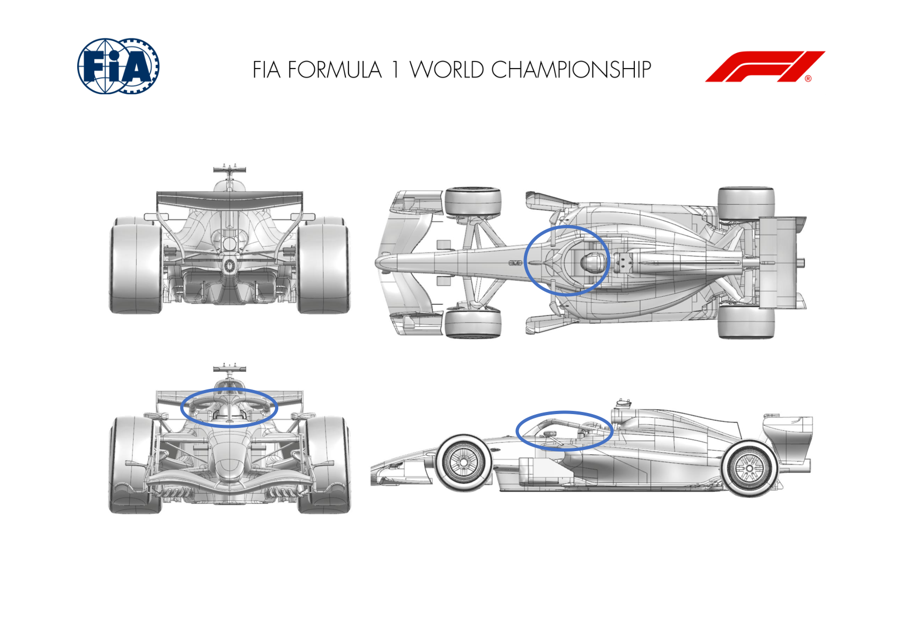
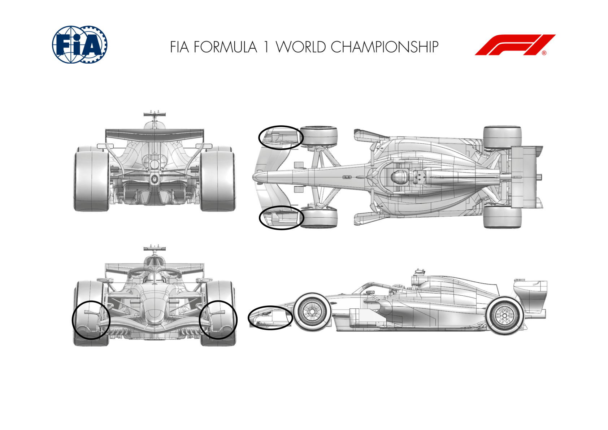

2026 BELGIAN GRAND PRIX

17 - 19 July 2026

From The FIA Formula 1 Media Delegate Document 12

To All Teams, All Officials Date 17 July 2026

Time 12:08

Title Car Presentation Submissions

Description Car Presentation Submissions

Enclosed 2026 Belgian Grand Prix - Car Presentation Submissions.pdf

Roman De Lauw

The FIA Formula 1 Media Delegate

Car Presentation – Belgian Grand Prix

McLaren Mastercard F1 Team

| No. | Updated component | Primary reason for update | Geometric differences | Description |
| --- | --- | --- | --- | --- |
| 1 | Rear Wing | Performance - Flow Conditioning | Endplate modification | A small revision to the rear wing endplate resulting in improved flow conditioning and aerodynamic characteristics across the full operating range. |
| 2 | Rear Wing | Circuit Specific – Drag Reduction | New Rear Wing assembly | A new rear wing assembly specifically designed for the increased isochronal of this circuit, resulting in an efficient reduction of drag in straight line and cornering mode. |

Car Presentation – 2026 Belgian Grand Prix

*Mercedes-AMG PETRONAS F1 Team*

| No. | Updated component | Primary reason for update | Geometric differences | Description |
| --- | --- | --- | --- | --- |
| 1 | Rear Wing | Circuit specific - Drag Range | Reduce camber upper wing elements The upper wing element camber has been reduced to drop local downforce and drag at a level appropriate for Spa L/D. |  |
| 2 | Rear Corner | Performance - Local Load | Rear drum winglets position and span | Rear drum winglets position and span optimised around evolving onset flow and local load requirements – improved robustness through operating envelope. |
| 3 | Front Wing Endplate | Performance - Flow Conditioning | Endplate top edge camber increased | Endplate top edge camber increased to improve front wing performance throughout the operating envelope, improving onset flow to the rear of the car. |

Car Presentation – Belgian Grand Prix

Oracle Red Bull Racing.

| No. | Updated component | Primary reason for update | Geometric differences | Description |
| --- | --- | --- | --- | --- |
| 1 | Rear Wing | Performance - Local Load | Revised pylon profiles | Given the pylons now by regulation contact the mainplane underside, the interface is sensitive and revised with pylon changes to existing element profiles seeking to extract more load and at least maintain flow stability. |

Car Presentation – Belgian Grand Prix

SCUDERIA FERRARI HP

No updates submitted for this event.

Car Presentation – Belgian Grand Prix

Williams

| No. | Updated component | Primary reason for update | Geometric differences | Description |
| --- | --- | --- | --- | --- |
| 1 | Rear Corner | Circuit specific - Drag Range | A revised rear brake duct winglet array | To suit the demands of the Spa-Francorchamps circuit, we have reduced the loading on the rear corner which offers a local efficiency improvement. |
| 2 | Floor Body | Circuit specific - Drag Range | A local trim has been applied to the main Floor Body | A further circuit specific change, altering the balance between downforce and drag at the rear of the main floor. |
| 3 | Floor Body | Performance - Flow Conditioning | An updated main floor profile which adds volume to the central part of the diffuser. | To change the distribution of diffuser expansion volume across the car operating envelope, a new floor body surface has been introduced. |

Car Presentation – Belgian Grand Prix

Visa Cash App Racing Bulls

| No. | Updated component | Primary reason for update | Geometric differences | Description |
| --- | --- | --- | --- | --- |
| 1 | Coke/Engine Cover | Performance – Flow Conditioning | Updated sidepod & upper bodywork | The profile of the sidepods has been modified to provide better control of the airflow passing around the side of the car. |
| 2 | Roll Hoop | Performance – Flow Conditioning | Revised roll hoop inlet shape | A narrower roll hoop has been introduced, which improves the flow quality reaching the back of the car and on to the rear wing. |
| 3 | Front Corner | Performance – Flow Conditioning | Updated brake drum assembly | Detail changes on the front brake drum management at the front of the car. |
| 4 | Rear Wing | Performance – Local Load | New upper rear wing assembly | A number of changes to the mainplane and flap profiles allow the rear wing to generate downforce more efficiently, bringing performance improvement at Spa and other circuits. |

Car Presentation – Belgian Grand Prix

Aston Martin Aramco F1 Team

No updates submitted for this event.

Car Presentation – Belgian Grand Prix

*TGR HAAS F1 TEAM*

| No. | Updated component | Primary reason for update | Geometric differences | Description |
| --- | --- | --- | --- | --- |
| 1 | Front Wing | Performance - Local Load | Revised Profiles and Pylon geometry | A revised Front Wing geometry has been introduced to increase local aerodynamic load while maintaining aerodynamic efficiency, improving airflow management and overall front end performance across a range of operating conditions. |
| 2 | Front Wing Endplate | Performance - Flow Conditioning | Revised Endplate geometry | A revised Front Wing endplate geometry has been profiles, optimising local airflow control and maintaining aerodynamic efficiency across the front wing assembly. |
| 3 | Front Corner | Performance - Local Load | Marginal geometry changes to deflector | A circuit-specific Front Corner configuration has been made available, providing additional flexibility to better match the aerodynamic load requirements of this circuit. |
| 4 | Beam Wing | Performance - Drag reduction | Revised lower Rear Wing geometry | A new Lower Rear Wing configuration has been introduced as a circuit-specific option, providing additional flexibility to align the car’s aerodynamic characteristics with the demands of this venue and optimise overall performance. |

Car Presentation – Belgian Grand Prix

Audi Revolut F1 Team

| No. | Updated component | Primary reason for update | Geometric differences | Description |
| --- | --- | --- | --- | --- |
| 1 | Rear Wing | Circuit specific – Drag Range | Rear wing upper cluster | A circuit-specific rear wing assembly has been introduced to align the aerodynamic configuration with the requirements of the upcoming event. |
| 2 | Diffuser | Performance – Local load | Diffuser sidewall winglet | A minor refinement has been made to the diffuser as part of the ongoing aerodynamic development programme. The update is intended to enhance the aerodynamic behaviour of the surrounding flow field. |

Car Presentation – Belgian Grand Prix

BWT Alpine F1 Team

| No. | Updated component | Primary reason for update | Geometric differences | Description |
| --- | --- | --- | --- | --- |
| 1 | Halo | Performance – Flow Conditioning | Reprofiled halo fairing with an additional winglet | The halo has been redesigned to improve downstream flow management and provide aerodynamic load towards the rear end of the car. |

Car Presentation – Belgian Grand Prix

Cadillac

| No. | Updated component | Primary reason for update | Geometric differences | Description |
| --- | --- | --- | --- | --- |
| 1 | Front Wing Endplate | Performance – Flow Conditioning | Revised Front Wing Endplate footplate surfaces and turning vanes, and addition of horizontal vane to Endplate body | Updated Front Wing Endplate geometry improves flow quality to the forward floor, increasing the aerodynamic load generated in this area throughout the operating ride height range |

