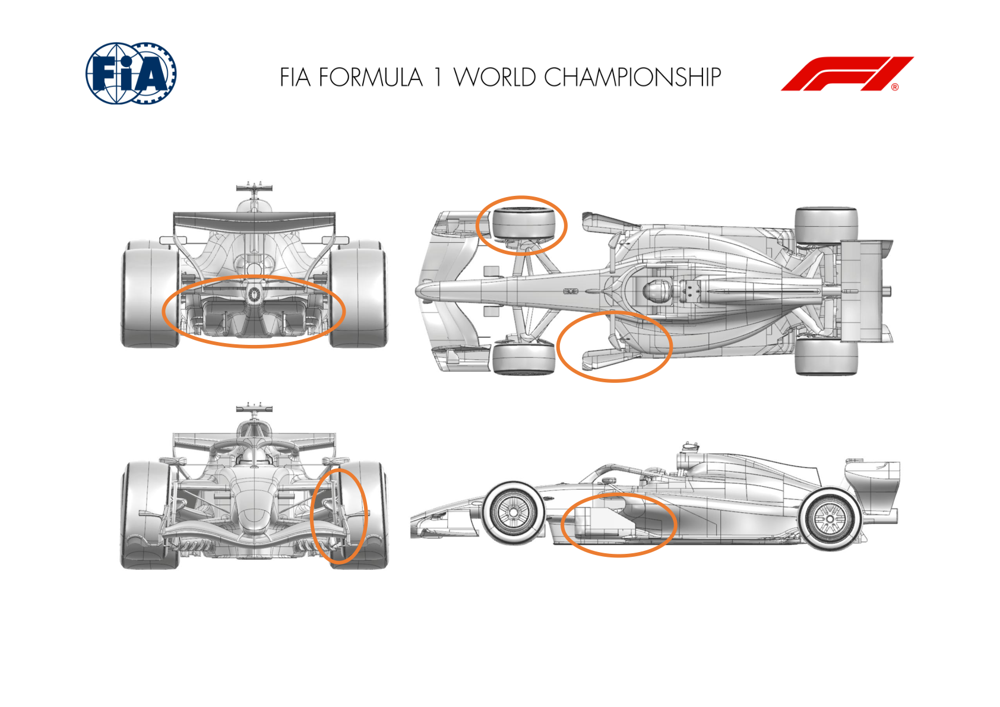
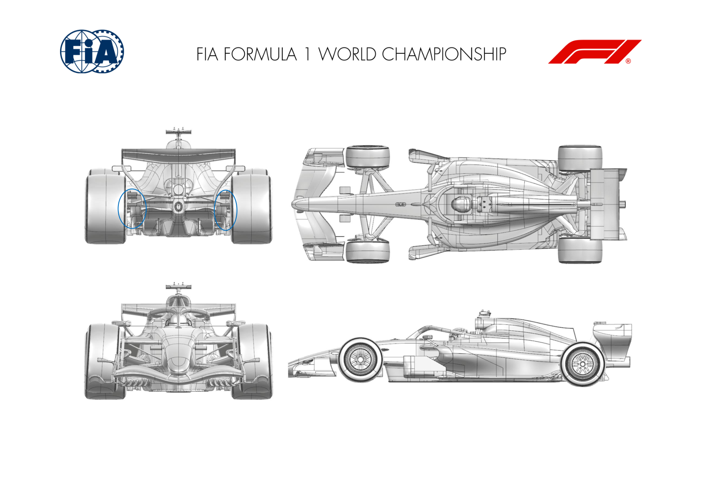
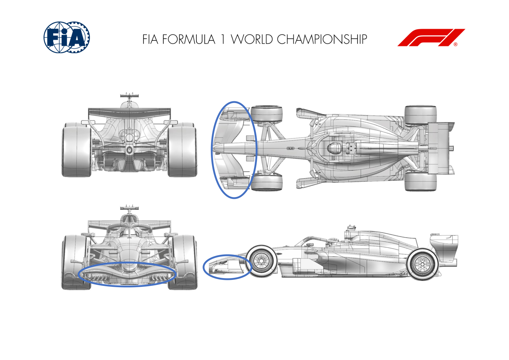
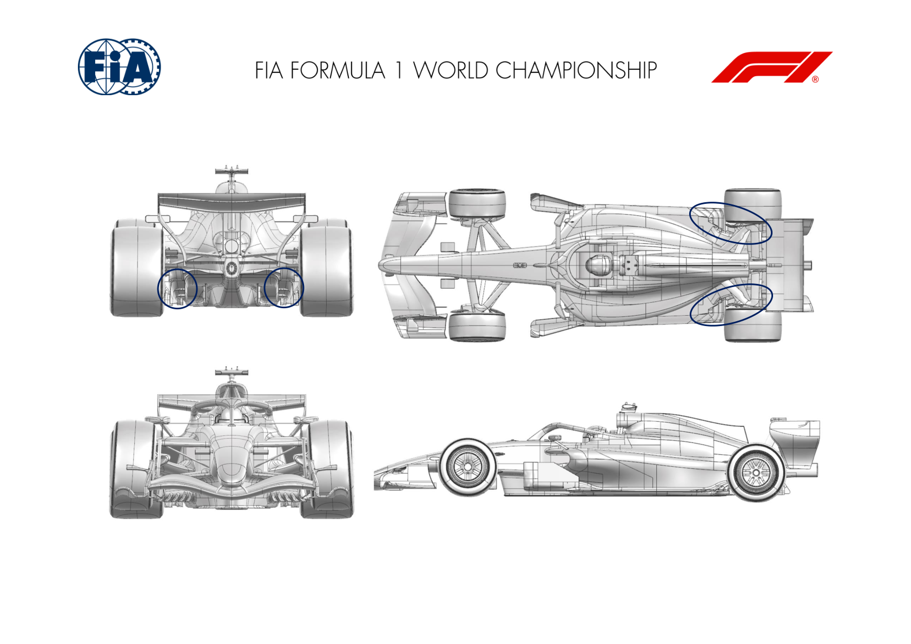
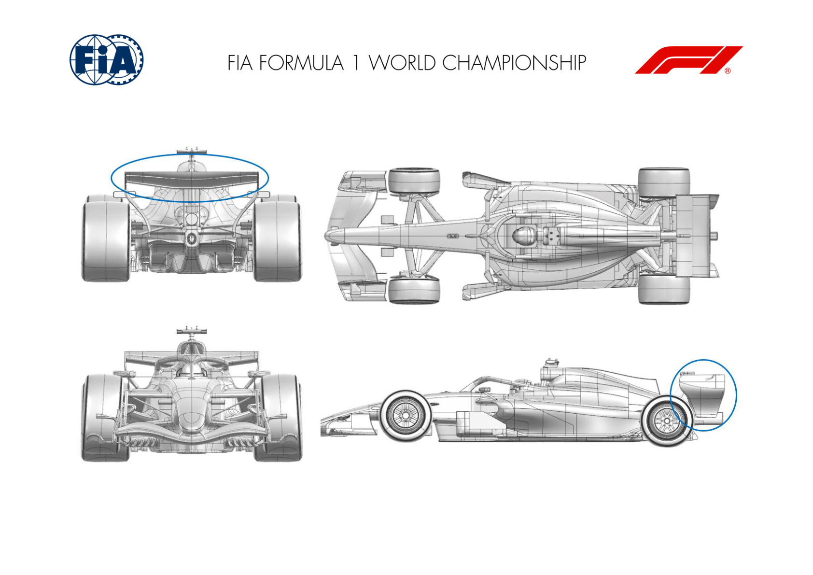

2026 BRITISH GRAND PRIX

03 - 05 July 2026

From The FIA Formula 1 Media Delegate Document 13

To All Teams, All Officials Date 03 July 2026

Time 09:54

Title Car Presentation Submissions

Description Car Presentation Submissions

Enclosed 2026 British Grand Prix - Car Presentation Submissions.pdf

Cameron Kelleher

The FIA Formula 1 Media Delegate

Car Presentation – British Grand Prix

McLaren Mastercard F1 Team

| No. | Updated component | Primary reason for update | Geometric differences | Description |
| --- | --- | --- | --- | --- |
| 1 | Front Corner | Performance - Flow Conditioning | New Front Brake Duct | A new front brake duct design is introduced at this event, resulting in improved flow conditioning and gain in aerodynamic load. |
| 2 | Floor Furniture | Performance - Flow Conditioning | Revised Floor Board and Furniture | The floor board and various elements of the floor furniture have been revised, resulting in an improvement of flow physics and gain in overall efficiency. |

Car Presentation – 2026 British Grand Prix

Mercedes-AMG PETRONAS F1 Team

No updates submitted for this event.

Car Presentation – British Grand Prix

Oracle Red Bull Racing.

| No. | Updated component | Primary reason for update | Geometric differences | Description |
| --- | --- | --- | --- | --- |
| 1 | Rear Corner | Performance - Local Load | Rear wheel bodywork winglets | Inboard of the rear rims and as part of the rear wheel bodywork assembly, the cascade wings have been revised by changing the number of elements to improve the load characteristics and stability. |

Car Presentation – British Grand Prix

SCUDERIA FERRARI HP

| No. | Updated component | Primary reason for update | Geometric differences | Description |
| --- | --- | --- | --- | --- |
| 1 | Rear Corner | Performance - Local Load and Cooling | Increased cooling inlet and outlet sections, updated lower deflector, re-optimized rearward winglet cluster | This update has 2 main objectives: corner cooling via increased inlet/outlet sections, and local loading via lower deflector redesign and winglet loading optimisation, maximizing aerodynamic efficiency |

Car Presentation – British Grand Prix

Williams

| No. | Updated component | Primary reason for update | Geometric differences | Description |
| --- | --- | --- | --- | --- |
| 1 | Front Wing | Performance – Flow Conditioning | A new front wing geometry with updated profiles and endplate surfaces. | An updated front wing assembly has been developed, which aims to generate an increase in local loading combined with an improved flow field |

Car Presentation – British Grand Prix

Visa Cash App Racing Bulls

| No. | Updated component | Primary reason for update | Geometric differences | Description |
| --- | --- | --- | --- | --- |
| 1 | Floor Edge & Diffuser | Performance – Local Load | Updated floor corner & diffuser geometry | The combined updates optimise the flow around the rear floor, allowing it to generate more load and provide increased performance. |
| 2 | Rear Corner | Performance – Flow Conditioning | New forward deflector geometry | In combination with the above, the new deflector targets an improvement in local flow conditioning and improved floor performance. |

Car Presentation – British Grand Prix

Aston Martin Aramco F1 Team

No updates submitted for this event.

Car Presentation – British Grand Prix

*TGR HAAS F1 TEAM*

| No. | Updated component | Primary reason for update | Geometric differences | Description |
| --- | --- | --- | --- | --- |
| 1 | Rear Wing | Performance - Local Load | New Rear Wing profiles | The rear wing profiles were comprehensively revised, with particular emphasis placed on the optimisation of flap geometry, leading to an increase in aerodynamic load while preserving a high level of overall efficiency across the operating range. |
| 2 | Rear Wing Endplate | Performance - Flow Conditioning | Rear Wing Endplate with external protrusions | The Rear Wing Endplates were refined through the introduction of localized protrusions aimed at promoting upwash, contributing to the increase of load of this assembly. |

Car Presentation – British Grand Prix

Audi Revolut F1 Team

No updates submitted for this event.

Car Presentation – British Grand Prix

BWT Alpine F1 Team

No updates submitted for this event.

Car Presentation – British Grand Prix

Cadillac

No Updates
