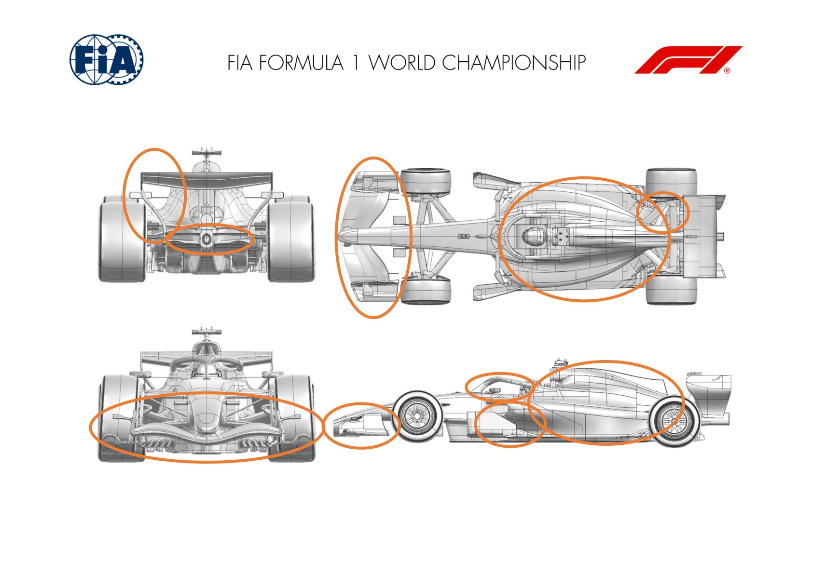
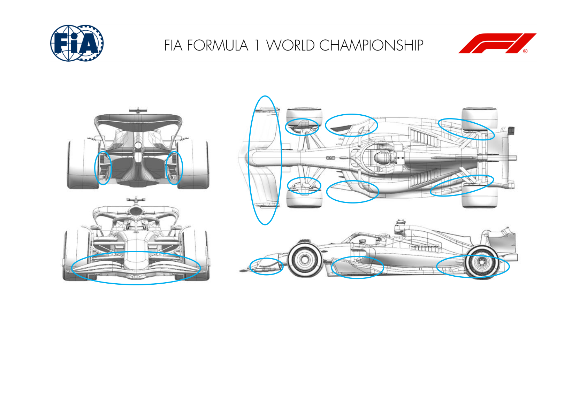
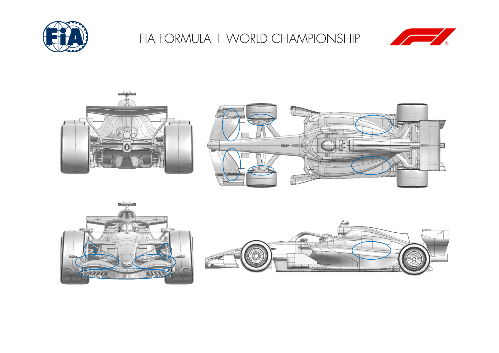
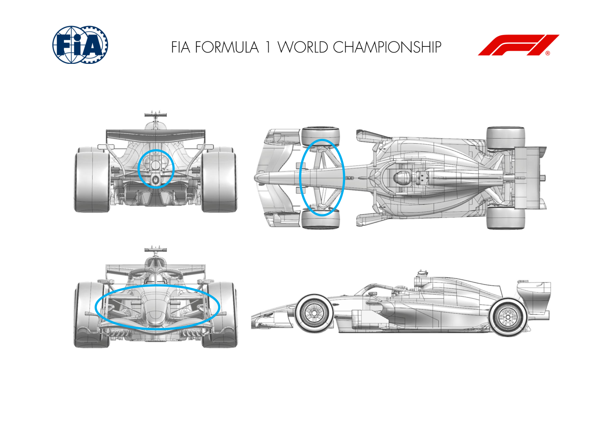
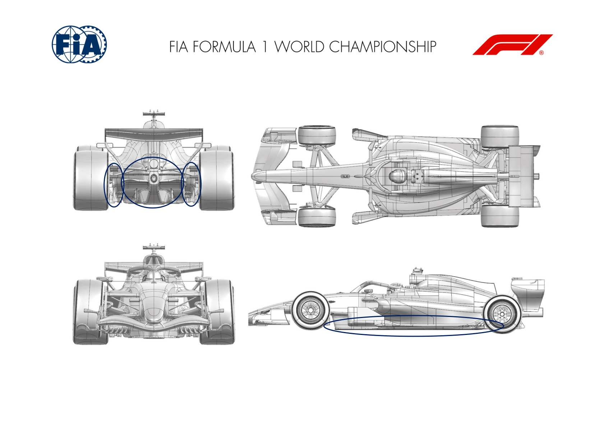
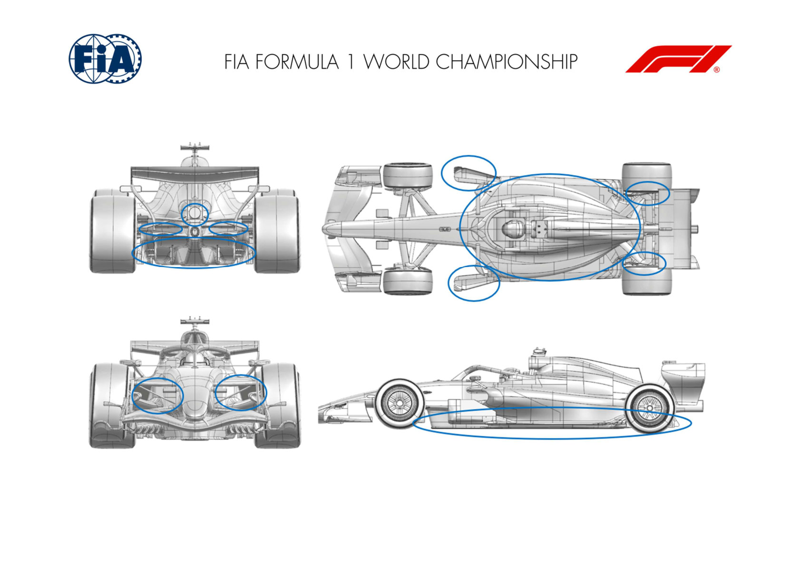
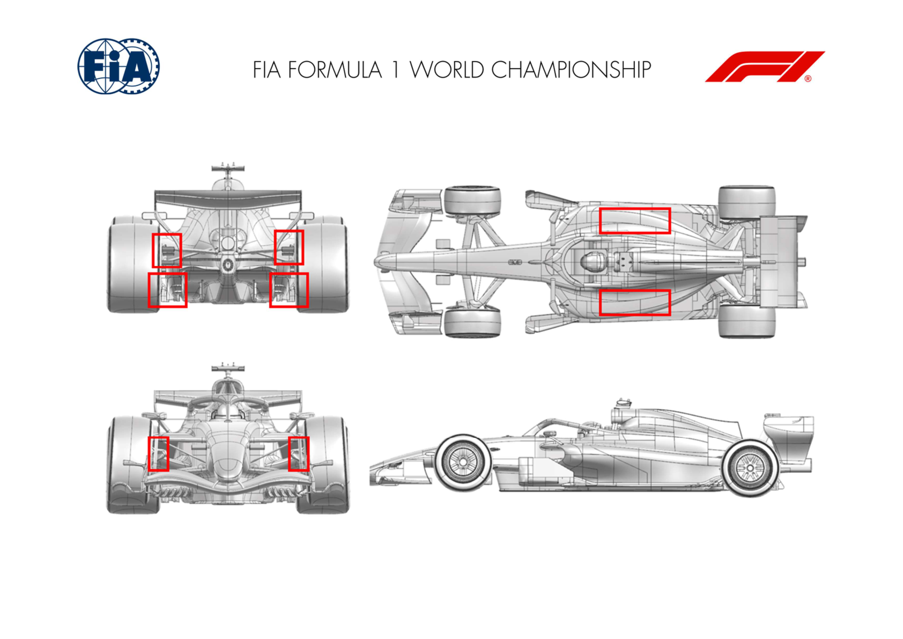
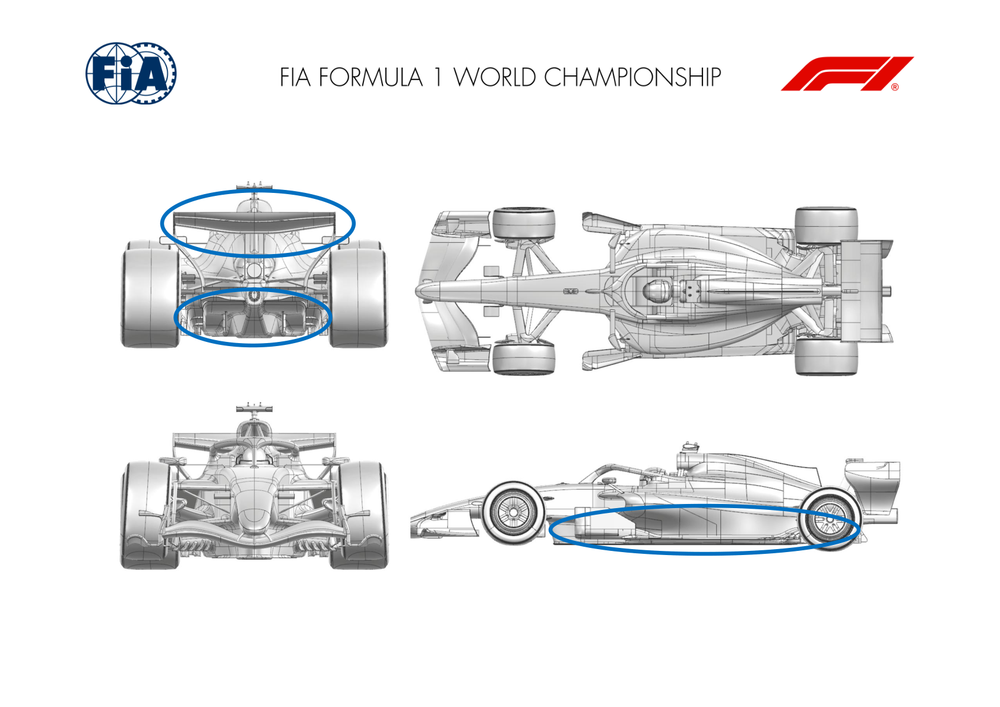
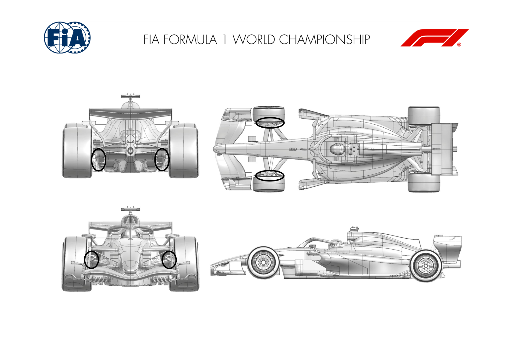

2026 CANADIAN GRAND PRIX

22 - 24 May 2026

From The FIA Formula 1 Media Delegate Document 11

To All Teams, All Officials Date 22 May 2026

Time 09:55

Title Car Presentation Submissions

Description Car Presentation Submissions

Enclosed 2026 Canadian Grand Prix - Car Presentation Submissions.pdf

Roman De Lauw

The FIA Formula 1 Media Delegate

Car Presentation – Canada Grand Prix

McLaren Mastercard F1 Team

| No. | Updated component | Primary reason for update | Geometric differences | Description |
| --- | --- | --- | --- | --- |
| 1 | Front Wing | Performance - Flow Conditioning | New Front Wing | A new front wing design, aimed at better flow conditioning across the operating range resulting in improved aerodynamic load delivery. |
| 2 | Coke/Engine Cover | Performance - Flow Conditioning | New Bodywork | A revised bodywork package featuring additional cooling exits aiming at improved aerodynamic flow conditioning towards the rear of the car. |
| 3 | Cooling Louvres | Circuit specific - Cooling Range | Cooling Louvre Options | As part of the new bodywork package, multiple cooling louvre options are available to cover the full range of ambient temperatures expected at this and future events. |
| 4 | Halo | Performance - Flow Conditioning | Halo Winglet | A new winglet on top of the halo, aiming at improved management of aerodynamic flow around the cockpit and central engine cover. |
| 5 | Rear Wing Endplate | Performance - Local Load | Revised Rear Wing Endplate | Modification to the rear wing endplate geometry resulting in a change in load distribution and increase in local aerodynamic load. |
| 6 | Rear Suspension | Performance - Flow Conditioning | Revised Rear Suspension Fairings | Small modification to the rear suspension fairings aimed at improved aerodynamic flow conditioning and load generation around the rear corner and diffuser. |
| 7 | Floor Edge | Performance - Flow Conditioning | Revised Floor Edge Devices | Iteration on floor edge devices aimed at improved overall floor conditioning and aerodynamic load generation on the floor and diffuser. |

Car Presentation – 2026 Canadian Grand Prix

*Mercedes-AMG PETRONAS F1 Team*

| No. | Updated component | Primary reason for update | Geometric differences | Description |
| --- | --- | --- | --- | --- |
| 1 | Front Wing | Performance - Flow Conditioning | Front wing outboard elements dropped in height and run into the footplate. Running the front wing elements into the footplate, and adding strakes, results in more robust flow structures, improving flow to the rear of the car and gaining downforce. |  |
| 2 | Front Wing Endplate | Performance - Flow Conditioning | Front wing endplate and footplate adjusted to accommodate the above. Footplate stakes added. Diveplane camber adjusted. |  |
| 3 | Front Corner | Performance - Flow Conditioning | Front caketin upper lip camber reduced. | Reduced upper lip camber improves flow structure robustness throughout the operating envelope, improving the onset flow to the rear wing. |
| 4 | Front Corner | Circuit specific - Cooling Range | Increased inlet and exit size. | Due to the high braking demands of Montreal - increasing the duct inlet and exit size increases mass flow feeding the discs resulting in more cooling. |
| 5 | Floor Board | Performance – Local Load | Reprofiled elements | Reprofiled elements to improve local pressure distribution and reduce separations at the extremes of the operating envelope, resulting in increased local load. |
| 6 | Floor Corner | Performance - Flow Conditioning | Additional slots | Re-optimisation of floor corner slot arrangement to both increase local load and to also improve flow into the diffuser and hence rear load. |
| 7 | Floor Body | Performance – Local Load | Reprofiled diffuser roof | By reprofiling the diffuser roof and sidewall we improve the surface flow quality throughout the operating envelope and generate more local load. |
| 8 | Rear Corner | Performance – Local Load | Rear winglet span and position redistribution Chord and position of the rear caketin winglets re-optimised to improve local flow control and performance of the diffuser. |  |

Car Presentation – Canadian Grand Prix

Oracle Red Bull Racing.

| No. | Updated component | Primary reason for update | Geometric differences | Description |
| --- | --- | --- | --- | --- |
| 1 | Front Wing | Balance Range | Revised front wing flap elements | Both second and third front wing elements forming the flap assemblies are revised to shift the aerobalance range available for the upcoming circuits. |
| 2 | Front Corner | Reliability | Revised brake duct exit geometry | The next two circuits on the calendar demand more brake assembly cooling and to offer this an enlarged exit duct has been produced to enhance the cooling |
| 3 | Floor | Performance – Local load | Bib edge trim and revised forward floor devices | To further optimise both the bib and forward floor devices, the former has a trim applied and the latter mildly increased camber resulting in the local load increasing |
| 4 | Engine Cover | Reliability | Cooling exit panel option | Given the forecast for Montreal, a closed radiator exit panel has been created with the louvre steps necessary for the race in Miami now closed. |

Car Presentation – Canadian Grand Prix

SCUDERIA FERRARI HP

No updates submitted for this event.

Car Presentation – Canada Grand Prix

*Williams*

| No. | Updated component | Primary reason for update | Geometric differences | Description |
| --- | --- | --- | --- | --- |
| 1 | Front Corner | Circuit specific - Cooling Range | A new FBD scoop geometry with a reprofiled exit area. | To suit the demands of the Gilles-Villeneuve circuit, a new FBD geometry will be introduced which offers an increased level of overall brake system cooling. |
| 2 | Front Suspension | Performance - Flow Conditioning | Revised suspension cladding surfaces, with changes in chord and incidence across their span. | In concert with the updated FBD geometry, new suspension cladding will be available to improve the local interactions on the front corner and hence downstream across the rest of the car. |
| 3 | Exhaust Tailpipe | Performance – Local Load | A repositioned exhaust tailpipe | Following on from an update introduced at the previous Miami GP, a further step on the exhaust system will be evaluated which offers an improved coupling with the surrounding aerodynamic |

Car Presentation – Canadian Grand Prix

Visa Cash App Racing Bulls

| No. | Updated component | Primary reason for update | Geometric differences | Description |
| --- | --- | --- | --- | --- |
| 1 | Floor Body | Performance - Local Load | New Main Floor geometry | A new floor geometry resulting in an efficient downforce increase generated by the underbody of the car, across a range of operating conditions. |
| 2 | Rear Corner | Performance – Flow Conditioning | Reprofiled Rear Corner devices | Working in conjunction with the floor update, the changes to the rear corner devices improve the flow management at the back of the car. |
| 3 | Beam Wing | Performance – Local Load | Profile and incidence modifications | Supporting the changes made to the floor and around the exhaust, the Beam Wing changes help extract additional load from the rear wing assembly. |
| 4 | Exhaust Tailpipe Bracket | Performance – Flow Conditioning | Reprofiled tailpipe bracket | The tailpipe bracket update improves the flow management around the centreline of the car as part of the surrounding changes on the Beam Wing and floor. |

Car Presentation – Canadian Grand Prix

Aston Martin Aramco F1 Team

No updates submitted for this event.

Car Presentation – Canadian Grand Prix

HAAS

| No. | Updated component | Primary reason for update | Geometric differences | Description |
| --- | --- | --- | --- | --- |
| 1 | Sidepod Inlet | Performance - Flow Conditioning | Revised Sidepod Inlet | The revised bodywork enables a more pronounced undercut along the lower surfaces, which, combined with increased top‑surface downwash, |
| 2 | Coke/Engine Cover | Performance - Flow Conditioning | Undercut and top downwash | channels higher‑energy airflow towards the rear of the car, allowing the bespoke floor design to operate more efficiently. |
| 3 | Floor Body | Performance - Local Load | Revised floor geometry, with new floor board, new floor edge splits and a more aggressive diffuser promoting up- and side-wash | The new floor was developed in conjunction with optimised to guide higher‑energy airflow through the floor volume, enhancing mass flow and stability, and promoting more efficient extraction and overall load generation. |
| 4 | Rear Suspension | Performance - Flow Conditioning | Optimized suspension faring design | The updated floor and bodywork required a realignment of the suspension fairings, enabling improved flow conditioning in this region and extracting additional performance from the overall package. |
| 5 | Rear Corner | Performance - Local Load | Revised winglet geometry on the inboard drum face | The modified incoming flow field required a realignment of the inboard drum devices to maintain their aerodynamic effectiveness and overall flow conditions. |

Car Presentation – Canadian Grand Prix

Audi Revolut F1 Team

| No. | Updated component | Primary reason for update | Geometric differences | Description |
| --- | --- | --- | --- | --- |
| 1 | Front Corner | Circuit specific - Cooling Range | New front brake duct design. Changes offer increased brake system cooling flow for the big braking zones of this specific track. |  |
| 2 | Floor Diffuser Winglet | Performance – Local Load | Updated diffuser. | Diffuser geometry update with a further evolution of its shape aiming to increase aero load efficiently at the rear end. |
| 3 | Cooling Louvres | Performance – Local Load | New sidepod louvres. For this event new sidepod louvres are available to allow fitting more efficient cooling options. |  |
| 4 | Rear Corner | Circuit specific - Cooling Range | New rear brake duct design. Changes offer increased brake system cooling flow for the big braking zones of this specific track. |  |

Car Presentation – Canadian Grand Prix

BWT Alpine F1 Team

| No. | Updated component | Primary reason for update | Geometric differences | Description |
| --- | --- | --- | --- | --- |
| 1 | Floor body | Performance - Local Load | New floor and board geometry | A completely new floor geometry is released at this event with the objective of increasing aerodynamic performance and efficiency across all operating conditions. |
| 2 | Rear Wing | Performance - Local Load | Modified rear wing geometry | As part of our rear wing development programme, geometrical adjustments to our latest rear wing are introduced at this event. |

Car Presentation – Canadian Grand Prix

Cadillac

| No. | Updated component | Primary reason for update | Geometric differences | Description |
| --- | --- | --- | --- | --- |
| 1 | Front Corner | Performance - Cooling | Updated leading edge lip, brake duct internals and exit geometry | The leading edge lip profile of the FBD has been revised to improve overall aerodynamic loading, whilst internal duct and exit geometry revisions increase brake cooling capacity |
| 2 | Diffuser | Performance – Local Load | Revised Diffuser winglet lower trim and hanger details | A lower edge trim has been applied to the Diffuser winglet cascade, and the hanger detail has been revised to increase local aerodynamic load at the rear of the car |

