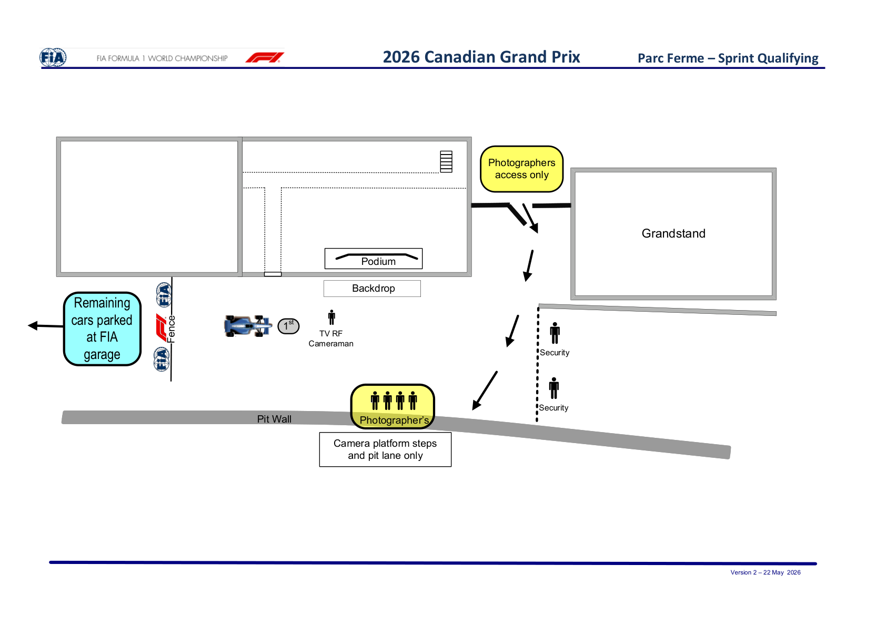

2026 CANADIAN GRAND PRIX

22 - 24 May 2026

From The FIA Formula 1 Media Delegate Document 15

To All Teams, All Officials Date 22 May 2026

Time 12:24

Title Post-Sprint Qualifying Procedure v2

Description Post-Sprint Qualifying Procedure v2

Enclosed 2026 Canada Grand Prix - Post-Sprint Qualifying Procedure v2.pdf

Roman De Lauw

The FIA Formula 1 Media Delegate

2026 C G P ANADIAN RAND RIX

22 – 24 May 2026

From The FIA Formula One Media Delegate

To All Officials, All Teams Date 22 May 2026

NOTE TO TEAMS: POST-SPRINT QUALIFYING PROCEDURE V2

The Post-Sprint Qualifying procedure requires the fastest driver to be interviewed once he has got out of

his car. We would like to ask for your co-operation in ensuring the procedure below is followed:

• If they take the chequered flag at the end of SQ3, the fastest driver only should return to the Pit

Lane where he will find the number 1 board in front of the podium close to Pit Lane Exit.

• Other than the team mechanics (with cooling fans if necessary), officials, FIA pre-approved television

crews and photographers, no one else will be allowed in the designated area at this time (no driver

physios nor team PR personnel).

• Once out of the car, the fastest Driver will be weighed by the FIA. The Driver must remain fully attired

until after he has been weighed (e.g: Helmet, Gloves, etc).

• After the Driver has been weighed, the Post-Sprint Qualifying interview will take place in the designated

area. The interviewer will be selected by the Commercial Rights Holder.

• If the fastest driver is in the Pit Lane at the end of the session, the team should ensure that he goes

directly to the designated area once the other drivers have arrived there.

• At the end of the live interview the fastest driver will be led to the backdrop for a Pirelli Award photo

opportunity.

• The fastest driver will then conduct a pooled TV interview at the back of the FIA Garages. There will be

no Press Conference following the Sprint Qualifying.

• Drivers eliminated in SQ1 and SQ2, drivers classified from 2nd to 10th in SQ3 and drivers who did not

participate in SQ1 but are eligible to race must conduct a pooled TV interview immediately after they

have been weighed by the FIA at the end of the last part of the Sprint Qualifying in which they

participated. This will take place directly behind the FIA garage.

Apart from the fastest driver of Sprint Qualifying we would like to ask for your co-operation in ensuring the

procedure below is followed:

• Any drivers who finished participating in the Sprint Qualifying sessions after SQ1 and SQ2 must proceed

to the FIA scales through the pit-lane immediately after they have returned to the team’s garage. The

drivers may not drink anything or do anything which increases their weight before it is recorded by the

FIA.

• Any driver, who stops on the track during the qualifying sessions and is not required to visit the Medical

Centre, must proceed to the FIA scales to get his weight recorded before returning to his team.

• Drivers who finish within the top 10 must proceed to the FIA scales immediately when out of their cars

without contact with any other person.

Please see the attached Sprint Qualifying - Parc Fermé Diagram.

Roman De Lauw

The FIA Formula 1 Media Delegate

