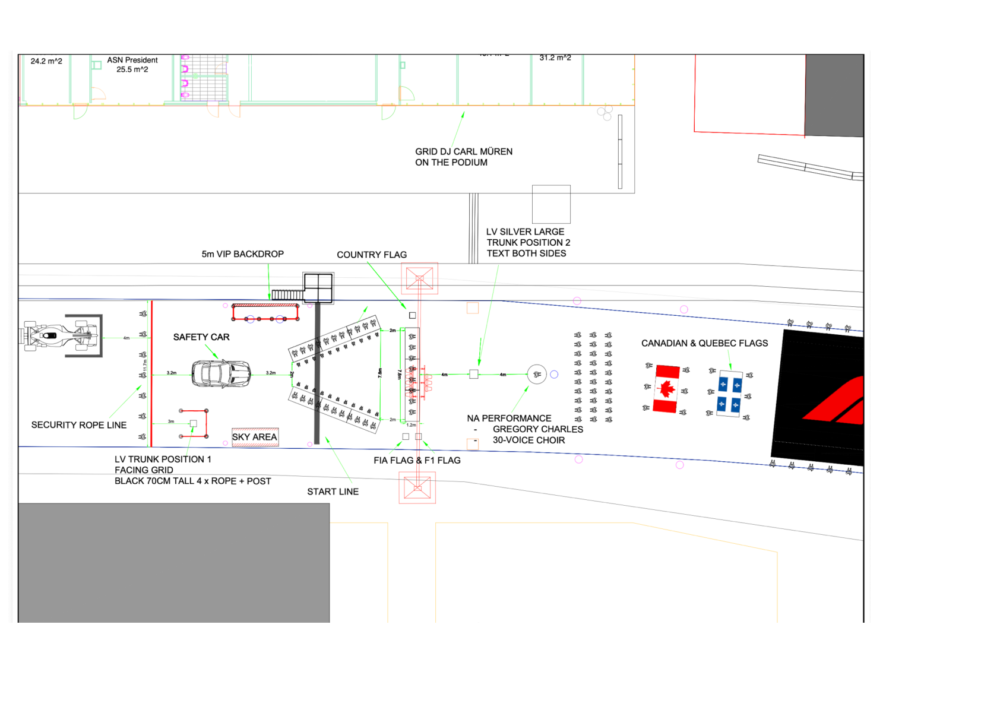

2026 CANADIAN GRAND PRIX

22 - 24 May 2026

From The FIA Formula 1 Media Delegate Document 86

To All Teams, All Officials Date 24 May 2026

Time 09:47

Title Pre-Race Procedure

Description Pre-Race Procedure

Enclosed 2026 Canadian Grand Prix - Pre-Race Procedure.pdf

Roman De Lauw

The FIA Formula 1 Media Delegate

2026 C G P ANADIAN RAND RIX

22 – 24 May 2026

From The FIA Formula One Media Delegate

To All Officials, All Teams Date 24 May 2026

NOTE TO TEAMS: PRE-RACE PROCEDURE

Please find below a summary of the requirements for the Pre-Race activities and National

Anthem as set out in Article B10.1.4b of the FIA F1 Regulations: “In any case, no less than

sixteen (16) minutes before the scheduled start of the formation lap all drivers must be

present at the front of the grid for the playing of the national anthem.”

15:40:00 Drivers move to National Anthem Position. Drivers will be expected to be in

position no later than 15:42:00.

15:44:00 The National Anthem. For the duration of the National Anthem all Drivers must

remain attired only in their race suits.

Failure to comply with these procedures will be reported to the Stewards.

Please see the attached National Anthem Diagram.

Roman De Lauw

The FIA Formula 1 Media Delegate

