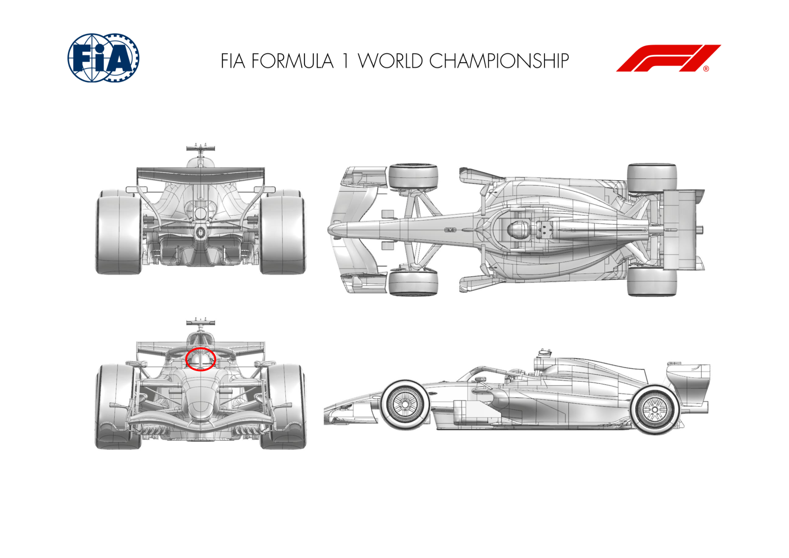
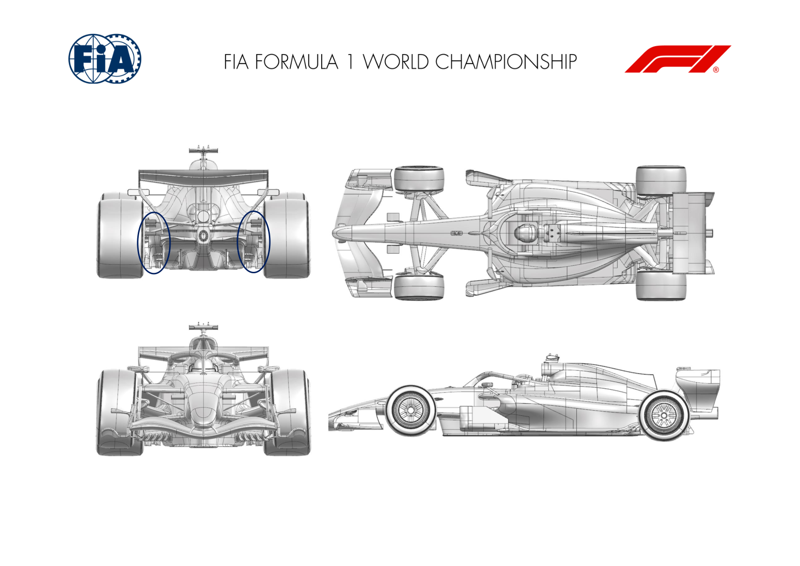
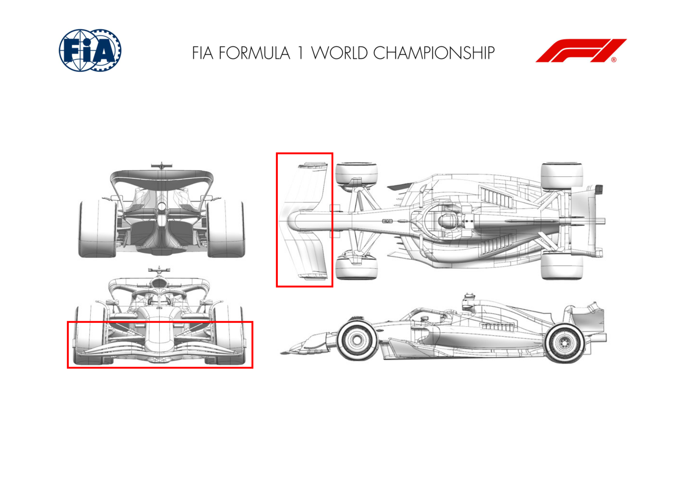
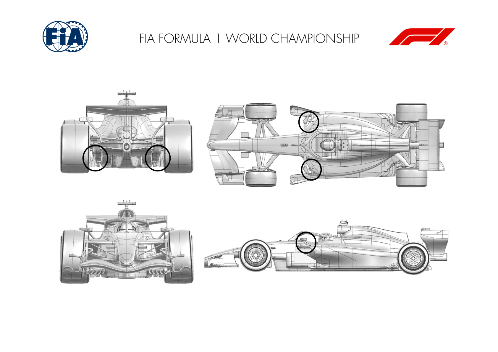

2026 CHINESE GRAND PRIX

13 - 15 March 2026

From The FIA Formula One Media Delegate Document 10

To All Teams, All Officials Date 13 March 2026

Time 08:54

Title Car Presentation Submissions

Description Car Presentation Submissions

Enclosed 2026 Chinese Grand Prix - Car Presentation Submissions.pdf

Roman De Lauw

The FIA Formula One Media Delegate

Car Presentation – Chinese Grand Prix

McLaren Mastercard F1 Team

No updates submitted for this event.

Car Presentation – 2026 Chinese Grand Prix

Mercedes-AMG PETRONAS F1 Team

No updates submitted for this event.

Car Presentation – Chinese Grand Prix

Oracle Red Bull Racing

No updates submitted for this event.

Car Presentation – Chinese Grand Prix

*Scuderia Ferrari HP*

| No. | Updated component | Primary reason for update | Geometric differences | Description |
| --- | --- | --- | --- | --- |
| 1 | Halo | Performance - Local Load | Winglet added to the halo pillar | Introducing a winglet element to the halo pillar as a minor update. Not event specific, it simply returns a small aerodynamic load benefit |

Car Presentation – Chinese Grand Prix

*ATLASSIAN WILLIAMS F1*

No updates.

Car Presentation – Chinese Grand Prix

Visa Cash App Racing Bulls

| No. | Updated component | Primary reason for update | Geometric differences | Description |
| --- | --- | --- | --- | --- |
| 1 | Rear Corner | Performance – Flow Conditioning | Profile modification to brake duct winglets. | The winglet geometry change helps improve the flow management at the back of the car and around the rear tyre. |

Car Presentation – Chinese Grand Prix

Aston Martin Aramco F1 Team

No updates submitted for this event.

Car Presentation – Chinese Grand Prix

TGR HAAS F1 TEAM

| No. | Updated component | Primary reason for update | Geometric differences | Description |
| --- | --- | --- | --- | --- |
| 1 | Rear Impact Structure | Performance - Local Load | Small winglet placed on top of the Rear Impact Structure | The winglet is shaped to promote upwash, which in turn improves the local aerodynamic characteristics and results in a corresponding increase in load. |

Car Presentation – Chinese Grand Prix

Audi Revolut F1 Team

| No. | Updated component | Primary reason for update | Geometric differences | Description |
| --- | --- | --- | --- | --- |
| 1 | Front Wing | Performance - Local Load | Updated front wing flap and end plate geometry | The new flap and end plate lead to improved flow characteristics travelling further downstream along the car – locally and globally more efficient. |
| 2 | Nose | Performance - Local Load | Updated nose design | In combination with the above mentioned step, the extraction all along the slope. |

Car Presentation – Chinese Grand Prix

BWT Alpine F1 Team

No updates submitted for this event.

Car Presentation – Chinese Grand Prix

Cadillac

| No. | Updated component | Primary reason for update | Geometric differences | Description |
| --- | --- | --- | --- | --- |
| 1 | Diffuser | Performance - Local Load | Trailing edge detail changes on diffuser winglet cascade | Modifications made to the trailing edge lead to an increase in the local aerodynamic load acting on the winglet cascade, consequently increasing the overall aerodynamic load at the rear of the car. |
| 2 | Mirror Stay | Structural Improvement | Small leading edge surface changes | Aerodynamic surface geometry has been revised in order to accommodate and integrate the latest |

