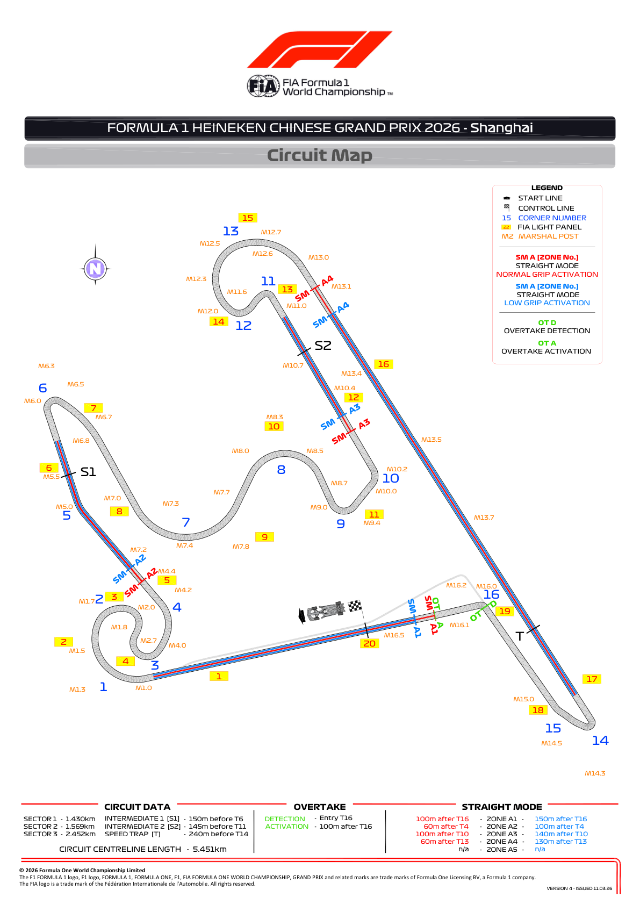
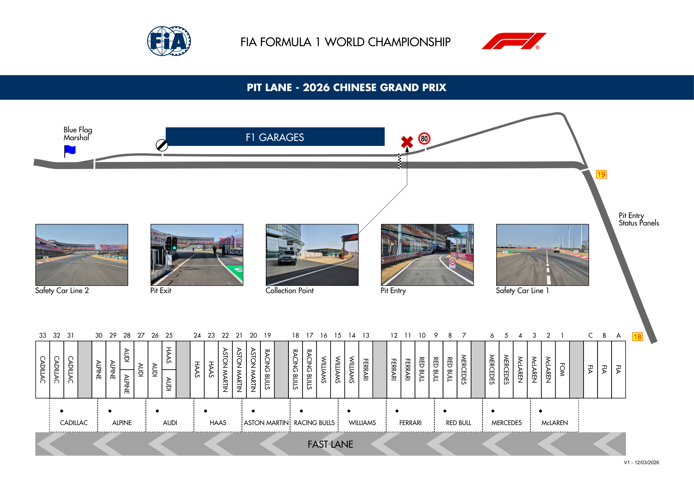
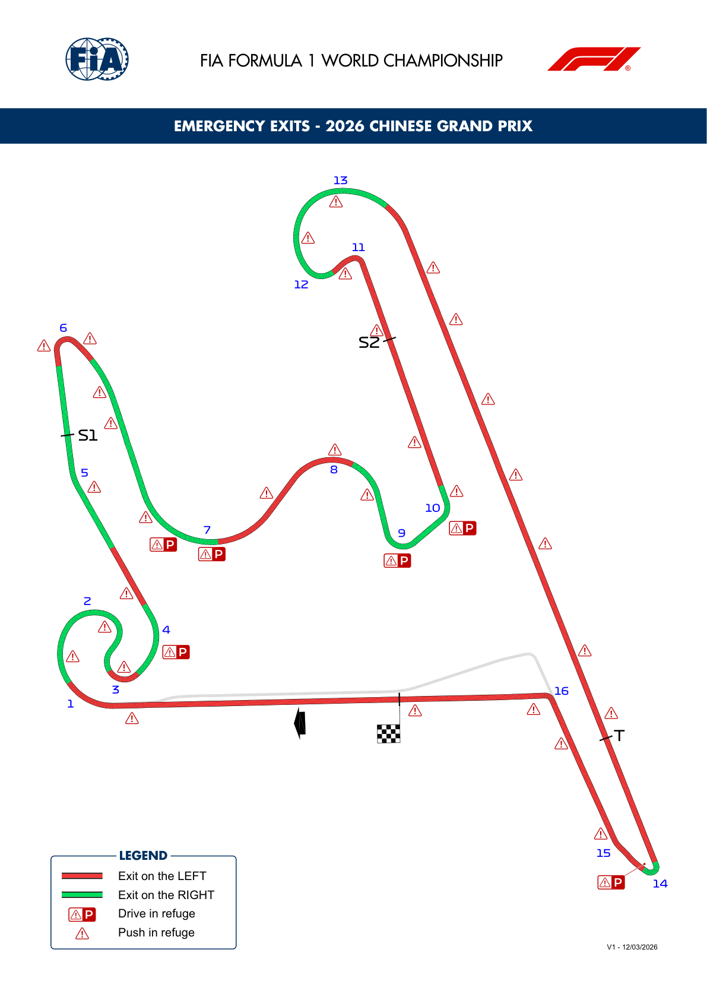
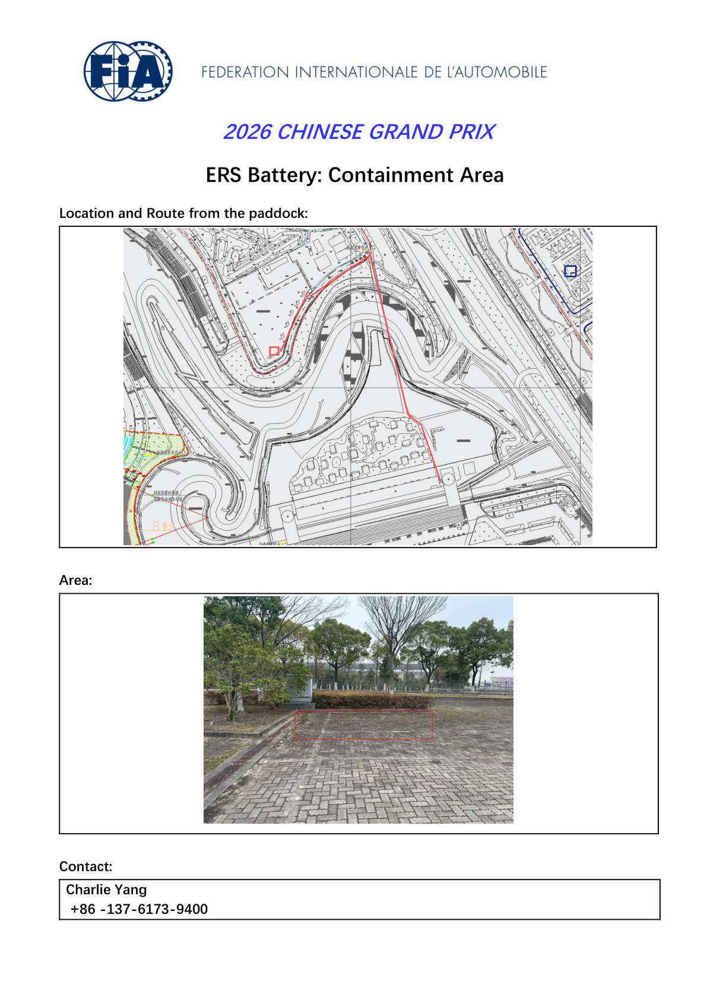
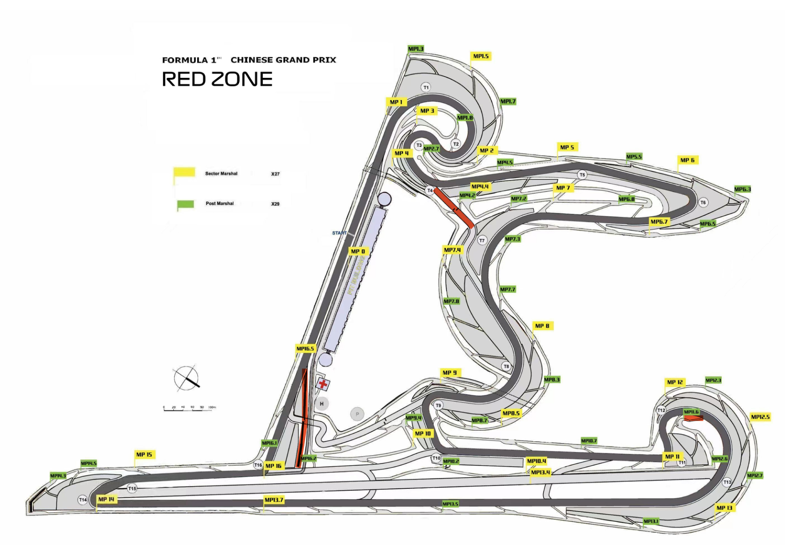

2026 CHINESE GRAND PRIX

13 - 15 March 2026

From The FIA Formula One Race Director Document 7

To All Teams, All Officials Date 12 March 2026

Time 16:58

Title Competition Notes - Circuit Map, Pit Lane Drawing, Emergency Exits Map, Battery Containment Area and Red Zone

Description Competition Notes - Circuit Map, Pit Lane Drawing, Emergency Exits Map, Battery Containment Area and Red Zone

Enclosed 02CHN - Maps .pdf

Rui Marques

The FIA Formula One Race Director

