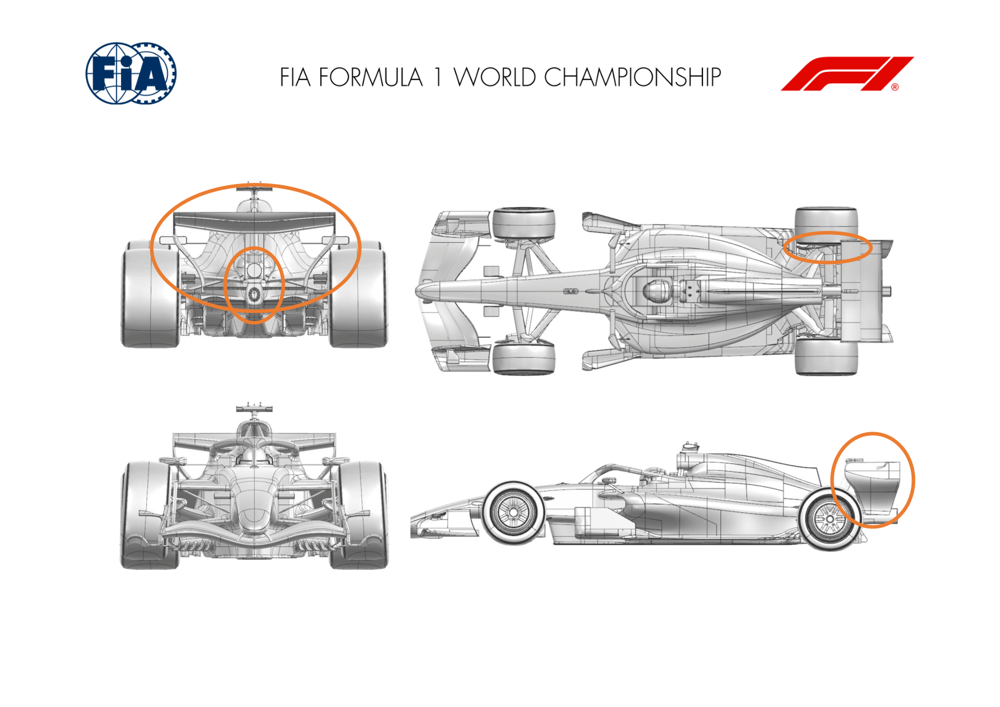
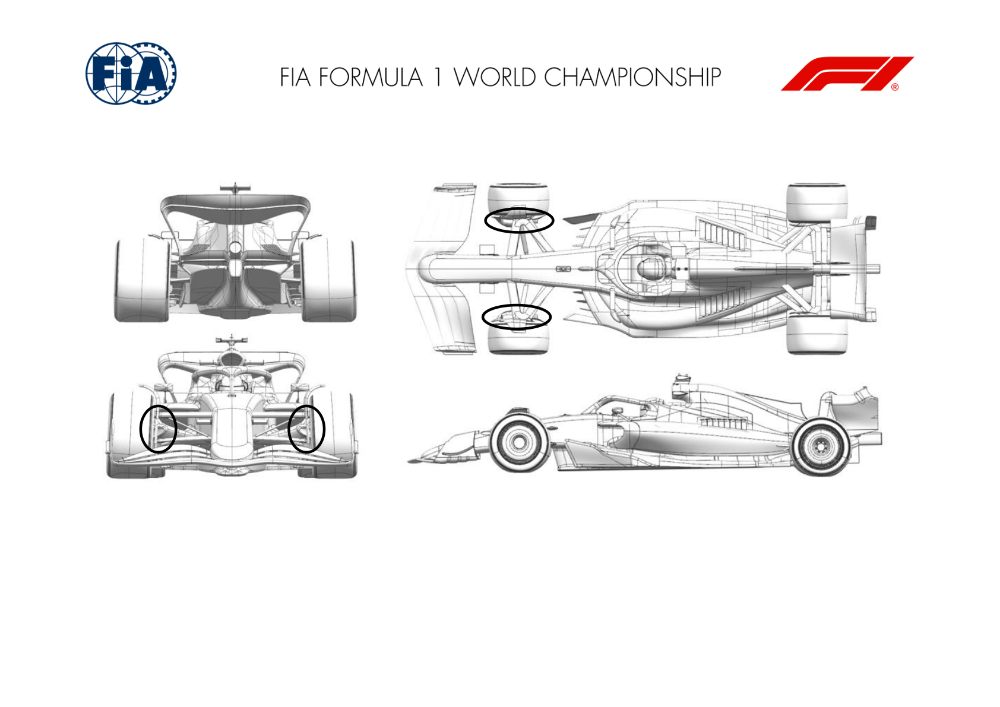
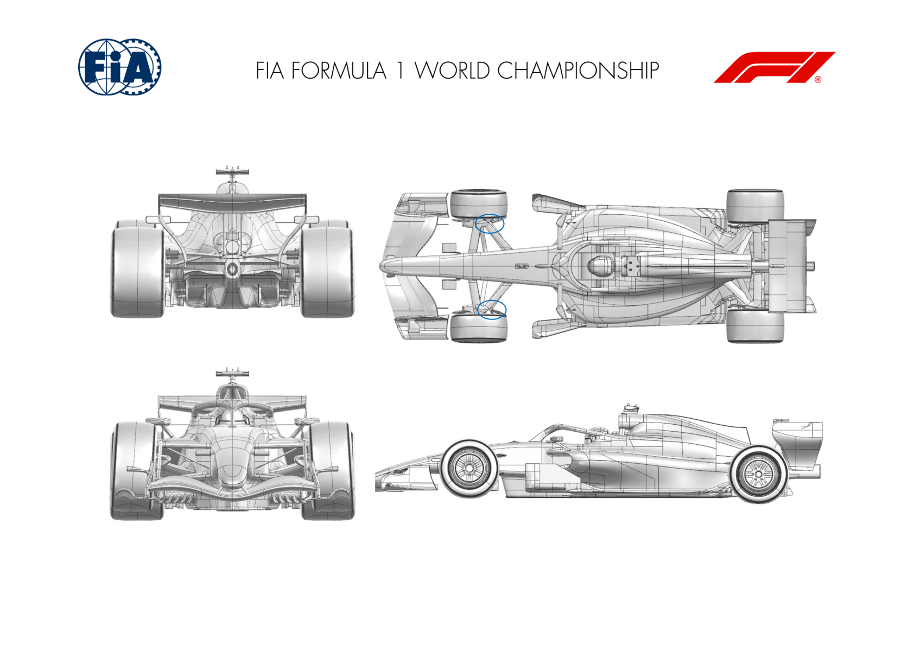
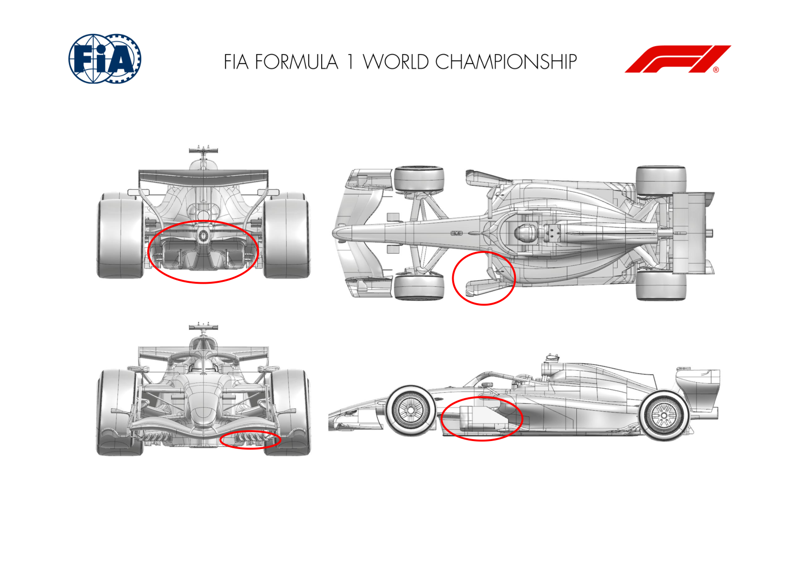
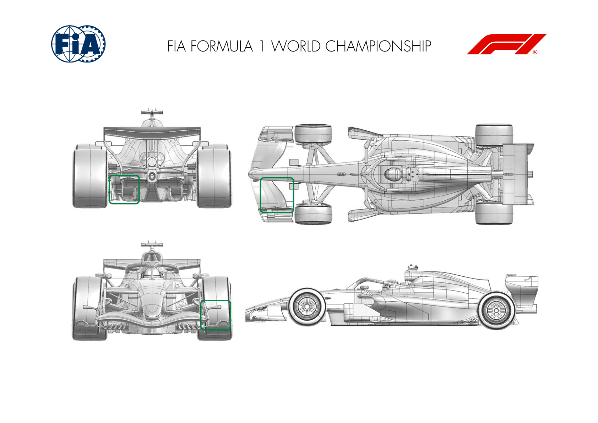
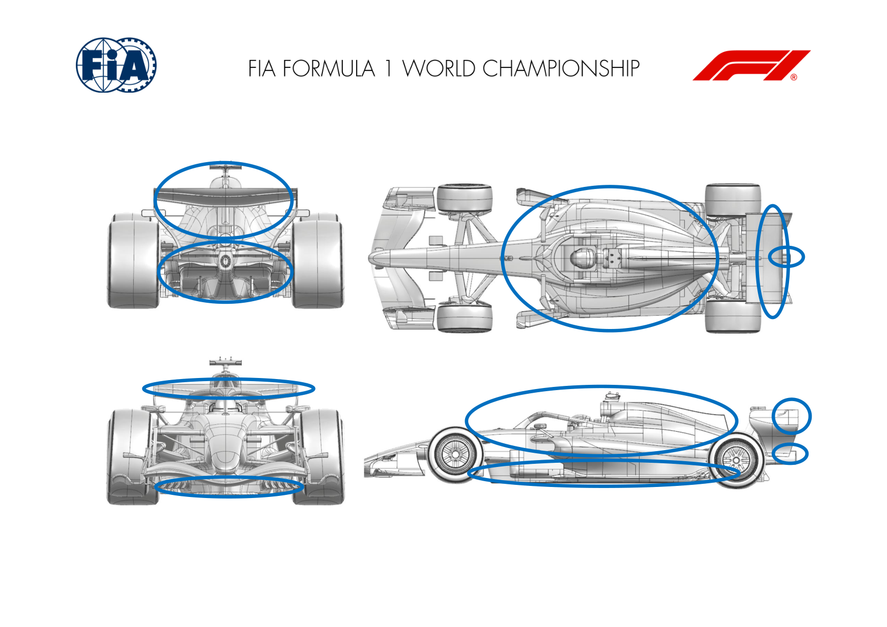

2026 DUTCH GRAND PRIX

21 - 23 August 2026

From The FIA Formula 1 Media Delegate Document 10

To All Teams, All Officials Date 21 August 2026

Time 09:50

Title Car Presentation Submissions

Description Car Presentation Submissions

Enclosed 2026 Dutch Grand Prix - Car Presentation Submissions.pdf

Cameron Kelleher

The FIA Formula 1 Media Delegate

Car Presentation – Dutch Grand Prix

McLaren Mastercard F1 Team

| No. | Updated component | Primary reason for update | Geometric differences | Description |
| --- | --- | --- | --- | --- |
| 1 | Rear Wing | Performance – Local Load | New Rear Wing Assembly | A new rear wing assembly has been designed and delivered to this event, aiming to increase aerodynamic load efficiently in all conditions. |
| 2 | Coke/Engine Cover | Performance – Local Load | Revised Central Bodywork | The furniture around the coke as well as the tailpipe have been revised to extract additional efficient aerodynamic performance in conjunction with the rear wing. |
| 3 | Rear Corner | Performance - Flow Conditioning | Revised Rear Brake Duct | The rear brake duct has been revised internally as well as externally, aiming at improved flow conditioning resulting in better aerodynamic and brake cooling performance. |

Car Presentation – 2026 Dutch Grand Prix

*Mercedes-AMG PETRONAS F1 Team*

| No. | Updated component | Primary reason for update | Geometric differences | Description |
| --- | --- | --- | --- | --- |
| 1 | Front Corner | Performance - Flow Conditioning | Drum front lip detached from the duct inlet and camber adjusted. | Detaching the lip from the duct inlet improves flow quality over the inboard face of the drum throughout the steer range, improving flow to the rear of the car. |

Car Presentation – Netherlands Grand Prix

Oracle Red Bull Racing.

| No. | Updated component | Primary reason for update | Geometric differences | Description |
| --- | --- | --- | --- | --- |
| 1 | Front Corner | Reliability | Wishbone shroud chord length and wheel bodywork gaitor | To improve reliability of the wheel bodywork assembly, the lower wishbone rearward leg chord length has been locally shrunk to reduce strain on the gaitor at high steering angles. |

Car Presentation – Dutch Grand Prix

SCUDERIA FERRARI HP

| No. | Updated component | Primary reason for update | Geometric differences | Description |
| --- | --- | --- | --- | --- |
| 1 | Floor Body | Performance - Local Load | Updated board brace layout and pick-ups, Front floor and vanes arrangement revision. Reshaped floor edge curl and revised board foot geometry. This floor development targets a global increase in aerodynamic load across the entire operating range, combined with improved robustness of the underlying flow mechanisms, enhanced flow topology, and greater flow energy delivered to the rear diffuser |  |
| 2 | Floor Board |  |  |  |
| 3 | Floor Edge |  |  |  |
| 4 | Diffuser |  | Alternative diffuser stays layout, revised diffuser expansion profile and diffuser fence loading | Benefitting from improved onset flow quality, the diffuser expansion and geometry has been further optimized and returns increased aerodynamic load, whilst still maintaining flow stability |
| 5 | Beam Wing |  | Revised lower beam wing spanwise twist | Minor update, working in interaction with the new rear diffuser, with particular attention put on flow quality |

Car Presentation – Dutch Grand Prix

Williams

No Updates

Car Presentation – Dutch Grand Prix

Visa Cash App Racing Bulls

No updates submitted for this event.

Car Presentation – Dutch Grand Prix

Aston Martin Aramco F1 Team

| No. | Updated component | Primary reason for update | Geometric differences | Description |
| --- | --- | --- | --- | --- |
| 1 | Front Wing | Performance - Local Load | Reduced chord of the final element outboard. The local changes to the final element and to the inboard foot of the FWEP improves the performance of the new front wing introduced at the previous event. |  |
| 2 | Front Wing Endplate | Performance - Local Load | Modification to the inboard foot. |  |
| 3 | Front Wing | Performance - Local Load | Optional new front wing flap. | The flap extends the range of balance that can be achieved with front wing adjustment for car setup optimisation. |
| 4 | Floor Fences | Performance - Local Load | New floor fence in the diffuser. Changes at the back of the car work in combination to increase rear load after evaluating the performance of the new package. |  |
| 5 | Diffuser | Performance - Local Load | Modification to the lower edge of the diffuser winglet. |  |

Car Presentation – Dutch Grand Prix

TGR HAAS F1 TEAM

No update for this event

Car Presentation – Dutch Grand Prix

Audi Revolut F1 Team

No updates submitted for this event.

Car Presentation – Dutch Grand Prix

BWT Alpine F1 Team

| No. | Updated component | Primary reason for update | Geometric differences | Description |
| --- | --- | --- | --- | --- |
| 1 | Floor Body | Performance - Local Load | New floor design | The floor geometry has been revised to improve surface flow quality throughout the operating envelope and deliver increased local aerodynamic loading. |
| 2 | Floor Board | Performance – Flow Conditioning | Reprofiled elements The floor board has been reprofiled to improve the quality of the flow delivered to the rear of the car. |  |
| 3 | Floor Edge | Performance - Local Load | Optimised floor edges | The floor edges and profiles were redesigned to increase local aerodynamic loading, enhancing airflow management, efficiency, and overall performance gains. |
| 4 | Diffuser | Performance - Local Load | Reprofiled diffuser | This diffuser geometry has been developed to increase local aerodynamic loading, providing an efficient performance gain across the full operating envelope of the car. |
| 5 | Sidepod/Coke | Performance – Flow Conditioning | New bodywork design | As part of this package update, the bodywork has been redesigned to work efficiently alongside the new floor while maintaining sufficient cooling capacity. |
| 6 | Rear Corner | Performance - Local Load | Reprofiled elements | Elements on the rear drum face have been reprofiled to improve flow interaction with the floor and deliver local load. |

| No. | Updated component | Primary reason for update | Geometric differences | Description |
| --- | --- | --- | --- | --- |
| 7 | Rear impact structure | Performance - Local Load | Updated geometry | The new updated geometry is aimed at increasing aerodynamic load locally and efficiently throughout the operating range of the car. |
| 8 | Rear Wing | Performance - Local Load | Redesigned flap geometry | The flap profile has been refined to efficiently increase rear wing load while maintaining a high quality, stable flowfield. |

Car Presentation – Dutch Grand Prix

Cadillac

No Updates
