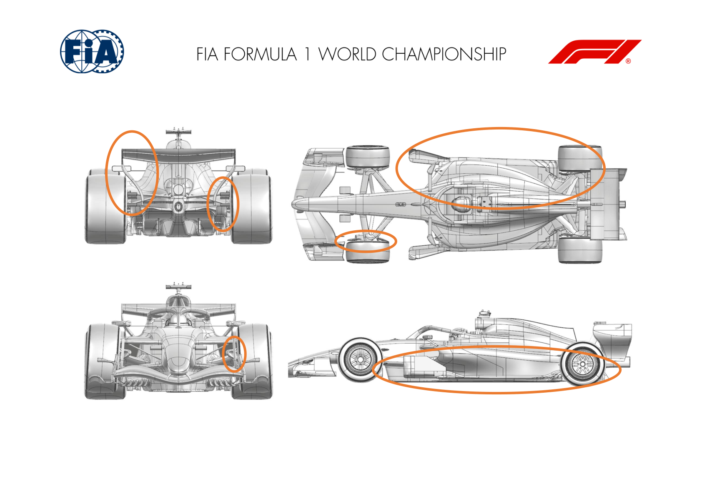
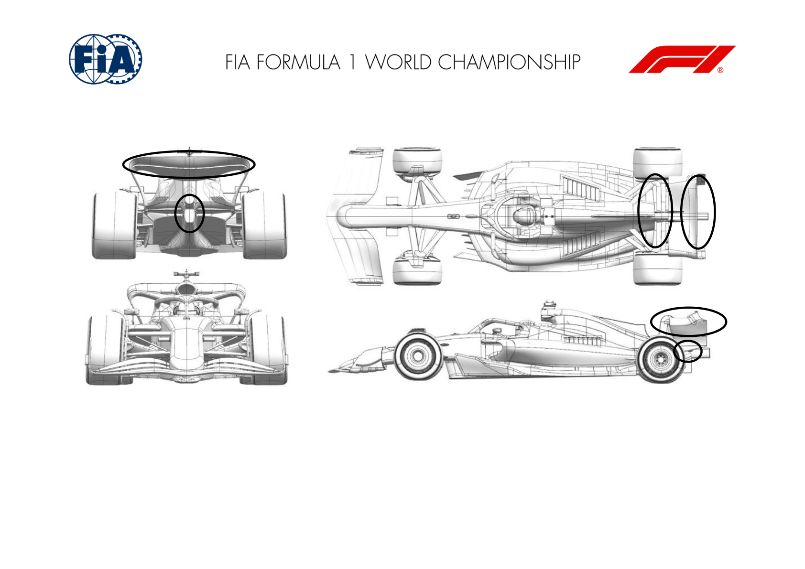
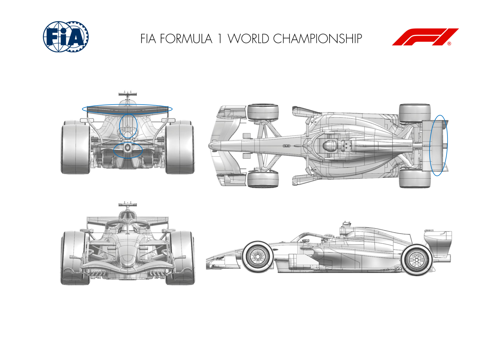
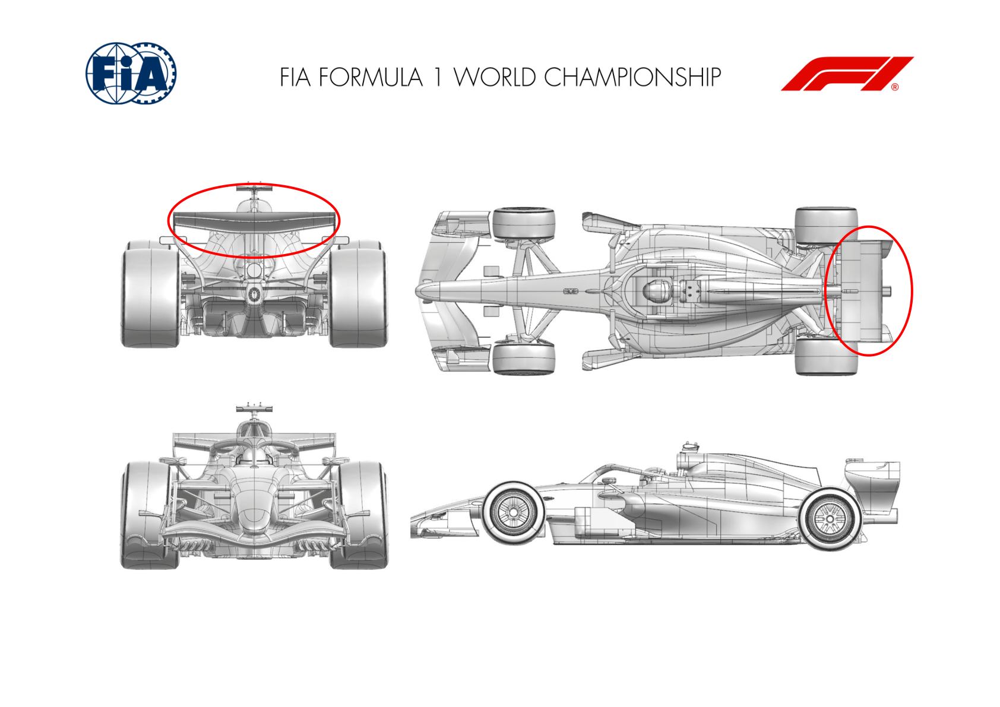
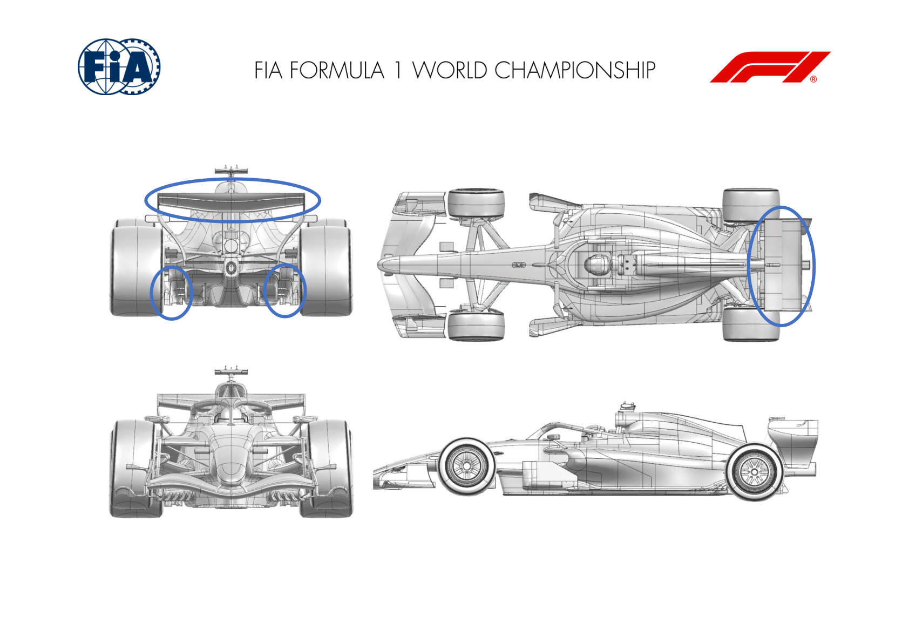
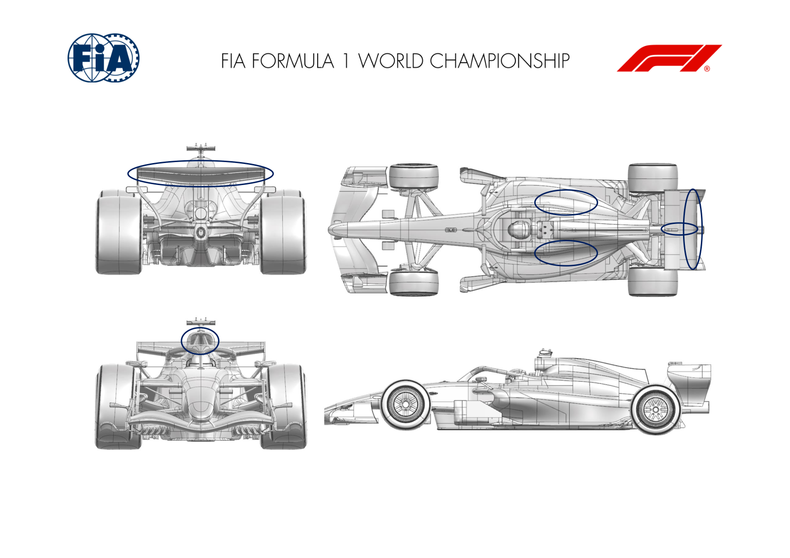
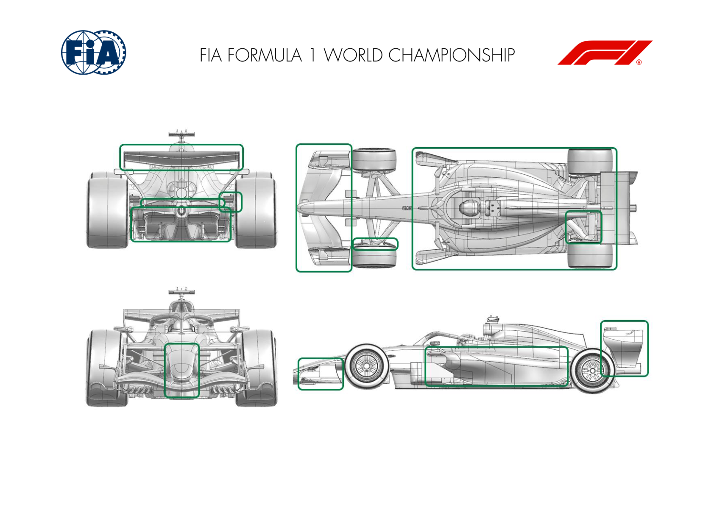
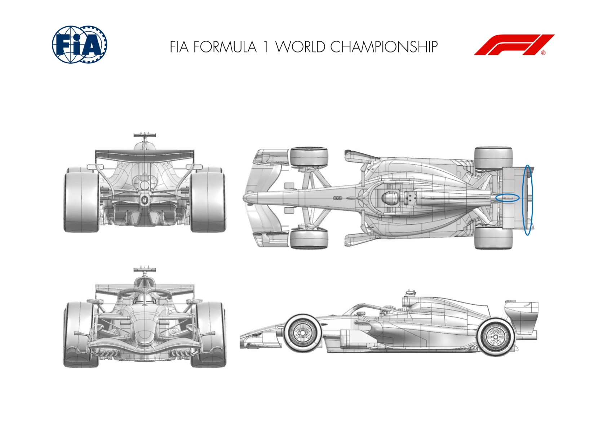
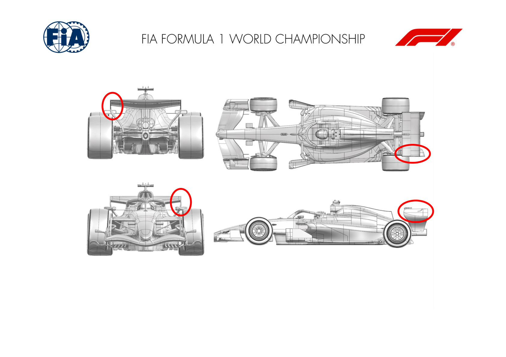
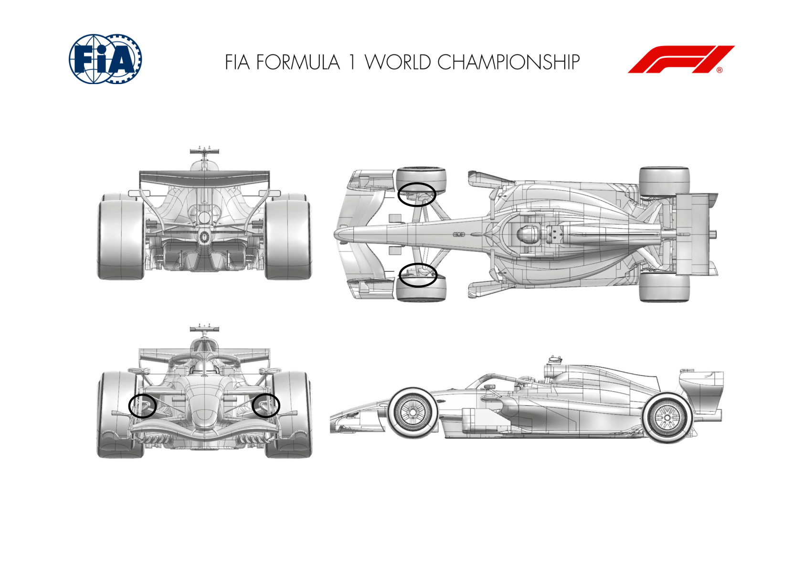

2026 HUNGARIAN GRAND PRIX

23 - 25 July 2026

From The FIA Formula 1 Media Delegate Document 9

To All Teams, All Officials Date 24 July 2026

Time 10:54

Title Car Presentation Submissions

Description Car Presentation Submissions

Enclosed 2026 Hungarian Grand Prix - Car Presentation Submissions.pdf

Roman De Lauw

The FIA Formula 1 Media Delegate

Car Presentation – Hungarian Grand Prix

McLaren Mastercard F1 Team

| No. | Updated component | Primary reason for update | Geometric differences | Description |
| --- | --- | --- | --- | --- |
| 1 | Rear Wing | Performance - Flow Conditioning | Endplate modification | A small revision to the rear wing endplate resulting in improved flow conditioning and aerodynamic characteristics across the full operating range. |
| 2 | Floor Body | Performance – Local Load | New floor and board | A new floor and board featuring a modified base shape and furniture, resulting in an improvement in flow conditioning and local load generated across all conditions. |
| 3 | Front Corner | Performance - Flow Conditioning | Revised Front Corner Furniture | A small modification to the front corner furniture resulting in an improvement in flow conditioning around the front tyre and resultant aerodynamic performance. |
| 4 | Front Corner | Circuit specific - Cooling Range | Increased Brake Cooling Exit | To meet the increased brake cooling demands of this circuit, a larger front brake cooling exit has been designed aiming at minimising the detrimental impact on aerodynamic performance. |
| 5 | Rear Corner | Performance – Local Load | Revised Rear Corner Furniture | An update to the rear corner furniture, featuring a revised winglet arrangement aiming at an efficient increase of aerodynamic load. |

Car Presentation – 2026 Hungarian Grand Prix

*Mercedes-AMG PETRONAS F1 Team*

| No. | Updated component | Primary reason for update | Geometric differences | Description |
| --- | --- | --- | --- | --- |
| 1 | Rear Wing | Circuit specific - Drag Range | Additional rear wing winglet added on centreline | The new winglet increases local wing chord and camber increasing local downforce and drag at a ratio appropriate for Budapest L/D. |
| 2 | Coke/Engine Cover | Cooling Range | Wider bodywork rear exit Increased exit size to achieve adequate mass flow through the sidepods to ensure we have adequate cooling for this track. |  |
| 3 | Tail | Performance - Local Load | Tail winglet merged into rear wing brace. Running the tail winglet into the rear wing brace increases local downforce and drag at a ratio appropriate for Budapest L/D. |  |

Car Presentation – Hungarian Grand Prix

Oracle Red Bull Racing.

| No. | Updated component | Primary reason for update | Geometric differences | Description |
| --- | --- | --- | --- | --- |
| 1 | Rear Wing | Performance - Local Load | Revised pylon profiles | By exploiting the permitted rear wing pylon geometry, the camber of the pylons has been increased to extract a little more load and maintain, even enhance the flow stability. |
| 2 | Floor | Performance - Local Load | Revised diffuser geometry | Having observed some competitor designs, the floor diffuser geometry has gained surface area adjacent to the rear impact structure offering a local gain in load. |
| 3 | Rear Wing | Performance - Local Load | Revised flap element geometry | Following iterations of the rear wing design, a revised flap pairing has become available for the Hungarian GP offering more load from revised camber and chord geometries. This change is accompanied by a minor revised to the lower brace (wing) geometry as part of the new design. |

Car Presentation – Hungarian Grand Prix

SCUDERIA FERRARI HP

| No. | Updated component | Primary reason for update | Geometric differences | Description |
| --- | --- | --- | --- | --- |
| 1 | Rear Wing | Performance - Local Load | New flaps design with additional trailing edge devices, re-shaped endplate top inboard volume, new pillars. Also, an optional winglet cascade in the SM fairing volume will be available | Part of the standard development cycle, this further iteration of rear wing has been focused on increasing load in a robust way. The additional |
| 2 | Rear Wing Endplate |  |  | winglet cascade is meant to increase rear downforce at the expense of aerodynamic efficiency, and is optional. |

Car Presentation – Hungarian Grand Prix

Williams

| No. | Updated component | Primary reason for update | Geometric differences | Description |
| --- | --- | --- | --- | --- |
| 1 | Rear Wing | Circuit specific - Drag Range | A new RW assembly configuration, with a change to the rear wing flap components. | To suit the demands of the Hungaroring circuit, we have introduced an optional rear wing flap geometry which offers an increase in downforce across the rear of the car. |
| 2 | Floor Body | Circuit specific - Drag Range | A new Floor Bodywork configuration with the introduction of new geometry on the outboard Floor Winglet. | A further circuit specific change, which modifies the aerodynamic loading on the outboard floor body the car. |

Car Presentation – Hungarian Grand Prix

Visa Cash App Racing Bulls

| No. | Updated component | Primary reason for update | Geometric differences | Description |
| --- | --- | --- | --- | --- |
| 1 | Roll Hoop | Performance – Flow Conditioning | Addition of Roll Hoop Winglets | The roll hoop introduced at the previous event creates additional freedom in that area. These winglets improve the quality of the airflow reaching the rear of the car. |
| 2 | Rear Wing | Performance – Local Load | Updated SM pod geometry and wing auxiliary components | A combination of changes to the SM pod and to the to be generated by the rear wing, which is well suited to the circuit characteristics. |
| 3 | Cooling Louvres | Circuit specific - Cooling Range | Additional options of bodywork cooling louvres | Opening the louvres on the bodywork allows more airflow through the radiators, increasing engine cooling and thus increasing the range of operating conditions. |

Car Presentation – Hungarian Grand Prix

Aston Martin Aramco F1 Team

| No. | Updated component | Primary reason for update | Geometric differences | Description |
| --- | --- | --- | --- | --- |
| 1 | Front Wing | Performance - Local Load | Revised front view and planview with chord redistribution. The front wing, endplate and nose are a package to improve the performance of the front end of the car in combination with the other car updates. |  |
| 2 | Front Wing Endplate | Performance - Local Load | Updated body, diveplane and foot. |  |
| 3 | Nose | Performance - Local Load | Longer, thinner nose. |  |
| 4 | Front Corner | Performance - Local Load | Revised lip and longer rear deflector. | The new front brake duct external elements work alongside the new front wing to manage flow around the front wheels. |
| 5 | Floor Body | Performance - Local Load | Changes to all of the permitted surfaces of the floor. All floor changes are developed as a package to increase the load on the floor and therefore improve the car performance. |  |
| 6 | Floor Fences | Performance - Local Load | Updated floor leading edge vanes. |  |
| 7 | Floor Edge | Performance - Local Load | The foot/board and the area in front of the rear tyre have been modified. |  |
| 8 | Diffuser | Performance - Local Load | Changes to the main diffuser, fences and winglet. |  |

| No. | Updated component | Primary reason for update | Geometric differences | Description |
| --- | --- | --- | --- | --- |
| 9 | Sidepod Inlet | Performance - Local Load | Inlet shape revised in line with the bodywork package. The bodywork package has evolved to improve the feed to the rear of the car and complement the changes to the floor geometry. |  |
| 10 | Coke/Engine Cover | Performance - Local Load | Relative subtle changes to the shape of the bodywork |  |
| 11 | Cooling Louvres | Performance - Local Load | Conceptually similar cooling panels. | The louvres provide the usual range of options to allow the setup of the cooling system for optimum performance depending on conditions. |
| 12 | Rear Suspension | Performance - Local Load | Small changes to the leg positions and external fairings. The rear suspension and rear brake ducts modifications were developed with each other and the changes to the rear of the floor. |  |
| 13 | Rear Corner | Performance - Local Load | Subtle changes to the inlet, exit and vanes. |  |
| 14 | Rear Wing | Performance - Local Load | Chord is redistributed between the three elements, winglets added to the TE of the flap. The three components of the rear wing increase CM load while reducing SM drag, and are aligned with other changes to the rear of the car. |  |
| 15 | Beam Wing | Performance - Local Load | Change in twist distribution of the rear wing brace. |  |
| 16 | Rear Wing Endplate | Performance - Local Load | All the surfaces have been revised. |  |

Car Presentation – Hungarian Grand Prix

*TGR HAAS F1 TEAM*

| No. | Updated component | Primary reason for update | Geometric differences | Description |
| --- | --- | --- | --- | --- |
| 1 | Rear Wing | Performance - Local Load | Rear Wing SM Fairing optimization and new Rear Wing gurney-flap | The revised SM Fairing increases local aerodynamic loading and, in combination with a more aggressive Gurney flap configuration, contributes to increased rear wing downforce. |

Car Presentation – Hungarian Grand Prix

Audi Revolut F1 Team

| No. | Updated component | Primary reason for update | Geometric differences | Description |
| --- | --- | --- | --- | --- |
| 1 | Rear Wing | Performance – Flow conditioning | Endplate modification. | A revised rear wing endplate profile is introduced. The update is intended to deliver a local aerodynamic load increase while contributing to the overall aerodynamic efficiency of the race car. |

Car Presentation – Hungarian Grand Prix

BWT Alpine F1 Team

No updates submitted for this event.

Car Presentation – Hungarian Grand Prix

Cadillac

| No. | Updated component | Primary reason for update | Geometric differences | Description |
| --- | --- | --- | --- | --- |
| 1 | Front Corner | Performance – Brake Cooling | Updated inlet scoop and exit aperture surfaces | The front brake duct surfaces have been updated to increase both the inlet and exit flow areas, improving airflow through the ducts and providing additional brake cooling capacity |

