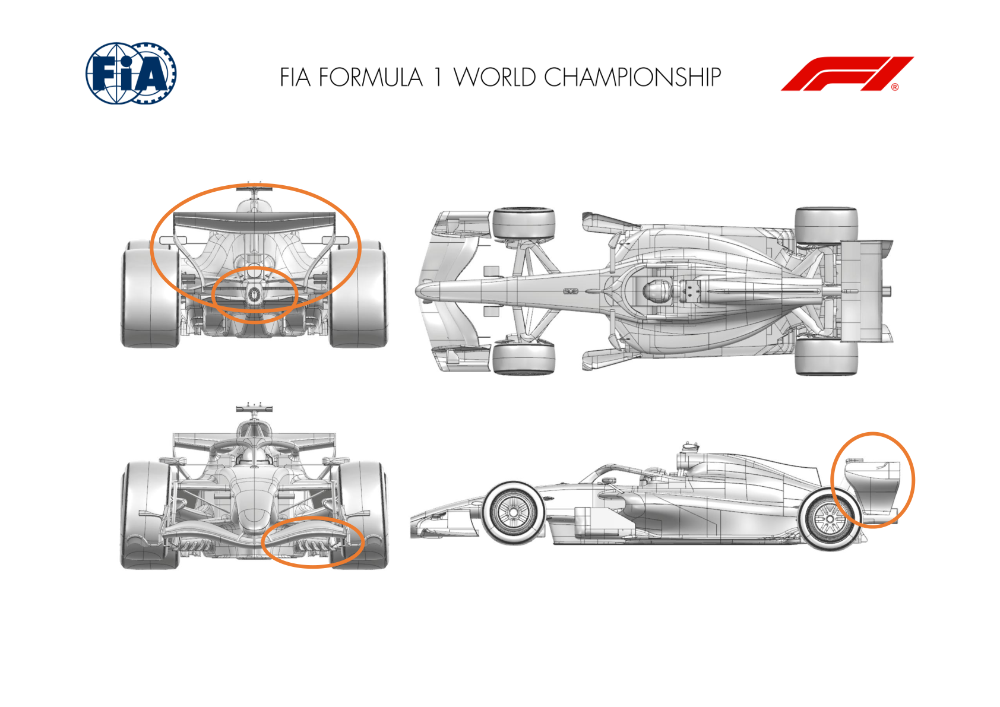
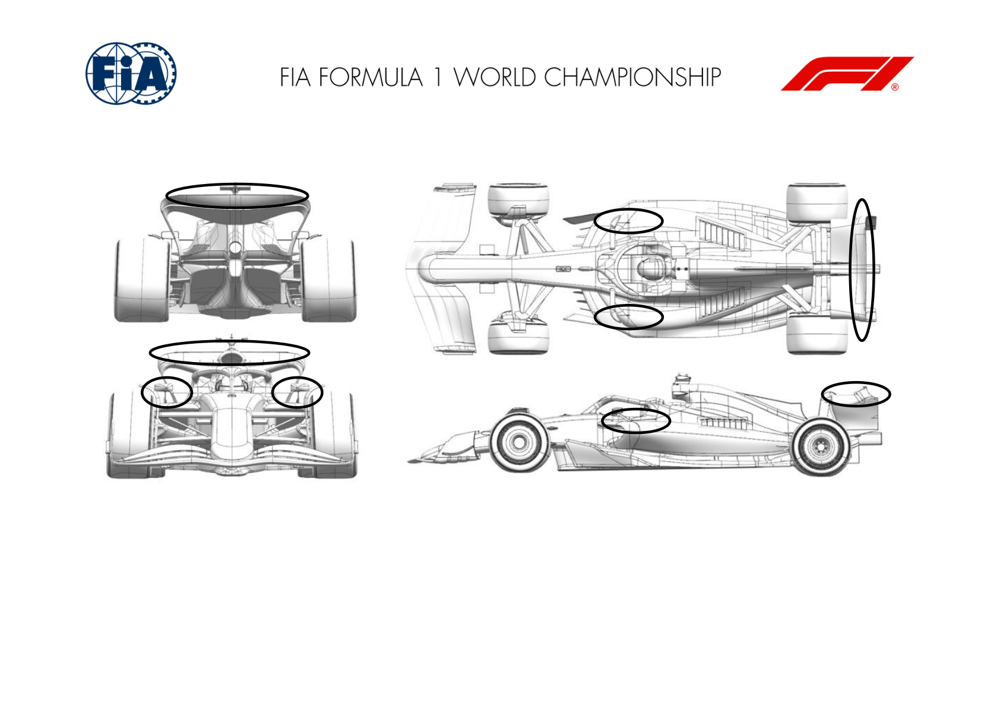
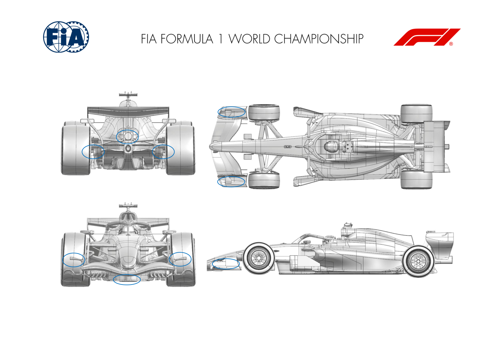
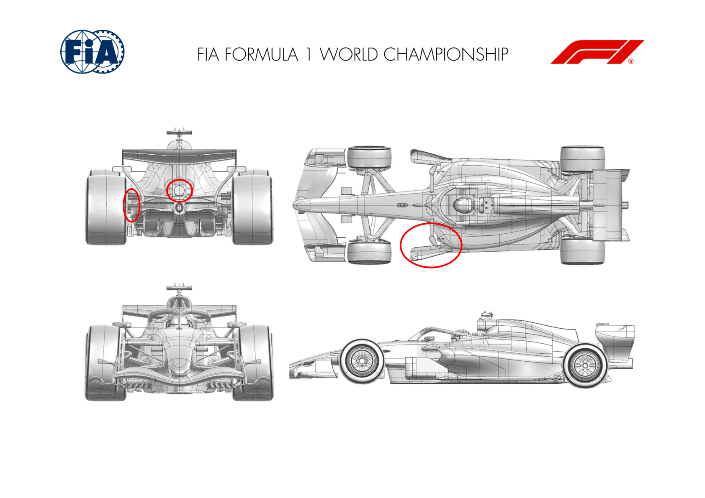
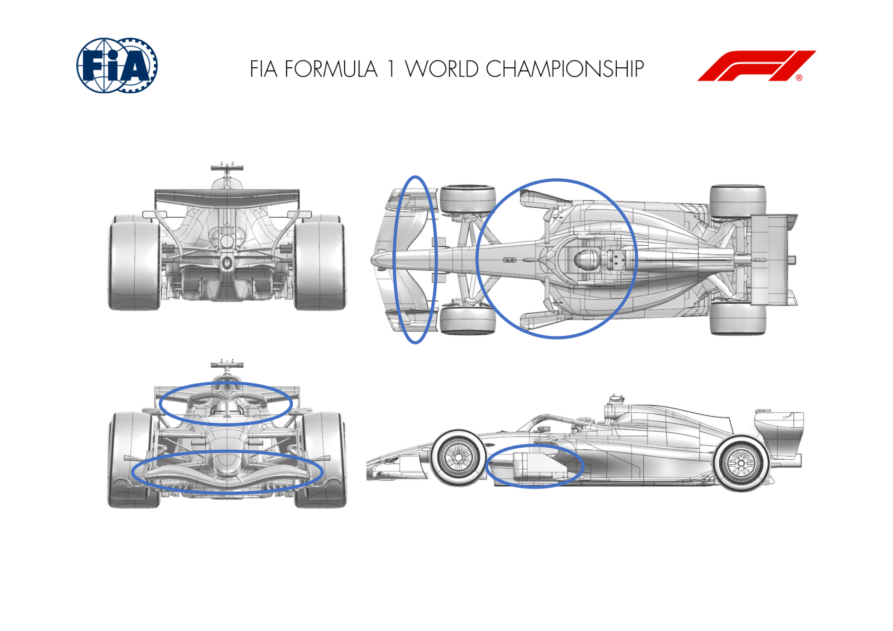
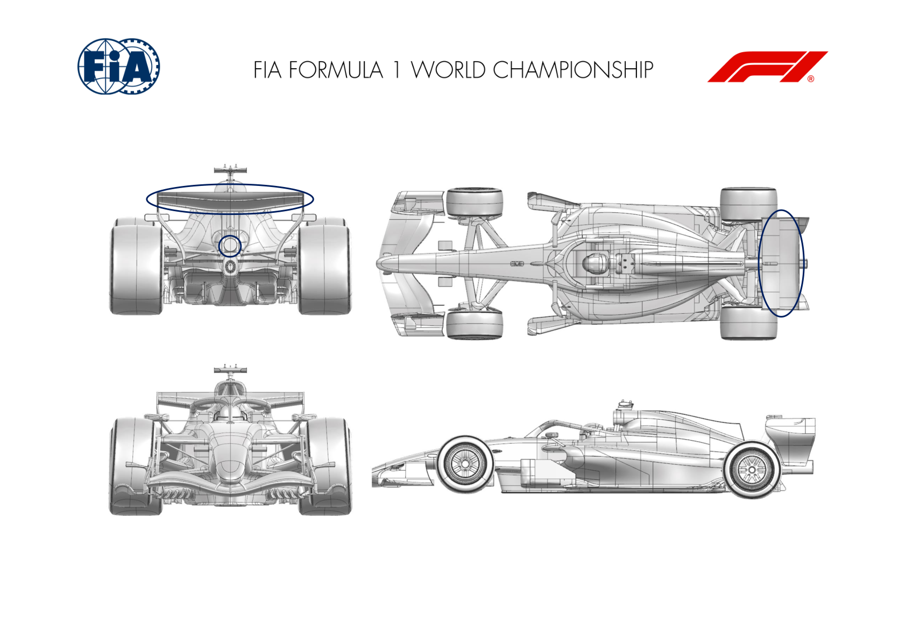
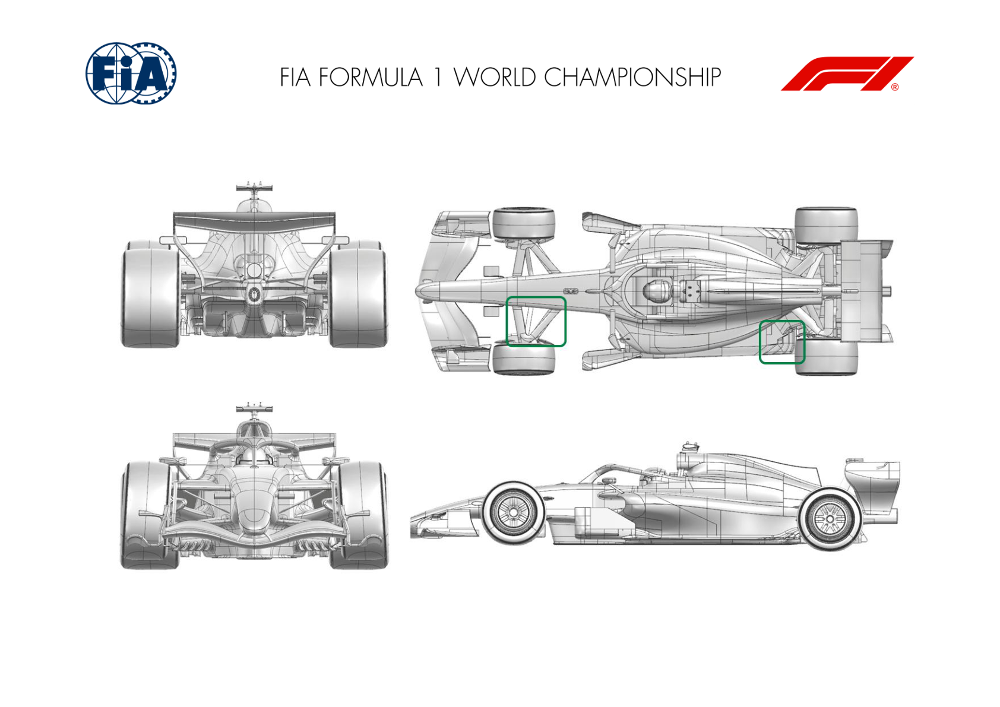
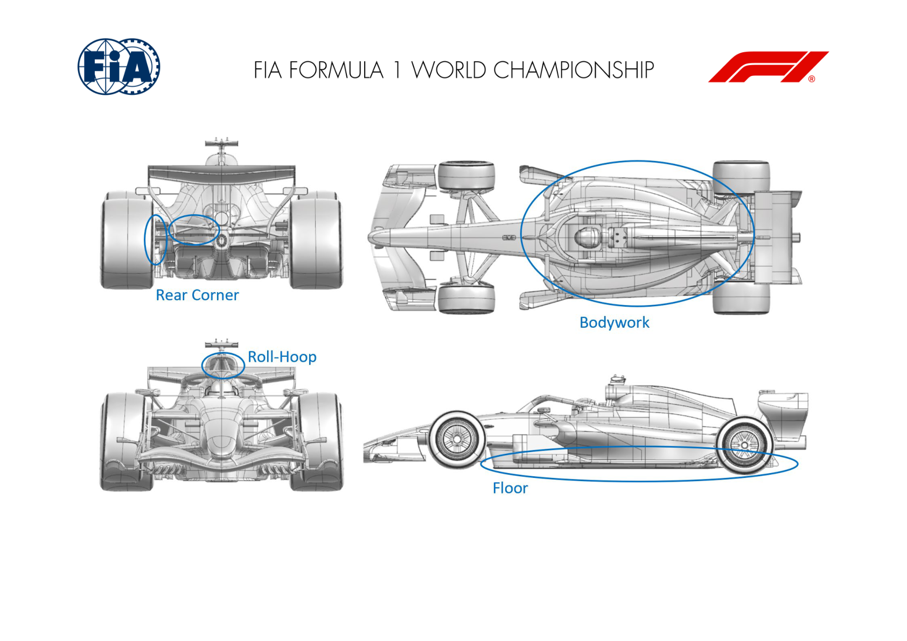
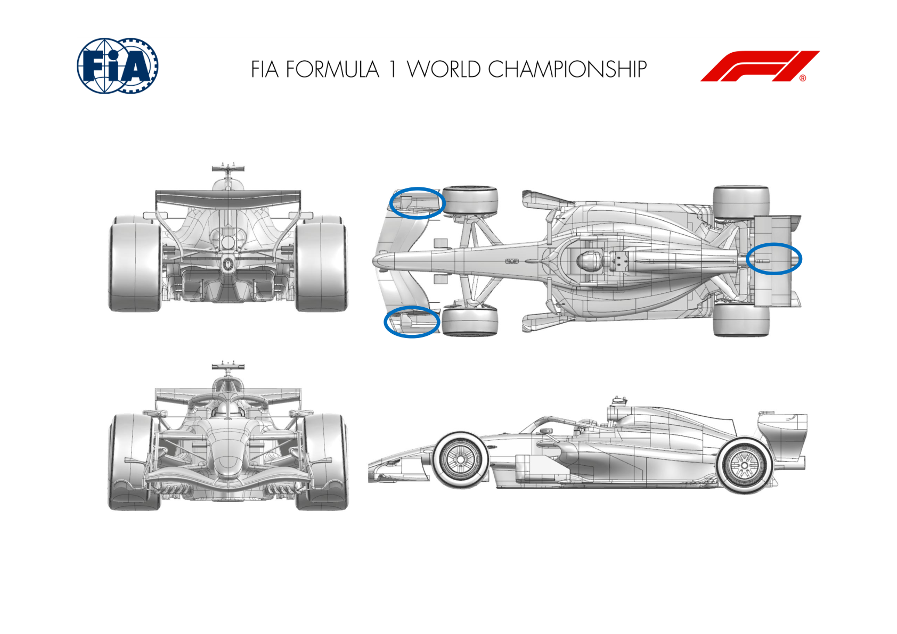
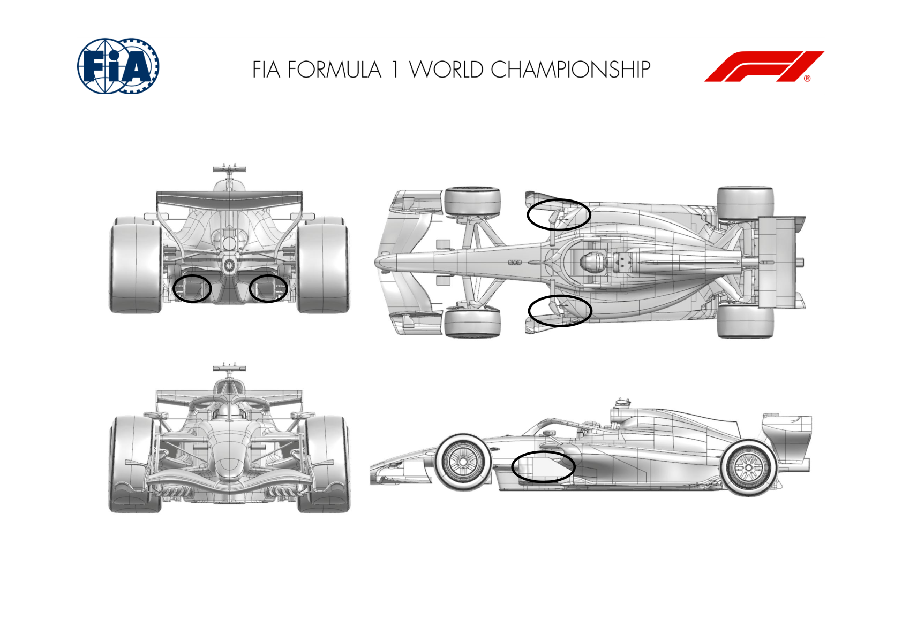

2026 ITALIAN GRAND PRIX

04 - 06 September 2026

From The FIA Formula 1 Media Delegate Document 10

To All Teams, All Officials Date 04 September 2026

Time 09:54

Title Car Presentation Submissions

Description Car Presentation Submissions

Enclosed 2026 Italian Grand Prix - Car Presentation Submissions.pdf

Roman De Lauw

The FIA Formula 1 Media Delegate

Car Presentation – Italian Grand Prix

McLaren Mastercard F1 Team

| No. | Updated component | Primary reason for update | Geometric differences | Description |
| --- | --- | --- | --- | --- |
| 1 | Rear Wing | Performance - Drag reduction | Alternative Straight Line Mode Flap Position and Beamwing | The high isochronal rear wing has been modified to deploy the flap to an alternative position in straight line mode in combination with a less loaded beam wing, resulting in a larger reduction in drag. |
| 2 | Floor Furniture | Performance - Flow Conditioning | Updated Floor Furniture | A small modification to the floor furniture, resulting in better flow conditioning and resultant improvement of aerodynamic performance of the floor as well as drag reduction. |

Car Presentation – 2026 Italian Grand Prix

Mercedes-AMG PETRONAS F1 Team

| No. | Updated component | Primary reason for update | Geometric differences | Description |
| --- | --- | --- | --- | --- |
| 1 | Rear Wing | Circuit specific - Drag Range | Various winglet devices removed from rear wing. | Removing the rear wing winglets reduces assembly camber shedding local downforce and drag at a ratio appropriate for Monza L/D. |
| 2 | Front Bodywork | Circuit specific - Drag Range | Mirror rear stays trimmed. The mirror stay trim reduces local camber and loading, shedding local downforce and drag at a ratio appropriate for Monza L/D. |  |

Car Presentation – Italian Grand Prix

Oracle Red Bull Racing.

| No. | Updated component | Primary reason for update | Geometric differences | Description |
| --- | --- | --- | --- | --- |
| 1 | Rear Corner | Reliability | Rear suspension to wheel bodywork gaitor revision | To improve reliability of the rear wheel bodywork assembly, the gaitor providing an aerodynamic seal has been changed to reduce the probability of splitting from the wishbone and now removed winglet junctions |
| 2 | Floor Body | Performance – Local Load | Revised bib edge profile | In seeking to validate an alternative geometry, the edge profile has been revised for evaluation in Monza. The new geometry will revise the flow to create more local load with improved aerodynamic stability. |
| 3 | Exhaust Tailpipe | Reliability | Revised tailpipe bracket | In order to operate the Power Unit reliably around the Monza circuit with its unique demands, the tailpipe bracket has been trimmed to offer less blockage. |
| 4 | Front Wing | Flow Conditioning | Revised endplate vane | A trimmed front wing end plate dive-plane is available for evaluation in Monza which aims to improve downstream load from the floor. |

Car Presentation – Italian Grand Prix

Scuderia Ferrari HP

| No. | Updated component | Primary reason for update | Geometric differences | Description |
| --- | --- | --- | --- | --- |
| 1 | Floor Board | Circuit specific - Drag Range | Front floor board elements optimisation, single vertical element Seen as a package, the primary aim of these modifications has been to adapt to Monza circuit peculiar characteristics and car aerodynamic efficiency requirements. All the steps have been targeting aerodynamic drag saving, coming along with downforce reduction as a natural consequence, but in a favourable ratio for this track. |  |
| 2 | Mirror Stay | Circuit specific - Drag Range | Shorter mirror vertical stay and connection to sidepod |  |
| 3 | Rear Corner | Circuit specific - Drag Range | Removal of rear brake duct winglet cascade |  |
| 4 | RV Tail | Circuit specific - Drag Range | Slotted central winglet element, trimmed side winglets |  |

Car Presentation – Italian Grand Prix

Williams

| No. | Updated component | Primary reason for update | Geometric differences | Description |
| --- | --- | --- | --- | --- |
| 1 | Halo | Circuit specific - Drag Range | A vertical fence has been introduced around the Halo geometry. | We have modified the local pressure distribution around the driver cockpit area. This results in a downstream flow field change which benefits efficiency levels specific to the Monza circuit. |
| 2 | Front Wing | Circuit specific - Balance Range | A reduction in chord of the FWF elements. | The rearward element on the FW assembly has been modified to suit the balance requirement of the Monza circuit. |
| 3 | Floor Body | Circuit specific - Drag Range | A local trim has been applied to the Floor Board geometry. | This is a further circuit specific change, altering the balance between downforce and drag at the front of the main floor. |

Car Presentation – Italian Grand Prix

Visa Cash App Racing Bulls

| No. | Updated component | Primary reason for update | Geometric differences | Description |
| --- | --- | --- | --- | --- |
| 1 | Rear Wing | Circuit Specific – Drag Range | New assembly with updated SM mechanism. | The rear wing changes facilitate increased flap travel in Straight Mode. This allows an efficient drag reduction which suits the nature of the circuit. |
| 2 | Exhaust Tailpipe | Performance – Flow Conditioning | Repositioned tailpipe with reprofiled bracket | The tailpipe updates improve the flow management around the centreline of the car, allowing the floor and rear wing to perform more efficiently. |

Car Presentation – Italian Grand Prix

Aston Martin Aramco F1 Team

| No. | Updated component | Primary reason for update | Geometric differences | Description |
| --- | --- | --- | --- | --- |
| 1 | Front Suspension | Performance - Local Load | Revised fairings for one of the front suspension members. | The external fairing for one of the front suspension members has been modified to improve alignment with the onset flow. |
| 2 | Floor Edge | Performance - Local Load | Update to the area of the floor in front of the rear tyre. | The geometry in front of the rear tyre has been modified to improve the airflow to the underside of the floor increasing load generated in this area. |

Car Presentation – Italian Grand Prix

*TGR HAAS F1 TEAM*

| No. | Updated component | Primary reason for update | Geometric differences | Description |
| --- | --- | --- | --- | --- |
| 1 | Floor | Performance - Local Load | New Front Floor - new side geometry and diffuser update | The floor update focuses on optimising the main expansion region and associated side geometry to improve airflow behaviour throughout the floor. The revised design increases floor efficiency, delivering a net gain in overall aerodynamic performance and downforce production. |
| 2 | Bodywork | Performance - Local Load | New Sidepod and coke-line. Narrower Roll-Hoop and updated engine cover | The revised bodywork has been developed in conjunction with the new floor design to maximise the aerodynamic benefit of the floor package. The around the car while providing the necessary cooling performance for all operating conditions. |
| 3 | Rear Corner | Performance - Local Load | Realigned rear suspension fairings and drum deflectors | The aerodynamic changes introduced by the new floor and bodywork package alter the flow structures reaching the rear corner region. To accommodate these changes and maximise the benefit of the update, the rear corner fairings have been re-optimised and the rear drum deflectors realigned, improving local flow management and overall aerodynamic efficiency. |

Car Presentation – Italian Grand Prix

Audi Revolut F1 Team

No updates submitted for this event.

Car Presentation – Italian Grand Prix

BWT Alpine F1 Team

| No. | Updated component | Primary reason for update | Geometric differences | Description |
| --- | --- | --- | --- | --- |
| 1 | Front Wing Endplate | Performance - Local Load | Revised footplate vane | As part of our front wing development program, the vane has been redesigned to increase the local load and improve local flowfield. |
| 2 | Rear wing | Performance - Drag Reduction | SM pod fairing removal | The SM pod on the launch rear wing has been adjusted to better suit the low drag nature of the Monza track. |

Car Presentation – Italian Grand Prix

Cadillac

| No. | Updated component | Primary reason for update | Geometric differences | Description |
| --- | --- | --- | --- | --- |
| 1 | Forward Floor Board Stay | Performance – Flow Conditioning | Updated stay position with higher outboard attachment point | Revised forward floor board stay geometry which improves flow conditioning to the rear of the car, improves overall aerodynamic load at the rear of the car |
| 2 | Diffuser Vane | Performance – Local Load | Addition of vane to inner trailing edge of outboard diffuser sidewall | A small vertical turning vane has been added to the inner trailing edge of the outboard diffuser sidewall, which improves aerodynamic performance in the outer floor channels and increases the load at the rear of the car |

