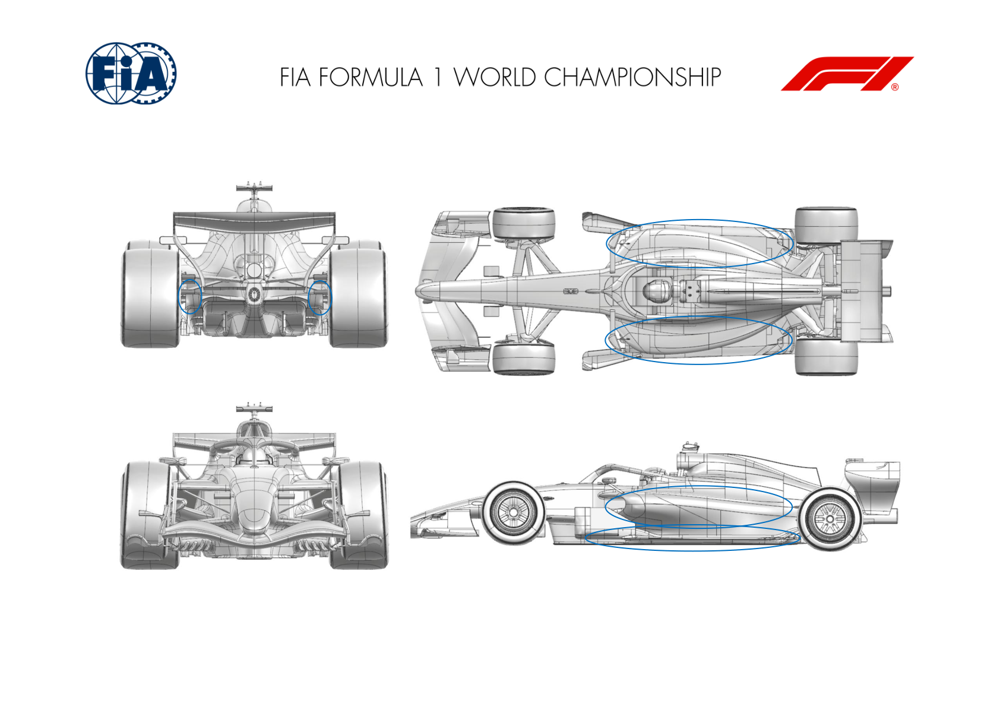
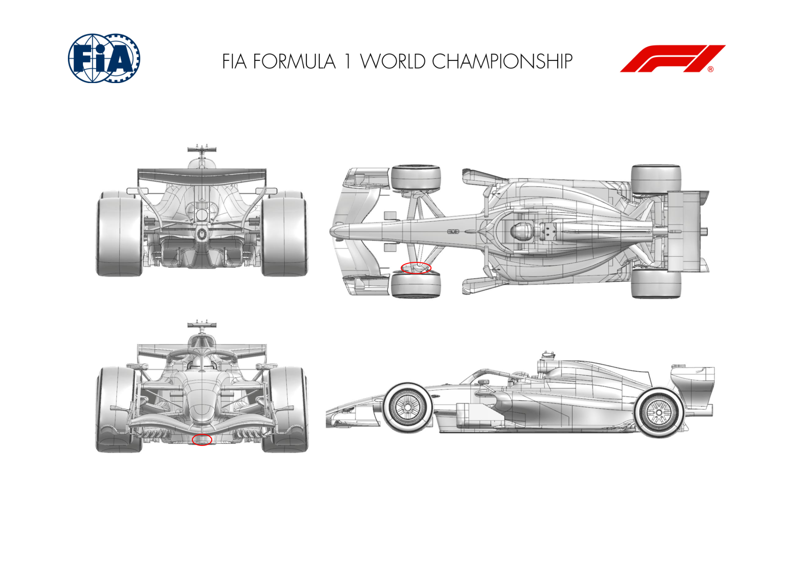
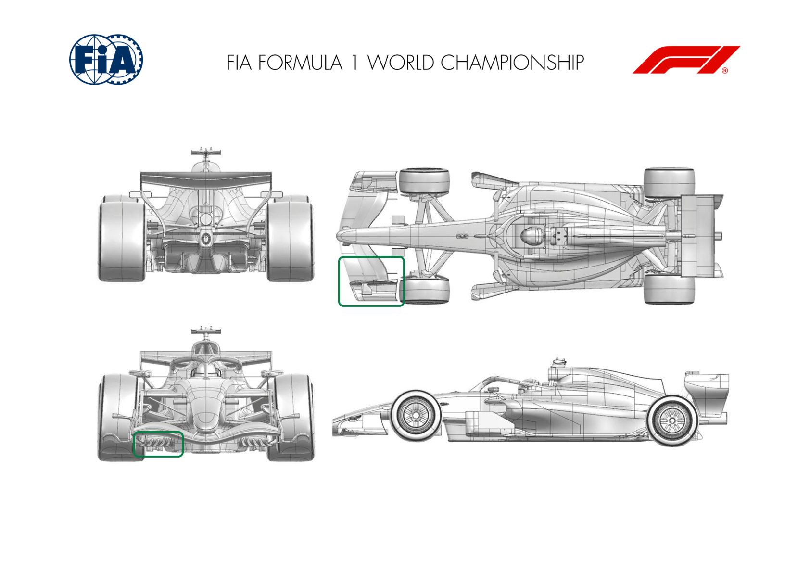
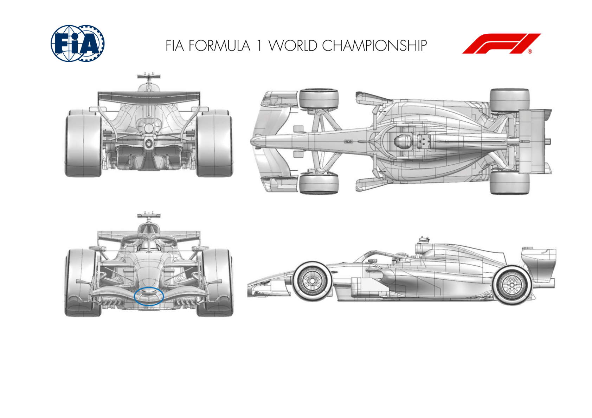
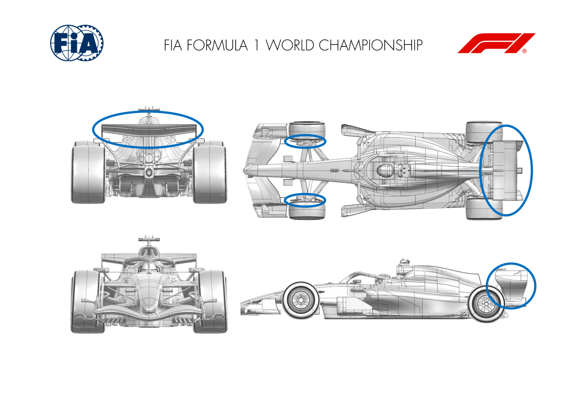
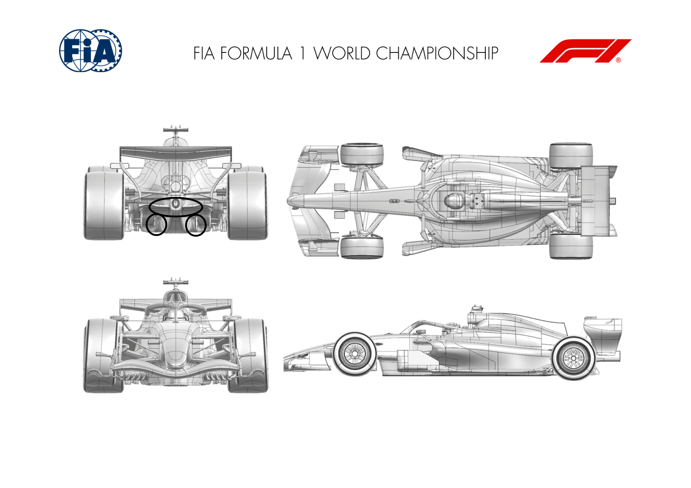

2026 JAPANESE GRAND PRIX

27 - 29 March 2026

From The FIA Formula One Media Delegate Document 11

To All Teams, All Officials Date 27 March 2026

Time 08:58

Title Car Presentation Submissions

Description Car Presentation Submissions

Enclosed 2026 Japanese Grand Prix - Car Presentation Submissions.pdf

Roman De Lauw

The FIA Formula One Media Delegate

Car Presentation – Japanese Grand Prix

McLaren Mastercard F1 Team

No updates submitted for this event.

Car Presentation – 2026 Japanese Grand Prix

Mercedes-AMG PETRONAS F1 Team

No updates submitted for this event.

Car Presentation – Japanese Grand Prix

Oracle Red Bull Racing.

| No. | Updated component | Primary reason for update | Geometric differences | Description |
| --- | --- | --- | --- | --- |
| 1 | Sidepod Inlet | Performance - Flow Conditioning | Revised inlet and therefore surrounding to meet chassis and floor. | To ingest higher pressure air to the sidepod inlet from upstream, the profile has been revised based upon simulation and initial running results yielding improved efficiency |
| 2 | Coke/Engine Cover | Performance - Flow Conditioning | Surfaces adapted to meet the new sidepod inlet geometry | As a consequence of the inlet changes, the sidepods have been revised to suit and offer an efficiency improvement for cooling and downstream surfaces. |
| 3 | Floor | Performance - Flow Conditioning | Upper surface revised to meet new sidepod | Consequential changes to meet new sidepod geometry and extending forward to the chassis, benefitting from the efficiency to offer more load. |
| 4 | Rear Corner | Circuit specific - Cooling Range | Revised inlet and exit geometries | Given the braking energy demands of Suzuka, minor changes have been made to the rear wheel bodywork to suit the brake material requirements. |

Car Presentation – Japanese Grand Prix

Scuderia Ferrari HP

| No. | Updated component | Primary reason for update | Geometric differences | Description |
| --- | --- | --- | --- | --- |
| 1 | Front Corner | Performance - Local Load | Reduced front brake duct inboard exit area | The Suzuka Circuit braking duty allows us to introduce a smaller front brake duct geometry, trading off brake cooling for external aerodynamic performance benefits |
| 2 | Floor Body | Performance - Local Load | Revised front floor stay fairing profile | Minor geometrical update and not specific to this event, the reprofiling of the front floor stay fairing improves local flow features and returns floor performance gains |

Car Presentation – Japanese Grand Prix

*ATLASSIAN WILLIAMS F1*

| No. | Updated component | Primary reason for update | Geometric differences | Description |
| --- | --- | --- | --- | --- |
| 1 | Front Suspension | Performance – Structural Improvement | Compared to the launch car, a revised set of suspension claddings are available to package efficiently around the updated suspension structures. | The incidence and profiles of the external claddings have been optimised to work effectively with the new internal suspension structures to ensure that the impact on the downstream flow field is mitigated. |

2 Atlassian Williams F1 Team © 2026. All Rights Reserved. Highly Confidential.

3 Atlassian Williams F1 Team © 2026. All Rights Reserved. Highly Confidential.

Car Presentation – Japanese Grand Prix

Visa Cash App Racing Bulls

No updates submitted for this event.

Car Presentation – Japanese Grand Prix

Aston Martin Aramco F1 Team

| No. | Updated component | Primary reason for update | Geometric differences | Description |
| --- | --- | --- | --- | --- |
| 1 | Front Wing | Performance - Local Load | The chord of the 3rd front wing profile is shorter in conjunction with a reduced length strake. | In conjunction with the front wing endplate change the modifications improve the load distribution at the outboard end of the wing. |
| 2 | Front Wing Endplate | Performance - Local Load | The edge of the outboard footplate is raised. | In conjunction with the front wing change the modifications improve the load distribution at the outboard end of the wing. |
| 3 | Floor Body | Performance - Local Load | The floor leading edge devices have been revised. | The new floor leading edge devices modify the spanwise generation of load across the width of the floor to improve performance. |

Car Presentation – JAPANESE Grand Prix

*TGR HAAS F1 TEAM*

| No. | Updated component | Primary reason for update | Geometric differences | Description |
| --- | --- | --- | --- | --- |
| 1 | Front Wing | Performance - Flow Conditioning | The FW SM actuation system was simplified allowing smaller exposed geometries | The FW SM linkage was simplified, enabling a reduced external envelope. The smaller linkages decrease blockage and consequently improve the airflow directed towards the rear of the car. |

Car Presentation – Japanese Grand Prix

Audi Revolut F1 Team

No updates submitted for this event.

Car Presentation – Japanese Grand Prix

BWT Alpine F1 Team

| No. | Updated component | Primary reason for update | Geometric differences | Description |
| --- | --- | --- | --- | --- |
| 1 | Front Corner | Performance - Flow Conditioning | Front deflector redesigned | The front deflector has been redesigned to improve the management of the local flowfield, ensuring a consistent delivery of performance throughout the entire operating range. |
| 2 | Rear Wing | Performance - Local Load | SM pod fairing and reprofiled elements | Local adjustments have been made to the rear wing to extract more performance out of it, both in Cornering and in Straight mode. |
| 3 | Rear Wing Endplate | Performance - Local Load | Re-designed of the lower part of the Rear Wing Endplate | The end plate has been redesigned to improve the flow conditioning at the rear of the car while also generating local load. |

Car Presentation – Japanese Grand Prix

Cadillac

| No. | Updated component | Primary reason for update | Geometric differences | Description |
| --- | --- | --- | --- | --- |
| 1 | Diffuser Fence | Performance - Local Load | Lower edge detail change on diffuser fence | The diffuser fence has been redesigned with a lower profile to enhance overall ride height behaviour and improve aerodynamic performance across the operating envelope. |
| 2 | Diffuser | Performance – Local Load | Updated central diffuser trailing edge profile | The trailing edge profile of the diffuser has been revised and optimized to enhance overall performance and increase overall rear aerodynamic load. |

