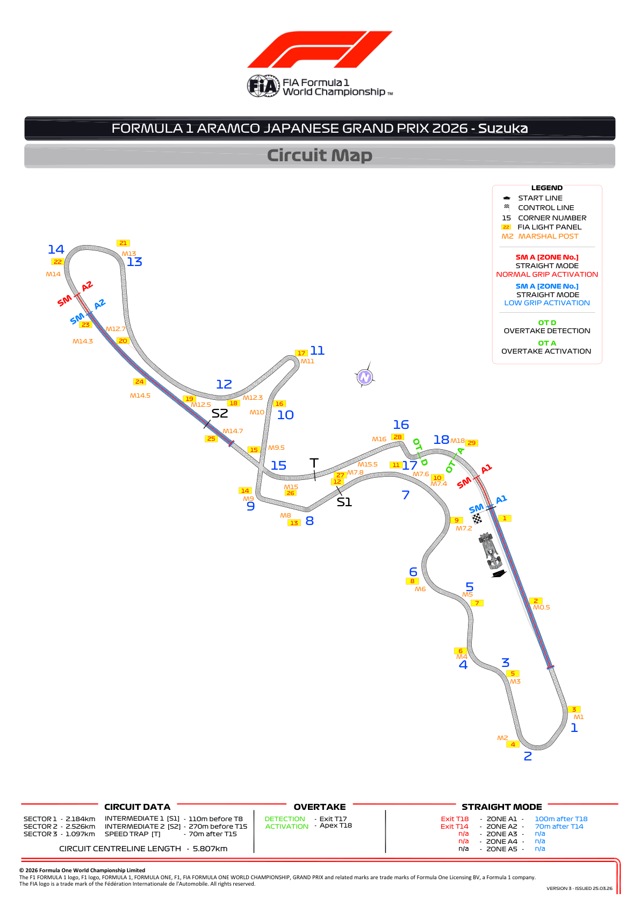
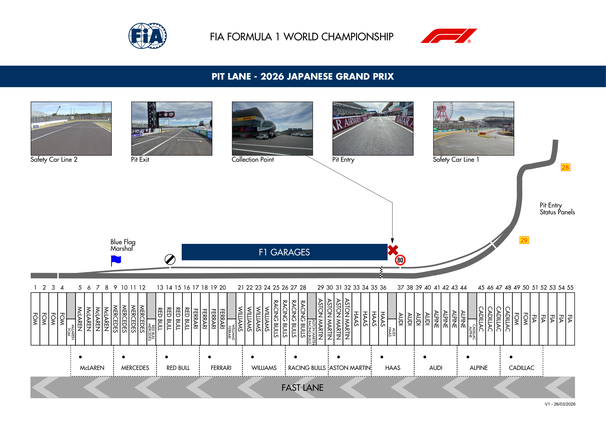
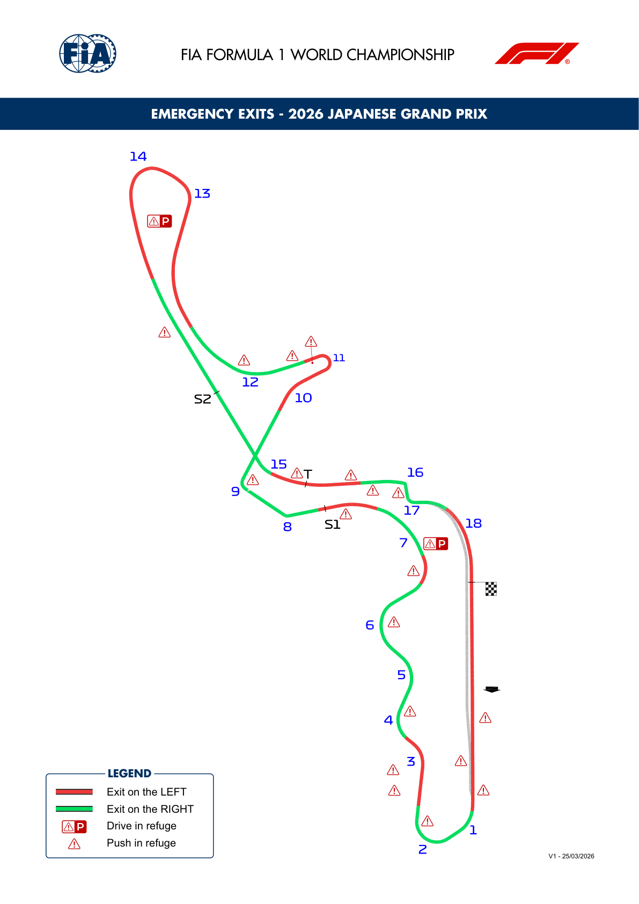
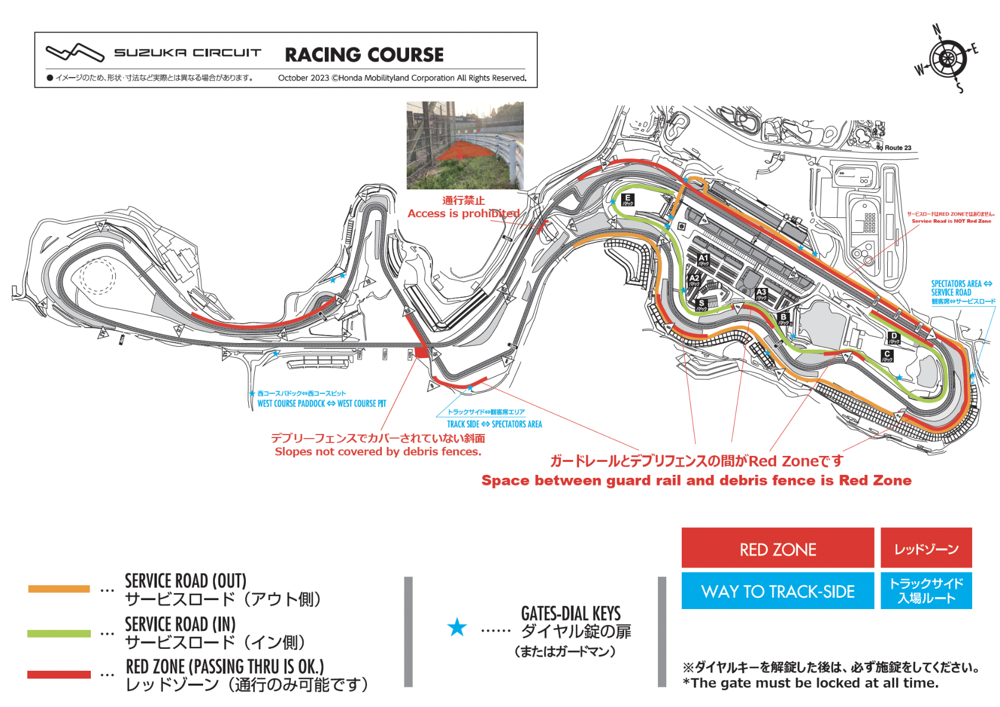
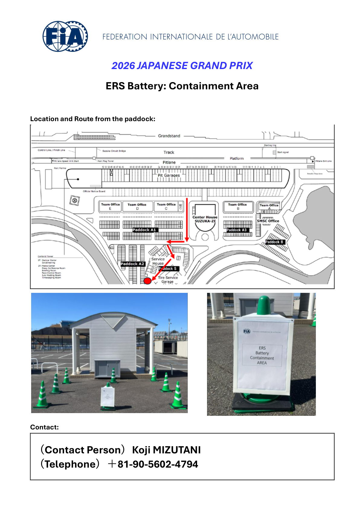

2026 JAPANESE GRAND PRIX

27 - 29 March 2026

From The FIA Formula One Race Director Document 6

To All Teams, All Officials Date 26 March 2026

Time 15:45

Title Competition Notes - Circuit Map, Pit Lane Drawing, Emergency Exits Map, Battery Containment Area and Red Zone

Description Competition Notes - Circuit Map, Pit Lane Drawing, Emergency Exits Map, Battery Containment Area and Red Zone

Enclosed 03JPN - Maps.pdf

Rui Marques

The FIA Formula One Race Director

