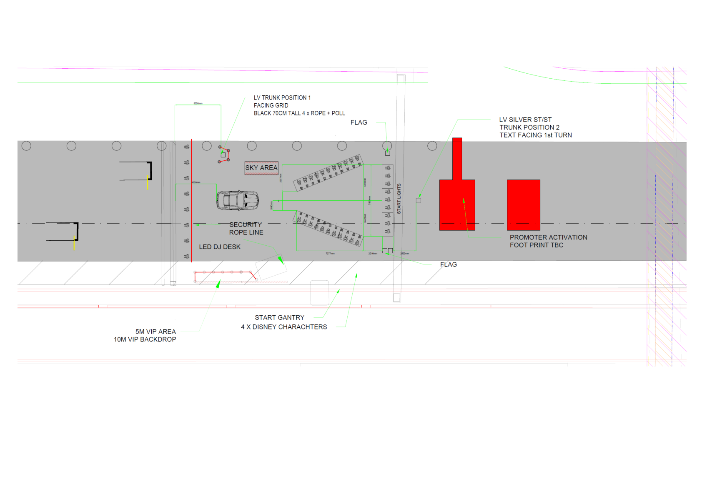

2026 JAPANESE GRAND PRIX

27 - 29 March 2026

From The FIA Formula One Media Delegate Document 52

To All Teams, All Officials Date 29 March 2026

Time 10:28

Title Pre-Race Procedure

Description Pre-Race Procedure

Enclosed 2026 Japanese Grand Prix - Pre-Race Procedure.pdf

Roman De Lauw

The FIA Formula One Media Delegate

2026 JAPANESE GRAND PRIX

27 – 29 March 2026

From The FIA Formula One Media Delegate

To All Officials, All Teams Date 29 March 2026

NOTE TO TEAMS: PRE-RACE PROCEDURE

Please find below a summary of the requirements for the Pre-Race activities and National

Anthem as set out in article B10.1.4.b of the FIA Formula 1 Sporting Regulations: “In any

case, no less than sixteen (16) minutes before the scheduled start of the formation lap all

drivers must be present at the front of the grid for the playing of the national anthem.”

13:40:00 Drivers move to National Anthem Position. Drivers will be expected to be in

position no later than 13:42:00.

13:44:00 The National Anthem. For the duration of the National Anthem all Drivers must

remain attired only in their race suits.

Failure to comply with these procedures will be reported to the Stewards.

Please see the attached National Anthem Diagram.

Roman De Lauw

The FIA Formula 1 Media Delegate

