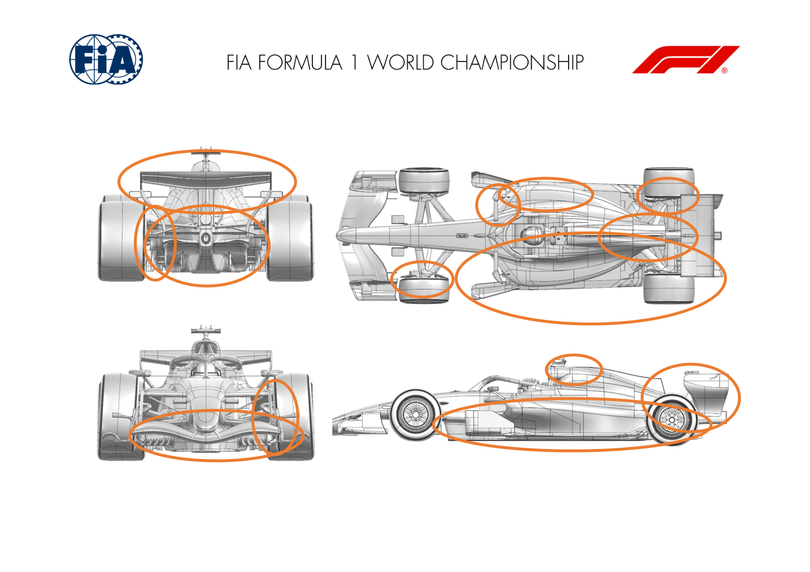
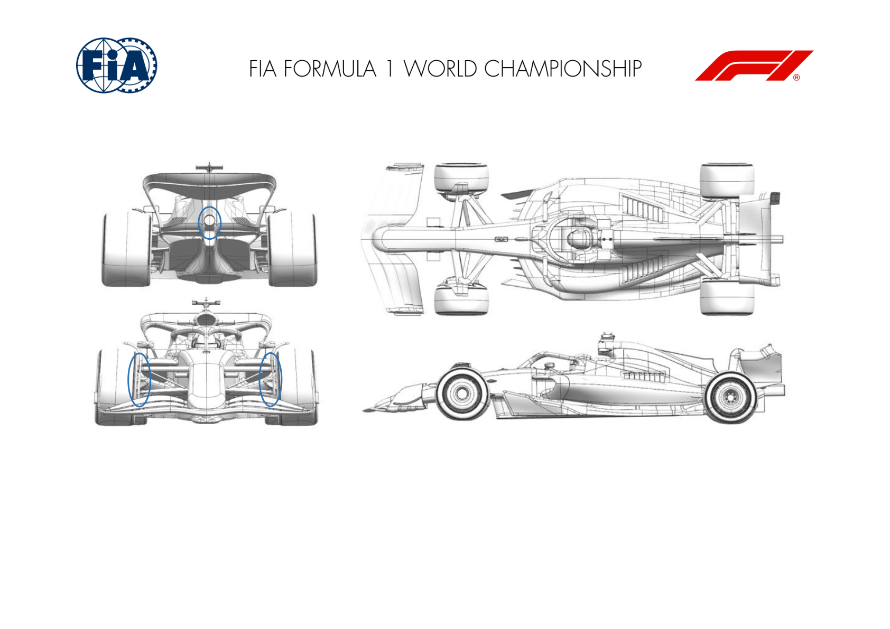
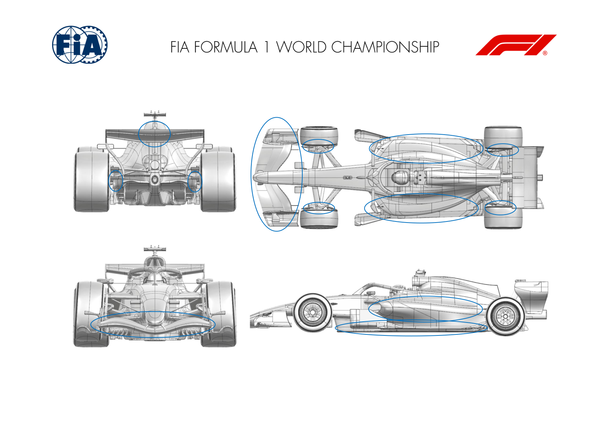
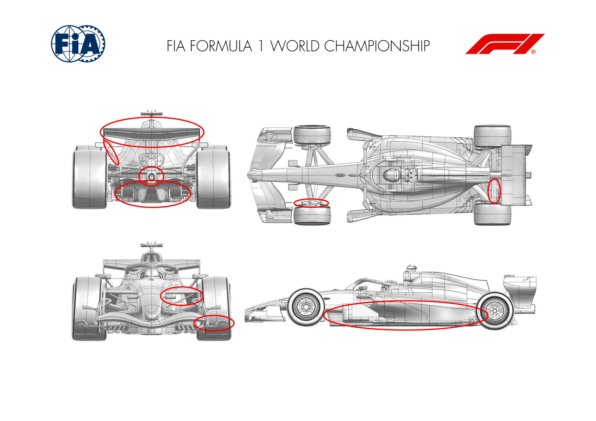
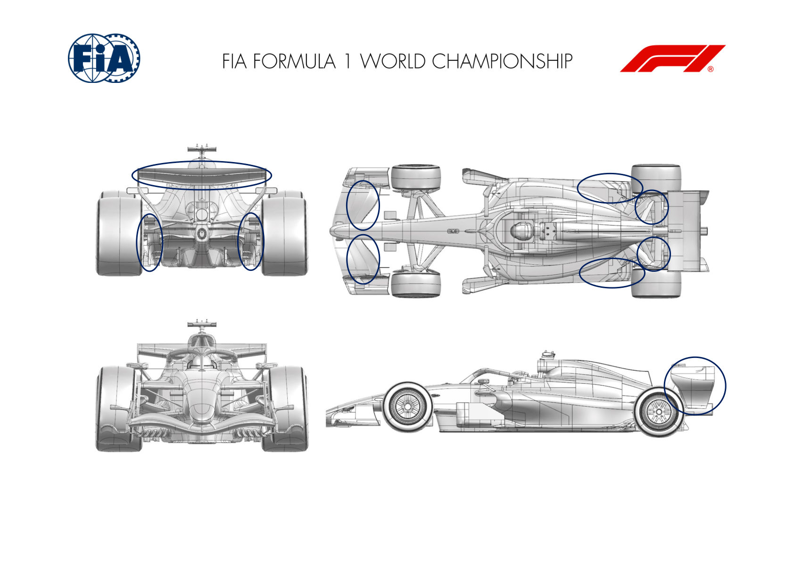
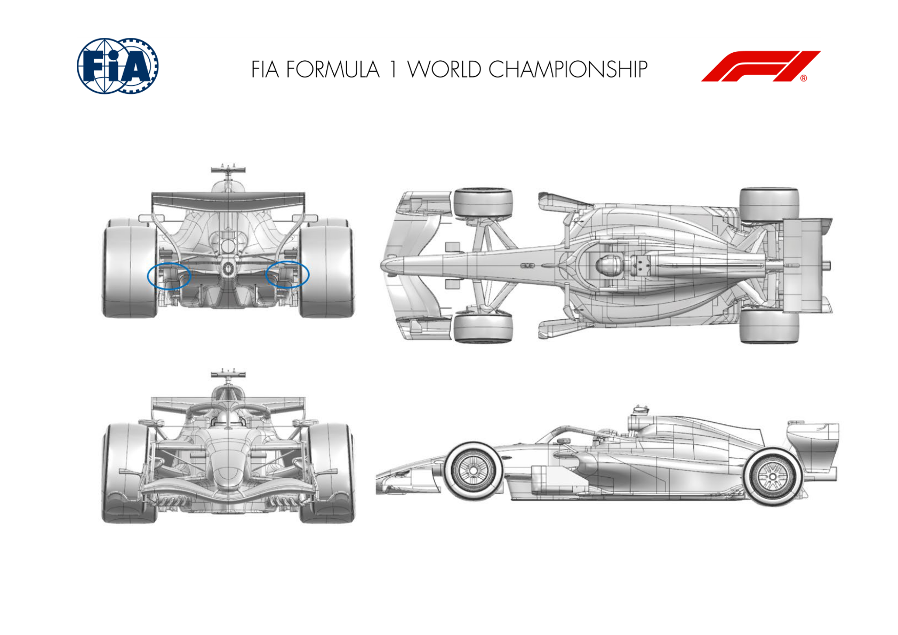
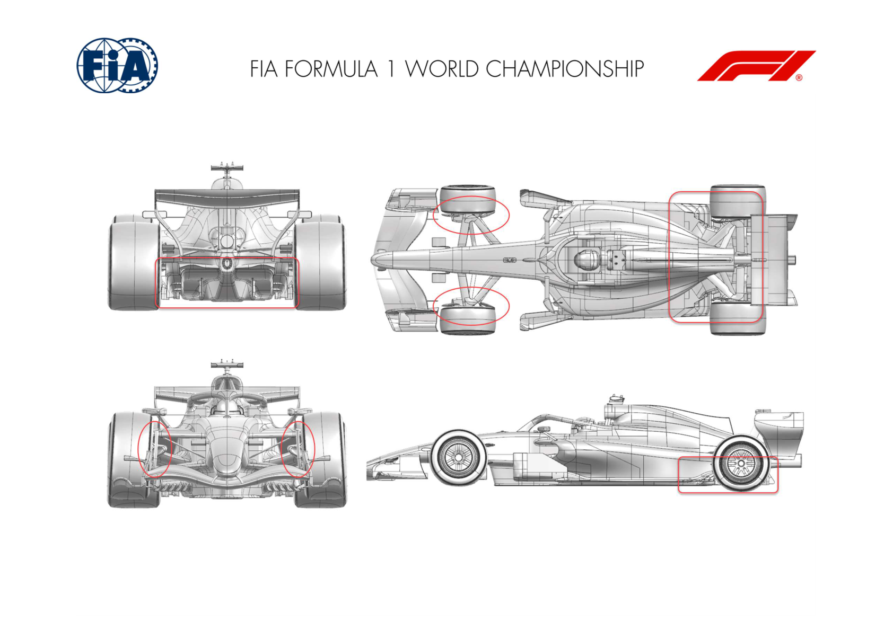
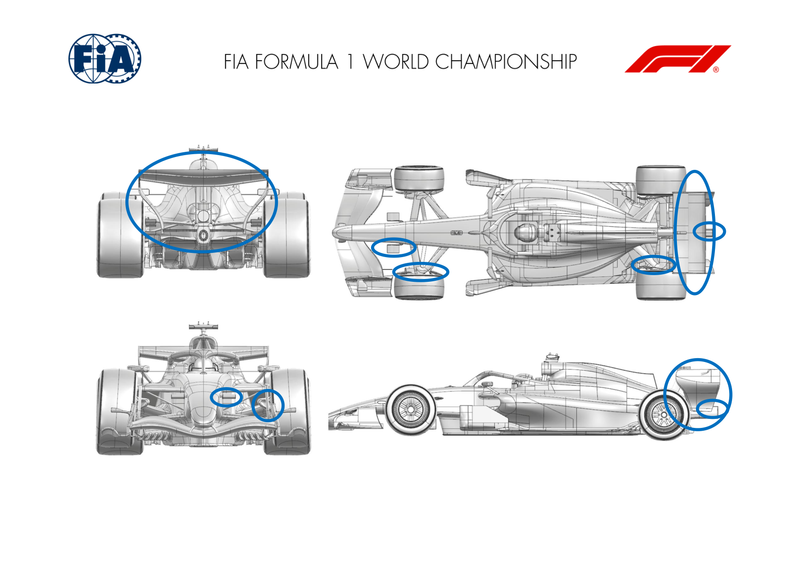
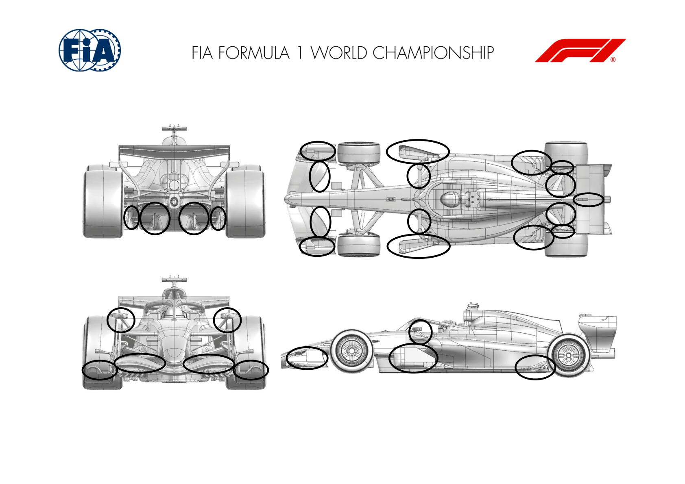

2026 MIAMI GRAND PRIX

01 - 03 May 2026

From The FIA Formula 1 Media Delegate Document 8

To All Teams, All Officials Date 01 May 2026

Time 09:31

Title Car Presentation Submissions

Description Car Presentation Submissions

Enclosed 2026 Miami Grand Prix - Car Presentation Submissions.pdf

Roman De Lauw

The FIA Formula 1 Media Delegate

Car Presentation – Miami Grand Prix

McLaren Mastercard F1 Team

| No. | Updated component | Primary reason for update | Geometric differences | Description |
| --- | --- | --- | --- | --- |
| 1 | Front Corner | Performance - Flow Conditioning | Revised Front Corner Furniture | The Front Corner Furniture has been revised to improve interaction with the Front Wing resulting in better flow conditioning overall. |
| 2 | Coke/Engine Cover | Performance - Flow Conditioning | Modified Bodywork Furniture | Furniture around the Central Bodywork has been added resulting both in an improvement in flow conditioning as well as local load gain, increasing overall aerodynamic efficiency. |
| 3 | Sidepod Inlet | Performance - Flow Conditioning | Revised Sidepod Inlet | The Sidepod Inlet along with the Mirror has been revised for an improvement in flow conditioning in interaction with the new floor geometry. |
| 4 | Cooling Louvres | Circuit specific - Cooling Range | Sidepod Louvre | To cope with the high cooling demands of this event, a sidepod louvre option is available, increasing overall cooling capacity if required. |
| 5 | Floor Body | Performance - Local Load | New Floor and Board geometry | A completely new floor and Board geometry, working in conjunction with the aforementioned geometrical changes, resulting in an increase in aerodynamic load and efficiency across all conditions. |
| 6 | Rear Corner | Performance - Flow Conditioning | Revised Rear Corner Furniture | The Rear Corner furniture has been revised for improved interaction with the new floor geometry, resulting in better flow conditioning. |
| 7 | Rear Wing | Performance - Local Load | New Rear Wing | A new Rear Wing geometry featuring new elements as well as a revised Endplate geometry, resulting in an overall gain in aerodynamic load and efficiency. |

Car Presentation – 2026 Miami Grand Prix

*Mercedes-AMG PETRONAS F1 Team*

| No. | Updated component | Primary reason for update | Geometric differences | Description |
| --- | --- | --- | --- | --- |
| 1 | Tailpipe | Performance - Drag reduction | Tailpipe reposition with new slotted bracket | The tailpipe has been rotated tail down (away from the upper wing) and slotted bracket added, to improve the local drag and downforce response. |
| 2 | Front Corner | Performance – Flow Conditioning | Increased front drum lip chord | Increased front drum lip chord, reduces local losses and improves flow to the rear of the car increasing rear downforce. |

Car Presentation – USA Miami Grand Prix

Oracle Red Bull Racing.

| No. | Updated component | Primary reason for update | Geometric differences | Description |
| --- | --- | --- | --- | --- |
| 1 | Front Wing | Performance - Local Load | Revised element and endplate geometries. | A further step of optimisation to all three elements and the endplate now including the permitted diveplane. Offering more load with the same or improved flow stability. |
| 2 | Front Corner | Reliability | Revised front wheel bodywork inboard surfaces. | To gain further efficiency the intake and exit ducts have been revised to draw inlet air from the highest pressure source available and exit with minimal blockage. |
| 3 | Sidepod Inlet | Performance - Flow Conditioning | To encompass the revied floor bib, the sidepod inlet and mirror support geometries have been revised | Keeping the sidepod inlet ingesting the highest pressure air, the intake and surrounding surfaces have changed to accommodate the new Floor and Engine Cover, extracting more load whilst maintaining flow stability downstream |
| 4 | Coke/Engine Cover | Performance - Flow Conditioning | Surfaces adapted to meet the new sidepod inlet geometry | In combination with floor, including the coke split line, a new topbody has been derived offering revised cooling exits and flow stability downstream. |
| 5 | Floor | Performance - Flow Conditioning | Revised bib surfaces to the sidepod and coke line change | The revised bib geometry accommodates changes to the forward floor structure, then blends with the sidepod to then meet the engine cover. Extracting more load whilst maintaining the downstream flow stability. |
| 6 | Rear Corner | Performance - Local Load | Revised wheel bodywork inboard geometry and suspension farings | The inboard rear suspension shrouds have been blended to the new engine cover and quarter panels to maintain efficiency. Rear wheel bodywork has subtle geometric revisions to incorporate |

further optimisation of both brake cooling and local

flow for more load.

| No. | Updated component | Primary reason for update | Geometric differences | Description |
| --- | --- | --- | --- | --- |
| 7 | Rear wing | Performance - Local Load | Revised wing attachments for the mechanism to deploy rear wing Straight mode mechanism | To allow more travel, the mechanism and attachments to the elements has been revised necessitating a subtle altering of the third profile near centreline. |

Car Presentation – Miami Grand Prix

Scuderia Ferrari HP

| No. | Updated component | Primary reason for update | Geometric differences | Description |
| --- | --- | --- | --- | --- |
| 1 | Front Wing Endplate | Performance - Local Load | Revised footplate outboard channel, addition of top forward vane Front wing endplate and front corner updates are working hand-in-hand, focusing on flow feature stability and front wheel wake management throughout the entire car operating envelope |  |
| 2 | Front Corner | Performance - Flow Conditioning | Detailed development of front deflector upper and lower edges, addition of rear deflector lip |  |
| 3 | Front Suspension | Performance - Flow Conditioning | Reprofiling of front suspension leg fairings | Various steps have been done on load distribution across legs and span of the different front suspension elements, leading to load gains whilst still managing properly downstream impacts |
| 4 | Floor Body | Performance - Local Load | Front central keel volume optimisation, additional front floor board vertical elements and revised board stays. Reprofiled front floor leading edge and leading edge devices | Benefiting from enhanced upstream flow conditions, the front floor geometry and devices have been reoptimized, returning a net load advantage |
| 5 | Floor Edge | Performance - Local Load | Main floor outboard trailing edge scoops extended further inboard Working together with the front floor update, the rear part of the floor and diffuser have been developed focusing on load increase across the full operating window. In addition, the rear trackrod fairing update together with the rear tail devices provides a favourable pressure gradient for the diffuser, in an efficient manner |  |
| 6 | Diffuser | Performance - Local Load | Central boat and diffuser expansion reprofiling, diffuser fence shedding edge detailing, trailing edge vertical flap addition and inboard lip detail |  |
| 7 | Rear Suspension | Performance - Local Load | Rear trackrod fairing reprofiling |  |

| No. | Updated component | Primary reason for update | Geometric differences | Description |
| --- | --- | --- | --- | --- |
| 8 | Beam Wing | Performance - Flow Conditioning | Updated inboard connection | See above |
| 9 | Rear tail | Performance - Local Load | Revised tail devices and profiles |  |
| 10 | Rear Wing | Performance - Drag reduction | Mainplane and flap detail reprofiling, addition of central bracket flap, reworked pylon/mainplane junction | This iteration of rear wing development has been focused on increasing load in cornering mode in a robust way, whilst maximizing aerodynamic drag shedding in straight mode |
| 11 | Rear Wing Endplate | Performance - Flow Conditioning | Addition of upwashing volumes, upper endplate detailing |  |

Car Presentation – Miami Grand Prix

*ATLASSIAN WILLIAMS F1*

| No. | Updated component | Primary reason for update | Geometric differences | Description |
| --- | --- | --- | --- | --- |
| 1 | Floor | Performance – General floor aerodynamic performance | The floor has refined contours, local thickness changes, and updated edge and interface details in the forward, mid and edge regions to suit the new layout. | Improves floor airflow across conditions. Refined surfaces reduce sensitivity to setup, providing more repeatable aerodynamic load over a wider operating window. |
| 2 | Sidepod | Performance – Cooling capability & mid-body flow | The inlet lips, internal transitions and outer surfaces are reshaped with revised radii and fillets to match the new packaging. | Extends usable cooling range while cleaning mid-body flow. Reshaped inlet lips, internal transitions and outer surfaces improve local flow quality and maintain cooling margin across ambient and track conditions. |
| 3 | Bodywork – engine cover / coke / cooling exits | Performance – Rear flow delivery & cooling integration | The engine cover, coke region and rear/upper cooling exits have revised surfaces, local fairings and openings to suit updated internal routing. | Improves rear flow delivery while satisfying heat-rejection needs. Updated cover, coke and exit geometry improves extraction and reduces disruption, giving more consistent rear flow versus cooling demand. |
| 4 | Mirror assembly | Performance – Local flow conditioning | The mirror bodies, fillets and cut-backs are reshaped and repositioned to match the new hardpoints. | Provides local flow conditioning around the cockpit. Mirror reshape and reposition guide flow down the cockpit side, improving conditions for downstream bodywork. |
| 5 | Tailpipe bracket | Performance – Rear flow | A new profiled bracket is added behind the tailpipe within the allowed volume, shaped to the new layout. | Improves tail-region integration. Profiled bracket manages wake behind the tailpipe, reducing local separation and supporting more stable rear-end flow behaviour across conditions. |
| 6 | RIS fairings | Performance – Rear flow & integration | Fairings around the rear impact structure are revised with new local profiles, junctions and trailing-edge positions to suit surrounding hardware. | Cleans flow around the rear impact structure. Revised fairings, junctions and trailing edges improve integration with local hardware, reducing losses and stabilising the rear flow field. |
| 7 | Rear brace wing | Performance – Rear flow & integration | Local profiles and junction details around the brace interfaces are updated, with new cut-lines and trailing-edge positions aligned to the new packaging. | Updated rear wing brace fairings and cut-lines improve flow interaction with nearby elements, providing cleaner handover and more consistent rear airflow behaviour across conditions. |

2 Atlassian Williams F1 Team © 2026. All Rights Reserved. Highly Confidential.

3 Atlassian Williams F1 Team © 2026. All Rights Reserved. Highly Confidential.

Car Presentation – Miami Grand Prix

Visa Cash App Racing Bulls

| No. | Updated component | Primary reason for update | Geometric differences | Description |
| --- | --- | --- | --- | --- |
| 1 | Rear Corner | Performance – Flow Conditioning | Profile modification to brake duct furniture. | The winglet geometry changes help improve the flow management at the back of the car and around the rear tyre. |
| 2 | Rear Suspension | Performance – Flow Conditioning | Aero profile geometry changes to suit the rear corner update. | The profile changes on the suspension legs work together with the changes made to the brake duct winglets, to manage flow around the tyre. |
| 3 | Floor Edge | Performance – Flow Conditioning | Revised slot geometry around the rearward floor edge. | The updated floor geometry helps provide cleaner flow around the tyre contact patch, which leads to an overall increase in floor performance. |
| 4 | Rear Wing | Performance – Local Load | New mainplane & flap aerofoil profiles | Downforce generated by the rear wing is increased through camber & incidence changes, at an efficient level for the circuit. |
| 5 | Rear Wing Endplate | Performance – Flow Conditioning | Camber distribution changes across endplate. | This endplate works in conjunction with the changes to the rear wing to enhance the airflow between them, allowing the rear wing work effectively. |
| 6 | Front Wing | Circuit specific - Balance Range | Additional option of flap profile available. | To effectively cover the balance requirements for Miami, a shorter chord flap allows a lower aero balance range to be run. |

Car Presentation – Miami Grand Prix

Aston Martin Aramco F1 Team

No updates submitted for this event.

Car Presentation – Miami Grand Prix

*TGR HAAS F1 TEAM*

| No. | Updated component | Primary reason for update | Geometric differences | Description |
| --- | --- | --- | --- | --- |
| 1 | Diffuser | Performance - Local Load | Device added on Floor Winglet | The additional device on the Floor Winglet results in an increase in local aerodynamic downforce by modifying the pressure distribution and flow behaviour around the element. |

Car Presentation – Miami Grand Prix

Audi Revolut F1 Team

| No. | Updated component | Primary reason for update | Geometric differences | Description |
| --- | --- | --- | --- | --- |
| 1 | Front Suspension | Performance – Flow Conditions | New front brake duct and suspension legs covers | A revised brake duct and suspension at the front of the car to improve flow conditions and subsequent overall performance. |
| 2 | Floor Edge and Diffuser | Performance – Local Load | New floor edge and diffuser shape including the diffuser winglet | The rear floor edge and diffuser were developed to provide an increase of efficient aero load at the rear car. |

Car Presentation – Miami Grand Prix

BWT Alpine F1 Team

| No. | Updated component | Primary reason for update | Geometric differences | Description |
| --- | --- | --- | --- | --- |
| 1 | Front Corner | Performance - Flow Conditioning | Revised front drum exit | The front drum exit duct has been redesigned to improve the flow quality around the front corner and further downstream. |
| 2 | Nose camera | Performance - Flow Conditioning | Adjustments to the camera mounts | The nose camera mount has been reprofiled with the objective of improving local flow management and delivering higher quality flow downstream. |
| 3 | Rear suspension | Performance - Flow Conditioning | Suspension legs reprofiled | The suspension legs have been refined to better control the flowfield around the rear suspension and improve global flow quality. |
| 4 | Rear impact structure | Performance - Local Load | Addition of an element | The new developed geometry is aimed at increasing aerodynamic load locally and efficiently throughout the operating range of the car. |
| 5 | Rear wing | Performance - Local Load | Compete new rear wing assembly | As part of our in-season development, a complete new rear wing is introduced in Miami to improve overall aerodynamic performance. |
| 6 | Rear Wing Endplate | Performance - Local Load | Reprofiled endplate | The rear wing endplate was redesigned to integrate effectively with the rear wing changes, improving aerodynamic interaction and overall performance. |

Car Presentation – Miami Grand Prix

Cadillac

| No. | Updated component | Primary reason for update | Geometric differences | Description |
| --- | --- | --- | --- | --- |
| 1 | Front Wing Endplate | Performance – Flow Conditioning | Updated End Plate Body and reprofiled Footplate geometry | Enhanced flow conditioning to the rear of the car to reduce overall sensitivity to ride height changes and improve rear load |
| 2 | Front Wing Flap | Performance – Flow Conditioning | Updated Front Wing Flap profiles | Revised Front Wing Flap profiles to reduce aerodynamic losses while also enhancing the consistency and quality of airflow directed toward the rear of the car |
| 3 | Mirror Stay | Performance – Flow Conditioning | Movement and profile change of stay | Improves the onset flow and therefore aerodynamic load at the rear of the car, whilst the reprofiled leading edge also increases structural integrity |
| 4 | Forward Floorboard | Performance – Local Load | Reprofiled forward board with updated top edge and winglet details | Forward floor changes increase aerodynamic load at the rear of the floor and diffuser with improved ride height characteristics and sensitivities |
| 5 | Floor Body | Performance – Local Load | Local changes to floor rear corner and addition of top surface strake | Local surface and feature changes in the rear floor region ahead of the rear tyre to increase local floor loading and therefore overall aerodynamic load at the rear of the car |
| 6 | Diffuser | Performance – Local Load | Cascade winglet trailing edge detail changes, reprofiled fences and updated Diffuser shoulder geometry | Updated Diffuser geometry to increase rear floor load and consequently overall aerodynamic load at the rear of the car, whilst improving sensitivity to ride heights |
| 7 | Rear Suspension | Performance – Flow Conditioning | Reprofiled Rear Suspension fairings | Updated rear suspension to improve local flow quality, increase aerodynamic stability and consequently increase potential for further rear car development |

| No. | Updated component | Primary reason for update | Geometric differences | Description |
| --- | --- | --- | --- | --- |
| 8 | Rear Corner | Performance – Local Load | Updated Deflector and Stay, reprofiled Lip and Rear Vanes | Local surface changes including updated PDC geometry to increase local load whilst also improving flow quality for increased aerodynamic stability |
| 9 | Exhaust Tailpipe Bracket | Performance – Local Load | Updated and repositioned Exhaust Tailpipe Bracket | Revised Exhaust Tailpipe Bracket geometry to generate local aerodynamic load and consequently improve the characteristics of load at the rear of the car |

