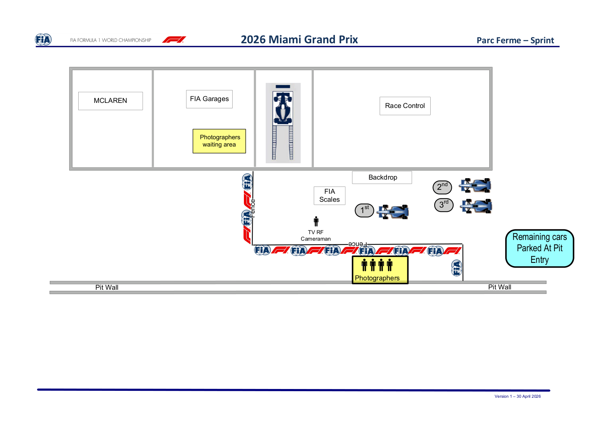

2026 MIAMI GRAND PRIX

01 - 03 May 2026

From The FIA Formula 1 Media Delegate Document 37

To All Teams, All Officials Date 02 May 2026

Time 09:18

Title Post-Sprint Procedure

Description Post-Sprint Procedure

Enclosed 2026 Miami Grand Prix - Post-Sprint Procedure.pdf

Roman De Lauw

The FIA Formula 1 Media Delegate

2026 MIAMI GRAND PRIX

01 – 03 May 2026

From The FIA Formula One Media Delegate

To All Officials, All Teams Date 02 May 2026

NOTE TO TEAMS: POST-SPRINT PROCEDURE

The Post-Sprint procedure requires the top three (3) drivers to be interviewed once they have got out of

their cars. Should either of your drivers be among the top three (3) at the end of the Sprint we would like

to ask for your co-operation in ensuring the procedure below is followed:

• After taking the chequered flag the top three (3) drivers should return to the Pit Lane where they will find the 1,2,3 boards.

• Other than the team mechanics (with cooling fans if necessary), officials, FIA pre-approved television

crews and photographers, no one else will be allowed in the designated area at this time.

• Once out of their cars, the top three (3) Drivers will be weighed by the FIA. Each Driver must remain

fully attired until after they have been weighed (e.g: Helmet, Gloves, etc).

• After the Drivers have been weighed, the interviews will take place in Parc Fermé. The interviewer will

be selected by the Commercial Rights Holder.

• At the end of the live interview the top three (3) drivers will be led to the backdrop for an Award photo

opportunity.

• The top three (3) drivers will then be escorted by the FIA Media Delegate to the FIA Press Conference.

• At the end of the FIA Press Conference, the top three (3) drivers will be taken to the TV pen.

• Drivers from 4th and beyond must proceed directly to the TV pen after they have been weighed in the

Parc Fermé. Each Driver must remain fully attired until after they have been weighed (e.g.: Helmet,

Gloves, etc.).

• Drivers who retire during the Sprint are required to go to the TV pen as soon as they have come back

into the paddock.

Please see the attached Sprint - Parc Fermé Diagram.

Roman De Lauw

The FIA Formula 1 Media Delegate

