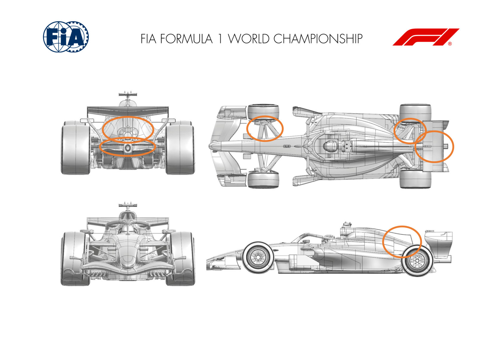
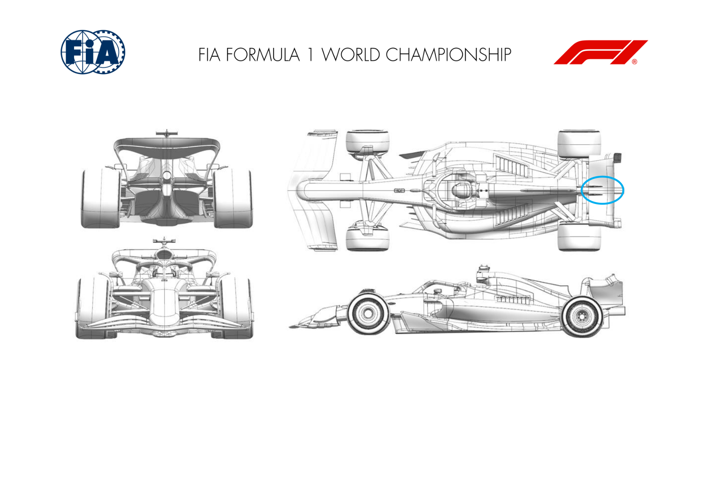
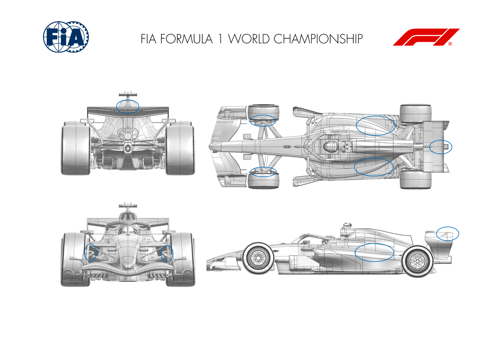
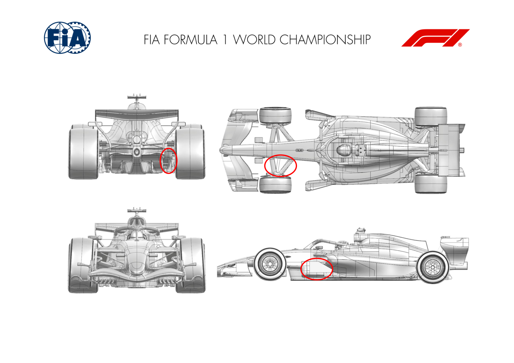
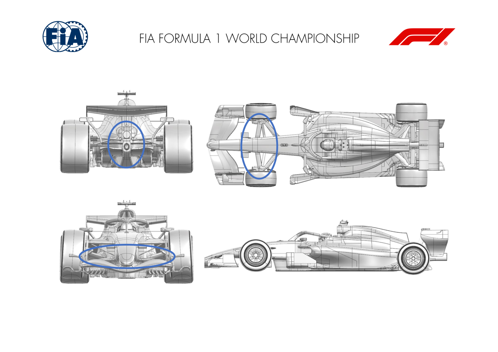
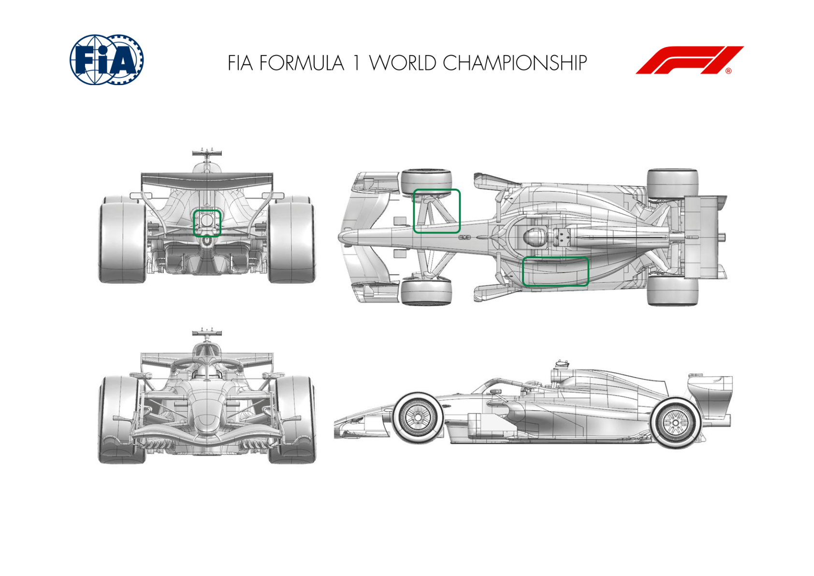
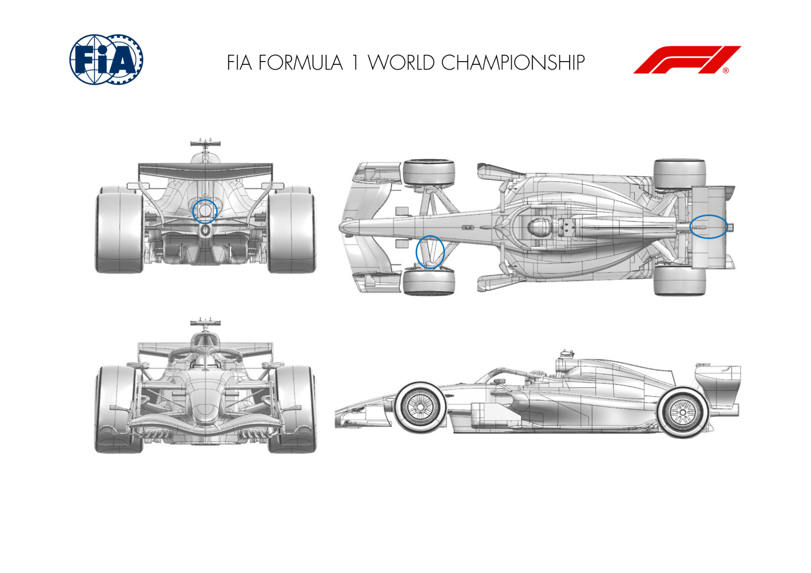
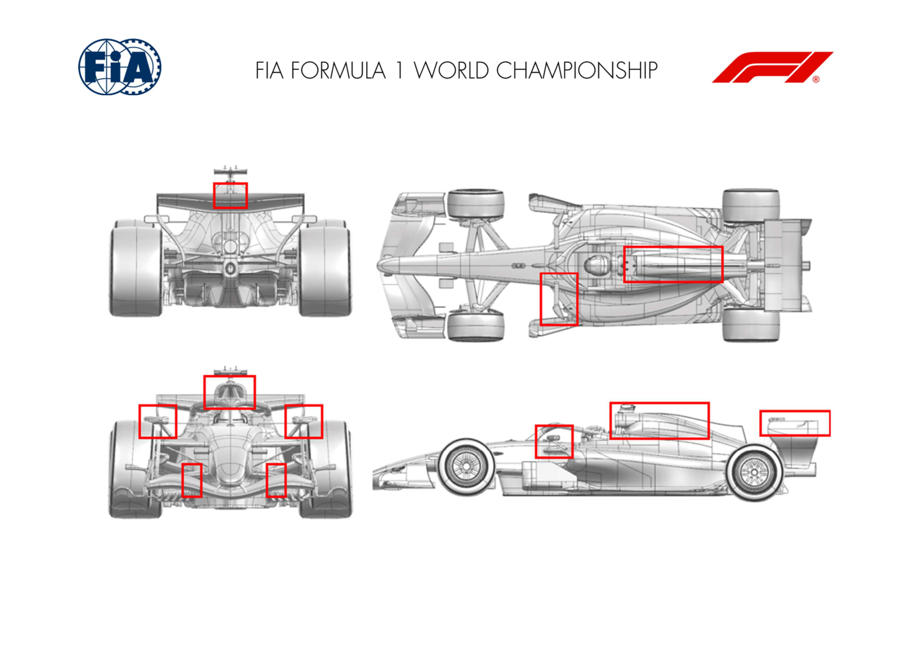
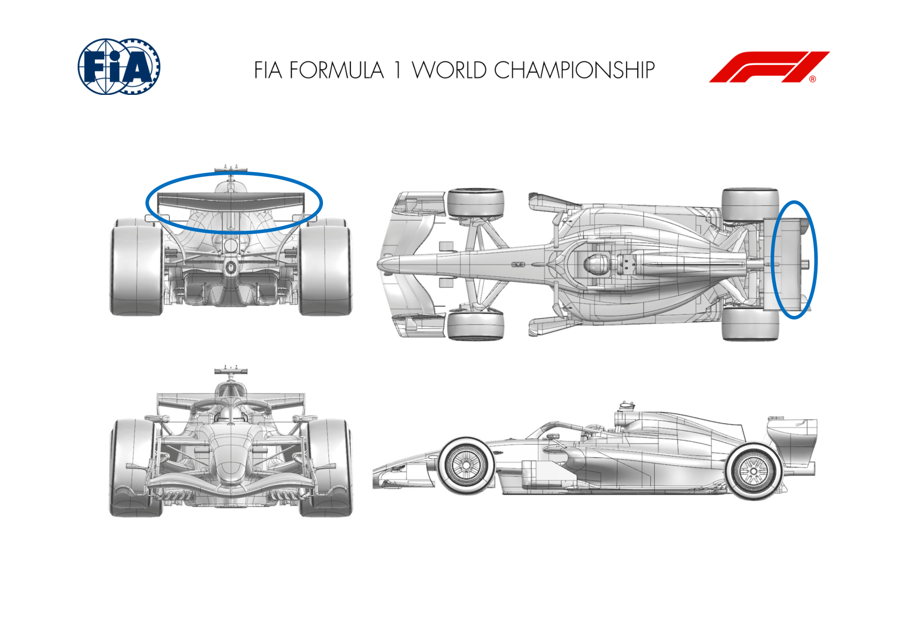
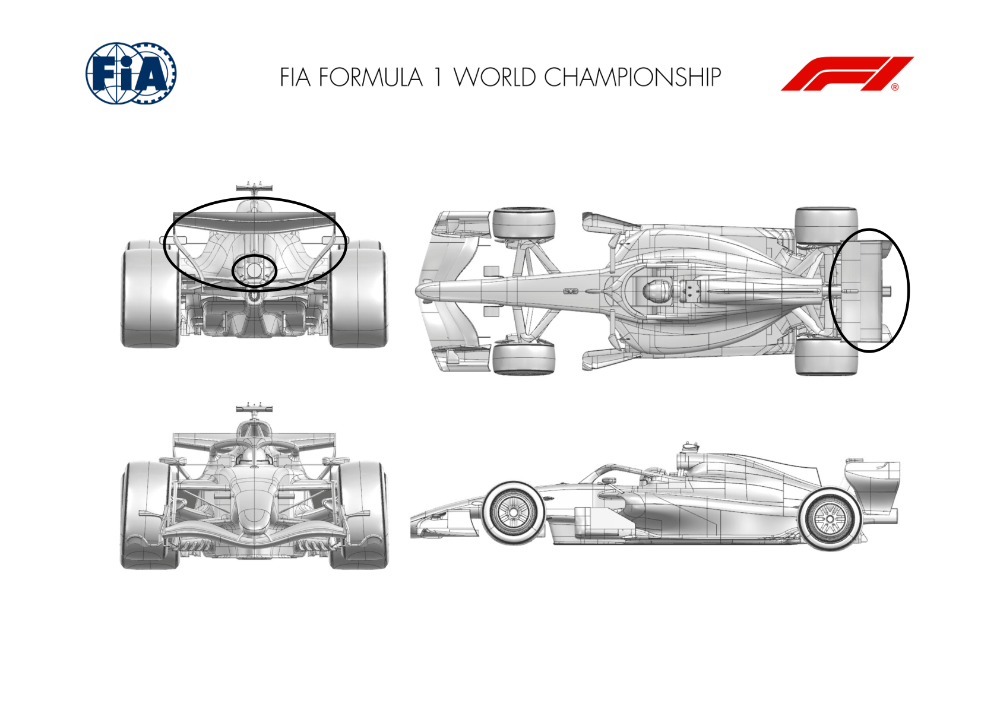

2026 MONACO GRAND PRIX

07 - 09 June 2026

From The FIA Formula 1 Media Delegate Document 15

To All Teams, All Officials Date 05 June 2026

Time 10:55

Title Car Presentation Submissions

Description Car Presentation Submissions

Enclosed 2026 Monaco Grand Prix - Car Presentation Submissions.pdf

Cameron Kelleher

The FIA Formula 1 Media Delegate

Car Presentation – Monaco Grand Prix

McLaren Mastercard F1 Team

| No. | Updated component | Primary reason for update | Geometric differences | Description |
| --- | --- | --- | --- | --- |
| 1 | Coke/Engine Cover | Circuit specific - Cooling Range | Larger Engine Cover | Given the specific cooling requirements of this track, a larger engine cover has been brought to the event to increase overall cooling capacity while maintaining high aerodynamic efficiency. |
| 2 | Front Suspension | Reliability | Monaco Front Suspension | To deal with the unique corner radii encountered at his track, revised front suspension fairings allowing for increased clearance to the wheel at high steer angles have been brought to this event. |
| 3 | Beam Wing | Performance - Flow Conditioning | Revised Beam Wing | A small revision to the beam wing, improving overall flow conditioning and increasing aerodynamic efficiency in conjunction with the rear wing. |
| 4 | Rear Wing | Circuit specific - Drag Range | Rear Wing Winglet Cascade | The removal of the straight mode actuator and circuit characteristic incentivises the addition of local devices to generate additional aerodynamic load. |
| 5 | Rear Corner | Performance - Flow Conditioning | Revised Corner | Modification to the rear suspension fairings as well as rear corner furniture aimed at improved aerodynamic flow conditioning around the rear corner and diffuser. |
| 6 | Diffuser | Reliability | Floor Stay | Addition of a floor stay attached to the diffuser to improve robustness and deflection to maintain aerodynamic performance throughout the speed range. |

Car Presentation – 2026 Monaco Grand Prix

*Mercedes-AMG PETRONAS F1 Team*

| No. | Updated component | Primary reason for update | Geometric differences | Description |
| --- | --- | --- | --- | --- |
| 1 | Rear Wing | Performance - Local Load | Small winglets added within rear wing SM fairing volume | These winglets generate local downforce and drag. The lack of SM mechanism, and the low drag sensitivity of Monaco. make these elements attractive. |

Car Presentation – Monaco Grand Prix

Oracle Red Bull Racing.

| No. | Updated component | Primary reason for update | Geometric differences | Description |
| --- | --- | --- | --- | --- |
| 1 | Front Corner | Reliability | Enlarged front wheel bodywork brake cooling exit duct | The low air speed nature of the Monaco circuit demands a larger exit duct for the front brake material and caliper cooling. |
| 2 | Front corner | Reliability | Suspension member fairing and the front wheel bodywork trims for steering lock | The suspension fairings and the inner face of the front wheel bodywork have been trimmed to allow greater angles than the minimum requirement of the regulations for the unique nature of the Monaco circuit. |
| 3 | Engine Cover | Reliability | Engine cover and sidepod exits for cooling | As is needed for the brakes, the speed profile of the Monaco track implies engine cover and sidepod cooling exits need to be opened for Power Unit and Gearbox. |
| 4 | Rear wing | Performance – Local load | Third element extension and SM fairing extension | The rear wing has a central extension and the SM mechanism fairing also has an extension both adding beneficial local load to the rear wing, in the absence of Straight Mode operation. |

Car Presentation – Monaco Grand Prix

SCUDERIA FERRARI HP

| No. | Updated component | Primary reason for update | Geometric differences | Description |
| --- | --- | --- | --- | --- |
| 1 | Front Suspension | Circuit specific | Modification to front trackrod / suspension legs and fairings | Monaco specific front suspension modifications to allow for greater single wheel angle that are necessary on this peculiar circuit layout |
| 2 | Floor Body | Circuit specific – Drag range | Additional gurney on front floor board second element trailing edge Taking the opportunity of the extreme characteristics of Monaco in terms of aerodynamic efficiency requirements and add minor aero load generating devices on the floor board and diffuser winglet |  |
| 3 | Diffuser | Circuit specific – Drag range | Additional stay on last element of the diffuser winglet |  |

Car Presentation – Monaco Grand Prix

Williams

| No. | Updated component | Primary reason for update | Geometric differences | Description |
| --- | --- | --- | --- | --- |
| 1 | Front Suspension | Performance - Mechanical Setup | A revised front suspension geometry with updated cladding surfaces to suit To suit the demands of the unique Monaco circuit a new front suspension geometry is available. |  |
| 2 | Exhaust Tailpipe | Performance – Local Load | An updated exhaust tailpipe installation | Continuing the positive development path from the previous two GPs a further step on the exhaust system is available this weekend, which offers an additional loading opportunity at the rear of the car. |

Car Presentation – Monaco Grand Prix

Visa Cash App Racing Bulls

| No. | Updated component | Primary reason for update | Geometric differences | Description |
| --- | --- | --- | --- | --- |
| 1 | Front Suspension | Circuit Specific - Mechanical Setup | Clearance modifications on suspension legs | The tight corners of Monaco require increased steering range compared to other circuits. These modifications to the suspension allow for additional steer travel whilst minimising any detrimental effect on the aerodynamics. |
| 2 | Rear Wing | Performance - Local Load | New flap, and new winglet on SM Pod | Both the new flap & the central winglet generate additional downforce compared to the previous specification, particularly suited for the high downforce nature of Monaco. |

Car Presentation – Monaco Grand Prix

Aston Martin Aramco F1 Team

| No. | Updated component | Primary reason for update | Geometric differences | Description |
| --- | --- | --- | --- | --- |
| 1 | Front Suspension | Performance - Mechanical Setup | Revised trackrod OB position. | This is the typical front suspension adjustment for this circuit to achieve the required steering range for the prevalent corner characteristics. |
| 2 | Cooling Louvres | Circuit specific - Cooling Range | Additional bodywork louvres. | Additional bodywork louvres may be added to increase the exit area of the bodywork to provide the cooling level required at this event. |
| 3 | Exhaust Tailpipe Bracket | Performance - Local Load | Updated and repositioned exhaust tailpipe bracket. | The updated exhaust tailpipe bracket is used to generate additional local load on the surfaces at the rear of the car. |

Car Presentation – Monaco Grand Prix

HAAS

| No. | Updated component | Primary reason for update | Geometric differences | Description |
| --- | --- | --- | --- | --- |
| 1 | Front Suspension | Performance - Mechanical Setup Performance Mechanical Setup | Front Trackrod position | A slight modification to the front trackrod geometry was required in order to comply with the specific steering angle demands imposed by the characteristics of this circuit. |
| 2 | Rear Wing | Performance - Local Load | SM Fairing geometry change | A minor revision to the RW SM fairing aimed at inducing localized upwash, providing a small but beneficial contribution to meeting the circuit’s high downforce demands. |
| 3 | Rear Impact Structure | Performance – Local Load | Additional device on RIS top surface | An additional aerodynamic device was installed downstream of the exhaust tailpipe, with the primary objective of encouraging local upwash and consequently enhancing the generation of localized downforce in that region. |

Car Presentation – Monaco Grand Prix

Audi Revolut F1 Team

| No. | Updated component | Primary reason for update | Geometric differences | Description |
| --- | --- | --- | --- | --- |
| 1 | Front Wing | Circuit specific - Local Load | SM actuators removed This design change aims to reduce any unnecessary blockage on the front wing. |  |
| 2 | Mirror | Performance - Local Load | Updated mirror design | Rear view mirror design adapts air flow local to the front of the sidepod and cooling inlets, giving a minor efficiency improvement. |
| 3 | Engine Cover | Performance - Cooling Range | Redesigned roll hoop and engine cover | For this event a new roll hoop and engine cover design are introduced to efficiently increase our cooling options. |
| 4 | Rear Wing | Circuit specific - Local Load | SM actuator removed This design change aims to reduce any unnecessary blockage on the rear wing. |  |

Car Presentation – Monaco Grand Prix

BWT Alpine F1 Team

| No. | Updated component | Primary reason for update | Geometric differences | Description |
| --- | --- | --- | --- | --- |
| 1 | Rear Wing | Performance - Local Load | Addition of winglets | As part of our ongoing in-season rear wing development programme, flap winglets are introduced at this event to further enhance aerodynamic performance. |

Car Presentation – Monaco Grand Prix

Cadillac

| No. | Updated component | Primary reason for update | Geometric differences | Description |
| --- | --- | --- | --- | --- |
| 1 | Rear Wing | Performance – Local Load | Updated wing section profiles and end plate geometry | Updated Rear Wing and End Plate surfaces to generate more aerodynamic load at the rear of the car whilst also improving sensitivity to changes in car attitude |
| 2 | Exhaust Tailpipe | Performance – Local Load | Revised exhaust tailpipe and bracket geometry | Changes to the exhaust tailpipe and bracket geometry to increase local aerodynamic load and consequently improve the load characteristics at the rear of the car |

