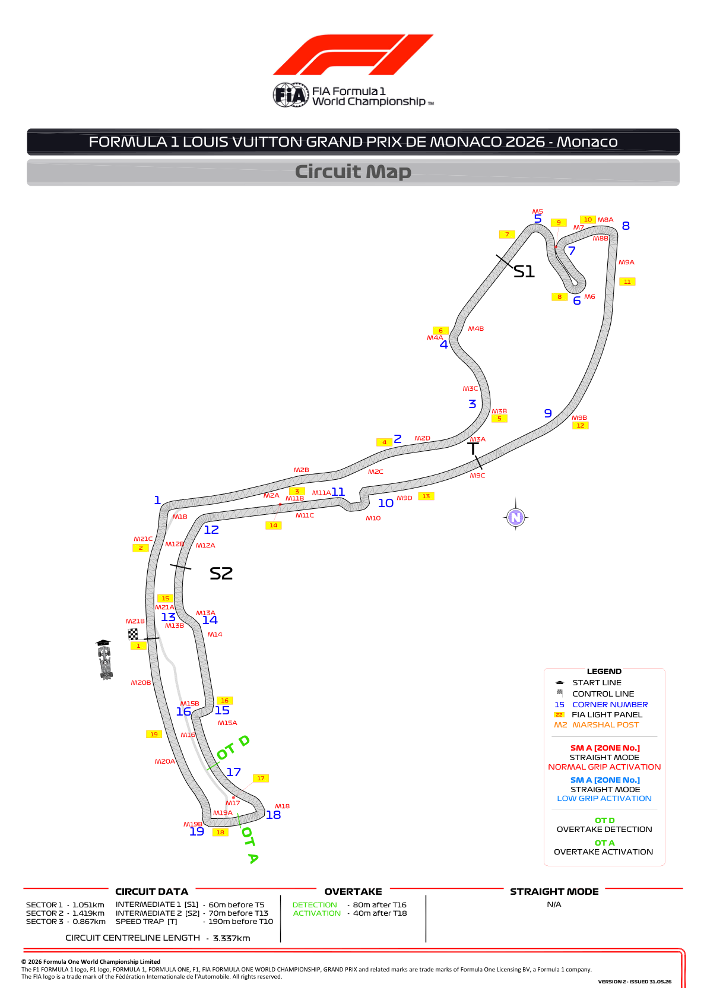
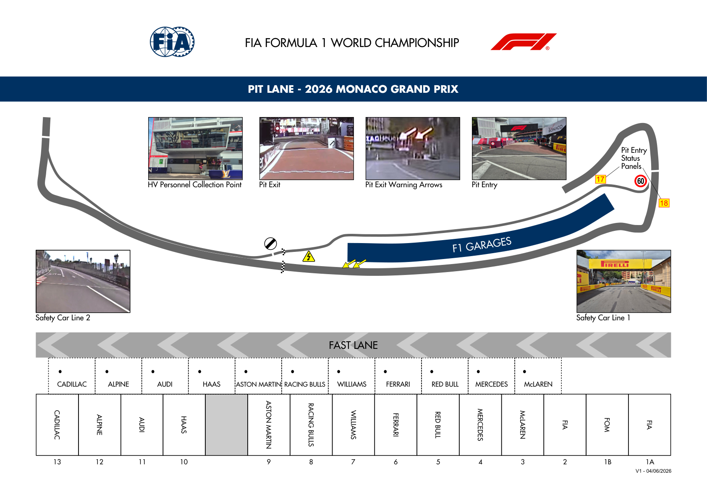
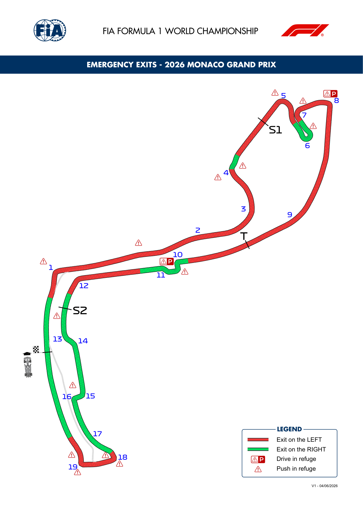
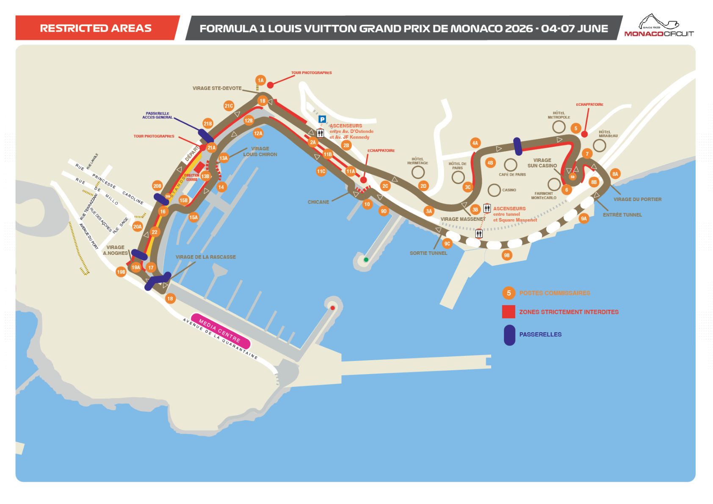

2026 MONACO GRAND PRIX

07 - 09 June 2026

From The FIA Formula 1 Race Director Document 7

To All Teams, All Officials Date 04 June 2026

Time 16:30

Title Circuit Map, Pit Lane Drawing, Emergency Exits Map and Red Zone

Description Circuit Map, Pit Lane Drawing, Emergency Exits Map and Red Zone

Enclosed 06MON - Maps.pdf

Rui Marques

The FIA Formula 1 Race Director

