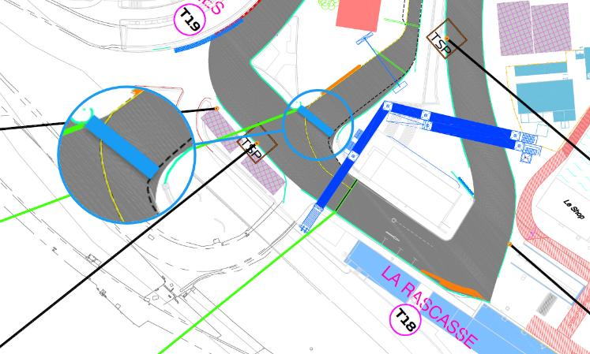
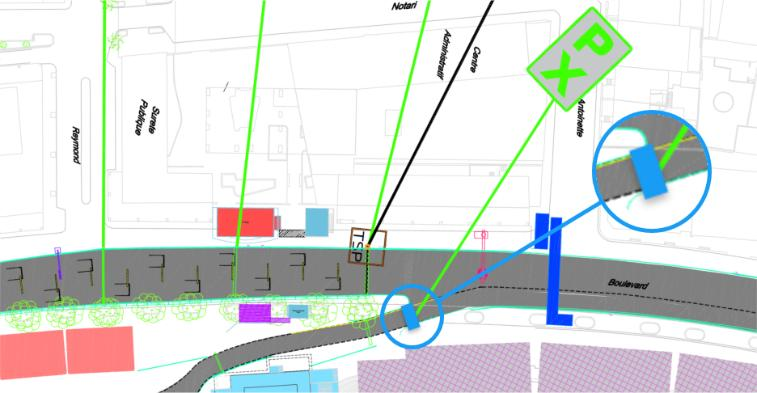
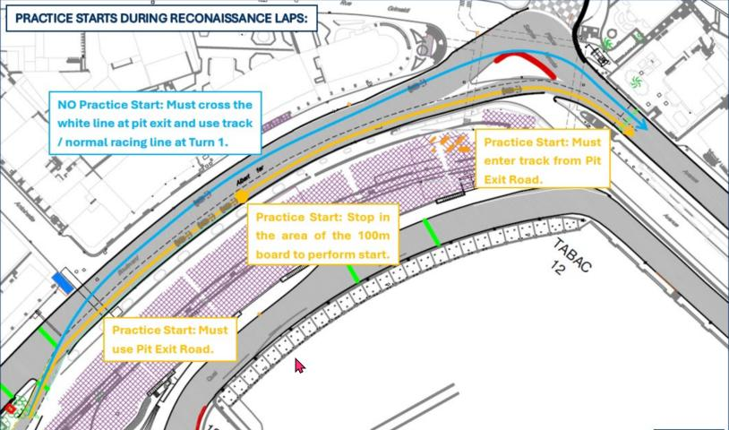
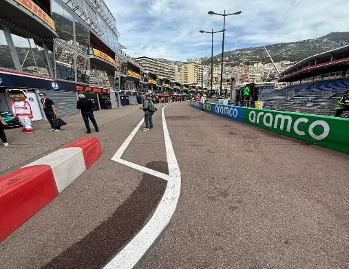
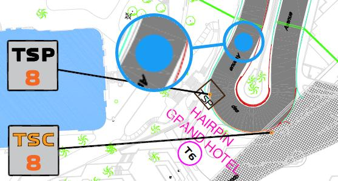
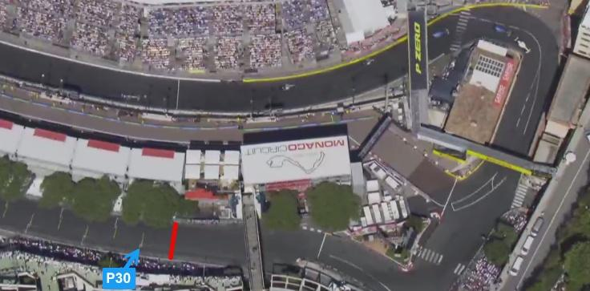

2026 MONACO GRAND PRIX

07 - 09 June 2026

From The FIA Formula 1 Race Director Document 48

To All Teams, All Officials Date 06 June 2026

Time 14:00

Title Race Director's Competition Notes V3

Description Race Director's Competition Notes V3

Enclosed 2026 Monaco Grand Prix Competition NotesV3.pdf

Rui Marques

The FIA Formula 1 Race Director

2026 M G P ONACO RAND RIX

05 – 07 June 2026

From The FIA Formula 1 Race Director

To All Officials, All Teams Date 06 June 2026

COMPETITION NOTES V3 (changes in magenta)

General Instructions

1. Laps during Qualifying Session and Reconnaissance Lap(s), For the safe and orderly conduct of the Competition, other than in exceptional circumstances accepted as such by the Stewards, any driver that exceeds the maximum time from the Second Safety Car Line to the First Safety Car Line on ANY lap during and after the Qualifying Session, including in-laps and out-laps or during reconnaissance laps when the pit exit is opened for the Race, may be deemed to be going unnecessarily slowly. Teams and Drivers will be informed of the maximum time after the second Practice Session. For the avoidance of doubt, this does not supersede Articles B1.8.5 and B4.1.1 of the FIA Formula 1 Regulations, which apply to the entire Circuit, furthermore this includes the pit lane as well. Incidents will normally be investigated after the Qualifying Session or the Race.

2. Lapping during the Race

The International Sporting Code (ISC) requires drivers who are caught by another car to allow the faster driver past at the first available opportunity. The F1 marshalling system will be set to give a pre-warning when the faster car is within 3.0s of the car about to be lapped, this should be used by the team of the slower car to warn their driver he is soon going to be lapped and that allowing the faster car through should be considered a priority. When the faster car is within 1.2s of the car about to be lapped blue light panels will be shown to the slower car (in addition to blue light panels, blue cockpit lights and a message on the timing monitors) and the driver must allow the following driver to overtake at the first available opportunity.

3. Article B5.13.6 of the FIA F1 Regulations In order to avoid the likelihood of accidents before the safety car returns to the pits, from the point at which the orange lights on the safety car are extinguished drivers must proceed at a pace which involves no erratic acceleration or braking nor any other manoeuvre which is likely to endanger other drivers or impede the restart.

4. ERS Safety Check after Covers Off In accordance with the provisions set out in Appendix B2, Section 12.1 of the FIA F1 Regulations, as work required by the Technical Delegate; Each morning, immediately after covers are removed when the cars are under parc fermé conditions (Articles B3.4.1, B3.4.2 and B3.4.3), all Teams must connect the umbilical to their cars and start a telemetry data logging for the sole

1

purpose of checking the car ERS safety status.

5. Pit Lane Safety Article B1.6.2c of the FIA F1 Regulations states: “Team personnel are only allowed in the Pit Lane immediately before they are required to work on a Car and must withdraw as soon as the work is complete.” For the safe and orderly conduct of the competition, in the context of the race only, the requirements of Article B1.6.2c are considered to apply until such time as all cars able to do so have completed the Race and have entered the designated Parc Ferme area. Following the end-of-session signal, described in Article B2.5.3, and when the Race Director considers it safe to do so, the message “ALL PASS HOLDERS MAY ACCESS THE PIT LANE” will be sent to all competitors using the official messaging system; this being the signal to all competitors that the requirements of Article B1.6.2c are no longer applicable, and thus holders of passes not valid for access to the Pit Lane (i.e. passes other than those marked “Pit Lane” or “Pit Lane All Times”) may enter the Pit Lane. Competitors are reminded that in accordance with the International Sporting Code, Article 9.15.1 “The Competitor shall be responsible for all acts or omissions on the part of any person taking part in, or providing a service in connection with, a Competition or a Championship on their behalf, including in particular their employees, direct or indirect, their Drivers, mechanics, consultants, service providers, or passengers, as well as any person to whom the Competitor has allowed access to the Reserved Areas.

6. Lap times in all LTCS and TTCS Only lap times which have been completed on the track will be included for the purpose of any classification.

7. Starting Procedure 7.1 For the safe and orderly conduct of the Competition, once all F1 Cars starting from the grid have returned to the grid at the end of the formation lap or laps prior to the Race or a Standing Start Resumption, the starting grid light panels will be illuminated blue (flashing) for 5 seconds and the information panel on the start gantry will display the message “Pre-Start”, following which the light sequence defined in to Article B5.7.2 of the FIA F1 Regulations will commence. 7.2 Article B1.8.4 states “the light signals displayed on the trackside light panels have the same meaning as flag signals”. For the avoidance of doubt, the starting grid panels are not considered a track side light panel, i.e, the display of a yellow starting procedure panel is for information propose only, without any regulatory instruction.

8. Finishing the Race For the purpose of finishing the Race, pursuant to Article B2.5.3 of the FIA F1 Regulations, the “Line” referred to will be the Control Line on the track and not in the Pit Lane.

9. Double Waved Yellow Flag For the safe and orderly conduct of the event, in addition to the provisions of the Article B1.8.4b, any driver passing through a double waved yellow flag marshalling sector during a Free Practice session will have that lap time deleted.

Competition Specific Instructions

10. Pirelli Trackside Operations regarding personnel (Engineering/Fitting) for Monaco 10.1 To limit the number of personnel for Monaco, the following procedure is implemented. • Only the Pirelli engineer will be present in the pit lane and garage for all practice sessions and qualifying. • All wear checking and tyre photography shall take place after the session at the Pirelli fitting area. Each Competitor is responsible for delivery of the used sets to Pirelli in the usual way to wear checking/stripping. • For the race, each Competitor should have space to allow the usual wear checking during the race after the pit stop. A space should be provided in the garage or behind in

2

the teams own area where Pirelli personnel can work. 10.2 Teams are kindly reminded that their maximum collaboration is expected to deliver free practice tyres to the Pirelli fitting area in a timely manner.

11. Marshalling System 11.1 A car entering the Pit Lane will be subject to the marshalling state (i.e. yellow flag or double yellow flag) of the associated sector until it passes the blue line marked on the image below.

11.2 A car leaving the Pit Lane will be subject to the marshalling system state i.e. yellow flag or double yellow flag of the sector into which it is emerging after it passes the blue line marked on the image below.

12. Support Races team barrier placement and movements Team barrier placement prior to and during all support category practice sessions and races: No more than (1) one meters from the garage. Please ensure that your pit stop gantry arms are moved back towards the garage during all support category activities. Support Crews and Trolleys will be released into Pit Lane no earlier than 30 minutes prior to the opening of pit exit for their respective sessions. Support Category competition vehicles will be released from the marshalling area no earlier than 15 minutes prior to the opening of pit exit for their respective sessions.

13. Practice starts 13.1 No practice starts may be carried out at pit exit. 13.2 Practice starts after each Free Practice session will be performed according to Article B4.2.2 of the FIA Formula 1 Regulations. 13.3 If a Free Practice session is resumed with less than 2 minutes remaining, for the purpose of facilitating practice starts on the grid as provided for in Article B4.2.2 of the FIA F1 Regulations, any car wishing to leave the Pit Lane must proceed down the Pit Lane without undue delay and exit the Pit Lane without leaving a significant gap to the car ahead. 13.4 For the safe and orderly conduct of the competition, pursuant to article B4.2.2, any driver on track when the end of session signal is shown for the Free Practice 2 session, may complete two further laps, for the sole purpose of stopping on the grid to perform practice starts on each of these laps.

3

13.5 For the avoidance of doubt, practice starts may not be carried out during the Qualifying Session. 13.6 Practice starts during the reconnaissance laps: Practice starts during the reconnaissance laps may be done in the pit exit road in the area of the 100 meter brake marker board on the RHS. Drivers doing a practice start must use the pit exit road and rejoin the track after turn1 without crossing the white line separating the pit exit road from the track at any time. Drivers not doing a practice start must cross the pit exit white line separating the pit exit road from the track on the LHS, at the earliest opportunity after having left the pit lane and use the normal circuit through turn 1.

14. Article B1.6.3d of the FIA F1 Regulations (…) Any car(s) driven to the end of the Pit Lane prior to the start or re-start of a LTCS must form up in a line in the Fast Lane and leave in the order they got there (…) It is noted that a car will be considered to be “in the fast lane” when a tyre has crossed the solid white line separating the fast lane from the inner lane, in this context crossing means that all of a tyre should be beyond the far side, with respect to the garages, of the line separating the fast lane from the inner lane.

For the avoidance of doubt, ISC Appendix L, Chapter IV, Article 5b) states that: Once a car has left its garage or pit stop position it should blend into the fast lane as soon as it is safe to do so, and without unnecessarily impeding cars which are already in the fast lane. Thus, after the start or re-start of the Free Practice session and Qualifying Session, if there is a suitable gap in a queue of cars in the fast lane, such that a driver can blend into the fast lane safely and without unnecessarily impeding cars already in the fast lane, they are free to do so. Furthermore, it is noted that during the Free Practice session and Qualifying Session a car driving in the inner lane, parallel to the fast lane, will not be considered to have blended into the fast lane at the earliest opportunity.

4

Additionally, ISC Appendix L, Chapter IV, Article 5d) states that: Cars in either the fast lane or working lane may not overtake other cars in the fast lane except in exceptional circumstances. In this context a “stopped car” is one which has an obvious mechanical problem.

15. Driving in the Pit Lane During the Race This event is at a track where the pit lane is narrow. For the safe and orderly conduct of this event, when released from their pit stop position during the race, all cars so released shall be responsible for ensuring that they blend into the fast lane as quickly as possible in a safe and orderly manner without unnecessarily impeding any car already in the fast lane. If this requires the released car to slow down sufficiently to allow car(s) in the fast lane to pass them, then that is what the released car should do.

For the avoidance of doubt, in this case a car will be considered to have entered the fast lane when all parts of the car have crossed the line separating the fast lane from the inner lane.

16. Pit Lane Speed The Pit Lane Speed limit detailed in Article B1.6.3a of the FIA F1 Regulations is hereby amended to 60km/h for the duration of the event.

17. Lines at the Pit Entry and Pit Exit 17.1 In accordance with Chapter 4, Articles 4 and 6 of Appendix L to the ISC drivers must follow the procedures at pit entry and pit exit. 17.2 During the reconnaissance laps prior to the race drivers are allowed to cross the white line separating the pit exit road from the circuit in the pit exit road following the instructions in the art 13.5 from this competition notes.

18. Stopping the Qualifying Session Pursuant to art. B4.3.1b of the FIA F1 Regulations, should any period of the Qualifying Session be interrupted with less than 70 seconds remaining, the relevant period of the Qualifying Session will not be resumed.

19. Post Qualifying Session drivers weighing Any driver who has finished participating in the Qualifying Session after Q1 or Q2, must proceed through the pit lane directly to the FIA scales immediately after they have returned to their team’s garage. The drivers may not drink anything or do anything which increases their weight before it is recorded by the FIA. Any driver who stops on the track during the Qualifying Session and is not required to visit the Medical Centre must proceed to the FIA scales to get their weight recorded before returning to his team. Drivers who finish within the top 10 must proceed to the FIA scales immediately when out of their cars without contact with any other person.

20. ERS Hazard Status If the ERS is in a Hazard Status, the relevant team will be required to send mechanics to the pit exit area in front of the race control building. They will then be picked up by car to bring to their car after the session.

21. Leaving the garage before and during all Practice Sessions 21.1 Before the start of the Free Practice Session and Qualifying Session or prior to the pit exit opening for the reconnaissance laps, no cars may enter the pit lane to proceed to pit exit until 5 minutes before the start of the session. 21.2 If the Free Practice Session or Qualifying Session, or any period thereof, is delayed or stopped, cars may only enter the Fast Lane after the re-start time is confirmed via the official messaging system.

5

22. Fire extinguishers around the circuit Indicated by white boards with a red fire extinguisher attached to the debris fences.

23. Places to remove cars from the track Indicated by fluorescent orange panels/paintings on the barriers.

24. Removing cars from the grid Cars may be removed from the grid through the pit lane exit.

25. Race Suspension or Starting Procedure Suspension 25.1 In case of Race suspension or Starting Procedure suspension, (except in case of Article B5.14.3 of the FIA F1 Regulations – stopping on the grid), cars will be stopped in the fast lane. The first car must stop in the vicinity of the last garage. 25.2 Safety Car resumption point: Safety Car will leave the pit lane 1 minute before the resumption and wait for the F1 cars before Turn 6 (as per the image below).

26. Grid Panel Placement On the right-hand side of the grid.

27. Grid Procedure Article B5.2.4 states that “Any F1 Car which does not complete a reconnaissance lap and reach the grid under its own power will not be permitted to start the TTCS from the grid.”. In the context of this article the grid shall be considered to be the section of track highlighted by the RED box in the image below, starting from the front of marked grid box #1 and finishing at the rear of marked grid box #30:

28. Turn 10-11 Escape Road If a car uses the escape road at Turn 10-11 (Chicane), the driver may re-join the track only when the lights, operated the marshal on the spot, are turned to green.

29. Leaving the track and gaining an advantage Turn 10-11 during the race 29.1 Any car that cuts the chicane at Turn 10/Turn 11 and gains a position must return that position before T12. Returning a position after turn 12 will not be considered a mitigating factor and will be reported as such for subsequent investigation by the Stewards. 29.2 Any car that cuts the chicane at Turn 10/Turn 11 on their in lap for a pit stop and subsequently gains a position after the pit stop as a result, will be reported for leaving the track and gaining a

6

lasting advantage.

30. Changes to the Circuit • Movement of the entry gate at the front of grid (grid position 5). • Track resurfaced from Turn 19 to Turn 1. • Track resurfaced from Turn 7 to the entry of the tunnel. • Track resurfaced pit entry and pit exit. • Track resurfaced at Turn 5 runoff. • Extended/new debris fences at: - Pit exit right hand side. - Turn 1 on the left-hand side. - Turn 3 on the left-hand side. - Extended between Turn 4 and 5 on the right-hand side. - Extended at Turn 5 runoff. - Added fence on the right-hand side at Turn 6. - Extended fences at Turn 10 both sides. • Alignment and extension of the guardrail at Turn 3 left hand side. • Realignment and extension of the guardrail at Turn 3 left-hand side. • Extension of the guard rail at Turn 6 left hand side. • Extension of the guardrail at Turn 10. Opening reduced. • Extension of the guardrail from Turn 11 and Turn 12. • Additional line of guardrail at pit entry. • Change from Tecpro to tyre barrier at Turn 4 left-hand side. • Beginning of kerb at Turn 6 on the left-hand side smoother. • Entry kerb at Turn 7 on the left-hand side smoother. • Reduced height of the sausage kerb at Turn 10. • Reduced height of the sausage kerb at Turn 16. • End of kerb smoother at the exit of Turn 19 right hand side. • TSP 12 moved higher inside the tunnel.

31. Light panels: In case of an incident, the yellow and double yellow light panel will be mirrored on the panels below: • Panel 5 will be mirrored on panel 4 (Turn 3) • Panel 11 will be mirrored on panel 10 (Turn 8) • Panel 12 will be mirrored on panels 10 and 11 (Turn 9) • Panel 15 will be mirrored on panel 14 (Turn 13/14)

Rui Marques

The FIA Formula 1 Race Director

7
