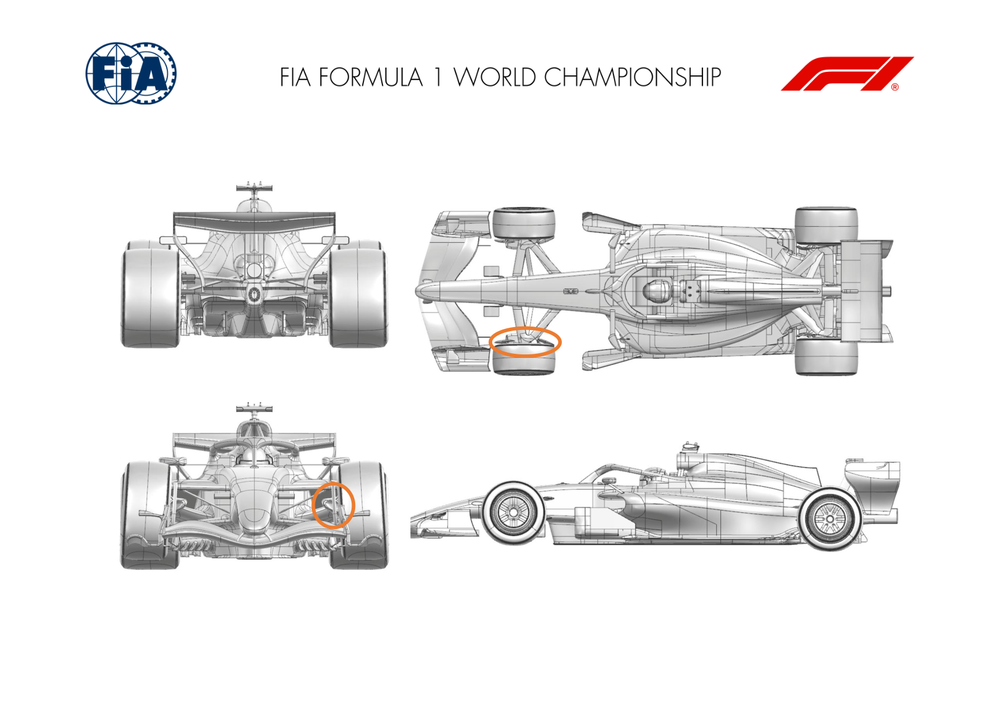
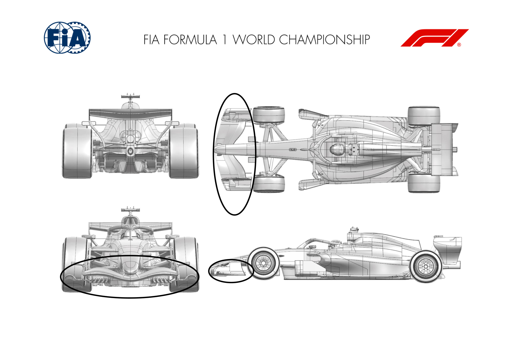
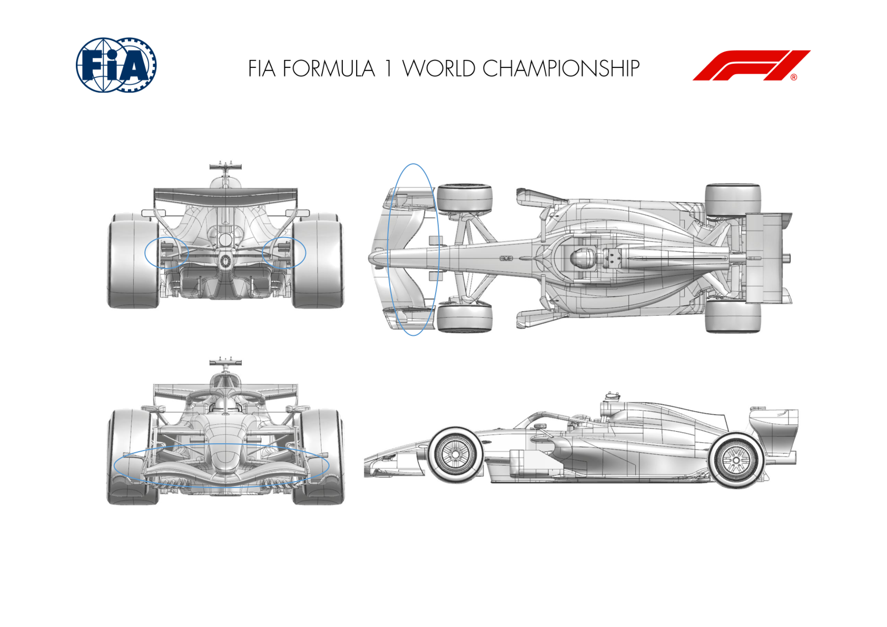

2026 SINGAPORE GRAND PRIX

09 - 11 October 2026

From The FIA Formula 1 Media Delegate Document 9

To All Teams, All Officials Date 09 October 2026

Time 13:53

Title Car Presentation Submissions

Description Car Presentation Submissions

Enclosed 2026 Singapore Grand Prix - Car Presentation Submissions.pdf

Roman De Lauw

The FIA Formula 1 Media Delegate

Car Presentation – Singapore Grand Prix

McLaren Mastercard F1 Team

| No. | Updated component | Primary reason for update | Geometric differences | Description |
| --- | --- | --- | --- | --- |
| 1 | Front Corner | Circuit specific - Cooling Range | High Cooling Front Brake Duct | To meet the high brake cooling demands of this and upcoming circuits, a new front brake duct aiming at increased brake cooling massflow has been designed. |

Car Presentation – 2026 Singapore Grand Prix

Mercedes-AMG PETRONAS F1 Team

| No. | Updated component | Primary reason for update | Geometric differences | Description |
| --- | --- | --- | --- | --- |
| 1 | Front Wing | Performance - Flow Conditioning | Change in chord distribution between three wing elements; switch to two element SM Change in chordwise and spanwise loading, results in improved performance across the operating envelope, including improved front tyre wake control. |  |
| 2 | Front Wing Endplate | Performance - Flow Conditioning | Front wing endplate and footplate adjusted to accommodate the above. Diveplane camber adjusted. |  |

Car Presentation – Singapore Grand Prix

Oracle Red Bull Racing

| No. | Updated component | Primary reason for update | Geometric differences | Description |
| --- | --- | --- | --- | --- |
| 1 | Front wing | Performance - Local Load | Revised end plate and flap geometries | A new wing design has been achieved by modifying a previous front wing assembly, which has been further optimised to offer more local load whilst maintaining the flow stability. |
| 2 | Rear Wheel Bodywork | Reliability | Enlarged exit duct | By modifying existing parts, a larger exit duct has been achieved for more cooling flow to cope with the anticipated brake energy of the Singapore circuit |

Car Presentation – Singapore Grand Prix

SCUDERIA FERRARI HP

No updates submitted for this event.

Car Presentation – Singapore Grand Prix

Williams

No Updates

Car Presentation – Singapore Grand Prix

Visa Cash App Racing Bulls

No updates submitted for this event.

Car Presentation – Singapore Grand Prix

Aston Martin Aramco F1 Team

No updates submitted for this event.

Car Presentation – Singapore Grand Prix

TGR HAAS F1 TEAM

No update for this event

Car Presentation – Singapore Grand Prix

BWT Alpine F1 Team

No updates submitted for this event.

Car Presentation – Singapore Grand Prix

Audi Revolut F1 Team

No updates submitted for this event.

Car Presentation – Singapore Grand Prix

Cadillac

No updates for this event
