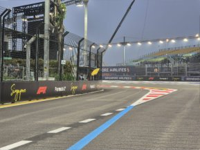
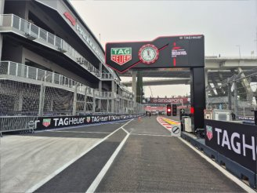
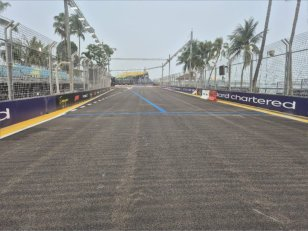
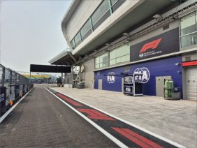
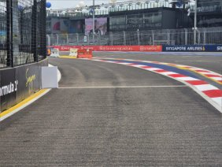
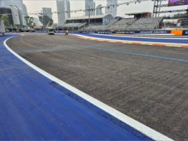

2026 SINGAPORE GRAND PRIX

09 - 11 October 2026

From The FIA Formula 1 Race Director Document 14

To All Teams, All Officials Date 09 October 2026

Time 15:17

Title Pit Lane V2

Description Pit Lane V2

Enclosed 17SGP - Pit Lane - F1 V2.pdf

Rui Marques

The FIA Formula 1 Race Director

FIA FORMULA 1 WORLD CHAMPIONSHIP ®

PIT LANE - 2026 SINGAPORE GRAND PRIX

TBC

Pit Entry Status Panel 25 Pit Entry Status Pit Entry Road Signal Panels 16 80 Pit

Safety Car Line 1 Pit Entry Pit Entry Flag Marshal HV Personnel Collection Point Pit Exit Safety Car Line 2 F1 GARAGES Blue Flag Marshal

White Flag 26 Marshal

80 F1 GARAGES

PX

18

1 2 3 4 5 6 7 8 9 10 11 12 13 14 15 16 17 18 19 20 21 22 23 24 25 26 27 28 29 30 31 32 33 34 35 36 37 38 39 40 41

|  | FOM | FIA | FIA | FIA | FIA | McLAREN | McLAREN | McLAREN | McLAREN | MERCEDES |  | MERCEDES | MERCEDES | RED BULL |  | RED BULL | RED BULL | FERRARI | FERRARI | FERRARI | FERRARI |  | WILLIAMS | WILLIAMS | WILLIAMS | WILLIAMS | RACING BULLS | RACING BULLS |  | RACING BULLS | ASTON MARTIN | ASTON MARTIN | ASTON MARTIN | HAAS | HAAS | HAAS |  | AUDI | AUDI | AUDI | ALPINE | ALPINE | ALPINE |  | CADILLAC | CADILLAC | CADILLAC |
| --- | --- | --- | --- | --- | --- | --- | --- | --- | --- | --- | --- | --- | --- | --- | --- | --- | --- | --- | --- | --- | --- | --- | --- | --- | --- | --- | --- | --- | --- | --- | --- | --- | --- | --- | --- | --- | --- | --- | --- | --- | --- | --- | --- | --- | --- | --- | --- |
| FOM |  |  |  |  |  |  |  |  |  |  |  |  |  |  |  |  |  |  |  |  |  |  |  |  |  |  |  |  |  |  |  |  |  |  |  |  |  |  |  |  |  |  |  |  |  |  |  |
|  |  |  |  |  |  |  |  |  | MERCEDES |  |  |  |  |  |  |  |  | RED BULL |  |  |  |  |  |  |  | RACING BULLS |  |  |  |  |  |  |  |  |  |  |  |  |  |  |  |  |  |  |  |  |  |
|  |  |  |  |  |  |  | McLAREN |  |  |  | MERCEDES |  |  |  | RED BULL |  |  | FERRARI |  |  |  | WILLIAMS |  |  |  | RACING BULLS |  |  | ASTON MARTIN |  |  |  | HAAS |  |  |  | AUDI |  |  | ALPINE |  |  |  | CADILLAC |  |  |  |

F1 GARAGES

PIRELLI PIRELLI FAST LANE

V2 - 09/10/2026
