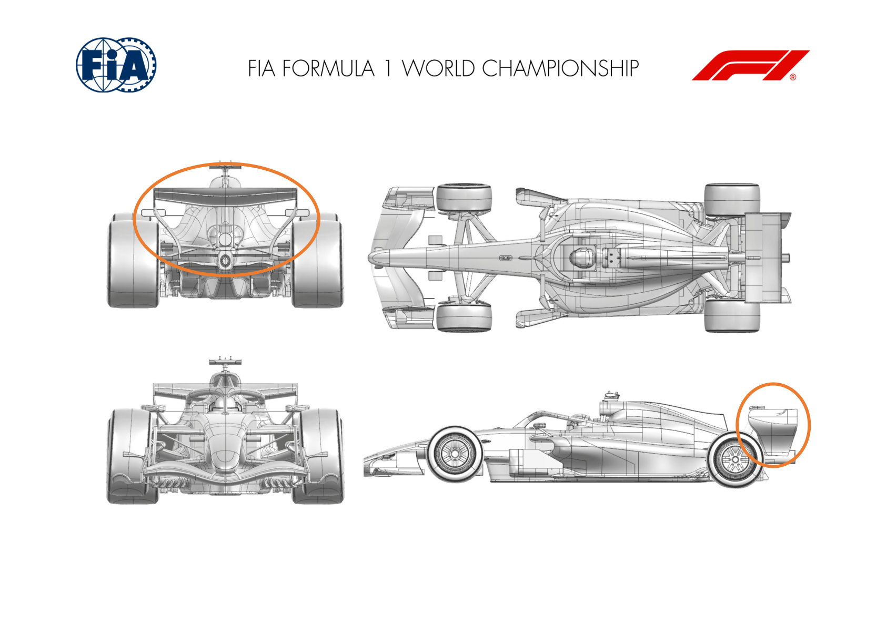
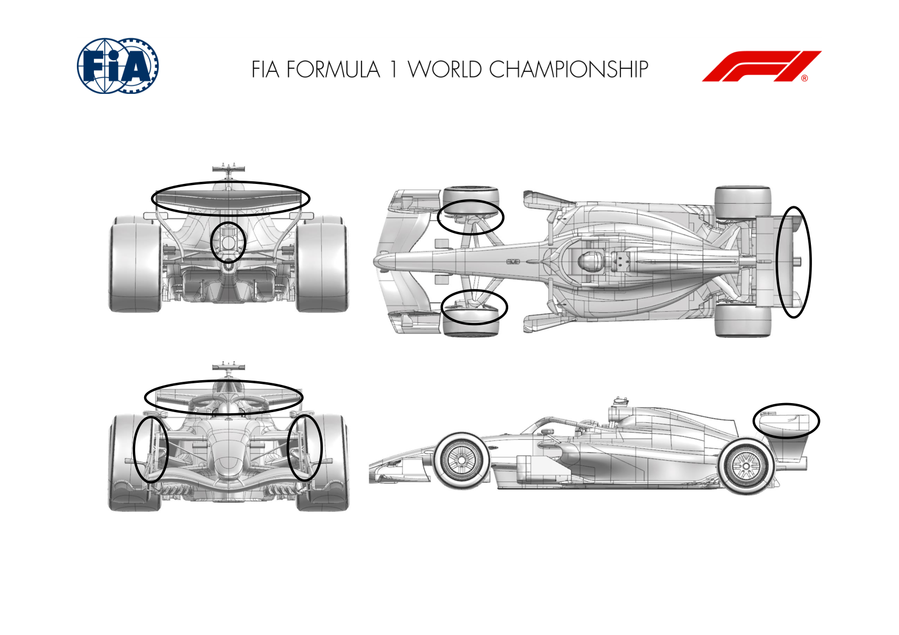
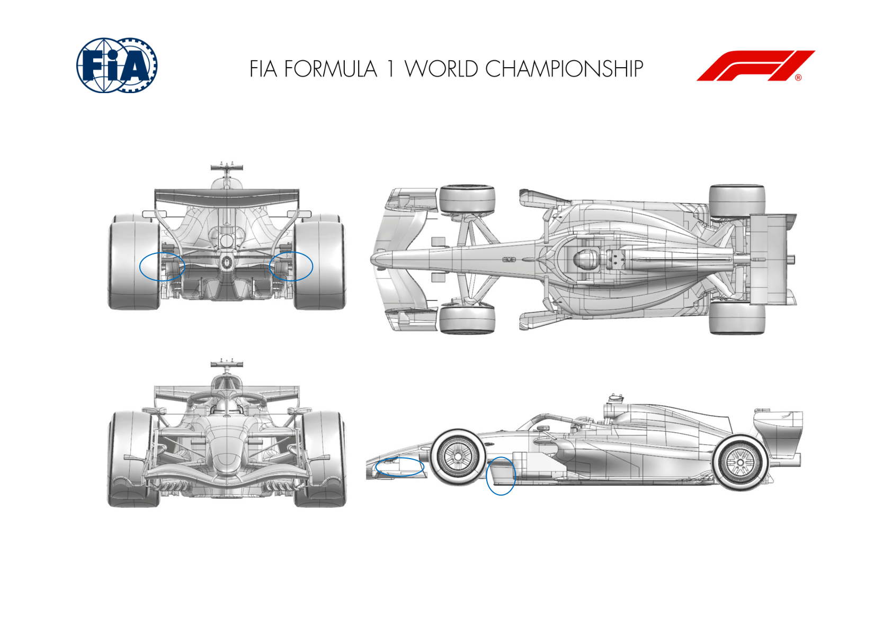
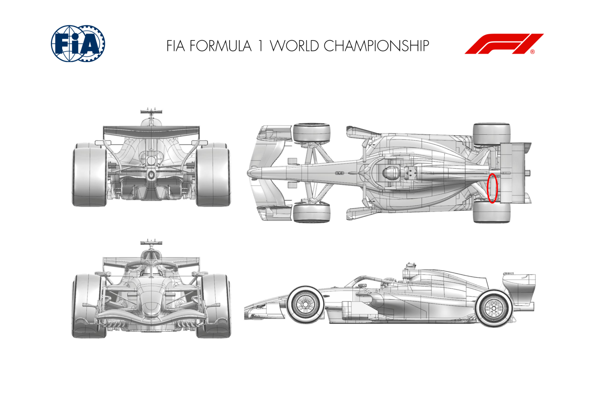
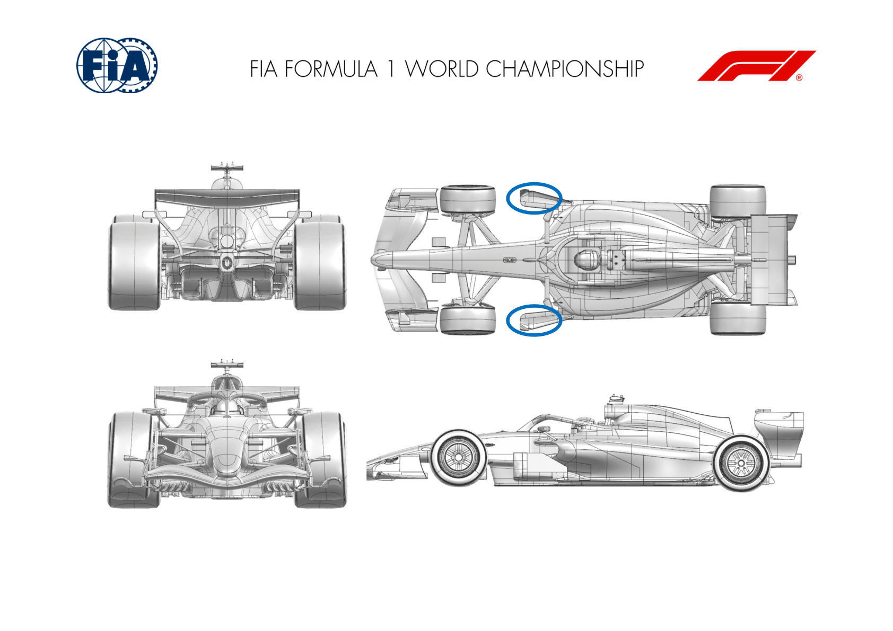
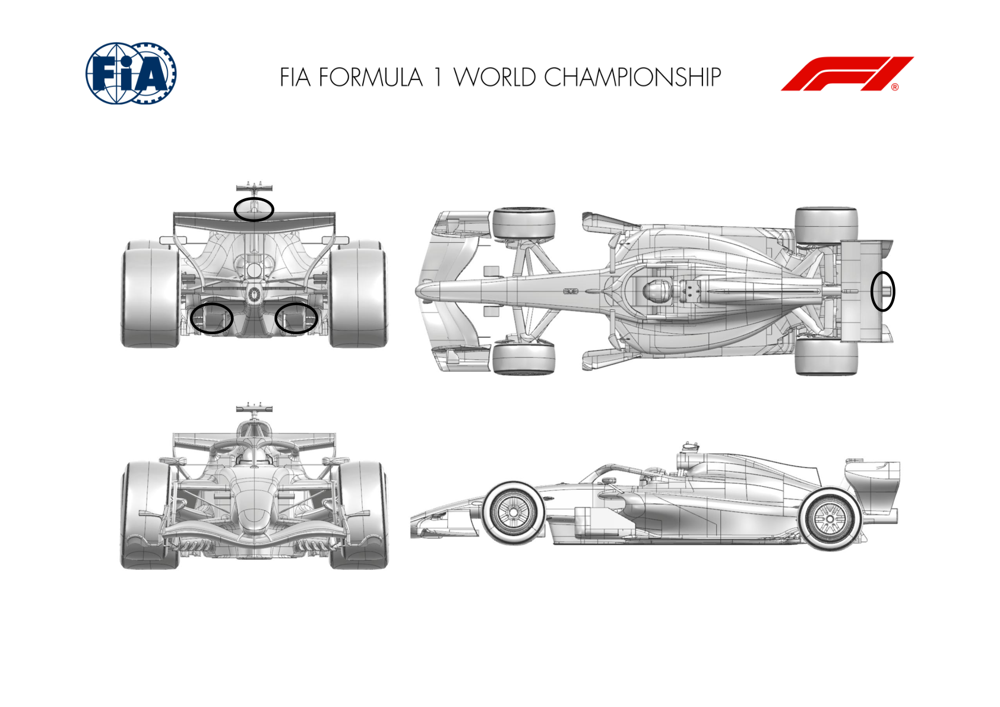

2026 SPANISH GRAND PRIX

11 - 13 September 2026

From The FIA Formula 1 Media Delegate Document 11

To All Teams, All Officials Date 11 September 2026

Time 11:00

Title Car Presentation Submissions

Description Car Presentation Submissions

Enclosed 2026 Spanish Grand Prix - Car Presentation Submissions.pdf

Roman De Lauw

The FIA Formula 1 Media Delegate

Car Presentation – Spanish Grand Prix

McLaren Mastercard F1 Team

| No. | Updated component | Primary reason for update | Geometric differences | Description |
| --- | --- | --- | --- | --- |
| 1 | Rear Wing | Performance - Flow Conditioning | Additional Rear Wing Furniture | Additional elements have been added to the rear wing, improving flow conditioning onto the rear wing mainplane and flap elements. |

Car Presentation – 2026 Spanish Grand Prix

Mercedes-AMG PETRONAS F1 Team

| No. | Updated component | Primary reason for update | Geometric differences | Description |
| --- | --- | --- | --- | --- |
| 1 | Rear Wing | Circuit specific - Drag Range | Rear wing central winglet span reduced | Reducing the span of the central winglet mounted above the rear wing flap sheds local downforce and drag at a ratio appropriate for Madrid L/D. |
| 2 | Exhaust Tailpipe | Circuit specific - Drag Range | Additional winglet added behind exhaust | Additional winglet added to increase exhaust flow turning to generate load and drag at a ratio appropriate for Madrid L/D. |
| 3 | Front Drum | Performance - Flow Conditioning | Front lip reprofiled | Front lip reprofiled to improve flow attachment through all steer conditions, resulting in improved flow to the rear of the car. |

Car Presentation – Spanish Grand Prix

Oracle Red Bull Racing.

| No. | Updated component | Primary reason for update | Geometric differences | Description |
| --- | --- | --- | --- | --- |
| 1 | Rear Corner | Reliability | Rear wheel bodywork assembly | Continuing the work from Monza, the new and more robust gaitor gains winglets downstream of the suspension fairings seeking to restore the load of earlier races whilst maintaining a sealed wheel bodywork. |
| 2 | Floor Bib | Reliability | A geometric change between floor and chassis | When deflected, the laminate and shape have been altered to ideally eliminate deterioration of the structure and aerodynamic surfaces by reducing the local strain. |

Car Presentation – Spanish Grand Prix

Scuderia Ferrari HP

| No. | Updated component | Primary reason for update | Geometric differences | Description |
| --- | --- | --- | --- | --- |
| 1 | Rear Suspension | Performance - Local Load | Rear top wishbone rearward leg fairing reprofiling | Small update on rear suspension fairing profile, adapting the overall incidence and spanwise loading distribution, simply returning a local load benefit |

Car Presentation – Spanish Grand Prix

Williams

No Updates

Car Presentation – Spanish Grand Prix

Visa Cash App Racing Bulls

No updates submitted for this event.

Car Presentation – Spanish Grand Prix

Aston Martin Aramco F1 Team

No updates submitted for this event.

Car Presentation – Madrid Grand Prix

TGR HAAS F1 TEAM

No update for this event

Car Presentation – Spanish Grand Prix

Audi Revolut F1 Team

No updates submitted for this event.

Car Presentation – Spain Grand Prix

BWT Alpine F1 Team

| No. | Updated component | Primary reason for update | Geometric differences | Description |
| --- | --- | --- | --- | --- |
| 1 | Floor board | Performance - Local Load | Addition of an element to the forward floor board | The forward floor board has been optimised to improve the local pressure distribution and flow management, generating efficient local downforce. |

Car Presentation – Spanish Grand Prix

Cadillac

| No. | Updated component | Primary reason for update | Geometric differences | Description |
| --- | --- | --- | --- | --- |
| 1 | Rear Wing Flap | Performance - Local Load | Updated Rear Wing Flap Trailing Edge Winglet | The reintroduction of a revised Rear Wing Flap central trailing edge winglet serves to generate more rear aerodynamic load, whilst improving overall aerodynamic stability throughout a range of operating conditions |
| 2 | Diffuser Vane | Performance – Local Load | Addition of vane to inner trailing edge of outboard diffuser sidewall | A small vertical turning vane has been added to the inner trailing edge of the outboard diffuser sidewall, which improves aerodynamic performance in the outer floor channels and increases the load at the rear of the car |

