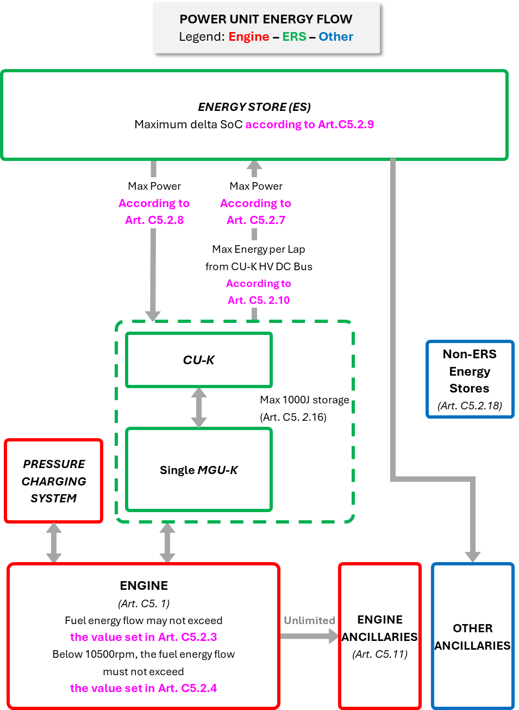
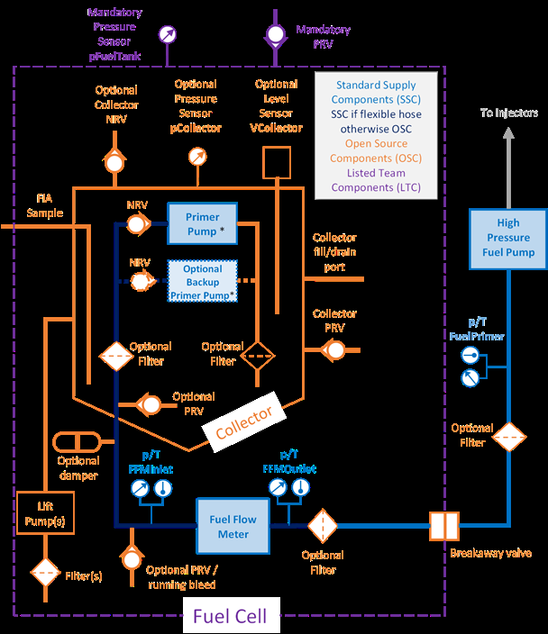
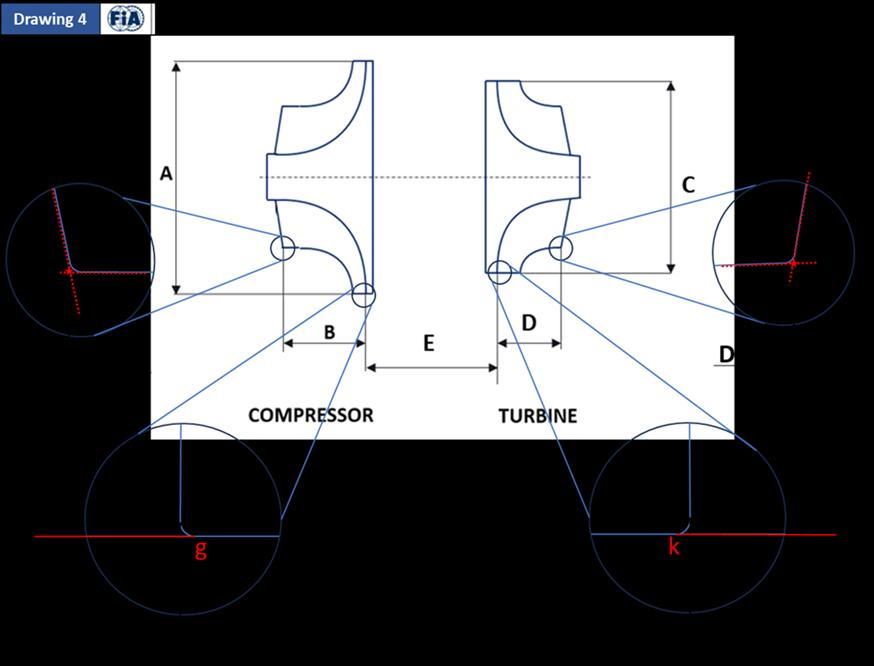
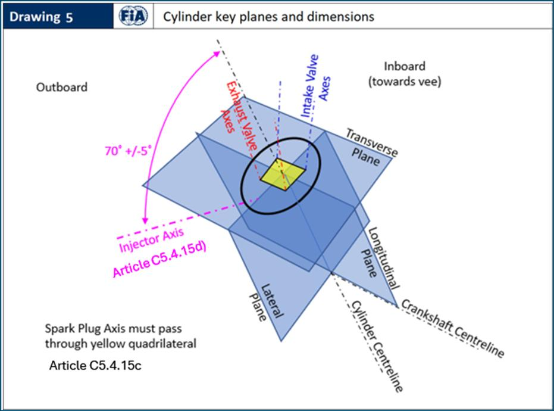
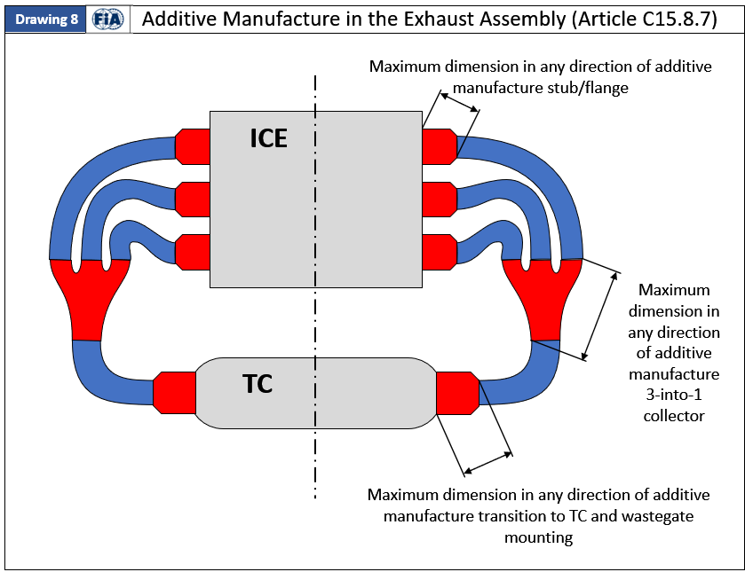
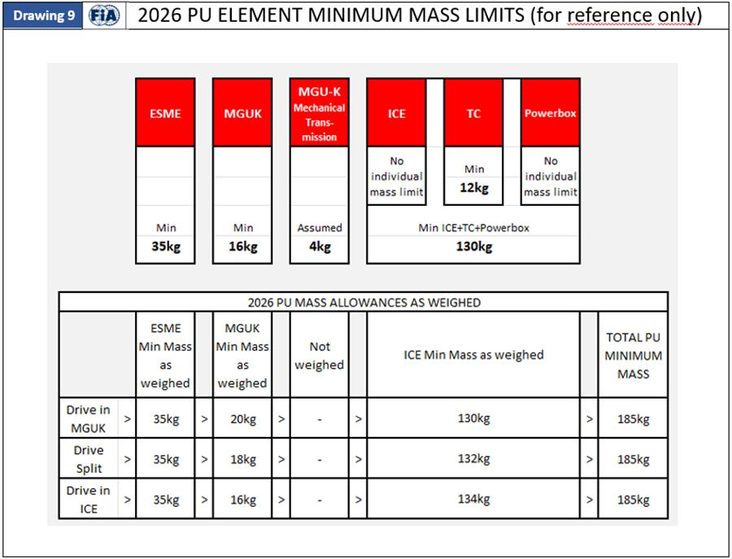
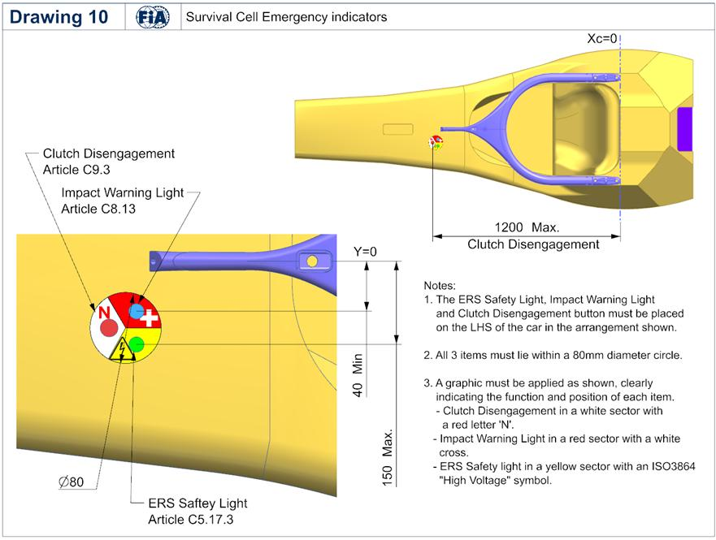
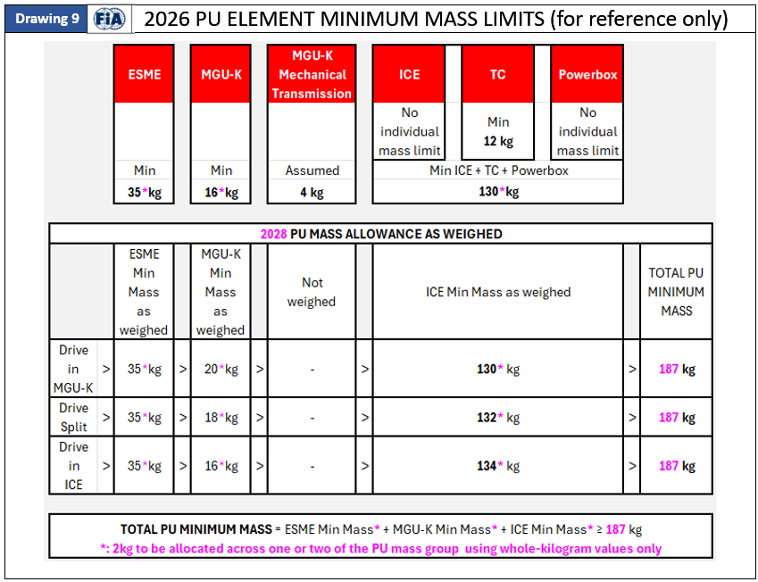

C 0 SECTION C: TECHNICAL REGULATIONS

SECTION C: TECHNICAL REGULATIONS

Version: Issue 01 Status: PUBLISHED Date: 25/06/2026 WMSC approval date: 23/06/2026

CONVENTION:

Black Text: Text unchanged from 2026 F1 technical Regulations - Section C Issue 19

Pink Text: Changes approved by the WMSC on 23/06/2026

Purple Text: Changes relative to 2026 regulations, approved by the WMSC at an earlier date

[Red Text]: Information on applicable Governance and relevant Advisory Committee

[Orange Text]: Reference information on relevant Guidance Document(s): non-binding and non-regulatory

[Green Text]: Comments / explanations / indication of further work: non-binding and non-regulatory

CONTENTS:

ARTICLE C1: GENERAL PRINCIPLES 8

C1.1 Amendments to these Technical Regulations 8

C1.2 Dangerous construction 8

C1.3 Compliance with the regulations 8

C1.4 New systems or technologies 8

C1.5 Duty of Competitor and PU Manufacturer 9

ARTICLE C2: CONVENTIONS AND FUNDAMENTAL DIMENSIONS 10

C2.1 Coordinate systems and conventions 10

C2.2 Principal Planes 11

C2.3 Fundamental Dimensions 11

C2.4 Reference Volumes and Surfaces 12

C2.5 Precision of Numerical Values 12

ARTICLE C3: AERODYNAMIC COMPONENTS 13

C3.1 Aerodynamic Components or Bodywork 13

C3.2 General Principles 13

C3.3 Legality Checking 16

C3.4 Component Definition 18

C3.5 Floor Bodywork 19

C3.6 Plank and Skids 25

C3.7 Front Bodywork 27

C3.8 Rear Bodywork 29

C3.9 Tail and Exhaust Tailpipe 31

2027 Formula 1 Regulations - Section C [Technical] 25 June 2026 C 1 ©2026 Fédération Internationale de l’Automobile Issue 01

C 0 SECTION C: TECHNICAL REGULATIONS

C3.10 Front Wing (FW) 32

C3.11 Rear Wing (RW) 40

C3.12 Final Assembly 44

C3.13 Bodywork not defined in Articles C3.5 to C3.12 45

C3.14 Wheel Components 46

C3.15 Wheel Bodywork Assembly 50

C3.16 Apertures 51

C3.17 Suspension and Driveshaft Fairings 53

C3.18 Aerodynamic Component Flexibility 56

C3.19 Aerodynamic Component construction 63

ARTICLE C4: MASS 64

C4.1 Minimum mass 64

C4.2 Mass distribution 64

C4.3 Ballast 64

C4.4 Adding during the Race or Sprint Session 65

C4.5 Reference Mass of the driver and Driver Ballast 65

C4.6 Heat Hazard Mass Increase 65

C4.7 Determination of Nominal Tyre Mass 65

ARTICLE C5: POWER UNIT 66

C5.1 Engine specification 66

C5.2 Power Unit Energy Flow 67

C5.3 Turbo Charger 72

C5.4 Power unit geometrical constraints and dimensions 73

C5.5 Mass and centre of gravity 76

C5.6 Engine intake air 77

C5.7 Variable geometry systems 77

C5.8 Exhausts 77

C5.9 Fuel systems 78

C5.10 Ignition systems 78

C5.11 Ancillaries 78

C5.12 Power unit torque or power demand 79

C5.13 Power unit control 80

C5.14 Engine high rev limits 81

C5.15 Starting the engine 82

C5.16 Stall prevention systems 82

C5.17 Energy Recovery System (ERS) 82

C5.18 MGU-K 84

C5.19 Energy Store 85

2027 Formula 1 Regulations - Section C [Technical] 25 June 2026 C 2 ©2026 Fédération Internationale de l’Automobile Issue 01

C 0 SECTION C: TECHNICAL REGULATIONS

C5.20 ES design and installation 86

C5.21 ERS General electrical safety 87

C5.22 Oil and coolant systems and charge air cooling 89

C5.23 Single ICE Mode 89

ARTICLE C6: FUEL SYSTEM 90

C6.1 Fuel tanks 90

C6.2 Fittings and piping 90

C6.3 Fuel tank fillers 91

C6.4 Refuelling 91

C6.5 Fuel draining and sampling 92

C6.6 Fuel System Hydraulic Layout 92

ARTICLE C7: OIL AND COOLANT SYSTEMS AND CHARGE AIR COOLING 95

C7.1 Location of lubricating oil tanks 95

C7.2 Location of lubricating oil system 95

C7.3 Oil and coolant lines 95

C7.4 Heat exchangers 95

ARTICLE C8: ELECTRICAL SYSTEMS 96

C8.1 Software and electronics inspection 96

C8.2 Control electronics 97

C8.3 Start systems 97

C8.4 Data acquisition 97

C8.5 Telemetry 98

C8.6 Driver inputs and information 99

C8.7 Master switch 100

C8.8 Driver radio 100

C8.9 Accident analysis 100

C8.10 Accident data 102

C8.11 FIA Marshalling system 102

C8.12 Track signal information display 102

C8.13 Impact warning system 103

C8.14 Installation of electrical systems or components 103

C8.15 Timing transponders 103

C8.16 Cameras and camera housings 103

C8.17 Electromagnetic radiation 105

C8.18 Sensor signals 105

ARTICLE C9: TRANSMISSION SYSTEM 106

C9.1 Fundamental provisions 106

2027 Formula 1 Regulations - Section C [Technical] 25 June 2026 C 3 ©2026 Fédération Internationale de l’Automobile Issue 01

C 0 SECTION C: TECHNICAL REGULATIONS

C9.2 Clutch control 106

C9.3 Clutch Disengagement System (CDS) 108

C9.4 Homologated Gearbox and Component Classification 108

C9.5 Gearbox Dimensions 109

C9.6 Gear ratios 109

C9.7 Reverse gear 110

C9.8 Gear changing 110

C9.9 Torque transfer systems 111

C9.10 Driveshafts 111

C9.11 Structural Connection to Survival Cell 111

ARTICLE C10: SUSPENSION, STEERING SYSTEMS, WHEELS AND TYRES 112

C10.1 Legality Setup 112

C10.2 Sprung suspension 112

C10.3 Outboard suspension 113

C10.4 Inboard suspension 115

C10.5 Steering 117

C10.6 Suspension Uprights 117

C10.7 Wheel rims 118

C10.8 Tyres 120

C10.9 Wheel attachment and retention 122

C10.10 Dimensions 122

ARTICLE C11: BRAKE SYSTEM 124

C11.1 Brake circuits and pressure distribution 124

C11.2 Brake callipers 124

C11.3 Brake discs and pads 125

C11.4 Brake pressure modulation 125

C11.5 Liquid cooling 125

C11.6 Rear brake control system 125

C11.7 Supply of Brake Friction and Brake System Hydraulic components 125

ARTICLE C12: SURVIVAL CELL 126

C12.1 General Requirements 126

C12.2 Survival cell specifications 126

C12.3 Intrusion Protection 129

C12.4 Roll Structures 130

C12.5 Cockpit Specification 132

C12.6 Cockpit Padding 133

C12.7 Front Floor Structure 135

C12.8 Seat fixing and removal 136

2027 Formula 1 Regulations - Section C [Technical] 25 June 2026 C 4 ©2026 Fédération Internationale de l’Automobile Issue 01

C 0 SECTION C: TECHNICAL REGULATIONS

C12.9 Driver Fit Information 136

ARTICLE C13: SAFETY STRUCTURES AND HOMOLOGATION 137

C13.1 General Principles 137

C13.2 Survival Cell Frontal Impact Test 139

C13.3 Roll Structure Testing 141

C13.4 Survival Cell Load Tests 144

C13.5 Side Impact Structure 149

C13.6 Front Impact Structure 152

C13.7 Rear Impact Structure 156

C13.8 Steering Column Impact Test 158

C13.9 Headrest Load Test 159

C13.10 Wheel Rim Impact Test 159

ARTICLE C14: SAFETY EQUIPMENT 161

C14.1 Fire Extinguishers 161

C14.2 Rear view mirrors 161

C14.3 Rear lights 162

C14.4 Safety Tethers 163

C14.5 Safety Harnesses 164

C14.6 Driver Cooling System 164

C14.7 Lateral Safety lights 165

C14.8 Driver’s Drink System 165

ARTICLE C15: MATERIALS 166

C15.1 General Principles 166

C15.2 Permitted Materials (Components Outside the PU Perimeter) 166

C15.3 Specific Prohibitions and Restrictions (Components Outside the PU Perimeter) 170

C15.4 Specific Exceptions (Components Outside the PU Perimeter) 171

C15.5 Prescribed and Homologated Laminates (Components Outside the PU Perimeter) 172

C15.6 Materials, processes and construction – General (Components inside the PU Perimeter) 173

C15.7 Materials and construction – Components (Components inside the PU Perimeter) 175

C15.8 Materials and construction – Pressure charging and exhaust systems (Components inside the PU

Perimeter) 176

C15.9 Materials and construction –ERS and electronic systems (Components inside the PU Perimeter) 177

ARTICLE C16: FUEL AND ENGINE OIL 179

C16.1 Basic principles 179

C16.2 Fuel properties 180

C16.3 Composition of the fuel 181

C16.4 Fuel approval 182

2027 Formula 1 Regulations - Section C [Technical] 25 June 2026 C 5 ©2026 Fédération Internationale de l’Automobile Issue 01

C 0 SECTION C: TECHNICAL REGULATIONS

C16.5 Fuel sampling and testing at a Competition 183

C16.6 Engine oil definitions 183

C16.7 Engine oil properties 184

C16.8 Composition of the engine oil 184

C16.9 Engine oil approval 185

C16.10 Sampling and testing at a Competition 185

C16.11 Recycling of Engine Oil 185

ARTICLE C17: COMPONENTS’ CLASSIFICATION 186

C17.1 General Principles 186

C17.2 Listed Team Components (LTC) 188

C17.3 Standard Supply Components (SSC) 189

C17.4 Transferable Components (TRC) and Free Supply Components (FSC) 190

C17.5 Open Source Components (OSC and OSCNT) 192

C17.6 Defined Specification Components (DSC) 193

C17.7 List of LTC, SSC, TRC, OSC, OSCNT, and DSC 195

ARTICLE C18: POWER UNIT COMPONENTS’ CLASSIFICATION 196

C18.1 General Principles 196

C18.2 Listed Power Unit Components (LPUC) 198

C18.3 Standard Supply Power Unit Components (SSPUC) 199

C18.4 Open-Source Power Unit Components (OSPUC) 200

C18.5 Defined Specification Power Unit Components (DSPUC) 202

C18.6 List of LPUC, SSPUC, OSPUC and DSPUC 203

APPENDIX C1: DEFINITIONS 204

APPENDIX C2: REGULATION VOLUMES 219

APPENDIX C3: DRAWINGS 235

APPENDIX C4: POWER UNIT SYSTEMS, FUNCTIONS, COMPONENTS AND SUPPLY PERIMETER 240

APPENDIX C5: HOMOLOGATION AND DEVELOPMENT OF POWER UNITS, FUEL AND OIL FOR 2026-2030 252

APPENDIX C6: COMPONENTS’ CLASSIFICATION AND PERIMETER 259

APPENDIX C7: APPROVED CHANGES FOR FUTURE YEARS 272

Changes Approved for 2028 272

C5.2 Power Unit Energy Flow 272

C5.3 Turbo Charger 272

C5.5 Mass and centre of gravity 273

2027 Formula 1 Regulations - Section C [Technical] 25 June 2026 C 6 ©2026 Fédération Internationale de l’Automobile Issue 01

C 0 SECTION C: TECHNICAL REGULATIONS

C15.8 Materials and construction – Pressure charging and exhaust systems (Components inside the PU

Perimeter) 273

APPENDIX C3: DRAWINGS 274

APPENDIX C4: POWER UNIT SYSTEMS, FUNCTIONS, COMPONENTS AND SUPPLY PERIMETER 275

2027 Formula 1 Regulations - Section C [Technical] 25 June 2026 C 7 ©2026 Fédération Internationale de l’Automobile Issue 01

C 0 SECTION C: TECHNICAL REGULATIONS

ARTICLE C1: GENERAL PRINCIPLES

Advisory Committee: TAC and PUAC Governance: F1 Commission / PU Manufacturers’ Governance Agreement / WMSC

C1.1 Amendments to these Technical Regulations

Any amendments to these Technical Regulations that do not relate specifically to the Power Unit or

that relate to matters of form rather than substance (such as re−numbering, reference corrections,

etc.) will not be subject to the approval of the PU Manufacturers. Any amendments to these

Technical Regulations that relate to substantive matters concerning the Power Unit will be subject

to the prior approval of the PU Manufacturers in accordance with the 2026 F1 PU Governance

Agreement, as referenced in Article 1.1 of Appendix A7.

C1.2 Dangerous construction

The stewards may prohibit the participation of a vehicle whose construction is deemed to be

dangerous. Should the relevant information become apparent during a session, such a decision

may apply with immediate effect.

C1.3 Compliance with the regulations

Formula 1 Cars must comply with these regulations in their entirety at all times during a

Competition.

Should a Competitor or PU Manufacturer introduce a new design or system or feel that any aspect

of these regulations is unclear, clarification may be sought from the FIA Formula One Technical

Department. If clarification relates to any new design or system, correspondence must include:

a. A full description of the design or system.

b. Drawings or schematics where appropriate.

c. The Competitor or PU Manufacturer's opinion concerning the immediate implications on other

parts of the car of any proposed new design.

d. The Competitor or PU Manufacturer's opinion concerning any possible long−term

consequences or new developments which may come from using any such new designs or

systems.

e. The precise way or ways in which the Competitor or PU Manufacturer feels the new design or

system will enhance the performance of the car.

C1.4 New systems or technologies

Any new system, procedure or technology not specifically covered by these Technical Regulations,

but which is deemed permissible by the FIA, will only be admitted until the end of the

Championship during which it is introduced. Following this the Formula One Commission will be

asked to review the technology concerned and, if they consider (in their sole discretion) that such

new system, procedure, or technology adds no value to Formula One in general, it may be

specifically prohibited by the FIA.

2027 Formula 1 Regulations - Section C [Technical] 25 June 2026 C 8 ©2026 Fédération Internationale de l’Automobile Issue 01

C 0 SECTION C: TECHNICAL REGULATIONS

C1.5 Duty of Competitor and PU Manufacturer

It is the duty of each Competitor to satisfy the FIA and the stewards that its Formula 1 Car complies

with these regulations in their entirety at all times during a Competition. With regard to PUs used

on a Formula 1 Car, this duty and responsibility also extends to the PU Manufacturer.

The design of the car, its components and systems shall, except for safety features, demonstrate

their compliance with these regulations by means of physical inspection of hardware or materials.

Unless explicitly requested by an Article, no mechanical design may rely upon software inspection

as a means of assessing compliance.

To further demonstrate compliance with Articles C3.2.2 and C3.18.1, Competitors may be required

to submit calculations, or to run with analytic devices specified by the FIA.

Due to their nature, the compliance of electronic systems may be assessed by means of inspection

of hardware, software, and data.

CAD models may be requested by the FIA to check compliance with the Regulations. Such models

should be supplied in a format and by a method specified by the FIA. In such cases, scanning

technology will be used by the FIA to check that the physical car is the same as the inspected CAD

models.

Each Competitor and each PU Manufacturer must ensure that all relevant personnel (whether

employee, consultant, contractor, secondee or any other type of permanent or temporary

personnel) associated with its participation in the Championship are appropriately informed with

respect to the ways in which their areas of responsibility may impact the compliance of the

Competitor and/or PU Manufacturer (as applicable) with the Regulations.

Each Competitor and each PU Manufacturer must ensure that the FIA ethics and compliance

hotline with respect to the Regulations is clearly communicated to all relevant personnel.

2027 Formula 1 Regulations - Section C [Technical] 25 June 2026 C 9 ©2026 Fédération Internationale de l’Automobile Issue 01

C 0 SECTION C: TECHNICAL REGULATIONS

ARTICLE C2: CONVENTIONS AND FUNDAMENTAL DIMENSIONS

Advisory Committee: TAC Governance: F1 Commission / WMSC

C2.1 Coordinate systems and conventions

C2.1.1 Car Coordinate System

The “Car Coordinate System” is a right−handed Cartesian [X, Y, Z] coordinate system and is

defined in the following way:

a. The X axis is the longitudinal direction of the car and increases rearwards.

b. The Y axis is the transverse direction of the car and increases to the (driver’s) right−hand side.

c. The Z axis is the vertical direction and increases upwards.

C2.1.2 Further conventions

a. If no units are specified, it is implicit the unit will be in millimetres

b. The terms “inboard” or “outboard”, when used in reference to the Y coordinate, respectively

refer to closer to or further away from the plane Y=0.

c. A suffix may be used for local coordinates in specific rules, (e.g. X , Y , Z ), where these local W W W axes are defined within a specific Article for local use.

d. Planes will be referred to as the axis to which they are normal to (e.g. X−Plane or X = 300 plane). A

e. A wheel is defined to be in the straight−ahead position when its rotational axis lies in an

X−Plane.

Unless otherwise specified:

f. the positive side of the Y axis is used in the various Articles and it is implicit that a symmetrical

rule applies for the other side of the car.

g. any measurements and references will be with the wheels in the straight−ahead position.

h. when a viewing direction is stated, “front” and “rear” are parallel to the X axis, “side” is parallel

to the Y axis (in the direction towards the plane Y = 0) and “above”, “below” and “plan” are

parallel to the Z axis.

i. directions of angles, slopes and incidences are taken in context of the right−handed Cartesian

coordinate system defined in C2.1.1. For example, a positive slope within a Y−Plane would be

characterised by positively increasing X and Z components.

j. references to axis aligned geometry are aligned to the Car Coordinate System defined in

C2.1.1.

k. a load vector ( [x, y, z]kN ) will have components parallel to the axes of the Car Coordinate

System.

C2.1.3 Wheel Coordinate System

The “Wheel Coordinate System” is a local right-handed Cartesian [X , Y , Z ] coordinate system W W W and is defined in the following way for each wheel:

2027 Formula 1 Regulations - Section C [Technical] 25 June 2026 C1 0 ©2026 Fédération Internationale de l’Automobile Issue 01

C 0 SECTION C: TECHNICAL REGULATIONS

a. The origin of the Wheel Coordinate System is the intersection of the rotational axis of the wheel

and the inboard plane of the Wheel Rim.

b. The X axis lies in the inboard plane of the Wheel Rim and increases in the rearward direction. W With the wheel in the straight−ahead position and the car at Legality Setup, the X axis is W parallel to the car’s X−Axis.

c. The Y axis is coincident with the wheel’s axis of rotation and increases towards the plane Y=0. W Referring to this axis, the terms “inboard” or “outboard” respectively refer to closer to or further

away from the plane Y = 0.

d. The Z axis lies in the inboard plane of the Wheel Rim and increases upwards. W

e. Once the Wheel Coordinate System is defined as above, then it maintains a fixed orientation

relative to the suspension upright at all other suspension articulations.

C2.2 Principal Planes

a. The Plane Z = 0 is defined as a horizontal plane sitting at the bottom of the sprung part of the

car, except for the Plank Assembly defined in Article C3.6.

b. The Plane Y = 0 is defined as the plane of symmetry of the car.

c. The Plane X = 0 is defined as the X−Plane that lies on the forward limit of the Survival Cell. A

d. The Plane X = 0 is defined as the X−Plane at the rear of the Cockpit. C

e. The planes X = 0 and X = 0 are defined as the X−Planes which respectively pass through the F R origin of the two front or two rear Wheel Coordinate Systems, with the wheels in the

straight−ahead position and the car at Legality Setup.

f. The plane X = 0 is defined as the X−Plane containing the axis of rotation of the final drive as DIF defined in Article C9.5.1.

g. The plane X = 0 is defined as the X−Plane which passes through the mounting face of the PU connections between the ICE and the Survival Cell, as defined in Article C5.4.17.

h. The plane X = 0 is defined as the X−plane passing through the forward most point of the Front FIS Impact Structure.

C2.3 Fundamental Dimensions

C2.3.1 Width

Except for the tyres, the Wheel Rims, and parts attached to the Wheel Rims as defined in Article

C10.7.6, no part of the car may lie more than 950mm from the plane Y=0 at Legality Setup.

C2.3.2 Height

Except for the Plank Assembly, no part of the car may lie directly below the Trim and Combination

of the following Reference Volumes:

a. RV-FLOOR-BODY.

b. RV-FLOOR-BIB.

c. RV-FLOOR-FOOT.

2027 Formula 1 Regulations - Section C [Technical] 25 June 2026 C1 1 ©2026 Fédération Internationale de l’Automobile Issue 01

C 0 SECTION C: TECHNICAL REGULATIONS

d. RV-FLOOR-SIDEWALL.

e. RV-FLOOR-FENCE.

C2.3.3 Wheelbase

The distance between the planes X = 0 and X = 0 must be less than or equal to 3400mm at Legality F R Setup.

C2.3.4 Front Wheel Position

The plane X = 0 must lie between X = 0 and X = 150 inclusive. F A A

C2.3.5 Cockpit Position

The distance between X = 0 and X = 0 must be greater than or equal to 1830mm and less than or A C equal to 2030mm.

C2.3.6 Rear Bulkhead Position

The distance between X = 0 and X = 0 must be greater than or equal to 360mm. C PU

C2.3.7 Exhaust Exclusion Zone

Except for Tailpipe, no part of the car may lie within a right circular cylinder which intersects the

planes X = 385 and X = 800, and whose axis is identical to, and diameter 20mm greater than, that R DIF of the right circular cylinder defined in C3.9.2(g).

C2.4 Reference Volumes and Surfaces

“Reference Volumes” and “Reference Surfaces” and their position in space are defined in

Appendix C2 using the Car Coordinate System and are used throughout the Regulations for

geometrical constraints. For convenience, Reference Volumes are preceded by the prefix “RV−”

and Reference Surfaces by the prefix “RS−”.

C2.5 Precision of Numerical Values

Any numerical values specified in these Regulations as limits (maxima or minima), will be

considered to be the limits regardless of the decimals quoted.

2027 Formula 1 Regulations - Section C [Technical] 25 June 2026 C1 2 ©2026 Fédération Internationale de l’Automobile Issue 01

C 0 SECTION C: TECHNICAL REGULATIONS

ARTICLE C3: AERODYNAMIC COMPONENTS

Advisory Committee: TAC Governance: F1 Commission / WMSC

C3.1 Aerodynamic Components or Bodywork

“Aerodynamic Components” or “Bodywork” are parts of the car in contact with the External Air

Stream.

a. The following components are Bodywork:

i. all components described in Article C3.

ii. inlet or outlet cooling ducts, up to the component they provide cooling for.

iii. inlet ducts for the Power Unit (air boxes) up to the air filter.

iv. primary heat exchangers, as defined in Article C7.4.1 (b).

b. The following components are not Bodywork:

i. cameras and camera housings, as defined in Article C8.16.

ii. rear view mirrors as defined in Article C14.2.

iii. the ERS status light.

iv. parts associated with the mechanical functioning of the Power Train, transmission of

power to the wheels, and the steering system, provided none are designed to achieve an

aerodynamic effect.

v. Wheel Rims and tyres.

vi brake disc assemblies, calipers, and pads.

vii CCU Antenna

C3.2 General Principles

C3.2.1 Objectives of Article C3

The primary objectives of Article C3 are:

a. to promote close racing by minimising the aerodynamic performance loss when one car

follows another.

b. to ensure aerodynamic performance remains compatible with the performance of the PU.

To assess these objectives, F1 Teams may be asked to provide relevant information to the FIA upon

request.

The Intellectual Property of this information remains with the F1 Team, will be protected, and will

not be disclosed to any third parties.

C3.2.2 Aerodynamic Influence

Except for the driver-adjustable bodywork specified in Articles C3.10.10 and C3.11.6 when in a

State of Deployment only, minimal parts related to their operation, and Aerodynamic and flexible

2027 Formula 1 Regulations - Section C [Technical] 25 June 2026 C1 3 ©2026 Fédération Internationale de l’Automobile Issue 01

C 0 SECTION C: TECHNICAL REGULATIONS

seals allowed by Articles C3.10.11, C3.14, C3.16.3 and C3.17.7, all Aerodynamic Components or

Bodywork must:

a. be rigidly constructed and immobile relative to their defined Frame of Reference defined in

Article C3.4.

b. provide a uniform, solid, hard, continuous, and impervious surface at all times.

Where an Aerodynamic Component complies with a test defined in Article C3.18, it will be

considered compliant with (a) above for the deflection tested.

Any device or structure designed to bridge the gap between the sprung part of the car and the

ground is strictly prohibited.

Apart from necessary parts for the adjustments described in Articles C3.10.10 and C3.11.6, and

incidental movements from the steering system, any car system, device, or procedure that alters

the aerodynamic characteristics of the car through driver movement is forbidden.

Furthermore, the aerodynamic effect of any component not classified as Bodywork must be

incidental to its primary function. Designs intended to enhance any such aerodynamic effects are

prohibited.

C3.2.3 Symmetry

All Bodywork must be nominally symmetrical with respect to Y = 0. Therefore, unless otherwise

specified, any regulation in Article C3 concerning one side of the car will be assumed to be valid for

the other side of the car including references to the maximum number of components allowed per

side. Furthermore, any Aerodynamic Surfaces intersecting Y = 0 must be Tangent Continuous

across this plane.

Minimal exceptions to the requirement of symmetry of this Article will be accepted for the

installation of non-symmetrical mechanical components, for asymmetrical cooling requirements

or for asymmetrical angle adjustment of the FW Primary and Secondary Flap, provided this

adjustment is not controlled by the FIA Standard ECU.

Bodywork on the Unsprung Mass must respect this Article when the suspension position of each

wheel is virtually reorientated so that its Wheel Coordinate System axes are parallel to their

respective axis of the Car Coordinate system.

C3.2.4 Component Bodywork

Unless otherwise stated, all individual Bodywork Components described in Articles C3.5, C3.7 to

C3.11, and Article C3.14, prior to any Trim and Combination operations, and before the addition of

Apertures, must:

a. be single volumes that are simply connected.

b. in any X, Y and Z plane, or any X , Y and Z plane for Wheel Bodywork, only contain a single W W W section.

C3.2.5 Trim and Combination

A “Trim and Combination” operation can only be performed once the parts to be trimmed are fully

defined. The only regions of a volume that can be removed as part of a trimming process are those

2027 Formula 1 Regulations - Section C [Technical] 25 June 2026 C1 4 ©2026 Fédération Internationale de l’Automobile Issue 01

C 0 SECTION C: TECHNICAL REGULATIONS

that are internal to the body they are trimmed by. Once parts are trimmed and combined, and any

Fillet Radius or Edge Radius permitted by the relevant Article is applied, the resultant volume must

maintain both continuity and tangency in any X, Y, and Z plane at the boundaries between the

adjacent sections of the parts. Unless otherwise stated:

a. The elective trimming of volumes beyond or outside of any overlap is not permitted.

b. Trim and Combination operations must result in a single volume.

C3.2.6 Fillet and Edge Radius

A “Fillet Radius” is formed by rounding an internal corner (included angle less than 180 degrees)

with a concave surface by only adding material, whilst an “Edge Radius” is created by smoothing

an external corner (included angle greater than 180 degrees) with a convex surface by only removing

material.

In both instances, the resulting surface must consist of arcs that adhere to specified radius limits,

connect two fully defined surfaces tangentially without inflection, and align perpendicularly to their

intersection. Unless otherwise stated, both Fillet and Edge Radii may vary in size along the

boundary perimeter, but these changes must be continuous.

If a discontinuity in tangency exists at the trailing edge where a Fillet Radius has joined parts, a

Closed Aerodynamic Fairing may be added immediately behind the trailing edge. This fairing must:

a. maintain both continuity and tangency with the filleted parts.

b. fit within an Acute Circular Cone whose:

i. base radius is 1.2 times the minimum radius necessary to fully enclose the preceding Fillet

Radii and any trailing edge immediately adjacent to the Fillet Radii.

ii. height is three times the maximum trailing edge Fillet Radius.

c. comply with Article C3.2.4 (a).

C3.2.7 Pressure Tappings

Pressure measuring apertures are permitted on the car, provided they:

a. have an internal diameter of no more than 2mm.

b. are flush with the underlying geometry.

c. are only connected to pressure sensors or are completely blanked.

C3.2.8 Section and Article Titles

Section and Article Titles within Article C3 have no regulatory value.

C3.2.9 Tangency Continuity

Unless otherwise stated, the Aerodynamic Surfaces of all Bodywork and sub-bodywork

components described in C3.5 to C3.11, and C3.14 to C3.15, must maintain Tangency

Continuity.

If two adjacent surfaces are not tangent continuous but can become so by applying an Edge

Radius or Fillet Radius of up to 1mm along their boundary, they will be considered Tangent

2027 Formula 1 Regulations - Section C [Technical] 25 June 2026 C1 5 ©2026 Fédération Internationale de l’Automobile Issue 01

C 0 SECTION C: TECHNICAL REGULATIONS

Continuous at this boundary, provided the addition of these radii do not contravene any relevant

Articles.

C3.3 Legality Checking

C3.3.1 Digital legality checking

Assessment of geometric compliance with Article C3 will be carried out digitally using CAD models

provided by the teams. In these models:

a. Components may only be designed to the edge of a Reference Volume, or with a precise

geometrical feature, or to the limit of a geometrical criterion (save for the normal round-off

discrepancies of the CAD system), when the regulations specifically require an aspect of the

bodywork to be designed to this limit, or it can be demonstrated that the design does not rely

on lying exactly on this limit to conform to the regulations, such that it is possible for the

physical bodywork to comply.

b. Components that must follow a precise shape, surface or plane, must be designed without any

tolerance, save for the normal round-off discrepancies of the CAD system.

c. Bodywork required to be visible from a prescribed direction may include surfaces parallel to

that direction, provided it can be shown that such parallel surfaces could instead be drawn at

an infinitesimally small, included angle and still comply with all relevant Articles.

C3.3.2 Physical legality checking

Cars may be measured during a Competition to check their conformance to the CAD models

discussed in Article C3.3.1 and/or to ensure they remain inside the Reference Volumes. All

measurement will be made relative to the coordinate system determined by the datum points

required by C3.3.3.

a. Unless otherwise stated, a tolerance of ±3mm will be accepted for manufacturing purposes

only with respect to the CAD surfaces. Where measured surfaces lie outside of this tolerance

but remain within the Reference Volumes, an F1 Team may be required to provide additional

information (e.g. revised CAD geometry) to demonstrate compliance with the regulations. Any

discrepancies contrived to create a special aerodynamic effect or surface finish are not

permitted.

b. Irrespective of (a), geometrical discrepancies at the limits of the Reference Volumes must be

such that the measured component remains inside the Reference Volume.

c. A positional tolerance of ±2mm will be accepted for the Front Wing Bodywork, Rear Wing

Bodywork, Exhaust Tailpipe, Floor Bodywork behind X = −335, and Tail. This will be assessed R by realigning each of the groups of Reference Volumes and Reference Surfaces that define the

assemblies, by up to 2mm, from their original position, to best fit the measured geometry.

d. Irrespective of (b), a tolerance of Z = ±2mm will be accepted for parts of the Floor Bodywork

forward of X =−335 and Plank Assembly, visible from below. R

e. Minimal discrepancies from the CAD surfaces will also be accepted in the following cases:

i. Minimal repairs carried out on Aerodynamic Components and approved by the FIA.

2027 Formula 1 Regulations - Section C [Technical] 25 June 2026 C1 6 ©2026 Fédération Internationale de l’Automobile Issue 01

C 0 SECTION C: TECHNICAL REGULATIONS

ii. Tape, provided it does not achieve an aerodynamic effect not otherwise permitted by

Article C3.

iii. Junctions between Bodywork panels.

iv. Local Bodywork fixing details.

C3.3.3 Datum Points

All cars must be equipped with optical target mountings in the following locations. Unless

otherwise stated, all positions have two targets positioned symmetrically about Y = 0.

All datum points must be accessible without removing bodywork. It is acceptable to cover the

points with tape or with quickly removable covers.

a. On the top of the Survival Cell, more than 80mm from Y=0, and between X = 0 and X = 300. A A

b. On the top of the Survival Cell, more than 140mm from Y = 0, and close to X = −875. C

c. On the side of the Survival Cell with X < 1200. A

d. On the side of the Survival Cell close to the rear mounts of the Secondary Roll Structure.

e. Within an axis-aligned cuboid with an interior diagonal defined by points [X = 0, −40, 1120] and C [X = 150, −175, 840]. C

f. On the lower surface of the Survival Cell, symmetrically about Y = 0, between X = 0 and X = A A 500, and more than 10mm from Y = 0.

g. On the lower surface of the Survival Cell, symmetrically about Y = 0, between X = −300 and X C C = 100, and more than 150mm from Y = 0.

h. A single probed point on the RIS or Gearbox Case.

In all cases, a file containing the coordinates of the required datum points must be supplied for

each Survival Cell.

Full details of the requirements are given in the document FIA-F1-DOC-007.

C3.3.4 Supports for Scrutineering

All cars must be equipped with 4 pads of diameter 20mm that will be used to support the car during

scrutineering. The pads:

a. must be rigidly mounted to the Survival Cell, ICE or Gearbox Case as appropriate.

b. must be on a Z-Plane between Z=2 and Z=10 and will be used to determine the location of the

plane Z = 0 when inspecting the underside of the car.

c. must have an M8x1.25 hole in the centre with at least 4 complete threads.

d. must be in the following locations:

i. two positioned symmetrically about Y = 0, at the same X-Plane as the centre of the central

hole in the plank assembly, defined in C3.6.1 (c) and 150mm from Y = 0.

ii. two positioned symmetrically about Y = 0 at the same X-plane as the centre of the

rearmost hole in the plank assembly, defined in C3.6.1 (c) and 105mm from Y = 0.

2027 Formula 1 Regulations - Section C [Technical] 25 June 2026 C1 7 ©2026 Fédération Internationale de l’Automobile Issue 01

C 0 SECTION C: TECHNICAL REGULATIONS

Details of the mounting requirements are given in the document FIA-F1-DOC-007.

C3.4 Component Definition

The permitted bodywork and relevant Frame of Reference for each group is defined in the following

Articles.

C3.4.1 Bodywork part of the sprung mass of the car

The only permissible Sprung Mass Bodywork is defined under Articles C3.5 to C3.13 and Articles

C3.1.1 (a) (ii) to (iv). The Frame of Reference for all Sprung Mass Bodywork is the Car Coordinate

System.

Any Bodywork subject to Final Assembly as per Article C3.12, must first be classified under one of

the groups specified in Articles C3.5 to C3.11.

Compliance of each Bodywork component with Article C3 will be assessed independently and

before any Trim and Combination operations and Fillet application described in Article C3.12, and

any Aperture application described in Article C3.16.

Compliance of the Aerodynamic Surfaces of each Bodywork component with Article C3 will be

assessed independently and after their boundaries have been defined by Trim and Combination

operations and Fillet application described in Article C3.12, and before any Aperture application

described in Article C3.16.

Furthermore, the use of components not defined as Bodywork to achieve compliance with the

Bodywork regulations is not permitted. The FIA may request to inspect any removed geometry post-

assembly.

After final assembly, provided any modification does not result in the surfaces becoming

Aerodynamic Surfaces, modifications are allowed to the following:

a. Ducts (as specified in C3.1 (a) (ii) and C3.1 (a) (iii).

b. Non-Aerodynamic Surfaces.

C3.4.2 Wheel Bodywork

The only permissible Wheel Bodywork is defined in Articles C3.14 and C3.15. The Frame of

Reference for all parts classified as Wheel Bodywork is the Wheel Coordinate System.

C3.4.3 Suspension Fairings

The only permissible Suspension Fairings are defined in Article C3.17. To assess compliance with

Article C3.2.2, the Frame of Reference of any Suspension Fairing is the structural suspension

member that it is attached to.

C3.4.4 Hanger

“Hanger” Bodywork, where permitted under the relevant Articles, is exempt from Article C3.2.4 (b),

but must:

a. lie in its entirety within an individual, freely positioned instance of RV-HANGER.

b. be rigidly fixed to any bodywork it intersects.

2027 Formula 1 Regulations - Section C [Technical] 25 June 2026 C1 8 ©2026 Fédération Internationale de l’Automobile Issue 01

C 0 SECTION C: TECHNICAL REGULATIONS

c. within a the plane of symmetry of RV-HANGER situated between the two largest faces of RV-

HANGER, connect two non-intersecting bodywork sections.

C3.5 Floor Bodywork

C3.5.1 Floor Body

“Floor Body” Bodywork must:

a. lie in its entirety within RV-FLOOR-BODY.

b. when viewed from below, fully obscure:

i. RV-PU-ICE

ii. RV-DIFF.

c. have up to two sections in any Z-Plane.

C3.5.2 Floor Foot

“Floor Foot” Bodywork must:

a. lie in its entirety within RV-FLOOR-FOOT.

b. when viewed from above, fully obscure RS-FLOOR-FOOT.

c. have up to two sections in any Z-Plane.

C3.5.3 Floor Sidewall

“Floor Sidewall” Bodywork must:

a. lie in its entirety within RV-FLOOR-SIDEWALL.

b. have up to two sections in any Y-Plane.

c. forward of X = 250 and above Z = 100, have up to two sections in any Z-Plane. R

C3.5.4 Main Floor

“Main Floor” results from the Trim and Combination of the following components:

a. Floor Body.

b. Floor Foot.

c. Floor Sidewall.

A Fillet Radius, no greater than 30 mm, may be applied along the intersections between the

remaining component parts.

Once fully defined, Main Floor must:

d. be a single, simply connected volume, with no overlapping regions.

e. be fully visible from either above or below, such that any surface obscured from one direction

is visible from the other.

f. when viewed from the side, fully obscure RS-FLOOR-SIDEWALL.

Main Floor Aerodynamic Surfaces must:

2027 Formula 1 Regulations - Section C [Technical] 25 June 2026 C1 9 ©2026 Fédération Internationale de l’Automobile Issue 01

C 0 SECTION C: TECHNICAL REGULATIONS

g. contain no radius of curvature less than 25mm, except for regions:

i. within 5mm of the plan-view-boundary of Main Floor, when viewed from above or below.

ii. within 45mm of a single point that lies in RV-FLOOR-SPHERE.

iii. of convex curvature, visible from above, and within 10mm of the load application points

defined in Article C3.18.6.

iv. within 5mm of the Fillet Radii permitted as part of the Main Floor Trim and Combination,

where the radius of curvature must be no less than 5mm.

C3.5.5 Floor Board

“Floor Board” Bodywork must:

a. lie in its entirety within RV-FLOOR-BOARD.

b. have up to three sections in any X, Y and Z-Plane.

Floor Board Aerodynamic Surfaces visible from the side must:

c. rearward of X = 825, at any point, in any Z-Section have a: F

i. normal with a positive X component.

ii. tangent that forms an angle of at least 15 degrees to the X-Axis.

d. contain no concave radius of curvature less than 100mm.

Furthermore:

e. compliance with (c) and (d) is not required within 35mm of up to three points, which must sit

forward of X = 1100 and be no closer than 50mm to each other. F

C3.5.6 Floor Bib

“Floor Bib” Bodywork must:

a. lie in its entirety within RV-FLOOR-BIB.

b. be fully visible from either above or below, such that any surface obscured from one direction

is visible from the other.

Floor Bib Aerodynamic Surfaces must:

c. contain no concave radius of curvature:

i. visible from below.

ii. less than 50mm, if visible from above.

C3.5.7 Floor Leading Edge Device

“Floor Leading Edge Device” Bodywork must:

a. lie in its entirety within RV-FLOOR-LED.

b. have up to five three sections in any X and Z-Plane.

2027 Formula 1 Regulations - Section C [Technical] 25 June 2026 C2 0 ©2026 Fédération Internationale de l’Automobile Issue 01

C 0 SECTION C: TECHNICAL REGULATIONS

c. above Z = 60, be no less than 4mm thick when measured normal to Floor Leading Edge Device

Aerodynamic Surfaces only.

Floor Leading Edge Device Aerodynamic Surfaces above Z = 60 must:

d. contain no convex radius of curvature less than 2mm

C3.5.8 Floor Winglet

“Floor Winglet” Bodywork, which is exempt from Article C3.2.4, must be fitted and results from

the Trim and Combination of the following components:

a. RS-FLOOR-WINGLET.

b. “Winglet Profile”, which must:

i. lie in its entirety within RV-FLOOR-WINGLET.

ii. contain no more than a single section in any X, Y and Z-Plane.

c. A single Hanger, which must:

i. when viewed from below, be fully obscured by RS-FLOOR-WINGLET.

Furthermore, Winglet Profile Aerodynamic Surfaces must:

d. contain no concave radius of curvature less than 20mm.

Once Trimmed and Combined, Floor Winglet and the annotated surface ‘TRIM-SURFACE’ may only

be modified together, and in the following order:

e. Rotated by ±5 Degrees about a Y-aligned axis that passes though the point [X , Z] = [295, 200] R

f. Translated by ±10mm in Z.

Furthermore, Floor Winglet may be:

g. trimmed below the annotated surface ‘TRIM-SURFACE’ in RS-FLOOR-WINGLET.

Once fully defined, Floor Winglet must:

h. have up to two sections in any Z-Plane below the annotated surface ‘TRIM-SURFACE’ in RS-

FLOOR-WINGLET.

i. except for C3.5.8(c), lie in its entirety within RV-FLOOR-WINGLET-ENVELOPE.

C3.5.9 Floor Fence

“Floor Fence” Bodywork must:

a. lie in its entirety within:

i. an axis aligned cuboid of the following dimensions [X, Y, Z] = [450, 40, 200]

ii. RV-FLOOR-FENCE.

b. be fully visible from either above or below, such that any surface obscured from one direction

is visible from the other.

c. have up to two sections in any Y-Plane.

2027 Formula 1 Regulations - Section C [Technical] 25 June 2026 C2 1 ©2026 Fédération Internationale de l’Automobile Issue 01

C 0 SECTION C: TECHNICAL REGULATIONS

Furthermore,

d. when considering a section formed by the intersection with any Z-Plane, within 100mm of the

rearmost point of the section, a line tangent to any part of the section visible from the side must

not form an angle greater than 5 degrees, when measured against the X-axis.

C3.5.10 Floor Corner

“Floor Corner” Bodywork is exempt from Article C3.2.4, but must:

a. lie in its entirety within RV-FLOOR-CORNER.

b. have up to 3 sections in any X-Plane.

c. have up to 4 sections in any Y-Plane.

d. have up to 2 sections in any Z-Plane.

C3.5.11 Floor Tyre IR Sensor

“Floor Tyre IR Sensor” Bodywork must:

a. lie in its entirety within a freely positioned instance of RV-FLOOR-TYRE-IR.

b. not lie within RV-FLOOR-CORNER.

c. be fully obscured by RS-FLOOR-BODY when viewed from above.

d. fully enclose an infra-red sensor for measuring tyre temperature.

Floor Tyre IR Sensor Aerodynamic Surfaces must:

e. contain no radius of curvature less than 20mm.

C3.5.12 Floor Bodywork Assembly

“Floor Bodywork Assembly” results from the Trim and Combination of the following components:

a. Main Floor.

b. Floor Bib.

c. Floor Leading Edge Device.

d. Floor Fence.

e. Floor Board.

f. Floor Winglet.

g. Floor Corner.

h. Floor Tyre IR Sensor, if fitted.

Before trimming, the following must be discarded:

i. any Floor Fence remaining above Main Floor.

j. any Floor Board remaining below Main Floor.

k. any Floor Winglet remaining inboard of Floor Sidewall.

l. any Main Floor remaining within RV-FLOOR-CORNER.

2027 Formula 1 Regulations - Section C [Technical] 25 June 2026 C2 2 ©2026 Fédération Internationale de l’Automobile Issue 01

C 0 SECTION C: TECHNICAL REGULATIONS

m. any Floor Tyre IR Sensor remaining below Main Floor.

A Fillet Radius, no greater than 25mm, may be applied along the intersections between the

remaining component parts.

Once fully defined, Floor Bodywork Assembly must:

n. be a single volume, with no overlapping regions.

o. when viewed from below, fully obscure RS-FLOOR-BODY.

p. when viewed from below, be coincident with the surfaces of RV-FLOOR-BODY that are visible

from below and directly beneath:

i. RS-FLOOR-REF.

ii. RS-FLOOR-STEP.

q. forward of X = 1500, when viewed from the rear, fully obscure Floor Leading Edge Device. F

r. when viewed from the side, fully obscure RS-FLOOR-BOARD.

C3.5.13 Floor Bodywork Group

Once the components defined in Articles C3.5.1 to C3.5.12 have been constructed in accordance

with these provisions, including any sub-assembly operations, the resulting union is defined as

“Floor Bodywork”.

C3.5.14 Floor Auxiliary Components

Once Floor Bodywork has been fully defined and Final Assembly in Article C3.12 completed, the

following “Floor Auxiliary Components”, which are exempt from Article C3.2.4 (b), may be fitted:

a. Up to three “Floor Body Stays”, which may be designed to only take load in tension, and each

of which must:

i. have a single inboard attachment location point anywhere on the Sprung Mass except

Floor Bodywork that lies between X = 1775 2500 and X = 275 250, inboard of Y = 400 and F R above Z = 175.

ii. be fixed on its inboard end to the entirely sprung part of the car.

ii. be fixed on its outboard end to have a single outboard attachment point that lies on Floor

Bodywork between X = 2500 and X = 250. F R

iii. have a circular cross section and lie in its entirety within a 5mm diameter right circular

cylinder, except within 25mm of the inboard and outboard attachment points, or within

10mm of any adjustment mechanism.

iv. when viewed from below, be fully obscured with Floor Bodywork in place.

v. not intersect any surfaces of Bodywork, except within 25mm of the inboard and outboard

attachment points, and within 7mm of up to two points which lie on the Engine Cover.

b. Up to eight Hangers, each of which must:

i. intersect Floor Board.

2027 Formula 1 Regulations - Section C [Technical] 25 June 2026 C2 3 ©2026 Fédération Internationale de l’Automobile Issue 01

C 0 SECTION C: TECHNICAL REGULATIONS

ii. lie no closer than 50mm to any other Hanger.

iii. when viewed from the side and below, be fully obscured with Floor Bodywork in place.

iv. lie in its entirety within the union of RV-FLOOR-BOARD and RV-FLOOR-FOOT.

c. A single “Floor Board Brace”, which must:

i. lie in its entirety within a 40mm diameter right circular cylinder and RV-FLOOR-BRACE,

except within 2mm of Forward Chassis and 35mm of the intersection point of the right

circular cylinder’s axis and Forward Chassis.

ii. be rigidly fixed at its inboard end to Forward Chassis.

iii. be rigidly fixed at its outboard end to Floor Board.

iv. when viewed from the side, be fully obscured with Floor Bodywork in place, except within

2mm of Forward Chassis and 35mm of the intersection point of the right circular cylinder’s

axis and Forward Chassis.

d. A single fairing, if necessary, to shroud the single device permitted in Article C12.7, which

must:

i. be fully within RV-BIB-STAY and be symmetrically arranged about Y = 0.

ii. in any Z-plane contain only one section.

e. A single “Floor Foot Stay”, which may be designed to only take load in tension, must:

i. have a single inboard attachment point that lies no more than 25mm distant from the

intersection of Floor Board Brace and Forward Chassis, or in the absence of a Floor Board

Brace, within RV-FLOOR-BRACE.

ii. be fixed at its inboard end to Forward Chassis.

iii. be fixed at its outboard end to Floor Foot.

iv. when viewed from the side, be fully obscured with Floor Bodywork in place.

v. lie in its entirety within a 10mm diameter right circular cylinder, except within 25mm of the

inboard and outboard attachment points, or within 10mm of any adjustment mechanism.

Furthermore, once all Floor Auxiliary Components have been defined:

f. they must be Trimmed and Combined with any Bodywork they intersect.

g. a Fillet Radius no greater than 20mm, may be applied along the intersections between Floor

Auxiliary Components and any other Bodywork 5mm may be applied along the intersections

between Floor Body Stays and any other Bodywork. Fillet radii, not greater than 20mm, may be

applied along the intersections between any other Floor Auxiliary Component and any other

Bodywork.

2027 Formula 1 Regulations - Section C [Technical] 25 June 2026 C2 4 ©2026 Fédération Internationale de l’Automobile Issue 01

C 0 SECTION C: TECHNICAL REGULATIONS

C3.6 Plank and Skids

C3.6.1 Plank Assembly

A “Plank Assembly” must be fitted, consisting of the Plank, Skids and mountings.

The following provisions apply to the Plank Assembly:

a. The upper surface of the Plank Assembly must lie at Z = 0, and must not be in contact with the

External Air Stream.

b. The geometry of the Plank Assembly must conform to RV-PLANK with a general manufacturing

tolerance of ±0.5mm when new, unless a specific dimensional tolerance is defined.

c. The Plank Assembly must have three 34mm diameter holes whose axes are parallel to the

Z−axis. The centres must lie on Y = 0 and have X-locations:

i. X = 500 800, F

ii. −600 ≥ X ≥ −800, and on or behind X =1000. C F

iii 470 ≤ X ≤ 630. Furthermore, the centre of the rearmost hole must lie and on or ahead of PU X = −500. R

d. The thickness of the Plank Assembly measured normal to the lower surface must be 10mm ±

0.2mm and must be uniform when new. A minimum thickness of 8mm will be accepted due to

wear, and conformity to this provision will be checked at the peripheries of the holes required

by (c) above.

Evaluation of Skid wear will be made by physical measurement of the Skid with it removed from

the car. The Measurement will be made with a micrometer with a 6.35mm diameter anvil.

When measured in this way, the entire periphery of each hole must be within the specified

tolerance.

Four additional 10mm diameter holes are permitted provided their sole purpose is to allow access

to the bolts which secure the FIA ADR to the Survival Cell.

C3.6.2 Plank

The following provisions apply to the “Plank”:

a. The material of the Plank is defined in C15.3.5. free, but it must be homogeneous with a

specific gravity between 1.3 and 1.45, or if pocketed be made from a bonded assembly the

upper 0.5mm of which must have a specific gravity of between 1.3 and 1.65 and the remainder,

excluding pockets, be made from a homogeneous material with a specific gravity of between

1.3 and 1.45.

b. The Plank may comprise no more than three pieces, the forward one of which may not be any

less than 900mm 600mm in length.

c. Between X = 630 930 and X = −800 and behind X = −400, pocketing of the Plank is permitted F C C between Z=-7 and Z=-0.5. The periphery of any pocket, in any Z-Plane, must be not less than

10mm from either the edges of the Plank or any holes or recesses in the Plank. In any vertical

plane, the internal pocket Fillet Radii must be at least 3mm and in any Z-Plane, must be at least

10mm. Pockets may only be filled with a material having a specific gravity of less than 0.25.

2027 Formula 1 Regulations - Section C [Technical] 25 June 2026 C2 5 ©2026 Fédération Internationale de l’Automobile Issue 01

C 0 SECTION C: TECHNICAL REGULATIONS

C3.6.3 Skids

The lower surface of the Plank may be fitted with flush mounted Skid material which can only be

fitted in place of plank material. “Skids” may only be fitted around each of the 3 holes defined in

C3.6.2.c and must conform to the geometries specified below.

A metallic Skid is mandatory around the forward-most Plank hole. A metallic Skid is optional around

the middle and rearward-most Plank holes. If a metallic Skid is not present, it may be either;

replaced with a separate piece of Plank material, or integrated into the Plank. The resulting

geometry must contain the hole and counterbore detail present in RV-SKID-MID and RV-SKID-

REAR.

a. The Skid material around the forward-most hole in the plank must:

i. be made to the geometry defined by RV-SKID-FWD and associated drawing.

ii. be divided into three separate parts as defined in the Reference Volume.

iii. fastened directly to the Front Floor Structure with zero degrees of freedom

b. If metallic, the Skid material around the central hole in the plank must:

i. be made to the geometry defined by RV-SKID-MID and associated drawing.

ii. be divided into three separate parts as defined in the Reference Volume.

c. If metallic, the Skid material around the rear-most hole in the plank must:

i. be made to the geometry defined by RV-SKID-REAR and associated drawing.

ii. be divided into three separate parts as defined in the Reference Volume.

d. Metallic Skids must be made from materials as defined in C15.3.6 either:

iii. Titanium alloy Ti6Al4V (according to AMS4928 or AMS4911) in annealed condition. No

additional heat treatment is permitted; or

iv. 17-4PH stainless steel (to AMS 5604 / ASTM A 693 or AMS 5643/ ASTM A 564). When the

skid is new, its hardness must be no more than 38 HRC.

Furthermore, they may only be machined from solid and no processes (such as forging, rolling,

welding, or coating) may be carried out either before or after machining.

The material to be used in each Competition is defined in FIA-F1-DOC-041.

The only permitted deviation from the specified geometry is the removal of minimum material for

the fasteners.

C3.6.4 Plank and Skid Mountings

The Plank, and Skids must be fixed to the car using fasteners which are no smaller than M6 and are

made from grade 12.9 or 10.9 steel.

If used to attach a Skid to the car, the number of fixings for each type of Skid is defined as follows:

a. RV-SKID-FWD: three fixings in each of the two forwardmost resulting Skids and two fixings for

the rearward most resulting Skid.

2027 Formula 1 Regulations - Section C [Technical] 25 June 2026 C2 6 ©2026 Fédération Internationale de l’Automobile Issue 01

C 0 SECTION C: TECHNICAL REGULATIONS

b. RV-SKID: two fixings in each of the resulting Skids.

c. when viewed from below, no part of the Skid can be more than 50mm from the centre line of a

fastener which passes through that Skid.

d. No fastener machining, including counterbores or countersinks, may lie in the areas indicated

in drawings FIA-LEG-0235 and FIA-LEG-0236.

If used to attach the Plank to the car:

e. May use a load spreading washer if required.

f. The total area of the fasteners and any load spreading washers employed with them when

viewed from below must be less than 10 000 mm2, the area of any single fastener plus its load-

spreading washer may not exceed 500mm².

g. no part of any load-spreading washer may be below Z = −7. The Skids referred to in C3.6.3 are

not considered as load spreading washers.

The following provisions apply to each single fastener

h. the shanks of the fasteners (which may be no less than 6mm diameter) must be the weakest

point in the attachment of metallic Skids to the car.

i. no part of any fastener may be below Z = −7.5.

C3.7 Front Bodywork

C3.7.1 Nose

“Nose” Bodywork must:

a. lie in its entirety within RV-NOSE.

b. when viewed from above, fully obscure RS-NOSE ahead of X = 0. A

Nose Aerodynamic Surfaces, must be Tangent Continuous, and in any X-Plane must:

c. contain no concave radius of curvature.

d. between X = −950 and X = 0, have a section that when viewed from above: F A

i. is tangent to the Z-Axis at its outermost extremity.

ii. contains no radius of curvature less than 45mm at X = 0. A

iii. contains no radius of curvature less than 20mm forward of X = 0. A

Furthermore, the following will be exempt from the above:

e. Cameras in Position 2.

f. Mounting brackets defined in Article C8.16.7.

C3.7.2 Forward Chassis

“Forward Chassis” Bodywork must:

a. lie in its entirety within RV-CH-FRONT.

b. fully enclose RV-CH-FRONT-MIN.

2027 Formula 1 Regulations - Section C [Technical] 25 June 2026 C2 7 ©2026 Fédération Internationale de l’Automobile Issue 01

C 0 SECTION C: TECHNICAL REGULATIONS

c. have up to two sections in any Z-Plane.

Forward Chassis Aerodynamic Surfaces, in any X-Plane, must contain:

d. no convex radius less than 45mm.

e. no concave radius less than 500mm.

C3.7.3 Mid Chassis

“Mid Chassis” Bodywork must:

a. lie in its entirety within RV-CH-MID.

b. have up to two sections in any Z-Plane.

Mid Chassis Aerodynamic Surfaces must contain:

c. no concave radius of curvature less than 50mm, except for regions within:

i. 50mm of the Secondary Roll Structure.

ii. 25mm of the Aperture defined in Article C3.16.10.

d. no convex radius of curvature less than 25mm below Z = 200.

C3.7.4 Roll Hoop

“Roll Hoop” Bodywork is exempt from Article C3.2.4, but must:

a. lie in its entirety within RV-ROLL-HOOP.

C3.7.5 Mirror

“Mirror Body” Bodywork must:

a. lie in its entirety within RV-MIRROR-BODY.

b. fully enclose an individual instance of RV-LATERAL-SAFETY-LIGHT which may be freely

translated along any axis, and rotated up to +/-5deg about any Z-axis only.

c. have an external surface coincident with the highlighted surface of RV-LATERAL-SAFETY-

LIGHT.

“Mirror Inner Stay” Bodywork must:

d. lie in its entirety within RV-MIRROR-ISTAY.

e. intersect Mirror Body and Mid Chassis.

“Mirror Rear Stay” bodywork must:

f. lie in its entirety within RV-MIRROR-RSTAY.

g. intersect Mirror Body and Sidepod.

h. in any X-Plane, measure less than:

i. 50mm in Z.

ii. 10mm in Y.

“Mirror” results from the Trim and Combination of the following components:

2027 Formula 1 Regulations - Section C [Technical] 25 June 2026 C2 8 ©2026 Fédération Internationale de l’Automobile Issue 01

C 0 SECTION C: TECHNICAL REGULATIONS

i. Mirror Body.

j. Mirror Inner Stay.

k. Mirror Rear Stay.

A Fillet Radius, no greater than 10mm, may be applied along the intersections between the

remaining component parts.

Once fully defined, Mirror must:

l. be a single volume with no overlapping regions.

C3.7.6 Driver Cooling

“Driver Cooling” Bodywork must:

a. lie in its entirety within RV-DRI-COOL.

b. be fully visible from either above or below, such that any surface obscured from one direction

is visible from the other.

Driver Cooling Aerodynamic Surfaces must:

c. contain no radius of curvature less than 10mm.

C3.7.7 Front Bodywork Assembly

“Front Bodywork Assembly” results from the Trim and Combination of the following components:

a. Nose.

b. Forward Chassis.

c. Mid Chassis.

d. Roll Hoop.

e. Mirror.

f. Driver Cooling, if present.

A Fillet Radius, no greater than 15mm, may be applied along the intersections between the

remaining component parts.

Once fully defined, Front Bodywork Assembly must:

g. be a single volume, with no overlapping regions.

C3.7.8 Front Bodywork Group

Once the components defined in Articles C3.7.1 to C3.7.7 have been constructed in accordance

with these provisions, including any sub-assembly operations, the resulting union is defined as

“Front Bodywork”.

C3.8 Rear Bodywork

C3.8.1 Sidepod

“Sidepod” Bodywork must:

2027 Formula 1 Regulations - Section C [Technical] 25 June 2026 C2 9 ©2026 Fédération Internationale de l’Automobile Issue 01

C 0 SECTION C: TECHNICAL REGULATIONS

a. lie in its entirety:

i. within RV-SIDEPOD.

ii. more than 50mm from Floor Board.

Sidepod Aerodynamic Surfaces must contain:

b. no convex radius less than 50mm.

c. no concave radius less than 100mm.

Furthermore, compliance with:

d. (b) and (c) is not required within 20mm of the upper Side Impact Structure, where the radius of

curvature must not be less than 10mm.

e. (b) is not required within 25mm of the Aperture C3.16.9, where the convex radius must not be

less than 5mm.

C3.8.2 Engine Cover

“Engine Cover” Bodywork must:

a. lie in its entirety within RV-EC.

b. have up to two sections in any Z-Plane.

c. when viewed from the side, fully obscure RS-EC.

Engine Cover Aerodynamic Surfaces, in any X-Plane outboard of Y = 5, must contain:

d. no convex radius of curvature less than 75mm.

e. no concave radius of curvature less than 50mm.

Furthermore, when considering Aerodynamic Surfaces only:

f. compliance with (d) and (e) is not required:

i. within 20mm of the upper and lower Side Impact Structures, where the radius of

curvature, measured independent of direction, must not be less than 10mm.

ii. within 20mm of the CCU Antenna, defined in Article C8.5.4, where the radius of curvature,

measured independent of direction, must not be less than 5mm.

iii. inboard of Y = 25, where the radius of curvature, in any X-Plane, must not be less than

25mm.

g. rearward of X = −300 and below Z = 350, the X component of any normal to the surface visible R from the side must not be negative.

h. there must be no surface parallel to an X-Plane ahead of X = −55. R

C3.8.3 Rear Bodywork Assembly

“Rear Bodywork Assembly” results from the Trim and Combination of the following components:

a. Sidepod.

b. Engine Cover.

2027 Formula 1 Regulations - Section C [Technical] 25 June 2026 C3 0 ©2026 Fédération Internationale de l’Automobile Issue 01

C 0 SECTION C: TECHNICAL REGULATIONS

Once fully defined, Rear Bodywork Assembly must:

c. be a single, simply connected volume, with no overlapping regions.

C3.8.4 Rear Bodywork Group

Once the components defined in Articles C3.8.1 to C3.8.3 have been constructed in accordance

with these provisions, including any sub-assembly operations, the resulting union is defined as

“Rear Bodywork”.

C3.9 Tail and Exhaust Tailpipe

C3.9.1 Tail

“Tail” Bodywork must:

a. lie in its entirety within RV-TAIL.

b. when viewed from below, be fully obscured by Floor Body forward of X = 295. R

c. below Z = 450, have up to three sections in any Z-Plane.

C3.9.2 Exhaust Tailpipe

“Exhaust Tailpipe” Bodywork is exempt from Article C3.2.4 (a), but must:

a. lie in its entirety within RV-TAILPIPE.

Tailpipe Bodywork is exempt from C3.2.4 (a) and, assessing (b) to (g) across both sides of the car,

must:

b. have up to two sections in any Y and Z-Plane.

c. have a wall thickness of between 0.5mm and 3mm.

c. only have an exit whose entire circumference lies:

i. between X = 390 and X = 400. R R

ii. above Z = 350.

d. over its last 370mm, have an internal surface with a circular internal cross-section of a

constant diameter between 90mm and 130mm.

e. lie entirely within 3mm from the internal surface when measured normal to the internal surface

and in a direction that does not pass through Y=0.

f. be no less than 0.5mm thick (being the minimum distance when measured normal to the

surface).

g. remain unobstructed internally and in full compliance with the provisions of this Article after

Final Assembly of all Bodywork groups and application of Apertures.

When considering both sides of the car, over its last 150mm it must:

h. comprise of a single tailpipe and a support.

i. The support is exempt from Article C3.2.4 and must lie in its entirety within an individual

instance of RV-TAILPIPE-BRACKET.

2027 Formula 1 Regulations - Section C [Technical] 25 June 2026 C3 1 ©2026 Fédération Internationale de l’Automobile Issue 01

C 0 SECTION C: TECHNICAL REGULATIONS

ii. RV-TAILPIPE-BRACKET may have a free orientation in space but must intersect both

Exhaust Tailpipe and Tail.

g. over its last 150mm have an internal surface which is a right circular cylinder and has a single

axis that:

i. lies on Y = 0.

ii. forms an angle between 0.0 and 2.5° to the X-Axis (tail up).

C3.9.3 Tailpipe Bracket

“Tailpipe Bracket” Bodywork is exempt from C3.2.4 and, when considering both sides of the car,

must:

a. lie in its entirety within a freely positioned, individual instance of RV-TAILPIPE-BRACKET.

b. lie in its entirety between X = 185 and X = 385. R R

c. intersect both Tailpipe and Tail.

C3.9.4 Exhaust Tailpipe

“Exhaust Tailpipe” results from the Trim and Combination of the following components:

a. Tailpipe.

b. Tailpipe Bracket.

Once fully defined, Exhaust Tailpipe must:

c. be a single volume, with no overlapping regions.

d. remain unobstructed internally and in compliance with the provisions of this Article after Final

Assembly of all Bodywork groups and application of Apertures.

C3.10 Front Wing (FW)

C3.10.1 Front Wing Profiles

“Front Wing Profiles” Bodywork is exempt from C3.2.4 (b) but must:

a. lie in its entirety within RV-FW-PROFILES.

b. comprise of up to three, non-intersecting, simply connected volumes.

c. have up to three sections in any Y-Plane.

d. when viewed from above, fully obscure RS-FW-PROFILES.

In any Y-Plane:

e. the rearmost point of every section must be visible when viewed from below.

f. except for the rearmost section, the rearmost point of every section must not be visible when

viewed from above.

g. assessing each section independently, within 40mm of the rearmost point of each section:

i. a line tangent to any part of the section visible from below must have a positive slope. The

slope of this line will be considered in the Y-Plane.

2027 Formula 1 Regulations - Section C [Technical] 25 June 2026 C3 2 ©2026 Fédération Internationale de l’Automobile Issue 01

C 0 SECTION C: TECHNICAL REGULATIONS

ii. no part of the section visible from above may be more than 10mm distant from the section

visible from below, if outboard of Y = 400, or 15mm if inboard of Y = 400.

h. contain:

i. no concave radius of curvature visible from below.

ii. no concave radius of curvature less than 50mm visible from above.

Furthermore:

i. when measured against a vertical plane normal to RS-FW-SECTION, contain no normal to any

point on the surface that subtends an angle greater than 30°. For volumes thicker than 0.5mm

in their entirety (measured normal to the surface on any Y-Plane), compliance with this Article

may be determined prior to application of any Edge Radii necessary to demonstrate

compliance with C3.3.1 (a).

j. compliance with (i) is not required for surfaces that lie exactly on Y = 0 or Y = 675.

k. At all points along the span, the minimum distance between adjacent Front Wing Profiles

volumes must be between 5mm and 15mm when measured with a spherical gauge.

l. The rearmost point of every individual Y-section, when projected in Z onto a plane through

Z = 0, must produce a single tangent continuous curve with no radius of curvature less than

200mm.

Once the Front Wing Profiles bodywork is fully defined, Gurneys up to 10mm in height may be fitted

to the trailing edge of the upper surface of the rearmost section. These Gurneys are considered to

be part of the Front Wing Profiles and must satisfy the provisions of this Article except for (g) and (h)

and, for the inner extremity of the innermost Gurney and outer extremity of the outermost Gurney,

(i).

C3.10.2 Front Wing Endplate Body

“Front Wing Endplate Body” Bodywork must:

a. lie in its entirety within RV-FWEP-BODY.

b. have up to two sections in any Y-Plane.

Front Wing Endplate Body Aerodynamic Surfaces must contain:

c. no convex radius of curvature less than 5mm.

d. no concave radius of curvature less than 100mm.

C3.10.3 Front Wing Outboard Footplate

“Front Wing Outboard Footplate” Bodywork must:

a. lie in its entirety within RV-FWEP-OFP.

b. below Z = 160, have up to two sections in any Z-Plane.

c. rearwards of X = −425, have up to two sections in any X-Plane. F

Front Wing Outboard Footplate Aerodynamic Surfaces must contain:

2027 Formula 1 Regulations - Section C [Technical] 25 June 2026 C3 3 ©2026 Fédération Internationale de l’Automobile Issue 01

C 0 SECTION C: TECHNICAL REGULATIONS

d. no radius of curvature less than 5mm.

e. no concave radius of curvature less than 50mm visible from below.

f. no concave radius of curvature less than 50mm outboard of Y = 825mm.

C3.10.4 Front Wing Inboard Footplate

“Front Wing Inboard Footplate” Bodywork must:

a. lie in its entirety within RV-FWEP-IFP.

C3.10.5 Front Wing Endplate Diveplane

“Front Wing Endplate Diveplane” Bodywork must:

a. lie in its entirety within:

i. an axis aligned cuboid of the following dimensions [X, Y, Z] = [300, 325, 50].

ii. RV-FWEP-DIVEPLANE.

Front Wing Endplate Diveplane Aerodynamic Surfaces must contain:

b. no convex radius of curvature less than 5mm.

c. no concave radius of curvature less than 50mm.

C3.10.6 Front Wing Endplate

“Front Wing Endplate” results from the Trim and Combination of the following components:

a. Front Wing Endplate Body.

b. Front Wing Outboard Footplate.

c. Front Wing Inboard Footplate.

d. Front Wing Endplate Diveplane, if fitted.

Before trimming, any Front Wing Endplate Body remaining below Front Wing Inboard Footplate

must be discarded.

A Fillet Radius, no greater than 40mm, may be applied along the intersections between Front Wing

Endplate Body and Front Wing Diveplane. A Fillet Radius, no greater than 10mm, may be applied

along the intersections between the remaining component parts.

Once fully defined, Front Wing Endplate must:

e. be a single, simply connected volume, with no overlapping regions.

f. be no less than 10mm thick (being the minimum distance when measured normal to the

surface), if visible from the side.

g. when viewed from above, fully obscure RS-FWEP-TOP:

h. when viewed parallel to the Y-Axis from inboard, fully obscure RS-FWEP-SIDE and Front Wing

Endplate Diveplane.

2027 Formula 1 Regulations - Section C [Technical] 25 June 2026 C3 4 ©2026 Fédération Internationale de l’Automobile Issue 01

C 0 SECTION C: TECHNICAL REGULATIONS

C3.10.7 Front Wing Pylon

“Front Wing Pylon” Bodywork must:

a. lie in its entirety within RV-FW-PYLON.

b. in any Z-Plane:

i. have a total area no greater than 6000 mm2.

ii. have a section thickness no more than 35mm when measured in the Y direction.

C3.10.8 Front Wing Strake

“Front Wing Strake” Bodywork must:

a. lie in its entirety within:

i. an axis aligned cuboid of the following dimensions [X, Y, Z] = [775, 20, 100].

ii. RV-FW-STRAKE.

b. have up to two sections in any Y or Z-Plane.

C3.10.9 Front Wing Assembly

“Front Wing Assembly” results from the Trim and Combination of the following components:

a. Front Wing Profiles.

b. Front Wing Endplate.

c. Front Wing Pylon.

d. Front Wing Strake, if fitted.

Before trimming is applied, any Front Wing Profiles remaining outboard of Front Wing Endplate and

any Front Wing Pylon remaining below Front Wing Profiles must be discarded.

A Fillet Radius, no greater than 10mm, may be applied along the intersections between the

remaining component parts.

Once fully defined, Front Wing Assembly must:

e. be a single volume, with no overlapping regions.

f. when viewed from below, fully obscure Front Wing Pylon.

g. when viewed from above, fully obscure Front Wing Strake forward of X = −715, if fitted. F

C3.10.10 Front Wing Adjuster System

The “Front Wing Adjuster System” is defined as follows:

a. “FW Primary Flap”, if fitted, must:

i. be a continuous portion of Front Wing Profiles, excluding the forwardmost volume.

ii. rotate about the “Primary Axis”, which must pass through Point A and Point B and be fixed

relative to the forwardmost volume of Front Wing Profiles.

b. “FW Secondary Flap”, if fitted, must:

2027 Formula 1 Regulations - Section C [Technical] 25 June 2026 C3 5 ©2026 Fédération Internationale de l’Automobile Issue 01

C 0 SECTION C: TECHNICAL REGULATIONS

i. be a continuous portion of only the rearmost volume of Front Wing Profiles.

ii. rotate about the “Secondary Axis”, which must pass through Point C and Point D and be

fixed relative to either the Primary Flap if fitted, or the forwardmost volume of Front Wing

Profiles.

c. Both FW Primary Flap and FW Secondary Flap must include any fitted Gurneys and any parts

of Front Wing Auxiliary Components that are rigidly attached to the respective volumes.

d. “Point A” and “Point B” must lie:

i. within the volume of FW Primary Flap.

ii. no more than 25mm from the forwardmost point of FW Primary Flap at their respective Y

positions.

e. “Point C” and “Point D” must lie:

i. within the volume of FW Secondary Flap.

ii. no more than 25mm from the forwardmost point of FW Secondary Flap at their respective

Y positions.

f. Point A and Point C must lie inboard of Y = 150.

g. Point B and Point D must lie between Y = 475 and Y = 675.

With Front Wing Profiles positioned to comply with Article C3.10.1, up to two pairs of rotation

surfaces (four in total) must be defined as follows:

h. “Primary Rotation Surfaces”, which must:

i. use the Primary Axis as their axis of revolution.

ii. pass through Point A for the first surface and Point B for the second surface.

iii. extend over the complete chord of FW Primary Flap.

i. “Secondary Rotation Surfaces”, which must:

i. use the Secondary Axis as their axis of revolution.

ii. pass through Point C for the third surface and Point D for the fourth surface.

iii. extend over the complete chord of FW Secondary Flap.

j. Over their intersection with the FW Primary and Secondary Flaps at their original design

position (defined in accordance with Article C3.10.1), no surface of rotation may have a normal

which forms an angle greater than 30 degrees to the Y-Axis.

Compared to the position of Front Wing Profiles defined in Article C3.10.1, adjustment not

controlled by the FIA Standard ECU is only allowed when the car is stationary and by the use of a

tool, and in accordance with the Sporting Regulation and must:

k. not result in a decrease in incidence of the tangent lines defined in Article C3.10.1 (g) (i).

l. result in a maximum deviation for any point of Front Wing Profiles no greater than:

i. 30mm for FW Primary Flap.

2027 Formula 1 Regulations - Section C [Technical] 25 June 2026 C3 6 ©2026 Fédération Internationale de l’Automobile Issue 01

C 0 SECTION C: TECHNICAL REGULATIONS

ii. 60mm for FW Secondary Flap.

Any adjustment of Front Wing Profiles controlled by the FIA Standard ECU must:

m. be about one of the Primary Axis or Secondary Axis only.

n. when commanded, switch to one of two fixed positions defined as follows:

i. a “Corner Mode” position, that conforms to a position defined in (k) and that remains

identical following any Straight Mode operation to its position beforehand.

ii. a “Straight Mode” position that, when compared to the Corner Mode position, results in

a decrease in incidence of FW Primary Flap and/or FW Secondary Flap. Furthermore,

except when limited by a physical stop defined in (u), the magnitude of decrease must

remain constant.

o. have a maximum transition time between the two fixed positions that does not exceed 400ms,

measured from the instant at which the command to change mode is issued by the FIA

Standard ECU until the position sensor(s), connected to the FIA Standard ECU, confirm that

the commanded fixed position has been reached.

p. be driven by up to two actuators, across both sides of the car.

q. be measured by position sensors, one for each of the actuators defined in (p), which:

i. are mechanically linked to Front Wing Profiles.

ii. output analogue signals calibrated over the actuator travel.

iii. are connected to the FIA Standard ECU as specified by the FIA.

r. be symmetrical about Y=0.

Furthermore:

s. Irrespective of whether the adjustment is controlled by the FIA Standard ECU, any fitted FW

Primary Flap and FW Secondary Flap must:

i. except for Front Wing Fishplates, Front Wing Adjuster Fairing and any fitted Gurneys,

remain in their entirety within RV-FW-PROFILES.

ii. retain the geometric relationship between all elements of FW Primary Flap, except when

adjusting about the Secondary Axis only.

iii. retain the geometric relationship between all elements of FW Secondary Flap.

iv. conform with all bodywork regulations except for Article C3.2.4 (b), Article C3.10.11 (g) (i)

and C3.4.4 (a), sub-clauses (b) to (l) of Article C3.10.1 and sub-clauses (c) (i), (h) (i), (g) (i)

and (m) of C3.10.11.

t. Except for a failure of the Front Wing Adjuster System, or during the transition between Corner

Mode and Straight Mode, FW Primary Flap and FW Secondary Flap can only have the two

positions defined in (n).

u. Physical Stops must be provided to prevent both FW Primary Flap and FW Secondary Flap from

being rotated external to RV-FW-PROFILES.

2027 Formula 1 Regulations - Section C [Technical] 25 June 2026 C3 7 ©2026 Fédération Internationale de l’Automobile Issue 01

C 0 SECTION C: TECHNICAL REGULATIONS

v. The design is such that failure of the system will result in it returning to its Corner Mode

position.

w. FW Primary Flap and FW Secondary Flap may only be in a State of Deployment when the car is

stationary or fully inside an Activation Zone as defined by Article B7.1.1 (d).

C3.10.11 Front Wing Auxiliary Components

Once Front Wing Assembly has been fully defined, the following “Front Wing Auxiliary

Components”, which, unless otherwise stated, are exempt from Article C3.2.4, may be fitted:

a. In order to ensure the necessary level of sealing, up to four sets of “Front Wing Fishplates”,

each of which must:

i. lie in its entirety within 3mm of a Primary or Secondary Rotation Surface.

ii. not exceed the size necessary to allow 20mm of overlap between their adjustable and

non-adjustable parts, throughout the range of deviation defined in C3.10.10 (l).

ii. for adjustment of Front Wing Profiles not controlled by the FIA Standard ECU, not exceed

the size necessary to allow 20mm of overlap between their adjustable and non-adjustable

parts throughout their permitted range of travel.

iii. for adjustment of Front Wing Profiles controlled by the FIA Standard ECU, not exceed the

size necessary to allow 20mm of overlap between their adjustable and non-adjustable

parts in Corner Mode.

b. Up to eight Hangers, each of which must comply with C3.2.4 (a) and:

i. intersect two adjacent volumes of Front Wing Profiles.

ii. be no closer than 150mm to any other Hanger that intersects the same two volumes of

Front Wing Profiles.

iii. lie in its entirety within RV-FW-PROFILES in Corner Mode.

c. Up to three “Front Wing Rotation Brackets”, for each of FW Primary Flap and FW Secondary

Flap, each of which must:

i. lie in its entirety within an individual, freely positioned instance of RV-HANGER.

ii. intersect either the Primary Axis or the Secondary Axis.

iii. lie in its entirety within RV-FW-PROFILES in Corner Mode.

d. A single “FW SM CL Fairing”, which must comply with Article C3.2.4 and:

i. lie in its entirety within RV-FW-SM-CL-FAIRING.

ii. have up to two sections in any Y-Plane.

e. A single “FW SM Mid Fairing”, that may only be fitted to enclose the actuator defined in Article

C3.10.10 (p), and must:

i. lie in its entirety within both an axis aligned cuboid of the following dimensions [X, Y, Z] =

[250, 50, 100] and RV-FW-SM-MID.

ii. comply with Article C3.2.4.

2027 Formula 1 Regulations - Section C [Technical] 25 June 2026 C3 8 ©2026 Fédération Internationale de l’Automobile Issue 01

C 0 SECTION C: TECHNICAL REGULATIONS

iii. be no less than 25mm thick (being the minimum distance when measured normal to the

surface).

iv. contain no radius of curvature less than 5mm.

f. A single “FW SM MID Pillar”, that may only be fitted alongside FW SM Mid Fairing, and must:

i. lie in its entirety within both an axis aligned cuboid of the following dimensions [X, Y, Z] =

[250, 50, 100] and RV-FW-SM-MID.

ii. comply with Article C3.2.4.

iii. be arranged such that it is not visible from above with FW SM Mid Fairing in place.

g. A single “FW SM Linkage” which must:

i. lie in its entirety within an individual, freely positioned instance of RV-FW-SM-LINKAGE.

ii. intersect both Front Wing Profiles and one of Nose or FW SM Mid Fairing.

iii. if inboard of Y = 200, be fully obscured from above with Nose present.

h. A single “Front Wing Adjuster Fairing” which must:

i. lie in its entirety within an individual, freely positioned instance of RV-FW-ADJUSTER.

ii. intersect for the entire range of adjustment, the adjustable part of Front Wing Profiles not

controlled by the FIA Standard ECU and the part of Front Wing Profiles that is either

stationary or controlled by the FIA Standard ECU.

i. A single “Tyre Temperature Fairing” which must:

i. lie in its entirety within an individual, freely positioned instance of RV-FW-SENSOR.

ii. intersect either Front Wing Profiles or Front Wing Endplate.

iii. lie in its entirety below Z = 350.

Furthermore, once all Front Wing Auxiliary Components have been defined:

j. they must be Trimmed and Combined with themselves, Front Wing Assembly or Nose.

k. a Fillet Radius no greater than 10mm, may be applied along the intersection between FW SM

CL Fairing and Nose. Fillet radii, no greater than 4mm, may be applied along the intersections

between any Front Wing Auxiliary Component and Front Wing Assembly.

l. the total of Hangers plus Front Wing Rotation Brackets fitted to Front Wing Assembly must not

exceed ten.

m. except for FW SM CL Fairing and Front Wing Fishplates, the Front Wing Auxiliary Components

must be arranged such that they are not visible from below with Front Wing Assembly in place.

n. flexible seals may be fitted between the adjustable and non-adjustable parts of Front Wing

Assembly, and Front Wing Fishplates, covering the full range of deviation defined in Article

C3.10.10.l.

o. Hangers and Front Wing Rotation Brackets fitted to Front Wing Assembly must lie in their

entirety inboard of Front Wing Endplate Body.

2027 Formula 1 Regulations - Section C [Technical] 25 June 2026 C3 9 ©2026 Fédération Internationale de l’Automobile Issue 01

C 0 SECTION C: TECHNICAL REGULATIONS

C3.10.12 Front Wing Bodywork Group

Once the components defined in Articles C3.10.1 to C3.10.11 have been constructed in

accordance with these provisions, including any subassembly operations, the resulting union is

defined as “Front Wing Bodywork”.

C3.11 Rear Wing (RW)

C3.11.1 Rear Wing Profiles

“Rear Wing Profiles” Bodywork must:

a. lie in its entirety within RV-RW-PROFILES.

b. comprise of up to three, non-intersecting, simply connected volumes.

c. when assessing each volume independently, contain no more than two sections in any Z-Plane

and a single section in any X and Y -Plane.

d. in any Y-Plane, within 40mm of the rearmost point of the forwardmost section, a line tangent

to any part of the section visible from below, must not form an angle greater than 10 degrees

when measured against the X-axis.

e. in any Y-Plane, contain:

i. no concave radius of curvature visible from below.

ii. no concave radius of curvature less than 100mm visible from above.

iii. no concave radius of curvature less than 100mm on the rearmost section only.

Furthermore:

f. when measured against a Y-Plane, contain no normal to any point on the surface that subtends

an angle greater than 20°, or greater than 45° for the region within RV-RW-NOTCH. For volumes

thicker than 0.5mm in their entirety (measured normal to the surface on any Y-Plane),

compliance with this Article may be determined prior to application of any Edge Radii

necessary to demonstrate compliance with C3.3.1 (a).

i. compliance with (f) is not required for surfaces that lie exactly on Y = 0 or Y= 575.

g. at all points along the span, the minimum distance between adjacent Rear Wing Profiles

volumes must be between 8mm and 12mm and will be measured with a spherical gauge.

Once the Rear Wing Profiles bodywork is fully defined, a Gurney of up to 10mm may be fitted to the

trailing edge of the upper surface of the rearmost section. This Gurney is considered part of the Rear

Wing Profiles and must satisfy the provisions of this Article except for (c), (e) and (f).

C3.11.2 Rear Wing Endplate Body

“Rear Wing Endplate Body” Bodywork must:

a. lie in its entirety within RV-RWEP-BODY.

b. have up to two sections in any Y-Plane

c. when viewed from the side, fully obscure RS-RWEP.

2027 Formula 1 Regulations - Section C [Technical] 25 June 2026 C4 0 ©2026 Fédération Internationale de l’Automobile Issue 01

C 0 SECTION C: TECHNICAL REGULATIONS

Rear Wing Endplate Body Aerodynamic Surfaces must:

d. contain no concave radius of curvature less than 100mm.

C3.11.3 Rear Wing Brace

“Rear Wing Brace” Bodywork must:

a. lie in its entirety within:

i. an axis aligned cuboid of the following dimensions [X, Y, Z] = [100, 375, 40].

ii. RV-RW-BRACE.

b. in any Y Plane:

i. have at least one axis of symmetry where the larger one will be called the ‘major axis’.

ii. have no dimension which exceeds 5mm larger than the major axis.

c. contain no concave radius of curvature less than 100mm.

C3.11.4 Rear Wing Pylon

“Rear Wing Pylon” Bodywork must:

a. lie in its entirety within RV-RW-PYLON.

b. in any Z-Plane:

i. have a total area no greater than 5000 mm2, except for regions within 30mm of Exhaust

Tailpipe.

ii. have a section thickness less than 25mm when measured in the Y direction, except for

regions inside of RV-TAILPIPE.

Furthermore:

c. no part of Rear Wing Profiles may be obscured by Rear Wing Pylon when viewed from above.

C3.11.5 Rear Wing Assembly

“Rear Wing Assembly” results from the Trim and Combination of the following components:

a. Rear Wing Profiles.

b. Rear Wing Endplate Body.

c. Rear Wing Brace.

d. Rear Wing Pylon.

Before trimming is applied, any Rear Wing Profiles and Rear Wing Brace remaining outboard of Rear

Wing Endplate Body must be discarded.

A Fillet Radius, no greater than 10mm, may be applied along the intersections between the

remaining component parts.

Once fully defined, Rear Wing Assembly must:

e. be a single volume, with no overlapping regions.

2027 Formula 1 Regulations - Section C [Technical] 25 June 2026 C4 1 ©2026 Fédération Internationale de l’Automobile Issue 01

C 0 SECTION C: TECHNICAL REGULATIONS

C3.11.6 Rear Wing Adjuster System

The “Rear Wing Adjuster System” is defined as follows:

a. “RW Flap” is constructed solely from Rear Wing Profiles and must:

i. exclude all the forwardmost volume.

ii. exclude all remaining volumes outboard of Y = 535.

iii. include all remaining volumes inboard of Y = 530.

iv. include any fitted Gurney and any parts of Rear Wing Auxiliary Components that are rigidly

attached to any included volumes.

b. Adjustment of RW Flap is about a fixed axis of rotation, which must be aligned with the Y-Axis.

Furthermore, in Corner Mode, the axis of rotation must:

i. lie within RV-RW-PROFILES.

ii. at Y = 50, lie between the rearmost point and the mid-point of RW Flap, measured in the

X-direction.

iii. between Y = 50 and Y = 530, when viewed from below, be fully obscured by RW Flap.

Any adjustment of RW Flap may only be controlled by the FIA Standard ECU and must:

c. when commanded, switch to one of two fixed positions defined as follows:

i. a “Corner Mode” position, that exactly conforms to the position of Rear Wing Profiles

defined in Article C3.11.1 and that remains identical following any Straight Mode

operation to its position beforehand.

ii. a “Straight Mode” position that, when compared to the Corner Mode position, results in

a decrease in incidence of RW Flap. Furthermore, the magnitude of decrease must always

remain identical.

d. have a maximum transition time between the two fixed positions that does not exceed 400ms,

measured from the instant at which the command to change mode is issued by the FIA

Standard ECU until the position sensor, connected to the FIA Standard ECU, confirms that the

commanded fixed position has been reached.

e. be driven by a single actuator.

f. be measured by a position sensor which:

i. is mechanically linked to the RW Flap.

ii. outputs analogue signals calibrated over the actuator travel.

iii. is connected to the FIA Standard ECU as specified by the FIA.

Furthermore:

g. Any adjustment of RW Flap must maintain:

i. the geometric relationship between all parts of RW Flap.

2027 Formula 1 Regulations - Section C [Technical] 25 June 2026 C4 2 ©2026 Fédération Internationale de l’Automobile Issue 01

C 0 SECTION C: TECHNICAL REGULATIONS

ii. compliance with all bodywork regulations except C3.2.4 (b), C3.4.4 (a), Article C3.11.1

and C3.11.7.

h. Except for a failure of the Rear Wing Adjuster System, or during the transition between Corner

Mode and Straight Mode, RW Flap can only have the two positions defined in (c).

i. The design is such that failure of the system will result in RW Flap returning to its Corner Mode

position.

j. RW Flap may only be in a State of Deployment when the car is stationary or fully inside an

Activation Zone as defined by Article B7.1.1 (d).

k. Physical stops must be provided to prevent RW Flap from being rotated beyond these limits.

C3.11.7 Rear Wing Auxiliary Components

Once Rear Wing Assembly has been fully defined, the following “Rear Wing Auxiliary

Components”, which are exempt from Article C3.2.4, may be fitted:

a. When RW Flap has two volumes, up to four Hangers, each of which must comply with C3.2.4

(a) and:

i. intersect both volumes of RW Flap.

ii. be no closer than 140mm to any other Hanger.

iii. lie in its entirety within RV-RW-PROFILES when RW Flap is in Corner Mode.

b. However, between three and five pairs of “Rear Wing Separators” must be fitted across both

sides of the car. Each pair must:

i. lie in its entirety within an individual, freely positioned instance of RV-RW-SEPARATOR.

ii. intersect both the forwardmost volume of Rear Wing Profiles and RW Flap.

iii. be no closer than 200mm to any other Rear Wing Separator.

iv. be designed and arranged such that the relationship between volumes of Rear Wing

Profiles can only change whilst the car is in motion in accordance to Article C3.11.6.

v. be aligned to provide a bearing across at least 40mm2 when the distance between Rear

Wing Profiles and RW Flap is at its closest position.

c. A single “Rear Wing SM Adjuster Fairing”, across both sides of the car, which must lie in its

entirety within RV-RW-SM-FAIRING.

d. Up to three “Rear Wing Rotation Brackets”, across both sides of the car, where each must:

i. lie in its entirety within an individual, freely positioned instance of RV-RW-BRACKET.

ii. lie inboard of Y = 20 or outboard of Y = 520.

iii. if outboard of Y = 520, intersect both the fixed volumes of Rear Wing Profiles and RW Flap

for the entire range of adjustment.

iv. lie in its entirety within RV-RW-PROFILES when RW Flap is in Corner Mode.

e. A single “Rear Wing Pylon Brace”, across both sides of the car, which must:

2027 Formula 1 Regulations - Section C [Technical] 25 June 2026 C4 3 ©2026 Fédération Internationale de l’Automobile Issue 01

C 0 SECTION C: TECHNICAL REGULATIONS

i. lie in its entirety between Z = 400 and Z = 590 and forward of X = 390. R

ii. not be visible from the side with the Rear Wing Pylons present.

iii. in any Y Plane, have at least one axis of symmetry where the larger one will be called the

‘major axis’ and must be less than 100mm in length.

iv. in any Y Plane, have no dimension which exceeds 5mm larger than the major axis.

v. in any Y Plane, be no more than 25mm thick, measured normal to the major axis.

Furthermore, once all Rear Wing Auxiliary Components have been defined:

f. they must be Trimmed and Combined with Rear Wing Assembly.

g. a Fillet Radius no greater than 10mm, may be applied along the intersection between Rear

Wing SM Adjuster Fairing and Rear Wing Assembly, and Rear Wing Pylon Brace and Rear Wing

Assembly. Fillet Radii, no greater than 4mm, may be applied along all remaining intersections

with Rear Wing Assembly.

h. they, except for the Rear Wing Pylon Brace, must be arranged such that they are not visible from

below with Rear Wing Assembly in place.

i. flexible seals may be fitted between the adjustable and non-adjustable parts of Rear Wing

Assembly and Rear Wing Rotation Brackets, for sealing gaps between these components

whilst in Corner Mode.

C3.11.8 Rear Wing Bodywork Group

Once the components defined in Articles C3.11.1 to C3.11.7 have been constructed in accordance

with these provisions, including any sub-assembly operations, the resulting union is defined as

“Rear Wing Bodywork”.

C3.12 Final Assembly

Prior to “Final Assembly”, all bodywork groups described in these Articles must be fully defined.

Furthermore, each proceeding Final Assembly sub-section must be complete before moving onto

the next.

C3.12.1 Front Bodywork to Rear Bodywork Assembly

The Front Bodywork and the Rear Bodywork must be trimmed to each other. The result of this

assembly will be known as “Upper Bodywork”. A Fillet Radius, no greater than 50mm, may be

applied along the intersections between these volumes.

C3.12.2 Upper Bodywork to Floor Bodywork Assembly

The Upper Bodywork and Floor Bodywork must be trimmed to each other. Furthermore:

a. before trimming, any Engine Cover remaining below the Floor Bodywork must be discarded.

b. the intersection formed by any remaining Upper Bodywork regions and Floor Bodywork must

produce no more than one curve.

c. a Fillet Radius, no greater than 50mm, may be applied along the intersection between these

volumes.

2027 Formula 1 Regulations - Section C [Technical] 25 June 2026 C4 4 ©2026 Fédération Internationale de l’Automobile Issue 01

C 0 SECTION C: TECHNICAL REGULATIONS

d. once all volumes are trimmed and filleted, no part of Engine Cover, the Fillet Radius between

Engine Cover and Floor Bodywork, may be visible from below.

C3.12.3 Tail Bodywork to Floor and Upper Bodywork Assembly

The Tail and the Upper Bodywork to Floor Assembly must be trimmed to each other. A Fillet Radius,

no greater than 25mm, may be applied along the intersections between these volumes.

C3.12.4 Front Wing Bodywork to Nose Bodywork Assembly

The Front Wing Bodywork and the Nose bodywork must be trimmed to each other. Furthermore:

a. a Fillet Radius, no greater than 25mm, may be applied along the intersections between these

volumes.

b. except for Front Wing Pylon, FW SM Linkage and FW SM CL Fairing, no part of Front Wing

Bodywork may intersect Nose bodywork.

C3.12.5 Rear Wing Bodywork to Tail Bodywork Assembly

The Rear Wing Bodywork and the Tail Bodywork must be trimmed to each other. A Fillet Radius, no

greater than 10mm, may be applied along the intersections between these volumes.

C3.13 Bodywork not defined in Articles C3.5 to C3.12

In addition to the Bodywork defined and regulated by Articles C3.5 to C3.12, the following

components are permitted:

C3.13.1 A transparent windscreen, that measures less than 30mm in Z, less than 300mm in Y, and is no

more than 3mm thick, may be fixed to the forward face of the Cockpit opening and may extend

above RV-CH-MID.

C3.13.2 Antennae and pitot tubes may be mounted on the upper surface of the Survival Cell ahead of the

Cockpit opening and may extend above RV-BODY-FRONT.

C3.13.3 A fairing may be attached to the Secondary Roll Structure, or the cameras defined in Articles C8.9.3

and C8.16.6. This fairing:

a. must lie in RV-HALO.

b. must contain no convex radius less than 2mm.

c. may be joined to Front Bodywork with a Fillet Radius no greater than 10mm.

C3.13.4 Ducts (as specified in C3.1.a.ii and C3.1.a.iii) and Primary Heat Exchangers, which must not be

visible when viewed from the outside of the car, at any angle perpendicular to the X-axis. This is

assessed with the bodywork defined in Articles C3.5 to C3.12 present but prior to the application

of Apertures permitted in Articles C3.16.

C3.13.5 A slip sensor and its fairing may be mounted underneath the Forward Chassis provided it lies within

RV-SLIP. The surface of the combined slip sensor and fairings in contact with the External Air Stream

must form a single curve when intersected by any Z plane.

2027 Formula 1 Regulations - Section C [Technical] 25 June 2026 C4 5 ©2026 Fédération Internationale de l’Automobile Issue 01

C 0 SECTION C: TECHNICAL REGULATIONS

C3.14 Wheel Components

C3.14.1 General Principles

The following principles apply throughout Articles C3.14 and C3.15.

a. Any Bodywork subject to Wheel Bodywork Assembly as per Article C3.15 must first be

classified under one of the groups specified in Article C3.14.

b. Unless otherwise specified, all Bodywork in Article C3.14 must be present and fitted after

Wheel Bodywork Assembly as per Article C3.15.

c. Compliance of each Bodywork component defined in Article C3.14 and Article C3.15 with

Article C3 will be assessed independently and before any Trim and Combination operations

and Fillet application described in Article C3.15, and any Aperture application described in

Article C3.16.

d. Compliance of the Aerodynamic Surfaces of each Bodywork component in Article C3.14 will

be assessed independently and after their boundaries have been defined by Trim and

Combination operations and Fillet application described in Article C3.15, and before any

Aperture application described in Article C3.16.

e. When referred to individually, Wheel Components will have the words “Front” or “Rear”

prefixed to the Component name.

f. The Wheel Component name on its own refers to both the Front and Rear Components

simultaneously.

Furthermore, except for permitted Aerodynamic Seals, Wheel Bodywork must:

g. be rigid and rigidly secured to the suspension uprights.

h. not be rigidly secured to the suspension members.

Rigidly secured means not having any degree of freedom.

C3.14.2 Drum

“Front Drum” and “Rear Drum” Bodywork, the latter being exempt from Article C3.2.4 (b), must:

a. be made to the geometry defined by RS-FWH-DRUM and RS-RWH-DRUM respectively.

Furthermore:

b. Drum Bodywork must be fitted with an Aerodynamic Seal, in the outboard of the two annotated

volumes, between the Drum and the axle. This Aerodynamic Seal must be circumferential,

continuous (around an arc of 360°), concentric about the Y axis, and uniform. W

c. Drum Bodywork may be fitted with a flexible seal or seals, in the inboard of the two annotated

volumes, between the Drum and the Wheel Rim.

C3.14.3 Lip

“Front Lip” and “Rear Lip” Bodywork must:

a. lie in their entirety within RV-FWH-LIP and RV-RWH-LIP respectively.

b. have up to two sections in any X and Y -Plane. W W

2027 Formula 1 Regulations - Section C [Technical] 25 June 2026 C4 6 ©2026 Fédération Internationale de l’Automobile Issue 01

C 0 SECTION C: TECHNICAL REGULATIONS

c. be fully visible from either inboard or outboard, such that any surface obscured from one

direction is visible from the other.

Furthermore:

d. Front Lip Bodywork is optionally fitted and exempt from Article C3.14.1 (b).

e. Rear Lip Bodywork must have up to two sections in any Z -Plane below Z = −170. W W

f. compliance with (c) is not required within regions obscured by RS-RWH-DRUM when viewed

from outboard.

Lip Aerodynamic Surfaces must:

g. contain no concave radius of curvature less than 20mm.

h. contain no convex radius of curvature less than 20mm.

Furthermore:

i. compliance with (h) is not required within 10mm of the side-view boundary of the Lip when

viewed from inboard or outboard.

j. compliance with (g) and (h) is not required on the Rear Lip within a single transition between

one and two Z sections that is contained within two Z -Planes up to 10mm apart. W W

C3.14.4 Scoop

The “Front Scoop” and “Rear Scoop” Bodywork must:

a. lie in their entirety within RV-FWH-SCO and RV-RWH-SCO respectively.

Furthermore, Rear Scoop Bodywork rearwards of X = 0: W

b. is exempt from Article C3.2.4 (b).

Scoop Aerodynamic Surfaces must:

c. be fully visible from inboard.

d. contain no radius of curvature less than 20mm, except for regions of the Rear Scoop rearwards

of X = 0. W

C3.14.5 Rear Drum Deflector

“Rear Drum Deflector” Bodywork must:

a. lie in its entirety within RV-RWH-FDEF.

b. have up to two sections in any X , Y and Z -Plane below Z = −170. W W W W

c. in any Z -Plane: W

i. the rearmost section must contain at least two points 50mm apart.

ii. within 50mm of the rearmost point of the section, a line tangent to any part of the section

visible from inboard must not form an angle greater than 5 degrees when measured

against the X -axis. W

Furthermore:

2027 Formula 1 Regulations - Section C [Technical] 25 June 2026 C4 7 ©2026 Fédération Internationale de l’Automobile Issue 01

C 0 SECTION C: TECHNICAL REGULATIONS

d. Rear Drum Deflector Bodywork is optionally fitted and exempt from Article C3.14.1 (b).

Rear Drum Deflector Aerodynamic Surfaces must:

e. contain no concave radius of curvature less than 50mm.

Furthermore:

f. compliance with (e) is not required within a single transition between one and two Z sections W that is contained within two Z -Planes up to 10mm apart. W

C3.14.6 Front Drum Front Deflector

“Front Drum Front Deflector” Bodywork, if present, must:

a. lie in its entirety:

i. within an axis aligned cuboid of the following dimensions [X , Y , Z ] = [150, 45, 25], which W W W may be freely translated along any axis, and rotated about the Y axis only. W

ii. below Z = 0. W

b. comprise of up to two, non-intersecting, simply connected volumes.

c. have up to two sections in any X , Y or Z -Plane. W W W

d. not be visible from inboard with the Front Lip present.

Furthermore,

e. Front Drum Front Deflector Bodywork is optionally fitted and exempt from Article C3.14.1 (b).

C3.14.7 Front Drum Rear Deflector

“Front Drum Rear Deflector” Bodywork, which is exempt from Article C3.2.4, results from the Trim

and Combination of the following components:

a. RS-FWH-RDEF.

b. Deflector Leading Edge, which must:

i. lie in its entirety within RV-FWH-RDEF.

ii. contain no more than a single section in any X and Z -Plane. W W

iii. obscure RS-FWH-TOP when viewed from inboard.

Front Drum Rear Deflector Bodywork must:

c. be no more than 15mm thick (being the minimum distance when measured normal to the

surface), if visible from inboard.

Furthermore:

d. Compliance with (c) is not required within 5mm of the side-view boundary of Front Drum Rear

Deflector when viewed from inboard.

Front Drum Rear Deflector Aerodynamic Surfaces must:

e. in any X -Plane forward of X = 150, contain no concave radius of curvature: W W

2027 Formula 1 Regulations - Section C [Technical] 25 June 2026 C4 8 ©2026 Fédération Internationale de l’Automobile Issue 01

C 0 SECTION C: TECHNICAL REGULATIONS

i. less than 75mm visible from outboard.

ii. visible from inboard.

f. in any X -Plane rearward of X = 150, contain no concave radius of curvature less than 50mm. W W

C3.14.8 Drum Deflector Stay

Up to three “Front Drum Deflector Stays” may be present, each of which must:

a. lie in its entirety within a right circular cylinder of diameter no greater than 20mm.

b. lie no closer than 20mm to any other Front Drum Deflector Stay.

c. in any plane normal to the axis of the right circular cylinder defined in (a), have at least one axis

of symmetry.

“Rear Drum Deflector Stay” Bodywork may be present, but must:

d. lie in its entirety within both:

i. RV-RWH-STAY.

ii. an axis aligned cuboid of dimensions [X , Y , Z ] = [90, 150, 25], which may be freely W W W translated along any axis, and rotated about the Y axis only. W

e. in any Y -Plane: W

i. have at least one axis of symmetry where the larger one will be called the ‘major axis’.

ii. have no dimension which exceeds 5mm larger than the major axis.

Furthermore, all Drum Deflector Stay Bodywork:

f. is optionally fitted and exempt from Article C3.14.1 (b).

C3.14.9 Wheel Auxiliary Components

The following “Wheel Auxiliary Components”, which are optional and exempt from Article

C3.14.1 (b), may be fitted:

a. Up to three Hangers, each of which must:

i. intersect the Front Lip and the union of Front Drum and Front Scoop.

ii. be no closer than 100mm to any other Hanger.

iii. not be visible from inboard with the Front Drum, Front Lip and Front Scoop present.

iv. in any Y -Plane, have at least one axis of symmetry where the larger one will be called the W ‘major axis’.

v. in any Y -Plane, have no dimension which exceeds 2mm larger than the major axis. W

b. To protect the Scoop inlet from debris ingestion, a “Front Debris Guard” and “Rear Debris

Guard”, which are exempt from Article C3.2.4, must:

i. lie in their entirety within RV-FWH-SCO and the union of RV-RWH-SCO and RV-RWH-LIP

respectively.

2027 Formula 1 Regulations - Section C [Technical] 25 June 2026 C4 9 ©2026 Fédération Internationale de l’Automobile Issue 01

C 0 SECTION C: TECHNICAL REGULATIONS

ii. when assessing each Debris Guard individually, form one or more sections, each with a

cross-sectional area no greater than 8mm2 when intersected by any Yw-plane.

C3.15 Wheel Bodywork Assembly

Prior to “Wheel Bodywork Assembly”, all Bodywork components described in Article C3.14 must

be fully defined. Furthermore, each proceeding Wheel Bodywork Assembly sub-section must be

completed before moving on to the next.

C3.15.1 Scoop to Drum

“Scooped Drum” Bodywork results from the Trim and Combination of the respective Drum and

Scoop. A Fillet Radius no greater than 20mm may be applied at the intersection between these

volumes.

C3.15.2 Lip to Scooped Drum

“Outboard Wheel” Bodywork results from the Trim and Combination of the Scooped Drum and Lip

components. A Fillet Radius no greater than 20mm may be applied at the intersection between

these volumes. If Front Scooped Drum and Front Lip do not intersect, Front Outboard Wheel must

be considered as the non-intersecting assembly of these components and not the result of a Trim

and Combination.

Furthermore:

a. if present, the Front Drum Front Deflector, defined in Article C3.14.6, must be Trimmed and

Combined to the Front Outboard Wheel. Fillet Radii no greater than 5mm may be applied at

the intersections between these volumes.

b. if present, the Hangers, defined in Article C3.14.9 (a), must be Trimmed and Combined to the

Front Outboard Wheel. Fillet Radii no greater than 4mm may be applied at the intersections

between these volumes.

c. if present, the Debris Guard, defined in Article C3.14.9 (b), must be Trimmed and Combined to

the Outboard Wheel. Fillet Radii no greater than 4mm may be applied at the intersections

between these volumes.

C3.15.3 Rear Drum Deflector to Rear Outboard Wheel

The Rear Outboard Wheel, Rear Drum Deflector and Rear Drum Deflector Stay, if present, must be

Trimmed and Combined to each other and Fillet Radii no greater than 10mm may be applied at the

intersections between these volumes.

After trimming, Rear Drum Deflector Stay, if present, must not be visible from inboard or outboard.

The result of this union will be known as “Rear Wheel Bodywork Assembly”, which must form a

single, simply connected volume with the Debris Guards removed.

C3.15.4 Front Drum Rear Deflector to Front Outboard Wheel

Each Front Drum Deflector Stay, if present, must be Trimmed and Combined to both the Front

Outboard Wheel and Front Drum Rear Deflector and a Fillet Radius no greater than 10mm may be

applied at the intersections between these volumes.

2027 Formula 1 Regulations - Section C [Technical] 25 June 2026 C5 0 ©2026 Fédération Internationale de l’Automobile Issue 01

C 0 SECTION C: TECHNICAL REGULATIONS

After trimming, Front Drum Deflector Stay, if present, must not be visible from inboard.

The result of this union will be known as Front Wheel Bodywork Assembly.

C3.15.5 Internal Cooling Ducts

“Internal Cooling Ducts” are exempt from Article C3.2.4, but must lie in their entirety within

Scooped Drum. Once the Apertures in Article C3.16 have been applied, any flow linking the Scoop

Inlet to the Scoop Outlet must:

a. pass through the plane Y = -50, except for ducts that cool electrical components. W

Furthermore, any flow which enters the Scooped Drum must:

b. not have any resultant flux across a circular section 155mm in diameter with its centre lying

on the Y axis in the plane Y = -182 and Y = -211 for the Front and Rear respectively. W W W

C3.16 Apertures

Once the Final Assembly and Wheel Bodywork Assembly have been fully defined, the apertures

listed in the following table may be applied. “Apertures” shall be interpreted as mathematical

surfaces bound by their peripheries and can only be defined after their respective Reference

Volume has been translated and rotated. Unless otherwise stated, each aperture may only be

applied once, and must:

a. lie in its entirety within the stated Aperture RV. Unless otherwise stated, each individual

“Aperture RV”:

i. is an axis aligned cuboid that is bounded by a single internal diagonal extending from

[0,0,0] to the stated co-ordinates.

ii. may be freely translated in space.

iii. may be rotated about [0, 0, 0] within the prescribed limits. [X° Limit, Y° Limit, Z° Limit]. Any

rotation must be applied before any translation.

All Aperture RVs are referenced to the Car Coordinate System except for the Wheel Bodywork

Aperture RVs which are referenced to the Wheel Coordinate System.

b. be a simply connected surface.

c. be fully coincident with the surface of the stated Bodywork component and any permitted Fillet

or Edge Radius applied to the stated Bodywork component.

d. have a surface area no greater than the stated area, per side of the car.

e. unless otherwise stated, and with only the corresponding Bodywork group and Fillet or Edge

Radius defined in (c) present, be fully visible from the given direction , with the Aperture surface

assumed to be non-transparent.

f. respect all other stated criteria.

g. not overlap any other Aperture, except for C3.16.15.

2027 Formula 1 Regulations - Section C [Technical] 25 June 2026 C5 1 ©2026 Fédération Internationale de l’Automobile Issue 01

C 0 SECTION C: TECHNICAL REGULATIONS

h. except for regions of zero or incidental flow, which the FIA may request be demonstrated, only

result in flux through the Aperture in the stated direction, when considered relative to the

Bodywork. Furthermore, if no direction is stated, the flux direction will not be assessed.

|  |  | (c) |  | (a.i) / (a.iii) |  | (d) |  | (e) |  | (f) |  | (h) |
| --- | --- | --- | --- | --- | --- | --- | --- | --- | --- | --- | --- | --- |
| C3.16.1 Nose | Nose |  | [15, 40, 20] [0°, ±10°, 0°] |  | 750 |  | Front |  | i. Must lie in its entirety forward of XF = −1100. |  | Influx |  |
| C3.16.2 Driver Cooling | Driver Cooling |  | [20, 100, 20] [0°, ±10°, 0°] |  | 1500 |  | Front |  |  |  | Influx |  |
| C3.16.3 FW SM Actuator | Front Wing Bodywork or Nose |  | [30, 30, 120] [±10°, ±25°, ±10°] |  | see limb. (f) (i). |  | None |  | i. Must not exceed the size necessary to accommodate a 10mm offset of the Swept Bounding Volume of FW SM Linkage across the combined range of deviation defined in C3.10.10 (l) and (n). ii. May be fitted with a flexible seal that does not exceed the minimum size necessary to fully close the Aperture. iii. Up to two instances of this aperture are permitted. |  |  |  |
| C3.16.4 FW Adjuster | Front Wing Bodywork or Nose |  | [20, 20, 20] [0°, 0°, 0°] |  | 200 |  | None |  | i. Up to two instances of this aperture are permitted. |  |  |  |
| C3.16.5 FSU IB | Nose and Forward Chassis |  | [90, 10, 30] [0°, ±10°, ±10°] |  | 2500 |  | Side |  | i. Up to two apertures (one each for push/pullrod and trackrod) are permitted. ii. No point on the aperture may be more than 100mm from any other point. |  |  |  |
| C3.16.6 F-Scoop Inlet | Front Scoop |  | [50, 125 155, 200] [0°, 0°, 0°] |  | 15,000 |  | None |  | i. Except for minimal incidental leakage, all air which enters the Front Scoop Inlet must exit the Front Scoop Outlet. |  | Influx |  |
| C3.16.7 F-Scoop Outlet | Front Scoop |  | [75, 125 155, 200] [0°, 0°, 0°] |  | 15,000 |  | Rear |  | i. Must lie in its entirety rearward of XW = 100 and above ZW = −50 and no closer than 180mm from the YW axis. ii. Except for minimal incidental leakage, only air which has entered the Front Scoop Inlet shall exit the Front Scoop Outlet. |  | Efflux |  |
| C3.16.8 Floor Auxiliary | Floor Bodywork |  | [10, 80, 80] [0°, ±20°, 0°] |  | 1500 |  | Front |  | i. Must lie in its entirety above Z = 100 and forward of XF = 950. |  | Influx |  |
| C3.16.9 Sidepod Inlet | Sidepod |  | [20, 475, 250] [0°, ±80°, ±35°] |  | 80,000 |  | Front |  | i. Must lie in its entirety above Z = 275. |  | Influx |  |
| C3.16.10 Cockpit Entry | Chassis Mid |  | [850, 200, 200] [0°, 0°, 0°] |  | 175,000 |  | Above |  | i. Visibility must be assessed with the Secondary Roll Structure removed. |  |  |  |
| C3.16.11 EC Louvre Cooling | Engine Cover |  | RV-BW- APERTURE [0°, 0°, 0°] |  | 150,000 |  | None |  | i. RS-BW-APERTURE must be fully obscured when viewed through the aperture from above. ii. when viewed from the outside of the car, at any angle perpendicular to the X-Axis, any visible exposed surfaces must lie in their |  | Efflux |  |

2027 Formula 1 Regulations - Section C [Technical] 25 June 2026 C5 2 ©2026 Fédération Internationale de l’Automobile Issue 01

C 0 SECTION C: TECHNICAL REGULATIONS

|  |  | (c) |  | (a.i) / (a.iii) |  | (d) |  | (e) | entirety within 50mm of the untrimmed surface. iii. Must not be translated. | (f) |  | (h) |
| --- | --- | --- | --- | --- | --- | --- | --- | --- | --- | --- | --- | --- |
| C3.16.12 EC Y25 Cooling | Engine Cover |  | [1200, 25, 50] [0°, ±20°, 0°] |  | 30 000 |  | Above |  | i. Must lie in its entirety inboard of Y = 25. ii. After the aperture has been applied, RS- EC must remain fully obscured when viewed from the side. |  | Efflux |  |
| C3.16.13 EC Rocket | Engine Cover |  | [10, 300, 350] [0°, 0°, 0°] |  | 100,000 |  | Rear |  | i. Must lie in its entirety rearward of XR = −55. ii. May consist of up to two apertures per side of the car, where the total area of both apertures must still respect (d) and both apertures must lie within a single instance of the RV. |  | Efflux |  |
| C3.16.14 R-Tyre Sensor | Floor Bodywork or Engine Cover |  | [5, 60, 30] [0°, ±75°, ±75°] |  | 1500 |  | None |  | i. Must be fully obscured from below with Floor Body present. ii. Must be arranged such that the infra-red sensor has an uninterrupted line of sight to the rear tyre. |  |  |  |
| C3.16.15 RSU IB | Engine Cover |  | [200, 50, 140] [±90°, 0°, ±90°] |  | 12 000 |  | None |  | i. A single aperture is permitted for each suspension member and driveshaft provided the suspension member, driveshaft or its respective fairing intersects the Engine Cover Bodywork at Legality Setup. ii. No point on the aperture may be more than 200mm from any other point. iii. At Legality Setup the Aperture must enclose any parts of the suspension member or driveshaft or their respective fairings (if fitted) that lie forward of XR = −55. |  | Efflux |  |
| C3.16.16 R-Scoop Inlet | Rear Scoop |  | [50, 100, 175] [0°, 0°, 0°] |  | 10,000 |  | None |  | i. Except for minimal incidental leakage, all air which enters the Rear Scoop Inlet must exit the Rear Scoop Outlet. |  | Influx |  |
| C3.16.17 R-Scoop Outlet | Rear Scoop |  | [150, 100, 175] [0°, 0°, 0°] |  | 10,000 |  | Rear |  | i. Must lie in its entirety rearward of XW = 100 and above ZW = −50. ii. Except for minimal incidental leakage, only air which has entered the Rear Scoop Inlet shall exit the Rear Scoop Outlet. |  | Efflux |  |
| C3.16.18 RIS Outlet | Tail |  | [15, 60, 170] [0°, 0°, 0°] |  | 3250 |  | Rear |  | i. The RV must lie with its rearmost face at XDIF = 760, upper edge at Z = 380 and inner edge at Y = 0. ii. Is exempt from C3.16 (b). |  | Efflux |  |
| C3.16.19 RIS Light | Tail |  | [35, 30, 10] [0°, ±20°, 0°] |  | 1000 |  | Below |  | i. Must lie in its entirety behind XDIF = 350 for the purpose of cooling RIS mounted electronics. |  | Influx |  |
| C3.16.20 Cockpit Cooling | Forward Chassis |  | [100, 100, 10] [0°, ±10°, 0°] |  | 3000 |  | Below |  | i. Must lie in its entirety between XA300 < X < XC-950. ii. All air entering the aperture must exit into the Survival Cell. |  | Influx |  |

C3.17 Suspension and Driveshaft Fairings

C3.17.1 “Suspension Fairings” must be fitted to all suspension members defined in Article C10.3.6,

except for those of circular cross section. Furthermore, Suspension Fairings must be internally

sealed to prevent any internal airflow.

2027 Formula 1 Regulations - Section C [Technical] 25 June 2026 C5 3 ©2026 Fédération Internationale de l’Automobile Issue 01

C 0 SECTION C: TECHNICAL REGULATIONS

C3.17.2 Each Suspension Fairing, relative to its corresponding suspension member, must:

a. fully cover the member and any components mounted to the member, over the span exposed

to the External Air Stream.

b. be rigid and have zero degrees of freedom relative to the member. Except for suspension

conforming to Article C10.3.3, where minimal deformation or articulation will be allowed in

shared cover sections to accommodate nominal misalignment of relevant suspension

members through the suspension travel range.

c. lie entirely ahead of X = 300. R

C3.17.3 The surface bounded by the external cross-section of each Suspension Fairing, when taken normal

to the corresponding suspension member’s load line defined in Article C10.3.6 (a) must:

a. intersect the load line, except for front suspension elements, locally, for the sole purpose of

ensuring minimum clearance with the Wheel Rim at full steering lock.

b. have at least one axis of symmetry where the larger one will be called the "major axis.’

c. have no dimension which exceeds:

i. 100mm.

ii. 5mm larger than the major axis.

d. have an aspect ratio no greater than 3.5:1, where aspect ratio is the ratio of the major axis to

the maximum thickness, measured in the direction normal to the major axis.

e. have an incidence (defined as the angle between the major axis and the plane Z=0 with the car

at its Legality Setup, as defined in Article C10.1) which lies within the following ranges:

i. For Front Suspension Fairings, between 10deg (nose down) and 0deg.

ii For Rear Suspension Fairings, between 10deg (nose down) and –10deg (nose up).

C3.17.4 Suspension Fairings of members which share an attachment point will be considered by a virtual

dissection into discrete components. Such fairings will be allowed minimally necessary exceptions

to Article C3.17.3 (b), (c.ii), (d) and (e) close to the junction of the suspension members, including

minimal cut outs to allow the passage of a suspension member connected inboard to the rockers

defined in Article C10.4.1. After application of any such cut out, the resultant fairings must still seal

the internal volume of the fairings from the External Air Stream.

C3.17.5 A “Driveshaft Fairing” may be fitted around the driveshaft defined in Article C9.10 and must cover

the driveshaft and any component mounted to it, over the span exposed to the External Air Stream.

Furthermore, this fairing must be internally sealed to prevent any internal airflow.

The surface bounded by the external cross-section of this fairing, when taken normal to a single

nominated legality axis which over the driveshaft’s length must lie in its entirety within 25mm of the

driveshaft, must:

a. respect the criteria of Article C3.17.3 except for:

i. part (a), which must instead intersect the legality axis.

ii. part (c.i), which is increased to 150mm.

2027 Formula 1 Regulations - Section C [Technical] 25 June 2026 C5 4 ©2026 Fédération Internationale de l’Automobile Issue 01

C 0 SECTION C: TECHNICAL REGULATIONS

iii. part (e), where the range is between 10deg (nose down) and –10deg (nose up).

Furthermore, this fairing must not vary the angle subtended by the major axis of its cross section

when taken normal to the legality axis, and the plane Z = 0 by more than ±5deg from that at Legality

Setup over the range of suspension movement.

C3.17.6 The angle between the normal to any point of the surface of a Suspension or Driveshaft Fairing and

a plane normal to the corresponding suspension member’s load line or the driveshaft’s legality axis

must not exceed 15 degrees. This is except for regions close to the:

a. inner attachment point.

b. outer attachment point.

c. junction between suspension members that share an attachment point.

Treating the Suspension or Driveshaft Fairing as a solid volume bound by its Bodywork surfaces, for

fairings thicker than 0.5mm in their entirety (measured normal to the surface), compliance with this

Article may be determined prior to application of any Edge Radii necessary to demonstrate

compliance with C3.3.1 (a).

C3.17.7 In order to permit suspension travel while maintaining an Aerodynamic Seal, minimal flexible

components may be fitted between a Suspension or Driveshaft Fairing and the following

components:

a. Wheel Bodywork, as defined in Article C3.15.

b. Front Bodywork, as defined in Article C3.7.

c. Engine Cover Bodywork, as defined in Article C3.8.2.

d. Tail Bodywork, as defined in Article C3.9.

e. Gearbox Case, as defined in Appendix C1.

f. Rear Wing Pylon, as defined in Article C3.11.4.

g. The Suspension Fairing covering the suspension member connected inboard to the rockers

defined in Article C10.4.1.

With the car at its Legality Setup, these flexible components must:

h. contain a Fillet Radius of up to 30mm between the components they are sealing.

i. except for the Fillet Radius defined in (h), conform with the shape restrictions of either of the

two components they are sealing. For clarity, parts of these components may be replaced with

the flexible component.

j. be designed in such way as to maintain their shape integrity with the car in motion, and as

much as possible, with the suspension at another position than that of the Legality Setup.

When the suspension is at Legality Setup and the Wheels are in the straight-ahead position,

exceptions to (h) and (i) are permitted in regions internal to the volume bounded by the Fillet Radius

defined in (h) between:

k. Suspension Fairings and Front Wheel Bodywork.

2027 Formula 1 Regulations - Section C [Technical] 25 June 2026 C5 5 ©2026 Fédération Internationale de l’Automobile Issue 01

C 0 SECTION C: TECHNICAL REGULATIONS

l. the Front Trackrod Suspension Fairing and Front Bodywork.

C3.17.8 Suspension Fairings may be united with the Driveshaft Fairing to form a solitary fairing. Such a

fairing will be considered by a virtual dissection into discrete Suspension or Driveshaft Fairings.

Furthermore, the discrete Suspension and Driveshaft Fairings which form the solitary fairing, may

have minimally necessary exceptions to Article C3.17.3 (b), (c.ii), (d) and (e), Article C3.17.5 (a.iii)

and Article C3.17.6, close to a single junction where these fairings transition from virtually discrete

to physically discrete.

C3.18 Aerodynamic Component Flexibility

C3.18.1 Introduction of load/deflection tests

Bodywork subjected to load/deflection tests in this Article must be of rigid construction and exhibit

nominally linear elastic behaviour up to the maximum load applied whilst running on track, unless

stated otherwise.

Any system, mechanism, or procedure, that achieves, seeks to, or is suspected of, circumventing

the tests defined in this Article is prohibited.

In order to ensure that the requirements of Article C3.2.2 are respected, the FIA reserves the right

to introduce further load/deflection tests, modify existing tests, or require F1 Teams to provide

further evidence as stated in Article C1.7, for any part of the bodywork which appears to be, or is

suspected of, moving whilst the car is in motion.

Further details about the implementation of each test are given in FIA-F1-DOC-050.

Note: The format of articles C3.18.2 through C3.18.14 has been changed. For clarity, only substantive changes have been highlighted

C3.18.2 Front Wing Bodywork Flexibility

Field Description

Component Front Wing Bodywork

a) Symmetric: 1000 N per car side simultaneously Load(s) b) Asymmetric: 1000 N

Load Direction(s) [0, 0, −1]

Load Application Point(s) [X =−925, ±525, 300] F

Load Application Method 50 mm diameter ram(s) on F1 team-supplied adaptors

350 × 100 mm

Inner face at Y = ±475

Forward face at X = −1100 F Adaptor / Pad Details Top face at Z = 300

Flat top surface, no recesses

Mass ≤ 2 kg

Displacement Reference Survival Cell at X = 0 A

Displacement Direction Along loading axis

2027 Formula 1 Regulations - Section C [Technical] 25 June 2026 C5 6 ©2026 Fédération Internationale de l’Automobile Issue 01

C 0 SECTION C: TECHNICAL REGULATIONS

a) Symmetric: ≤ 15 mm Deflection Limit(s) b) Asymmetric: ≤ 20 mm

Test Conditions Test a) and b) done separately

Notes Adaptor must not increase rigidity of the bodywork under test

C3.18.3 Front Wing Flap Flexibility

Field Description

Component Front Wing Primary and Secondary Flaps

Load(s) 60 N point load

Load Direction(s) Normal to flap surface

Load Application Point(s) Any point on trailing edge

Load Application Method Point load, pad fully on flap surface

Adaptor / Pad Details 25 mm diameter rubber pad

Displacement Reference Forward-most Front Wing profile

Displacement Direction Along loading axis

Deflection Limit(s) ≤ 10 mm

Test Conditions Flap in Corner Mode; may be combined with C3.18.2

Notes N/A

C3.18.4 Front Wing Endplate Flexibility

Field Description

Component Front Wing Endplate

Load(s) 60 N

a) [0, 0, −1] Load Direction(s) b) [0,+1, 0] or [0, -1, 0]

Load Application Point(s) Anywhere on endplate periphery

Load Application Method Point load, pad fully on endplate surface

Adaptor / Pad Details 25 mm diameter rubber pad, fully on surface

Displacement Reference Forward-most Front Wing profile at Y = +575 or Y = -575

Displacement Direction Along loading axis

Deflection Limit(s) ≤ 7 mm

Test Conditions Test a) and b) done separately

Notes N/A

2027 Formula 1 Regulations - Section C [Technical] 25 June 2026 C5 7 ©2026 Fédération Internationale de l’Automobile Issue 01

C 0 SECTION C: TECHNICAL REGULATIONS

C3.18.5 Front Floor Flexibility

Field Description

Component Front Floor Bodywork

Load(s) ≤ 8000N 6000N

Load Direction(s) [0, 0, +1]

Load Application Point(s) 25 mm from [X =500 800, 0, −10] F

Load Application Method 10 mm diameter gimbled pad

Adaptor / Pad Details N/A

Displacement Reference Survival Cell

Displacement Direction Along loading axis

Load envelope to exceed at any deflection given by the straight-line graphs, for load:

• Increasing: (0mm,0N), (6mm, 6000N 5000N), (25 mm, 6000N Load / Deflection Limit(s) 5000N)

• Decreasing: (25 mm, 6000N 5000N), (6.5mm 7mm, 6000N 5000N), (0.5mm 1mm, 0N)

Test Conditions N/A

Test limited to 8000N 6000N or 15mm (whichever occurs first), unless otherwise requested by the FIA Notes Load–deflection relationship must be strictly monotonic during loading and unloading

C3.18.6 Outboard Floor Flexibility

Field Description

Component Floor bodywork group

a) 500 N per car side simultaneously Load(s) b) 60 N

Load Direction(s) [0, 0, −1]

a) [X = −525, Y = ±550] R Load Application Point(s) b) Anywhere along the floor edge

a) 50 mm diameter ram on F1 team-supplied adaptors Load Application Method b) Pad entirely on the bodywork surface

a) 50 mm diameter adaptors centred on the load axis Adaptor / Pad Details b) 25 mm diameter rubber pad

Displacement Reference Rear scrutineering supports defined in C3.3.4

Displacement Direction Along loading axis

a) ≤ 8 mm Deflection Limit(s) b) ≤ 7 mm

Test Conditions Test a) and b) done separately

Notes N/A

2027 Formula 1 Regulations - Section C [Technical] 25 June 2026 C5 8 ©2026 Fédération Internationale de l’Automobile Issue 01

C 0 SECTION C: TECHNICAL REGULATIONS

C3.18.7 Central Floor Flexibility

Field Description

Component Central Floor Bodywork (RV-PLANK)

a) Up to 6 kN Load(s) b) Up to 10 kN

Load Direction(s) [0, 0, +1]

a) Hole between X =−600 and X =−800 C C Load Application Point(s) b) Rear plank hole

Load Application Method Ram on FIA provided adaptor, centred on the plank holes

Contacting the central floor bodywork with 3 × 10mm diameter pads, Adaptor / Pad Details equispaced on a 45mm pcd, with a gimbled interface to the loadcell

Displacement Reference Scrutineering supports defined in C3.3.4

Displacement Direction Along loading axis

a) ≥ 3 kN/mm Deflection Limit(s) b) ≥ 6 kN/mm

All rotational orientations of adaptor assembly Test Conditions Test a) and b) done separately

Notes Stiffness limit must be achieved for any load or displacement

C3.18.8 Floor Board Flexibility

Field Description

Component Floor Bodywork

a) 100 N Load(s) b) 60 N

a) [0, 0, -1] Load Direction(s) b) [0, +1, 0] or [0, -1, 0]

a) [X , Y] = [695, ±720] F Load Application Point(s) b) Bodywork periphery

a) Hanging weights on F1 team-supplied adaptor Load Application Method b) Point load, pad fully on bodywork surface

a) 25 mm diameter adaptors centred on load axis. Holes to Adaptor / Pad Details accommodates a 2.3 mm rod to pass through b) 25 mm rubber pad

Displacement Reference Front scrutineering supports defined in C3.3.4

Displacement Direction Along loading axis

a) ≤ 5 mm Deflection Limit(s) b) ≤ 7 mm

Test Conditions Tests a) and b) performed separately

Notes All required holes must be sealed on circuit.

2027 Formula 1 Regulations - Section C [Technical] 25 June 2026 C5 9 ©2026 Fédération Internationale de l’Automobile Issue 01

C 0 SECTION C: TECHNICAL REGULATIONS

C3.18.9 Diffuser Flexibility

Field Description

a) Diffuser Component b) Floor Winglets

a) 100 N per car side simultaneously Load(s) b) 60 N

a) [0, 0, -1] Load Direction(s) b) Normal to surface

a) 15 mm forward of rear extremity at Y = ±320 or ±215 Load Application Point(s) b) Anywhere

a) Hanging weights on F1 team-supplied adaptor Load Application Method b) Point load, pad fully on bodywork surface

a) 25 mm diameter adaptors centred on load axis. Holes to Adaptor / Pad Details accommodates a 2.3 mm rod to pass through b) 25 mm rubber pad

Displacement Reference RIS

Displacement Direction Along loading axis

a) ≤ 5 mm Deflection Limit(s) b) ≤ 7 mm

Test Conditions Tests a) and b) performed separately

All required holes must be sealed on circuit on both upper and lower Notes surfaces

C3.18.10 Rear Wing Bodywork Flexibility

Field Description

Component Rear Wing Profiles

Load(s) [218, 0, −985] N per car side simultaneously

Load Direction(s) As load vector

Load Application Point(s) [X = 390, ±325, 835] R

Load Application Method 50 mm diameter rams on F1 team-supplied adaptors

Adaptors must lie between Y = ±[275-375] and X = 150-500 R Adaptor / Pad Details Upper surface at Z = 850 with 52 mm counterbore for the ram

Must be removable by translation along Z-axis only

Displacement: RIS

Displacement Reference Angular: on the rear wing profiles, at [XR, Y] [375, ±450] and relative to the RIS

Displacement: along loading axis Displacement Direction Angular: in Y-plane

≤ 6 mm linear Deflection Limit(s) ≤ 1.0° angular

Test Conditions Both sides loaded simultaneously

2027 Formula 1 Regulations - Section C [Technical] 25 June 2026 C6 0 ©2026 Fédération Internationale de l’Automobile Issue 01

C 0 SECTION C: TECHNICAL REGULATIONS

Notes N/A

C3.18.11 Rear Wing Flap Flexibility

Field Description

Component Rear Wing Flap

Load(s) 500 N

Load Direction(s) [+1, 0, 0]

a) [Y, Z] = [Y, 800] with |Y| ≤ 50

Load Application Point(s) b) [Y, Z] = [+300, 800]

c) [Y, Z] = [−300, 800]

Load Application Method Load on F1 team-supplied adaptors

Adaptor / Pad Details 25 mm wide

Displacement Reference Forward part of Rear Wing Mainplane at same Y

Displacement Direction Along loading axis

Deflection Limit(s) ≤ 7 mm

Test Conditions One load position at a time

Notes N/A

C3.18.12 Rear Wing Mainplane Trailing Edge

Field Description

Component Rear Wing Mainplane Trailing Edge

Load(s) 200 N

Load Direction(s) Normal to lower surface

Load Application Point(s) Trailing edge at Y = 0, ±150 or ±450

Load Application Method Load on F1 team-supplied adaptors

≤ 50 mm wide

Adaptor / Pad Details ≤ 10 mm forward of trailing edge

8 mm female thread in the underside

Displacement Reference Forward part of Rear Wing Mainplane at same Y-station

Displacement Direction Along loading axis

Deflection Limit(s) ≤ 3 mm

Test Conditions One Y location at a time

Notes N/A

2027 Formula 1 Regulations - Section C [Technical] 25 June 2026 C6 1 ©2026 Fédération Internationale de l’Automobile Issue 01

C 0 SECTION C: TECHNICAL REGULATIONS

C3.18.13 Rear Wing Endplate Flexibility

Field Description

Component Rear Wing Endplates

Load(s) 50 N

Load Direction(s) [0, ±1, 0] inward

Load Application Point(s) [X = 670, Z = 550] R

Load Application Method Point load

Adaptor / Pad Details 25 mm rubber pad

Displacement Reference Opposite rear wing endplate at same X and Z

Displacement Direction Along loading axis

Deflection Limit(s) ≤ 10 mm

Test Conditions N/A

Notes N/A

C3.18.14 Rear Wing Skins

Field Description

Component Rear Wing Profile Skins

Load(s) 60 N

Load Direction(s) Normal to and away from element

Load Application Point(s) Skin surface

Load Application Method Vacuum cup

Adaptor / Pad Details 50 mm diameter vacuum cup

Displacement Reference Lower surface ≥ 300 mm away at same X

Displacement Direction Normal to surface

Deflection Limit(s) ≤ 2 mm

Test Conditions N/A

Notes N/A

C3.18.15 Additional Diagnostics

To allow the behaviour of Bodywork to be monitored, F1 Teams are required, as determined by the

FIA, to apply contrasting markers to Bodywork and may be required to run additional cameras

provided by the FIA. Details and positions of these markers and additional Cameras are given in the

document FIA-F1-DOC-050.

An F1 Team may be required by the FIA to run additional cameras specified by the FIA in Position 2

RHS (C8.16.7) and/or Position 3 (as defined in C8.16) in any free practice session. Such a camera

will not be considered as Bodywork.

2027 Formula 1 Regulations - Section C [Technical] 25 June 2026 C6 2 ©2026 Fédération Internationale de l’Automobile Issue 01

C 0 SECTION C: TECHNICAL REGULATIONS

C3.19 Aerodynamic Component construction

C3.19.1 Front Wing Endplate

The bodywork declared as Front Wing Endplate in Article C3.10.6 must be made to the laminate

PL−ANTISPLINTER.

Fasteners and related inserts, for the purpose of attaching the front wing endplate to the profiles

must be positioned at least 30mm rearward of the leading edge of the endplate.

Metallic components are allowed but must not cause a risk to other competitors. The Technical

Delegate may ask an F1 Team to modify or remove metallic components that may pose such a risk.

C3.19.2 The Secondary Roll Structure fairings, defined in Article C3.13.3, must be made to the laminate

PL−HALO.

C3.19.3 Floor

Metallic components used in the Floor Bodywork must not cause a risk to other competitors.

The Technical Delegate may ask an F1 Team to modify or remove metallic components that may

pose such a risk

C3.19.4 Bib

Floor Bodywork or geometry within RV-BIB-STAY that lies within the plan view area of RV-FLOOR-

BIB and below Z = 150, may incorporate isolated sections of either compliant material or thin

laminate to accommodate the motion of the Floor Bodywork, as described in Article C3.18.6,

resulting from contact between the plank assembly and the ground.

2027 Formula 1 Regulations - Section C [Technical] 25 June 2026 C6 3 ©2026 Fédération Internationale de l’Automobile Issue 01

C 0 SECTION C: TECHNICAL REGULATIONS

ARTICLE C4: MASS

Advisory Committee: TAC Governance: F1 Commission / WMSC

C4.1 Minimum mass

During the Sprint Qualifying and Qualifying sessions, The Minimum Mass is 726kg plus the Nominal

Tyre Mass. In all other sessions, the Minimum Mass is 724kg plus the Nominal Tyre Mass.

At all times during the Competition, Car Mass must not be less than the Minimum Mass.

When a Heat Hazard is declared, the Minimum Mass will be increased by the Heat Hazard Mass

Increase.

If, when required for checking, a car is not already fitted with dry−weather tyres, its mass will be

determined using a set of dry−weather tyres selected by the FIA technical delegate.

C4.2 Mass distribution

At all times during the Qualifying and Sprint Qualifying Sessions, with the car resting on a horizontal

plane:

i. the mass measured at the front axle must not be less than the Minimum Mass specified in

Article C4.1 factored by 0.44.

ii. the mass measured at the rear axle must not be less than the Minimum Mass specified in

Article C4.1 factored by 0.54.

If, when required for checking, a car is not already fitted with dry−weather tyres, its mass will be

determined using a set of dry−weather tyres selected by the FIA technical delegate.

If, when required for checking, a Heat Hazard has been declared, the increase in mass will not be

considered.

C4.3 Ballast

C4.3.1 General

Ballast can be used provided it is secured in such a way that tools are required for its removal and

that it remains immobile with respect to the Sprung Mass in its entirety. It must be possible to fix

seals if deemed necessary by the FIA technical delegate.

F1 Teams must show by calculation that any ballast fitted within the Cockpit would be retained in

place if any one of its fixings were removed and it were subjected to a 100g acceleration in any

direction.

C4.3.2 Driver Ballast

Ballast designated for the purpose of achieving the driver mass specified in Article C4.5.2 must:

a. Be entirely located to the car between the front and rear extent of the cockpit entry template.

b. Be attached securely to the Survival Cell and sealed by the FIA.

c. Be clearly identified.

d. Have a density greater than 7500Kg/m3.

2027 Formula 1 Regulations - Section C [Technical] 25 June 2026 C6 4 ©2026 Fédération Internationale de l’Automobile Issue 01

C 0 SECTION C: TECHNICAL REGULATIONS

e. Perform no additional function.

A nominal such mass of 12kg should be present for the impact test described in Article C13.2.

C4.3.3 Ballast Ahead of X =0 A

Any Ballast mounted ahead of X =0, that is not mounted within the forward−most profile of Front A Wing Profiles, must be present during the Front Impact Structure Dynamic Test defined in Article

C13.6.3.

C4.4 Adding during the Race or Sprint Session

With the exception of compressed gases, no substance may be added to the car during the Race or

Sprint Session. If it becomes necessary to replace any part of the car during the Race or Sprint

Session, the mass of the new part must not be more than that of the original part.

C4.5 Reference Mass of the driver and Driver Ballast

C4.5.1 The reference Mass of the Driver will be established by the FIA technical delegate in accordance

with the procedure defined in FIA-F1-DOC-035 at the first Competition of the Championship, this

reference mass may be amended at any time during the Championship season if deemed

necessary by the FIA technical delegate.

C4.5.2 The reference Mass of the Driver plus the mass of any Driver Ballast must not be less than 82kg at

any time during the Competition.

C4.6 Heat Hazard Mass Increase

During a TTCS for which a Heat Hazard has been declared:

a. The Heat Hazard Mass Increase is 5kg.

b. The sum of the masses of the following items must be no less than 5kg;

i. The difference in mass between the driver’s personal equipment normally used and that

used for a Heat Hazard session.

ii. The mass of any driver cooling system not included in (i) above.

During a Competition at which a Heat Hazard has been declared for any session; For any LTCS or

TTCS for which a Heat Hazard has not been declared:

c. A Heat Hazard Mass Increase of 2kg will be applied.

d. The mass of the driver cooling system must be no less than 2kg.

C4.7 Determination of Nominal Tyre Mass

To determine the Nominal Tyre Mass, the masses of new, production, dry weather, tyres will be

measured by the tyre provider and published after the final day of TCC opportunity (as defined in

Article B11.2.7.b) prior to the start of the Championship and will be the mean mass of sample of 50

tyres per axle.

In the case of a change in tyre specification during the Championship, the Nominal Tyre Mass will

be adjusted if required.

2027 Formula 1 Regulations - Section C [Technical] 25 June 2026 C6 5 ©2026 Fédération Internationale de l’Automobile Issue 01

C 0 SECTION C: TECHNICAL REGULATIONS

ARTICLE C5: POWER UNIT

Advisory Committee: PUAC Governance: PU Manufacturers’ Governance Agreement / WMSC

C5.1 Engine specification

C5.1.1 Only 4-stroke engines with reciprocating pistons are permitted.

C5.1.2 Engine cubic capacity must be 1600cc (+0/−10cc).

C5.1.3 All engines must have six cylinders arranged in a 90° “V” configuration and the normal section of

each cylinder must be circular.

All six cylinders must be of equal capacity.

C5.1.4 Engines must have two intake and two exhaust valves per cylinder.

Only reciprocating poppet valves with axial displacement mechanically actuated by the camshafts are permitted.

The sealing interface between the moving valve component and the stationary engine component must be circular. The sealing surfaces on the stationary engine component must be either the Cylinder Head itself defined by C5.7.8 g), any coating on the Cylinder Head permitted by C5.6.2, or the conventional Inserts permitted by C5.1.7 a).

C5.1.5 Engine exhaust gases may only exit the Cylinder Head through outlets outboard of the cylinder bore

centre line and not from within the “V” centre.

C5.1.6 The crankshaft may only have three connecting rod bearing journals.

C5.1.7 In a Cylinder Head, only Inserts approved by the FIA Technical Department will be allowed. and this

must be confined to:

a. Conventional valve seat Inserts up to a maximum diameter of 4mm larger than the

corresponding valve heads

b. Conventional valve guide Inserts

c. An Insert whose part residing in the cylinder head is wholly contained in a cylinder of external

diameter 15 mm coaxial with the axis of the spark plug

The total volume of the Inserts listed above in a. and b. cannot be more than 3% of the total volume of each Cylinder Head.

An additional allowance of 1% of the total volume (including all Inserts) of each Cylinder Head is permitted for Inserts other than those mentioned above, including helicoils, but none of these Inserts can be exposed to the Combustion Chamber.

C5.1.8 Unless specified otherwise, the total volume of Inserts within ICE components related to items 1

and 4 of the Appendix C4 table1 cannot be more than 10% of the total volume (including all Inserts)

of the component. Inserts in other components are not restricted.

C5.1.9 Dismountable components assembled to the Cylinder Head exposed to the combustion chamber

must be approved by the FIA Technical Department and are confined to:

a. The Fuel Injectors

b. The spark plugs

2027 Formula 1 Regulations - Section C [Technical] 25 June 2026 C6 6 ©2026 Fédération Internationale de l’Automobile Issue 01

C 0 SECTION C: TECHNICAL REGULATIONS

c. The poppet valves (Article C5.3.4)

d. A single component per cylinder to replace an In-Cylinder pressure sensor with a maximum

outside diameter of 7mm.

e. A component whose part residing in the cylinder head is wholly contained in a cylinder of

external diameter 15 mm coaxial with the axis of the spark plug

C5.1.10 All Power Unit breather fluids may only vent to atmosphere and must pass through a single orifice

which is positioned behind X =0, inboard of Y=100 and below Z=400. No breather fluids may R re-enter the Power Unit.

C5.1.11 With the exception of leakage through joints (either into or out of the system) all and only the air

entering the Compressor Inlet must enter the Combustion Chambers.

C5.1.12 The Power Unit may be equipped with a maximum of two Wastegates and two Pop-Off Valves. Only

poppet valves with a circular sealing interface and axial displacement are permitted for the

Wastegate and Pop-Off Valves.

C5.1.13 Engine oil consumption must never exceed 0.30l/100km in normal operating conditions.

C5.1.14 All Wastegate exit fluids must pass through a Wastegate tailpipe which must be connected to the

Exhaust Tailpipe, downstream of the turbine wheel.

C5.1.15 All Pop-Off exit fluids must pass through a return line which must be connected downstream of

the inlets specified in C5.6.1 and upstream of the compressor wheel

C5.1.16 For the purpose of Component Classification in Table 1 of Appendix C4, Thermal Insulation that is

permanently attached to another component or assembly (such as by riveting, bonding, welding,

brazing, or plating) will be considered part of that component or assembly.

C5.1.17 The Clutch assembly, including but not limited to friction plates, springs, cover plate, may be fitted

to the Flywheel but will not contribute to the mass of the Flywheel. A clutch basket connected

directly to the rear of the crankshaft will be classified as a flywheel.

C5.1.18 Treatment of Numerical Values

Unless stated otherwise any numerical values specified in Article C5 will be static values at

ambient temperature

C5.2 Power Unit Energy Flow

C5.2.1 The use of any device, other than the engine described in C5.1 above, and the ERS-K, to propel the

car and/or Recharge energy, is not permitted.

C5.2.2 Energy flows, power and ES state of charge limits are shown in the energy flow diagram below:

When the car is on the track a lap will be measured on each successive crossing of the timing line,

however, when entering the pits the lap will end, and the next one will begin, at the start of the Pit

Lane

2027 Formula 1 Regulations - Section C [Technical] 25 June 2026 C6 7 ©2026 Fédération Internationale de l’Automobile Issue 01

C 0 SECTION C: TECHNICAL REGULATIONS

2027 Formula 1 Regulations - Section C [Technical] 25 June 2026 C6 8 ©2026 Fédération Internationale de l’Automobile Issue 01

C 0 SECTION C: TECHNICAL REGULATIONS

C5.2.3 Fuel energy flow must not exceed 3000MJ/h 3150MJ/h, with a maximum energy flow per cylinder

never exceeding 550MJ/h under normal operating conditions.

C5.2.4 Below 10500rpm the fuel energy flow must not exceed EF(MJ/h)= 0.284*N(rpm)+168 0.27*N(rpm)+

165

C5.2.5 At partial load, the fuel energy flow must not exceed the limit curve defined below:

EF (MJ/h) = 380 when the engine power is equal to or below −50kW

EF (MJ/h) = 9.78 x engine power (kW) + 869 when the engine power is above −50kW

C5.2.6 When assessing compliance with the above two articles, the fuel mass flow rates measured by the

Fuel Flow Meter will be converted in the SECU in fuel energy flow rates using the energy density and

the LHV of the fuel as measured by the FIA. The procedure which will be used to determine these

values may be found in the document FIA-F1-DOC-058.

C5.2.7 The absolute electrical DC power of the ERS-K may not exceed 350kW 375kW.

C5.2.8 Additionally, and subject to Article B7.2, the electrical DC power of the ERS-K used to propel the

car may not exceed:

i. When Overtake is not active:

P(kW) = 1800 – 5 * car speed (kph) when the car speed is below 340kph

P(kW) = 6900 – 20 * car speed (kph) when the car speed is equal to or above 340kph and below

345kph

P(kW) = 0 when the car speed is equal to or above 345kph

ii. When Overtake is active up to:

P(kW) = 7100 – 20 * car speed (kph) when the car speed is below 355kph

P(kW) = 0 when the car speed is equal to or above 355kph.

i. 350kW when Overtake is active during the Race or Sprint session;

ii. 300kW during Qualifying or Sprint Qualifying sessions, and when Overtake is not active during

the Race or Sprint session;

iii. In the Race or Sprint session on specified circuit sectors, subject to the conditions specified

in Article B7.2:

P(kW) = 250 when the car speed is below 310kph

P(kW) = 1800 – 5 * car speed (kph) when the car speed is equal to or above 310kph and below

340kph

P(kW) = 6900 – 20 * car speed (kph) when the car speed is equal to or above 340kph and below

345kph

P(kW) = 0 when the car speed is equal to or above 345kph

Further limits apply in the form of curves dependent on car speed and specific power curves that

will be used in Low Grip conditions, the details of which may be found in FIA-F1-DOC-111.

2027 Formula 1 Regulations - Section C [Technical] 25 June 2026 C6 9 ©2026 Fédération Internationale de l’Automobile Issue 01

C 0 SECTION C: TECHNICAL REGULATIONS

[FIA] MGU-K deployment remains subject to modification if clear evidence identifies torque delivery

concerns on lower power curves.

C5.2.9 The difference between the maximum and the minimum state of charge of the ES may not exceed

4MJ 4.5MJ at any time the car is on the track.

C5.2.10 Recharge, as measured at the CU-K HV DC Bus, must not exceed:

a. A limit of 8.5MJ in each lap, subject to the following additional conditions:

i. This limit may be reduced to 7MJ at Competitions where the FIA determines that the

maximum possible energy harvested per lap attributable under braking and in partial load

is no more than 7MJ.

ii. This limit may be further reduced to no less than 5MJ for Sprint Qualifying and Qualifying

sessions at Competitions where the FIA determines that the harvesting strategies required

to achieve the above limit are excessive, subject to the conditions specified in Article B7.2.

iii. Up to 0.5MJ of additional energy may be harvested in each lap subject to the conditions

specified in Article B7.2.

The vehicle fundamentals used to determine the above limits will be provided in the document

FIA-F1-DOC-034.

b. A limit of 10 MJ in the following laps:

i. During the Race or Sprint session:

o Reconnaissance lap(s);

o Formation lap(s);

o All laps carried out behind the safety car.

ii. During Qualifying or Sprint Qualifying sessions:

o Outlaps;

o Slow laps identified as such by the SECU.

c. No Recharge limit applies to laps carried out behind the safety car in Low Grip conditions.

C5.2.11 The MGU-K mechanical torque magnitude may not exceed 500Nm. The torque will be referenced

to the crankshaft speed.

C5.2.12 During a standing start from the grid the MGU-K may only be used once the car has reached 50

km/h.

Notwithstanding the above, the MGU‑K may deliver positive torque below 50 km/h solely when

mandated by the FIA Standard ECU to maintain a minimum acceleration.

C5.2.13 The amount of stored energy in the ES may not be increased by more than 100kJ whilst the car is

stationary in the garage during the Sprint Qualifying and Qualifying Sessions.

2027 Formula 1 Regulations - Section C [Technical] 25 June 2026 C7 0 ©2026 Fédération Internationale de l’Automobile Issue 01

C 0 SECTION C: TECHNICAL REGULATIONS

C5.2.14 ERS Policing

a. In order to verify that the energy and power requirements of the ERS are being respected, all

cars must be fitted with two DC sensors. Those sensors may only be installed outside the

sealed perimeter of any PU-CE and used as specified below:

One DC sensor must be connected to the ES High Voltage negative DC pole to measure all

electrical energy into and out of the Energy Store via the HV DC Bus.

The other DC sensor must be connected to the CU-K High Voltage positive DC pole to measure

all electrical energy and power into and out of the ERS-K via the HV DC Bus.

The DC sensors voltage sense wire must be connected to the dedicated measurement point

defined by the FIA Technical department.

b. Electrical energy may not flow from or into the ES and CU-K without being directly measured

by one of the two DC sensors, previously listed. This must be guaranteed by design and

verifiable by inspection.

c. The design of the ERS and the installation of the two DC sensors must be approved by the FIA.

d. An airgap of 1mm must be present between the CU-K and any other consumer fitted inside the

ES main enclosure. The links allowed to cross the airgap separation volume include, but are

not limited to: the elements of the HV DC bus, ERS-K phase conductors, cooling system

components, mechanical support(s), low voltage looms and connectors dedicated for

communication lines, low voltage power supply, interlock loop systems, temperature sensors,

MGU position sensors, EMC screening and any other sensor used by the ERS-K. Those links

must be minimal and essential to the CU-K operation.

e. Details of each ERS auxiliary circuit and its connection to any pole of the ERS high voltage DC

bus must be present in the technical dossier, as stated in Article C5.2.14.c. It shall include

circuit diagrams and a table with maximum and minimum values of the electrical current that

can flow from or into the HV DC bus under normal operating conditions.

f. With exception of ERS Auxiliary Circuit, electrical energy with an instantaneous power higher

than 2W may not flow from CU-K logic or driver boards (usually low voltage parts) into the CU-

K power stage (usually HV). This must be guaranteed by design and verifiable by inspection.

g. The CU-K must exclusively perform functionalities related to the operation of any MGU-K

sensor, the usage of an ES offboard (dis)charger, and the power conversion between the CU-K

DC poles input and the CU-K output going into the MGU-K.

C5.2.15 Cars must be fitted with homologated sensors which provide all necessary signals to the FIA data

logger in order to verify the requirements defined in this article are being respected.

C5.2.16 With exception of the ES, the cumulative amount of stored energy on ERS electronic components

supplied by voltage sources should not be higher than 1000J.

C5.2.17 When the car is on the track the maximum instantaneous electrical power linked to the operation

of ERS Auxiliary Circuit connected on the ES side of the ES DC Sensor and drawn by the BMS directly

from the ES cells must not exceed 50W in total. This must be guaranteed by design and verifiable

by inspection.

2027 Formula 1 Regulations - Section C [Technical] 25 June 2026 C7 1 ©2026 Fédération Internationale de l’Automobile Issue 01

C 0 SECTION C: TECHNICAL REGULATIONS

C5.2.18 With the exception of the ERS, the cumulative amount of energy stored in the Power Unit should not

be higher than 300kJ. Additionally, no more than 20kJ can be recovered per lap at a rate greater than

2kW.

C5.2.19 When the car is stationary on the grid prior to a standing start the MGU-K torque may only be

negative (i.e. charging the ES) except for torque requested by an MGU-K active damping strategy

whose sole purpose is to protect the MGU-K Mechanical Transmission.

C5.2.20 No off-board ES charger of any kind may be used whilst the car is in the pitlane

C5.2.21 A fixed efficiency correction of 0.97, or its inverse where appropriate, will be applied by the Standard

ECU software when converting electrical physical quantity values into mechanical values

C5.2.22 ERS-K efficiency maps, accurately reflecting the ERS-K losses, must be submitted and updated

according to the requirements detailed in the FIA-F1-DOC-096 document. These maps will be used

in the ADUO ICE Performance Index calculation.

C5.3 Turbo Charger

C5.3.1 Pressure charging may only be affected by the use of a sole single stage, single sided Turbo Charger

compressor with a single inlet linked to a sole single stage Turbo Charger turbine by a shaft

assembly. The compressor blades must be attached to a common hub surface and all air entering

the Combustion Chamber must pass through the single exducer of these blades. The shaft must

be designed so as to ensure that the shaft assembly, the compressor and the turbine always rotate

about a common axis and at the same angular velocity. Moreover, all rotating parts of the Turbo

Charger must have a fixed inertia by design.

1. With the exception of Heat Exchanger cooling of the engine intake air, incidental heat transfer and fluid friction losses, devices that extract energy from the engine intake air system between the inlets described in C5.6.1 and the Combustion Chamber are forbidden. 2. With the exception of the incidental heat transfer and fluid friction losses, the use of the

Turbo Charger turbine is the sole permitted means of extracting energy from the exhaust

fluids. The Turbo Charger turbine is the only means of transferring energy into the rotating

parts of the Turbo Charger. The energy of the rotating parts of the Turbo Charger may not be

transferrable to any other component.

Only parts approved by the FIA Technical Department may be used. Further to the provisions of the

Article C18.2.5, the approval of the FIA Technical Department is conditional upon the PU

manufacturer, intending to use such parts during a Championship season undertaking not to

conclude any Exclusivity Agreement for the supply of such parts with the supplier of these parts.

The approval request form must be sent by the PU Manufacturer to the FIA before the 1st of

November of the preceding year.

C5.3.2 Engine intake air pressure must be less than 4.8 barA 5.0 barA at all times. The pressure of the air

will be measured by two FIA approved and sealed devices through which all air destined for

combustion must flow. These devices must be installed in FIA approved locations situated in the

engine intake air system downstream of the charge air cooling system (as described in Article C5.

22.2).

2027 Formula 1 Regulations - Section C [Technical] 25 June 2026 C7 2 ©2026 Fédération Internationale de l’Automobile Issue 01

C 0 SECTION C: TECHNICAL REGULATIONS

C5.3.3 The axis of the turbocharger shaft must be parallel to Y=0, inboard of Y=25 and at an angle of 0 +/-

1 degree to X=axis.

C5.3.4 The total mass of the turbocharger (TC) must be no less than 12kg.

C5.3.5 Referring to Drawing 4 of Appendix C3, the turbocharger compressor and turbine must satisfy the

following dimensional constraints. Only compressor and turbine wheels approved by the FIA

Technical Department will be allowed:

a. The compressor exducer blade outer diameter (A) must lie between 100mm and 110mm. For

the avoidance of doubt, no part of the compressor wheel (including blades, hub and any

blade/hub fillet radius as indicated by (g) on Drawing 4 of Appendix C3) can have a diameter

more than the upper limit and the maximum diameter of the compressor wheel (including

blades, hub and any blade/hub fillet radius) cannot have a diameter smaller than the lower

limit.

b. The compressor axial distance from the outside diameter of the inducer blade edge (h) to rear

plane of exducer (f), at its outer diameter (B) must lie between 30mm and 35mm

c. The turbine inducer blade outer diameter (C) must lie between 90mm and 100mm. For the

avoidance of doubt, no part of the turbine wheel (including blades, hub and any blade/hub fillet

radius as indicated by (k) on Drawing 4 of Appendix C3) can have a diameter more than the

upper limit and the maximum diameter of the turbine wheel (including blades, hub and any

blade/hub fillet radius) cannot have a diameter smaller than the lower limit.

d. The turbine axial distance from the outside diameter of the exducer blade edge (i) to forward

plane of inducer (j), at its outer diameter (D) must lie between 35mm and 40mm

e. The maximum distance (E) between the rear of the compressor exducer (f) and the front of the

turbine inducer (j) will be 175mm

C5.3.6 The rotational speed of the Turbo Charger may not exceed 150,000rpm.

C5.3.7 The Compressor Inlet must extend upstream of any part of any variable geometry device permitted

by Article C5.7.

C5.4 Power unit geometrical constraints and dimensions

C5.4.1 The cylinder bore diameter must be 80mm (±0.1mm).

C5.4.2 The cylinder bore spacing must be 101.0 ±2mm.

C5.4.3 No cylinder, as referred to by C5.1.3, of the Engine may have a geometric compression ratio higher

than 16.0, measured in the following conditions: when the Engine is at 130degC. Any component,

assembly, mechanism, or integrated arrangement of components that is designed or functions to

increase the compression ratio in operating conditions beyond 16.0 is prohibited.

• Until 31 May 2026: when the Engine is at ambient temperature

• From 1 June 2026 to 31 December 2026: when the Engine is at ambient temperature as well as when the Engine is at 130degC. Any component, assembly, mechanism, or integrated arrangement of components that is designed or functions to increase the compression ratio in operating conditions beyond 16.0 is prohibited.

2027 Formula 1 Regulations - Section C [Technical] 25 June 2026 C7 3 ©2026 Fédération Internationale de l’Automobile Issue 01

C 0 SECTION C: TECHNICAL REGULATIONS

The procedure which will be used to assess compliance with this article must be defined by each PU Manufacturer according to the instructions detailed in the document FIA-F1-DOC-042. This procedure must be approved by the FIA Technical Department and included in the PU Manufacturer homologation dossier.

C5.4.4 Each cylinder centreline must pass through the crank axis ±0.1mm.

C5.4.5 The crankshaft centre line must lie at Y=0 and Z=90 (±0.5mm) and be parallel to the X axis. The

Power Unit may only transmit torque to the Gearbox by means of a single output shaft that must be

co-axial with the crankshaft. The output shaft must rotate clockwise when viewed from the front of

the car.

C5.4.6 The crankshaft main Journal Bearing Diameter, measured on the crankshaft, must be no less than

44.95mm. The main Journal Bearing Width excluding chamfer must be no less than 18.95mm.

The surface area of the main journal bearing, calculated using all surfaces within 0.06mm of the

maximum radial thickness must be no less than 2500mm2. This will be verified by design.

C5.4.7 The crankshaft crank pin Journal Bearing Diameter, measured on the crankshaft, must be no less

than 41.95mm. The crank pin bearing width excluding the chamfer must be no less than 17.95mm

The surface area of the crank pin journal bearing, calculated using all surfaces within 0.06mm of

the maximum radial thickness must be no less than 2200mm2. This will be verified by design.

C5.4.8 The Deck Height must be a minimum of 168mm.

C5.4.9 The connecting rod length measured between the centre of the crankshaft journal bore and the

piston pin bore must lie between 119.5mm and 120.5mm.

C5.4.10 Each piston must have three piston rings, two compression rings and one oil control ring.

C5.4.11 The piston pin diameter must lie between 18.0 and 19.0mm.

C5.4.12 The valve stem diameter must be no less than 4.95mm.

C5.4.13 The intake valves’ head diameter must lie between 32.5mm and 34.5mm. All intake valves must

have an identical design.

C5.4.14 The exhaust valves’ head diameter must lie between 27.0mm and 29.0mm. All exhaust valves must

have an identical design.

C5.4.15 For each cylinder, the following three planes are defined (see Drawing 5 of Appendix C-3):

• The “Lateral plane”, which passes through the cylinder centreline and is normal to the crank axis

• The “Longitudinal plane”, which passes through both the cylinder centreline and the crank axis

• The “Transverse plane”, which is normal to the cylinder centreline and coincident with the Top Deck

Referring to the above-defined planes, the following conditions apply:

a. The axes of the two intake valves must intersect the Transverse plane inboard of the

Longitudinal plane, and be symmetrically arranged about the Lateral plane

2027 Formula 1 Regulations - Section C [Technical] 25 June 2026 C7 4 ©2026 Fédération Internationale de l’Automobile Issue 01

C 0 SECTION C: TECHNICAL REGULATIONS

b. The axes of the two exhaust valves must intersect the Transverse plane outboard of the

Longitudinal plane, and be symmetrically arranged about the Lateral plane

c. The spark plug axis must intersect the Transverse plane within a quadrilateral defined by the

four intersection points defined in points (a) and (b) above

d. The injector axis must lie on the lateral plane, outside the longitudinal plane, and the angle

between the injector axis and the cylinder centreline must be 70deg (± 5 deg).

C5.4.16 All elements of the Power Unit specified in the relevant column of the table in Appendix C4 must be

installed in the Reference Volumes defined in Appendix C2 and prefixed with RV-PU-. Elements

must be installed entirely within the relevant Reference Volume. Where Reference Volumes

intersect, elements from any of the intersecting volumes will be permitted within the intersection.

Referring to the “REFERENCE VOLUME” column of the Appendix C4:

a. All the items listed as “ICE” must be installed within RV-PU-ICE

b. All the items listed as “ERS” must be installed within RV-PU-ERS

c. All the items listed as “TC” must be installed within RV-PU-TC

d. All the items listed as “OT” must be installed within RV-PU-OT

Additionally, the following elements must be installed entirely within RV-PU-ERS:

e. HV connections and ERS-K Phase Conductors.

f. All elements within the ES Main Enclosure (defined in Article C5.19.7).

C5.4.17 Engine (ICE) mountings may only comprise six M12 studs for connection to the Survival Cell and

either four or six M12 studs for connection to the Gearbox Case. These studs may be fitted on the

Survival Cell, Power Unit or Gearbox Case, their installed end must be M12 and their free end may

be a different diameter. Every stud must have a tensile strength greater than 100kN.

The six mounting faces of the studs for connection to the Survival Cell must lie at [X , Y, Z]=[0, ±270, PU 25], [0, ±360, 270] and [0, ±190, 440]. All six of these studs must be used.

The four mounting faces of the studs for connection to the Gearbox Case must lie at [X , Y, Z]=[480, PU ±125, 25] and [480, ±265, 360]. All four of these studs must be used. Optionally, an additional two

studs may be used, provided their coordinates are at [X , Y, Z]= [480, ±150, 140]. PU

A tolerance of +/- 0.2mm will be permitted on all of the above dimensions, all dimensions refer to

the centre of the studs. All dimensions in this Article refer to studs fitted symmetrically about the

car centre plane.

Any part which provides additional load path, aside from the path through the studs defined above,

from the Survival Cell to the ICE or from the ICE to the Gearbox Case, is prohibited unless this is

incidental to its principal purpose. Furthermore, any such part may provide no greater structural

connection between these pairs of assemblies than is reasonable for the safe and reliable

fulfilment of its purposes.

2027 Formula 1 Regulations - Section C [Technical] 25 June 2026 C7 5 ©2026 Fédération Internationale de l’Automobile Issue 01

C 0 SECTION C: TECHNICAL REGULATIONS

C5.5 Mass and centre of gravity

C5.5.1 Depending on where the MGU-K Mechanical Transmission (as defined in item 27 of Appendix C4) is

located, the overall mass of the ICE “PU Mass group” elements as referred to in Appendix C3 must

be no less than the values defined below:

a. If all of the speed ratio of the MGU-K Mechanical Transmission is located in the RV-PU-ERS the

total mass of the ICE must be no less than 130.0kg.

b. If all of the speed ratio of the MGU-K Mechanical Transmission is located in the RV-PU-ICE the

total mass of the ICE must be no less than 134.0kg.

c. If part of the speed ratio of the MGU-K Mechanical Transmission is located in both the RV-PU-

ICE and the RV-PU-ERS the total mass of the ICE must be no less than 132.0kg.

C5.5.2 The overall mass of the PU must be a minimum of 185 kg.

C5.5.3 The centre of gravity of the Power Unit must be above Z=200. The parts considered are listed as

“ICE” and “TC” in the “PU MASS GROUP” column of Appendix C3, with the exception of items 6 (ICE

intake air system components), 20 (ICE-mounted electrical components), 29 (MGU-K Torque

sensor), 30 (SCM), 41 (Powerbox), 43 (General electrical devices outside of the ESME) 44 (source of

energy independent of the ES), 70 (PU air valve regulators) and 71 (PU air valve system equipment).

C5.5.4 The mass of a piston (with piston -pin, piston -pin retainers and piston rings) may not be less than

350g.

C5.5.5 The mass of a connecting rod (with fasteners, small and big end bearings) may not be less than

320g.

C5.5.6 The mass of the complete crankshaft assembly between the mid positions of the front and rear

main bearing journals (including balance masses, bolts, bungs, O-rings between the boundaries),

may not be less than 5800g. See drawing 1 in Appendix C3.

C5.5.7 When establishing conformity with Articles C5.5.1, C5.5.2, C5.5.3 and Appendix C5, the

homologated Power Unit perimeter will be defined in accordance with the table shown in

Appendix C4.

C5.5.8 ICE Ballast may be fitted to the ICE in order to achieve the required mass subject to the following

restrictions:

a. It must have no function other than to add mass to the ICE.

b. The sum of all ICE Ballast components will have a maximum mass of 2kg and homologated

within a range of +/-200 gram.

c. ICE Ballast must be secured in such a way that tools are required for its removal and that it

remains immobile with respect to the Sprung Mass in its entirety. It must be possible to remove

the Ballast without breaking seals on any other part of the ICE. It should also be possible to

affix a FIA security label to the Ballast if deemed necessary by the FIA technical delegate.

d. Have a density greater than 7500Kg/m3.

2027 Formula 1 Regulations - Section C [Technical] 25 June 2026 C7 6 ©2026 Fédération Internationale de l’Automobile Issue 01

C 0 SECTION C: TECHNICAL REGULATIONS

C5.6 Engine intake air

C5.6.1 With the exception of incidental leakage through joints or cooling ducts in the engine intake air

system (either into or out of the system), all air entering the engine must enter the bodywork through

a maximum of two inlets which are located on a single X plane between X = −850 and X = −500 and C R above Z=200.

Furthermore, any such inlets must be visible in their entirety when viewed from the front of the car

without the driver seated in the car and with the secondary roll structure and any parts attached to

it removed (see Article C12.4.2).

C5.6.2 The addition of any substance other than fuel, as described in Article C5.9.3, into the air destined

for combustion is forbidden. Exhaust gas recirculation is forbidden.

C5.6.3 There must be no more than one butterfly or rotating barrel, as explained in the Throttle definition,

in the geometrical path of air exiting the Compressor Outlet and going to any cylinder.

C5.6.4 Any component of the ICE intake air system forming a volume whose surface area, measured

perpendicular to the geometrical path of the air directed to any cylinder, is at least 10000mm² per

bank or 3400mm² per cylinder supplied, shall be defined as Engine Plenum.

C5.7 Variable geometry systems

C5.7.1 With the exception of Wastegates, variable geometry exhaust systems are not permitted. No form

of variable geometry turbine (VGT) or variable nozzle turbine (VNT) or any device to adjust the gas

throat section at the inlet to the turbine wheel is permitted.

C5.7.2 Variable valve timing and variable valve lift profile systems are not permitted.

C5.7.3 Moveable Trumpets are not permitted, and any geometry conveying the air from the Compressor

Outlet to the cylinder inlet must be fixed, except the Throttles and the pop-off valves.

C5.7.4 Variable geometry intake device(s) are permitted in the compressor housing.

C5.8 Exhausts

C5.8.1 With the exception of incidental leakage through joints (either into or out of the system) and Power

Unit breather fluids, all and only the fluids entering the Compressor Inlet and Fuel Injectors must

exit from the Engine Exhaust System.

C5.8.2 With the exception of incidental leakage, all and only exhaust fluids exiting the turbine and the

wastegate must pass through the Exhaust Tailpipe defined in Article C3.9.2.

C5.8.3 The wall thickness of all exhaust pipes from the Cylinder Head exhaust flange to the turbine

and Wastegate must be a minimum of 1.0mm and will be verified by design. The measured

component mass must not be less than 97% of the mass calculated from the homologated CAD

model. The procedure which will be used to assess compliance of an Engine Exhaust System with

this article may be found in the document FIA-F1-DOC-102.

C5.8.4 The engine must be equipped with lambda sensors either fitted into each exhaust secondary, one

per cylinder bank, or a single lambda sensor fitted into the Exhaust Tailpipe. These lambda sensors

must be connected to the FIA Standard ECU in a manner specified by the FIA and their

measurement must be supplied to the FIA at all times.

2027 Formula 1 Regulations - Section C [Technical] 25 June 2026 C7 7 ©2026 Fédération Internationale de l’Automobile Issue 01

C 0 SECTION C: TECHNICAL REGULATIONS

C5.9 Fuel systems

C5.9.1 The pressure of the fuel supplied to the Fuel Injectors may not exceed 350barG.

C5.9.2 There may only be one Fuel Injector per cylinder and no Fuel Injectors are permitted upstream of

the intake valves or downstream of the exhaust valves. Bespoke injector nozzle designs are

permitted.

C5.9.3 All cars must be fitted with a Fuel Flow Meter, wholly within the fuel tank. This sensor may only be

installed and used as specified by the FIA Technical Department.

Any device, system, or procedure, the purpose of which is to change the temperature of the Fuel

Flow Meter is forbidden.

Furthermore, all fuel delivered to the Power Unit must pass through this homologated sensor and

must all be delivered to the Combustion Chambers by the Fuel Injectors described by Article

C5.9.2.

C5.9.4 Homologated sensors which directly measure the pressure and temperature of the fuel supplied to

the Fuel Injectors must also be fitted, these signals must be supplied to the FIA data logger.

C5.9.5 Any device, system or procedure the purpose and/or effect of which is to increase the flow rate or

to store and recycle fuel after the measurement point is prohibited. Additional measurements in

each sub-circuit of the fuel system may be requested in order to check compliance. When fuel flow

rate is above 90% of the maximum fuel flow defined in C5.2.3, fuel pressures must remain constant

in each sub-circuit.

C5.9.6 A maximum of 0.25 litres of fuel may be kept outside the Survival Cell, but only that which is

necessary for the normal running of the engine.

C5.9.7 The High Pressure Fuel Pump may only be driven by one of the camshafts actuating the intake or

exhaust valves

C5.10 Ignition systems

C5.10.1 Ignition is only permitted by means of a single Ignition Coil and single spark plug per cylinder. No

more than one spark per cylinder per engine cycle are permitted.

C5.10.2 Only conventional spark plugs that function by electrical potential discharge across an exposed

gap are permitted.

Spark plugs are not subject to the materials restrictions described in Articles C15.6 and C15.7.

C5.10.3 The spark energy per ignition is limited to a maximum of 120.0mJ.

C5.11 Ancillaries

C5.11.1 Unless specified otherwise, Ancillaries must be mechanically or electrically driven. Any electrically

driven ancillary cannot be linked mechanically to any drivetrain, including the Power Unit.

Ancillaries cannot be used to propel the car.

2027 Formula 1 Regulations - Section C [Technical] 25 June 2026 C7 8 ©2026 Fédération Internationale de l’Automobile Issue 01

C 0 SECTION C: TECHNICAL REGULATIONS

C5.11.2 With the exception of batteries of less than 100 kJ total capacity used for safety and control

purposes during ERS start-up and shut-down operations, which must be prevented from supplying

energy under normal ERS operation; electrical energy may not flow from any ancillary in the

direction of any DC pole of the ERS High Voltage DC bus. This must be guaranteed by design and

verifiable by inspection.

C5.11.3 For the ICE and the TC, all fuel pumps delivering more than 10 barG, coolant pumps (including

pumps used to circulate the fluid(s) which cool the air destined for combustion), oil pumps,

scavenge pumps, oil/air separators and hydraulic pumps must be mechanically driven directly from

the engine and/or MGU-K with a fixed speed ratio.

C5.11.4 For the ESME, the MGU-K and the PU-CE, all Ancillaries (including pumps) may be mechanically or

electrically driven

C5.12 Power unit torque or power demand

C5.12.1 At any given engine speed the driver torque demand map must be monotonically increasing for an

increase in accelerator pedal position.

C5.12.2 At any given accelerator pedal position and above 4,000rpm, the driver torque demand map must

not have a gradient of less than – (minus) 0.045Nm/rpm.

C5.12.3 At any given engine speed, the minimum torque in the driver torque demand map must be a

negative value greater than the minimum curve defined as Torque (Nm) = −0.0027 * engine speed

(rpm) − 30.

C5.12.4 Except for conforming to Article C5.2.8, the driver maximum power demand cannot be reduced by

more than 150kW at the start of any power limited pending period, and this power reduction will

remain fixed for a minimum of 1s. Further exceptions are permitted for specified circuit sectors,

subject to Article B7.2.1. In Low Grip Conditions, a minimum power reduction of 250kW will be

imposed in these specified circuit sectors during the Race and Sprint Session.

C5.12.5 The driver maximum power demand cannot be increased during any power limited pending or

power limited period, except when the Boost is selected by the driver, or, subject to Article B7.2.1,

when a reset of any power reduction is permitted.

C5.12.6 Subject to Article B7.2.1, the driver maximum power demand must not be reduced at any greater

than the rates defined below whilst the electrical DC power of the ERS-K is above 100kW:

a. 50kW in any 1s period at Competitions where the FIA determines that the power limited

distance exceeds 3500m. The vehicle fundamentals used for the calculation of the power

limited distance may be found in the document FIA-F1-DOC-034.

b. 100kW in any 1s period at all other Competitions.

Furthermore, the total power reduction is limited to a maximum of 700kW.

C5.12.7 The electrical DC power of the ERS‑K may not be reduced at rates greater than those specified in

Article C5.12.6, unless:

• the theoretical MGU-K power resulting from reduction at rates equal to those specified in Article C5.12.6 is less than 100kW;

2027 Formula 1 Regulations - Section C [Technical] 25 June 2026 C7 9 ©2026 Fédération Internationale de l’Automobile Issue 01

C 0 SECTION C: TECHNICAL REGULATIONS

• the ICE power is negative and the ERS-K power needs to be reduced further to achieve the driver demand;

• the ERS-K power needs to be reduced further to achieve the maximum power permitted by Article C5. 2.8;

• the driver power demand is negative;

• a gearshift is in progress.

• car speed is below 210kph, except on specified circuit sectors where a higher speed threshold is defined.

C5.12.8 Specification of power limited pending, power limited, Boost mode and details of the

implementation in the FIA Standard ECU of the application and monitoring of Article C5.12 may be

found in the document FIA-F1-DOC-058.

C5.13 Power unit control

C5.13.1 The maximum delay allowed, computed from the respective signals as recorded by the FIA ADR or

FIA Standard ECU, between the accelerator pedal position input signal and the corresponding

output demands being achieved is 50ms.

C5.13.2 Teams may be required to demonstrate the accuracy of the Power Unit configurations used by the

FIA Standard ECU.

C5.13.3 Power unit control must not be influenced by clutch position, movement or operation.

C5.13.4 The idle speed control target may not exceed 4,000rpm.

C5.13.5 A number of Power Unit protections are available in the FIA Standard ECU.

A minimum of nine seconds hold time should be configured for the power unit protections enabled

during qualifying and Race. The configuration of the air tray fire detection and throttle failsafe are

exceptionally unrestricted in order to allow each team to achieve the best level of safety.

C5.13.6 The Power Unit must achieve the torque demanded by the FIA standard software.

C5.13.7 Regulatory torque sensors must be fitted to measure the following output torques:

a. The PU torque output (Ref Appendix C4 Item 21)

b. The MGU-K torque output (Ref Appendix C4, item 29)

The installation and the connectivity of each of these torque sensors to the FIA Standard ECU must

be approved by the FIA.

C5.13.8 Engine intake air temperature must be more than ten degrees centigrade above ambient

temperature. When assessing compliance, the temperature of the air will be the lap average

recorded, by an FIA approved and sealed sensor located in an FIA approved location situated in the

engine intake air system downstream of any charge air cooling system, during every lap of the Sprint

Qualifying Session, the Sprint Session, the Qualifying Session, and the Race. The first lap of the

race, laps carried out whilst the safety car is deployed, laps with a time at least 20% greater than

the fastest lap of the session, pit in and out laps and any laps that are obvious anomalies (as judged

by the FIA) will not be used to assess the average temperature. The ambient temperature will be

that recorded by the FIA appointed weather service provider. This information will also be displayed

on the timing monitors.

2027 Formula 1 Regulations - Section C [Technical] 25 June 2026 C8 0 ©2026 Fédération Internationale de l’Automobile Issue 01

C 0 SECTION C: TECHNICAL REGULATIONS

C5.13.9 Any pressure sensor used to measure pressure of any fluid necessary to ensure the Power Unit

functions correctly at all times (including but not limited to coolant, oil, fuel and air) will be

classified as a regulatory sensor (reference item 22 Appendix C4).

C5.13.10 With the exception of exhaust temperature sensors and temperature sensors embedded in

Electronic Boxes, any temperature sensor used to measure temperature of any fluid necessary to

ensure the Power Unit functions correctly at all times (including but not limited to coolant, oil, fuel

and air) will be classified as a regulatory sensor (reference item 22 Appendix C4).

C5.13.11 A maximum of one Knock Sensor per cylinder is permitted. This sensor must be an accelerometer-

type.

C5.13.12 No sensor of any kind, designed or installed to measure or infer internal cylinder pressure,

temperature, or to determine the heat release characteristics will be permitted, with the exception

of:

• the standard Knock Sensors permitted by Article C5.15.11 with standard signal processing by the FIA Standard ECU.

• The engine crankshaft speed sensors connected to the FIA Standard ECU, for the sole purpose of detecting misfire, and subject to FIA approval of the associated software.

Any other sensor which is incidentally capable of measuring or inferring internal cylinder pressure,

temperature, or determining the heat release characteristics must have an attenuation of no less

than 40dB above 1kHz at any point in the measurement chain and will be subject to the

homologation required by Article 8.

Exceptionally, each Power Unit may be fitted with up to six internal cylinder pressure sensors during

pre-season TCC days, but only if the Power Unit used is supplied by a PU Manufacturer who is in its

first year of supplying Power Units compliant with those Regulations. These sensors must not be

used for control purposes.

C5.13.13 The ICE coolant pressure must be measured by a sensor positioned next to the pressure relief

valve defined in Article C5.22.1. This sensor is classified as a regulatory sensor (reference item 23

Appendix C4), and its installation and connectivity to the FIA SECU must be approved by the FIA.

C5.14 Engine high rev limits

Engine high rev limits may vary for differing conditions provided all are contained within a band of

750rpm. However, a lower rev limit may be used when:

a. The Gearbox is in neutral.

b. Stall prevention is active.

c. The driver Clutch request is greater than 95% of the total available travel of the driver Clutch

actuation device, used only to protect the engine following a driver error.

d. An engine protection is active.

e. The bite point finder strategy is active.

f. The safety car is deployed or during the formation lap.

2027 Formula 1 Regulations - Section C [Technical] 25 June 2026 C8 1 ©2026 Fédération Internationale de l’Automobile Issue 01

C 0 SECTION C: TECHNICAL REGULATIONS

Except for the above conditions, Power Unit actuators may not be used to artificially control the

Power Unit speed or alter the Power Unit response in a rev range more than 750rpm below the final

rev limit.

C5.15 Starting the engine

The car must be fired up with its on-board system (MGU-K) at any time.

C5.16 Stall prevention systems

If a car is equipped with a stall prevention system, and in order to avoid the possibility of a car

involved in an accident being left with the engine running, all such systems must be configured to

stop the engine no more than ten seconds after activation.

The sole purpose of such systems is to prevent the engine stalling when a driver loses control of the

car. If the car is in second gear or above when the system is activated multiple gear changes may

be made to either first gear or neutral, under all other circumstances the Clutch alone may be

activated.

Each time such a system is activated the Clutch must be fully disengaged and must remain so until

the driver de-activates the system by manually operating the Clutch with a request greater than

95% of the total available travel of the drivers Clutch actuation device.

C5.17 Energy Recovery System (ERS)

C5.17.1 The system will be considered shutdown when no High Voltage will be present on the portion of the

HV DC Bus located on the CU-K side of the ES main contactors, across any capacitor belonging to

the CU-K or outside of the RV-PU-ERS.

It must be possible to shut down the ERS by all the following means:

a. The driver Master Switch required by Article C8.7.1.

b. The handles required by Article C8.7.2.

c. The CDS button required by Article C9.3.

The shutdown process must take no longer than two seconds from activation and must be started

immediately when the electrical circuits to the ignition are cut off by any of the means described in

articles C8.7.1, C8.7.2, or when the CDS, defined in Article C9.5, is activated.

C5.17.2 The ERS must shut down when the FIA Standard ECU initiates an anti-stall engine shut off.

C5.17.3 All cars must be fitted with two ERS status lights which:

a. Have been supplied by an FIA designated manufacturer and fitted to the car in accordance with

the instructions in the document FIA-F1-DOC-043.

b. Are in working order throughout the Competition.

c. Must remain powered for at least 15 minutes following the start of the shutdown process. The

FIA ADR internal battery will be responsible for power supply to those lights once the ERS is

shutdown.

2027 Formula 1 Regulations - Section C [Technical] 25 June 2026 C8 2 ©2026 Fédération Internationale de l’Automobile Issue 01

C 0 SECTION C: TECHNICAL REGULATIONS

d. Are marked with a “HIGH VOLTAGE” symbol according to ISO3864 of at least 30mm along the

triangle side and no more than 50mm away from the lights.

C5.17.4 All cars must be fitted with one ERS Status Buzzer unit which:

a. Have been supplied by an FIA designated manufacturer and fitted to the car in accordance with

the instructions in the Appendix to the Technical and Sporting Regulation.

b. Are in working order throughout the Competition.

c. Remains powered for at least 15 minutes following the start of the shutdown process. The FIA

ADR internal battery will be responsible for the power supply to the unit once the ERS is

shutdown.

Removed from 2027 regs

C5.17.4 All cars must provide signals regarding the current car operating safety status to the FIA ADR in

order to facilitate control of the ERS status lights and ERS Status Buzzer unit. The status of the car

must be based at least on the insulation measurement, cells voltage, cells temperature, contactors

and the systems defined in C5.23.4. The systems which provide these signals managed by the BMS

must remain powered and working 15min after the shutdown process has been started. They must

be connected to a source of energy independent of the ES and ensure that these systems remain

powered in the event of reasonably foreseeable ES issues.

From 2026 Section C – Apx.C7

C5.17.5 The Maximum Working Voltage on the car must never exceed 1000V.

C5.17.6 The following elements of the Power Unit must be fitted inside the ES Main Enclosure installed

within the ERS Reference Volume (RV-PU-ERS):

a. ES elements as defined in items 35 (ES) and 38 (HV elements) of Appendix C4.

b. The HV safety elements and sensors defined in items 36 (DC sensor, IMD) and 37 (safety

devices) of Appendix C4.

c. The DC-DC Unit and its connection to the ES HV DC bus. Includes active parts, enclosure,

brackets and supports.

d. CU-K. Includes active parts, enclosure, brackets and supports.

e. HV DC connections between ES and CU-K/DC-DC Unit. Includes all conductors, insulation,

EMC screening, mechanical and thermal shielding.

C5.17.7 In addition to the components listed in Article C5.19.7, the following elements may also be fitted

within the ES Main Enclosure:

a. Low voltage Power Distribution Board (PDB).

b. PU Electric pump Driver units and non ICE-mounted ERS cooling systems as defined in item

59 of Appendix C4.

c. Low Voltage systems passive protection devices - Fuse box.

2027 Formula 1 Regulations - Section C [Technical] 25 June 2026 C8 3 ©2026 Fédération Internationale de l’Automobile Issue 01

C 0 SECTION C: TECHNICAL REGULATIONS

d. Low Voltage looms exclusively used: for PU functionalities or power supply to non-PU devices.

e. General electrical devices exclusively used for PU functionalities, as defined in item 42 of

Appendix C4

With the exception of wiring or any mechanical supports for these components, no additional

elements may be fitted in the ES Main Enclosure.

C5.17.8 The minimum mass for the ES Main Enclosure PU Mass group elements as defined in Appendix C4

is 35.0kg. The procedure which will be used to determine this value may be found in the document

FIA-F1-DOC-105.

C5.17.9 Any significant debris resulting from a failure of the elements located inside the RV-PU-ERS and

defined in Appendix 3 items 26 (MGU-K) and 27 (MGU-K Mechanical Transmission) must be

contained by and within the housing(s) hosting those parts. Documents demonstrating compliance

with this requirement must be part of the PU Manufacturer homologation dossier. Additional

guidance may be found in the document FIA-F1-DOC-044.

C5.18 MGU-K

C5.18.1 The MGU-K must be mechanically fixed to the Survival Cell, the ICE or both.

C5.18.2 Under normal operating conditions all MGU-K rotating parts must be permanently mechanically

linked to the ICE with a fixed speed ratio to the crankshaft. The MGU-K and its drive axis must be

parallel to the crankshaft axis.

C5.18.3 All mechanical power to and from the MGU-K must pass through a single shaft to the MGU-K

transmission. The connection to the ICE crankshaft must be ahead of X =100. PU

C5.18.4 An in-line, passive, dissipative energy torque limitation device may be incorporated in this link

which temporarily allows the speed ratio to change for the sole purpose of protecting the

components from dynamic torque overshoots. This device may only act above 520Nm when

referred to crankshaft speed.

C5.18.5 The relative rotational speed between any two parts of the MGU-K may not exceed 60,000rpm.

C5.18.6 The thickness of the stack magnetic soft alloy laminated sheets may not be less than 50µm.

C5.18.7 Depending on where the MGU-K Mechanical Transmission is located, the total mass of the MGU-K

“PU Mass group” elements as referred to in Appendix C4 must be no less than the values defined

below:

a. If all of the speed ratio of the MGU-K Mechanical Transmission is located in the RV-PU-ERS the

total mass of the MGU-K must be no less than 20.0kg.

b. If all of the speed ratio of the MGU-K Mechanical Transmission is located in the RV-PU-ICE the

total mass of the MGU-K must be no less than 16.0kg.

c. If part of the speed ratio of the MGU-K Mechanical Transmission is located in both the RV-PU-

ICE and the RV-PU-ERS the total mass of the MGU-K must be no less than 18.0kg.

The total mass of item 29 (MGU-K torque sensor) and item 31 (K torque sensor shaft and

mechanical connection between MGU-K and ICE) must be allocated to either the MGU-K or the ICE

to assess compliance with this article and article C5.5.1.

2027 Formula 1 Regulations - Section C [Technical] 25 June 2026 C8 4 ©2026 Fédération Internationale de l’Automobile Issue 01

C 0 SECTION C: TECHNICAL REGULATIONS

C5.18.8 All rotating parts of the MGU-K and its mechanical transmission must have a fixed inertia by design.

Any system other than that permitted by article C5.18.4, the effect of which is to vary the inertia, is

prohibited.

C5.18.9 The elements defined in item 31 (MGU-K torque sensor shaft) of Appendix C4 must be

dismountable from their respective PU elements without breaking any FIA permanent seal.

C5.19 Energy Store

C5.19.1 Only cells approved by the FIA Technical Department may be used in the ES. Subject for provision

of the Article C18.2.5, the approval of the FIA Technical Department is conditional upon the PU

manufacturer, intending to use such parts during a Championship season undertaking not to

conclude any Exclusivity Agreement for the supply of such parts with the supplier of these parts.

The approval request form must be sent by the PU Manufacturer to the FIA before the 1st of

November of the preceding year.

C5.19.2 Solely a single specification of cell may be homologated, including the same exiting position of the

cell connection terminals (Cell Tabs - Article C5.2.26). The Cell Tabs may have different shapes for

integration purposes inside the ES.

C5.19.3 Any non-ERS energy storage and components supplied by it will be considered an ancillary and

subject to Article C5.13.1.

C5.19.4 A diode must be fitted, in series, at the DC-DC Unit positive high voltage pole to ensure that

electrical energy cannot flow from the DC-DC Unit into the ES. This must be guaranteed by design

and verifiable by inspection.

C5.19.5 The DC-DC Unit HV DC Bus branch must have a DC-DC Unit fuse, and, additionally, DC-DC Unit

relay(s) if connected on the ES side of the ES Main contactors. Those protective devices will insulate

the DC-DC Unit from the HV DC Bus DC+ and DC- poles and protect the installation in case of short

circuit.

The DC-DC Unit relay(s) must provide a dielectric strength:

a. between the relay control circuit and any of the High Voltage contacts and;

b. across High Voltage contacts, when the High Voltage circuit is open.

For each of (a) and (b) above:

c. A dielectric withstanding voltage test must be performed with a DC voltage at least equal to

the ES maximum DC voltage plus 1200V. The device must withstand the DC voltage for 60

seconds with a leakage current lower than 1mA and without flashover. The test must be

performed on both HV terminals polarities if solid-state relays are used.

d. The electrical resistance measured by applying a DC voltage of 500VDC when the circuit is

open must be higher than 50MΩ.

Once commanded to open, the DC-DC Unit relays must be able to keep the DC-DC Unit insulated

from the ES HV DC Bus branch.

C5.19.6 With the exception of the ES safety systems, the ES Cells defined in C5.2.25 are the only energy

storage source allowed in the ES.

2027 Formula 1 Regulations - Section C [Technical] 25 June 2026 C8 5 ©2026 Fédération Internationale de l’Automobile Issue 01

C 0 SECTION C: TECHNICAL REGULATIONS

C5.20 ES design and installation

C5.20.1 High Voltage must not be present or accessible by any reasonable means between the ES Main

Enclosure and any ES off-board charging connector when the off-board charger is not connected.

C5.20.2 No High Voltage is permitted outside of the RV-PU-ERS, except:

a. For the High Voltage inside the power box where the boost converter can generate up to 80V

DC.

b. When an off-board charger is connected to charge or discharge the ES.

C5.20.3 The ES must be equipped with a BMS which:

a. Must detect internal faults and must trigger power reduction delivered from/to the battery or

shutdown the ERS if it considers that the ES is operating unsafely.

b. Must be capable of reducing the voltage dispersion between each cell to its minimal level

without breaking any FIA seal.

c. Must only be capable of consuming energy and cannot transfer energy from any PU-CE into the

ES. This must be guaranteed by design and verifiable by inspection.

C5.20.4 The ES must be equipped with a fuse to protect the system in case of a short circuit. The fuse shall

be located as close as possible to the cells.

The fuse must be tested and demonstrated to work in realistic load cases.

C5.20.5 The ES must have at least two contactors, one per positive and negative pole. Those ES main

contactors must insulate the CU-K from the High Voltage parts of the ES once the shutdown

process is completed.

Contactors must provide a dielectric strength:

a. between the contactor’s control circuits and any of the High Voltage contacts and;

b. across High Voltage contacts, when the High Voltage circuit is open.

For each of (a) and (b) above:

c. A dielectric withstanding voltage test must be performed with a DC voltage at least equal to

the ES maximum DC voltage plus 1200V. The device must withstand the DC voltage for 60

seconds with a leakage current lower than 1mA and without flashover.

d. The electrical resistance measured by applying a DC voltage of 500VDC when the circuit is

open must be higher than 50MΩ.

Once commanded to open, contactors must be able to keep the High Voltage circuit open.

The contactors must be tested and demonstrated to work in realistic load cases, as described in

the document FIA-F1-DOC-045.

2027 Formula 1 Regulations - Section C [Technical] 25 June 2026 C8 6 ©2026 Fédération Internationale de l’Automobile Issue 01

C 0 SECTION C: TECHNICAL REGULATIONS

C5.20.6 Only Fuses and Contactors for ERS application approved by the FIA Technical Department will be

accepted. The approval of the FIA Technical Department is conditional upon such parts being

available on a non-exclusive basis and under normal commercial terms to all F1 Teams. The

approval request form must be sent by the component supplier to the FIA before the 1st of

November of the year preceding the year of introduction.

C5.20.7 In addition to the contactors mentioned in C5.20.5, the ES HV DC+ and DC- poles must be capable

of being isolated from the PU-CE consumers by means of a manual action(s). The operator must be

able to perform the manual operation(s) before opening any ERS-K Phase Conductors connection

or interface giving access to Live Parts while the ERS is fitted to the car.

C5.20.8 Interfaces must be present on the ESME and may be present on the MGU-K to allow the connection

of the ERS-K Phase Conductors between the ESME and the MGU-K. Should such interfaces not be

present on the MGU-K then the parts that fulfil the function of the ERS-K Phase Conductors will be

considered to be part of the MGU-K.

C5.20.9 The ES Main Enclosure must be equipped with a gas evacuation system which in case of ES Cell(s)

venting or electronic components explosion prevents irreversible mechanical damage to the ESME.

The design and operating conditions of such a system are of responsibility of each PUM and must

be detailed in their respective FMEA. This venting system must be approved by the FIA Technical

Department before the 21st of March of the year preceding the year of introduction.

C5.20.10 The ES Main Enclosure material(s) must satisfy a minimum fire protection equivalent of UL94 V0

unless the ES Cells are proven to not be susceptible to self-heating phenomenon. A document

demonstrating compliance with this article must be included in the PU Manufacturer homologation

dossier. Guidance on how to demonstrate that ES Cells aren’t prone to thermal runaway behaviour

may be found in the document FIA-F1-DOC-046.

C5.20.11 The ES must have only two poles, the ES HV DC+ and ES HV DC-, that are connected to the HV DC

Bus. Additionally, the CU-K, the DC-DC Unit and any other PU-CE may only be connected to the HV

DC bus via the ES HV DC+ and ES HV DC- poles.

C5.21 ERS General electrical safety

C5.21.1 Principles

a. A single point of failure of the electric system or ERS cannot result in a person being exposed

to a Live Part.

b. The components used cannot cause injury under any circumstances or conditions, whether

during normal operation or in reasonably foreseeable cases of malfunction.

c. If a single fault can predictably generate multiple failures, they must be considered as a single

point of failure.

C5.21.2 Protection of cables, lines, connectors, switches, electrical equipment

The following design practices must be adhered to for all electrical parts external to the ES Main

Enclosure or accessible and which operate at High Voltage:

a. Protection against electrical shock via Basic Insulation combined with equipotential bonding,

Double Insulation or Reinforced Insulation

2027 Formula 1 Regulations - Section C [Technical] 25 June 2026 C8 7 ©2026 Fédération Internationale de l’Automobile Issue 01

C 0 SECTION C: TECHNICAL REGULATIONS

b. Protection against risks of mechanical damage

c. Parts should be secured with cable guides, enclosures and conduits if exposed to stress

(mechanical, vibration, thermal)

d. Each cable must be rated to the respective circuit current and must be insulated adequately

for the environment and operating conditions

e. Sections of looms containing High Voltage wiring must be coloured orange

f. Connectors must be IP2X when not connected and IP65 when mated. The compliance

concerning the Ingress protection rating must be demonstrated via a test performed by a 3rd

part laboratory, according to IEC60529 or ISO20653.

g. A connector plug must physically only be able to mate with a single correct socket of any

sockets within reach

h. Comply with creepage and clearance distances according to IEC‑60664. Connectors which

are opened in the garage must be considered PD3 or higher. Clearance and creepage

requirements can be verified by safety tests proposed in IEC-60664-1 session 6.

i. If, under the provisions of Article C5.20.1, the MGU-K is fixed to the ICE, the PU manufacturer

must provide proof that the ERS-K phase conductors and connectors would not lead to

exposed High Voltage in case of foreseen damage conditions.

C5.21.3 The ES Main Enclosure, MGU-K and any HV box residing outside the ES main enclosure must be

marked with a “Danger High Voltage” symbol according to ISO 7010. In addition to that, at least 70%

of the ES Main Enclosure external surface must be orange coloured. With the exception of RAL

2007, any RAL colour code within the range from RAL 2003 to RAL 2011 may be used.

C5.21.4 All ERS High Voltage conductors outside of the ES Main Enclosure must be equipped with:

a. A system to prevent High Voltage on the CU-K side of the ES contactors when ERS-K Phase

Conductors are not connected or incorrectly mated. This system must be in working order

throughout the Competition, whenever ERS elements are powered. In the event of detection of

any of those conditions, actions must be immediately taken to ensure safe operation. The list

of actions must be pre-defined in a Failure Mode and Effect Analysis provided to the FIA by

each F1 Team. To avoid spurious detections a software debounce of maximum one second

may be used.

b. A system to allow detection of insulation faults or damaged High Voltage lines by an isolation

monitoring device.

C5.21.5 To mitigate the risk failure mode where a High Voltage is AC coupled onto the car’s low voltage

system, bonding is required for any system component to which a wire, cable or harness connects,

or passes in close proximity, and which is able to conduct current by means of AC coupling.

The bonding must protect against short circuit currents generated by an insulation failure and low

currents generated by capacitive coupling. It can be achieved using wires or conductive parts of an

appropriate dimension.

Any components that require equipotential bonding will be connected to the Car Main Ground and

the resistance of potential equalization paths must not exceed 5.0 Ω.

2027 Formula 1 Regulations - Section C [Technical] 25 June 2026 C8 8 ©2026 Fédération Internationale de l’Automobile Issue 01

C 0 SECTION C: TECHNICAL REGULATIONS

In addition, the resistance measured between any two Exposed Conductive Parts of the high

voltage system must not exceed 0.1 Ω.

C5.21.6 An insulation monitoring device must be used to measure the insulation resistance between the

Car Main Ground and the entire conductively connected High Voltage system. The insulation

monitoring device (reference item 36 Appendix C4) will be used as the primary source of

measurement and the DC sensor connected to the ES High Voltage negative DC pole as a backup

source. They must be connected on the ES side of the contactors.

C5.21.7 The UN38.3 Energy Store transportation certification must be shared with the FIA during the

homologation of each Energy recovery system specification.

C5.22 Oil and coolant systems and charge air cooling

C5.22.1 Coolant Header Tanks

Any header tank used on the car must be fitted with an FIA approved pressure relief valve which is

set to a maximum of 3.75 barG, details of the relief valve may be found in the document FIA-F1-

DOC-055. If the car is not fitted with a header tank, an alternative position must be approved by the

FIA.

C5.22.2 Cooling Systems

The cooling systems of the Power Unit, including that of the air destined for combustion, must not

intentionally make use of the latent heat of vaporisation of any fluid with the exception of fuel for

the normal purpose of combustion in the engine as described in Article C5.9.3.

C5.22.3 Oil Tank

All cars must be fitted with a single Oil Tank. Oil, as defined in article C16.1.5, may only be

contained by the Oil Tank and associated lines, elements defined in item 47 of Appendix C4, ICE,

oil radiators/heat-exchangers, Turbo Charger, MGU-K and MGU-K Mechanical Transmission.

C5.22.4 Oil Tank Level Measurement

The Oil Tank must be fitted with an oil level sensor. The measurement of the oil level in the Oil Tank

must be supplied to FIA at all times.

C5.22.5 Oil Injection

The use of active control valves between any part of the PU and the engine intake air is forbidden.

C5.22.6 The use of an Auxiliary Oil Tank, or other forms of oil storage other than the single oil tank defined

in C5.22.3 is not permitted. Accumulation of oil in other volumes (such as catch tanks) may be

deemed acceptable only if incidental.

C5.23 Single ICE Mode

The Power Unit must be operated in a single ICE mode during each competitive lap in all sessions

of a Competition, with the exception of free practice sessions. All details concerning policing of this

article may be found in the document FIA-F1-DOC-054.

2027 Formula 1 Regulations - Section C [Technical] 25 June 2026 C8 9 ©2026 Fédération Internationale de l’Automobile Issue 01

C 0 SECTION C: TECHNICAL REGULATIONS

ARTICLE C6: FUEL SYSTEM

Advisory Committee: TAC Governance: F1 Commission / WMSC

C6.1 Fuel tanks

C6.1.1 The fuel tank must be a single rubber bladder conforming to or exceeding the specifications of FIA

Standard FT5−1999, the fitting of foam within the tank however is not mandatory. A list of approved

materials may be found in the document FIA-F1-DOC-036.

C6.1.2 With the exception of the fuel out of the Survival Cell permitted under Article C5.9.6, all fuel on

board the car must be stored within the following limits:

a. Ahead of X =0. PU

b. Rearward of RS−FWD−FUEL−LIMIT.

c. Inboard of Y=450.

C6.1.3 No fuel bladders shall be used more than 5 years after the date of manufacture.

C6.1.4 All fuel tanks must be fitted with a pressure relief valve to prevent overpressure, and with a fuel tank

pressure sensor as specified in the diagram of Article C6.6.4. The FIA may request F1 Teams to

demonstrate that the specification of all relevant parts of the fuel tank, and the strength of the

surrounding structure, are consistent with the pressure that the pressure relief valve is set to.

C6.1.5 The maximum internal pressure exerted on the fuel bladder must not exceed 1.0 barG.

C6.2 Fittings and piping

C6.2.1 The total area of apertures in the fuel bladder must not exceed 35 000mm².

Circular apertures smaller than 35mm diameter may be closed with a fitting, secured with a single

threaded fastener on the full diameter of the opening, provided that this threaded fastener is

provided with mechanical secondary locking.

All other apertures in the fuel bladder must be closed by hatches or fittings which must:

i. Be secured to metallic bolt rings bonded to the inside of the bladder.

ii. Have bolt hole edges no less than 5mm from the edge of the bolt ring, hatch, or fitting.

iii. Attach directly to the fuel bladder and have no part of the Survival Cell structure included in

the closure.

iv. Be secured with multiple fasteners in such a way that the absence of any single fastener does

not compromise the security of the closure.

2027 Formula 1 Regulations - Section C [Technical] 25 June 2026 C9 0 ©2026 Fédération Internationale de l’Automobile Issue 01

C 0 SECTION C: TECHNICAL REGULATIONS

C6.2.2 Where the fuel bladder is attached to the Survival Cell, fixings must be designed so that if it is pulled

away from the Survival Cell, the attachment will fail without compromising the integrity of the fuel

bladder. For this assessment, the pull−out load for any fitting will be calculated from the clamp area

between the fitting and the bladder (on one face of the bladder). Between a clamp area of 1650mm2

and 9 500mm2, the load will be a linear interpolation between points (1650mm2, 11kN) and (9

500mm2, 37.5kN). Below a clamp area of 1650mm2, the load will be taken as 11kN. Above a clamp

area of 9 500mm2, the load will be taken as 37.5kN. No fitting may have a clamp area of less than

600 mm2.

C6.2.3 All fuel lines between the fuel tank and the engine must have a self−sealing breakaway valve. This

valve must separate at less than 50% of the load required to break the fuel line fitting or to pull it out

of the fuel tank.

C6.2.4 No lines containing fuel may pass through the Cockpit.

C6.2.5 All lines must be fitted in such a way that any leakage cannot result in the accumulation of fuel in

the Cockpit.

C6.2.6 All components containing fuel at a pressure greater than 10barG must be located outside the fuel

tank.

C6.3 Fuel tank fillers

Fuel tank fillers must not protrude beyond the bodywork. Any breather pipe connecting the fuel tank

to the atmosphere must be designed to avoid liquid leakage when the car is running, and its outlet

must not be less than 250mm from the cockpit opening.

All fuel tank fillers and breathers must be designed to ensure an efficient locking action which

reduces the risk of an accidental opening following a crash impact or incomplete locking after

refuelling.

C6.4 Refuelling

C6.4.1 A cover must be fitted over any refuelling connector at all times when the car is running on the track.

The cover and its attachments must be sufficiently strong to avoid accidental opening in the event

of an accident.

C6.4.2 The fuel in a car must not be colder than the lower of: ten degrees centigrade below ambient

temperature, or ten degrees centigrade, at any time when the car is running after leaving the F1

Team's designated garage area.

The fuel in any rig used to fill the car must not be hotter than the greater of: ten degrees centigrade

above ambient temperature, or thirty-five degrees centigrade, at any time.

When assessing compliance:

a. The ambient temperature will be that recorded by the FIA appointed weather service provider

one hour before any practice session or three hours before the Race or Sprint Session. and will

be displayed on the timing monitors.

b. The temperature of the fuel (TFFMFuel) will be that recorded in the car by the Fuel Flow Meter.

2027 Formula 1 Regulations - Section C [Technical] 25 June 2026 C9 1 ©2026 Fédération Internationale de l’Automobile Issue 01

C 0 SECTION C: TECHNICAL REGULATIONS

C6.4.3 The use of any device on board the car to decrease the temperature of the fuel is forbidden. Any

system or component that increases the temperature of the fuel by means not inherent to, or

exceeding, those arising from the normal operation of the car is prohibited.

C6.4.4 Fuel may not be added to nor removed from a car during a Race.

C6.4.5 Any refuelling procedure must respect the provisions of Article B.1.6.9.

C6.5 Fuel draining and sampling

C6.5.1 F1 Teams must provide a means of removing all fuel from the car.

C6.5.2 F1 Teams must ensure that a 0.70 litre sample of fuel may be taken from the car at any time during

the Competition.

After a practice session, if a car has not been driven back to the pits under its own power, it will be

required to supply the above−mentioned sample plus the amount of fuel that would have been

consumed to drive back to the pits. The additional amount of fuel will be determined by the FIA.

C6.5.3 It must be possible to take a fuel sample drawn from the fuel collector are as defined in the fuel

system hydraulic schematic shown in Article C6.6.4. To facilitate fuel sampling the car must be

equipped with a - Parker Stratoflex Slide-Lok -2 Nipple or the F1 Team must provide a suitable

adaptor to connect an alternative fitting to this format. If an electric pump on board the car cannot

be used to remove the fuel an externally connected one may be used provided it is evident that a

representative fuel sample is being taken. If an external pump is used it must be possible to connect

the FIA sampling hose to it and any hose between the car and pump must be −3 in diameter and not

exceed 2m in length. Details of the fuel sampling hose may be found in the document FIA-F1-DOC-

056.

C6.5.4 The sampling procedure must not necessitate starting the engine or the removal of bodywork (other

than the nosebox assembly and the cover over any refuelling connector).

C6.6 Fuel System Hydraulic Layout

C6.6.1 Parts listed in Appendix C6 sections 6A and 6E are classified as OSC.

C6.6.2 The primer pump(s) and Fuel Flow Meter are SSC, the High Pressure Fuel Pump and the pressure

and temperature sensors are SSPUC; as mandated by the FIA and specified in the following

documents FIA-F1-DOC-003, FIA-F1-DOC-017, FIA-F1-DOC-018 and FIA-F1-DOC-019.

C6.6.3 All flexible pipes and hoses and their fittings between the primer pump and the High Pressure Fuel

Pump are SSC, as mandated by the FIA. The specification and permitted lengths are given in the

document FIA-F1-DOC-013. Rigid pipes and manifolds and their fittings may be used instead of

flexible pipes and hoses up to the inlet of the Fuel Flow Meter. Rigid pipes and manifolds may also

be used at the Fuel Flow Meter outlet but only for connection to the optional filter or to support the

pressure and temperature sensor. Such rigid pipes and manifolds are classified as OSC.

C6.6.4 The hydraulic layout of the fuel system must functionally conform to the schematic given in the

drawing below. Additional components (such as collector pressurisation system) are permitted,

subject to the approval of the FIA if they are deemed necessary for the proper behaviour of the

system.

2027 Formula 1 Regulations - Section C [Technical] 25 June 2026 C9 2 ©2026 Fédération Internationale de l’Automobile Issue 01

C 0 SECTION C: TECHNICAL REGULATIONS

Furthermore, fuel cell components, such as fuel cell pressurisation system and fill/drain hoses, are

permitted provided they do not functionally interfere with the system shown.

* The primer pump(s), the NRV(s), the damper, the filter and PRV downstream of the NRV(s) may be

installed inside or outside the Collector.

C6.6.5 If a fuel pressure damper is fitted it must be fitted upstream of the Fuel Flow Meter described in

article C5.9.3.

C6.6.6 The pressure of the fuel inside the collector may be increased relative to the pressure in the fuel

cell volume by the lift pumps and/or either:

i. air pressure acting on the free surface of the fuel,

ii. or hydraulic oil or air pressure acting on a piston.

In all cases the increase in pressure in the collector must be for the sole purpose of maintaining the

primer pump(s) inlet pressure above the cavitation point. And it must be demonstrated to the

2027 Formula 1 Regulations - Section C [Technical] 25 June 2026 C9 3 ©2026 Fédération Internationale de l’Automobile Issue 01

C 0 SECTION C: TECHNICAL REGULATIONS

satisfaction of the FIA that any fluid used for this purpose cannot be used to change the

composition of the fuel.

2027 Formula 1 Regulations - Section C [Technical] 25 June 2026 C9 4 ©2026 Fédération Internationale de l’Automobile Issue 01

C 0 SECTION C: TECHNICAL REGULATIONS

ARTICLE C7: OIL AND COOLANT SYSTEMS AND CHARGE AIR COOLING

Advisory Committee: TAC Governance: F1 Commission / WMSC

C7.1 Location of lubricating oil tanks

All oil storage tanks must be situated between X =0 and X =150, and must be no further outboard F DIF than the lateral extremities of the Survival Cell.

C7.2 Location of lubricating oil system

No other part of the car containing lubricating oil may be situated behind X = 150 or outboard of DIF Y=750.

C7.3 Oil and coolant lines

C7.3.1 No lines containing coolant or lubricating oil may pass through the Cockpit.

C7.3.2 All lines must be fitted in such a way that any leakage cannot result in the accumulation of fluid in

the Cockpit.

C7.3.3 No Hydraulic fluid lines, excluding brake lines, must not may have removable connectors inside the

Cockpit behind X =−1515. C

C7.4 Heat exchangers

C7.4.1 Primary heat exchanger specification and technology

For Primary Heat Exchangers used on the car, the following restrictions apply:

a. The Heat Exchanger Core and header tanks must be made from aluminium alloy.

b. The Heat Exchanger Core must not be produced using additive manufacturing.

c. Heat Exchanger Tubes must have a wall thickness of at least 0.18mm.

d. The internal cross section of any Heat Exchanger Tube must have an area of at least 10mm2,

without considering structural stiffening ribs and the internal fins described in point (e) below.

e. Heat Exchanger Fins fitted inside the tubes must have a thickness of at least 0.06mm. Heat

Exchanger Fins fitted between the tubes must have a minimum thickness of 0.05mm.

C7.4.2 Secondary heat exchanger specification and technology

Secondary Heat Exchangers must be constructed from metallic materials with the exception of any

sealing or bonding.

2027 Formula 1 Regulations - Section C [Technical] 25 June 2026 C9 5 ©2026 Fédération Internationale de l’Automobile Issue 01

C 0 SECTION C: TECHNICAL REGULATIONS

ARTICLE C8: ELECTRICAL SYSTEMS

Advisory Committee: TAC Governance: F1 Commission / WMSC

C8.1 Software and electronics inspection

C8.1.1 Prior to the start of each season the complete electrical and electronic system on the car must be

examined and all on board and communications hardware and software must be inspected by the

FIA Technical Department.

C8.1.2 The FIA must be notified of any changes prior to the Competition at which such changes are

intended to be implemented.

C8.1.3 All re−programmable devices must have a mechanism that allows the FIA to accurately identify the

software version loaded.

Acceptable solutions to verify the programmed software may be found in the document FIA-F1-

DOC-033.

C8.1.4 All electronic units containing a programmable device, and which are intended for use at a

Competition, must be presented to the FIA before each Competition in order that they can be

identified.

C8.1.5 All on−car software versions must be registered with the FIA before use.

C8.1.6 The FIA must be able to test the operation of any compulsory electronic safety systems at any time

during a Competition.

C8.1.7 F1 Teams may only run custom software that has been homologated by the FIA for their control

applications hosted inside or outside the ECU described in Article C8.1.1.

Details of the homologation process can be found in the document FIA-F1-DOC-033.

C8.1.8 The number of versions used in any single championship season will be limited as shown in the

table below. Figures are given per custom control application.

|  |  | 2026 See Note 1 | 2027 | 2028 | 2029 | 2030 |
| --- | --- | --- | --- | --- | --- | --- |
| ECU F1 Team applications | 5 |  | 4 | 3 | 3 | 3 |
| ECU PU applications | 5 |  | 4 | 3 | 3 | 3 |
| ERS and PU−CE Applications | 5 |  | 4 | 3 | 3 | 3 |

A version will be deemed to have been used once the car’s timing transponder has shown that it

has left the pit lane.

Changes made solely for reliability, bug fix, compatibility with standard or other custom

applications or changes requested by the FIA will not increase the version counter.

Note 1: for the 2026 Championship season only, the limits defined in the above table will apply

starting from the fifth Competition.

2027 Formula 1 Regulations - Section C [Technical] 25 June 2026 C9 6 ©2026 Fédération Internationale de l’Automobile Issue 01

C 0 SECTION C: TECHNICAL REGULATIONS

C8.2 Control electronics

C8.2.1 All components of the Power Unit, fuel system, transmission systems, brake system, tyre pressure

monitoring system and adjustable bodywork in addition to all associated actuators, must be

controlled by the FIA Standard ECU.

The FIA Standard ECU may only be used with FIA approved software and may only be connected to

the control system wiring loom, sensors and actuators in a manner specified by the FIA.

Additional information regarding the FIA Standard ECU software versions and setup may be found

in the document FIA-F1-DOC-033.

C8.2.2 All ECUs, control sensors, and actuators will be homologated by the FIA. In addition, non-control

sensors or units connected to the FIA Standard ECU must also be homologated. Details of the

homologation process may be found in the document FIA-F1-DOC-033.

Each and every component of the control system will be sealed and uniquely identified and their

identities tracked through their life cycle.

These components and units may not be disassembled or modified in any way and seals and

identifiers must remain intact and legible.

C8.2.3 The control system wiring loom connectivity must be approved by the FIA.

All wiring looms must be built to ensure that each control sensor and each control actuator is

electrically isolated from non-control sensors.

In general, there must be no active or passive electronic component in the control loom. Exceptions

(e.g. termination resistors) must be approved by the FIA before use.

Additional wiring guidelines may be found in the document FIA-F1-DOC-033.

C8.2.4 If sensor faults or errors are detected by the driver or by the on−board software, back−up sensors

may be used and different settings may be manually or automatically selected. However, any

back−up sensor or new setting chosen in this way must not enhance the performance of the car.

Any driver default turned on during the start lockout period may not be turned off before the end of

that period.

C8.2.5 Pneumatic valve pressure may only be controlled via a passive mechanical regulator or from the

FIA Standard ECU and its operation will be monitored by the FIA Standard ECU.

C8.3 Start systems

C8.3.1 Any system, the purpose and/or effect of which is to detect when a race start signal is given, is not

permitted.

C8.3.2 The FIA Standard ECU will implement a “lockout” period after each race start or pit stop during

which a number of Power Unit and transmission related functions will be frozen or disabled.

C8.4 Data acquisition

C8.4.1 To assist scrutineering, the FIA requires unlimited access to the following FIA Standard ECU

information before, during and after any track session:

a. Application parameter configurations.

2027 Formula 1 Regulations - Section C [Technical] 25 June 2026 C9 7 ©2026 Fédération Internationale de l’Automobile Issue 01

C 0 SECTION C: TECHNICAL REGULATIONS

b. Logged data and events.

c. Real−time Telemetry data and events.

Throughout the Competition, the logging memory and events buffer may only be cleared by an FIA

engineer.

The FIA must have the ability to connect to the FIA Standard ECU via an F1 Team−provided

standalone equipment using an FIA laptop. The F1 Teams should make a jump battery available at

all times during the Competition.

The F1 Teams should transfer the real−time Telemetry data and events on the FIA network as

requested by, and in the format defined by, the FIA.

Prior to the Race or Sprint Session, the FIA Standard ECU data logger must be configured in such a

way that allows logging of data for at least two hours and fifteen minutes without exceeding the size

of the logger memory.

C8.4.2 Any data acquisition system, Telemetry system or associated sensors additional to those provided

by the FIA Standard ECU and FIA ADR must be physically separate and electrically isolated from

any Control Electronics with the exception of:

a. The primary regulated voltage supply.

b. The car system ground.

c. Communication links to the FIA Standard ECU, Telemetry unit and FIA ADR.

d. Power supplies, provided they are not used to power any Control Electronics, control sensors

or actuators.

e. Time synchronisation lines.

f. Power Unit synchronisation lines.

g. An umbilical loom whose connector will remain disconnected when the car is moving.

Unless approved by the FIA, no junction box or break−out box may be shared between the FIA

Standard ECU system and an F1 Team data acquisition system.

The use of any coupling, be it hard wired, magnetic, optical or other such link which allows the

transmission of signals will not be considered as adequate isolation in the context of this Article.

C8.5 Telemetry

C8.5.1 All cars must be fitted with a car to F1 Team Telemetry system which has been manufactured by the

FIA designated supplier to a specification determined by the FIA.

C8.5.2 Telemetry systems must operate at frequencies which have been approved by the FIA.

C8.5.3 F1 Team to car Telemetry is prohibited, with the exception of:

a. The FIA Marshalling System defined in Article C8.11;

b. Handshaking required by the car to F1 Team telemetry system defined in Article C8.5.1.

C8.5.4 The CCU Antenna must be mounted:

2027 Formula 1 Regulations - Section C [Technical] 25 June 2026 C9 8 ©2026 Fédération Internationale de l’Automobile Issue 01

C 0 SECTION C: TECHNICAL REGULATIONS

a. respecting the requirements of FIA-F1-DOC-022.

b. symmetrically about the plane Y = 0.

c. such that “Point X” lies:

i. between planes X = 350 and X = 750. C C

Ii. between planes Z = 830 and Z = 970.

d. such that “Surface Z” forms an angle between 0 and -20 degrees (nose up) to the plane Z = 0.

Furthermore, referring to FIA-F1-DOC-022, any part of the car (except the CCU Antenna) in the

residual region defined below which intersects “Zone A” must be constructed of radio transparent

material approved by the FIA designated supplier of the F1 Team Telemetry system:

e. above a Z-plane coincident with the lowest point of “Surface Z”.

f. above a plane coincident with “Surface Z”.

g. behind an X-plane lying 100mm ahead of “Point X”.

C8.6 Driver inputs and information

C8.6.1 With the exception of voice radio communication, all signals associated with driver information and

driver input devices must be generated by the FIA Standard ECU.

C8.6.2 Any single input device, including but not limited to switch, button, paddle or pedal, used by the

driver must be connected to a single analogue or digital input of the FIA Standard ECU.

Exceptions will be considered to handle the following:

a. A spare clutch paddle sensor.

b. A spare accelerator pedal sensor.

c. A separate "kick−down" sensor which indicates that the accelerator pedal has been

deliberately depressed past full travel.

d. Multiplexed shift signals.

e. A spare brake pressure and pedal sensor.

Any interface between such driver input devices and the FIA Standard ECU must be approved by

the FIA.

C8.6.3 Any alteration of the driver’s inputs may only be commanded by direct, deliberate and primary

driver actions.

The logged raw signals from the FIA Standard ECU inputs must provide a true representation of the

driver’s actions.

C8.6.4 Accelerator Pedal

The only means by which the driver may control acceleration torque to the driven wheels is via a

single foot (accelerator) pedal mounted inside the Survival Cell.

The design or installation of any component, surface finish, or feature, the purpose or effect of

which allow specific points between the 0% and 100% calibrated references of the accelerator

2027 Formula 1 Regulations - Section C [Technical] 25 June 2026 C9 9 ©2026 Fédération Internationale de l’Automobile Issue 01

C 0 SECTION C: TECHNICAL REGULATIONS

pedal travel range to be identified by the driver or to assist the driver to hold a position are not

permitted.

C8.7 Master switch

C8.7.1 The driver, when seated normally with the safety belts fastened and the steering wheel in place,

must be able to cut off the electrical circuits to the ignition, all fuel pumps and the rear lights by

means of a spark proof circuit breaker switch.

This switch must be located on the dashboard and must be clearly marked by a symbol showing a

red spark in a white edged blue triangle.

C8.7.2 There must also be two exterior horizontal handles which are capable of being operated from a

distance by a hook. These handles must be situated at the base of the main roll over structure on

both sides of the car and have the same function as the switch described in Article C8.7.1.

The handles must enclose a circle of diameter 40mm and be red or yellow if the surrounding

bodywork is predominantly red.

The handles must be marked with a letter "E" in red at least 80mm tall, with a line thickness of at

least 8mm, inside a white disc of at least 100mm diameter with a red edge with a line thickness of

at least 4mm.

C8.8 Driver radio

C8.8.1 All cars must be fitted with a voice radio communication system which has been manufactured by

the FIA designated supplier to a specification determined by the FIA.

C8.8.2 Other than authorised connections to the FIA Standard ECU, any voice radio communication

system between car and pits must be stand alone and must not transmit or receive other data. All

such communications must be open and accessible to both the FIA and broadcasters.

C8.9 Accident analysis

For the purpose of accident analysis and driver rescue, during each Competition and all tests which

are attended by more than one F1 Team, each car must be fitted with:

a. One FIA ADR;

b. One external 500g accelerometer;

c. One high speed camera;

and each driver must wear:

d. In−ear accelerometers;

e. Biometric devices subject to Article C8.9.5.

F1 Teams must use their best endeavours to ensure that all those parts are in working order at all

times.

C8.9.1 FIA ADR

The FIA ADR must be fitted and operated:

a. In accordance with the instructions of the FIA.

2027 Formula 1 Regulations - Section C [Technical] 25 June 2026 C1 00 ©2026 Fédération Internationale de l’Automobile Issue 01

C 0 SECTION C: TECHNICAL REGULATIONS

b. With its centre plane no more than 25mm from Y=0 and with its top facing upwards.

c. With each of its 12 edges parallel to the coordinate system defined in Article C2.1.

d. In a position within the Cockpit which is readily accessible at all times from within the Cockpit

without the need to remove plank or floor.

e. Positioned so that the entire unit lies:

either

i. Behind RV−COCKPIT−DRIVER, between X = −475and X = 100 and below Z=440, with its C C connectors facing forward,

or

ii. Ahead of RV−COCKPIT−DRIVER, behind X = −1075 and below Z=250, with its connectors C facing either forward or rearward.

f. Via anti−vibration mountings giving a clearance of 5mm to all other objects.

g. In order that the download connector is easily accessible when the driver is seated normally

and without the need to remove bodywork.

h. Within the operating limits specified by the supplier, in particular the maximum temperature

limits.

The FIA ADR must be powered from a nominally 12V supply such that its internal battery can be

recharged at all times when the car’s electronic systems are powered and when the car systems

are switched off, but a jump battery or umbilical is connected.

Details of the connections to the FIA ADR may be found in the document FIA-F1-DOC-038.

C8.9.2 External accelerometer

The FIA ADR must be connected to one external 500g accelerometer which has been manufactured

by a FIA designated supplier to a specification determined by the FIA.

The accelerometer must be fitted:

a. In accordance with the instructions of the FIA.

b. Within the Cockpit, solidly bolted to the Survival Cell using four 4mm bolts, with a body

clearance of 5mm to all other objects.

c. With each of its 12 edges parallel to and matching the coordinate system defined in Article

C2.1.

d. In order that the entire accelerometer body lies as close as possible to the plane Y=0 and within

an axis−aligned cube with an internal diagonal bounded by points [X , Y, Z] [−500, −130, 0] and C [−250, 130, 150].

e. In a position which is readily accessible at all times from within the Cockpit when the seat is

removed.

Details of the accelerometer may be found in the document FIA-F1-DOC-028.

2027 Formula 1 Regulations - Section C [Technical] 25 June 2026 C1 01 ©2026 Fédération Internationale de l’Automobile Issue 01

C 0 SECTION C: TECHNICAL REGULATIONS

C8.9.3 High speed camera

Each car must be fitted with a high speed camera which has been manufactured by the FIA

designated supplier to a specification determined by the FIA.

The camera must be fitted in accordance with the instructions of the FIA, details of which may be

found in the document FIA-F1-DOC-029.

C8.9.4 In−ear accelerometers

Each driver must wear in−ear accelerometers which have been manufactured by the FIA

designated supplier to a specification determined by the FIA.

C8.9.5 Biometric device

For the purpose of aiding driver rescue, the FIA may define biometric devices, to be worn by each

driver and which have been manufactured by the FIA designated supplier to a specification

determined by the FIA.

C8.10 Accident data

At any time following an accident or incident F1 Teams must make the FIA ADR available and

accessible to the FIA. A representative of the F1 Team concerned may be present when data

relevant to an accident or incident is being uploaded from the recorder. A copy of the data will be

made available to the F1 Team.

Any conclusions as to the cause of an accident, or any data relevant to an accident, may only be

published in the form of a report which has been agreed between the F1 Team concerned and the

FIA.

C8.11 FIA Marshalling system

C8.11.1 All cars must be fitted with a marshalling system, comprising a car positioning system and a

bidirectional race control to car communication system, which has been manufactured by the FIA

designated supplier to a specification determined by the FIA.

No other parts which, in the opinion of the FIA are capable of performing a similar function, may be

fitted to any car.

C8.11.2 Car Positioning Unit

The Car Positioning Unit must be positioned in the forward part of the Survival Cell respecting the

requirements of FIA-F1-DOC-023.

C8.11.3 Details of the marshalling system may be found in the document FIA-F1-DOC-023.

C8.12 Track signal information display

All cars must be fitted with red, blue and yellow cockpit lights, supplied as part of the FIA Standard

ECU, the purpose of which are to give drivers information concerning track signals or conditions.

The lights must be fitted directly in the driver’s normal line of sight.

2027 Formula 1 Regulations - Section C [Technical] 25 June 2026 C1 02 ©2026 Fédération Internationale de l’Automobile Issue 01

C 0 SECTION C: TECHNICAL REGULATIONS

C8.13 Impact warning system

In order to give rescue crews an immediate indication of accident severity each car must be fitted

with a warning light which is connected to the FIA ADR.

The light must face upwards and be recessed into the top of the Survival Cell and be positioned

according to Drawing 10 of Appendix C3.

Details of the light and its control system may be found in the document FIA-F1-DOC-031.

C8.14 Installation of electrical systems or components

C8.14.1 Exceptionally, each car may be equipped with a maximum of five test sensor installations, which

do not comply with Article C3, during P1 and P2, provided:

a. They could not materially affect the outcome any of the impact tests described in Article C13.

b. They lie entirely within an axis−aligned cuboid with an internal diagonal bounded by points [X F =−1300, −925, −200] and [X = 1000, 925, 1100]. R

c. No part of any sensor may lie above a triangular surface with vertices at [X = −200, 0, 655], [X C F = -1300, 1225, 655] and [X = −1300, −1225, 655]. F

d. They do not obstruct on−board camera views.

e. If attached to either the RIS or the FIS, they may only use fixings that were present at the

homologation of the structure.

Any such test sensor installations do not need to be homologated.

The FIA technical delegate must be notified of any intended use of such non-C3 compliant test

sensor installations prior to the Competition at which they are first used.

C8.14.2 F1 Teams must be notified of any changes to the installation instructions for any FIA specified

systems or components before 1 March of the previous season.

C8.14.3 Notwithstanding the provisions of Article C8.14.1, the use in testing of any system designed to

adjust the ride height of the car in a way that is not compliant with Article C10 is prohibited.

C8.15 Timing transponders

All cars must be fitted with two timing transponders supplied by the officially appointed

timekeepers. These transponders must be fitted in strict accordance with the instructions detailed

in the document FIA-F1-DOC-022. F1 Teams must use their best endeavours to ensure that the

transponders are in working order at all times.

C8.16 Cameras and camera housings

C8.16.1 At all times throughout the Competition, cars must be equipped with six positions in which

cameras or camera housings can be fitted. Referring to Drawing 2 of Appendix C3, all cars must

carry:

a. a camera in positions 4, and 5.

b. a camera or camera housing in positions 1 and 2

If requested by the Commercial Rights Holder, a car must carry;

2027 Formula 1 Regulations - Section C [Technical] 25 June 2026 C1 03 ©2026 Fédération Internationale de l’Automobile Issue 01

C 0 SECTION C: TECHNICAL REGULATIONS

c. a camera fitted in the driver’s helmet and pointing forward,

d. a camera in position 6.

C8.16.2 Details concerning the technical specification of all cameras may be found in the document FIA-

F1-DOC-022.

C8.16.3 With the exception of the position in the driver’s helmet, camera housings, when used, must be

fitted in the same location as cameras, and satisfy all the relevant regulations. They must be

identical in size, shape, and mass to the camera in lieu of which they are fitted, and must be

supplied by the relevant F1 Team. Details concerning the shape and mass of all camera housings

may be found in the document FIA-F1-DOC-022.

Any decision as to whether a camera or camera housing is fitted in those positions will be by

agreement between the relevant F1 Team and the Commercial Rights Holder.

If a car is not required to carry either a camera in the helmet of the driver, or a camera in position 6,

ballast of 0.35 kg must be securely fitted in the location of the Helmet Camera Processing Unit.

C8.16.4 F1 Teams must be notified of any changes to the camera or transponder installation instructions

before 30 June of the previous season.

C8.16.5 Any camera fitted in positions 2, 3 or 4 shown in Drawing 2 of Appendix C3 must be mounted in

order that its major axis does not subtend an angle greater than 1° to the plane Z=0, and its lateral

axis is normal to the plane Y=0.

C8.16.6 Position 1

Any camera fitted in position 1 must be fitted above the Survival Cell, forward of the cockpit

opening, rearwards of the forward attachment of the Secondary Roll Structure. and symmetrically

with respect to the plane Y=0, with the camera pointing towards the driver. The electronic

conditioning unit for this camera must be positioned within the Survival Cell and in accordance with

the document FIA-F1-DOC-022.

C8.16.7 Position 2

On the left-hand side, a camera, or camera housing of the same mass must be fitted.

On the right-hand side, a lightweight camera housing, or a diagnostic camera defined in Article

C3.18.15 (if required by the FIA) must be fitted symmetrically to the camera on the left-hand side.

The entire camera or housing in position 2 must lie within RV−CAMERA−2.

The camera fitted in position 2 shown in Drawing 2 of Appendix C3 must be mounted in order that

its major axis where passing through the centre of the camera lens does not intersect any part of

the car lying forward of the camera.

Any part provided by the F1 Team for the purpose of aligning the camera or housing in position 2

correctly will be considered part of the camera provided it does not exceed 25mm in width and is

being fitted for that sole purpose.

2027 Formula 1 Regulations - Section C [Technical] 25 June 2026 C1 04 ©2026 Fédération Internationale de l’Automobile Issue 01

C 0 SECTION C: TECHNICAL REGULATIONS

C8.16.8 Position 3

The camera fitted in position 3 must be mounted in order that its forward−most point is situated

between X = 0 and X = 300 and between Z=840 and Z = 900. The inner face of the camera should C C be between Y = 120 and Y = 170.

Any part provided by the Competitor for the purpose of aligning the camera in position 3 must be an

extrusion of the camera unit profile. A radius of up to 10mm will be permitted where this component

meets the bodywork or survival cell.

C8.16.9 Position 4

The camera fitted in position 4 must be mounted in order that its forward−most point is forward of

X = 80. C

C8.16.10 Position 5

The camera fitted in position 5 must be mounted, symmetrically about Y=0, with the lens centre

forward of X = −1250 and with its lower surface at an angle no greater than 6° to the plane Z=0. In C order to not impinge on its 360deg image, any shrouding or cutout should be no higher than

“Shoulder X”, as defined in the document FIA-F1-DOC-022.

C8.16.11 Position 6

The camera fitted in position 6 must be mounted within the Rear Impact Structure with the face of

the lens pointing rearwards at an angle no greater than 1° to the plane X=0.

C8.17 Electromagnetic radiation

Electromagnetic radiation between 2.0 and 2.7GHz is forbidden save with the written consent of

the FIA.

C8.18 Sensor signals

Any system, device or installation which is contrived or operated in a way to alter the measurement

or the signal of a sensor used by the FIA to establish compliance with the Regulations is forbidden.

2027 Formula 1 Regulations - Section C [Technical] 25 June 2026 C1 05 ©2026 Fédération Internationale de l’Automobile Issue 01

C 0 SECTION C: TECHNICAL REGULATIONS

ARTICLE C9: TRANSMISSION SYSTEM

Advisory Committee: TAC Governance: F1 Commission / WMSC

C9.1 Fundamental provisions

C9.1.1 Transmission type

The transmission may only drive the two rear wheels.

C9.1.2 Traction control

No car may be equipped with a system or device which is capable of preventing the driven wheels

from spinning under power or of compensating for excessive torque demand by the driver.

Any device or system which notifies the driver of the onset of wheel spin is not permitted.

C9.2 Clutch control

C9.2.1 Clutch operating devices must be in the form of paddles, which comply with the following

principles:

a. There should be a maximum of two, mounted on the steering wheel for direct access in all

circumstances.

b. They should be of pull−type, opening the Clutch when pulling the paddle towards the driver.

c. Their travel should be in a plane nominally normal to the face of the steering wheel, with a

maximum displacement of the driver’s contact surfaces of 80mm between end stops.

d. They should have only a single degree of freedom.

e. Where two paddles are fitted, they must be a left and right handed pair, identical in function

and ergonomics, mounted in a symmetrically opposite manner on either side of the steering

wheel centre plane. For the avoidance of doubt, they must have the same mechanical travel

characteristics and be mapped identically.

No interaction between them or the associated FIA Standard ECU inputs will be permitted and,

furthermore, F1 Teams must be able to demonstrate beyond any doubt that each of the

paddles may only be operated with only one hand.

f. To ensure that the signals used by the FIA Standard ECU are representative of the driver’s

actions, each F1 Team is required to demonstrate that the paddle percentage calculated by

the FIA Standard ECU does not deviated by more than ±5% from the physical position of the

operating device measured as a percentage over its entire usable range.

In that context, the physical position of the paddle will be measured at the location operated

by the fingers.

g. The paddle is the only device the driver may use to control the clutch demand. The position

signal must not be altered by any other object including any insert within the driver’s glove.

C9.2.2 Designs which allow specific points along the travel range of the clutch operating device to be

identified by the driver or assist the driver to hold a position are not permitted.

2027 Formula 1 Regulations - Section C [Technical] 25 June 2026 C1 06 ©2026 Fédération Internationale de l’Automobile Issue 01

C 0 SECTION C: TECHNICAL REGULATIONS

In order to prevent interaction between the clutch paddles and other driver control devices, at least

one of the following arrangements must be respected:

a. When pulled to its maximum travel position, any clutch paddle should not reach further than

the driver’s contact surfaces of any other paddle, lever or switch in any of their positions.

b. The outboard 60% portion of any clutch paddle, measured from its mounting point to its outer

edge by the driver’s contact surface, should be a minimum of 50mm away over its entire travel

range from any other paddle, lever or switch.

c. A clutch paddle should be separated from any adjacent paddle, lever or switch by a physical

stop preventing any practical interaction between them by the driver. Such stop should be

sized and shaped so that it cannot be used as a reference point during paddle operation.

In addition, other parts of the steering wheel or chassis should not be practically usable as

reference points for the driver to identify or hold a specific position.

C9.2.3 The minimum and maximum travel positions of the clutch operating device must correspond to the

Clutch fully engaged normal rest position and fully disengaged (incapable of transmitting any

useable torque) positions respectively.

C9.2.4 Designs or systems which are designed to, or have the effect of, adjusting or otherwise influencing

the amount, or rate, of engagement being demanded by the FIA Standard ECU, are not permitted,

with the exception of minimal inherent hydraulic and mechanical properties.

C9.2.5 The amount by which the Clutch is engaged must be controlled solely and directly by the driver with

the exception of:

a. Stall prevention.

b. Gearshifts.

c. Bite point finder where brake pressure, wheel speed and driver clutch demand safeguards are

used.

d. De−clutch protections.

e. Power train protection on the track outside of any start lockout period or immediately following

stall prevention activation only.

f. Test signals enabled only when the car is connected to the garage system.

When commanded by the driver, the amount of clutch engagement will be expressed in the FIA

Standard ECU as torque at the rear axle by applying a gain of 5200Nm / 90% to the clutch paddle

position between 5% and 95%.

In that case the clutch torque controller implemented in the FIA Standard ECU must be used.

Except for the first 85ms following the initial step in clutch torque demand during a launch, the

control error, calculated using the Power Unit output shaft torque sensor, must be contained in a

band of ±150Nm when converted at the rear axle.

C9.2.6 When the clutch operating device is released from its maximum travel position it must return to its

resting position within 50ms.

2027 Formula 1 Regulations - Section C [Technical] 25 June 2026 C1 07 ©2026 Fédération Internationale de l’Automobile Issue 01

C 0 SECTION C: TECHNICAL REGULATIONS

The maximum delay allowed, computed from the respective signals as recorded by the FIA ADR or

FIA Standard ECU, between the clutch driver control input signal and the corresponding output

demand being achieved is 50ms.

C9.2.7 Any device or system which notifies the driver of the amount of Clutch slip or engagement is not

permitted.

C9.3 Clutch Disengagement System (CDS)

All cars must be fitted with a means of disengaging the Clutch for a minimum of fifteen minutes in

the event of the car coming to rest with the engine stopped. This system must be in working order

throughout the Competition even if the main hydraulic, pneumatic or electrical systems on the car

have failed. This system must also shut down the ERS, as required by article C5.17.1.

In order that the driver or a marshal may activate the system in less than five seconds, the button

which operates it must :

a. Face upwards and be recessed into the top of the Survival Cell and be positioned according to

Drawing 10 of Appendix C3.

b. Be designed in order that a marshal is unable to accidentally re−engage the Clutch.

c. Be marked according to Drawing 10 of Appendix C3.

C9.4 Homologated Gearbox and Component Classification

C9.4.1 The design of the Driveline Components (with the exception of the gear ratios, for which the

provisions of Article C9.6.2 apply), Gear−Change Components and Auxiliary Components must be

homologated by each gearbox supplier before the start of the season following the season when

they first supplied a Gearbox under these Regulations. The design must not be modified, except in

exceptional circumstances, in subsequent seasons may only be modified as permitted under

C9.4.2 or C9.4.3.

If requested by a Customer Team, the Supplying Team must supply a Gearbox to the specification

that the Customer Team used prior to the Gearbox being homologated. This specification must be

homologated and subsequently, may only be modified according to C9.4.3. This does not affect the

upgrade that the Supplying Team is permitted to make under C9.4.2.

The Gearbox Case may be modified provided that the layout of the Driveline Components,

Gear−Change components and Auxiliary Components is unchanged, except for a translation, as a

group, in X.

C9.4.2 A single upgrade to the Gearbox specification and layout will be permitted during this four−year

period. Such This change is only being permitted between two consecutive Championship

Seasons. This then will be the only Gearbox design that can be used subsequently in the

Championship by the Supplying Team.

This upgrade must be made available to Customer F1 Teams. who may opt to continue with the

original specification and upgrade to the latest specification in a subsequent year. Once a change

has been made, the Customer F1 Team may not revert to an earlier specification.

C9.4.3 Modifications may be made to the homologated Gearbox in the following cases:

2027 Formula 1 Regulations - Section C [Technical] 25 June 2026 C1 08 ©2026 Fédération Internationale de l’Automobile Issue 01

C 0 SECTION C: TECHNICAL REGULATIONS

a. To resolve reliability problems.

b. For cost saving, at the start of each season.

c. In the case of materials, processes or proprietary parts becoming unavailable or having their

use restricted for health and safety reasons.

In all cases; clear documentation justifying the change must be provided, prior approval must be

obtained from the FIA, and the modification must not give any performance advantage. A summary

of the modification will be circulated to all F1 Teams by the FIA.

C9.4.4 The Gearbox, as defined in Appendix C1, is classified as TRC

C9.5 Gearbox Dimensions

C9.5.1 Layout

The primary (lay) shaft must be concentric with the PU crankshaft centreline and must be driven at

the same speed.

The secondary (main) shaft must lie within 30mm of Y=0, above the Primary Shaft and be parallel

to it. The axes of the primary and secondary shafts must be between 90mm and 110mm apart.

The axis of any gear−change barrel must be above the axis of the secondary shaft.

The distance between the front lateral gear−tooth face of the forward−most forward gear ratio pair

and the rear lateral gear−tooth face of the rearward−most forward gear ratio pair must be at least

175mm. The minimum distance must be respected by both the gears on the primary (lay) shaft and

the gears on the secondary (main) shaft.

The axis of the final drive (at X =0) must be between X = −60 and X =60, between Z=260 and Z=280, DIF R R and be between 390mm and 450mm behind the front lateral gear−tooth faces of both gears of the

forward−most forward gear ratio pair.

The tip diameter of the final drive gear must be at least 205mm.

C9.5.2 Mass

The combined mass of driveline and gear−change components must be at least 22kg.

C9.6 Gear ratios

C9.6.1 The number of forward gear ratios must be 8. Continuously variable transmission systems are not

permitted.

C9.6.2 Each F1 Team must nominate the forward gear ratios (calculated from engine crankshaft to drive

shafts) to be employed within their Gearbox. These nominations must be declared to the FIA

technical delegate at or before the first Competition of the Championship.

In the event the F1 Team obtains the Gearbox from another F1 Team as a TRC, the gear ratios used

must be the same between those two F1 Teams unless the Customer Team opts to continue with

the ratios used in the previous Championship Season.

During 2026 2027 only, the nominated set of forward gear ratios may be changed once during the

Championship Season and may involve changes to the gear ratio pairs defined in Article C9.6.3 and

2027 Formula 1 Regulations - Section C [Technical] 25 June 2026 C1 09 ©2026 Fédération Internationale de l’Automobile Issue 01

C 0 SECTION C: TECHNICAL REGULATIONS

to the final drive. The F1 Team may revert to the original specification but must remain with this

specification for the remainder of the Championship.

For the 2027 2028 Championship Season and onwards, changes to the forward gear ratios under

the provisions of this Article may involve changes to either the gear ratio pairs defined in Article

C9.6.3, or to the final drive, but not both at the same time.

C9.6.3 No forward gear ratio pair may be:

a. Less than 12mm wide when measured across the gear tooth at the root diameter or any point

1mm above or below the root diameter. Above this area each side of the gear teeth may be

chamfered by a maximum of 10˚. In addition, a chamfer or radius not exceeding 2.0mm may

be applied to the sides and the tip of the teeth.

b. Less than 600g in mass (excluding any integral shaft or collar). If an integral shaft or collar is to

be excluded the mass of this may be shown by calculation assuming the gear to be 12mm wide

and the shaft geometry to be the same as that where slide on gears are used.

C9.6.4 Gear ratio pairs must be made from steel.

C9.7 Reverse gear

All cars must be able to be driven in reverse by the driver at any time during the Competition.

C9.8 Gear changing

C9.8.1 Automatic gear changes are considered a driver aid and are therefore not permitted.

For the purposes of gear changing, the Clutch and Power Unit torque need not be under the control

of the driver.

C9.8.2 Gear changing is restricted during the following periods:

One gear change is permitted after the Race or Sprint Session has started and before the car speed

has reached 80km/h, provided every gear fitted to the car is capable of achieving at least 80km/h

at 15 000rpm.

C9.8.3 The minimum possible gear the driver is able to select must remain fixed whilst the car is moving.

Each individual gear change must be separately initiated by the driver and, within the mechanical

constraints of the Gearbox; the requested gear must be engaged immediately unless over−rev

protection is used to reject the gear shift request. Once a gear change request has been accepted

no further requests may be accepted until the first gear change has been completed.

Multiple gear changes may only be made under Article C5.16 or when a shift to Gearbox neutral is

made following a request from the driver.

If an over−rev protection strategy is used this may only prevent engagement of the target gear, it

must not induce a delay greater than 50ms. If a gear change is refused in this way, engagement may

only follow a new and separate request made by the driver.

Any de−bounce time used to condition driver gear change requests must be fixed.

2027 Formula 1 Regulations - Section C [Technical] 25 June 2026 C1 10 ©2026 Fédération Internationale de l’Automobile Issue 01

C 0 SECTION C: TECHNICAL REGULATIONS

C9.8.4 The maximum permitted duration for down changes and up changes is 300ms and 200ms

respectively. The maximum permitted delay for the latter is 80ms from the time of the driver request

to the original gear being disengaged.

The duration of a gear change is defined as the time from the request being made to the point at

which all gear change processes are terminated. If for any reason the gear change cannot be

completed in that time the car must be left in neutral or the original gear.

C9.8.5 Distance channel or track position is not considered an acceptable input to gearbox control.

C9.9 Torque transfer systems

C9.9.1 Any system or device the effect of which is capable of transferring or diverting torque from a slower

to a faster rotating wheel is not permitted.

C9.9.2 Any device which is capable of transferring torque between the principal axes of rotation of the two

front wheels is prohibited.

C9.10 Driveshafts

Driveshafts must be made from steel. The bore, more than 150mm from the ends, must be of

constant diameter. At one of the ends, the internal diameter of the final 150mm must be equal to

or greater than the diameter of the bore of the constant diameter section.

C9.11 Structural Connection to Survival Cell

Any part which provides an additional load path, aside from the path through the studs defined

under Art. C5.4.17, from the Survival Cell to the Gearbox Case is prohibited unless this is incidental

to its principal purpose.

Furthermore, any such part must not provide a structural connection between this pair of

assemblies beyond that which is reasonable for the safe and reliable fulfilment of its purposes.

2027 Formula 1 Regulations - Section C [Technical] 25 June 2026 C1 11 ©2026 Fédération Internationale de l’Automobile Issue 01

C 0 SECTION C: TECHNICAL REGULATIONS

ARTICLE C10: SUSPENSION, STEERING SYSTEMS, WHEELS AND TYRES

Advisory Committee: TAC Governance: F1 Commission / WMSC

C10.1 Legality Setup

The attitude of the Unsprung Mass, in relation to the Sprung Mass, for the assessment of its

compliance to the Regulations.

An F1 Team must define a unique “Legality Setup” for the front axle and for the rear axle. These

setups must have:

a. The Y axis parallel to the X=0 plane. W

b. The Y axis subtending an angle of −3 and −1 degrees to the Z=0 plane for the front and rear W axles respectively

c. The origin of the Wheel Coordinate System lying between Z=290 and Z=320 for the front axle

and between Z=225 and Z=285 for the rear axle.

C10.2 Sprung suspension

C10.2.1 Cars must be fitted with Sprung Suspension.

C10.2.2 The suspension system of each axle (front and rear) must be independent from the other axle and

so arranged that its response results only from changes in load applied to the wheels of that axle.

C10.2.3 The suspension system comprises of:

a. Outboard suspension: the suspension members connecting the uprights to the Sprung Mass,

the upright and attachments, the wheel axles and bearings, wheel fasteners and the Complete

Wheels.

b. Inboard suspension: the mechanical arrangement of the components that provide the vertical

suspension travel response of the suspension system to the changes in load applied to the

wheels.

The inboard suspension is considered to be part of the Sprung Mass, whereas the outboard

suspension is considered to be part of the Unsprung Mass.

C10.2.4 Any powered device which is capable of altering the configuration or affecting the performance of

any part of any suspension system is forbidden.

C10.2.5 No adjustment may be made to any suspension system while the car is in motion.

C10.2.6 On each axle, the state of its suspension system must be uniquely defined by the angular position,

and angular velocity of its two rockers. Inertial and hysteresis effects are acceptable provided they

are incidental.

In addition, the following systems or configurations are not permitted:

a. Any response of the suspension elements to body accelerations and/or angular acceleration

of the rockers (e.g. any inerters, Mass Dampers, acceleration−sensitive valves in the dampers).

b. Any coupling of the suspension systems to the braking or steering systems. Furthermore, any

variation of ride height caused by the suspension geometry’s kinematics must not exceed

2027 Formula 1 Regulations - Section C [Technical] 25 June 2026 C1 12 ©2026 Fédération Internationale de l’Automobile Issue 01

C 0 SECTION C: TECHNICAL REGULATIONS

2mm over the range of ±12°, measured between the principal axis of rotation of the front wheel

and an X−plane. Compliance must be demonstrated using CAD with the vehicle at Legality

Setup, using a rigid set−up wheel of spherical outer surface and diameter 700 mm with its

centre point at [X =0, Y =−168, Z =0]. W W W

For the avoidance of doubt, fixed suspension kinematic geometries which affect the reaction

of contact patch forces such as “anti−dive”, “anti−squat”, “anti−lift” are permissible.

c. Any form of ride height control or alteration via self−levelling systems or feedback loops.

d. Any change of suspension characteristics resulting from track events acting as triggers with

the exception of passive damping conforming to Article C10.4.3(b).

e. Any storing of energy via any means for delayed deployment and/or any suspension system

that would result in a non−incidental asymmetry (e.g. hysteresis, time dependency, etc.) in the

response to changes in load applied to the wheels.

f. Coupling between suspension elements, such that the state of an element(s) is used to alter

the response of another element(s).

g. Any system such as spool valves, switches, ratchets, etc. intended to change the suspension

elements’ characteristics between different states. Valves within a suspension damper

element are acceptable as long as the only function is to provide a passive change in the

damper force response whilst conforming to Article C10.4.3(b).

h. Mass Dampers, as defined in Appendix C1.

C10.3 Outboard suspension

C10.3.1 With the steering wheel rotation fixed, the position of each wheel centre and the orientation of its

rotation axis must be completely and uniquely defined by a function of its principally vertical

suspension travel, save only for the effects of reasonable compliance which does not intentionally

provide further degrees of freedom.

Additionally, the angle subtended between the normal projection of the Z axis onto the Y=0 plane W and the Z axis must not vary by more than 1 degree over 10mm of suspension travel with the steering

wheel rotation fixed. Compliance must be demonstrated by CAD, using camber values of −3

degrees front and −1 degree rear.

C10.3.2 There must be six suspension members connecting each suspension upright to the Sprung Mass.

Redundant suspension members are not permitted.

On the front axle, one suspension member per wheel must be connected to the steering system.

C10.3.3 Suspension members having shared attachment points will be considered by a virtual dissection

into discrete members.

C10.3.4 The outboard attachment points of each suspension member (defined as the kinematic centre of

rotation of the joint that allows relative rotation between a suspension member and its adjoining

upright) must lie:

a. outboard of Y =0. W

2027 Formula 1 Regulations - Section C [Technical] 25 June 2026 C1 13 ©2026 Fédération Internationale de l’Automobile Issue 01

C 0 SECTION C: TECHNICAL REGULATIONS

b. Above Z = −100 for the front axle and above Z = −40 for the rear axle. W W

c. Inside the Drum defined in Article C3.14.2.

Exceptionally, the outboard attachment point of a suspension member connected inboard, to the

rockers defined in Article C10.4.1 and outboard, directly to another suspension member, may not

satisfy the provisions of this Article, but must in any case:

d. lie outboard of Y =50. W

e. be no more than 25mm from the load line of the suspension member it is attaching to.

f. together with the inboard attachment point of the same suspension member, lie on the same

side of the suspension member it is attaching to when viewed from the front.

C10.3.5 On the front axle only, considering the six suspension members connected to an upright, but

excluding the members connected inboard to the steering system or the rockers defined in Article

C10.4.1, they must form 2 independent pairs of members each with their inboard attachment

points separated in X by no less than 300mm and above Z=250mm. Furthermore to form a pair, each

suspension member must also be accompanied by the suspension member with the closest

outboard attachment point in Z . W

C10.3.6 The structural part of each suspension member must:

a. In any normal cross section relative to its load line (defined as a straight line between the inner

and outer attachment point centres of the member) have two orthogonal axes of symmetry.

Over the whole length of the member, the cross section must have a constant size, shape, and

incidence to the plane Z=0 when assessed at Legality Setup.

Furthermore, the centroid may not be more than 5mm from the load line with the exception of

front suspension elements locally for the sole purpose of ensuring minimum clearance with

the Wheel Rim at full steering lock.

In the case of the suspension member connecting the front upright to the steering system this

dimension may be up to 10mm.

Minimal exceptions will be permitted for the following:

i. static ride height, camber, or toe adjustment components.

ii. the passage of hydraulic brake lines, electrical looms, or wheel tethers.

iii. the attachment of flexures, rod ends or bearings.

iv. along the interface between members that are structurally connected to each other.

v. Cut−outs to allow the passage of a suspension member connected at the inboard end to

the rocker (Art C10.4.1).

vi. installation of strain gauge systems.

b. Not be in contact with the External Air Stream, unless it is of a circular cross section when

measured normal to the load line.

c. Not vary the angle subtended by the major axis of the cross section in (a) and the plane Z=0 by

more than ±5 degrees from that at Legality Setup over the range of suspension vertical

2027 Formula 1 Regulations - Section C [Technical] 25 June 2026 C1 14 ©2026 Fédération Internationale de l’Automobile Issue 01

C 0 SECTION C: TECHNICAL REGULATIONS

movement whilst Y remains parallel to the plane X=0 and by more than ±1degree from that at W Legality Setup over the range of steering movement with the distance between the origin of the

wheel coordinate system and Z=0 held constant. Compliance must be demonstrated by CAD,

using camber values of −3 degrees front and −1 degree rear.

d. One of the six rear suspension members per side may be exempt from part a) above.

C10.3.7 It must be possible to achieve a minimum angle of +23°/−21° (positive angles mean toe in) between

the principal axis of rotation of the front wheel and an X−plane. If necessary, the steering system

may be disconnected from the suspension members or the steering arm may be changed to verify

this requirement. The achievement of the minimum angles is intended at Legality Setup and the

bodywork defined in Articles C3.14.3 through C3.14.9 may be removed.

C10.3.8 In order to help prevent a wheel becoming separated in the event of all suspension members

connecting it to the car failing, flexible tethers as specified in Article C14.4.1must be fitted. The sole

purpose of the tethers is to prevent a wheel becoming separated from the car, they should perform

no other function.

C10.3.9 Where any Suspension Member attaches to the Survival Cell behind X =−1580, F1 Teams should C provide calculations showing that there would be no damage to the Survival Cell if a load of 1.25

times the compressive failure load of the leg is applied to the mounting, along the axis of the leg.

C10.3.10 No rear suspension member may be attached to the Power Unit.

C10.4 Inboard suspension

C10.4.1 The inboard suspensions of the front and rear axles must only be actuated via a single rocker per

wheel, with only a single outboard suspension connection to each rocker.

A rocker is a mechanical device that is rigidly supported on the Sprung Mass and rotates about a

fixed axis on the Sprung Mass with no other relative degree of freedom.

C10.4.2 Suspension elements can only connect to the rockers or Sprung Mass, where any such connection

is classified as a node, subject to the following restrictions :

a. They only permit relative rotation at their nodes.

b. They must be so arranged that any suspension element functions only in parallel to any other,

even if multiple elements are physically combined into a single component and/or share

physically coincident nodes.

c. There is only one degree of freedom between the end nodes of each element. No functional

connection may be used to an y other part of the element in order to obtain, for example, a

feedback signal for other parts of the suspension system.

d. With the exception of sensors whose sole purpose is to provide data, no other device(s) may

connect to a node or act on the rocker.

C10.4.3 The only permitted suspension elements are:

a. Springs − the primary purpose of which is to absorb and release energy in a monotonically

increasing load relationship with relative deflection between its nodes (or increasing torque

with twist). Multiple springs may be combined in series or parallel to generate a single spring

2027 Formula 1 Regulations - Section C [Technical] 25 June 2026 C1 15 ©2026 Fédération Internationale de l’Automobile Issue 01

C 0 SECTION C: TECHNICAL REGULATIONS

element entity between its nodes providing the result, as measured at the nodes, conforms to

the monotonic requirement above and no part of the design has the purpose and/or effect of

altering this relationship. Spring elements using a fluid medium are not permitted.

b. Dampers – the primary purpose of which is to dissipate energy by generating an opposing force

to the direction of motion as a function of the relative velocity between its nodes. Utilisation of

heavily asymmetric damping forces for the purpose and/or effect of contravening Article

C10.2.6 is not permitted. A gas spring as part of the functionality of a damper element, for the

purposes of anti−cavitation, is acceptable as long as the spring rate, as measured between the

nodes does not exceed 10N/mm.

The following conditions apply regarding the design and operation of all suspension elements:

a. Inputs to a suspension element other than the relative velocity and/or distance between its

nodes are prohibited from influencing or modifying the element’s force–velocity or force–

displacement characteristics. Such inputs include, but are not limited to, excitation frequency,

vehicle body accelerations, or relative nodal acceleration.

b. The damping force generated by a damper shall tend to zero as its relative nodal velocity tends

to zero, excepting forces resulting from a permitted spring rate for anti-cavitation purposes,

end stop mechanisms, or incidental effects such as hysteresis.

Variations in damper response arising from unavoidable physical effects inherent to the

design, such as valve inertia, fluid compressibility, or the finite response time of internal

components, shall be considered incidental, provided they are not deliberately exploited to

alter the primary damping characteristics under any operating condition.

c. The use of asymmetric damping forces to a degree that results in, or is intended to result in,

contravention of Article C10.2.6 is not permitted.

For a damper, at absolute relative nodal velocities above 8mm/s and below 200mm/s

(providing that above this limit the damper is primarily responding to road surface

undulations):

i. at any given relative nodal displacement and absolute relative nodal velocity, the ratio of

the absolute damping force in each direction must be no greater than ten.

ii. that is connected to a single rocker or primarily responds to the average of the vertical

motion of an axle, have a damping force as a function of relative nodal distance (at any

given relative nodal velocity) that must increase strictly monotonically with reducing

vehicle right height and increase by no more than a factor of two over the total range of

relative nodal distance.

For the avoidance of doubt, the limits defined in points (i) and (ii) apply to dampers whose

primary response is to single wheel vertical motion or the average vertical motion of an axle,

and do not apply to dampers whose primary response is to the difference in vertical motion

between the wheels (commonly referred to as roll dampers).

d. Internal linkages, whether fluid or mechanical, may not extend outside the suspension

element to a remote body. Convoluted fluid channels (e.g. helical) designed to add an inertial

effect are not permitted.

2027 Formula 1 Regulations - Section C [Technical] 25 June 2026 C1 16 ©2026 Fédération Internationale de l’Automobile Issue 01

C 0 SECTION C: TECHNICAL REGULATIONS

Hysteresis is acceptable in an element providing provided it is at an incidental level and no attempt

is made to utilise any inherent hysteresis to alter the response of the element relative to its primary

purpose.

Links may be used to actuate the suspension elements that are mounted remotely from the rockers

but cannot be used to circumvent or subvert the requirement of Article C10.2.6. Such links must be

rigid, and of minimal mass and design designed so as to achieve the linking mechanism. Links using

a fluid medium are not permitted.

Teams must supply sectional drawings, component descriptions, functionality explanations, and

sample damper curves as described in FIA-F1-DOC-001 to demonstrate compliance with these

requirements.

C10.5 Steering

C10.5.1 The steering system is the mechanical system, on and part of the Sprung Mass, that converts the

steering column demand into the outboard suspension position control for the re−alignment of only

the two front wheels (the steered wheels).

C10.5.2 The re−alignment of the steered wheels must be uniquely defined by a monotonic function of the

rotation of a single steering wheel about a single axis. Furthermore, the inboard attachment points

of the suspensions members connected to the steering system must remain a fixed distance from

each other and can only translate in Y.

C10.5.3 Power assisted steering systems may not be Electronically Controlled or electrically powered. No

such system may carry out any function other than reduce the physical effort required to steer the

car.

C10.5.4 No part of the steering wheel or column, nor any part fitted to them, may be closer to the driver than

a plane formed by the entire rear edge of the steering wheel rim. All parts fixed to the steering wheel

must be fitted in such a way as to minimise the risk of injury in the event of a driver’s head making

contact with any part of the wheel assembly.

C10.5.5 The steering wheel, and steering column and steering rack assembly must pass an impact test,

details of the test procedure may be found in Article C13.8.

C10.6 Suspension Uprights

C10.6.1 The upright is the structural component, in the outboard suspension, which provides the physical

mounting, kinematic restraint and load path connections of the wheel axle to the suspension

member outboard attachments as well as the reaction of the brake calliper loads into the

suspension.

There can only be one suspension upright per Complete Wheel.

C10.6.2 The loads from the suspension members and wheel bearings must individually and entirely be

carried by the suspension upright. Exceptionally up to three suspension members may be

connected together by additional components, made from materials listed in C15.2.1 or 15.2.2,

before their load is passed into the upright. Any such components are in any case considered to be

part of the upright assembly.

2027 Formula 1 Regulations - Section C [Technical] 25 June 2026 C1 17 ©2026 Fédération Internationale de l’Automobile Issue 01

C 0 SECTION C: TECHNICAL REGULATIONS

C10.6.3 No part of the upright assembly may be inboard of Y =0 except for parts solely for the attachment W and fixing of a suspension member outboard attachment point, conforming to Article C10.3.4 (a) to

(c), to the upright which may encroach no more inboard than a sphere of radius 25mm about the

attachment point.

C10.6.4 The uprights must be manufactured from materials as defined in C15.3.3.

C10.7 Wheel rims

C10.7.1 Wheel rim material

With the exception of surface treatments for appearance and protection, Wheel Rims must be

made from AZ70 or AZ80 magnesium alloy Refer to article C15.3.8.

Wheel rims must be manufactured from materials as defined in C15.3.8.

C10.7.2 Wheel rim dimensions

a. The Wheel Rim key dimensions are:

|  |  | Front Wheel |  | Rear Wheel |
| --- | --- | --- | --- | --- |
| Rim Diameter | 462.5 / 463 |  | 462.5 / 463 |  |
| Tyre Mounting Width | 315 ± 0.5 |  | 401.3 ± 0.5 |  |
| Lip External Diameter | 496 ± 0.5 |  | 496 ± 0.5 |  |
| Overall Width | 334 ref. |  | 420.3 ref. |  |
| Outboard Lip Thickness | 8.5 ± 0.2 |  | 8.5 ± 0.2 |  |
| Inboard Lip Thickness | 10.5 ± 0.2 |  | 10.5 ± 0.2 |  |

b. The Wheel Rim must be a solid of rotation formed by revolving a single profile around the axis

of rotation of the Wheel Rim. The profile must be tangent continuous with a minimum radius

of curvature of 8mm in the area:

i. more than 80mm from the axis Y . W

and

ii. outboard of Y =−36. W

and

iii. inboard of; Y =−302 for the front rim and Y =−388 for the rear rim. W W

c. Once the revolved solid has been fully defined, material may be :

i. removed between Y =−210 and Y =−392.5 on the rear wheel and between Y =−188 and W W W Y =−319 on the front wheel. Any new surface created must have no concave radius of W curvature smaller than 6mm.

ii. removed in areas less than 80mm from the axis Y . W

iii. added or removed to form features for mounting the inflation valve and TPMS sensors.

2027 Formula 1 Regulations - Section C [Technical] 25 June 2026 C1 18 ©2026 Fédération Internationale de l’Automobile Issue 01

C 0 SECTION C: TECHNICAL REGULATIONS

iv. removed on the outer flanges, between a radius of 238mm and a radius of 246mm from

the axis Y and up to 1mm deep for wheel branding, logo, or part numbers. W

v. added or removed to form features for mounting the disc described in Article C10.7.5 or

closing panel described in C10.7.2.e.

d. No part of the front or rear Wheel Rim may lie within RV−F−RIM−MIN or RV−R−RIM−MIN

respectively.

e. There must be no passage for air between the inboard and outboard cavities of the Wheel Rim.

Any closing panel may either be integrated into the rim or may be a separate piece. All separate

closing panels must respect clauses (d), (j), and (k) of this Article. Closing panels which are not

required to prevent airflow between the inner and outer cavities are not permitted.

f. The minimum Wheel Rim thickness is 2.5mm.

g. The minimum bead thickness is 4.0mm (measured from hump to outer edge of the lip).

h. The ETRTO standard bead profile is prescribed.

i. The design of the wheel must meet the general requirements of the tyre supplier for the

mounting and dismounting of tyres including allowance for sensors and valves.

j. The Wheel Rim design cannot be handed between left and right designs.

k. Features intended to influence the heat transfer characteristics of the Wheel Rim are not

permitted. F1 Teams are required to submit designs to the FIA for approval. Further guidance

is given in the document FIA-F1-DOC-131.

l. Design guidelines for the Wheel Rims are set out in FIA-F1-DOC-021. Any deviation from the

guidelines must be agreed with the Tyre Supplier.

C10.7.3 Wheel Rim Impact Test

All Wheel Rims must pass the impact test defined in Article C13.10.

C10.7.4 TPMS Sensor

All cars must be fitted with tyre pressure and temperature monitoring sensors which have been

manufactured by an FIA designated supplier to a specification determined by the FIA.

The TPMS sensor must be mounted in accordance with the specification given in the document FIA-

F1-DOC-024.

Wheel rims and tyre pressure and temperature sensors should be marked according to the corner

colouring and labelling scheme defined in the document FIA-F1-DOC-024.

C10.7.5 Outboard Disc

An annular disc must be fitted to all wheels.

No part of the disc or its fixings may lie within RV−F−RIM−MIN (front) or RV−R−RIM−MIN (rear).

With minimal exceptions for fasteners and access to the inflation valve, the disc must be

axisymmetric about Y , with a uniform and continuous section around an arc of 360 degrees and W

2027 Formula 1 Regulations - Section C [Technical] 25 June 2026 C1 19 ©2026 Fédération Internationale de l’Automobile Issue 01

C 0 SECTION C: TECHNICAL REGULATIONS

must fully enclose RS-F-RIM-DISC on the front wheel and RS-R-RIM-DISC on the rear to within 2mm

radially of the wheel rim.

Unless extra precautions, approved by the tyre supplier, are taken when the wheels are presented

for tyre fitting No part of the disc may contain a convex radius of curvature less than 1.5mm within

160mm of the axis Y W

The outboard disc may only be made from materials listed in Articles C15.2.3 (Polymer

Composites) or C15.2.4 (Polymers).

C10.7.6 Parts attached to the wheel rim

The only parts which may be physically attached to the wheel in addition to the tyre are listed below.

| Item | Article |  | May enter RV−RIM−F/R−MIN | Additional Restrictions |
| --- | --- | --- | --- | --- |
| Wheel Fastener | C10.9.1 | Yes |  |  |
| Disc and fixings | C10.7.5 | No |  |  |
| Drive Pegs | - | Yes |  |  |
| Wheel Spacers | - | No |  | Must be equal thickness left and right on same axle. |
| Inflation Valve | - | Yes |  |  |
| Closing Panels | C10.7.2.e | No |  |  |
| Balance weights | - | Yes |  | Only as fitted by Tyre Supplier |
| Standard TPMS Sensor (Mandatory) and mounting | C10.7.4 | Yes |  |  |
| Standard Rim Temperature Sensor (Optional) and mounting | - | Yes |  |  |

C10.8 Tyres

C10.8.1 Tyre supply

a. All tyres must be used as supplied by the manufacturer, any modification or treatment such as

cutting, grooving, the application of solvents or softeners is prohibited. This applies to dry,

intermediate and wet−weather tyres.

b. If, in the opinion of the appointed tyre supplier and FIA technical delegate, the nominated tyre

specification proves to be technically unsuitable, the stewards may authorise the use of

additional tyres to a different specification.

c. If, in the interests of maintaining current levels of circuit safety, the FIA deems it necessary to

reduce tyre grip, it shall introduce such rules as the tyre supplier may advise or, in the absence

of advice which achieves the FIA's objectives, specify the maximum permissible contact areas

for front and rear tyres.

2027 Formula 1 Regulations - Section C [Technical] 25 June 2026 C1 20 ©2026 Fédération Internationale de l’Automobile Issue 01

C 0 SECTION C: TECHNICAL REGULATIONS

C10.8.2 Tyre specification

Tyre specifications will be determined by the tyre supplier, in agreement with the FIA, data will be

divided into data blocks as defined in the document FIA-F1-DOC-057 and according to the

timetable given in that document.

Once determined in this way, the specification of the tyres will not be changed without the

agreement of the Formula One Commission.

Notwithstanding the above, the FIA may decide to change the specification during the

Championship season for safety reasons without notice or delay.

C10.8.3 Treatment of tyres

a. Tyres may only be inflated with air or nitrogen.

b. Any process the intent of which is to reduce the amount of moisture in the tyre and/or in its

inflation gas is forbidden.

c. A Complete Wheel must contain a single fixed internal gas volume. No valves, bleeds or

permeable membranes are permitted other than to inflate or deflate the tyre whilst the car is

stationary.

d. The only permitted type of tyre heating devices are blankets that comply with the design

prescriptions listed in Article C10.8.4. Any other device, system or procedure (except for driving

of the car) whose purpose and/or effect is to heat the Complete Wheels, hubs, or brakes, or to

maintain their temperature if they are already warm, is prohibited.

e. With the exception of incidental conduction or radiation, the only permitted tyre cooling is from

convection of ambient air over the Complete Wheel or through the Wheel Bodywork defined in

Article C3.15. Any other device, system or procedure the purpose and/or effect of which is to

enhance tyre cooling beyond this is prohibited. Temporary fans blowing air at ambient

temperature through the Wheel Bodywork when the car has returned to the pitlane or has

arrived on the grid are excepted.

C10.8.4 Tyre heating systems design prescriptions

a. Tyre heating systems may only use resistive heating elements and act upon the outer tyre

surface.

b. No more than three temperature controllable zones may be present on a single tyre blanket.

c. A temperature controllable zone is at most composed of one heating element (the actuator)

and one or more temperature sensor(s) solidly mounted on the blanket.

d. The blanket temperature sensors may be used to control the delivered power of the actuator

using a single−input single−output (SISO) feedback control strategy approved by the FIA. There

should be no other sensors involved in the temperature control strategy.

If a temperature controllable zone contains more than one temperature sensor, the signals

must be arbitrated by software prior to being used in the SISO feedback control loop. Additional

software design guidelines may be found in the document FIA-F1-DOC-032.

e. At any time during a Competition, the heating system must provide mechanisms to:

2027 Formula 1 Regulations - Section C [Technical] 25 June 2026 C1 21 ©2026 Fédération Internationale de l’Automobile Issue 01

C 0 SECTION C: TECHNICAL REGULATIONS

i. Log and download an accurate record of the last 96 hours of operations. Information to be

logged is defined in the document FIA-F1-DOC-032 and will include power, and energy

consumption.

ii. Accurately display in real−time the calibration, inputs and outputs of all control and

arbitration strategies,

iii. Enable the FIA to test the operation of any tyre heating systems.

f. All software, hardware and wiring must:

i. Be approved and homologated by the FIA prior to being used at a Competition,

ii. Provide a unique and unambiguous identification that enables the FIA to identify and

compare the versions being used to the version presented in the homologation dossier at

any time during a Competition.

Additional details may be found in the document FIA-F1-DOC-032.

C10.9 Wheel attachment and retention

C10.9.1 The wheel must be attached to the car with a single fastener. The outer diameter of the fastener

must not exceed 105mm and the axial length must not exceed 75mm. The wheel fastener may not

attach or mount any part to the car except the wheel assembly described in Article C10.7.

C10.9.2 With the exception of manual torque wrenches, devices which are used to fit or remove wheel

fasteners during the Sprint Qualifying Session, the Qualifying Session, Sprint Session or the Race

may only be powered by compressed air or nitrogen or electricity.

Any sensor systems may only act passively.

C10.9.3 All cars, whilst under their own power, must be fitted with dual stage devices which will retain the

wheel fastener in the event of it coming loose from both its full fitted position and from any angular

position before the fastener begins to engage on the axle thread.

C10.9.4 Each F1 Team must provide test results which demonstrate that all dual stage devices must be able

to :

a. Withstand 20kN of axial tensile force exerted on the wheel nut in a direction away from the car

centre line whilst the wheel nut is fully disengaged from the thread.

b. Withstand 300Nm of torque exerted on the wheel nut in the unwinding direction whilst the

wheel nut is partially engaged on the thread.

C10.9.5 Furthermore, the dual stage retaining systems must incorporate a means of allowing the wheel

operator/fitter to visually identify an incorrectly fitted fastener.

C10.10 Dimensions

C10.10.1 Suspension Width

The origin of the front Wheel Coordinate System may not lie outboard of Y=603 when entering Parc

Fermé.

2027 Formula 1 Regulations - Section C [Technical] 25 June 2026 C1 22 ©2026 Fédération Internationale de l’Automobile Issue 01

C 0 SECTION C: TECHNICAL REGULATIONS

The origin of the rear Wheel Coordinate System may not lie outboard of Y=525 when entering Parc

Fermé.

2027 Formula 1 Regulations - Section C [Technical] 25 June 2026 C1 23 ©2026 Fédération Internationale de l’Automobile Issue 01

C 0 SECTION C: TECHNICAL REGULATIONS

ARTICLE C11: BRAKE SYSTEM

Advisory Committee: TAC Governance: F1 Commission / WMSC

C11.1 Brake circuits and pressure distribution

C11.1.1 With the exception of a Power Unit, all cars must be equipped with only one brake system. This

system must consist of one pedal which operates two master cylinders. On the outlet side of the

master cylinders the system must comprise of two hydraulic circuits, one circuit from one master

cylinder to operate the two front wheels, the other circuit from the other master cylinder to operate

the two rear wheels.

The rear braking system must be capable of providing at least 2500Nm of braking torque at each

rear wheel without assistance from the Power Unit or MGU-K. This torque must be achieved with a

maximum calliper pressure of 150barG. F1 Teams are required to submit a test report

demonstrating this requirement.

The rear brake control system described in Article C11.6 will be regarded as part of circuit that

operates the rear wheels. This system must be designed so that if a failure occurs in one circuit the

pedal will still operate the brakes in the other.

The diameters of the master cylinders acting on the two rear wheels and the two front wheels must

be within 3mm of each other and have the same available travel. The same principle must be

applied in multi−stage master cylinder designs.

C11.1.2 The brake system must be designed so that within each circuit, the forces applied to the brake pads

are the same magnitude and act as opposing pairs on a given brake disc. Any system or mechanism

which can produce systematically or intentionally, asymmetric braking torques for a given axle is

forbidden.

C11.1.3 Any powered device, other than the system referred to in Article C11.6, which is capable of altering

the configuration or affecting the performance of any part of the brake system is forbidden.

C11.1.4 Any change to, or modulation of, the brake system, whilst the car is on the track must be made by

the driver's direct physical input or by the system referred to in Article C11.6, and may not be

pre−set.

C11.2 Brake callipers

C11.2.1 Brake callipers are defined as the parts of the braking system outside the Survival Cell, other than

brake discs, brake pads, calliper pistons, components directly associated with the system referred

to in Article C11.6, brake hoses and fittings, which are stressed when subjected to the braking

pressure. Bolts or studs which are used for attachment are not considered to be part of the brake

callipers.

C11.2.2 All brake callipers must be made from aluminium materials permitted in Article C15.2.1.b. Brake

callipers must be manufactured from materials as defined in C15.3.7.

C11.2.3 No more than three attachments may be used to secure each brake calliper to the car.

C11.2.4 Each wheel must be equipped with one calliper. This calliper must have a minimum of one pair of

opposing pistons and a maximum of four pairs of opposing pistons.

2027 Formula 1 Regulations - Section C [Technical] 25 June 2026 C1 24 ©2026 Fédération Internationale de l’Automobile Issue 01

C 0 SECTION C: TECHNICAL REGULATIONS

C11.2.5 The section of each calliper piston must be circular.

C11.3 Brake discs and pads

C11.3.1 Each wheel must be equipped with one brake disc which must have the same rotational velocity as

the wheel it is connected to.

C11.3.2 All discs must have a maximum thickness of 34mm.

C11.3.3 The diameters of the discs are between 325mm and 345mm for the front and between 260mm and

280mm for the rear.

C11.3.4 The minimum diameter of cooling holes in the discs is 2.5mm.

C11.3.5 Each wheel must be equipped with one or two opposing pairs of brake pads.

C11.4 Brake pressure modulation

C11.4.1 No braking system may be designed to prevent wheels from locking when the driver applies

pressure to the brake pedal.

C11.4.2 No braking system may be designed to increase the pressure in the brake callipers above that

achieved by the driver applied force to the pedal under all conditions except for the system referred

to in C11.6.

C11.5 Liquid cooling

Liquid cooling of the brakes is forbidden.

C11.6 Rear brake control system

The pressure in the rear braking circuit may be provided by a powered control system provided that:

a. The driver brake pedal is connected to a hydraulic master cylinder that generates a pressure

source that can be applied to the rear braking circuit if the powered system is disabled.

b. It does not exceed 1.2 times the pressure concurrently generated by the driver at the rear

master cylinder.

c. The powered system is controlled by the Control Electronics described in Article C8.2.

C11.7 Supply of Brake Friction and Brake System Hydraulic components

The Brake Disks and Pads described in Article C11.3, the Brake Calliper described in Article C11.2,

the Master Cylinder described in Article C11.1 and Rear brake control system described in Article

C11.6 are classified as OSC, in accordance with the provisions of Article C17.5.

2027 Formula 1 Regulations - Section C [Technical] 25 June 2026 C1 25 ©2026 Fédération Internationale de l’Automobile Issue 01

C 0 SECTION C: TECHNICAL REGULATIONS

ARTICLE C12: SURVIVAL CELL

Advisory Committee: TAC Governance: F1 Commission / WMSC

C12.1 General Requirements

C12.1.2 Homologation

The Survival Cell must be homologated in accordance with the provisions of Article C13.

C12.1.3 Demonstration by Calculation

Where the regulations require an F1 Team to demonstrate the strength of a component or structure

by calculation, a reserve factor of 1.0 at ultimate failure should be used for metallic components

and first−ply failure for composites.

The FIA may request F1 Teams to submit models and material properties used in these calculations

for inspection.

C12.2 Survival cell specifications

C12.2.1 Cockpit Opening

In order to ensure that the opening giving the driver access to the Cockpit is of adequate size; with

the exception of the steering wheel, steering column, seat and all padding required by Article

C12.6.1 (including the forward most fixings), or the Windscreen defined in Article C3.13.1 and its

fixings, no part of the Survival Cell or bodywork may lie within RV−COCKPIT−ENTRY.

With the secondary roll structure removed, RV−COCKPIT−ENTRY must be entirely visible from

directly above.

The shape of the Survival Cell must be such that no part of this volume is visible when viewed from

either side of the car.

The parts of the Survival Cell which are situated each side of the driver's head must be no more

than 550mm apart.

C12.2.2 Survival Cell Dimensions

Before the openings and recesses allowed in Articles C12.2.1, C12.2.4 and C12.2.5 are created, a

single volume, which is continuous, and has no apertures must be defined in accordance with the

conditions laid out in (a)−(d), below. All parts of the Survival Cell in contact with the External Air

Stream must comply with C3.2.3.

a. No part of the Survival Cell may lie ahead of X =0. A

b. No part of the Survival Cell may lie behind X =0. PU

c. The minimum dimensions of the Survival Cell between X =0 and X =0 are defined by the union A C of RV−CH−FRONT−MIN and RV−CH−MID−MIN.

d. The Survival Cell must fully enclose RS-PU-ERS.

e. The maximum dimensions of the Survival Cell between X =0 and X =−875 are defined by the A C union of RV−CH−FRONT and the portion of RV−FLOOR−BODY that lies forward of X =−875 and C inboard of Y=±210.

2027 Formula 1 Regulations - Section C [Technical] 25 June 2026 C1 26 ©2026 Fédération Internationale de l’Automobile Issue 01

C 0 SECTION C: TECHNICAL REGULATIONS

f. Material may be removed from the upper front part of the volume defined in (c) above. In order

to do so, a Z−plane must be defined such that the remaining part of RV−CH−FRONT−MIN below

it is at least 250mm high in every X−plane ahead of X =−1600. Material may only be removed C above this Z−plane and ahead of X =−1600, in two stages: C

i. After the first stage of material removal, the external surface of the Survival Cell forward

of X =−1590, must enclose all mechanical components and associated brackets of the C inboard front suspension at Legality Setup. Furthermore, any normal to this external

surface must not subtend an angle greater than 25° to an X−plane, with the exception of

the areas covered by the structural part of the front impact structure.

ii. In the second stage, further material may be removed down to the Z−plane defined above.

In every X−plane, a cumulative total width of 100mm must remain from the surfaces

created in the first stage of material removal.

g. Whether material is removed in either (f.i) or (f.ii), or not, a 100mm wide structural section must

be defined. This structure:

i. must be symmetrical about Y=0.

ii. may be either a single section or two 50mm wide sections and may transition between the

two.

iii. must provide a continuous transition between the FIS and X =−1600. The normal to any C surfaces which are visible in the positive X-direction with the structural FIS in place must

subtend an angle less than 25° to an X−plane.

iv. may be removable, wholly or in part, provided that the fastenings can resist a load of [50,

0, −30] kN, to be demonstrated by calculation.

v. must, in any X-Section, be higher than all mechanical components and associated

brackets of the inboard front suspension at Legality Setup.

h. The minimum convex polygon enclosing the structural parts of the Survival Cell at X =0 and the A minimum convex polygon enclosing the structural parts of the front impact structure at X =0 A must be within 7mm of each other around their entire periphery.

C12.2.3 Identification Transponders

Every Survival Cell must incorporate three FIA supplied transponders for identification purposes.

These transponders must be a permanent part of the Survival Cell, be positioned in accordance

with Drawing 2 and must be accessible for verification at any time.

C12.2.4 Openings in the Survival Cell

The Survival Cell must have an opening for the driver, the dimensions of which are given in Article

C12.2.1. Any other ducts, or openings in the Survival Cell must only:

a. Be of the minimum size, and for the sole purpose of, allowing access to mechanical

components.

b. Be for the sole purpose of cooling the driver or mechanical or electrical components, the area

of any such duct or opening may not exceed 3000mm2.

2027 Formula 1 Regulations - Section C [Technical] 25 June 2026 C1 27 ©2026 Fédération Internationale de l’Automobile Issue 01

C 0 SECTION C: TECHNICAL REGULATIONS

c. Be for the sole purpose of routing wiring looms, cables or fluid lines, the total combined area

of any such openings must not exceed 7000mm².

d. In the rear bulkhead for access to the ERS. The Fuel Bladder must not be exposed by this

opening.

e. Be for team specified sensors. The total combined area of any such openings must not exceed

1500mm².

No openings may be made in the 100mm wide section(s) defined in Article C12.2.2.g.

C12.2.5 Recesses in the Survival Cell Minimum Volume

Recesses are permitted in the Survival Cell minimum volume, defined in Article C12.2.2, for the

following:

a. For the sole purpose of, allowing the side impact structures and their mountings to be installed

in accordance with Article C13.5.1. The area of each such recess for each side impact

structure must not exceed 8 000mm² when projected onto a Y−plane.

b. For the sole purpose of allowing the Secondary Roll Structure front fixing and fairings to be

installed in accordance with Articles C12.4.2 and C3.12.3 (b). The total area of any such recess

must not exceed 50 000mm².

c. Minimal Recesses for the sole purpose of mounting mandatory components. Including but not

limited to; timing transponder, F1MS Antenna, position 5 camera, medical light, datum−target

seats, ERS Status Light, and CDS button.

d. Minimal Recesses for the sole purpose of mounting team specified components. Including but

not limited to; suspension brackets, Suspension Fairings, slip−angle sensor, bib stay

mounting, and antennae.

e. Recesses of maximum area 75 000mm2 per side and of maximum depth 1.5mm, within the

volume RV-CH-FRONT-MIN, for the sole purpose of mounting team specified Bodywork

components.

f. Recesses of maximum area 75 000mm2 per side and of maximum depth 1.5mm, within the

volume RV-CH-MID-MIN, for the sole purpose of mounting team specified Bodywork

components.

Furthermore:

g. The step surfaces of recesses no more than 3mm deep are not required to comply with the

angle constraints of C12.2.2.f.i.

h. Any recesses in areas covered by Article C12.3.1 − Anti Intrusion Laminate, must comply with

that article’s requirements for maintaining equivalent intrusion strength.

C12.2.6 Structure behind the driver

The parts of the Survival Cell immediately behind the driver which separate the Cockpit from the

car’s fuel tank, must lie outside RV−COCKPIT−DRIVER.

No head and neck support worn by the driver may be less than 25mm from any structural part of

the car when the driver is seated in the normal driving position.

2027 Formula 1 Regulations - Section C [Technical] 25 June 2026 C1 28 ©2026 Fédération Internationale de l’Automobile Issue 01

C 0 SECTION C: TECHNICAL REGULATIONS

No part of any component that is required to be installed within RV−PU−ERS;

a. that lies above Z=50, may lie ahead of RS−FWD−FUEL−LIMIT.

b. that lies on or below Z=50, may lie more than 50mm ahead of RS−FWD−FUEL−LIMIT.

C12.2.7 Chassis Datum Points

For aligning the car for scrutineering, the Survival Cell should have the necessary precisely

machined details to allow for the relevant legality datum points defined in Article C3.3.3 to

accurately positioned.

C12.2.8 Location of RV-PU-ERS

No part of RV-PU-ERS that lies above Z=51 may lie forwards of RS-FWD-FUEL-LIMIT.

C12.3 Intrusion Protection

C12.3.1 Survival Cell Intrusion Specification

In order to protect the driver and the fuel bladder in case of an impact, the sides and lower surfaces

of the Survival Cell must comply with the following requirements:

a. With the exception of recesses permitted by Articles C12.2.5.c, or C12.2.5.d, surfaces which

lie on or outside RV−CH−FRONT−MIN, or that are created by the recesses defined in Article

C12.2.5.e, and lie:

i. Longitudinally, behind X =−1630 and ahead of RS−INTSN-LAM−FWD. C

ii. Vertically, above Z=100 and below the lower of; Z=550 and a curve 50mm below the top

curve of RV−CH−FRONT−MIN.

Must be constructed with a single homologated laminate HL−FWD−SC.

Any panel covering the Timing Transponder required by Article C8.15 is excluded from this

requirement.

b. With the exception of recesses permitted by Article C12.2.5.a, surfaces which lie:

i. Longitudinally, behind RS−INTSN-LAM−FWD and ahead of the intersection of

RS−FWD−FUEL−LIMIT with the surface.

ii. Vertically, between Z=100 and Z=550.

Must be constructed with a single homologated laminate HL−COCKPIT−SIDE.

c. With the exception of recesses permitted by Article C12.2.5.a, surfaces which lie:

i. Longitudinally, ahead of X =−415. C

ii. Vertically, below Z=100.

Must be constructed with a single homologated laminate HL−COCKPIT FLOOR.

d. With the exception of recesses permitted by Article C12.2.5.a, surfaces that lie:

i. Longitudinally, behind the intersection of RS−FWD−FUEL−LIMIT with the surface and

ahead of RS−INTSN−LAM−RWD.

2027 Formula 1 Regulations - Section C [Technical] 25 June 2026 C1 29 ©2026 Fédération Internationale de l’Automobile Issue 01

C 0 SECTION C: TECHNICAL REGULATIONS

ii. Vertically, between Z=100 and Z=550.

Must be constructed with a single homologated laminate HL−FC−SIDE.

The following changes are permitted to the Homologated Laminates. The FIA Technical Delegate

must be satisfied that the intrusion resistance of the structure has not been reduced by any

modification and that its ability to pass the tests defined in Article C15.5.3 is maintained. Further

guidance on what is and what is not permitted is given in the document FIA-F1-DOC-117.

e. Where the Homologated Laminate is monolithic:

i. Plies may be added to the laminate.

ii. Solid Inserts may be incorporated into the laminate.

iii. Core, reinforcing structures, and an additional skin may be added to the inside face of the

laminate.

iv. Core or hollow reinforcing structures must not be added within the laminate.

f. Where the Homologated Laminate is a sandwich construction:

i. Plies may be added to the laminate of the inner or outer skin.

ii. Solid Inserts may be incorporated within the laminate of the inner or outer skin.

iii. Core density and thickness may be increased.

iv. Reinforcing structures and inserts may be added within or may replace the core locally.

No replacement insert or structure may reduce the mass of the panel to which it is added.

v. Core or hollow reinforcing structures must not be added within the inner or outer skin.

C12.3.2 Frontal Intrusion

It must be demonstrated by calculation that during a collision, the rear impact structure of a car

ahead could not enter the Survival Cell through the front bulkhead if the Front Impact Structure

were not present. For this calculation, a load of [215, 0, 0]kN should be applied through a pad of

the same dimensions as the prescribed rear impact structure, anywhere on the front bulkhead of

the Survival Cell. The pad should not intrude into the Survival Cell more than 50mm behind X =0. A All components normally attached to the Survival Cell, except for the Front Impact Structure, must

be considered in this evaluation.

C12.3.3 Cockpit Side Structure

The Survival Cell visible from the side that covers RV−CH−MID−MIN must be designed to resist the

force of an impacting Front Impact Structure, at up to 380kN. This should be demonstrated by the

tests and calculations defined in Article C13.4.6.

C12.4 Roll Structures

All cars must have two roll structures that are designed to help prevent injury to the driver in the

event of the car becoming inverted.

C12.4.1 Principal Roll Structure

The principal roll structure must satisfy the following geometric requirements:

2027 Formula 1 Regulations - Section C [Technical] 25 June 2026 C1 30 ©2026 Fédération Internationale de l’Automobile Issue 01

C 0 SECTION C: TECHNICAL REGULATIONS

a. It must have structure at [X =55, 0, 968]. C

b. A horizontal section through the structure at Z=950 must enclose an area of at least 6000mm².

The cross−sectional area may not be less than 6000mm2 in any horizontal section below this

plane.

c. Above Z=935, the external surface of the structure must be tangent continuous, and must not

contain any concave radius of curvature. Any convex radius of curvature must be no smaller

than 20mm.

Compliance will be assessed without considering an opening in the structure to allow

aerodynamic ducts to pass through. Any such opening must be below Z=955.

Minimal local deviations from this surface are permitted at the intersection of the external

surface and openings for an internal duct, and for the mounting of Camera 4.

d. A horizontal section through the structure at Z=910 must enclose an area of at least

10000mm². Furthermore, the section must enclose an axis−aligned square of side 70mm.

These requirements must be maintained in any horizontal section below this plane.

When evaluating the above, only parts that genuinely contribute to the strength of the principal roll

structure will be considered and no fairings may be included. Parts of the structure above Z=935

must be designed to support the car in a 20g vertical impact with the ground and be made from an

abrasion resistant material.

The areas required in (b) and (d) above, will be taken as the area of the minimum convex polygon

enclosing the structural parts of the roll hoop in that plane.

In order that a car may be lifted quickly in the event of it stopping on the circuit, the principal rollover

structure must incorporate an unobstructed opening, whose section measures 60mm x 30mm with

internal radii of no more than R15mm, clearly visible in side view, to permit a strap to pass through

it.

It must be shown by calculation that this opening is capable of resisting a load of 20kN applied by

a strap in an upwards direction, on the ZX plane between +45° and −45° to the Z−axis. In designs

where the strap could be threaded in different ways, calculations must be provided for all

possibilities.

C12.4.2 Secondary Roll Structure (Halo)

The Secondary Roll Structure, which is not considered part of the Survival Cell, must be positioned

symmetrically about the car centre plane with its front fixing axis at X = −975 and Z=660. The C mounting faces for the rearward fixings must lie on the plane Z=695.

The Secondary Roll Structure must be made to standard FIA8869−2018 and supplied by an FIA

designated manufacturer. Details of the structure and its mountings may be found in the document

FIA-F1-DOC-115.

The FIA will take the appropriate measures to ensure that Secondary Roll Structures supplied by

different FIA designated manufacturers are of similar mass.

2027 Formula 1 Regulations - Section C [Technical] 25 June 2026 C1 31 ©2026 Fédération Internationale de l’Automobile Issue 01

C 0 SECTION C: TECHNICAL REGULATIONS

C12.5 Cockpit Specification

C12.5.1 Entry and Exit

The driver must be able to enter and get out of the Cockpit without it being necessary to open a door

or remove any part of the car other than the steering wheel or the headrest as defined in Article

C12.6.1.

From the normal seating position, with the safety harness fastened and whilst wearing the usual

driving equipment, the driver must be able to remove the steering wheel and get out of the car within

7 seconds and then replace the steering wheel in a total of 12 seconds.

For this test, the position of the steered wheels will be determined by the FIA technical delegate

and after the steering wheel has been replaced steering control must be maintained.

C12.5.2 Helmet Position

When seated normally, the driver must be facing forwards and the rearmost part of the crash helmet

must be between X = −50 and X = −125. C C

The driver's helmet must lie below a line drawn between the front fixing axis of the Secondary Roll

Structure and a point 75mm vertically below the highest point of the principal roll structure.

C12.5.3 Steering Wheel

The steering wheel, at any rotation, must lie below a line drawn between the front fixing axis of the

Secondary Roll Structure and a point 75mm vertically below the highest point of the principal roll

structure.

The steering wheel must be at least 50mm behind the front edge of the Cockpit opening.

The steering wheel must be fitted with a quick release mechanism operated by pulling a concentric

flange installed on the steering column behind the wheel.

The steering wheel must be positioned so as it intersects RV−COCKPIT−HELMET at all angular

positions.

C12.5.4 Internal cockpit volumes

a. With the exception of the steering wheel, pedal assembly, driver’s seat, and any padding that

is required by Article C12.6.2, no part of the car may lie within a volume created by sweeping

the outer vertical section shown in Drawing 3 of Appendix C3 between X = −850 and X = −1415. C C

b. With the exception of the steering wheel, steering column, driver’s seat, additional padding

complying with Article C12.6.2.e, and pedal assembly, no part of the car may lie within a

volume created by sweeping the inner vertical section shown in Drawing 3 of Appendix C3

between X = −850 and X = −1515. C C

c. No part of the car may lie within the volume defined in RV−COCKPIT−DRIVER with the

exception of:

i. Items required for driver comfort or restraint e.g., the seat and its mountings, safety

harness and its mountings, drinks system, padding required by Article C12.6.1.

2027 Formula 1 Regulations - Section C [Technical] 25 June 2026 C1 32 ©2026 Fédération Internationale de l’Automobile Issue 01

C 0 SECTION C: TECHNICAL REGULATIONS

ii. Items required for the driver to control the car e.g. steering wheel, steering column, dash

display, switch panels, associated looms, driver microphone & earpiece.

iii. Items that need to be accessed whilst the driver is seated in the car e.g. SDR download

connector, connector for driver radio, associated looms, ES dousing connector.

iv. Driver ballast.

v. wiring looms or cables, excluding connectors, electrical boxes, or other electrical

components.

vi. Fire extinguisher nozzles, tubes, and brackets.

vii. Fluid lines and their fittings.

viii. The accelerometer close to the centre of gravity, required by Article C8.9.2.

d. The driver, seated normally with the safety harness fastened and with the steering wheel

removed must be able to raise both legs together so that the knees are past the plane of the

steering wheel in the rearward direction. This action must not be prevented by any part of the

car.

C12.5.5 Position of the Pedals

The face of the foremost pedal, when in the inoperative position, must be no further forward than

X =315. A

It must be possible to mount the pedals with the face of the brake pedal as far forward as X = −1515. C When mounted in the forward most position, the brake pedal, through the full pedal sweep, must

maintain at least 10mm longitudinal clearance from any structure or component that could limit

further movement.

C12.6 Cockpit Padding

C12.6.1 Headrest

All cars must be equipped with three areas of padding for the driver’s head which:

a. Are so arranged that they can be removed from the car as a single part.

b. Are made from a material which is suitable for the relevant ambient air temperature, details of

approved materials and the temperature bands in which they should be used may be found in

the document FIA-F1-DOC-049.

c. Are covered, in all areas where the driver’s head is likely to make contact, with laminate

PL−HEADREST.

d. Are positioned to be the first point of contact for the driver's helmet in the event of an impact

projecting the driver's head towards them during an accident.

e. Must have a cover and internal structure which have no features that obstruct the padding’s

freedom to compress to 5% of its uncompressed thickness.

f. Must be so installed that if movement of the driver's head, in any expected trajectory during an

accident, were to compress the padding fully at any point, the driver's helmet would not make

contact with any structural part of the car.

2027 Formula 1 Regulations - Section C [Technical] 25 June 2026 C1 33 ©2026 Fédération Internationale de l’Automobile Issue 01

C 0 SECTION C: TECHNICAL REGULATIONS

g. Do not obscure sight of any part of the driver's helmet when he is seated normally and viewed

from directly above the car.

Rear Padding

The first area of padding must be positioned behind the driver’s head, be between 260mm and

380mm wide and be between 75mm and 90mm thick over an area of at least 40000mm². If

necessary, and only for driver comfort, an additional piece of padding no greater than 10mm thick

may be attached to this headrest provided it is made from the same material.

Side Padding

Two areas of padding must be positioned either side of the driver’s head. These areas must:

h. Be symmetrically positioned about Y=0.

i. Be positioned with their upper surfaces at least as high as the Survival Cell over their entire

length.

j. Have a radius on their upper inboard edge no greater than 10mm.

k. Be positioned in order that, forward of X =−150, the distance between the two is no less than C 320mm.

l. Be as high as practicable within the constraints of driver comfort.

m. Extend as far forward as the forward face of RV−COCKPIT−HELMET.

Between X = −75 and X = −400 and above Z=545, the padding must be at least 95mm thick over an C C area greater than 35750mm² when viewed from the side of the car. This minimum thickness must

be maintained to the upper edges of the Survival Cell and over their entire length. The minimum

thickness will be assessed perpendicular to the plane Y=0 and prior to the application of the radius

required by (j).

Furthermore, any void between these areas of padding and the rear part described above must also

be completely filled with the same padding material.

If necessary, and only for driver comfort, an additional piece of padding no greater than 20mm thick

may be attached to these headrests provided they are made from the same material which

incorporates a low friction surface.

Fixings

The Headrest should be fixed in a way that is clearly indicated and should be easily removable

without tools. Fixings should consist of:

n. Two cylindrical longitudinal pegs with a diameter of at least 6mmand with an engagement of at

least 12mm into the rear of the cockpit opening

o. A keyhole fixing at X = −250 ±50mm and Z=610 ±25mm on each side of the car. These fixings C must comply with C12.6.1 (e) and the receptacle mounted on the Survival Cell must be flush

with the Survival Cell structure. These fixings must prevent the headrest from moving laterally

or vertically with up to 12mm of forward movement of the headrest. They may not be inside

RV−COCKPIT−HELMET and should be designed to minimize the risk of injury should the driver

come in contact with them during an accident.

2027 Formula 1 Regulations - Section C [Technical] 25 June 2026 C1 34 ©2026 Fédération Internationale de l’Automobile Issue 01

C 0 SECTION C: TECHNICAL REGULATIONS

p. A quick release fixing which is clearly indicated at the front corner on each side of the car. No

tape or similar material may be used to cover the forward fixings of the headrest.

C12.6.2 Leg Padding

In order to minimise the risk of leg injury during an accident, additional areas of padding must be

fitted each side of, and above, the driver’s legs.

These areas of padding must:

a. Be made from a material described in the document FIA-F1-DOC-049.

b. Be no less than 25mm thick over their entire area.

c. Cover the area situated between the plane X =−875 and 100mm behind the face of the C rearmost pedal when in the inoperative position.

d. Cover the area 50mm above the lower surface of the volume defined in Article C12.5.4.a, over

its entire length, as defined in (c) above.

e. An additional piece of padding may be placed between the driver’s knees provided that:

i. It is securely attached to the satisfaction of the Technical Delegate.

ii. It can be detached without tools.

iii. It is present when compliance with Articles C12.5.1 and C12.5.4.d is assessed.

C12.7 Front Floor Structure

Below the Survival Cell, a structure, called Front Floor Structure must be fitted.

The Front Floor Structure:

a. Must be securely mounted to the Survival Cell.

b. Must only deform in the event of an impact with the ground.

A single device may be fitted between the Front Floor Structure and the Survival Cell. This device:

c. Must not incorporate any component, mechanism or structure whose characteristics vary with

time, velocity, acceleration or temperature. Including, but not limited to viscous damping,

hysteretic damping and hydraulic systems.

The system as a whole:

d. Must not incorporate any parts which may systematically or routinely exhibit permanent

deformation.

e. Must not be designed in such a way, or incorporate any component, mechanism or structure

that can cause it to exhibit anything other than the same load deflection relationship measured

during the test described in Article C3.18.5 whilst on the circuit (other than minor incidental

effects such as those caused by inertia).

f. Must be enclosed by the union of the Floor Bodywork and the fairing defined in Article C3.5.14.

d (if fitted), such that no part of the system is in contact with the External Air Stream.

2027 Formula 1 Regulations - Section C [Technical] 25 June 2026 C1 35 ©2026 Fédération Internationale de l’Automobile Issue 01

C 0 SECTION C: TECHNICAL REGULATIONS

If the single device permitted above already conforms to the requirements of Article C3.5.14.d

i and ii without the need of a fairing, over its parts in contact with the External Air Stream, then

it will be considered that the device is its own fitted fairing.

C12.8 Seat fixing and removal

All cars must be fitted with a removable seat which, if it is secured, must be done so with no more

than two fastenings. If fastenings are used, they must be:

a. Clearly indicated and easily accessible when the driver is seated and with the headrest

removed.

b. Fitted vertically.

c. Removable either without tools, or with a 4mm hexagonal key.

The seat must be equipped with receptacles which permit the fitting of belts to secure the driver

and one which will permit the fitting of a head stabilisation device. Further details are given in FIA-

F1-DOC-097.

The seat must be removable without the need to cut or remove any part of the safety harness.

C12.9 Driver Fit Information

Driver−fit information may be transferred between teams. Such information may include CAD

geometries and measurements directly relating to driver−fit but must not include construction

details.

Information that can be transferred includes: seat geometry, helmet position, steering wheel

position, safety harness installation, elbow and knee clearance, pedal position, pedal−pad

geometry, and heel−rest geometry.

In all cases, the content of the information to be transferred must be approved by the FIA before it

is exchanged.

2027 Formula 1 Regulations - Section C [Technical] 25 June 2026 C1 36 ©2026 Fédération Internationale de l’Automobile Issue 01

C 0 SECTION C: TECHNICAL REGULATIONS

ARTICLE C13: SAFETY STRUCTURES AND HOMOLOGATION

Advisory Committee: TAC Governance: F1 Commission / WMSC

Note: The format of article C13 has been changed. For clarity, only substantive changes have been highlighted

C13.1 General Principles

C13.1.1 The purpose of this Article is to define the safety structures of the car and all the homologation

processes necessary to guarantee that each car that is eligible to race satisfies all the relevant

requirements.

C13.1.2 Should a fundamental weakness or sub−optimal level of safety become evident in either the

definition of the structures or the homologation procedures, the FIA retains the right to modify the

relevant regulations without observing the deadlines otherwise dictated by the prevailing

governance regulations. In any case, such actions will be discussed in the Technical Advisory

Committee.

C13.1.3 All impact tests must be carried out in accordance with FIA Test Procedure 01/00, in the presence

of an FIA technical delegate and by using measuring equipment which has been calibrated to the

satisfaction of the FIA technical delegate. The test procedure is detailed in the document FIA-F1-

DOC-002.

C13.1.4 For all impact tests, all parts that could materially affect the outcome of the test must be fitted.

Parts that would not significantly affect the outcome of the test must not be fitted. A list is given for

each test in FIA-F1-DOC-002-03.

F1 Teams must provide a document showing which parts are present. This document must be

submitted at least one week before the scheduled test date.

C13.1.5 Any significant modification introduced into any of the structures tested shall require that part to

pass a further test.

C13.1.6 With the exception of tests described by Article C13.3.2, all static and dynamic load tests must be

performed with the Secondary Roll Structure (whether dummy or otherwise) removed.

C13.1.7 One Survival Cell must pass all the tests described in C13.2, C13.3, C13.4, and C13.5. Every

Subsequent Survival Cell must pass tests C13.4.1 to C13.4.6

2027 Formula 1 Regulations - Section C [Technical] 25 June 2026 C1 37 ©2026 Fédération Internationale de l’Automobile Issue 01

C 0 SECTION C: TECHNICAL REGULATIONS

C13.1.8 Conditions applicable to all static load tests in C13:

Field Description

Structure As defined per individual test

Test Type(s) Physical test and/or calculation

Loaded Area(s) / Feature(s) As defined per individual test

As defined per individual test, with measuring equipment which has Load(s) been calibrated to the satisfaction of the FIA technical delegate.

Load Direction(s) As defined per individual test

Load Application Point(s) As defined per individual test

Load Application Method Ball-jointed load application unless otherwise stated

Pad edges radius ≤ 3 mm

Pad / Adaptor Details Optional total 3 mm rubber or foam layer permitted.

All pads must conform to the shape of the tested component

Permitted survival cell supports:

i) Cradle beneath conforming to the Survival Cell shape (no contact above Z = 100),

ii) Lateral cradle which may extend from X =0 to X =0 (no contact A PU above Z = 645),

iii) PU mounts

Support / Boundary iv) FIS mounts

Conditions v) Front and rear secondary roll structure mounts.

In addition, or alternative to, the support given by the forward mount, a pad on the top surface of the survival cell extending from X =−1300 to X =-850 and above Z=540. C C F1 Teams can use smaller supports than permitted.

These supports must not increase the stiffness or strength of the loaded Area.

Peak load applied in < 3 min and held for 5s unless otherwise stated Hold Time and kept above the target load for the total duration of the hold time

Displacement Reference Measured at pad centre of area, unless stated otherwise

Displacement Direction Along axis of load application

Surface deflection ≤ 120% of reference Survival Cell

Acceptance Criteria If reference < 3 mm, limit = min(permitted deflection, 3.6 mm)

No structural failure unless otherwise stated

All Survival Cells must be produced in identical condition for mass comparison. If mass differs by > 5% from the reference Survival Cell, Notes further frontal, side impact, and roll structure tests are required Any significant modification to a tested structure requires re-test

2027 Formula 1 Regulations - Section C [Technical] 25 June 2026 C1 38 ©2026 Fédération Internationale de l’Automobile Issue 01

C 0 SECTION C: TECHNICAL REGULATIONS

C13.2 Survival Cell Frontal Impact Test

Field Description

Structure Reference Survival Cell

Test Type(s) Physical Dynamic Test

a) Survival cell front bulkhead plate:

o 50 ± 1 mm thick aluminium

o 430 ± 1 mm wide × 430 ± 1 mm high

o Fitted symmetrically about Y = 0 and vertical, attached through the FIS mounting points

o A 5 mm × 430 × 430 mm steel plate is fitted by the test laboratory through a grid of seven M10 × 30 mm holes (per regulation diagram below), with a 5 mm washer stack Assembly info b) Fuel tank: fitted and fully filled with water

c) Dummy: ≥ 75 kg, with safety harness fastened, as in−race conditions, per C14.5, helmet (FIA8860 or FIA8859) and FHR (FIA8858). Helmet + FHR mass recorded but excluded from the 75 kg

With the safety harness unfastened, the dummy must be able to move forwards freely in the Cockpit

d) Fire extinguishers fitted per C14.1

e) 12 kg of Driver Ballast

Static barrier with 7 carbon crush tubes (FIA-F1-DOC-002), combined Impactor nominal load 500 kN, see details below this table

Test Article Mass (m) 900 ≤ m ≤ 925 kg (trolley + Survival Cell + all fitted parts)

Impactor Velocity ≥ 15 m/s

Impactor End-Stops N/A

Impactor Direction [+1, 0, 0], front bulkhead leading

Survival Cell solidly fixed to trolley through the engine mounting points, in Boundary Conditions a way that does not increase its impact resistance Trolley free to translate along impact direction

Deceleration profile Peak Survival Cell acceleration ≥ 52 g, measured from T = 30 ms

a) No damage to Survival Cell, safety belt mountings, or fire Other Acceptance Criteria extinguisher mountings b) Maximum Survival Cell displacement from T-zero ≤ 425 mm

a) Test only carried out on a Survival Cell that has passed C13.3, C13.4, and C13.5. At FIA discretion, the dynamic test may be permitted with some of those tests unsuccessful, provided C13.4.8 has been Notes passed

b) Maximum dummy chest deceleration (cumulative 3 ms, resultant of three orthogonal axes) is recorded but has no pass/fail threshold

2027 Formula 1 Regulations - Section C [Technical] 25 June 2026 C1 39 ©2026 Fédération Internationale de l’Automobile Issue 01

C 0 SECTION C: TECHNICAL REGULATIONS

Crush tubes details (engagement vs trolley travel, T-zero = first contact):

a. 2 x tubes, 900mm long, from T−zero to T−end, directed into the lower left and right M10

attachment points.

b. 1 x tube, 800mm long, from T−100mm to T−end, directed into the central M10 attachment

point.

c. 2 x tubes, 750mm long, from T−150mm to T−end, directed into the central upper and lower

M10 attachment points.

d. 2 x tubes, 650mm long, from T−250mm to T−end, directed into the upper left and right M10

attachment points.

The specification of the tubes and details of how they should be mounted is given in the

document FIA-F1-DOC-002.

2027 Formula 1 Regulations - Section C [Technical] 25 June 2026 C1 40 ©2026 Fédération Internationale de l’Automobile Issue 01

C 0 SECTION C: TECHNICAL REGULATIONS

C13.3 Roll Structure Testing

C13.3.1 Principal Roll Structure Tests:

Physical

Field Description

Structure Reference Survival Cell

Physical test: a) b) c) Test Type(s) Calculation: all

Loaded Area(s) / Feature(s) Principal Roll Structure

Physical test: The same structure must be subjected to two distinct Load(s) tests, first at a total force magnitude of 129 kN, the second at 172 kN Calculation: 172kN

a) [1, 1, -1]

b) [-1, 1, -1]

c) [0, 0, -1] Load Direction(s) d) [1.44, 0, -1]

e) [-1.44, 0, -1]

f) [0, 1.44, -1]

Top of Principal Roll Structure, above Z = 935 initially, then above Z = Load Application Point(s) 900 at any point during the test

Load Application Method Point load applied through rigid pad, perpendicular to the loading axis

200 mm diameter rigid pad, perpendicular to loading axis. Recess up to Pad / Adaptor Details 3 mm deep conforming to Roll Structure geometry; recess edge may be blended with a radius up to 5 mm

Supports i) Yes ii) Yes iii) Yes iv) Yes v) No

Hold Time 5s

Displacement Reference Ground

Displacement Direction Along loading axis

Total deflection ≤ 25 mm Acceptance Criteria No structural failure below Z=-100mm from the top of the roll structure

The two physical loadcases are selected at random from a), b), c) and Notes communicated to the F1 Team 3 weeks before the scheduled homologation date

By Calculation

Field Description

Structure Reference Survival Cell

Test Type(s) Calculation only (no physical test)

Loaded Area(s) / Feature(s) Top Area of the Principal Roll Structure

Load(s) 50kN

Load Direction(s)s g) Normal to the external surface

2027 Formula 1 Regulations - Section C [Technical] 25 June 2026 C1 41 ©2026 Fédération Internationale de l’Automobile Issue 01

C 0 SECTION C: TECHNICAL REGULATIONS

Load Application Point(s) Anywhere above Z = 935

Load Application Method Point load applied through rigid pad

Pad / Adaptor Details 10 mm diameter. No rubber allowed

Supports i) Yes ii) Yes iii) Yes iv) Yes v) No

Hold Time N/A

Displacement Reference N/A

Displacement Direction N/A

Acceptance Criteria No penetration of the external surface

Notes N/A

C13.3.2 Secondary Roll Structure Tests

Centreline

Field Description

Structure Reference Survival Cell

Physical test to 100% Test Type(s) Or, Physical test to 57% with calculation ≥120%

Loaded Area(s) / Feature(s) Secondary Roll Structure - Centreline

Load(s) 80kN (57%), 140 kN (100%), 168kN (120%)

Load Direction(s) [+51.6, 0, −130.1]

Load Application Point(s) Pad centre at [X , Y, Z] = [−785, 0, 830] C Point load applied through rigid pad, perpendicular to the loading axis, Load Application Method with one translational degree of freedom along the loading axis

Pad / Adaptor Details 150 mm diameter flat rigid pad

Supports i) Yes ii) Yes iii) Yes iv) Yes v) No

Hold Time 5s

Displacement Reference Ground

Displacement Direction Along loading axis

No failure of any part of the Survival Cell or any attachment between the Acceptance Criteria Secondary Roll Structure and the Survival Cell.

Calculation methodology must be authenticated against physical test Notes data over the load range 0–80 kN. Calculation uses Secondary Roll Structure per C12.4.2 with deformation simulated as elastic

Lateral

Field Description

Structure Reference Survival Cell

Physical test to 100% Test Type(s) Or, Physical test to 71% with calculation ≥120%

2027 Formula 1 Regulations - Section C [Technical] 25 June 2026 C1 42 ©2026 Fédération Internationale de l’Automobile Issue 01

C 0 SECTION C: TECHNICAL REGULATIONS

Loaded Area(s) / Feature(s) Secondary Roll Structure - Lateral

Load(s) 100kN (71%), 140 kN (100%), 168kN (120%)

Load Direction(s) [+93.2, ±104.5, 0] inward

Load Application Point(s) Pad centre at [X , Y, Z] = [−590, ±233.5, 810] C Point load applied through rigid pad, perpendicular to the loading axis, Load Application Method with one translational degree of freedom along the loading axis

Pad / Adaptor Details 150 mm diameter flat rigid pad

i) Yes ii) Yes iii) Yes iv) Yes v) No

Supports Optional additional cradle wrapping all four sides of the Survival Cell at the front end, providing lateral and vertical restraint; cradle may extend no further forward than XA = 0 and no further rearward than XA = 600

Hold Time 5s

Displacement Reference Ground

Displacement Direction Along loading axis

No failure of any part of the Survival Cell or any attachment between the Acceptance Criteria Secondary Roll Structure and the Survival Cell

Calculation methodology must be authenticated against physical test Notes data over the load range 0–50 kN. Calculation uses Secondary Roll Structure per C12.4.2 with deformation simulated as elastic

C13.3.3 Additional Secondary Roll Structure calculations

Field Description

Structure Reference Survival Cell

Test Type(s) Calculation only (no physical test)

Secondary Roll Structure attachments:

Loaded Area(s) / Feature(s) a) Rear Attachments

b) Front Attachment

a) 75kN per attachment Load(s) b) 140kN total

a) [0, 0, 1] Load Direction(s) b) [1, 0, 1]

Load Application Point(s) N/A

Load Application Method Point load applied through the Secondary Roll Structure attachments

Pad / Adaptor Details N/A

Supports i) Yes ii) No iii) Yes iv) Yes v) No

Hold Time N/A

Displacement Reference N/A

Displacement Direction N/A

Acceptance Criteria No failure of any part of the Survival Cell or any attachment

Notes a) and b) calculated separately

2027 Formula 1 Regulations - Section C [Technical] 25 June 2026 C1 43 ©2026 Fédération Internationale de l’Automobile Issue 01

C 0 SECTION C: TECHNICAL REGULATIONS

C13.4 Survival Cell Load Tests

C13.4.1 Survival cell fuel tank side test

Field Description

Structure All Survival Cells

Test Type(s) Physical test

Loaded Area(s) / Feature(s) Fuel tank side

Load(s) 110 kN

Load Direction(s) [0, ±1, 0] inward

Load Application Point(s) Pad centre at [X , Z] = [100, 300] C

Load Application Method Point load, pad fully on outermost survival cell surface

Pad / Adaptor Details 225 mm diameter pad conforming to Survival Cell shape

Supports i) No ii) Yes iii) Yes iv) Yes v) No

Hold Time 30 s 5 s

Displacement Reference Ground

Displacement Direction Along loading axis

No structural failure of the inner or outer surfaces of the Survival Cell Acceptance Criteria Permanent deformation ≤ 3 mm after 1 min of complete load release

Notes One side only

C13.4.2 Survival cell wheel contact side test

Field Description

Structure All Survival Cells

Test Type(s) Physical test

Loaded Area(s) / Feature(s) Wheel contact side

Load(s) 100 kN

Load Direction(s) [0, ±1, 0] inward

Load Application Point(s) Pad centre at X = −1195 and mid-height of structure at that section C

Load Application Method Point load, pad fully on outermost survival cell surface

Pad / Adaptor Details 200 mm diameter pad conforming to Survival Cell shape

Supports i) No ii) Yes iii) Yes iv) Yes v) No

Hold Time 30 s 5 s

Displacement Reference Across inside of Survival Cell

Displacement Direction Along loading axis

No structural failure of the inner or outer surfaces of the Survival Cell Acceptance Criteria Total deflection ≤ 15 mm Permanent deformation ≤ 3 mm after 1 min of complete load release

Notes One side only

2027 Formula 1 Regulations - Section C [Technical] 25 June 2026 C1 44 ©2026 Fédération Internationale de l’Automobile Issue 01

C 0 SECTION C: TECHNICAL REGULATIONS

C13.4.3 Survival cell floor test

Field Description

Structure All Survival Cells

Test Type(s) Physical test

Loaded Area(s) / Feature(s) Survival Cell floor (fuel tank region)

Load(s) 25 kN

Load Direction(s) [0, 0, +1]

Load Application Point(s) Position determined by FIA Technical Delegate

Load Application Method Point load, pad fully on outermost survival cell surface

Pad / Adaptor Details 200 mm diameter pad

i) No ii) Yes iii) Yes iv) Yes v) Yes Supports The chassis may be mounted in any orientation

Hold Time 30 s 5 s

Displacement Reference Ground

Displacement Direction Along loading axis

No structural failure of the inner or outer surfaces of the Survival Cell Acceptance Criteria Permanent deformation ≤ 1 mm after 1 min of complete load release

Notes N/A

C13.4.4 Cockpit floor test

Field Description

Structure All Survival Cells

Test Type(s) Physical test

Loaded Area(s) / Feature(s) Cockpit floor

Load(s) 75 kN

Load Direction(s) [0, 0, +1]

Load Application Point(s) Pad centre at [X , Y] = [−600, 0] C

Load Application Method Point load, pad fully on outermost survival cell surface

Pad / Adaptor Details 200 mm diameter pad

Supports i) No ii) Yes iii) Yes iv) Yes v) Yes

Hold Time 30 s 5 s

Displacement Reference Cockpit rim

Displacement Direction Along loading axis

No structural failure of the inner or outer surfaces of the Survival Cell Acceptance Criteria Permanent deformation ≤ 3 mm after 1 min of complete load release

Notes N/A

2027 Formula 1 Regulations - Section C [Technical] 25 June 2026 C1 45 ©2026 Fédération Internationale de l’Automobile Issue 01

C 0 SECTION C: TECHNICAL REGULATIONS

C13.4.5 Cockpit rim tests

Field Description

Structure All Survival Cells

Test Type(s) Physical test

Loaded Area(s) / Feature(s) Cockpit rim side

Load(s) 50 kN

Load Direction(s) [0, ±1, 0] inward

Load Application Point Pad centre at X = −250; pad upper edge level with top of cockpit side C

Load Application Method Point(s) load, pad fully on outermost survival cell surface

Pad / Adaptor Details 50 mm diameter pad

Supports i) Yes ii) Yes iii) Yes iv) Yes v) No

Hold Time 30 s 5 s

Displacement Reference Opposite inner cockpit surface

Displacement Direction Along loading axis

No structural failure of the inner or outer surfaces of the Survival Cell

Acceptance Criteria Deformation ≤ 10 mm

Permanent deformation ≤ 1 mm after 1 min of complete load release

Notes N/A

C13.4.6 Cockpit Side Test

Field Description

Structure All Survival Cells

Test Type(s) Physical test and calculation

Loaded Area(s) / Feature(s) Cockpit side

Load(s) 300 kN

Load Direction(s) ≤ 15° to Y-axis

Pad centred at one of [X , Z]: C a) [-720, 390]

Load Application Point(s) b) [-540, 390]

c) [-360, 390]

d) [-540, 250]

Point load applied through ball joint, pad fully on outermost survival cell Load Application Method surface

225 mm diameter pad conforming to shape

Optional composite spacer ≤ 275 mm diameter and ≤ 6 mm thick. The Pad / Adaptor Details spacer must be composite with a quasi-isotropic laminate with Zylon, Dyneema, or Kevlar reinforcing

Supports i) Yes ii) Yes iii) Yes iv) Yes v) No

Hold Time ≥ 5 s

2027 Formula 1 Regulations - Section C [Technical] 25 June 2026 C1 46 ©2026 Fédération Internationale de l’Automobile Issue 01

C 0 SECTION C: TECHNICAL REGULATIONS

Displacement Reference Opposite inner cockpit surface

Displacement Direction Along loading axis

No structural failure of inner or outer surfaces Acceptance Criteria Total deflection ≤ 30 mm

Calculations required to show capacity to 380 kN - methodology authenticated against physical test (0–275 kN).

F1 Teams will be notified of the randomly selected reference position Notes (a–d) for the reference Survival Cell 3 weeks prior to their scheduled test date

Subsequent Survival Cells will be tested in the same position

C13.4.7 Nose Push−off Test

Field Description

Structure Reference Survival Cell

Test Type(s) Physical test and calculation

Loaded Area(s) / Feature(s) Front impact structure attached to Survival Cell

Physical: 92 kN Load(s) Calculation: 110 kN

Load Direction(s) [0, ±1, 0] inward – one side only

X = −600 A Load Application Point(s) Mid-height of structure (as in C13.6.3.a)

Load Application Method Point load

Pad / Adaptor Details As in C13.6.3.a

i) No ii) Yes iii) Yes iv) No v) No

Supports X displacement of the pad may be restrained, provided the resulting friction does not impact the Y component of the load

Hold Time 30 s 5 s

Displacement Reference N/A

Displacement Direction N/A

No failure of Survival cell or any attachment between structure and Acceptance Criteria Survival Cell

Dummy FIS may be used:

• 250 mm closest to Survival Cell identical to C13.6.2 design. Notes • Must not increase the strength of the Survival cell or attachments

Calculations must be conducted at 110 kN applied at same location

C13.4.8 Engine Separation

Field Description

Structure All Survival Cell

Test Type(s) Calculation only (no physical test)

2027 Formula 1 Regulations - Section C [Technical] 25 June 2026 C1 47 ©2026 Fédération Internationale de l’Automobile Issue 01

C 0 SECTION C: TECHNICAL REGULATIONS

Loaded Area(s) / Feature(s) Engine mount attachments to Survival Cell under accident conditions

Load(s) [F , F , M ] = K · [−1N, 5N, 3Nm] X Y Z

Load Direction(s) See load described above

Load Application Point(s) [X =0, 0, 210] via engine mounts using representative engine PU K increased to first mount failure Load Application Method Analysis repeated disconnecting failed fixing until 2 remain

Pad / Adaptor Details N/A

Boundary Conditions Fully fixed ahead of the seatback bulkhead

Hold Time N/A

Displacement Reference N/A

Displacement Direction N/A

No significant structural failure of the Survival Cell

Acceptance Criteria Failure must remain local to engine mounts

No significant exposure of the fuel cell

Notes N/A

C13.4.9 Forward Survival Cell Test

Field Description

Structure Reference Survival Cell

Test Type(s) Physical test

Loaded Area(s) / Feature(s) Forward Survival Cell outer surface (surfaces defined in C12.2.2.g)

Load(s) 30 kN

Normal to surface Load Direction(s) On plane Y=0

Between front of Survival Cell and X =−1600 C Load Application Point(s) Position determined by Technical Delegate, communicated 2 weeks before homologation.

Load Application Method Point load, pad fully on outermost survival cell surface

100 mm in X

Pad / Adaptor Details Conforming to Survival Cell shape and contacting surfaces defined in C12.2.2.g

i) Yes ii) No iii) Yes iv) No v) No Supports Cradle may be used on opposite side to react load

Hold Time 30 s 5 s

Displacement Reference Lower Inner Surface of the Survival Cell

Displacement Direction Along loading axis

No structural failure of inner or outer surfaces Acceptance Criteria Deflection < 5 mm

Notes N/A

2027 Formula 1 Regulations - Section C [Technical] 25 June 2026 C1 48 ©2026 Fédération Internationale de l’Automobile Issue 01

C 0 SECTION C: TECHNICAL REGULATIONS

C13.5 Side Impact Structure

C13.5.1 Side Impact Structure Specification

Two impact absorbing structures must be fitted on each side of the Survival Cell and must be solidly

attached to it. The purpose of these structures is to protect the driver in the event of a lateral impact

and, in order to ensure this is the case, strength tests of the mountings must be carried out

successfully. Details of the test procedure may be found in Articles C13.5.3 and C13.5.4.

The impact absorbing structures must be manufactured and mounted to the Survival Cell in

accordance with the following specifications:

a. The construction and geometry of the structures may be found in the document FIA-F1-DOC-

108.

b. The structures must be mounted with the principal axes of their prismatic mounting sections

perpendicular to the plane Y=0. The structures may be rotated ±10° about an axis normal to

Y=0 which passes through the centre of area of their outermost longitudinal vertical cross

section.

The centres of area of their outermost longitudinal vertical cross sections must be positioned:

i. Longitudinally: between X = −500 and X = −375 for the upper structure and between X = C C C −525 and X = −425 for the lower structure. C

ii. Vertically: between Z=400 and Z=550 for the upper structure and between Z=75 and Z= 100

for the lower structure.

iii. Laterally: Within 15mm of each other.

Refer to the drawings which may be found in the document FIA-F1-DOC-108.

The side impact structures must be fully enclosed by bodywork, and hence no part of them

should be exposed to the External Air Stream.

c. Mountings must be permanently bonded to the structures to enable them to be attached to

the Survival Cell, each of them must :

i. Incorporate a closed end and internal abutment to the impact structure that must be

capable of withstanding the lateral load described in Article C13.5.4 without a structural

contribution from the bonded interface.

ii. Lie entirely inboard of a plane which lies 292mm inboard of the outermost longitudinal

vertical cross section of the impact structure.

iii. Be arranged in order that the outermost surface created by an interface between the

mounting and structure lies on a vertical surface that is located between the plane defined

in c.ii) and a vertical plane which intersects the leading and trailing edges of the structure

no more than 357mm and 332mm inboard of the outermost longitudinal vertical cross

section of the impact structure respectively.

iv. Be arranged in order that the innermost extent of the bonded interface between the

mounting and structure is offset inboard by a minimum of 44mm from the vertical surface

defined in (iii) above.

2027 Formula 1 Regulations - Section C [Technical] 25 June 2026 C1 49 ©2026 Fédération Internationale de l’Automobile Issue 01

C 0 SECTION C: TECHNICAL REGULATIONS

v. Be arranged in order that the bonded interface covers the entire external area of the

structure between the innermost and outermost extents defined in iii) and iv) above.

d. To allow for debris compaction, the internal volumes of the structures must be empty outboard

of vertical planes which:

i. For the upper structure, intersects the leading, and trailing edges of the structure at least

342mm inboard of the outermost longitudinal vertical cross section of the impact

structure. Furthermore, the projected area of the structure onto a Z−Plane, between this

plane and the plane defined in c.ii) must be greater than 7440mm2.

ii. For the lower structure, intersects the leading, and trailing edges of the structure at least

357mm inboard of the outermost longitudinal vertical cross section of the impact

structure. Furthermore, the projected area of the structure onto a Z−Plane, between this

plane and the plane defined in c.ii) must be greater than 9225mm2.

No parts which, in the opinion of the FIA technical delegate, would prevent proper function of the

impact structures in the event of a lateral impact may be present in the volume lying between X = C −700 and X = −300, and between Z=50 and Z=600, and outboard of a plane 280mm inboard of the C outermost longitudinal vertical cross section of the inboard most impact structure.

The following components may be placed in this volume;

i. Bodywork

ii. Components of the oil and coolant systems and charge air cooling (excluding any

Secondary Heat Exchangers)

iii. Electrical systems (excluding electrical pumps and filters)

iv. Pneumatic pressure vessels (excluding regulators operating at over 5 barG inlet pressure)

v. Brake system, hydraulic system and pneumatic system hoses

vi. A thermal store for the driver cooling system that has been homologated according to

Article C14.6.8 and associated pipework.

Provided that;

i. The construction of any of the components is such that they would not, in the opinion of

the FIA technical delegate, cause significant damage to the Survival Cell in the event of a

lateral impact,

ii. Components of the oil and coolant systems and charge air cooling, electrical units and

pneumatic pressure vessels are no closer than 20mm at any point to the closest impact

structure,

iii. Electrical units and pneumatic vessels;

have a total volume that does not exceed 2 litres on each side of the Survival Cell,

have an individual assembly density of no more than 1500 kg/m3,

are orientated such that corners or edges are not likely to cause significant damage to the

Survival Cell in the event of a lateral impact.

2027 Formula 1 Regulations - Section C [Technical] 25 June 2026 C1 50 ©2026 Fédération Internationale de l’Automobile Issue 01

C 0 SECTION C: TECHNICAL REGULATIONS

C13.5.2 Side impact structure push−off

Field Description

Structure Reference Survival Cell

Physical test: a) and c) Test Type(s) Calculation: All

a) Upper and lower side impact structures

b) Upper and lower side impact structures Loaded Area(s) / Feature(s) c) Lower side impact structure

d) Upper side impact structure

a) Upper: 40 kN; Lower: 60 kN - applied simultaneously

b) Upper: 40 kN; Lower: 60 kN - applied simultaneously Load(s) c) 35 kN

d) 27 kN

a) [+1, 0, 0]

b) [−1, 0, 0] Load Direction(s) c) [0, 0, +1]

d) [0, 0, −1]

Pad centre of area 100 mm inboard of the centre of the outermost Load Application Point(s) longitudinal vertical cross-section of the relevant impact structure

Load Application Method Ball-jointed pad, ball joint at centre of area of pad

a) 100 mm × 100 mm ball-jointed pad

b) 100 mm × 100 mm ball-jointed pad Pad / Adaptor Details c) 200 mm × 100 mm ball-jointed pad

d) 200 mm × 100 mm ball-jointed pad

Supports i) No ii) Yes iii) Yes iv) Yes v) Yes

Hold Time 5 s

Displacement Reference N/A

Displacement Direction N/A

No failure of any structure or any attachment between the structure and Acceptance Criteria the Survival Cell

Tests may be performed on either side of the Survival Cell (±Y).

The Survival Cell used must already have passed the tests of C13.3 and C13.4. Notes Dummy test parts may be used in place of the impact structure provided they incorporate identical mounting details (per C13.5.1) and do not increase the strength of the attachments.

C13.5.3 Side impact structure squeeze tests

Field Description

Structure Reference Survival Cell

Test Type(s) Physical test and calculation (see note)

Loaded Area(s) / Feature(s) Upper and lower Side Impact Structures

2027 Formula 1 Regulations - Section C [Technical] 25 June 2026 C1 51 ©2026 Fédération Internationale de l’Automobile Issue 01

C 0 SECTION C: TECHNICAL REGULATIONS

Load(s) Upper: 100 kN; Lower: 150 kN - applied simultaneously

Load Direction(s) [0, ±1, 0] inward

Loading through the centre cross-section of each impact structure, at a Load Application Point(s) point 292 mm inboard of the outermost longitudinal vertical cross- section of that impact structure (upper and lower)

Load Application Method Hemispherical pad or ball joint

Pad / Adaptor Details N/A

Supports i) Yes ii) Yes iii) Yes iv) Yes v) No

Hold Time 5 s

Displacement Reference N/A

Displacement Direction N/A

No failure of the Survival Cell or any attachment between the structures Acceptance Criteria and the Survival Cell

Test may be performed on either side of the Survival Cell (±Y).

The Survival Cell used must already have passed the tests of C13.3 and C13.4.

Dummy test parts may be used in place of the impact structure provided Notes they incorporate identical mounting details (per C13.5.1) and do not increase the strength of the attachments.

Each team must supply detailed calculations which clearly show that the mountings of the upper and lower side impact structures satisfy the requirement of C13.5.1.(c).(i).

C13.6 Front Impact Structure

C13.6.1 Front Impact Structure Specification

An impact absorbing structure (FIS) must be fitted in front of the Survival Cell. This structure must

not be an integral part of the Survival Cell but must be solidly attached to it and be arranged

symmetrically about the plane Y=0.

The FIS must affix to the Survival Cell using a minimum of four attachments having the same

nominal strength.

Excluding fairings or any bodywork defined as Front Wing Assembly; Between X = 50 and FIS X = −100, the intersection of the FIS with an X−plane must create a single cross section where: A

a. The height, width and enclosed area must increase monotonically with increasing X distance.

b. At X =50, the enclosed area must exceed 9 000mm2 and must enclose a rectangle 120mm FIS wide by 65mm high.

c. At X =150, the enclosed area must exceed 20 000mm2. FIS

d. Between X =−400 and X =−100, the enclosed area must exceed a value given by a linear taper A A between 45 000mm2 and 60 000mm2 respectively.

e. Ahead of X =50, no part may lie above Z=235. FIS

2027 Formula 1 Regulations - Section C [Technical] 25 June 2026 C1 52 ©2026 Fédération Internationale de l’Automobile Issue 01

C 0 SECTION C: TECHNICAL REGULATIONS

f. Behind X =50, no part may lie above a plane that is normal to Y=0 and contains points [X , Z]; FIS FIS [50, 235] and [150, 305].

g. Behind X =250, with the exception of bodywork joggles, any normal to the external surface of FIS the Impact structure must not subtend an angle greater than 25° to an X−plane.

h. All lines drawn normally and externally to a cross−section taken at X = −100 must not cross the A plane Y=0.

Once the requirements of (a) to (h) have been met, minimal apertures may be applied for

mechanical components or sensors.

Any bodywork ahead of the plane defined in (f), above Z=235, and less than 166mm from the centre

plane must be constructed of laminate with an areal weight of reinforcing, no greater than 800gm−2

with optional aramid or foam core.

C13.6.2 Front Impact Structure Homologation

Two identical One FISs must be presented for homologation. By random allocation by the FIA

delegate: selection by the FIA on the day of the homologation, this FIS will be subject to either;

i. One will be subject to The push-off tests described in ArticlesC13.6.3.a and C13.6.3.b

followed by the dynamic test described in ArticleC13.6.5.

and or

ii. The second will be subject to The push-off test described in ArticlesC13.6.3.c followed by

the dynamic test described in ArticleC13.6.6.

In the case where a dynamic test did not meet the acceleration requirements, at the discretion of

the FIA, the F1 Team may be permitted to repeat only the failed test.

C13.6.3 Front Impact Structure Push−Off Tests

During these tests, the FIS must may either be mounted to the same fixture that is used for the tests

described in Article C13.6.5 and C13.6.6, or the Survival Cell.

a. Lateral Push−off Test

Field Description

Structure Front Impact Structure

Test Type(s) Physical test

Loaded Area(s) / Feature(s) Lateral push-off test

Load(s) 92 kN

Load Direction(s) [0, ±1, 0] inward – one side only

X = −600 A Load Application Point(s) Mid-height of structure

Ball-jointed load application

Load Application Method X displacement of the pad may be restrained, provided the resulting friction does not impact the Y component of the load

Pad / Adaptor Details 200 mm in X, positioned symmetrically about X = −600 A

2027 Formula 1 Regulations - Section C [Technical] 25 June 2026 C1 53 ©2026 Fédération Internationale de l’Automobile Issue 01

C 0 SECTION C: TECHNICAL REGULATIONS

FIS must may either be mounted to the same fixture that is used for the Boundary Conditions tests described in Article C13.6.5 and C13.6.6, or the Survival Cell

Hold Time 30 s 5 s

Displacement Reference N/A

Displacement Direction N/A

No failure of the structure or of any attachment between the structure Acceptance Criteria and the fixture

Notes Pad stiffness is at the team's discretion

b. Wing Section Push−off Test

Field Description

Structure Front Impact Structure

Test Type(s) Physical test

Loaded Area(s) / Feature(s) Top surface of wing section, on both sides simultaneously

Load(s) 3.88 kN per side

Load Direction(s) [+2.2, 0, −3.2] kN

X: Load vector intersects the top surface of the wing section between 75 Load Application Point(s) mm and 200 mm behind the leading edge of the forward wing element Y = ±250mm

Load Application Method Ball-jointed load application

Rectangular pad, ≤ 100 mm in Y and ≤ 200 mm in X

Pad / Adaptor Details Lower surface shaped to match the wing section

Each pad must lie entirely between Y=±200 mm and Y=±300 mm

FIS must may either be mounted to the same fixture that is used for the Boundary Conditions tests described in Article C13.6.5 and C13.6.6, or the Survival Cell

Hold Time 30 s 5 s

Displacement Reference N/A

Displacement Direction N/A

No failure of the impact structure or of any attachment between the Acceptance Criteria impact structure and the wing section

Notes N/A

c. Lateral Push−off Test to Failure

Field Description

Structure Front Impact Structure

Test Type(s) Physical test

Loaded Area(s) / Feature(s) Lateral push-off test to failure

Load(s) Increased progressively until failure

2027 Formula 1 Regulations - Section C [Technical] 25 June 2026 C1 54 ©2026 Fédération Internationale de l’Automobile Issue 01

C 0 SECTION C: TECHNICAL REGULATIONS

Load Direction(s) [0, ±1, 0] inward – one side only

X = −900 A Load Application Point(s) Mid-height of structure

Ball-jointed load application

Load Application Method X displacement of the pad may be restrained, provided the resulting friction does not impact the Y load

Pad / Adaptor Details 200 mm in X, positioned symmetrically about X = −900 A FIS must may either be mounted to the same fixture that is used for the Boundary Conditions tests described in Article C13.6.5 and C13.6.6, or the Survival Cell

Hold Time N/A

Displacement Reference N/A

Displacement Direction N/A

Failure load > 52.5 kN

Load supported by the structure falls to ≤ 50 % of the maximum load Acceptance Criteria reached and an area of failure is apparent

Failure must occur behind X = −650 (i.e. at X > −650, between the load A A application plane and the Survival Cell)

Notes Pad stiffness is at the team's discretion

C13.6.4 Front Impact Structure Dynamic Tests – General Requirements

Field Description

Structure Front Impact Structure

Test Type(s) Physical Dynamic Test

Assembly info FIS fitted with all parts that could materially affect the test outcome

Impactor Trolley

Impactor Mass 900 kg (+1 % / −0) trolley including test structure

A system to manage excess residual energy, not entirely absorbed by a Impactor End-Stops FIS, must not in any way modify the results during a successful test

Impactor Direction [+1, 0, 0]

FIS solidly fixed to the impact wall through its mounting points, in a way Boundary Conditions that does not increase its impact resistance

a) Raw deceleration ≤ 13.5 / X^1.13 g, from first deformation to X = A −382 (X in metres from X = 0, calculated by the test laboratory) A Deceleration profile b) Peak deceleration ≤ 40 g

c) CFC60-filtered: limit curve (i) may be exceeded by ≤ 10 g (absolute ceiling 43 g) for ≤ 15 ms cumulative

Other Acceptance Criteria No damage to the mountings of the FIS to the test fixture

C13.6.5 Front Impact Structure Dynamic Test 1

As well as the general requirements defined in Article C13.6.4;

2027 Formula 1 Regulations - Section C [Technical] 25 June 2026 C1 55 ©2026 Fédération Internationale de l’Automobile Issue 01

C 0 SECTION C: TECHNICAL REGULATIONS

Field Description

Structure Front Impact Structure already subjected to the tests C13.6.3 (a) & (b)

Impactor Velocity > 17 m/s

Deceleration profile Average deceleration over the first 150mm of FIS deformation > 2.5 g

Remaining FIS length after impact > 150 mm, measured between the furthest point reached by the trolley and the most forward of:

a) Any significant change in FIS construction (e.g. inserts, openings); or

b) Any mechanical components mounted to the Survival Cell ahead of the front bulkhead, except for components permitted below

Subject to approval by the FIA Technical Delegate, the following components may be placed in the 150mm remaining length:

Remaining length i) Brake reservoirs, their mounting brackets, associated pipes and fittings

ii) Electrical systems with an individual assembly density of no more than 1500kg/m3

iii) Composite internal bodywork panels with a wall thickness less than 1.5mm

iv) Parts of the SM adjustment system

v) A thermal store for the driver cooling system that has been homologated according to Article C14.6.8 and associated pipework

C13.6.6 Front Impact Structure Dynamic Test 2

As well as the general requirements defined in Article C13.6.4:

Field Description

Front Impact Structure already subjected to the tests C13.6.3 (c)

An F1 Team may trim material from the FIS before this test. Any trim Structure should be to an X-Plane at X ≥ −650. A chamfer, 10mm long in X may be A applied to the cut surface

Impactor Velocity > 14 m/s

C13.7 Rear Impact Structure

C13.7.1 Rear Impact Structure Definition

An impact absorbing structure must be fitted behind the Gearbox in accordance with the following

specifications:

a. Between X =325 and X =750, the external geometry of the Rear Impact Structure must DIF DIF conform to RV−TAIL−RIS with a manufacturing tolerance of ±0.5mm.

b. The rearmost face of the structure must be positioned at X =750. The upper surface of the DIF structure on Y=0 must lie at Z=372.5. A tolerance of ±2mm will be accepted for manufacturing

reasons only.

c. To minimise the likelihood of the structure penetrating a Survival Cell, it must be designed so

that the majority of its material lies evenly around its perimeter. The perimeter of any X−plane

2027 Formula 1 Regulations - Section C [Technical] 25 June 2026 C1 56 ©2026 Fédération Internationale de l’Automobile Issue 01

C 0 SECTION C: TECHNICAL REGULATIONS

between points 50mm forward of its rear face and 200mm forward of its rear face must be of a

uniform construction and have a minimum thickness of 1.6mm. Material with a specific gravity

of less than 1 will not be considered when calculating these thicknesses and, furthermore, any

internal structure must not be thicker than any part of the perimeter at that section.

Only those parts of the structure which genuinely contribute to its performance during the impact

test, and which are designed and fitted for that sole purpose, will be considered when assessing

compliance with any of the above.

d. No parts which, in the opinion of the FIA technical delegate, would prevent proper function of

the impact structure in the event of a rear impact may be present behind X = 325. DIF

The Rear Impact structure is classed as TRC.

C13.7.2 Rear impact Structure Static Load Tests

Field Description

Structure Rear impact structure, Gearbox, and attachment between them

Test Type(s) Physical test

Loaded Area(s) / Feature(s) Rear impact structure

Load(s) 40kN

a) [0, ±1, 0] inward

Load Direction(s) b) [0, 0, +1]

c) [0, 0, −1]

Outer surface of rear impact structure at X = 500: DIF a) Side (lateral face), at mid-height Load Application Point(s) b) Top surface, on plane Y = 0

c) Bottom surface, on plane Y = 0

Load Application Method Ball-jointed load application

Pad dimensions:

a) 100 mm in X and ≥ 150 mm in Z Pad / Adaptor Details b) 100 mm in X and ≥ 100 mm in Y

c) 100 mm in X and ≥ 100 mm in Y

Gearbox solidly fixed by the engine studs.

The test load may be reacted ahead of any joint between the impact Boundary Conditions structure and the Gearbox Case, provided no support increases the strength of this joint.

Hold Time 30 s 5 s

Displacement Reference N/A

Displacement Direction N/A

No failure of the rear impact structure, of the Gearbox, or of the Acceptance Criteria attachment between them

Notes Tests a) b) and c) done separately

2027 Formula 1 Regulations - Section C [Technical] 25 June 2026 C1 57 ©2026 Fédération Internationale de l’Automobile Issue 01

C 0 SECTION C: TECHNICAL REGULATIONS

C13.7.3 Rear impact Structure Dynamic Test

Field Description

Rear Impact Structure with Gearbox attached, already subjected to the Structure tests C13.7.2

Test Type(s) Physical Dynamic Test

All parts fitted behind the rear engine face that could materially affect the Assembly info test outcome must be fitted, including suspension members if mounted on the structure

Flat striker, 450 mm (±3 mm) wide × 550 mm (±3 mm) high, with optional Impactor 10 mm radius on all edges. Lower edge at Z = 0 (±3 mm)

Impactor Mass 875kg (+1%/−0)

Impactor Velocity > 11 m/s

A system to manage excess residual energy, not entirely absorbed by a Impactor End-Stops RIS, must not in any way modify the results during a successful test

[+1, 0, 0], vertically oriented striking face, no rotation allowed at any time Impactor Direction during the test

RIS and Gearbox solidly fixed to the ground; additional supports Boundary Conditions permitted provided they do not increase the impact resistance of the parts being tested

a) Raw deceleration ≤ 15 + 26.5·X g, where X = longitudinal distance from start of impact in metres, calculated by the test laboratory

Deceleration profile b) Peak deceleration ≤ 25 g

c) For X > 0.225 m, limits (a) and (b) may be exceeded for ≤ 15 ms cumulative

Other Acceptance Criteria All structural damage must be contained behind X = 0 R

C13.8 Steering Column Impact Test

Field Description

Structure Steering column

Test Type(s) Physical Dynamic Test

The parts referred to in Article C10.5.5 must be fitted to a representative Assembly info test structure; any other parts which could materially affect the outcome of the test must also be fitted

Impactor Hemispherical, 165 mm (±1 mm) diameter

Impactor Mass 8 kg (+1%/−0)

Impactor Velocity ≥ 7 m/s

Impactor End-Stops N/A

Along the main axis of the steering column. Centre of the hemisphere Impactor Direction must strike the centre of the steering wheel. Striker may not pivot in any axis during the test

Test structure solidly fixed to the ground; any additional supports must Boundary Conditions not increase the impact resistance of the tested parts

2027 Formula 1 Regulations - Section C [Technical] 25 June 2026 C1 58 ©2026 Fédération Internationale de l’Automobile Issue 01

C 0 SECTION C: TECHNICAL REGULATIONS

Peak deceleration ≤ 80 g, exceeded for ≤ 3 ms cumulative, measured Deceleration profile only in the direction of impact

a) All substantial deformation must be contained within the steering column Other Acceptance Criteria b) The steering wheel quick-release mechanism must still function normally after the test

C13.9 Headrest Load Test

Field Description

Structure Headrest fitted with 'pink' Confor foam

Test Type(s) Physical test

Loaded Area(s) / Feature(s) Back of the headrest

P = (700 × m ) N, where m is the mass (in kg) of the complete headrest Load(s) HR HR fitted with 'pink' Confor foam

Load Direction(s) [−1, 0, 0]

Load Application Point(s) Two points on the back of the headrest at Z = 630 mm, Y = ±130 mm.

a) Direct application at each of the two points [-P/2, 0, 0] applied simultaneously, or Load Application Method b) Two pull rods, evenly sharing the total load [−P, 0, 0], passing through holes in the headrest of diameter ≤ 2.5 mm

Optional load spreader plates permitted, provided each spreader is Pad / Adaptor Details between 80 mm and 180 mm from the car centre-plane

a) Headrest mounted in a dummy cockpit surround, or

Boundary Conditions b) Headrest mounted in the car; load reacted against the Secondary Roll Structure forward mount

Hold Time N/A

Displacement Reference N/A

Displacement Direction N/A

At the test load:

• The pegs at the rear of the headrest remain engaged in the holes in Acceptance Criteria the (dummy) chassis • No failure of the headrest backing structure

• No failure of the quick-release mountings

Notes Setups a) and b) are alternatives; the team may choose either

C13.10 Wheel Rim Impact Test

Field Description

Structure Outer flange of the wheel Rim

Test Type(s) Physical Dynamic Test (drop test, derived from ISO 7141:2022)

Assembly info Rim fitted with tyre, inflated to 150 ± 10 kPa

Impactor Rectangular-section striker, overlapping the rim by 25 ± 1 mm

2027 Formula 1 Regulations - Section C [Technical] 25 June 2026 C1 59 ©2026 Fédération Internationale de l’Automobile Issue 01

C 0 SECTION C: TECHNICAL REGULATIONS

Impactor Mass 75 kg

Impactor Velocity ≥ 6 m/s before contacting the tyre

Impactor End-Stops N/A

Impactor Direction [0, 0, −1] in lab frame, vertical drop, striking the highest point of the rim

Compliant fixture with calibrated compliance of 7.5 ± 0.75 mm under a 9.8 kN vertical load applied at the wheel fixing Boundary Conditions Wheel nut tightened to ≥ 500 Nm. Rim mounted on the fixture with the outer flange uppermost and at 13° to horizontal

Deceleration profile N/A

Wheel fails the test if either:

a) Presence of Visible fracture (not detected by dye penetrant) penetrating through the barrel, spokes, or hub of the rim, and not directly below the area struck by the face plate of the impactor. Other Acceptance Criteria b) Presence of fractures directly below the area of the rim section struck by the face plate of the striker, which can be identified as through-thickness without removing the tyre.

c) The tyre loses > 100 kPa of air pressure within 1 min after impact

Equipment, calibration, and test procedure detailed in FIA-F1-DOC-002- Notes 03

2027 Formula 1 Regulations - Section C [Technical] 25 June 2026 C1 60 ©2026 Fédération Internationale de l’Automobile Issue 01

C 0 SECTION C: TECHNICAL REGULATIONS

ARTICLE C14: SAFETY EQUIPMENT

Advisory Committee: TAC Governance: F1 Commission / WMSC

C14.1 Fire Extinguishers

All cars must be fitted with a fire extinguishing system which:

a. Will discharge into the Cockpit only.

b. Is approved according to the FIA Standard 8876−2022 and homologated for Class II fires, with

the exception of:

i. The pressure gauge required by section 4.6 of FIA Standard 8876−2022 for pressurised

systems, provided that the F1 Team supplies an on- or off-car solution to verify that the

system is correctly pressurised at filling and test times.

ii. The electrical box required by section 4.5.1 of FIA Standard 8876−2022, provided that the

F1 Team supplies an on- or off-car solution to verify that the system operates without

anomaly and is ready to be activated.

iii. The requirements of section 4.5.2 of FIA Standard 8876−2022, provided that the activation

switch installation achieves an equivalent ingress protection.

c. Must be installed and maintained according to the manufacturer’s recommendations.

The bottle and firing mechanism must be situated within the Survival Cell and all extinguishing

equipment must withstand fire.

The triggering system must have its own source of energy and it must be possible to operate all

extinguishers should the main electrical circuits of the car fail. The F1 Team may source its own

specification of battery and energy capacity, but it must fulfil the requirements of section 3.3.2 of

FIA Standard 8876−2022.

The driver must be able to trigger the extinguishing system manually when seated normally with the

safety harness fastened and the steering wheel in place.

Furthermore, a means of triggering from the outside must be combined with the circuit breaker

switches described in Article C8.7.

All extinguisher nozzles must be included in the homologation of the fire extinguishing system. At

least one nozzle must be aimed at the driver's midriff.

C14.2 Rear view mirrors

C14.2.1 All cars must have two mirrors positioned symmetrically about the car’s centre plane and mounted

so that the driver has visibility to the rear and both sides of the car.

C14.2.2 The reflective surface of each mirror must satisfy the following conditions:

a. It must be contained within RV−MIRROR−BODY and not be obstructed by the Mirror Body,

either towards the driver or in the rearward direction.

2027 Formula 1 Regulations - Section C [Technical] 25 June 2026 C1 61 ©2026 Fédération Internationale de l’Automobile Issue 01

C 0 SECTION C: TECHNICAL REGULATIONS

b. Its four edges must project orthogonally onto the edges of a vertical rectangle which is 200mm

wide and 50mm high (+2mm/−0mm for both dimensions), with a radius of up to 10mm applied

to each corner.

c. Over its whole area it must:

i. not contain any concave parts.

ii. be tangency continuous.

iii. not have any normal radius of curvature less than 400mm.

d. When cut by any Z−Plane and before any radius is applied to the corners:

i. the normal to the curve at its inboard end must subtend an angle of between 24deg and

28deg to the X axis, pointing towards the Y=0 plane.

ii. the angle between normals to the curve at its inboard and outboard ends must be greater

than 8 degrees.

For the avoidance of doubt, any non−reflective parts of the mirror must be contained within

the Mirror Body.

C14.2.3 F1 Teams will be required on request to supply the FIA with CAD data with regard to the visibility of

their mirror arrangement, and the FIA will retain the right to modify the position of the volume

defined in Article C3.6.4 (a) should it become apparent that the mirror position does not meet the

safety requirements.

C14.3 Rear lights

C14.3.1 All cars must have three rear lights which:

a. Have been supplied by FIA designated manufacturers.

b. Are clearly visible from the rear.

c. Can be switched on by the driver when seated normally in the car.

C14.3.2 The first such light must have:

a. Its rear face on an X−Plane and at least 750mm behind X =0. DIF

b. The centre of its rear face on Y=0.

c. The centre of its rear face between Z=295 and Z=305.

C14.3.3 Two further lights

a. Must be fitted, one on each side of the car, within the bodywork defined in Article C3.11.2 and

in full compliance with Article C3.11.2.

b. The normal to the plane of the lens of the LED elements must be no more than 5° from the

X−axis.

c. Lie in their entirety between Z=700 and Z=870.

d. Respect the directionality of the lens of the LED elements, which should point in a nominally

horizontal direction towards the rear of the car.

2027 Formula 1 Regulations - Section C [Technical] 25 June 2026 C1 62 ©2026 Fédération Internationale de l’Automobile Issue 01

C 0 SECTION C: TECHNICAL REGULATIONS

e. Be fitted in accordance with the instructions detailed in the document FIA-F1-DOC-025.

C14.3.4 Both types of rear light are classed as SSC, and all the relevant details can be found in the

Document FIA-F1-DOC-025 Appendix to the Technical and Sporting Regulations.

C14.4 Safety Tethers

C14.4.1 Wheel Tethers

Each wheel must be fitted with three tethers compliant with FIA standard 8864−2022. The sum of

the three maximum absorbed energy, as per FIA Technical List n.93, must be at least 15kJ. No

suspension member may contain more than two tethers.

Each tether:

a. must have a minimum energy absorption of 3kJ.

b. must connect the upright to the Survival Cell or the upright to the Gearbox Case

c. must have its own separate attachments at both ends, which:

i. are able to withstand a tensile force of 70kN in any direction within a cone of 90° (included

angle) measured from the load line of the relevant suspension member.

ii. Do not bend the tether round a radius of less than 7.5mm at the specified load.

iii. Do not share a common fastener and are designed such that the failure of one attachment

point will not lead to the direct failure of an adjacent attachment point.

d. Must register a peak force during homologation of no greater than 70kN.

Furthermore, at least two of the three tethers must have attachment points which:

e. On the Survival Cell are separated from each other by at least 300mm in the X−direction,

measured between their centres.

f. On the Gearbox Case are separated from each other by at least 250mm in the X−direction,

measured between their centres.

g. On each wheel/upright assembly are separated by at least 90° radially with respect to the

rotational axis of the wheel and 100mm measured between the centres of the two attachment

points.

Each F1 Team must supply detailed geometries which clearly show that all of the three tethers will

independently prevent a wheel from making contact with a driver’s head during an accident, with

the Secondary Roll Structure fitted, assuming 40% elongation in each tether.

C14.4.2 Rear Impact Structure Tether

The rear impact structure must be attached to the Gearbox Case with a tether with a cross sectional

area of at least 20mm2, a minimum breaking strength of 24kN and a length of at least 600mm. The

attachment to the Gearbox Case must be ahead of X =300 and must not bend the tether round a DIF radius of less than 3mm at the specified load. This fixing should withstand a load of 24kN in a

rearward direction at up to 22.5° from the X−axis. The attachment to the RIS should be behind

X =650, and must not bend the tether round a radius of less than 3mm at the specified load. This DIF fixing should withstand a load of 24kN in a forward direction.

2027 Formula 1 Regulations - Section C [Technical] 25 June 2026 C1 63 ©2026 Fédération Internationale de l’Automobile Issue 01

C 0 SECTION C: TECHNICAL REGULATIONS

C14.5 Safety Harnesses

It is mandatory to wear a safety harness that has been homologated to FIA Standard 8853−2016.

The safety harness must be used in accordance with the safety harness manufacturer's

instructions and must be securely fixed to the car. Approved harnesses are listed in Technical List

n°57.

C14.6 Driver Cooling System

C14.6.1 The driver cooling system is defined as a system, the sole purpose which, is to provide additional

cooling for the driver.

The driver cooling system may use the phase change of a substance in its operation.

During a Race or Sprint Session for which a Heat Hazard has been declared;

a. A system that uses a continuous process must be capable of extracting heat from the driver at

a rate of at least 200W with an ambient temperature of 40°C.

b. A system that uses stored thermal energy must have a reserve of at least 1.1MJ, calculated with

the final reservoir temperature below 10°C.

C14.6.2 Any refrigerant must have a Global Warming Potential of less than 10.

C14.6.3 Solid CO (dry ice) must not be used in the driver cooling system. 2

C14.6.4 The cooling medium within the driver’s equipment may only be air, water, or (in exception to

Appendix L Chapter III Article 2) an aqueous solution of sodium chloride, potassium chloride or

propylene glycol.

C14.6.5 Subject to the approval of the FIA, parts of the driver cooling system may be placed within

RV−COCKPIT−DRIVER, in exception to Article C12.5.4.c, or within the lower 50mm of the volume

defined in Article C12.5.4.a (but not within the volume defined in Article C12.5.4.b).

C14.6.6 For the sole purpose of supplying air to a heat exchanger which is part of the driver cooling system,

the aperture C3.16.1 may be enlarged, with an increase in area of 1000mm2.

C14.6.7 The following fans are permitted:

a. A fan of up to 12W for the sole purpose of drawing air through the condenser of a refrigeration

system.

b. A fan for the sole purpose of feeding cooled air into the driver’s overalls.

C14.6.8 Parts of the thermal store for the driver cooling system which are in the volumes defined in Articles

C13.5.1.d or C13.6.5.i-v must be homologated as follows.

The Thermal Store:

a. complete and filled with coolant, must be cooled to its minimum operating temperature.

b. must be placed between the platens of a compression testing machine. The platens must be

large enough that the parts of the Thermal Store within the specified volume remain between

them throughout the test.

2027 Formula 1 Regulations - Section C [Technical] 25 June 2026 C1 64 ©2026 Fédération Internationale de l’Automobile Issue 01

C 0 SECTION C: TECHNICAL REGULATIONS

c. must be orientated so that the test direction is aligned with the Y-Axis for components paced

in the volume defined Article C13.5.1.d or the X-Axis for components paced in the volume

defined Article C13.6.5.i-v.

d. must be crushed until the distance between the platens is less than 50mm.

During the test, the load must not exceed 20kN

C14.6.9 Article C7.3.1 will not apply to parts of the driver cooling system.

C14.7 Lateral Safety lights

C14.7.1 All cars must be fitted with two lateral safety lights (one on each side of the car), which must:

a. have been supplied by an FIA designated manufacturer.

b. lie within RV-LATERAL-SAFETY-LIGHT as positioned in Article C3.7.5.

c. offer an unobscured view of the highlighted surface of RV-LATERAL-SAFETY-LIGHT from the

front, without the tyres present, and side of the car.

C14.7.2 This lateral safety light is classed as SSC, and all the relevant details can be found in the Document

FIA-F1-DOC-026.

C14.8 Driver’s Drink System

All cars must be fitted with a system for providing the driver with drink. The system must have a

capacity of between 1 litre and 1.5 litres and must be located between X =−1400 and X =0. C C

2027 Formula 1 Regulations - Section C [Technical] 25 June 2026 C1 65 ©2026 Fédération Internationale de l’Automobile Issue 01

C 0 SECTION C: TECHNICAL REGULATIONS

ARTICLE C15: MATERIALS

C15.1 General Principles

Advisory Committee: TAC and PUAC Governance: F1 Commission / PU Manufacturers’ Governance Agreement / WMSC

C15.1.1 Materials used in the construction of the Formula One car – excluding the Power Unit − are limited

to those defined in article C15.2 and to the specific exceptions in article C15.4.

C15.1.2 Materials and processes used or prohibited in the Power Unit are defined in Articles C15.6 to C15.9.

C15.1.3 All materials used must be commercially available.

C15.1.4 No parts of the car may be made from metallic materials that have a specific modulus of elasticity

greater than 40 GPa/(g/cm3). Tests to establish conformity will be carried out in accordance with

FIA Test Procedure 03/03, contained in FIA-F1-DOC-114.

C15.1.5 An F1 Team or PU Manufacturer may submit a proposal to the FIA to add or to remove a material

from this article. The proposal should include mechanical characteristic, cost, and supply

considerations. The proposal will be considered by the TAC or PUAC after the F1 Teams or PU

Manufacturers have reviewed the proposal.

C15.1.6 Materials that are a direct equivalent to permitted materials may be added by presenting

justification to the FIA, who may at its absolute discretion ask more information or tests to be

carried out to support the claim.

C15.1.7 F1 Teams are required to make submissions of the materials that they will use on the car as part of

their annual homologation submission. These shall be listed according to the categories in Article

C15.2. This information will be compiled, anonymised, and circulated to the relevant group.

C15.1.8 Unless explicitly permitted otherwise for a specific application, only material approved by the FIA

Technical Department may be used on the Power Unit. The approval of the FIA Technical

Department is conditional upon the material concerned being available on a non−exclusive basis

and under normal and equivalent commercial terms to all PU Manufacturers. The approval request

form must be sent by the PU Manufacturer to the FIA before the 1st of November of the preceding

year. This information will be compiled, anonymised, and circulated to all PU Manufacturers by the

end of March of the same year.

C15.1.9 The whole percentage range of an element, as declared in the applicable international standard for

a specific alloy, shall be inside all the limits set in these Regulations.

C15.2 Permitted Materials (Components Outside the PU Perimeter)

Advisory Committee: TAC Governance: F1 Commission / WMSC

With the exception of materials specifically permitted for certain components, as listed in Article

C15.4, only the following materials may be used:

C15.2.1 Metallic Materials – Not Used for Additive Manufacture

a. Iron based Alloys: any

2027 Formula 1 Regulations - Section C [Technical] 25 June 2026 C1 66 ©2026 Fédération Internationale de l’Automobile Issue 01

C 0 SECTION C: TECHNICAL REGULATIONS

b. Aluminium based Alloys:

i. Cast Aluminium based alloys from the 2xx, 3xx, 4xx, 5xx and 7xx series.

ii. Wrought Aluminium based alloys from the 1xxx, 2xxx, 3xxx, 4xxx, 5xxx, 6xxx and 7xxx series

containing less than 1% Lithium where: -

(A) Lithium content is no greater than 2.15wt%

(B) Silver content is no greater than 1.1 wt%

iii. 2050 with a chemical composition conforming to UNS A92050.

iv. 2055 with a chemical composition conforming to UNS A92055.

v. 2099 with a chemical composition conforming to UNS A92099.

c. Magnesium Alloys:

As defined under ASTM B107−13

i. UNS M18432, WE43B

ii. UNS M18434, WE43C

iii. UNS M18410, WE54A

iv. UNS M11800, AZ80A

d. Ni or Co based Superalloys:

i. UNS N06625; W.Nr.2.4856 Inconel 625

ii. UNS N07718; W.Nr.2.4668 Inconel 718

iii. UNS N07001; W.Nr.2.4654 Waspaloy

iv. UNS R30035; W.Nr2.4999 MP35N

v. UNS R30159 MP159

d. Nickel based alloys must respect the following: -

i. The combined total content of aluminium, titanium, niobium and tantalum must be <10.5

wt%

ii. The hafnium content must be <1.80 wt%.

e. Cobalt based alloys must respect the following and may only be used on or above Z=0 (i.e. not

in RV−PLANK).: -

i. The tungsten content must be <16.0 wt%

ii The carbon content must be <2.40 wt%.

e. Titanium Alloys:

i. Low−alloy titanium alloys containing at least 97.5% Ti and less than 1% of any other

element.

2027 Formula 1 Regulations - Section C [Technical] 25 June 2026 C1 67 ©2026 Fédération Internationale de l’Automobile Issue 01

C 0 SECTION C: TECHNICAL REGULATIONS

ii. Grade 9 Ti3Al2.5V

iii. Grade 5; grade 23 TiAl6V4, Ti64

iv. UNS R54620, Ti6242, Ti6242Si

v. UNS R56260 Ti6246

vi. UNS R56410 Ti10−2−3

vii. UNS R58153 Ti15−3−3−3

viii. UNS R58640 Allvac 38−644

ix. Ti−5Al−5Mo−5V−3Cr Ti5553

x. Ti15Mo3Nb3Al0.2Si Timetal Ti21S

xi. Timetal Ti1100

xii. Ti 6Cr−5Mo−5V−4Al

f. Titanium based alloys must respect the following: -

i. Total alloying additions must be <30.0 wt%

ii. The aluminium content must be <7.0 wt%

iii The total content of beta stabilzing elements must be <25 wt%. Beta stabilizing elements

are: V, Zr, Nb, Mo, Hf, Ta, Re, Cr, Mn, Fe, Co, Ni, Cu, Pd, Ag, W, Pt, Au.

g. Copper Alloys containing less than 2.5 2.2% Beryllium.

h. Tungsten Alloys: any

i. Particulate Reinforced Aluminium Alloy Matrix Composites where the following restrictions

apply: -

i. The volume fraction of reinforcement must be < 26.0%.

ii. The d50 particle size of the reinforcement must be < 10.0µm.

iii The following reinforcement phases are prohibited: -

(A) Tungsten Carbide (WC).

(B) Diamond

(C) Cubic Boron Nitride (CBN)

i. SupremEX 225XE

ii. SupremEX 225XF

C15.2.2 Metallic Materials Used for Additive Manufacture

Components produced by additive manufacture can be made from materials in the following list.

A full list of applicable standards and criteria for acceptance of metals under the provisions of

Article C15.2.5 in this list is given in the document FIA-F1-DOC-114.

a. No material to be used for additive manufacture can contain: -

2027 Formula 1 Regulations - Section C [Technical] 25 June 2026 C1 68 ©2026 Fédération Internationale de l’Automobile Issue 01

C 0 SECTION C: TECHNICAL REGULATIONS

i. Greater than 0.02 wt% Be.

ii. Greater than 0.02 wt% Li.

b. Aluminium based alloys must contain; AlSi10Mg, AlSi7MG, Al Cl−30AL, P339 AM, EOS

Aluminium 2139 AM, Aheadd CP1.

i. Less than 3.0 wt% Zr.

ii. Less than 1.1 wt%Ag.

iii. Less than 1.8 wt% B.

iv. less than 0.4 wt% C

b. Aluminium Alloys with particulate reinforcing, A20X, 2024−RAM2, 6061−RAM2.

c. Aluminium−Magnesium Alloys; Scalmalloy, HRL 7A77.

c. Titanium based Alloys. Grade 1, Grade 2, Ti6Al4V, Ti6AL4V ELI, Ti 5553, Ti 6242.

d. Steel Iron based Alloys. 316, 304, MS1, 15−5PH, 17−4PH.

e. Copper based Alloys. not containing Beryllium (Be content of <0.02 wt%).

f. Nickel or Cobalt based Superalloys. Inconel 625, Inconel 718, Cobalt−Chrome.

Furthermore, the finished mass of a component made by additive manufacture should be no less

than 60% of the mass of the printed component, excluding support structures.

C15.2.3 Permitted Polymer Composite Materials

a. Matrix Systems: the matrix system utilised in all polymer composite materials must be based

on one of the following:

i. Epoxy

ii. cyanate ester

iii. bismaleimide

iv. phenolic

v. polyurethane

vi. polyester

vii. Thermoset resins not derived from petrochemicals – subject to approval.

viii. Thermoplastic materials

b. Reinforcing: reinforcing is permitted using the following materials:

i. Carbon fibres manufactured from polyacrylonitrile (PAN) precursor, which have:

− A nominal tensile modulus ≤ 550GPa

− A nominal tensile strength ≤ 7100 MPa. (i.e. up to and including that of Toray T1100 or

Mitsubishi MR70)

− A density ≤ 1.92 g/cm3.

2027 Formula 1 Regulations - Section C [Technical] 25 June 2026 C1 69 ©2026 Fédération Internationale de l’Automobile Issue 01

C 0 SECTION C: TECHNICAL REGULATIONS

ii. Aramid fibres.

iii. Poly(p−phenylene benzobisoxazole) fibres (e.g. “Zylon”).

iv. Polyethylene fibres.

v. Polypropylene fibres.

vi. Glass fibres, limited to types; E, S, Q and BF. As defined in ISO 2078:2022.

vii. Organic Fibres limited to; flax, hemp, linen, cotton, bamboo.

c. Core Materials:

i. Aluminium Honeycomb

ii. Meta−Aramid Honeycomb (e.g. Nomex or equivalent)

iii. Para−Aramid Honeycomb (e.g. Kevlar)

iv. Polymer foams

v. Polymer syntactic foams

vi. Balsa wood

C15.2.4 Permitted Polymer Materials

In addition to materials permitted in C15.2.3, the following polymer materials are permitted:

a. Thermoplastics – monolithic or particulate filled.

b. Thermosets – monolithic or particulate filled.

C15.3 Specific Prohibitions and Restrictions (Components Outside the PU Perimeter)

Advisory Committee: TAC Governance: F1 Commission / WMSC

C15.3.1 Notwithstanding the list of permitted materials in Article C15.2, the following materials or

processes are forbidden:

a. Shape Memory Materials except for piezoelectric materials used in electrical sensors.

b. Additive manufactured materials containing Beryllium.

C15.3.2 Notwithstanding the list of permitted materials in Article C15.2, the following materials or

processes are forbidden unless listed in Article C15.4:

a. Alloys where the combined weight of Platinum, Ruthenium, Iridium, Rhenium and Gold is more

than 5%.

b. Components produced by foil metallurgy.

c. Intermetallic based alloys.

C15.3.3 Suspension uprights may only be made from:

a. wrought UNS A92014, UNS A92618, UNS A97075 or EN/AA 7022 aluminium alloys conforming

to C15.2.1b.

2027 Formula 1 Regulations - Section C [Technical] 25 June 2026 C1 70 ©2026 Fédération Internationale de l’Automobile Issue 01

C 0 SECTION C: TECHNICAL REGULATIONS

b. wrought or cast titanium alloys permitted by C15.2.1.f.

c. particulate reinforced aluminium alloy matrix composites permitted by C15.2.1.h i.

d. additive manufactured titanium permitted by C15.2.2.d.

e. additive manufactured aluminium permitted by C15.2.2.a or C15.2.2.b.

C15.3.4 The Primary Roll Structure may not be made from materials with particulate reinforcing (Articles

C15.2.1.i or C15.2.2.b).

C15.3.5 The Plank must be made from a material that:

a. uses the same constituent materials, at the same relative fraction, throughout its

construction, other than where local repairs have been conducted or where it has been

pocketed (see C15.3.5c)

b. is a solid polymer composite with a specific gravity between 1.3 and 1.45.

c. if pocketed, the upper 0.5mm of the bonded assembly must have a specific gravity of between

1.3 and 1.65.

C15.3.6 Metallic Skid referred to in Article 3.6.3 must be manufactured from: -

a. Titanium alloy Ti6Al4V (according to AMS4928 or AMS4911) in annealed condition. No

additional heat treatment is permitted; or

b. 17-4PH stainless steel (to AMS 5604 / ASTM A 693 or AMS 5643/ ASTM A 564). When the skid is

new, its hardness must be no more than 38 HRC.

Furthermore, once supplied to the relevant specification stated above, they may only be machined

from solid and no additional processes (such as forging, rolling, welding, or coating) may be carried

out either before or after machining.

C15.3.7 All brake callipers must be made from aluminium materials permitted in Article C15.2.1.b.

C15.3.8 Wheel Rims must be made from magnesium based alloys where the primary alloying elements are

aluminium and zinc, the AZ## range of alloys. AZ70 or AZ80 magnesium alloy. Surface treatments

and coatings are only allowable to prevent corrosion, wear and for aesthetic appearance.

C15.4 Specific Exceptions (Components Outside the PU Perimeter)

Advisory Committee: TAC Governance: F1 Commission / WMSC

The following materials, components or processes do not have to comply with articles C15.2 or

C15.2 but may be subject to restrictions elsewhere in these regulations:

a. Monolithic Ceramic Materials may be used for; rolling elements of rolling−element bearings,

High−Pressure Fuel Pumps elements, electrical components, Thermal Insulation, clutch

friction materials and spherical bearings.

b. Ceramic Matrix Composites may be used for; friction materials, seals and Thermal Insulation.

c. Carbon−carbon composites may be used for friction materials.

d. Materials used in any electrical component (e.g. control boxes, wiring looms, sensors).

2027 Formula 1 Regulations - Section C [Technical] 25 June 2026 C1 71 ©2026 Fédération Internationale de l’Automobile Issue 01

C 0 SECTION C: TECHNICAL REGULATIONS

e. All seals and rubbers (e.g. rubber boots, o−rings, gaskets, any fluid seals, bump rubbers).

f. Fluids (e.g. water, oils).

g. Tyres.

h. Coatings and platings (e.g. DLC, chroming) whose primary purpose is not thermal or electrical

insulation and provided the total coating thickness does not exceed 25% of the section

thickness of the underlying base material in all axes. In all cases, the relevant coating must not

exceed 0.8mm.

i. Paint.

j. Adhesives.

k. Thermal Insulation (e.g. felts, reflective foils or heat shields).

l. Any currently regulated materials (e.g. fuel bladder, headrest, extinguishant, padding or plank).

m. Materials used in any component that is supplied to an FIA Single Supply Contract.

n. Z−pinning is allowed in composite components.

o. Nano particles are permitted when part of a commercially available polymer or polymer resin.

o. UNS R30006 (Stellite 6 − Cast), UNS R30106 (Stellite 6 − Sintered), UNS R30016 (Stellite 6 −

Wrought) and UNSR30012 (Stellite 12) may be used on or above Z=0 (i.e. not in RV−PLANK).

o. Materials used for windows in bodywork for optical sensors.

C15.5 Prescribed and Homologated Laminates (Components Outside the PU Perimeter)

Advisory Committee: TAC Governance: F1 Commission / WMSC

The following are the prescribed laminates referred to in other articles of these regulations.

C15.5.1 The materials referred to in Article C15.5.2 are defined below:

a. CC100 – Woven carbon cloth, fibre weight between 50gsm and 150 gsm, epoxy prepreg

b. KC60 – Woven aramid cloth, fibre weight 60gsm, epoxy prepreg

c. KC170 − Woven aramid cloth, fibre weight 170gsm

d. R135 – 135gsm elastomeric material

e. R350 – 350gsm elastomeric material

f. CC-UHS − Woven carbon cloth, fibre Ftu > 6250MPa, epoxy prepreg

C15.5.2 The prescribed laminates in use throughout the Regulations are listed below:

a. PL−HALO: [KC60, CC100, KC60] stacking sequence is free.

b. PL−ANTI−SPLINTER may be one of the three specifications listed below:

i. Laminate Type A – a laminate where more than 50% by weight of the reinforcing is: aramid,

poly(p−phenylene benzobisoxazole) (e.g. “Zylon”), polyethylene, polypropylene or natural

fibres. In this case, no additional precautions are required.

2027 Formula 1 Regulations - Section C [Technical] 25 June 2026 C1 72 ©2026 Fédération Internationale de l’Automobile Issue 01

C 0 SECTION C: TECHNICAL REGULATIONS

ii. Laminate Type B – Laminates not covered by A and with areal weight of reinforcing up to

1000gsm: [B/2, R135, B/2] where B/2 is half the laminate ± 1 ply.

iii. Laminate Type C – Laminates not covered by A and with areal weight of reinforcing is

greater than 1000gsm: [C/2, R350, C/2] where C/2 is half the laminate ± 1 ply.

c. PL−HEADREST: [KC60, KC60]

C15.5.3 The homologated laminates used in the Survival Cell are listed below. Representative panels must

resist the specified load when it is applied through a rigid pad measuring 100mm x 130mm. Details

of the test procedure are given in the document FIA-F1-DOC-002.

The panel must be constructed using the same manufacturing process as the survival cell.

Sequential stages that would be carried out at the same pressure may be combined. Cure cycles

must be the same temperature and duration as those used on the survival cell and must follow the

recommendations of the resin manufacturer. Additional operations that would not be performed

during the construction of the survival cell are not permitted.

Where a laminate is of sandwich construction;

i. The areal weight of reinforcing in the outer skin, must be as great as, or greater than that

in the inner skin.

ii. The core must be aluminium honeycomb with a thickness of at least 6mm.

iii. Each skin must include plies of CC-UHS with an areal weight of reinforcing of at least

800gsm.

iv. the test load must be applied to the outer skin.

a. HL−FWD−SC:

A laminate of sandwich construction. A representative test panel must resist an intrusion load

of 325kN.

b. HL−COCKPIT−SIDE:

A representative test panel must resist an intrusion load of 440kN.

c. HL−COCKPIT−FLOOR:

A representative test panel must resist an intrusion load of 325kN.

d. HL−FC−SIDE:

A laminate of sandwich construction. A representative test panel must resist an intrusion load

of 325kN.

C15.6 Materials, processes and construction – General (Components inside the PU Perimeter)

Advisory Committee: PUAC Governance: PU Manufacturers’ Governance Agreement / WMSC

C15.6.1 Unless explicitly permitted for a specific application, the following materials may not be used on

the Power Unit:

2027 Formula 1 Regulations - Section C [Technical] 25 June 2026 C1 73 ©2026 Fédération Internationale de l’Automobile Issue 01

C 0 SECTION C: TECHNICAL REGULATIONS

a. Magnesium based alloys.

b. Metal Matrix Composites (MMC’s) containing more than 2.0% volume/volume of other

ceramic, metallic, carbon or intermetallic phase which is not soluble in the liquid phase at

100°C above the melting point of the metallic matrix.

c. Intermetallic materials.

d. Alloys containing more than 5% by weight of Platinum, Ruthenium, Iridium or Rhenium.

e. Copper based alloys containing more than 2.2% Beryllium.

f. Any other alloy class containing more than 0.25% Beryllium.

g. Tungsten base alloys.

h. Ceramics and ceramic matrix composites.

i. Aluminium based alloys containing more than 1.0 % weight Lithium (Li).

j. Materials which at least one element during production is a nanomaterial.

k. Thermal Insulation containing unbound nanomaterials.

l. Material with a density exceeding 18,400 kg/m3.

m. Aluminium based alloys containing more than 1.0% weight Silver (Ag).

n. Polymer composite material not listed in C15.2.3 except Metallic reinforced polymer.

C15.6.2 For coatings, the restrictions in Article C15.6.1 do not apply to coatings provided the total coating

thickness must not exceed 25% of the section thickness of the underlying base material in all axes.

In all cases, other than under Article C15.6.3(b), the relevant coating must not exceed 0.8mm.

Where the coating is based on Gold, Platinum, Ruthenium, Iridium or Rhenium, the coating

thickness must not exceed 0.035mm.

Graphene is not permitted in any coating.

C15.6.3 The restrictions in Article C15.6.1(h) do not apply to the following applications:

a. Any component whose primary purpose is for electrical or Thermal Insulation.

b. Any coating whose primary purpose is for Thermal Insulation of the outside of the exhaust

system.

C15.6.4 For Aluminium-based alloy, in addition to the restrictions in article C15.6.1(b), TiB2 is only

permitted up to a maximum of 0.3% v/v. Additionally AMS 4471A, AMS 4482 and AMS 7033 are

authorized.

C15.6.5 The creation of a textured surface using an energy beam (e.g., electron or laser beam) or photo-

chemical etching may not be used on the Power Unit, except for part marking purposes.

C15.6.6 For all rubbers and seals the restrictions in Article C15.6.1 and C15.6.5 do not apply (e.g., rubber

boots, O-rings, gaskets, any fluid seals, bump rubbers).

For piston rings (Article C5.4.10) and dynamic seals used in the air spring sub-assemblies listed in

item 4 the restrictions in Article C15.6.1 and C15.6.5 apply.

2027 Formula 1 Regulations - Section C [Technical] 25 June 2026 C1 74 ©2026 Fédération Internationale de l’Automobile Issue 01

C 0 SECTION C: TECHNICAL REGULATIONS

C15.6.7 An approach aiming to respect the REACH and ROHS standards shall be actively pursued by the

manufacturers.

C15.7 Materials and construction – Components (Components inside the PU Perimeter)

Advisory Committee: PUAC Governance: PU Manufacturers’ Governance Agreement / WMSC

C15.7.1 Pistons must be produced from one of the following iron-based alloys: AMS 6487, 15cdv6,

42CrMo4, X38CrMoV5-3.

C15.7.2 Piston pins must be manufactured from an iron-based alloy and must be machined from a single

piece of material.

C15.7.3 Connecting rods must be manufactured from iron or titanium-based alloys and must be machined

from a single piece of material with no welded or joined assemblies (other than a bolted big end

cap or an interfered small end bush).

C15.7.4 Crankshafts must be manufactured from an iron-based alloy.

No welding is permitted between the front and rear main bearing journals.

Crank counterweights assembled to the crankshaft may be manufactured in a Tungsten based

material.

C15.7.5 Camshafts must be manufactured from an iron-based alloy.

Each camshaft and lobes must be machined from a single piece of material.

No welding is allowed between the front and rear bearing journals.

C15.7.6 Valves must be manufactured from TiAl intermetallic materials or from alloys based on Iron, Nickel,

Cobalt, Titanium. Hollow valves (e.g., sodium, or similar, filled for cooling) are permitted for the

exhaust only, but the main cavity created must be a cylindrical feature of constant diameter.

Machined features to facilitate manufacture and assembly are allowed above and below the main

cavity, however such features must not create a volume that extends beyond a virtual plain cylinder

positioned on the valve centreline with a diameter which is 1.0 mm greater than that of the main

cavity.

In addition, the restrictions detailed in Articles C15.6.2 and C15.1.4 do not apply to the intake and

exhaust valves.

C15.7.7 Reciprocating and rotating components:

a. Reciprocating and rotating components must not be manufactured from graphitic matrix,

metal matrix composites or ceramic materials, this restriction does not apply to the clutch

discs and any seals.

b. Rolling elements of rolling element bearings must be manufactured from an iron-based alloy

or from a ceramic material.

c. All timing gears between the crankshaft and camshafts (including hubs) must be

manufactured from an iron-based alloy.

2027 Formula 1 Regulations - Section C [Technical] 25 June 2026 C1 75 ©2026 Fédération Internationale de l’Automobile Issue 01

C 0 SECTION C: TECHNICAL REGULATIONS

d. High Pressure Fuel Pump elements may be manufactured from a ceramic material.

e. Torsional damper elements may be manufactured in a Tungsten based material.

C15.7.8 Static components:

a. Other than Inserts within them, engine crankcases including sump, Cylinder Heads, their

respective covers and cylinder head cam covers must be manufactured from aluminium or

iron-based alloys.

b. On the crankcase including sump, Cylinder Head and cylinder head cam cover, composite or

metallic materials are permitted for local repairs to components following damage or failure

and after consultation with all PU manufacturers. The total area should in any case not exceed

100cm2 and the thickness is limited to 3mm. Composite repairs must not be present on the

components used during the following Championship season.

c. All threaded fasteners must be manufactured from Waspaloy, Rene 41, Inconel 718, A286, PH

13-08Mo, 35NiCrMo16, 30NiCrMo16, AISI H11, 17-4PH, UNS S32205/S31803, 42CrMo4 or any

steel covered by the ISO 898-1 and ISO 898-2. Additional materials are authorized for the

following four functions:

i. Fasteners whose primary function requires them to be an electrical insulator may be

manufactured from ceramic or polymeric materials.

ii. Fasteners that are used in PU-CE may be manufactured from aluminium or copper-based

alloys or polymeric (plastic) materials.

iii. Fasteners used between the Cylinder Head and crankcase, crankcase upper and lower,

conrod and crankshaft counterweight bolts may be manufactured from AMS5758,

AMS5844, AMS5845 and AMS5937 materials.

iv. Fasteners belonging to and used with Commercially Available Components may be

manufactured in any steel, aluminium and copper base materials.

d. Valve seat Inserts, valve guides and any other bearing component may be manufactured from

metallic infiltrated pre-forms with other phases which are not used for reinforcement.

e. ICE Ballast may be manufactured in a Tungsten based material.

f. Only one Cylinder Head is permitted for each bank and each Cylinder Head must be made

from a single piece of material with the exception of Inserts defined in Article 5.1.7 and must

include inlet ports, exhaust ports and all water cores and/or water passages above the top

deck.

g. The plenum must be made from polymer composite material, steel, aluminium or titanium

alloys with the exception of Inserts.

C15.8 Materials and construction – Pressure charging and exhaust systems (Components inside

the PU Perimeter)

Advisory Committee: PUAC Governance: PU Manufacturers’ Governance Agreement / WMSC

2027 Formula 1 Regulations - Section C [Technical] 25 June 2026 C1 76 ©2026 Fédération Internationale de l’Automobile Issue 01

C 0 SECTION C: TECHNICAL REGULATIONS

C15.8.1 All components of the Engine Exhaust System, turbine, turbine housing and Wastegate exit housing

that are in contact with the main exhaust gas flow must be manufactured from an Iron or Nickel

based alloy.

C15.8.2 Static components that are not in contact with the exhaust gas flow nor the compressor gas flow

(e.g., central Turbo Charger housing) must be manufactured from iron-based alloys, aluminium

alloys or titanium alloys. Plain bearings and Minor Parts not covered by a specific regulation do not

have to comply with this Article.

C15.8.3 The restrictions detailed in article C15.6.1 i) do not apply to the compressor housing (from variable

geometry intake device(s) housing if present to Compressor Outlet(s)) which must be

manufactured from aluminium-based alloy containing up to 2.5% weight Lithium.

C15.8.4 The restrictions detailed in article C15.6.1 i) do not apply to the compressor wheel, which must be

manufactured from aluminium-based alloy containing up to 2.5% weight Lithium or from Titanium.

C15.8.5 Measures must be taken to ensure that in the event of failure of the turbine wheel any resulting

significant debris is contained by and within the turbine housing, except in the case of an axial

failure where this debris must be contained within the turbine housing and/or Exhaust Tailpipe

assembly.

C15.8.6 Nickel Alloys limited to Inconel 625, 625 LCF and 718 on the exhaust primaries / secondaries /

flange / brackets / turbine housing

C15.8.7 Additive manufacture is only permitted in three areas within the exhaust assemblies as defined in

5.1.20 (see drawing 8 in Appendix C3 is a representation of these constraints, included for reference

only):

a. One stub/flange element per primary at the connection to the Cylinder Head. The maximum

dimension of this additive element in any direction is 150mm.

b. One 3-into-1 element per bank joining the primaries to the secondary. The maximum

dimension of this additive element in any direction is 230mm.

c. One connection between the secondary and the TC per bank. The maximum dimension of this

additive element for transition to TC and Wastegate mounting in any direction is 150mm.

C15.8.8 exhaust insulation may not use ceramic matrix composite (CMC) or polymer composite material

(PMC).

C15.8.9 Variable Geometry intake device(s) (Article C5.7.4) components necessary to modify the intake

section must respect Article C15.6.

C15.9 Materials and construction –ERS and electronic systems (Components inside the PU

Perimeter)

Advisory Committee: PUAC Governance: PU Manufacturers’ Governance Agreement / WMSC

2027 Formula 1 Regulations - Section C [Technical] 25 June 2026 C1 77 ©2026 Fédération Internationale de l’Automobile Issue 01

C 0 SECTION C: TECHNICAL REGULATIONS

C15.9.1 All metallic casings for the ERS must be manufactured in aluminium-based alloy and must comply

with all aspects of Article C15.6 except for power electronic cooling base plate where metal matrix

composite may be used.

C15.9.2 All casings for electronic systems, including break up boxes, with exception of the ERS must be

manufactured from polymeric material or aluminium based alloys.

C15.9.3 Energy storage devices are not subject to Articles C15.6.1a), b), c) and h) nor to C15.6.2.

C15.9.4 Permanent magnets in electrical machines are not subject to Articles C15.6.1 a), b), c) or h) nor to

Article C15.6.2.

C15.9.5 Soft electromagnetic materials used in electrical machines are not subject to Articles C15.6.1 a),

b), c) or h) nor to Article C15.6.2. Cobalt concentration is limited to 10% on soft magnetic alloys.

Concentration up to 49% is permitted providing that all end-of-life cobalt is recycled. In addition,

any cobalt used must come from an ethical source.

C15.9.6 Electronic components contained inside electronic units are not subject to any material restriction.

C15.9.7 ES Cells materials are not subject to Article C15.6.1 j).

2027 Formula 1 Regulations - Section C [Technical] 25 June 2026 C1 78 ©2026 Fédération Internationale de l’Automobile Issue 01

C 0 SECTION C: TECHNICAL REGULATIONS

ARTICLE C16: FUEL AND ENGINE OIL

Advisory Committee: PUAC Governance: PU Manufacturers’ Governance Agreement / WMSC

C16.1 Basic principles

C16.1.1 The purpose of this Article is to ensure that the fuel and engine oil used in Formula One correspond

to what these terms are generally understood to mean.

C16.1.2 With regard to fuel, the detailed requirements of this Article are intended to ensure the use of

Advanced Sustainable (AS) fuels comprising solely AS components, that are composed of certified

compounds and refinery streams and fuel additives and to prohibit the use of specific power-

boosting chemical compounds. Co-processing of these certified compounds or refinery streams is

not permitted. All AS components and fuels must be segregated from non-sustainable components

and fuels at all times. The final, blended fuel must achieve a greenhouse gas (GHG) emissions

savings, relative to fossil-derived gasoline, of at least that defined for the transport sector in the EU

Renewable Energy Directive RED(1), which was current on January 1st in the year prior to the relevant

Formula One Championship. The GHG savings calculation takes into account any net carbon

emissions from land-use change, the energy used in harvesting and transporting the biomass and

the production and processing of the advanced sustainable component. In any process where

sustainable energy is used, this must be surplus to the local domestic requirements. Where

available, GHG emission savings will be taken from the current EU Renewable Energy Directive

(RED) or other equivalent, internationally recognised sources. The use of these compounds and

refinery streams in F1 fuel will be dependent on evidence indicating that the supplier is genuinely

developing these compounds for use in commercial fuels and that they are available from plants

capable of producing at least 5m3 per year or are commercially available at similar volumes from

a third party. Acceptable compounds and compound classes are defined in Appendix C1 Part B

(under Additive, Aromatics, Diolefins, Naphthenes, Olefins, Oxygenates and Paraffins) and

C16.4.3. In addition, to cover the presence of low-level impurities, the sum of components lying

outside Appendix C1 Part B and Article C16.4. 3.3 definitions are limited to 1% max m/m of the total

fuel.

(1) Article 29, Section 10(c) of Directive (EU) 2018/2001 for biofuels, and Article 25, Section 2 for

RFNBO

C16.1.3 Only approved fuel (Article C16.5) may be released into the engine Combustion Chamber by the

Fuel Injector.

C16.1.4 Only ambient air may be mixed with the fuel as an oxidant.

C16.1.5 The function of an engine oil is to lubricate moving parts, to improve efficiency by reducing friction

and to reduce wear. It also cleans, inhibits corrosion, improves sealing, and cools by carrying heat

away from parts. Engine oil should not enhance the properties of the fuel nor energize the

combustion. The presence of any component that cannot be rationally associated with the defined

functions of the engine oil will be deemed unacceptable.

C16.1.6 Any fuel or engine oil, which appears to have been formulated in order to subvert the purpose of

this regulation, will be deemed to be outside it.

2027 Formula 1 Regulations - Section C [Technical] 25 June 2026 C1 79 ©2026 Fédération Internationale de l’Automobile Issue 01

C 0 SECTION C: TECHNICAL REGULATIONS

C16.1.7 All F1 Teams must be in possession of a Material Safety Data Sheet for each type of fuel or engine

oil used. This sheet must be made out in accordance with EC Directive 93/112/EEC and all

information contained therein strictly adhered to.

C16.1.8 The following components, irrespectively of their location inside the car, can only be lubricated with

the oil as defined in article 16.1.5:

• ICE

• Turbo Charger

• MGU-K Mechanical Transmission

• MGU-K

Greases are not considered as part of this restriction.

C16.1.9 Only one oil specification, as defined in C16.1.5, is allowed inside the PU perimeter, with the

following exceptions:

• Hydraulic fluid, only for the following devices under their normal and intended operation:

o Actuators and relative control valves, as described in Appendix 3 Table 1 items 64 and 65

o Hydraulic pump, if mechanically driven by the ICE, as described in Appendix 3 Table 1 item 63

o Hydraulic lines associated with the above, as described in Appendix 3 Table 1 items 63 to 67.

• ERS fluid used for the normal and intended operation of the following PU Area as listed in the Appendix 3: ERS cooling, MGU-K, ES and PU-CE.

Greases are not considered as part of this restriction.

C16.1.10 Excluding fuel, hydraulic fluid, ERS fluid and engine oil as defined in C16.1.5, any other liquid inside

the PU perimeter can only have the function of coolant/thermal exchange, and cannot act as a

lubricant, with the only possible exception of lubricating its own pump(s) and valve(s).

C16.2 Fuel properties

The only fuel permitted is petrol having the following characteristics:

| Property | Units | Min | Max | Test Method |
| --- | --- | --- | --- | --- |
| RON |  | 95.0(1) | 102.0(1) | ISO 5164/ ASTM D2699 |
| Sensitivity (RON-MON) |  |  | 15.0(1) | ISO 5164/ ASTM D2699 ISO 5163/ ASTM D2700 |
| LHV | MJ/kg | 38.0 | 41.0 | GC |
| Density (at 15oC) | kg/m3 | 720.0 | 785.0 | ISO 12185/ ASTM D4052 |
| Methanol (2) | % v/v |  | 3.0 | EN 1601 or EN 13132 or EN ISO 22854 |
| Oxygen | wt% | 6.70 | 7.10 | Elemental Analysis |
| Nitrogen | mg/kg |  | 500 | ASTM D 5762 |
| Benzene | wt% |  | 1 | GCMS |

2027 Formula 1 Regulations - Section C [Technical] 25 June 2026 C1 80 ©2026 Fédération Internationale de l’Automobile Issue 01

C 0 SECTION C: TECHNICAL REGULATIONS

| DVPE | kPa | 45 | 68 | EN130161 |
| --- | --- | --- | --- | --- |
| Lead | mg/l |  | 5 | ASTM D 3237 or ICPOES |
| Manganese | mg/l |  | 2 | ASTM D 3831 or ICPOES |
| Metals (excluding alkali metals) | mg/l |  | 5 | ICPOES |
| Oxidation Stability | minutes | 360 |  | ASTM D 525 |
| Sulphur | mg/kg |  | 10 | EN ISO 20846 |
| Electrical conductivity | pS/m | 200 |  | ASTM D 2624 |
| Distillation Characteristics: |  |  |  |  |
| At E70oC | % v/v | 20.0 | 52.0 | ISO 3405/ ASTM D86 |
| At E100oC | % v/v | 40.0 | 80.0 | ISO 3405/ ASTM D86 |
| At E150oC | % v/v | 75.0 |  | ISO 3405/ ASTM D86 |
| Final Boiling Point | oC |  | 210 | ISO 3405 |
| Distillation Residue | %v/v |  | 2 | ISO 3405 |
| A correction factor of 0.2 for MON and RON shall be subtracted for the calculation of the final result in accordance with EN 228: 2012 A stabilising agent must be added |  |  |  |  |

The fuel will be accepted or rejected according to ASTM D 3244 with a confidence limit of 95%.

C16.3 Composition of the fuel

C16.3.1 The composition of the petrol must comply with the specifications detailed below:

| Component | Units | Min | Max | Test Method |
| --- | --- | --- | --- | --- |
| Aromatics | wt% |  | 40 | GCMS |
| Olefins | wt% |  | 17 | GCMS |
| Total diolefins | wt% |  | 0.51 | GCMS |
| Total styrene and alkyl derivatives | wt% |  | 0.1 | GCMS |

1 Maximum concentration of individual diolefins ≤0.15 wt%

In addition, the fuel must contain no substance which is capable of exothermic reaction in the

absence of external oxygen.

C16.3.2 The total of individual hydrocarbon components present at concentrations of less than 5% m/m of

the total fuel must be at least 30% m/m of the hydrocarbon component of the fuel.

C16.3.3 The only oxygenates permitted are paraffinic monoalcohols and paraffinic monoethers with a final

boiling point below 210°C.

2027 Formula 1 Regulations - Section C [Technical] 25 June 2026 C1 81 ©2026 Fédération Internationale de l’Automobile Issue 01

C 0 SECTION C: TECHNICAL REGULATIONS

C16.3.4 An additive package from non-sustainable sources, comprising Additives (as defined in Appendix

C1 Part B), and Denaturants (as defined in Appendix C1 Part B) from non-sustainable sources may

be used, at a total combined concentration of no more than 1.0% m/m of the blended fuel. The

presence of any non-sustainable component that cannot be rationally associated with the defined

functions of the additive package or the denaturant will be deemed unacceptable.

C16.4 Fuel approval

C16.4.1 Before any fuel may be used in the Formula One Championship:

a. The supplier must comply with the requirements set in Appendix A7, Paragraph 2.1.

b. Two separate five litre samples, in suitable containers, must be submitted to the FIA for

analysis and approval.

c. Each AS fuel component and/or AS refinery stream must undergo a compliance process

conducted by an independent sustainability management scheme company appointed by the

FIA. This is to verify that it meets the FIA’s advanced sustainable requirements including its

origin. As part of this process, recognised voluntary certification schemes may be accepted to

demonstrate proof of sustainability of these AS fuel component and/or AS refinery streams.

The final blended fuel, made exclusively from these AS components, AS refinery streams, and

the components defined in C16.3.4, must also undergo a similar segregated compliance

process conducted by the same FIA-appointed sustainability management scheme company.

This will validate the traceability of each AS component and AS refinery stream in the blended

fuel, its calculated GHG reduction, and ensure intellectual property is protected. This process

is described in detail in FIA-F1-DOC-004.

The sustainability management scheme company will guarantee consistent, uniform and

stable decisions building on widely accepted sustainability principles. Upon successful

completion of this compliance process, the FIA will issue the corresponding approval

certificate.

In Exceptional Logistical Circumstances, and at the sole discretion of the FIA, an allowance

may be approved in the GHG reduction calculation in respect of additional transport emissions

relating to AS fuel components and/or AS refinery streams.

Such approval may be granted only where the Fuel Supplier has submitted a prior written

request and supporting justification demonstrating, to the FIA’s satisfaction, that an

unforeseen event beyond the Fuel Supplier’s reasonable control has caused a significant

disruption to the relevant AS component and/or AS refinery stream supply chain, and that the

use of an alternative mode of transport to that normally employed is demonstrably

unavoidable.

Any such allowance shall be limited to the additional transport emissions directly attributable

to the alternative mode of transport, shall apply only for the specific and time-limited period

defined by the FIA, and shall not affect compliance with any other requirements of this Article.

The FIA will notify all PU Manufacturers upon granting any such allowance.

2027 Formula 1 Regulations - Section C [Technical] 25 June 2026 C1 82 ©2026 Fédération Internationale de l’Automobile Issue 01

C 0 SECTION C: TECHNICAL REGULATIONS

d. The fuel must be shown to be compatible with the fuel bladder and seal materials used by all

F1 Teams or PU Manufacturers that will be using the fuel by passing the tests specified in the

document FIA-F1-DOC-052.

C16.4.2 No fuel may be used in a Competition without the prior written approval of the FIA.

C16.5 Fuel sampling and testing at a Competition

C16.5.1 All samples will be taken in accordance with the FIA Formula One fuel sampling procedure, a copy

of which may be found in the document FIA-F1-DOC-051.

C16.5.2 Fuel density will also be checked and shall not be less than -0.15% nor greater than +0.25% of the figure noted during preapproval analysis.

C16.5.3 Fuel samples taken during a Competition will be checked for conformity by using a gas

chromatographic technique, which will compare the sample taken with an approved fuel. Samples

which differ from the approved fuel in a manner consistent with evaporative loss, will be considered

to conform. However, the FIA retains the right to subject the fuel sample to further testing at an FIA

approved laboratory.

C16.5.4 GC normalised peak areas of the sample will be compared with those obtained from the reference

fuel. Variations in any given normalised peak area (relative to those of adjacent peaks of a similar

size) which are greater than 12%, or an absolute amount greater than 0.10% for compounds present

at concentrations below 0.8%, will be deemed not to comply.

If a peak is detected in a fuel sample that was absent in the corresponding reference fuel, and its

peak area represents more than 0.10% of the summed peak areas of the fuel, the fuel will be

deemed not to comply.

If the deviations observed (above) by GC indicate that they are due to mixing with another Formula

One fuel, which has been approved by the FIA for use by the team, the fuel sample will be deemed

to comply, provided that the adulterant fuel is present at no more than 10% in the sample. Any

systematic abuse of mixed fuels will be deemed not to comply.

C16.6 Engine oil definitions

Engine oil (serving the purpose stated in Article C16.1.5) must comprise base oils and additives as

defined below.

Base Oil General:

a. A base oil is a base stock or blend of base stocks.

b. A base stock is a lubricant component that is produced by a single manufacturer. Base stocks

may be manufactured using a variety of different processes including but not limited to

distillation, solvent refining, hydrogen processing, oligomerization, esterification, and

rerefining.

All base stocks are divided into five general categories:

a. Group I base stocks contain less than 90 percent saturates and/or greater than 0.03 percent

sulphur and have a viscosity index greater than or equal to 80 and less than 120 using the test

methods specified in the table below.

2027 Formula 1 Regulations - Section C [Technical] 25 June 2026 C1 83 ©2026 Fédération Internationale de l’Automobile Issue 01

C 0 SECTION C: TECHNICAL REGULATIONS

b. Group II base stocks contain greater than or equal to 90 percent saturates and less than or

equal to 0.03 percent sulphur and have a viscosity index greater than or equal to 80 and less

than 120 using the test methods specified in the table below.

c. Group III base stocks contain greater than or equal to 90 percent saturates and less than or

equal to 0.03 percent sulphur and have a viscosity index greater than or equal to 120 using the

test methods specified in the table below.

d. Group IV base stocks are polyalphaolefins (PAO).

e. Group V base stocks include all other base stocks not included in Group I, II, III, or IV.

The Analytical Methods for Base Stock are defined below:

| Property | Test Method |
| --- | --- |
| Saturates | ASTM D2007 |
| Viscosity index | ASTM D2270 |
| Sulfur (use one listed method) | ASTM D1552 ASTM D2622 ASTM D3120 ASTM D4294 ASTM D4927 |

Additives are defined as the chemical compounds added to the base oil in small concentrations in

order to improve the performance characteristics of the engine oil.

C16.7 Engine oil properties

The engine oil must comply with the following characteristics:

| Property | Units | Min | Max | Test Method |
| --- | --- | --- | --- | --- |
| Kinematic Viscosity (100oC) | cSt | 2.8 |  | ASTM D445 |
| HTHS Viscosity at 150oC and Shear Rate of 106 s1 | mPa.s | 1.4 |  | ASTM D4741 |
| Initial Boiling Point | oC | 210 |  | ASTM D7500 |
| Flashpoint | oC | 93 |  | ASTM D3828 |

The oil will be accepted or rejected according to ASTM D 3244 with a confidence limit of 95%.

C16.8 Composition of the engine oil

C16.8.1 In the event that the initial boiling point test (ASTM D7500) suggests the presence of compounds

with a boiling point of less than 210°C the sample will be further analysed by GCMS. The total of

any components with boiling points less than 210°C must not exceed 0.5% m/m.

C16.8.2 The engine oil must not contain any organometallic petrol additives or other octane boosting petrol

additives.

2027 Formula 1 Regulations - Section C [Technical] 25 June 2026 C1 84 ©2026 Fédération Internationale de l’Automobile Issue 01

C 0 SECTION C: TECHNICAL REGULATIONS

C16.9 Engine oil approval

C16.9.1 Before any engine oil may be used in the Formula One Championship:

a. The supplier must comply with the requirements set in Appendix A7, Paragraph 2.1.

b. Two separate one litre samples, in suitable containers, must be submitted to the FIA for

analysis and approval.

C16.9.2 No engine oil may be used in a Competition without the prior written approval of the FIA.

C16.9.3 In addition to the engine oils approved for use in a Competition, one type of dyno engine oil may be

approved by the FIA.

C16.10 Sampling and testing at a Competition

C16.10.1 Each F1 Team must declare, prior to every Competition, which oil will be used in each of their

engines during the Competition.

C16.10.2 For reference purposes, before any oil may be used at a Competition, a sample must be submitted

to the FIA together with the oil reference number.

C16.10.3 Engine oil samples taken during a Competition will be checked for conformity by using a Fourier

transform infrared (FTIR) technique, which will compare the sample taken with that submitted at

the start of the Competition. Samples which differ from the reference engine oil in a manner

consistent with fuel dilution, engine fluids contamination and oil ageing as a result of normal engine

operation, will be considered to conform. Samples which differ from the reference engine oil in a

manner consistent with the mixing with other engine oils, which have been approved by the FIA for

use by the team at a Competition, will be deemed to comply, provided that the adulterant oils are

in total present at no more than 10% in the sample. This tolerance will also be applicable for the

mixing with the approved dyno engine oil but only for a new engine during the Competition at which

it is first used. However, the FIA retains the right to subject the oil sample to further testing at an FIA

approved laboratory.

C16.10.4 The car must be equipped with a means of taking a sample from the main oil system at any time.

The sample point must be accessible without removing bodywork, except for an access hatch

covering the sample point.

C16.11 Recycling of Engine Oil

C16.11.1 All used engine oils must be collected for recycling.

2027 Formula 1 Regulations - Section C [Technical] 25 June 2026 C1 85 ©2026 Fédération Internationale de l’Automobile Issue 01

C 0 SECTION C: TECHNICAL REGULATIONS

ARTICLE C17: COMPONENTS’ CLASSIFICATION

Advisory Committee: TAC Governance: F1 Commission / WMSC

C17.1 General Principles

C17.1.1 Classification:

a. Subject to Article C17.1.1 (d), all components used in Formula One cars and all equipment

used to support an F1 Team’s operations during a Championship shall be classified as a Listed

Team Component (LTC), a Standard Supply Component (SSC), a Transferable Component

(TRC), a Free Supply Component (FSC), a Defined Specification Component (DSC), an Open

Source Component (OSC) or a Not Transferable Open Source Component (OSCNT), each as

defined in Article C17.2−C17.6(inclusive).

b. Unless otherwise specified, such components/equipment will be classified as LTC.

c. All Aerodynamic Components described in Article C3 are LTC, unless specifically defined as

SSC, or OSCNT.

d. Power Unit components shown as “INC” in the column “Supply Perimeter” of the table in

Appendix C4 do not fall under any of the four categories set out in this Articles C17.

e. In cases of doubt, the FIA should be consulted and shall determine the classification of a

particular component or piece of equipment, should that differ from the default classification

mentioned in Article C17.1.1 (b) above.

C17.1.2 For the purposes of the remaining provisions of this Article C17, any reference to any F1 Team shall

be a reference to the F1 Team together with the approved Technical Partner of such F1 Team. An

approved Technical Partner is not considered a separate party to its associated F1 Team, rather the

F1 Team and its approved Technical Partner will together be considered as a single entity, being the

F1 Team.

C17.1.3 For the purposes of the remaining provisions of this Article C17, any reference to a “component”

may also refer to complete assemblies.

C17.1.4 No F1 Team may use movement of personnel (whether employee, consultant, contractor,

secondee or any other type of permanent or temporary personnel) with another F1 Team, either

directly or via an external entity, for the purpose of circumventing the requirements of this Article

C17.

C17.1.5 From time to time the FIA may request that an F1 Team shares certain information in connection

with this Article C17 with the FIA (a) so that the FIA may share with the other F1 Teams for safety

reasons only, or (b) to assist the FIA in considering future amendments to the Regulations, subject

in each case to receiving the appropriate undertaking of confidentiality from the FIA.

C17.1.6 Except as otherwise expressly permitted by these Regulations or by the FIA, no F1 Team may

directly or indirectly disclose or transfer any Intellectual Property to another F1 Team that is

reasonably likely to impact upon the performance of the receiving F1 Team, and no F1 Team may

directly or indirectly obtain (by any means) the same from another F1 Team.

2027 Formula 1 Regulations - Section C [Technical] 25 June 2026 C1 86 ©2026 Fédération Internationale de l’Automobile Issue 01

C 0 SECTION C: TECHNICAL REGULATIONS

C17.1.7 Where an F1 Team is made responsible under these Regulations for raising any issues of safety,

incompatibility and/or reliability of a component that it uses on its car, it shall not make any claim

against any other party that is inconsistent with that responsibility.

C17.1.8 F1 Teams may make available to other F1 Teams test facilities and equipment such as (but not

limited to) wind tunnels or dynamometers. The Intellectual Property involved in the operation of

such shared facilities may be used by and/or disclosed to the sharing party but the results of any

experimental or test work carried out on such facilities may only be used by the originator of the

work. Where facilities are shared, robust processes must be put in place to ensure there is no

transfer of Intellectual Property through common personnel and that all data can only be accessed

by the originator of the work. Any such sharing of facilities must be declared to the FIA with a full

description of the work that will be carried out, and also of the processes that will be put in place in

order to avoid an exchange of information that could lead to the transfer of knowledge leading to

the performance enhancement of an LTC (as required by Article C17.2.4), or a TRC (as required by

Article C17.4.8 C17.4.7) or an OSC (as required by Article C17.5.11).

C17.1.9 Work on LTC, TRC and FSC components carried out by third parties is only permitted in the cases

below.

a. An F1 Team may Outsource the Engineering, or Manufacturing of LTC components; and

b. An F1 Team may Outsource the Concept Design, Engineering, or Manufacturing of TRC or FSC

components;

to a third party, provided that;

c. the third party to whom the work is Outsourced is not another F1 Team or a Related Party to

another F1 Team;

d. the F1 Team ensures that the third party to whom the work is Outsourced has robust processes

in place to prevent any transfer of that F1 Team’s Intellectual Property to another F1 Team, or

to a Related Party to another F1 Team. When required, the F1 Team must make its best efforts

to procure the FIA the right to examine these processes directly with the third party for the

purposes of auditing or eventual investigations.

e. In the case of Concept Design or Engineering carried out on Key Components, the F1 Team

must disclose to the FIA details of such third parties, and upon request, the processes

implemented to prevent the transfer of Intellectual Property.

f. An F1 Team must not use a third party to carry out Engineering on their Survival Cell it that third

party carries out Engineering or Manufacturing on the Survival cell of another F1 Team.

C17.1.10 A “Technical Partner”, with respect to an F1 Team in the Championship, is a party who is

nominated by an F1 Team to undertake any kind of work, including work on LTC, TRC, or FSC

components.

A Technical Partner;

a. Must be a Related Party of the F1 Team.

b. Can only be a Technical Partner to a single F1 Team and must be the sole Technical Partner to

that F1 Team.

2027 Formula 1 Regulations - Section C [Technical] 25 June 2026 C1 87 ©2026 Fédération Internationale de l’Automobile Issue 01

C 0 SECTION C: TECHNICAL REGULATIONS

c. Must be declared on the entry form to the Championship and approved by the FIA.

The F1 Team is responsible for the compliance of its Technical Partner with the Regulations.

C17.2 Listed Team Components (LTC)

C17.2.1 “Listed Team Components” (LTC) are components whose design, manufacture Concept Design,

Engineering, Manufacturing, and Intellectual Property must, subject to Article C17.2.5, be owned

and/or controlled by a single F1 Team on an exclusive basis within Formula One (including, without

limitation, the components identified as such in Appendix C6).

C17.2.2 Subject to Article C17.2.5, an F1 Team may only use LTCs in its Formula One cars for which the F1

Team has undertaken the Concept Design.

The F1 Team may Outsource the Engineering and/or Manufacturing of an LTC to a third party

provided that:

a. the F1 Team retains the exclusive right to use the LTC in the Championship for so long as it

competes in the Championship; and

b. all Outsourced work is carried out according to the requirements of C17.1.9.

C17.2.3 Although it is permissible to be influenced by the design or concept of an F1 Team's LTC using

information that must potentially be available to all F1 Teams, this information may only be

obtained at Competitions or TCCs (as defined respectively in Appendices A1 and B1), and no F1

Team may design its LTCs based on “reverse engineering” of another F1 Team's LTC. For the purpose

of this Article, “reverse engineering” shall mean:

a. The use of photographs or images, combined with software that converts them to point clouds,

curves, surfaces, or allows CAD geometry to be overlaid onto or extracted from the photograph

or image

b. The use of stereophotogrammetry, 3D cameras or any 3D stereoscopic techniques

c. Any form of contact or non−contact surface scanning

d. Any technique that projects points or curves on a surface so as to facilitate the

reverse−engineering process

In cases where isolated features of an F1 Team's LTC(s) may closely resemble the features of

another F1 Team's LTC(s), it will be the role of the FIA to determine whether this resemblance is the

result of reverse engineering or of legitimate independent work. The following further provisions

apply:

e. All F1 Teams must provide to the FIA, upon request, any data or other information that is

required to demonstrate compliance with this Article.

f. For all LTCs used during the Championship, the restrictions described in this Article apply to

their entire design process, including actions carried out before the calendar year of the

Championship.

g. The FIA may issue guidance from time to time to define more specifically the requirements and

constraints of this Article.

2027 Formula 1 Regulations - Section C [Technical] 25 June 2026 C1 88 ©2026 Fédération Internationale de l’Automobile Issue 01

C 0 SECTION C: TECHNICAL REGULATIONS

C17.2.4 No F1 Team may, either directly or via a third party:

a. pass on any information in respect of its LTC (including but not limited to data, designs,

drawings, or any other Intellectual Property) to another F1 Team or receive any information

from another F1 Team in respect of that F1 Team’s LTC; or

b. receive consultancy or any other kind of services from another F1 Team in relation to LTC, or

supply any such services to another F1 Team; or

c. pass any methodology which can be used to enhance the performance of LTC (including but

not limited to simulation software, analysis tools, etc.) to another F1 Team, or receive any such

methodology from another F1 Team.

Notwithstanding the provisions of this Article, Supplying Power Unit Manufacturers or Supplying

Teams of TRCs may carry out the assembly of the components they supply with adjacent LTC

components of the Customer Team. In such cases, the Customer Team may provide the minimal

assembly information of the LTCs they need to assemble to the Supplying F1 Team or Power Unit

Manufacturer. The FIA must approve such a transaction by reference to these regulations and must

be satisfied that it is not used as a means to circumvent the provisions of Article C17.2.

C17.2.5 An F1 Team must have exclusive ownership of (or the F1 Team must have the exclusive right to use

in the Championship) any and all rights, information or data of any nature (including but not limited

to all aspects of the design, manufacturing, know−how, Concept Design, Engineering,

Manufacturing and Intellectual Property, operating procedures, properties and calibrations) in

respect of the LTC in its Formula One cars. However, notwithstanding the foregoing:

a. the use of specialist Intellectual Property or technology belonging to third parties is permitted

in respect of LTC, provided that this Intellectual Property or technology is commercially

available to all F1 Teams. This proprietary intellectual property shall remain the property of the

third party. The principal parameters and Concept Design of such components must in any

case be determined by the F1 Team and not be available to other F1 Teams;

b. Similarly, it is permitted to use commercially available sub−components or sub−assemblies in

respect of LTC, provided these are commercially available to all F1 Teams. This provision

applies if these components or sub−assemblies are not specifically listed as LTC. The FIA may

request F1 Teams to provide a list of such sub−components and their technical specification.

The FIA may classify such sub−components or sub−assemblies as LTC if it deems that they are

being contrived to circumvent the purpose of this Article C17.

C17.3 Standard Supply Components (SSC)

C17.3.1 “Standard Supply Components” (SSC) are components whose design and manufacture Concept

Design, Engineering and Manufacturing will be carried out by a supplier appointed by the FIA, to be

supplied on an identical technical and commercial basis to each F1 Team (including, without

limitation, the components identified as such in Appendix C6).

2027 Formula 1 Regulations - Section C [Technical] 25 June 2026 C1 89 ©2026 Fédération Internationale de l’Automobile Issue 01

C 0 SECTION C: TECHNICAL REGULATIONS

C17.3.2 Should a selection process fail to lead to appointment of a supplier of a component classified as a

SSC, or should the arrangement with such supplier be terminated for whatever reason, the FIA

reserves the right to re−classify the SSC as an LTC, TRC, DSC or OSC and to introduce appropriate

technical rules in the relevant Article of these Regulations in order to control the technical

specification and cost of this component.

C17.3.3 Components supplied as SSC must not be modified, and they must be installed and operated

exactly as specified by the supplier, except for minor changes explicitly permitted in the document

FIA-F1-DOC-116. However, each F1 Team is responsible for communicating directly to the relevant

SSC supplier, while keeping the FIA informed at all times, regarding any issues of compatibility,

reliability or safety in respect of an SSC. This may include submitting proposals for modifications to

the SSC that an F1 Team considers should be made to ensure the necessary levels of safety,

compatibility and reliability while at all times having due regard to cost and performance

implications. In consultation with the relevant SSC supplier, the FIA will consider in good faith all

issues raised (and modifications proposed) during the consultation process, and shall determine

in its sole discretion whether or not to take any action. In exceptional circumstances, where an F1

Team establishes that a SSC is critically incompatible, unreliable or unsafe, the FIA may, at its sole

discretion, authorise such F1 Team to carry out modifications to the SSC in question or use an

alternative component in order to resolve the compatibility, reliability or safety issue. Permission

for such a modification or usage of an alternative component will be communicated to all F1 Teams,

and will continue to be applied until the relevant supplier introduces a new specification that

resolves the reliability, compatibility or safety concern. In accordance with the severity of the

reliability, compatibility or safety concern, the FIA may authorise a phased introduction of the

modified SSC. In such cases, after consultation with F1 Teams and with the Supplier, the FIA will

define the period of the phase−in, and any measures that need to be taken to ensure that no

performance advantage (e.g., mass) is obtained by using either the old or the new specification of

the SSC.

C17.3.4 The use of an SSC is mandatory and the particular function of that SSC must not be by−passed,

replaced, duplicated or complemented by another component. This provision also applies to any

TCC. In exceptional circumstances, the FIA, at its sole discretion may authorise the use of

alternative components.

C17.3.5 No F1 Team may, either directly or via a third party pass any information (including but not limited

to data, know how, operating procedures, properties and calibrations) or methodology (including

but not limited to simulation software, analysis tools, etc.) which can be used to enhance the

performance of a SSC to another F1 Team, or receive any such methodology from another F1 Team.

C17.4 Transferable Components (TRC) and Free Supply Components (FSC)

C17.4.1 “Transferable Components” (TRC) and “Free Supply Components” (FSC) are components

whose design, manufacture Concept Design, Engineering, Manufacturing, and Intellectual

Property is owned and/or controlled by a single F1 Team within Formula One (the Supplying Team),

or by a third party. , but can

These components may be supplied to another F1 Team (the Customer Team) including, without

limitation, the components identified as such in Appendix C6.

2027 Formula 1 Regulations - Section C [Technical] 25 June 2026 C1 90 ©2026 Fédération Internationale de l’Automobile Issue 01

C 0 SECTION C: TECHNICAL REGULATIONS

Free Supply Components (FSC) will follow identical technical regulation requirements to TRC, as

outlined in this Article C17.4. However, their treatment under Section Section D [Financial] of the

Regulations will be different. A PU Manufacturer may supply FSC Items 10G, 10H, 10J or 10L of

Appendix C6. In such a case, the PU Manufacturer must supply the components in accordance with

the regulations applied to a Supplying Team in Article C17.4.

C17.4.2 The provisions of this Article C17.4 regard the supply of such TRC or FSC components by a

Supplying Team or a third party to a Customer Team. In the event a component classified as TRC or

FSC does not get supplied to any Customer Team, the F1 Team that owns or controls the Concept

Design, Engineering, Manufacturing, and Intellectual Property of the component must comply with

the regulations applied to a Supplying Team in Article C17.4. the rules governing such a component

will be identical to the rules governing LTC’s except that Article C17.4.5 will still apply in place of

Article C17.2.2. Furthermore, with regard to any component classed as TRC or FSC, any two teams

who are not operating in a Supplying Team − Customer Team relationship with regard to the specific

component must observe all the rules that govern LTCs.

C17.4.3 The Supplying Team must own and/or control all rights, information and/or data of any nature

(including all aspects of the design, manufacturing, know−how, operating procedures, properties

and calibrations) in respect of TRC or FSC, but it may supply such TRC or FSC to other F1 Teams.

C17.4.3 The components supplied as TRC or FSC by a Supplying Team to a Customer Team must be

components identical to those used by the Supplying Team in the same Championship or a

previous one. Under no circumstances is it permitted for the Supplying Team to carry out the

Concept Design, Engineering, or Manufacturing design or manufacture of bespoke TRCs or FSCs

for the specific use by a Customer Team. The Customer Team may however elect to replace or

modify sub components of a TRC or FSC, but in that case all the related additional work (Concept

Design, Engineering, and Manufacturing including, but not limited to Research and Development,

simulations, design, manufacture etc.) must be carried out by the Customer Team or its agents. In

exceptional circumstances, and with the prior approval of the FIA, the Supplying Team may provide

assistance to the Customer Team for the resolution of reliability or safety issues regarding the TRC

or FSC.

C17.4.4 The Supplying Team may Outsource the Concept-Design, Engineering and/or Manufacturing of any

TRC or FSC to a third party provided that all Outsourced work is carried out to the requirements of

C17.1.9.

C17.4.5 The Supplying Team must have exclusive ownership of and/or control over any and all rights,

information or data of any nature (Concept Design, Engineering, Manufacturing, and Intellectual

Property including but not limited to all aspects of the design, manufacturing, know−how, operating

procedures, properties and calibrations) in respect of the TRC or FSC in its Formula One cars.

However, notwithstanding the foregoing:

a. the use of specialist Intellectual Property or technology belonging to a third party is permitted

in respect of TRC or FSC, provided that this Intellectual Property or technology is commercially

available to all F1 Teams. This proprietary intellectual property shall remain the property of the

third party. The principal parameters of such components must in any case be determined by

the F1 Team and not be available to other F1 Teams.

2027 Formula 1 Regulations - Section C [Technical] 25 June 2026 C1 91 ©2026 Fédération Internationale de l’Automobile Issue 01

C 0 SECTION C: TECHNICAL REGULATIONS

b. similarly, it is permitted to use commercially available sub−components or sub−assemblies in

respect of TRC or FSC, provided these are commercially available to all F1 Teams.

Commercially available sub−components or sub−assemblies will include custom variants of

standard designs.

C17.4.6 A third party unrelated to any F1 Team may supply a TRC or FSC to an F1 Team, provided that it also

offers to supply the TRC or FSC to any other F1 Teams on similar commercial terms.

C17.4.7 In respect of the conditions at Article C17.2.4, any information on TRC or FSC passed on or received

by an F1 Team or any consultancy or any other kind of services involving an F1 Team in relation to

TRC or FSC shall be strictly limited to the designs or drawings necessary for the integration of the

TRC or FSC into the design of the car and/or the data of the TRC or FSC necessary for the correct

operation of the TRC or FSC on the car. For the avoidance of doubt, the following passage of

information is strictly prohibited:

a. Information specific to a particular circuit or Race (e.g. suspension setup information)

b. Software or methodology for the optimisation of the performance of a TRC or FSC (e.g.

simulation software)

C17.4.8 In respect of the compliance by the Customer Team with Section D [Financial] of the Regulations,

the Supplying Team is mandated to provide the Customer Team all financial information that may

be necessary to allow the Customer Team to demonstrate compliance with all FIA Regulations in

force.

C17.5 Open Source Components (OSC and OSCNT)

C17.5.1 Open Source Components (OSC) and Not Transferable Open Source Components (OSCNT) are

components whose Design Specification and Intellectual Property is made available to all F1

Teams through the mechanisms defined in this Article C17.5 (including, without limitation, the

components identified as such in Appendix C6).

C17.5.2 For all OSC and OSCNT in use by all F1 Teams, the Design Specification must reside on a designated

server specified by the FIA, and be accessible by all F1 Teams. Details about the server, access

credentials and file naming and format conventions may be found in the document FIA-F1-DOC-

039.

C17.5.3 Any F1 Team who designs a new OSC or OSCNT, or modifies the Design Specification of a previous

OSC or OSCNT, must upload the new Design Specification to the designated server as specified in

the document FIA-F1-DOC-039.

C17.5.4 Any F1 Team who creates a new, or modifies an existing, Design Specification of an OSC or OSCNT

or any OSC or OSCNT manufactured to a Design Specification grants an irrevocable, royalty−free,

non−exclusive, worldwide licence to all other F1 Teams to use and modify any of its Intellectual

Property subsisting in such OSCs or OSCNTs or Design Specifications to the extent contemplated

by these Regulations.

C17.5.5 Any F1 Team wishing to access the server referred to in Article C17.5.3, or to exercise its rights under

the licence described in Article C17.5.4, may only do so if it has agreed to be bound by the terms of

the terms and conditions applicable to the FIA's designated server, by accepting the FIA Open

Source Component Licence (“FOSCL”), as provided by the FIA from time to time.

2027 Formula 1 Regulations - Section C [Technical] 25 June 2026 C1 92 ©2026 Fédération Internationale de l’Automobile Issue 01

C 0 SECTION C: TECHNICAL REGULATIONS

C17.5.6 In the event the OSC or OSCNT or the Design Specification of any OSC or OSCNT contains

proprietary information and/or Intellectual Property of a third party supplier, this must be made

clear by the F1 Team when uploading the Design Specification of the OSC or OSCNT, and use of the

uploaded Design Specification (and any OSC or OSCNT manufactured to that Design Specification)

by any other F1 Team exercising its rights in accordance with these Regulations must be approved

in writing by the third party supplier, with a copy of such approval to be available to the FIA on

request. Should it become necessary to remove any sensitive information, then the uploaded

Design Specification must:

a. Contain a clear reference to the supplier in question.

b. Contain sufficient information for another F1 Team to be able to order an identical component

from the supplier.

c. Contain all the necessary information to permit another F1 Team to install the OSC or OSCNT

in their own car.

C17.5.7 All F1 Teams are obliged to declare to the FIA the version of each OSC or OSCNT that gets used on

their car. This information will be made available to all F1 Teams.

C17.5.8 The complete responsibility for the installation and operation of an OSC or OSCNT (including any

matters related to its function, performance, reliability, compatibility or safety) resides with the F1

Team who uses this version of the OSC or OSCNT. Notwithstanding this provision, any F1 Team who

encounters a functionality, reliability, compatibility or safety issue with a particular version of an

OSC or OSCNT is obliged to provide such information to the FIA and all other F1 Teams via the

designated server.

C17.5.9 OSCs may be provided from one F1 Team to another, provided that the specification supplied from

the Supplying Team to the Customer Team is of the same specification utilized by the Supplying

Team. In such cases, their supply should be governed by all the provisions detailed in Article C17.4

for TRCs, however none of these restrictions shall prevent an F1 Team from fulfilling their

obligations with respect to OSC as required by Article C17.5.

C17.5.10 OSCNTs may not be provided to any F1 Team by another, either directly, or through a third party.

C17.5.11 For any year (N) where a component is designated as OSC or OSCNT for the first time, F1 Teams in

the preceding year (N−1) must upload the design of the equivalent component in use during that

preceding Championship (N−1), no later than 15 July of that year (N−1), regardless of the suitability

of this component to the Regulations of the following year (N).

C17.5.12 No F1 Team may, either directly or via a third party pass any information (including but not limited

to data, know how, operating procedures, properties and calibrations) or methodology (including

but not limited to simulation software, analysis tools, etc.) which can be used to enhance the

performance of an OSC or OSCNT to another F1 Team, or receive any such information or

methodology from another F1 Team.

C17.6 Defined Specification Components (DSC)

Further information concerning implementation is given in the document FIA-F1-DOC-039.

2027 Formula 1 Regulations - Section C [Technical] 25 June 2026 C1 93 ©2026 Fédération Internationale de l’Automobile Issue 01

C 0 SECTION C: TECHNICAL REGULATIONS

C17.6.1 “Defined Specification Components” (DSC) are components produced to a technical

specification defined by the FIA.

A DSC must be approved by the FIA, who will ensure compliance with the technical specification

and with Article C17.6. Once approved, details of the component will be added to a Technical List

contained in the document FIA-F1-DOC-039.

C17.6.2 The use of a DSC is mandatory and is limited to components on the relevant Technical List. The

particular function of that DSC must not be by−passed, replaced, duplicated or complemented by

another component. This provision also applies to any TCC. In exceptional circumstances, the FIA,

at its sole discretion may authorise the use of alternative components.

C17.6.3 Any supplier of a DSC must treat all the F1 Teams that they supply on an equitable basis.

C17.6.4 The technical specification of a DSC (to its required level of detail) will be defined by the FIA and

communicated to all F1 Teams via relevant documents in the Annexe to this Article. Changes to the

specification will only be made under exceptional circumstances. Should a change become

necessary, the details and timescale of the change will be decided after consultation with all

interested parties.

C17.6.5 A supplier that would like to supply a DSC for year (N) must provide the FIA with a full dossier

containing complete technical description and commercial terms for the DSC before the date given

in the Technical Specification. The FIA will examine the dossier in consultation with the F1 Teams

and decide, within 30 days of its receipt, whether to add the DSC component in question to the list

of approved DSCs, which will be set out in the Annexe to this Article.

C17.6.6 The number of variants that an approved DSC supplier may supply will be defined in the technical

specification of the DSC. Each variant of the DSC must be made available by the supplier to all F1

Teams on identical commercial terms. With the exception of changes to the technical specification

and design of the DSC that are necessary for reliability or cost reasons, the period that the technical

specification and design of the DSC must remain unchanged will be defined in the technical

specification of the DSC. Any subsequent changes must follow the approval process and

timescales described in Article C17.6.4. Changes to the technical specification or design that are

necessary for reliability or cost reasons are subject to the prior approval of the FIA and must be

communicated to all F1 Teams.

C17.6.7 An F1 Team must not, either directly or indirectly via a third party or otherwise pass to another F1

Team any information (including but not limited to data, know how, operating procedures,

properties and calibrations) or methodology (including but not limited to simulation software,

analysis tools, etc.) that could be used by another F1 Team to enhance the performance of a DSC,

or receive any such information or methodology from another F1 Team.

C17.6.8 Should a selection process fail to approve sufficient suppliers to cover the requirements of all F1

Teams, the FIA reserves the right to re−classify the DSC as an LTC, TRC, OSCNT, or OSC and to

introduce appropriate technical rules in the relevant Article of these Regulations in order to control

the technical specification and cost of this component.

2027 Formula 1 Regulations - Section C [Technical] 25 June 2026 C1 94 ©2026 Fédération Internationale de l’Automobile Issue 01

C 0 SECTION C: TECHNICAL REGULATIONS

C17.7 List of LTC, SSC, TRC, OSC, OSCNT, and DSC

A complete list of the parts’ classification, as well as a definition of the perimeter of each assembly

can be found in Appendix C6.

Components which are part of an assembly will assume the classification status of that assembly

unless otherwise specified.

2027 Formula 1 Regulations - Section C [Technical] 25 June 2026 C1 95 ©2026 Fédération Internationale de l’Automobile Issue 01

C 0 SECTION C: TECHNICAL REGULATIONS

ARTICLE C18: POWER UNIT COMPONENTS’ CLASSIFICATION

Advisory Committee: PUAC Governance: PU Manufacturers’ Governance Agreement / WMSC

C18.1 General Principles

C18.1.1 Classification:

a. All Power Unit components used in Formula One cars shall be classified as:

i. a Listed Power Unit Component (LPUC);

ii. a Standard Supply Power Unit Component (SSPUC);

iii. an Open-Source Power Unit Component (OSPUC); or

iv. a Defined Specification Power Unit Component (DSPUC),

each as defined in Articles C18.2-C18.5 (inclusive).

b. Unless otherwise specified, or determined by the FIA, such components/equipment will be

classified as LPUC.

c. In cases of doubt, the FIA should be consulted and shall determine the classification of a

particular PU component or piece of equipment, should that differ from the default

classification mentioned in Article C18.1.1(b) above.

C18.1.2 For the purposes of the remaining provisions of this Article C18, any reference to any PU

Manufacturer shall include any Associate of such PU Manufacturer; and (b) any external entity (i)

working on behalf of a PU Manufacturer or (ii) working for its own purposes and subsequently

providing the results of its work to a PU Manufacturer.

C18.1.3 For the purposes of the remaining provisions of this Article C18, any reference to a “component”

may also refer to complete assemblies.

C18.1.4 A PU Manufacturer must not use movement of personnel (whether employee, consultant,

contractor, secondee or any other type of permanent or temporary personnel) from or to another

PU Manufacturer (or an External PU Manufacturer), either directly or indirectly via an external entity,

for the purpose of circumventing the requirements of this Article C18.

C18.1.5 From time to time the FIA may request that a PU Manufacturer shares certain information in

connection with this Article C18 with the FIA, but only for the following purposes: (a) so that the FIA

may share such information with the other PU Manufacturers for safety reasons only, or (b) to assist

the FIA in considering future amendments to the Regulations, subject in each case to the relevant

PU Manufacturer receiving an appropriate undertaking of confidentiality from the FIA.

C18.1.6 Except as otherwise expressly permitted by these Regulations or by the FIA, a PU Manufacturer

must not

a. directly or indirectly disclose or transfer (by any means) any Intellectual Property to another PU

Manufacturer,

or

2027 Formula 1 Regulations - Section C [Technical] 25 June 2026 C1 96 ©2026 Fédération Internationale de l’Automobile Issue 01

C 0 SECTION C: TECHNICAL REGULATIONS

b. directly or indirectly obtain (by any means) any Intellectual Property from another PU

Manufacturer.

C18.1.7 The following will constitute a breach of this Article C18:

a. the knowledge sharing, Intellectual Property transfer/receipt, merger or joining forces of:

i. two (or more) PU Manufacturers,

or

ii. one or more PU Manufacturers and one or more External PU Manufacturers,

or

b. the acquisition by one PU Manufacturer of part or whole of the company of another PU

Manufacturer (or an External PU Manufacturer),

or

c. two PU Manufacturers entering into a services or other arrangement to support the other in

delivering all or part of its supply.

In the event that a PU Manufacturer is unable to continue its participation in Formula 1 for any

reason, the Intellectual Property, components or business of that External PU Manufacturer must

not be acquired in part or in whole by a PU Manufacturer including by way of the External PU

Manufacturer entering into an agreement to provide manufacturing or other support to the PU

Manufacturer.

The FIA may, at its sole discretion, take any measures it considers appropriate in order to ensure

that no PU Manufacturer obtains an unfair advantage from such an eventuality.

C18.1.8 Where a PU Manufacturer is made responsible under these Regulations for raising or reporting any

issues of safety, incompatibility and/or reliability of a component that it uses on its Power Units, it

shall not make any claim against any other party that is inconsistent with that responsibility.

C18.1.9 PU Manufacturers must not share any test facilities or equipment with another PU Manufacturer

unless such facilities or equipment are commercially available to all PU Manufacturers. If PU

Manufacturers are using commercially available facilities or equipment they must put in place

relevant processes to ensure there is no transfer of Intellectual Property or knowledge through

common personnel (or otherwise) leading to the performance enhancement of an LPUC (contrary

to Article C18.2.3), or an OSPUC (contrary to Article C18.4.11), or a DSPUC (contrary to Article

C18.5.6).

All PU Manufacturer' Intellectual Property (including any data) available through shared facilities or

equipment shall only be available to the PU Manufacturer requesting such access to the test

facilities or equipment and shall fully and exclusively remain its property.

C18.1.10 This Article C18 and these Regulations shall not restrict the normal business as usual including but

not limited to mergers or acquisitions by Associates of PU Manufacturers, or investments, that are

not relevant to Formula 1.

2027 Formula 1 Regulations - Section C [Technical] 25 June 2026 C1 97 ©2026 Fédération Internationale de l’Automobile Issue 01

C 0 SECTION C: TECHNICAL REGULATIONS

C18.2 Listed Power Unit Components (LPUC)

C18.2.1 “Listed Power Unit Components” (“LPUC”) are PU components whose design, manufacture and

Intellectual Property is owned and/or controlled by a single PU Manufacturer or its agents on an

exclusive basis (including, without limitation, the PU components identified as such in Appendix

C4).

C18.2.2 A PU Manufacturer must only use LPUC in its PUs that it has designed (including, for the avoidance

of doubt, its three-dimensional shape and the evolution history leading to it, any preliminary

designs, simulations, dynamometer tests, and analysis) and manufactured itself. However, this

does not prevent the PU Manufacturer Outsourcing any R&D, engineering and/or CAD design and/or

the manufacture of any LPUC to a third party (including, for the avoidance of doubt, an Associate

of such PU Manufacturer) provided that:

a. the PU Manufacturer retains the exclusive right to use the LPUC in Formula One for so long as

it participates in Formula One;

b. the third party to whom design and/or manufacture of the LPUC is Outsourced must not be

another PU Manufacturer or an Associate of another PU Manufacturer; and

c. In the case the third party to whom design and/or manufacture of the LPUC is Outsourced is

not another PU Manufacturer or an Associate the provisions of Article C18.2.5 apply.

C18.2.3 A PU Manufacturer must not, either directly or indirectly via a third party or otherwise:

a. pass on any information in respect of its LPUC (including but not limited to data, designs,

drawings, or any other Intellectual Property) to another PU Manufacturer or receive any

information from another PU Manufacturer in respect of that PU Manufacturer’s LPUC; or

b. receive consultancy or any other kind of services from another PU Manufacturer in relation to

LPUC, or supply any such services to another PU Manufacturer; or

c. pass on any methodology that could be used by another PU Manufacturer to enhance the

performance of LPUC (including but not limited to simulation software, analysis tools, etc.) to

another PU Manufacturer, or receive any such methodology from another PU Manufacturer.

C18.2.4 In determining whether and to what extent a PU Manufacturer is to be held liable for a breach of

Article C18.2.3 that has occurred via a third party, the FIA may take into account amongst other

things the extent to which the PU Manufacturer: (i) took steps to prevent the breach in question; and

(ii) took steps to remedy and negate the consequences of the breach immediately upon becoming

aware of the breach.

C18.2.5 A PU Manufacturer (or its agents) must have exclusive ownership of (or the PU Manufacturer must

have the exclusive right to use in the Championship) any and all rights, information or data of any

nature (including but not limited to all aspects of the design, manufacturing, know-how, operating

procedures, properties and calibrations) in respect of the LPUC in its PUs. However,

notwithstanding the foregoing:

a. The use of specialist Intellectual Property or technology of third parties is permitted in respect

of LPUC, provided that this Intellectual Property or technology is commercially available to all

PU Manufacturers. The detailed specifications of such LPUC must in any case be determined

by the PU Manufacturer and must not be available to other PU Manufacturers;

2027 Formula 1 Regulations - Section C [Technical] 25 June 2026 C1 98 ©2026 Fédération Internationale de l’Automobile Issue 01

C 0 SECTION C: TECHNICAL REGULATIONS

b. Similarly, the use of commercially available sub-components or sub-assemblies in respect of

LPUC is permitted, provided such sub-components or sub-assemblies are commercially

available to all PU Manufacturers and are not specifically listed as LPUC. The FIA may request

PU Manufacturers to provide a list of such sub-components and/or sub-assemblies and their

technical specification. The FIA may classify such sub-components or sub-assemblies as

LPUC if it deems, in its sole discretion, that they are being contrived to circumvent the purpose

of this Article C18.

c. Similarly, the use of services from a third-party supplier which assist the PU Manufacturer in

the design or development of its LPUCs is permitted, provided such services are commercially

available to all PU Manufacturers on similar commercial terms. When two or more PU

Manufacturers use the services from a given third-party supplier, full details must be made

available to the FIA to demonstrate that such activity does not constitute a means to transfer,

directly or indirectly, information from one PU Manufacturer to another. The services covered

by this Article include but are not limited to: the use of test facilities, and the use of software.

C18.3 Standard Supply Power Unit Components (SSPUC)

C18.3.1 “Standard Supply Power Unit Components” (“SSPUC”) are PU components whose design and

manufacture will be carried out by a supplier appointed by the FIA, to be supplied on an identical

technical and commercial basis to each PU Manufacturer (including, without limitation, the PU

components identified as such in Appendix C4).

C18.3.2 In certain cases, determined by the FIA in its sole discretion, more than one configuration of an

SSPUC may be made available by the appointed supplier, in order to address installation

differences between different PUs. In such a case, the FIA will require that any differences between

the available configurations are kept to a minimum by the supplier.

C18.3.3 Should the FIA’s selection process fail to lead to the appointment of a supplier of a PU component

classified as an SSPUC, or should the arrangement with such supplier be terminated for whatever

reason, the FIA reserves the right to re-classify the SSPUC as an LPUC, OSPUC or DSPUC and to

introduce appropriate technical rules in the relevant Article of these Regulations in order to control

the technical specification and cost of this such PU component.

2027 Formula 1 Regulations - Section C [Technical] 25 June 2026 C1 99 ©2026 Fédération Internationale de l’Automobile Issue 01

C 0 SECTION C: TECHNICAL REGULATIONS

C18.3.4 PU components supplied as SSPUC must not be modified, and they must be installed and operated

exactly as specified by the supplier, except for minor changes explicitly permitted in the relevant

FIA-F1-DOC document for each associated component. However, each PU Manufacturer is

responsible for directly and promptly informing both the FIA and the relevant SSPUC supplier, of

any issues of compatibility, reliability or safety in respect of a SSPUC. This may include submitting

proposals for modifications to the SSPUC that a PU Manufacturer considers should be made to

ensure the necessary levels of safety, compatibility and reliability while at all times having due

regard to cost and performance implications. In consultation with the relevant SSPUC supplier, the

FIA will consider in good faith all issues raised (and modifications proposed) during the

consultation process and shall determine in its sole discretion whether or not to take any action. In

exceptional circumstances, where a PU Manufacturer establishes that a SSPUC is critically

incompatible, unreliable or unsafe, the FIA may, at its sole discretion, authorise such PU

Manufacturer to carry out modifications to the SSPUC in question or use an alternative PU

component in order to resolve the compatibility, reliability or safety issue. Permission for such a

modification or usage of an alternative PU component will be communicated by the FIA to all PU

Manufacturers, and will continue to apply until the relevant supplier introduces a new specification

that resolves the reliability, compatibility or safety issue.

C18.3.5 The use of an SSPUC is mandatory and the particular function of that SSPUC must not be

by-passed, replaced, duplicated or complemented by another PU component. This provision also

applies to any TCC. In exceptional circumstances, the FIA may, at its sole discretion may authorise

the use of alternative PU components.

C18.3.6 A PU Manufacturer must not, either directly or indirectly via a third party or otherwise pass to

another PU Manufacturer, any information (including but not limited to data, know how, operating

procedures, properties and calibrations) or methodology (including but not limited to simulation

software, analysis tools, etc.) that could which can be used by another PU Manufacturer to enhance

the performance of a SSPUC to another PU Manufacturer, or receive any such information or

methodology from another PU Manufacturer.

C18.4 Open-Source Power Unit Components (OSPUC)

C18.4.1 “Open-Source Power Unit Components” (“OSPUC”) are PU components whose Design

Specification and Intellectual Property is made available to all PU Manufacturers through the

mechanisms defined in this Article C18.4 (including, without limitation, the PU components

identified as such in Appendix C4).

C18.4.2 For all OSPUC in use by all PU Manufacturers, the Design Specification must reside on a designated

server specified by the FIA and be accessible by all PU Manufacturers. Details of the server, access

credentials and file naming and format conventions may be found in the document FIA-F1-DOC-

039.

C18.4.3 Any PU Manufacturer who designs a new OSPUC or modifies the Design Specification of a previous

OSPUC must upload the new Design Specification to the designated server as specified in the

document FIA-F1-DOC-039.

2027 Formula 1 Regulations - Section C [Technical] 25 June 2026 C2 00 ©2026 Fédération Internationale de l’Automobile Issue 01

C 0 SECTION C: TECHNICAL REGULATIONS

C18.4.4 Any PU Manufacturer who creates a new, or modifies an existing, Design Specification of an OSPUC

or who manufactures any OSPUC manufactured to a Design Specification must grant an

irrevocable, royalty-free, non-exclusive, worldwide licence to all other PU Manufacturers to use and

modify any of its Intellectual Property subsisting in such OSPUC s or Design Specifications to the

extent contemplated by these Regulations.

C18.4.5 Any PU Manufacturer wishing to access the designated server referred to in Article C18.4.3, or to

exercise its rights under the licence described in Article C18.4.4, may only do so if it has agreed to

be bound by the terms of the terms and conditions applicable to the FIA's designated server, by

accepting the FIA Open-Source Power Unit Component Licence (“FOSPUCL”), as provided by the

FIA from time to time.

C18.4.6 In the event the OSPUC or the Design Specification of any OSPUC contains proprietary information

and/or Intellectual Property of a third-party supplier, this must be made clear by the PU

Manufacturer when uploading the Design Specification of the OSPUC to the designated server. Use

of the uploaded Design Specification (and any OSPUC manufactured to that Design Specification)

by any other PU Manufacturer exercising its rights in accordance with these Regulations must be

approved in writing by the third-party supplier, with a copy of such approval to be made available

by the PU Manufacturer to the FIA on request. Should it become necessary for a PU Manufacturer

to remove any confidential or commercially sensitive information from the Design Specification

prior to its upload on the designated server, then the uploaded Design Specification must

nevertheless contain:

a. Contain a clear reference to the third-party supplier in question.

b. Contain sufficient information to enable another PU Manufacturer to order an identical OSPUC

from the third-party supplier.

c. Contain all the necessary information to permit another PU Manufacturer to install the OSPUC

in its own PU.

C18.4.7 All PU Manufacturers are obliged to declare to the FIA the version of each OSPUC that gets used in

their PU. This information will be made available by the FIA to all PU Manufacturers.

C18.4.8 The complete responsibility for the installation and operation of an OSPUC (including any matters

related to its function, performance, reliability, compatibility or safety) resides with the PU

Manufacturer who uses this version of the OSPUC. Notwithstanding this provision, any PU

Manufacturer who encounters a functionality, reliability, compatibility or safety issue with a

particular version of an OSPUC must promptly disclose that issue to the FIA and all other PU

Manufacturers via the designated server.

C18.4.9 For any year (N) where a PU component is designated as OSPUC for the first time, PU Manufacturers

in the preceding year (N-1) must upload to the designated server the design of the equivalent PU

component in use during that preceding Championship (N-1), no later than 15 July of that year (N-1),

regardless of the suitability of that PU component to the Regulations of the following year (N).

C18.4.10 PU Manufacturers supplying Power Units for the 2022 Championship must upload to the

designated server the design of the equivalent OSPUC component in use during that

Championship, no later than 31 December 2022, regardless of the suitability of that PU component

to the 2026 Regulations.

2027 Formula 1 Regulations - Section C [Technical] 25 June 2026 C2 01 ©2026 Fédération Internationale de l’Automobile Issue 01

C 0 SECTION C: TECHNICAL REGULATIONS

C18.4.11 A PU Manufacturer must not, either directly or indirectly via a third party or otherwise pass to

another PU Manufacturer any information (including but not limited to data, know how, operating

procedures, properties and calibrations) or methodology (including but not limited to simulation

software, analysis tools, etc.) that could be used to by another PU Manufacturer enhance the

performance of an OSPUC, or receive any such information or methodology from another PU

Manufacturer.

C18.5 Defined Specification Power Unit Components (DSPUC)

C18.5.1 “Defined Specification Power Unit Components” (“DSPUC”) are PU components whose overall

technical specification is defined by the FIA, which can be either (a) manufactured by the PU

Manufacturer; or (b) supplied to the PU Manufacturer by one or more third party suppliers, who own

and control the design, manufacture, and Intellectual Property of the PU components they supply

(including, without limitation, the PU components identified as such in Appendix C4).

C18.5.2 A PU Manufacturer may be the supplier of a DSPUC, provided there is compliance by that PU

Manufacturer with all of the provisions of this Article C18.5 are respected and the DSPUC in

question is made available to all other PU Manufacturers on an equitable basis.

C18.5.3 The technical specification of a DSPUC (to its required level of detail) is defined by the FIA and

communicated to all PU Manufacturers in the documents FIA-F1-DOC-005 and FIA-F1-DOC-006.

Changes to the specification for year (N) will be defined by the FIA before 1 January of year (N-2)

and will require the consent of at least 50% of the PU Manufacturers registered to compete in year

(N). Changes to the specification after that date and before 1 January of year (N-1) will need the

consent of at least 75% of the PU Manufacturers registered to compete in year (N).

C18.5.4 An approved DSPUC supplier may make only one technical specification and design of a DSPUC.

Such technical specification and design must be made available by the supplier to all PU

Manufacturers on identical commercial terms. With the exception of changes to the technical

specification and design of the DSPUC that are necessary for reliability or cost reasons, the

technical specification and design of the DSPUC must remain unchanged for at least two complete

calendar years. Any subsequent changes must follow the approval process and timescales

described in Article C18.5.3. Changes to the technical specification or design that are necessary

for reliability or cost reasons are subject to the prior approval of the FIA and must be communicated

to all PU Manufacturers.

C18.5.5 A third-party supplier that would like to supply a DSPUC for year (N) must provide the FIA with a full

dossier containing complete technical description and commercial terms for the DSPUC before 1

January of year (N-1). The commercial terms must include any formulas for the adjustment of the

supply price as a function of quantity ordered by a PU Manufacturer, or external parameters, such

as inflation, material cost, etc. The supplier of the DSPUC may decide to lower the supply price at

any time. The FIA will examine the dossier in consultation with the PU Manufacturers and decide,

within 30 days of its receipt, whether to add the DSPUC component in question to the list of

approved DSPUCs, which is set out in the documents FIA-F1-DOC-005 and FIA-F1-DOC-006.

2027 Formula 1 Regulations - Section C [Technical] 25 June 2026 C2 02 ©2026 Fédération Internationale de l’Automobile Issue 01

C 0 SECTION C: TECHNICAL REGULATIONS

C18.5.6 A PU Manufacturer must not, either directly or indirectly via a third party or otherwise pass to

another PU Manufacturer any information (including but not limited to data, know how, operating

procedures, properties and calibrations) or methodology (including but not limited to simulation

software, analysis tools, etc.) that could be used by another PU Manufacturer to enhance the

performance of a DSPUC, or receive any such information or methodology from another PU

Manufacturer.

C18.6 List of LPUC, SSPUC, OSPUC and DSPUC

A complete list of the PU components’ classification, as well as a definition of the perimeter of each

assembly can be found in Appendix C4.

PU components that are part of an assembly will assume the classification status of that assembly

unless otherwise specified.

2027 Formula 1 Regulations - Section C [Technical] 25 June 2026 C2 03 ©2026 Fédération Internationale de l’Automobile Issue 01

C 0 SECTION C: TECHNICAL REGULATIONS

APPENDIX C1: DEFINITIONS

The definitions of this Appendix apply to all the Sections of the Regulations, unless specifically

stated otherwise. Additional definitions provided either in Appendix 1 of each Section, or, for

context, in the main text of the Regulations, also apply to all the Sections of the Regulations.

PART A: DEFINITIONS UNDER F1 COMMISSION GOVERNANCE

Advisory Committee: TAC Governance: F1 Commission / WMSC

“Acute Circular Cone”: is an oblique cone with a circular base in which the vertex, when projected

perpendicularly onto the plane of the base, falls strictly within the circle’s boundary.

“Aerodynamic Seal”: a seal which reduces the air flow rate between two regions of differing

pressures to the minimum feasible magnitude.

“Aerodynamic Surfaces”: are Bodywork surfaces which remain in contact with the External Air

Stream after all Trim and Combination operations have been performed, after all Fillets and Edge

Radii have been applied, after the addition of all Bodywork defined in C3.13, and after all Final

Assembly described in Articles C3.12 and C3.15, but before the application of Apertures in Article

C3.16.

“Car Coordinate System”: As defined in Article C2.1.1.

“Car Mass”: is the mass of the car, including tyres, plus Mass of the Driver and Driver Ballast

(defined in Article C4.3.2), but without fuel.

“Clutch”: The mechanical device that can connect or disconnect the ICE output shaft with the

transmission input shaft, or transmit torque between these two shafts.

“Cockpit”: The volume that accommodates the driver.

“Cockpit Padding”: Non−structural parts placed within the Cockpit for the sole purpose of

improving driver comfort and safety. All such material must be quickly removable.

Competition As defined in Appendix A1.

“Complete Wheel”: the assembly of Wheel Rim, inflated tyre, and the items permitted by Article

C10.7.6. The Complete Wheel is considered part of the suspension.

“Concave Curvature”, “Convex Curvature”: When references are made to the curvature of

Aerodynamic Surfaces, without specifying a plane of intersection, the local curvature at any point

is defined as the curvature of the intersection of the surface with a plane passing through a line

normal to the surface at that point. Both convex and concave radius of curvature are defined as the

minimum radius, in each respective direction, that is obtained when the intersecting plane rotates

180 degrees around the normal line.

“Concept Design” means all activities necessary to establish form, function, and integration

boundaries of a component or assembly. These may include; It Includes: the definition of geometry;

the determination definition of load cases, duty cycles, and performance requirements; wind

tunnel testing and CFD analysis; the preparation of preliminary models, sketches or schemes. The

definition of load cases for analysis.

2027 Formula 1 Regulations - Section C [Technical] 25 June 2026 C2 04 ©2026 Fédération Internationale de l’Automobile Issue 01

C 0 SECTION C: TECHNICAL REGULATIONS

It excludes activities defined as Engineering or Manufacturing. structural analysis, ply definition,

production of manufacturing drawings, or any activity solely required for the manufacture of the

component.

“Control Sensor”, “Control Actuator”, “Control Loom”, “Control Unit”: A sensor, actuator,

wiring loom or unit will be referred to as “Control” if it is used by any on−board strategy other than

input handling, input failure detection or functions used for logging only.

It includes for example units, sensors, actuators, wiring looms used in control loops, protections

or driver information.

“Curvature Continuity”: Curvature Continuity between two curves, at a given point of a curve,

between two surfaces or within a surface is satisfied if the value of the curvature is continuous and

in the same direction.

“Driveline Components”: The rotating components involved in transmitting torque between the

Gearbox input shaft and the drive shafts”. This includes gears, shafts, dog rings, differential and

rotating parts of the differential control mechanism. Bearings between these components and the

Gearbox Case are included in this definition.

Edge Radius As defined in Article C3.2.7.

“Electronic Control Unit”: (“ECU”) A programmable embedded system that controls one or more

car sub−systems.

“Electronically Controlled”: Any command system or process that utilises semi−conductor or

thermionic technology.

“Engineering” means the means the activity of converting a Concept Design into a final design for

manufacture. It includes; The preparation of detailed models and drawings, including minimal

adjustments to geometry as maybe necessary for manufacture. Material specification. Analysis -

stress, thermal, and fatigue. The definition of laminates. Rig testing. Homologation programmes.

“External Air Stream”: the flow of air around the car that has a primary impact on its aerodynamic

performance.

“FIA Accident Data Recorder”: (“FIA ADR”) An ECU manufactured by an FIA designated supplier

to a specification determined by the FIA.

The primary purpose of the FIA ADR is to monitor, record or control the following:

a. Data relevant to an accident or incident.

b. The management of marshalling and safety systems.

“FIA Standard ECU”: An ECU or set of ECUs and their sub−components manufactured by an FIA

designated supplier to a specification determined by the FIA.

The FIA Standard ECU comprises at least a master control unit and modules used for driver

information and driver input device interfacing.

Fillet Radius As defined in Article C3.2.6.

“Formula One Car”: An automobile (the car) designed solely for speed races on circuits or closed

courses that is propelled by its own means, moving by constantly taking real support on the ground,

2027 Formula 1 Regulations - Section C [Technical] 25 June 2026 C2 05 ©2026 Fédération Internationale de l’Automobile Issue 01

C 0 SECTION C: TECHNICAL REGULATIONS

of which the propulsion and steering are under the direct control of a driver aboard the vehicle. It

runs on four non−aligned Complete Wheels, with wheel centres that are arranged symmetrically

about the plane Y=0, when in the straight−ahead position, to form the front and rear axles.

“Frame of Reference”: a coordinate system, geometry, component, or group of components to

which stated Bodywork must remain immobile.

“Gearbox”: All the parts in the Power Train which transfer torque from the output shaft of the Power

Unit, as described in Article C5.4.5, to the drive shafts (the drive shafts being defined as those

components which transfer drive torque from the Sprung Mass to the Unsprung Mass). It includes

all components whose primary purpose is for the transmission of power or mechanical selection

of gears, bearings associated with these components (further defined under Driveline

Components, Gear−Change Components, and Gearbox Auxiliary Components) and the casing in

which they are housed (further defined under Gearbox Case).

“Gearbox Auxiliary Components”: Components that are not included in Driveline Components

or Gear−Change Components but interact directly with these components and are essential for the

functioning of the Gearbox. This includes oil pressure and scavenge pumps, reverse−gear idler and

its actuator, differential actuator, electronic sensors and actuators.

“Gearbox Case”: The structure that encloses the Driveline Components and Gear−Change

Components, mounts the rear impact structure, takes all rear suspension loads applied to the

sprung mass and aerodynamic loads from the rear wing and transfers them to the Power Unit

through the studs defined in Article C5.4.17.

“Gear−Change Components”: Mechanical components that are involved in selecting the forward

gears; barrel(s) and associated bearings, selector forks, selector rail, detent mechanisms and

hydraulic actuator(s).

“Gurney”: a component that, where permitted, may be attached to the trailing edge of a profile to

adjust its aerodynamic performance. In any plane perpendicular to the trailing edge, a Gurney must

comprise of a flat section, up to 1mm thick, of a height specified in the relevant regulation, and

include a bonding flange on the wing's surface. This flange may extend no more than 20mm in

length and 1mm in thickness. No part of the Gurney shall extend beyond a line perpendicular to the

surface at the profile's trailing edge.

“Header Plate”: The face of the header−tank adjacent to the Heat Exchanger Core, through which

the Heat Exchanger Tubes pass and to which they are sealed.

“Heat Exchanger”: A device for transferring heat between two or more fluids.

“Heat Exchanger Core” any part of the heat exchanger where one of the fluids is divided into

multiple channels, and in which the primary function of the Heat Exchanger is achieved. If two or

more such components lie on the same side of the car and outboard of Y=200 or two or more such

components are centred around the Y=0 plane, and have an inlet liquid from the same source, or

an outlet liquid that goes to the same destination, these will be considered to be part of the same

core. Such components which share neither an inlet liquid from the same source, nor an outlet

liquid that goes to the same destination are considered to form separate cores, even if the

individual components are integrated to each other for construction purposes.

2027 Formula 1 Regulations - Section C [Technical] 25 June 2026 C2 06 ©2026 Fédération Internationale de l’Automobile Issue 01

C 0 SECTION C: TECHNICAL REGULATIONS

“Heat Exchanger Fins”: devices between the Heat Exchanger Tubes or within the Heat Exchanger

Tubes whose function it is to increase the level of heat exchange by convection and/or an increase

of contact area.

“Heat Exchanger Tubes”: the enclosed channels within the core in which one of the fluids flows.

“Key Component” means is an LTC, TRC or FSC component or group of components that contains

significant IP beyond the definition of its shape. Key Components are listed in Appendix C6-Table2

“Manufacturing” means the activity activities of physically producing a substance, material or

component according to Engineering information. It includes the design and production of tooling,

moulds, fixtures, jigs, and patterns. Production engineering. The procurement of materials. The

processes of lamination, machining, fabrication, assembly. Quality assurance activities, including

inspections, and non-destructive testing.

It excludes: activities defined as Concept Design or Engineering. any modification of geometry,

laminates, specifications, or performance-defining characteristics.

“Mass Damper”: A mass or system that has a degree of freedom relative to the Sprung Mass, which

either performs no other function, or while performing another legitimate function has a

compliance beyond what is necessary for its safe and reliable operation.

“Mass of the Driver”: the mass of the driver with the seat, and driving equipment, as specified in

Appendix L of the ISC but excluding the safety harness.

“Nominal Tyre Mass”: The Nominal Tyre Mass is defined as the mass of a set of new, production,

dry weather, tyres, rounded to the nearest 1kg and determined by the procedure defined in Article

C4.7.

“Normal”: (to an Aerodynamic Surface or curve) The Normal at any point on an Aerodynamic

Surface is a vector perpendicular to that point on the surface, pointing toward the local External Air

Stream. For a curve, the Normal at any point is considered the same as that of the surface

containing the curve.

“Open Section” and “Closed Section”: A section through Bodywork, from a plane of intersection,

is considered closed if it forms a complete boundary on its own; otherwise, it is considered open.

“Physical Stop”: a passive, rigid, and fixed mechanical feature that remains immobile and non-

adjustable and limits the travel of a component by preventing further movement through direct

physical contact and without reliance on powered or software-controlled systems.

Pit Lane As defined in Appendix B1.

“Primary Heat Exchanger”: a Heat Exchanger that uses the air flowing over or through the car to

cool a fluid, which includes all of the Heat Exchanger Core, Heat Exchanger Tubes, Header Plates,

Header Tanks and Heat Exchanger Fins.

“Secondary Heat Exchanger”: A Heat Exchanger that uses a fluid other than the air flowing over

or through the car to cool another fluid.

“Simply Connected”: A surface or volume is Simply Connected if any closed curve lying on its

surface can be contracted to a single point (even if intermediate expansion is required) without

leaving the surface.

2027 Formula 1 Regulations - Section C [Technical] 25 June 2026 C2 07 ©2026 Fédération Internationale de l’Automobile Issue 01

C 0 SECTION C: TECHNICAL REGULATIONS

Specialist Supplier has the meaning set out in Article C17.1.9.

“Sprung Mass”: All parts of the car that are entirely supported by the Sprung Suspension.

“Sprung suspension”: The means whereby all Complete Wheels are suspended from the Sprung

Mass by a spring medium.

“State of Deployment”: The State of Deployment is defined as starting when the adjustment of

Bodywork away from its Corner Mode Position, defined by Articles C3.10.10 and C3.11.6 has been

commanded by direct driver input and controlled by the FIA Standard ECU, and ending when the

bodywork has returned to the same Corner Mode Position, having been disabled by the FIA

Standard ECU.

“Supplying Team” means any F1 Team (or its Technical Partner) supplying TRC, FSC, OSC, OSCNT

or DSC.

“Survival Cell”: The continuous closed structure containing the fuel tank, the Cockpit and the

parts of the Energy Store and MGU-K, listed in Articles C5.18 and C5.19 which lie ahead of X =0. PU

The lower plate of the Energy Store assembly is considered to be part of the Survival Cell.

“Swept Bounding Volume” refers to the three-dimensional space occupied by a component as it

moves through its full range of permitted positions. It is the union of all positions the component

occupies, forming a continuous volume that fully encloses its motion path.

“Tangency Continuity” also “Tangent Continuous”: Tangency Continuity at a point on a curve or

surface is achieved if the tangent value is continuous varies continuously with position in any

direction. Tangency Continuity for a curve or surface is achieved if every point on the curve or

surface achieves Tangency Continuity. At intersections between two curves or surfaces, Tangency

Continuity requires that is achieved if the curves or surfaces be tangent and have coinciding

Normals.

If two adjacent surfaces are not Tangent Continuous but can become so by applying an Edge Radius

of up to 1mm along their boundary, they will be considered tangent continuous at this boundary,

provided such an Edge Radius is permitted under the relevant Articles.

Technical Partner, has the meaning set out in C17.1.10.

“Telemetry” Wireless transmission of data from remote sources.

“Unsprung mass”: All parts of the car composing the sprung suspension external to the sprung

mass and/or not entirely supported by the sprung suspension. For the purpose of this definition the

boundary between sprung and unsprung mass will be at the suspension members’ inboard

attachments.

“Wheel Rim”: Rim (including lips and barrel), spokes and centre hub.

2027 Formula 1 Regulations - Section C [Technical] 25 June 2026 C2 08 ©2026 Fédération Internationale de l’Automobile Issue 01

C 0 SECTION C: TECHNICAL REGULATIONS

PART B: DEFINITIONS APPROVED UNDER THE PROVISIONS OF THE PU GOVERNANCE AGREEMENT

Advisory Committee: PUAC Governance: PU Manufacturers’ Governance Agreement / WMSC

“Additive”: An Additive is a component added to the fuel at low concentration to improve a

particular property of the fuel. These include (but are not limited to) antioxidants, antiknock agents,

antistatic additives and deposit control additives.

“Advanced Sustainable Component” (“AS”): An Advanced Sustainable (AS) Component is one

that is certified to have been derived from a renewable feedstock of non-biological origin (for

example, a RFNBO), municipal waste, or non-food biomass. Such biomass includes, but is not

limited to, lignocellulosic biomass (including sustainable forest biomass), algae, agricultural

residues or waste, and dedicated non-food energy crops grown on marginal land unsuitable for

food production. RFNBOs are considered renewable when the hydrogen component is produced in

an electrolyser that uses new renewable electricity generation capacity. Pre-commercial plants

producing RFNBOs do not need to use electricity from new renewable electricity generating

capacity. Pre-commercial plants, producing AS fuel or AS fuel components, may use renewable

energy certificates and/or low-carbon hydrogen guarantees-of-origin certificates to improve their

GHG emission reduction. Biocomponents from food crops can be regarded as an advanced

sustainable component only if they have already fulfilled their food purpose (e.g. waste vegetable

oil because it has already been used and is no longer fit for human consumption). Furthermore, the

biomass, from which the advanced sustainable component was made, must not originate from

land with high biodiversity such as undisturbed primary forest or woodland, land designated for

nature protection or highly biodiverse grassland, and were in this state in or after January 2008.

Additionally, the biomass must not originate from any land with high-carbon stock such as

wetlands and peatlands.

“Alkali Metal”: Group 1 elements, excluding hydrogen.

“Ancillary”: A component whose function is to support the primary activities of a main system to

allow it to operate.

“Aromatics”: Monocyclic and bicyclic aromatic rings with or without paraffinic side chains.

“Auxiliary Oil Tank” (“AOT”): An Auxiliary Oil Tank (AOT) is a singular vessel connected to the

engine whose sole function is to hold engine oil for the replenishment of the engine lubrication

system.

“Basic insulation”: Insulation applied to Live Parts which provides protection against Hazardous

Electric Shock in case of contact.

“Battery Management System” (“BMS”): The BMS is a set of important safety systems of the ES.

The main function is as a monitoring and a charge-balancing circuit to keep all cells under normal

operating conditions, within the specified parameters e.g. voltage, temperature, current, state of

balance, defined by the manufacturer.

“Boost”: A driver activated mode that maintains or increases the ERS-K power demand.

“Breakout Box”: Unit used to perform low voltage looms adaptation.

2027 Formula 1 Regulations - Section C [Technical] 25 June 2026 C2 09 ©2026 Fédération Internationale de l’Automobile Issue 01

C 0 SECTION C: TECHNICAL REGULATIONS

“Car Main Ground”: The electrical reference potential of all conductive parts of the car, typically

located on the ICE block.

“Cell Tabs”: Cell connection terminals which connect the cathode and anode electrodes to the

external circuit.

“Combustion chamber”: An enclosed space in the engine cylinder controlled by the opening and

closing of the poppet valves in which combustion takes place.

“Commercially Available Component”: A component that:

a. Is available on a non−exclusive basis and under normal commercial terms to all PU

Manufacturers.

b. Has no restrictions or agreements in place that prevents the supplier from openly

marketing it.

“Compressor Inlet”: A component containing a duct of closed cross section through which all air

destined for combustion enters the compressor.

“Compressor Outlet”: One or more components containing a duct of closed cross section

through which all air destined for combustion exits the compressor.

“Control Electronics - Power Unit” (“PU-CE”): Any component used to control Power Unit

sub-systems and containing programmable semiconductors or high-power switching devices.

It includes, but is not limited to, MGU-K Control Unit (CU-K), power box, DC-DC Unit, power

distribution board.

It excludes any FIA Standard ECU, FIA sensors and ES safety Control Electronics.

“Co-Processing”: is the procedure of processing feedstocks blended of sustainable and non-

sustainable origin.

“Cylinder Head”: The Cylinder Heads are the components that close all the cylinders of each bank

of the engine and form the structure between the Combustion Chambers and the camshaft

bearings between at least the front of the forward cylinder bore and the rear of the rearward cylinder

bore on each bank.

“Cylinder Liner”: A component installed into the crankcase whose primary function is to provide a

durable surface on which the piston and piston rings run. There must be only a single Cylinder Liner

per cylinder bore and the liner may also provide the sealing interface between the cylinder bore and

the cylinder head.

“DC-DC Converter”: An electronic circuit or electromechanical device, only capable of

consuming energy, that converts a source of direct current (DC) from one voltage level to another

for use by the electrical and electronic components of the car and Power Unit.

“DC-DC Unit”: The unit containing the DC-DC(s) that converts from high to low voltage.

“Deck Height”: (Appendix C3, Drawing 6) The distance on each bank between the crank axis and

the Top Deck.

“Denaturant”: in this instance is a toxic and/or unpalatable adulterant added to ethanol making it

unsuitable for human consumption.

2027 Formula 1 Regulations - Section C [Technical] 25 June 2026 C2 10 ©2026 Fédération Internationale de l’Automobile Issue 01

C 0 SECTION C: TECHNICAL REGULATIONS

“Diolefins”: Straight chain or branched or monocyclic hydrocarbons (with five or more carbon

atoms in any ring) with or without paraffinic side chains, containing two double bonds per

molecule.

“Double insulation”: Insulation comprising both Basic Insulation and Supplementary Insulation.

Double insulation is composed of two layers of insulators with two different failure modes. Those

two layers can be tested separately.

“Electronic Box”: Unit that contains at least 1 microcontroller.

“Energy Recovery System” (“ERS”): A system that is designed to recover energy from the car,

store that energy and make it available to propel the car and, optionally, to drive any Ancillaries and

actuation systems necessary for its proper function.

“Energy Store” (“ES”): The part of ERS that stores energy, including its safety Control Electronics

and a minimal housing.

“Engine” (“ICE”): The internal combustion engine including Ancillaries and actuator systems

necessary for its proper function.

“Engine Cubic Capacity”: The volume swept in the cylinders of the engine by the movement of the

pistons. This volume shall be expressed in cubic centimetres. In calculating Engine Cubic Capacity,

the number Pi shall be 3.1416.

“Engine Exhaust System”: Assembly of parts conveying the engine exhaust fluids from the

Cylinder Head up to but not including the Turbo Charger turbine and/or Wastegate. It does not

include the Exhaust Tailpipe or Wastegate exit tailpipe(s). A set comprises left and right assemblies.

“Engine Plenum”: A pressurised vessel upstream of the Combustion Chamber containing all of

the air destined for combustion. This vessel (or vessels) may be comprised of several components.

Pipes, as generally understood, conveying air from the compressor to the engine are not part of the

Engine Plenum.

“ERS Auxiliary Circuit”: Any circuit inside or outside the ES and PU-CE elements which does not

form part of the High Voltage DC Bus current flow path that connects the ES to the CU-K and DCDC,

and which is typically designed to monitor or to perform functionalities allowing the ERS to operate

correctly and safely. Example of auxiliary circuits include, but are not limited to, voltage

measurement circuits, insulation measurement circuits, contactor pre-charge circuits, battery

(dis)charge connections, cable disconnect detection circuits.

“ERS-K”: The only part of the ERS allowed to propel the car. It is composed of the MGU-K, the CU-

K and the ERS-K Phase Conductors.

“ERS-K Phase Conductors”: The components allowing electrical current to flow between the CU-

K and the MGU-K windings composed of conductors (e.g. busbars, cables or wires) and respective

connection interfaces not part of the ESME or MGU-K.

“ES Cell”: The elementary part of the ES that produces and stores electricity through

electro-chemical reactions.

2027 Formula 1 Regulations - Section C [Technical] 25 June 2026 C2 11 ©2026 Fédération Internationale de l’Automobile Issue 01

C 0 SECTION C: TECHNICAL REGULATIONS

“ES Main Enclosure” (“ESME”): External structure that encloses at least the elements listed in

Article C5.17.7 C5.17.6 and allows their installation inside of the ERS Reference Volume (RV-PU-

ERS). It may be composed of elements rigidly linked to form a continuous closed volume.

“Exceptional Logistical Circumstances”: means an unforeseen event or set of circumstances

beyond the reasonable control of a Fuel Supplier which results in a widespread, systemic

disruption across multiple regions or markets of the established logistics or supply chains for AS

components and/or AS refinery streams, including war, threat of war, terrorist action or threat

thereof, civil commotion, natural physical disasters, epidemics or pandemics, or any binding act,

regulation, restriction or ruling of a competent governmental or public authority.

For the avoidance of doubt, such circumstances must not be limited to a single facility, supplier, or

localized operational issue, but must affect the industry or supply chain on a broader scale.

Exceptional Logistical.

“Exclusivity Agreement”: An Exclusivity Agreement is deemed to be any agreement concluded

between the supplier of such parts (including any PU Manufacturer) and any PU Manufacturer,

which has the purpose and/or the effect of restricting or delaying the possibility for such a supplier:

a. to consider any request from another PU Manufacturer; and/or

b. to supply, under reasonable commercial conditions, a part meeting the applicant’s

specifications.

“Exposed Conductive Part”: Conductive part of the electric equipment, which can be touched by

a test finger according to IPXXB and which is not normally live, but which may become live under

single fault conditions.

“External PU Manufacturer”: means a person or entity (including any corporate or

unincorporated body) that (directly or indirectly): (i) was registered to supply Power Units, and has

withdrawn for any reason in the previous year or the year preceding that; or (ii) a power unit

manufacturer that is undertaking development work to supply Power Units but has not yet

registered with the FIA to supply for the Championship.

In case (i) the designation will start at the date of withdrawal and will continue to apply until one

calendar year after the 31 December of the year in which the PU Manufacturer has officially

withdrawn. For up to one further calendar year subsequently, the FIA may apply this designation

to such an entity in respect of certain activities or relationships as it may determine. After the end

of this this second calendar year the designation will cease to apply in its entirety.

“Flywheel”: Inertial components connected directly to the rear of the crankshaft.

“Fuel Flow Meter”:A sensor whose function is to measure the flow of the fuel passing through it.

“Fuel Injector”: Any device or component that delivers fuel into an oxidiser.

“Hazardous Electric Shock”:Physiological reaction generated by an electrical current greater

than 2mA passing through the human body.

“Heat Shield”: A Heat Shield is a component or an assembly whose primary function is to shield

components from thermal radiation and is not permanently attached to another component or

assembly (such as by riveting, bonding, welding, brazing, or plating).

2027 Formula 1 Regulations - Section C [Technical] 25 June 2026 C2 12 ©2026 Fédération Internationale de l’Automobile Issue 01

C 0 SECTION C: TECHNICAL REGULATIONS

“High Pressure Fuel Pump”: A mechanical device whose sole function is to pressurise the fuel to

the pressure required for the high -pressure injection. It may be Electronically Controlled.

“High Voltage”: Classification of an electrical component or circuit whose Maximum Working

Voltage is > 30 V AC rms or > 60 V DC.

“HV DC Bus”: The set of electrical conductors which are not part of the ES or any PU-CE and that

serves as the pathway to the electrical energy directly used to propel the car flowing between those

elements.

“ICE Ballast”: ICE Ballast is a component fixed to the ICE whose sole purpose is to provide a mass

to adjust the final weight of the ICE as fitted.

“Ignition Coil”: Assembly including an induction coil that supplies the voltage to the spark plug.

“In-Cylinder Pressure Sensor”: A sensor whose function is to measure the pressure in the

Combustion Chamber.

“Insert”: An Insert within a PU component is a non-dismountable part whose function is solely to

locally support a function of this component. A dismountable part is fitted with no interference and

can be repeatably removed and refitted without additional processes (such as pressing, machining,

welding, brazing). Brackets bonded to a PU component for cable/hose retention or similar will not

be considered as Inserts.

“Journal Bearing Diameter”: (Appendix C3, Drawing 7) The maximum diameter of the bearing

journal across its entire width excluding fillet radii.

“Journal Bearing Width”: (Appendix C3, Drawing 7) The minimum width of the inner bearing

surface at its minimum diameter. This excludes any additional bearing shell width resulting from

edge chamfers, radii or any other relieving feature.

“Knock Sensor”: A sensor whose sole function is to measure the knock intensity in the

Combustion Chamber.

“Live Part”: Conductive part which belongs to a High Voltage component or circuit in normal use

and which has an insulation resistance lower than 100Ω/VDC and 500Ω/VAC.

“Maximum Working Voltage”: Highest value of AC peak voltage or of DC voltage that can occur

under any normal operating conditions according to the manufacturer's specifications,

disregarding residual variation of the DC voltage shorter than 100µs. Field weakening is considered

as a normal operation, therefore a MGU with a maximum back-EMF higher than the Maximum

Working Voltage established by this technical regulation is allowed.

“Metals”: are defined as alkali metals, alkaline earth metals, transition metals, actinides,

lanthanides, post-transition metals and metalloids.

“MGU-K Control Unit” (“CU-K”): The bi-directional DC-AC power converter sat between the ES

and the MGU-K. It is composed of power modules, DC-link capacitor(s), gate driver board(s), CU-K

logic board, and may contain other devices that perform functions related to the CU-K operation

such as DC bus discharge circuits, sensors, Y-capacitors, housing, and cooling systems.

“MGU-K Mechanical Transmission”: The MGU-K Mechanical Transmission is defined as the

device that provides any mechanical speed reduction between the MGU-K and a rotating part of the

2027 Formula 1 Regulations - Section C [Technical] 25 June 2026 C2 13 ©2026 Fédération Internationale de l’Automobile Issue 01

C 0 SECTION C: TECHNICAL REGULATIONS

ICE specifically and only for the MGU-K. If the MGU-K Mechanical Transmission connects to a

shaft/component on the ICE that is already rotating at a speed above or below crank speed for other

purposes, that existing gear ratio (driving some part of the ICE other than the MGU-K) is not included

in the MGU-K Mechanical Transmission. The MGU-K Mechanical Transmission may be wholly

mounted on the ICE or on the MGU-K or partly on both.

“Minor Parts”: Power Unit parts that are considered minor, but which are necessary for its

assembly and normal operation. Such parts are typically mountings, brackets, fixings, tubes,

hoses, screws, bolts, studs, shims, nuts, washers, gaskets, O-rings and other seals.

“Motor Generator Unit – Kinetic” (“MGU-K”): The Motor Generator Unit - Kinetic is the rotating

electromechanical machine that converts electrical energy into mechanical energy (a ‘motor’) and

vice versa (a ‘generator’).

“Municipal Waste”: is household waste and waste similar in nature and composition to household

waste. For the purposes of this article, only solid, non-toxic, non-hazardous waste material that

cannot be re-used, re-covered or recycled, meeting the principles of the waste hierarchy, is

considered suitable source material for AS components or AS fuel production.

“Naphthenes” Monocyclic alkanes (with five or more carbon atoms in the ring) with or without

paraffinic side chains.

“Oil Tank”: The Oil Tank is a singular vessel directly connected to the engine oil feed at the inlet of

the oil pressure pump.

“Olefins”: Straight chain and branched monoolefins and diolefins. Monocyclic monoolefins (with

five or more carbon atoms in the ring) with or without paraffinic side chains.

“Overtake”: A mode, when activated and in accordance with the FIA F1 Regulations, that allows

additional Recharge and an alternative ERS-K maximum power profile.

“Oxygenates”: Organic compounds containing oxygen.

“Paraffins”: Straight chain and branched alkanes.

“Pop-off valve” A device used to release air from the engine intake air system, anywhere

downstream of the compressor wheel and upstream of the intake valves, and to recirculate it

upstream of the compressor wheel.

“Power Box Unit”: An electronic device used to drive the High Pressure Fuel pump, injection and

ignition system.

“Power Train”: The Power Unit and associated torque transmission systems, up to but not

including the drive shafts.

“Power Unit” (“PU”): The internal combustion engine and Turbo Charger, complete with its

Ancillaries, the Energy Recovery System and all actuation systems and PU-Control electronics

necessary to make them function at all times.

“Pre-Commercial Plant”: is one that has a total maximum production capacity of all AS products

of 40,000m3 per year.

2027 Formula 1 Regulations - Section C [Technical] 25 June 2026 C2 14 ©2026 Fédération Internationale de l’Automobile Issue 01

C 0 SECTION C: TECHNICAL REGULATIONS

“Pressure Charging”: Increasing the weight of the charge of the fuel/air mixture in the Combustion

Chamber (over the weight induced by normal atmospheric pressure, ram effect and dynamic

effects in the intake and/or exhaust system) by any means whatsoever. The injection of fuel under

pressure is not considered to be Pressure Charging.

“PU component”: means any component listed as “ICE”, or “EXH”, or “TC”, or “MGU-K”, or “ES”, or

“PU-CE” in Table 1 of Appendix C4 under the column “PU ELEMENT (Art. 5.1.2)”.

“Recharge”: the action of harvesting energy using the ERS-K, for the purpose of increasing the

state of charge of the Energy Store.

“Reinforced Insulation”: Insulation of hazardous-live-parts which provides a degree of protection

against electric shock equivalent to Double Insulation.

“Supplementary Insulation”: Independent insulation applied in addition to Basic Insulation for

protection against Hazardous Electric Shock in the event of a failure.

“Thermal Insulation”: Thermal insulation is a part fitted adjacent to a component whose primary

function is to reduce the heat transfer between that component and its surroundings.

“Throttle”: A variable geometry device or arrangement which restricts the airflow into the ICE by

means of a variable area restriction within the intake. The Throttle may only comprise of one or more

rotating butterfly valve or one or more rotating barrel valve.

“Top Deck”: (Appendix C3, Drawing 6) The single plane surface of the block, normal to the cylinder

centreline coincident with the primary connection between the crankcase and the Cylinder Head.

“Trumpet”: A Trumpet is a component(s) that extends the geometrical path of air destined for

combustion directly into each individual cylinder. The Trumpet(s) may also include any Throttle(s)

permitted by C5.6.3.

“Turbo Charger” (“TC”): The assembly of a compressor used for Pressure Charging of the engine,

a turbine connected to the Engine Exhaust System used to drive the compressor, the drive system

between the compressor and the turbine and their respective housings and bearings.

“Valve Stem”: The Valve Stem is the part of the component that slides within the valve guide during

operation.

“Wastegate”: A device located anywhere downstream of the exhaust valves and upstream of the

turbine wheel, to allow exhaust fluid to enter the exhaust tailpipe without entering the turbine

wheel.

2027 Formula 1 Regulations - Section C [Technical] 25 June 2026 C2 15 ©2026 Fédération Internationale de l’Automobile Issue 01

C 0 SECTION C: TECHNICAL REGULATIONS

PART C: DEFINITIONS WITH SHARED APPROVAL

Advisory Committee: TAC and PUAC Governance: F1 Commission / PU Manufacturers’ Governance Agreement / WMSC “Ceramic Material”: (e.g. Al O , SiC, B C, Ti Si , SiO Si N ) – These are inorganic, nonmetallic 2 3 4 5 3 2, 3 4 solids.

“Coating”: a covering that is applied to the surface of an object, referred to as the substrate.

“Commercially Available Material”: A material that:

a. Is available on a non−exclusive basis and under normal commercial terms to all F1 Teams and

PU Manufacturers.

b. Is not supplied to a specification tighter than the standards listed in Section C15.2 (where

applicable) with a primary aim of improving the baseline mechanical properties. Additional

specifications concerned with process control and/or quality control are permissible.

c. Has no restrictions or agreements in place that prevents the supplier from openly marketing it.

“Composite Materials”: These are materials where a matrix material is reinforced by either a

continuous or discontinuous phase. The matrix can be metallic, ceramic, polymeric or glass based.

The reinforcement can be present as long fibres (fibre length greater than 13mm) or short fibres,

whiskers and particles (discontinuous reinforcement). Nanoscale reinforced materials are to be

considered as composites. (a reinforcement is considered to be nanoscale if any dimension of the

reinforcement is less than 100nm).

“Design Specification”: means, in respect of a component all design (including

three−dimensional geometry, tolerances, materials, surface finishes and design standards),

manufacturing, installation and operational information related to that component.

“Foil Metallurgy”: A process by which a material or component is made by the consolidation of

metallic foils (by co−forging, welding etc.) which increases the mechanical properties of the

material with respect to those of a bulk material. For this definition, a foil is considered a material

with a thickness of less than 1mm.

“Glass”: A glass is a material or phase with no crystal structure, i.e. it is amorphous. Vitreous is an

alternative name for glassy phases.

“Intellectual Property”: means:

a. patents, rights to inventions, designs, copyright and related rights, database rights, trade

marks and trade names, rights in get−up and related goodwill and the right to sue for passing

off or unfair competition (in each case whether registered, registerable or unregistered);

b. proprietary rights in domain names;

c. rights to use, and protect the confidentiality of, trade secrets, know−how and confidential

information;

d. applications, and rights to apply for and be granted registrations, including extensions and

renewals of, such rights; and

e. all other rights of a similar nature or having an equivalent effect anywhere in the world.

2027 Formula 1 Regulations - Section C [Technical] 25 June 2026 C2 16 ©2026 Fédération Internationale de l’Automobile Issue 01

C 0 SECTION C: TECHNICAL REGULATIONS

“Intermetallic Materials”: (e.g., TiAl, NiAl, FeAl, Cu Au, NiCo) – These are materials where the 3 material is based upon intermetallic phases, i.e. the matrix of the material consists of greater than

50%v/v intermetallic phase(s). An intermetallic phase is a solid solution between two or more

metals exhibiting either partly ionic or covalent, or metallic bonding with a long−range order, in a

narrow range of composition around the stoichiometric proportion.

“Material Composition limit”: Any value quoted for a materials composition limit, be that

weight%, atomic% or volume fraction(%), is the absolute limit that will be accepted as legal. The

value includes allowances for measurement accuracies and uncertainties. For example, if a

regulation quotes, element X must be less than 2.0 wt%, then any measurement of element X must

be less than 2.0 wt % for the material to be legal.

“Metal Matrix Composites” (“MMC”): These are composite materials with a metallic matrix

containing a minimum ratio of 0.5 2% volume/volume of other ceramic, metallic, carbon or

intermetallic phase which is not soluble in the liquid phase at 100°C above the melting point of the

metallic matrix.

“Metallic Materials Used for Additive Manufacture”: A group of materials in powder form used

for manufacturing near−net shape components from a digital model processed in separate layers

and joined by either selective melting, bonding, or sintering.

“Nanomaterials”: These are purposely created objects that have one or more dimensions (e.g.,

length, width, height, diameter) which is less than 100nm. (100x10−9m) as defined in ISO

80004−1:2023.

“Nanoscale”: Something is considered to be Nanoscale if any dimension is less than 100nm.

“Outsourcing” or “Outsourced”: means procuring or procured goods or services by contract with

an external supplier.

“Polymeric Material”: any thermoplastic or thermoset material. is composed of chains of

monomers, where each monomer is a repeating unit consisting of specific atoms or groups of

atoms covalently bonded together. Polymers can be either organic or inorganic and exhibit

viscoelastic behaviour.

“Related Party” has the meaning set out in Section D: Financial Regulations (F1 Team).

“Shape Memory Material”: A material that is configured to move reversibly between two (or more)

different shapes when it is subjected only to a non−mechanical uniform stimulus (thermal,

electrical, magnetic, optical, etc.), or exhibits a reversible phase change when subject to an applied

stress. For clarity, this does not include consequential geometric changes that result solely from

the effects of thermal expansion.

“Surface Texturing”: Modification of a component surface to obtain a defined patterning to

enhance the tribological performance.

“X Based Alloy”: (e.g., Ni based alloy) – X must be the most abundant element in the alloy on a

%w/w basis. The minimum possible weight percent of the element X must always be greater than

the maximum possible of each of the other individual elements present in the alloy.

“X−Y Based Alloy”: (e.g., Al−Cu based alloy) – X must be the most abundant element. In addition,

element Y must be the second highest constituent (%w/w), after X in the alloy. The mean content

2027 Formula 1 Regulations - Section C [Technical] 25 June 2026 C2 17 ©2026 Fédération Internationale de l’Automobile Issue 01

C 0 SECTION C: TECHNICAL REGULATIONS

of Y and all other alloying elements must be used to determine the second highest alloying element

(Y).

2027 Formula 1 Regulations - Section C [Technical] 25 June 2026 C2 18 ©2026 Fédération Internationale de l’Automobile Issue 01

C 0 SECTION C: TECHNICAL REGULATIONS

APPENDIX C2: REGULATION VOLUMES

Advisory Committee: TAC (Unless otherwise stated) Governance: F1 Commission / WMSC (Unless otherwise stated)

1 General Definitions

1.1 This Appendix defines the construction of CAD reference sections, Reference Surfaces and

Reference Volumes used throughout the Regulations to assess legality in conjunction with Article

C3. However numerous further usages of such definitions are used in other Articles.

1.2 Unless otherwise stated, only the declared reference section, Reference Surface or Reference

Volume from each Article can be used to assess legality. All other geometry used during the

construction of these sections, surfaces or volumes must be considered for reference purposes

only.

1.3 In cases where an object (surface or volume) is trimmed using a surface, this must be performed

by first finding the intersection between the object and the surface and then partitioning the object

into two, by separating it at this intersection. One of these two parts is then discarded according to

the relevant Article and the residual of the trimmed object is all that remains after the operation.

1.4 All volumes are implicitly symmetrical about the plane Y=0.

1.5 The prefix “RV-“ always refers to a Reference Volume, whereas the prefix “RS-“ refers to a Reference

Surface.

1.6 The CAD models of all the volumes and surfaces listed in this Appendix are available for F1 Teams

or PU Manufacturers to download with a standard range of parameters. The FIA will provide F1

Teams or PU Manufacturers with a specific model on request.

1.7 Should an inconsistency arise between a volume generated manually using the process outlined in

this Article, or a volume that has been downloaded by the process outlined in Article 1.6 of this

Appendix, the FIA will adjudicate on a case-by-case basis the volume that will be applicable and

correct the one that will be judged to have an inconsistency or error.

2 Legality Volumes or Surfaces Defined by CAD Models

2.1 The legality volumes and surfaces listed below are defined exclusively by CAD data and are

available to download from the FIA’s CAD Portal. Unless otherwise stated, the volumes must be

positioned with the origin of the model at the coordinates given and with the model axes parallel to,

and in the same direction as the corresponding car axes.

| Volume or Surface | CAD Part No | Revision | Notes |
| --- | --- | --- | --- |
| RV-PU-ICE * | FIA-LEG-0076 | C | Positioned at [XPU=0, 0, 0] |
| RV-PU-OT * | FIA-LEG-0075 | A | Positioned at [XPU=0, 0, 0] |
| RV-PU-TC * | FIA-LEG-0077 | A | Positioned at [XPU=0, 0, 0] |
| RS-PU-FWD-ERS * | FIA-LEG-0101 | A | Positioned at [XPU<= −360, 0, 0] |
| RS-FWD-FUEL-LIMIT | FIA-LEG-0240 | B | Positioned at [XC=0, 0, 0] |
| RV-CH-MID-MIN | FIA-LEG-0001 | E | Positioned at [XC=0, 0, 0] |
| RV-COCKPIT-ENTRY | FIA-LEG-0004 | C | Positioned at [XC=0, 0, 0] |

2027 Formula 1 Regulations - Section C [Technical] 25 June 2026 C2 19 ©2026 Fédération Internationale de l’Automobile Issue 01

C 0 SECTION C: TECHNICAL REGULATIONS

| RV-COCKPIT-DRIVER | FIA-LEG-0242 | A | Positioned at [XC=0, 0, 0] |
| --- | --- | --- | --- |
| RS-FWH-DRUM | FIA-LEG-0141 | E | Positioned at [XW, YW, ZW] = [0, 0, 0] (front wheel) |
| RS-RWH-DRUM | FIA-LEG-0190 | G (2026 Championship only) or H | Positioned at [XW, YW, ZW] = [0, 0, 0] (rear wheel) |
| RV-F-RIM-MIN | FIA-LEG-0138 | D | Positioned at [XW, YW, ZW] = [0, 0, 0] (front wheel) |
| RV-R-RIM-MIN | FIA-LEG-0139 | D | Positioned at [XW, YW, ZW] = [0, 0, 0] (rear wheel) |
| RS-F-RIM-DISC | FIA-LEG-0185 | B | Positioned at [XW, YW, ZW] = [0, 0, 0] (front wheel) |
| RS-R-RIM-DISC | FIA-LEG-0186 | B | Positioned at [XW, YW, ZW] = [0, 0, 0] (rear wheel) |
| RV-DIFF | FIA-LEG-0137 | A | Positioned at [XR=0, 0, 0] |
| RV-COCKPIT-HELMET | FIA-LEG-0012 | B | Positioned at [XC=0, 0, 0] |
| RS-FLOOR-WINGLET | FIA-LEG-0192 | E | Positioned at [XR=0, 0, 0] |
| RV-FLOOR-WINGLET | FIA-LEG-0204 | C | Positioned at [XR=0, 0, 0] |
| RV-TAIL-RIS | FIA-LEG-0168 | A | Positioned at [XDIF=0, 0, 0] |
| RV-FWH-LIP | FIA-LEG-0171 | C | Positioned at [XW, YW, ZW] = [0, 0, 0] (front wheel) |
| RV-RWH-LIP | FIA-LEG-0179 | C | Positioned at [XW, YW, ZW] = [0, 0, 0] (rear wheel) |
| RV-FWH-SCO | FIA-LEG-0172 | B | Positioned at [XW, YW, ZW] = [0, 0, 0] (front wheel) |
| RV-RWH-SCO | FIA-LEG-0180 | A | Positioned at [XW, YW, ZW] = [0, 0, 0] (rear wheel) |
| RV-RWH-FDEF | FIA-LEG-0181 | C | Positioned at [XW, YW, ZW] = [0, 0, 0] (rear wheel) |
| RS-FWH-RDEF | FIA-LEG-0207 | C | Positioned at [XW, YW, ZW] = [0, 0, 0] (front wheel) |
| RV-FWH-RDEF | FIA-LEG-0208 | C | Positioned at [XW, YW, ZW] = [0, 0, 0] (front wheel) |
| RV-RWH-STAY | FIA-LEG-0182 | C | Positioned at [XW, YW, ZW] = [0, 0, 0] (rear wheel) |
| RV-HALO | FIA-LEG-0237 | B C | Positioned at [XC=0, 0, 0] |
| RV-LATERAL-SAFETY-LIGHT | FIA-LEG-0238 | B | Positioned at [XC=0, 0, 0] |
| RV-SKID-FWD | FIA-LEG-0236 | C D | Positioned at [XF=500, 0, 0] |
| RV-SKID-MID | FIA-LEG-0235 | C D | Positioned as specified in C3.6.1 |
| RV-SKID-REAR | FIA-LEG-0256 | A B | Positioned as specified in C3.6.1 |
| RV-FLOOR-WINGLET- ENVELOPE | FIA-LEG-0248 | A | Positioned at [XR=0, 0, 0] |

* Advisory Committee: PUAC

Governance: PU Manufacturers’ Governance Agreement / WMSC

2027 Formula 1 Regulations - Section C [Technical] 25 June 2026 C2 20 ©2026 Fédération Internationale de l’Automobile Issue 01

C 0 SECTION C: TECHNICAL REGULATIONS

3 ERS Reference Volume (RV-PU-ERS)

Advisory Committee: PUAC Governance: PU Manufacturers’ Governance Agreement / WMSC

RV-PU-ERS is composed of the following elements:

3.1 The Reference Surface RS-PU-FWD-ERS must be positioned with the origin of the model at [X PU <= −360, 0, 0].

3.2 On the plane X = 0, a simple, closed polygon whose edges pass through the following [Y, Z] vertices PU sequentially:

a. [0, 1], [240, 1], [280, 4.1], [280,51], [230,51], [230, 380], [0, 380], [0, 1]

3.3 Once the surface in §3.2 is fully defined, it must be extruded along X to X = −1500. PU

3.4 Once the volume in §3.3 is fully defined; it must be trimmed by the surface RS-PU-FWD-ERS with

all material ahead of this surface discarded.

3.5 The fully defined volume in §3.4 is “RV-PU-ERS”

4 Floor Body Reference Volume (RV-FLOOR-BODY)

RV-FLOOR-BODY is composed of the following elements:

4.1 On a plane through Z=0, a simple, closed polygon whose edges pass through the following [X, Y]

vertices sequentially:

a. [X = 350, 0], [X = 350, 25], [X = 1250, 340], [X = 1400, 390], [X = −1050, 390], [X = −775, F F F F R R 350], [X = -625, 300], [X = −475, 240], [X = 300, 75], [X = 300, 0], [X = 350, 0]. R R R R F

4.2 Once the surface in §4.1 is fully defined, it must be extruded along Z to Z = 275.

4.3 Once the volume in §4.2 is fully defined, it must be trimmed with a plane passing through the

following three points with all material below the plane discarded.

a. [X = 1650, 250, 0], [X = 850, 250, 0], [X = 1650, 375, 10]. F F F

4.4 Once the volume in §4.3 is fully defined, an Edge Radius of R200, applied to the external corner that

lies on the X-Aligned axis through [Y, Z] = [250, 0].

4.5 On a plane through Y=0, a section whose edges pass through the following [X, Z] vertices

sequentially:

a. [X = 1450, 275], [X = 1450, 75], [X = −600, 75], [X = −350, 175], [X = 300, 250]. F F R R R

4.6 Once the section in §4.5 is fully defined it must be extruded along Y to Y= 400.

4.7 Once the volume in §4.4 and the sheet in §4.6 are fully defined, the volume must be trimmed with

the sheet with all material above the sheet discarded.

4.8 Once the volume in §4.7 is fully defined, it must be trimmed with a plane passing through the

following three points with all material forward of the plane discarded.

a. [X = 350 650, 0, 275], [X = 425 725, 0, 0], [X = 425 725, 75, 0]. F F F

4.9 On a plane through Z=50, a simple, closed polygon whose edges pass through the following [X, Y]

vertices sequentially:

2027 Formula 1 Regulations - Section C [Technical] 25 June 2026 C2 21 ©2026 Fédération Internationale de l’Automobile Issue 01

C 0 SECTION C: TECHNICAL REGULATIONS

a. [X = 1100, 0], [X = 1100, 770], [X = −335, 700], [X = −335, 400], [X = −150, 365], [X = 300, F F R R R R 365], [X = 300, 0], [X = 1100, 0]. R F

4.10 Once the surface in §4.9 is fully defined, it must be extruded along Z to Z = 250.

4.11 On a plane through Y=0, a section whose edges pass through the following [X, Z] vertices

sequentially:

a. [X = 1100, 175], [X = 1775, 75], [X = −600, 75], [X = −350, 175], [X = 300, 250], [X = 350, F F R R R R 250].

4.12 Once the section in §4.11 is fully defined, it must be extruded along Y to Y = 770.

4.13 Once the volume in §4.10 and the sheet in §4.12 are fully defined, the volume must be trimmed with

the sheet with all material above the sheet discarded.

4.14 On a plane through X = 930, a section whose edges pass through the following [Y, Z] vertices F sequentially:

a. [350, 175], [650, 125], [770, 75].

4.15 Once the section in §4.14 is fully defined, it must be extruded along X to X = 1775. F

4.16 Once the volume in §4.13 and the sheet in §4.15 are fully defined, the volume must be trimmed with

the sheet with all material above the sheet discarded.

4.17 An axis-aligned cuboid, which has one interior diagonal defined by the points:

a. [X = −600, 400, 75], [X = −335, 760, 250]. R R

4.18 Once the volume in §4.17 is fully defined, it must be trimmed with a plane passing through the

following three points with all material inboard of the plane discarded.

a. [X = −600, 550, 75], [X = −335, 400, 75], [X = −335, 400, 250]. R R R

4.19 Once the volume in §4.18 is fully defined, it must be subtracted from the volume defined in §4.16

to leave one unified volume.

4.20 On a plane through Y=0, a simple, closed polygon whose edges pass through the following [X , Z] R vertices sequentially:

a. [−525, 50], [300, 165], [300, 50], [−525, 50].

4.21 Once the surface in §4.20 is fully defined, it must be extruded along Y to Y = 345.

4.22 An axis-aligned cuboid, which has one interior diagonal defined by the points:

a. [X = −325, 345, 50], [X = 300, 400, 100]. R R

4.23 Once the volumes in §4.21 and §4.22 are fully defined, they must be subtracted from the volume

defined in §4.19 to leave one unified volume.

4.24 Once the volumes in §4.8 and §4.23 are fully defined, they must be united to create a single unified

volume.

The fully defined volume in §4.24 is “RV-FLOOR-BODY”.

2027 Formula 1 Regulations - Section C [Technical] 25 June 2026 C2 22 ©2026 Fédération Internationale de l’Automobile Issue 01

C 0 SECTION C: TECHNICAL REGULATIONS

5 Floor Sidewall Reference Volume (RV-FLOOR-SIDEWALL)

RV-FLOOR-SIDEWALL is composed of the following elements:

5.1 On a plane through Z = 35, a simple, closed polygon whose edges pass through the following [X , Y] R vertices sequentially:

a. [−335, 400], [−150, 365], [350, 365], [350, 345], [−335, 345], [−335, 400].

5.2 Once the surface in §5.1 is fully defined, it must be extruded along Z to Z = 275.

5.3 Once the volume in §5.2 is fully defined, it must be trimmed with the sheet from §4.12 with all

material above the sheet discarded.

The fully defined volume in §5.3 is “RV-FLOOR-SIDEWALL”.

6 Floor Foot Reference Volume (RV-FLOOR-FOOT)

RV-FLOOR-FOOT is composed of the following elements:

6.1 On a plane through Z = 50, a simple, closed polygon whose edges pass through the following [X , Y] F vertices sequentially:

a. [650, 650], [650, 890], [825, 890], [1350, 760], [1350, 625], [650, 650].

6.2 Once the surface in §6.1 is fully defined, it must be extruded along Z to Z = 100.

The fully defined volume in §6.2 is “RV-FLOOR-FOOT”.

7 Floor Board Reference Volume (RV-FLOOR-BOARD)

RV-FLOOR-BOARD is composed of the following elements:

7.1 On a plane through Z = 70, a simple, closed polygon whose edges pass through the following [X , Y] F vertices sequentially:

a. [650, 890], [825, 890], [1350, 750], [1350, 710], [750, 800], [650, 800], [650, 890].

7.2 Once the surface in §7.1 is fully defined, it must be extruded along Z to Z = 450.

7.3 Once the volume in §7.2 is fully defined, it must be trimmed with a plane passing through the

following three points with all material above the plane discarded.

a. [X = 1350, 730, 200], [X = 1350, 710, 200], [X = 1000, 890, 400]. F F F

The fully defined volume in §7.3 is “RV-FLOOR-BOARD”.

8 Floor Bib Reference Volume (RV-FLOOR-BIB)

RV-FLOOR-BIB is composed of the following elements:

8.1 On a plane through Z = 0, a simple, closed polygon whose edges pass through the following [X, Y]

vertices sequentially:

a. [X = 425, 0], [X = 425, 100], [X = 1075, 300], [X = 1200, 300], [X = 1200, 0], [X = 425, 0]. F F F F F F

8.2 Once the surface in §8.1 is fully defined, it must be extruded along Z to Z = 50.

8.1 An axis aligned cuboid, which has one interior diagonal defined by the points:

2027 Formula 1 Regulations - Section C [Technical] 25 June 2026 C2 23 ©2026 Fédération Internationale de l’Automobile Issue 01

C 0 SECTION C: TECHNICAL REGULATIONS

a. [X = 725, 0, 0], [X = 1025, 300, 50]. F F

8.2 Once the volume in §8.1 is fully defined, it must be trimmed with a plane passing through the

following three points with all material outboard of the plane discarded.

a. [X = 350, 25, 0], [X = 350, 25, 50], [X = 1250, 340, 0]. F F F

The fully defined volume in §8.2 is “RV-FLOOR-BIB”.

9 Floor Leading Edge Device (RV-FLOOR-LED)

RV-FLOOR-LED is composed of the following elements:

9.1 An axis-aligned cuboid, which has one interior diagonal defined by the points:

a. [X = 1075, 310, 50], [X = 1225, 600 480, 150]. F F

9.2 Once the volume in §9.1 is fully defined, it must be trimmed with the sheet defined in §4.15 with all

material above the sheet discarded.

The fully defined volume in §9.2 §9.1 is “RV-FLOOR-LED”.

10 Floor Corner Reference Volume (RV-FLOOR-CORNER)

RV-FLOOR-CORNER is composed of the following elements:

10.1 On a plane through Z = 50, a simple, closed polygon whose edges pass through the following [X, Y]

vertices sequentially:

a. [X = −825, 750], [X = −825, 625], [X = −495, 580], [X = −495, 510], [X = −335, 420], [X = −335, R R R R R R 750], [X = −825, 750]. R

10.2 Once the surface in §10.1 is fully defined, it must be extruded along Z to Z = 85.

10.3 Once the volume in §10.2 is fully defined, it must be trimmed with a plane passing through the

following three points with all material outboard of the plane discarded.

a. [X = 1100, 770, 50], [X = −335, 700, 50], [X = −335, 700, 100] F R R

The fully defined volume in §10.3 is “RV-FLOOR-CORNER”.

11 Plank Reference Volume (RV-PLANK)

RV-PLANK is composed of the following elements:

11.1 On a plane through Z=0, a simple, closed polygon whose edges pass through the following [X, Y]

vertices sequentially:

a. [X =430 730, 0], [X =430 730, 75], [X =690 990, 125], [X =−1300, 125], [X =−350, 50], [X =−350, F F F R R R 0], [X =430 730, 0] F

11.2 Once the surface in §11.1 is fully defined, a fillet of radius 25mm must be applied at vertex at

[X =430, 75] and a fillet of radius 2000mm must be applied at the vertices at [X =690, 125] and F F [X =−1300, 125]. R

11.3 Once the surface in §11.2 is fully defined it must be extruded along Z to Z=−10.

11.4 Once the volume in §11.3 is fully defined; a chamfer of 6mm x 100mm must be applied to the lower

edge at X =−350 and a chamfer of 6mm x 12mm must be applied to the remaining lower edges. R

2027 Formula 1 Regulations - Section C [Technical] 25 June 2026 C2 24 ©2026 Fédération Internationale de l’Automobile Issue 01

C 0 SECTION C: TECHNICAL REGULATIONS

11.5 The fully defined volume in §11.4 is “RV-PLANK”.

12 Front Bodywork Reference Volume (RV-BODY-FRONT)

RV-BODY-FRONT is composed of the following elements:

12.1 A cylinder of diameter 11,000mm centred on the Y-Aligned axis [X , Z] = [−1000, −4853], extruded C between Y = 0, to Y = 400.

12.2 On a plane through Y = 0, a simple, closed polygon whose edges pass through the following [X, Z]

vertices sequentially:

a. [X = −875, 195], [X = −875, 645], [X = −1300, 645], [X = −1300, 125], [X = −1000, 125], C C F F F [X = −1830, 225], [X = −875, 195]. C C

12.3 Once the surface in §12.2 is fully defined, it must be extruded along Y to Y = 400.

12.4 Once the volumes in §12.1 and §12.3 are fully defined, they must be combined with ALL non-

overlapping regions discarded.

12.5 On a plane through Y = 0, a simple, closed polygon whose edges pass through the following [X , Z] C vertices sequentially:

a. [−875, 75], [320, 75], [320, 680], [0, 680], [0, 770], [−350, 770], [−350, 645], [−875, 645], [−875,

75].

12.6 Once the surface in §12.5 is fully defined, it must be extruded along Y to Y = 400.

12.7 An axis-aligned cuboid, which has one interior diagonal defined by the points:

a. [X , 170, 680], [X = 75, 400, 970]. C C

12.8 Once the volumes in §12.4, §12.6 and §12.7 are fully defined, they must be combined to make one

unified volume.

12.9 On a plane through Z = 75, a simple, closed polygon whose edges pass through the following [X, Y]

vertices sequentially:

a. [X = −1300, 0], [X = −1300, 150], [X = −1830, 200], [X = −1015, 265], [X = −400, 400], [X = F F C C C C 75, 400], [X = 75, 170], [X = 320, 170], [X = 320, 0], [X = −1300, 0]. C C C F

12.10 Once the surface in §12.9 is fully defined, it must be extruded along Z to Z = 970.

12.11 Once the volumes in §12.8 and §12.10 are fully defined, they must be combined with all non-

overlapping regions discarded.

The fully defined volume in §12.11 is “RV-BODY-FRONT”

12.12 RV-BODY-FRONT is further split by the planes defined in Article 2.7:

a. RV-NOSE refers to a sub part of RV-BODY-FRONT forward of X = 0. A

b. RV-CH-FRONT refers to a sub part of RV-BODY-FRONT between X = 0 and a plane through A X = −875. C

c. RV-CH-MID refers to a sub part of RV-BODY-FRONT rearwards of a plane through X = −875. C

The fully defined volume in §12.12a is “RV-NOSE”.

2027 Formula 1 Regulations - Section C [Technical] 25 June 2026 C2 25 ©2026 Fédération Internationale de l’Automobile Issue 01

C 0 SECTION C: TECHNICAL REGULATIONS

The fully defined volume in §12.12b is “RV-CH-FRONT”.

The fully defined volume in §12.12c is “RV-CH-MID”.

13 Survival Cell Front Minimum Reference Volume (RV-CH-FRONT-MIN)

RV-CH-FRONT-MIN is composed of the following elements:

13.1 A volume bounded by X =−2030 and X =−875 that must be symmetrical about Y=0, and when cut C C with any X plane, the cross section must:

a. Contain a four-sided section, with two sides parallel to Z.

b. Have width that varies linearly from 268 at X =−2030 to 380mm at X =−1330 and then linearly C C to 490mm at X =−875. C

c. Have height at Y=0 that varies linearly from 300 at X =−2030 to 415 at X =−875. C C

d. Have the side visible from above, a convex circular arc, with radius varying linearly from R = 400

at X =−2030 to R=2500 at X =−875. C C

e. Have the side visible from below, a convex circular arc, with a constant radius of R = 2500.

13.2 Once the volume in §13.1 is fully defined, it must be trimmed with the plane X = 0 with all material A ahead of this plane discarded.

13.3 Once the volume in §13.2 is fully defined, radii with a convex radius of curvature of 50mm must be

applied to the longitudinal edges, drawn tangent to both surfaces and perpendicular to the

boundary.

The fully defined volume in §13.3 is “RV-CH-FRONT-MIN”.

14 Mirror Body Reference Volume (RV-MIRROR-BODY)

RV-MIRROR-BODY is composed of the following elements:

14.1 On a plane through Z = 640, a simple, closed polygon whose edges pass through the following [X,

Y] vertices sequentially:

a. [X = −830, 470], [X = −730, 470], [X = −650, 680], [X = −750, 680], [X = −830, 470]. C C C C C

14.2 Once the surface in §14.1 is fully defined, it must be extruded along Z to Z = 720.

The fully defined volume in §14.2 is “RV-MIRROR-BODY”.

15 Driver Cooling Reference Volume (RV-DRI-COOL)

RV-DRI-COOL is composed of the following elements:

15.1 An axis-aligned cuboid, which has one interior diagonal defined by the points:

a. [X = 100, 0, 550], [X = 525, 125, 675]. A A

15.2 A cylinder of diameter 11 065mm, centred on the Y-Aligned axis [X , Z] = [−1000, −4855], extruded C between Y = 0, to Y = 125.

15.3 Once the volumes in §15.1 and §15.2 are fully defined, they must be combined with all non-

overlapping regions discarded.

The fully defined volume in §15.3 is “RV-DRI-COOL”.

2027 Formula 1 Regulations - Section C [Technical] 25 June 2026 C2 26 ©2026 Fédération Internationale de l’Automobile Issue 01

C 0 SECTION C: TECHNICAL REGULATIONS

16 Sidepod Reference Volume (RV-SIDEPOD)

RV-SIDEPOD is composed of the following elements:

16.1 On a plane through Z = 125, a simple, closed polygon whose edges pass through the following [X , F Y] vertices sequentially:

a. [900, 0], [900, 275], [1200, 715], [1300, 715], [1300, 0], [900, 0].

16.2 Once the surface in §16.1 is fully defined, it must be extruded along Z to Z = 600.

The fully defined volume in §16.2 is “RV-SIDEPOD”.

17 Engine Cover Reference Volume (RV-EC)

RV-EC is composed of the following elements:

17.1 On a plane through Z = 50, a simple, closed polygon whose edges pass through the following [X, Y]

vertices sequentially:

a. [X = 1300, 0], [X = 1300, 715], [X = −1500, 715], [X = −500, 575], [X = −500, 350], [X = −50, F F R R R R 300], [X = −50, 0], [X = 1300, 0]. R F

17.2 Once the surface in §17.1 is fully defined, it must be extruded along Z to Z = 600.

17.3 Once the volume in §17.2 is fully defined, it must be trimmed with a plane passing through the

following three points with all material above the plane discarded.

a. [X , 0, 600], [X , 725, 600], [X = −50, 0, 350]. C C R

17.4 On a plane through Y=0, a simple, closed polygon whose edges pass through the following [X, Z]

vertices sequentially:

a. [X = 320, 50], [X = −50, 50], [X = −50, 600], [X = 500, 970], [X = 320, 970], [X = 320, 50]. C R R C C C

17.5 Once the surface in §17.4 is fully defined, it must be extruded along Y to Y = 400.

17.6 Once the volume in §17.5 is fully defined, it must be trimmed with a plane passing through the

following three points with all material outboard of the plane discarded.

a. [X = −500, 350, 50], [X = −50, 300, 50], [X = −50, 300, 600]. R R R

17.7 On a plane through Y=0, a simple, closed polygon whose edges pass through the following [X, Z]

vertices sequentially:

a. [X = −150, 825], [X = −900, 950], [X = 500, 970], [X = 500, 500], [X = −50, 500], [X = −150, R R C C R R 825].

17.8 Once the surface in §17.7 is fully defined, it must be extruded along Y to Y = 25.

17.9 An axis-aligned cuboid, which has one interior diagonal defined by the points:

a. [X = 75, 170, 50], [X = 320, 400, 970]. C C

17.10 Once the volumes in §17.3, §17.6, §17.8 and §17.9 are fully defined they must be united to create a

single unified volume.

The fully defined volume in §17.10 is “RV-EC”.

2027 Formula 1 Regulations - Section C [Technical] 25 June 2026 C2 27 ©2026 Fédération Internationale de l’Automobile Issue 01

C 0 SECTION C: TECHNICAL REGULATIONS

18 Bodywork Aperture Reference Volume (RV-BW-APERTURE)

RV-BW-APERTURE is composed of the following elements:

18.1 On a plane through Z = 375, a simple, closed polygon whose edges pass through the following [X,

Y] vertices sequentially:

a. [X = 1400, 380], [X = −800, 80], [X = −800, 400], [X = −1650, 600], [X = 1400, 600], [X = 1400, F R R R F F 380].

18.2 Once the surface in §18.1 is fully defined, it must be extruded along Z to Z = 700.

The fully defined volume in §18.2 is “RV-BW-APERTURE”.

19 Tail Reference Volume (RV-TAIL)

RV-TAIL is composed of the following elements:

19.1 On a plane through Y = 0, a simple, closed polygon whose edges pass through the following [X , Z] DIF vertices sequentially:

a. [−110, 0], [−110, 500], [260, 500], [450, 380], [760, 380], [760, 175], [450, 175], [10, 0], [−110,

0].

19.2 Once the surface in §19.1 is fully defined, it must be extruded along Y to Y = 145.

19.3 On a plane through Z = 0, a simple, closed polygon whose edges pass through the following [X , Y] DIF vertices sequentially:

a. [−110, 0], [760, 0], [760, 60], [10, 145], [−110, 145], [−110, 0].

19.4 Once the surface in §19.3 is fully defined, it must be extruded along Z to Z = 500.

19.5 Once the volumes in §19.2 and §19.4 are fully defined, they must be combined with all non-

overlapping regions discarded.

The fully defined volume in §19.5 is “RV-TAIL”.

20 Tailpipe Reference Volume (RV-TAILPIPE)

RV-TAILPIPE is composed of the following elements:

20.1 An axis-aligned cuboid, which has one interior diagonal defined by the points:

a. [X = −55, 0, 350], [X = 400, 75, 550]. R R

The fully defined volume in §20.1 is “RV-TAILPIPE”.

21 Front Wing Reference Section (RS-FW-SECTION)

RS-FW-SECTION is composed of the following elements:

21.1 A plane through the following three points:

a. [X = −1250, 100, 0], [X = −1025, 700, 0], [X = −1025, 700, 275]. F F F

The fully defined plane in §21.1 is “RS-FW-SECTION”.

22 Front Wing Profiles Reference Volume (RV-FW-PROFILES)

RV-FW-PROFILES is composed of the following elements:

2027 Formula 1 Regulations - Section C [Technical] 25 June 2026 C2 28 ©2026 Fédération Internationale de l’Automobile Issue 01

C 0 SECTION C: TECHNICAL REGULATIONS

22.1 On a plane through X = −1250, a simple, closed polygon whose edges pass through the following F [Y, Z] vertices sequentially:

a. [0, 60], [100, 60], [675, 115], [675, 275], [400, 300], [0, 200], [0,60].

22.2 Once the surface in §22.1 is fully defined, it must be extruded along X to X = −475. F

22.3 Once the volume in §22.2 is fully defined, it must be trimmed using the plane defined in §21.1 with

all material forward of the plane discarded.

22.4 Once the volume in §22.3 is fully defined, it must be trimmed with a plane passing through the

following three points with all material rearward of the plane discarded.

a. [X = −750, 0, 0], [X = −500, 400, 0], [X = −500, 400, 275]. F F F

The fully defined volume in §22.4 is “RV-FW-PROFILES”.

23 Front Wing Endplate Body Reference Volume (RV-FWEP-BODY)

RV-FWEP-BODY is composed of the following elements:

23.1 An axis-aligned cuboid, which has one interior diagonal defined by the points:

a. [X = −1250, 575, 75], [X = −300, 680, 375]. F F

23.2 Once the volume in §23.1 is fully defined, it must be trimmed using the plane defined in §21.1 with

all material forward of the plane discarded.

23.3 A cylinder of diameter 925mm centred on the Y-Aligned axis [X , Z] = [0, 360], extruded between Y = F 560, to Y = 900.

23.4 Once the cylinder in §23.3 is fully defined, it must be used to trim the volume in §23.2 with both the

cylinder and all overlapping regions discarded.

23.5 Once the volume in §23.4 is fully defined, it must be trimmed with a plane passing through the

following three points with all material above the plane discarded.

a. [X = −750, 675, 375], [X = −1050, 675, 250], [X = −1050, 600, 250]. F F F

The fully defined volume in §23.5 is “RV-FWEP-BODY”.

24 Front Wing Endplate Outer Footplate Reference Volume (RV-FWEP-OFP)

RV-FWEP-OFP is composed of the following elements:

24.1 An axis-aligned cuboid, which has one interior diagonal defined by the points:

a. [X = −1250, 750, 75], [X = −300, 900, 170]. F F

24.2 Once the volume in §24.1 is fully defined, it must be trimmed using the plane defined in §21.1 with

all material forward of the plane discarded.

24.3 Once the volume in §24.2 is fully defined, it must be trimmed with the cylinder defined in §23.3 with

both the cylinder and all overlapping regions discarded.

The fully defined volume in §24.3 is “RV-FWEP-OFP”.

25 Front Wing Endplate Inner Footplate Reference Volume (RV-FWEP-IFP)

RV-FWEP-IFP is composed of the following elements:

2027 Formula 1 Regulations - Section C [Technical] 25 June 2026 C2 29 ©2026 Fédération Internationale de l’Automobile Issue 01

C 0 SECTION C: TECHNICAL REGULATIONS

25.1 An axis-aligned cuboid, which has one interior diagonal defined by the points:

a. [X = −1250, 560, 75], [X = −300, 750, 120]. F F

25.2 Once the volume in §25.1 is fully defined, it must be trimmed using the plane defined in §21.1 with

all material forward of the plane discarded.

25.3 Once the volume in §25.2 is fully defined, it must be trimmed with the cylinder defined in §23.3 with

both the cylinder and all overlapping regions discarded.

The fully defined volume in §25.3 is “RV-FWEP-IFP”.

26 Front Wing Endplate Diveplane Reference Volume (RV-FWEP-DIVEPLANE)

RV-FWEP-DIVEPLANE is composed of the following elements:

26.1 An axis-aligned cuboid, which has one interior diagonal defined by the points:

a. [X = −950, 575, 175], [X = −550, 900, 340]. F F

26.2 Once the volume in §26.1 is fully defined, it must be trimmed with the plane defined in §23.5 with

all material above the plane discarded.

The fully defined volume in §26.2 is “RV-FWEP-DIVEPLANE”.

27 Front Wing Strake Reference Volume (RV-FW-STRAKE)

RV-FW-STRAKE is composed of the following elements:

27.1 An axis-aligned cuboid, which has one interior diagonal defined by the points:

a. [X = −1125, 450, 75], [X = −375, 555, 200]. F F

27.2 Once the volume in §27.1 is fully defined, it must be trimmed using the plane defined in §21.1 with

all material forward of the plane discarded.

The fully defined volume in §27.2 is “RV-FW-STRAKE”.

28 Front Wing Sensor Reference Volume (RV-FW-SENSOR)

RV-FW-SENSOR is composed of the following elements:

28.1 An axis-aligned cuboid, which has one interior diagonal defined by the points:

a. [0, 0, 0], [60, 15, 50].

28.2 A cylinder of diameter 30mm centred on the X-Aligned axis [Y, Z] = [7.5, 50], extruded between X = 0,

to X = 60.

28.3 Once the volumes in §28.1 and §28.2 are fully defined, they must be united to create a single unified

volume.

The fully defined volume in §28.3 is “RV-FW-SENSOR”.

29 Camera 2 Reference Volume (RV-CAMERA-2)

RV-CAMERA-2 is composed of the following elements:

29.1 An axis-aligned cuboid, which has one interior diagonal defined by the points:

[X = −150, 0, 325], [X = −450, −330, 550]. F F

2027 Formula 1 Regulations - Section C [Technical] 25 June 2026 C2 30 ©2026 Fédération Internationale de l’Automobile Issue 01

C 0 SECTION C: TECHNICAL REGULATIONS

29.2 Once the volume in §29.1 is fully defined, it must be trimmed with the following planes:

a. a plane passing through the following three points with all material above the plane discarded:

i. [X = −1250, 0, 220], [X , 0, 550], [X , −200, 550]. F A A

b. a plane passing through the following three points with all material inboard of the plane

discarded:

i. [X = −1250, −85, 0], [X , −135, 0], [X , −135, 200]. F A A

The fully defined volume in §29.2 is “RV-CAMERA-2”.

30 Rear Wing Profiles Reference Volume (RV-RW-PROFILES)

RV-RW-PROFILES is composed of the following elements:

30.1 An axis-aligned cuboid, which has one interior diagonal defined by the points:

a. [X = 165, 0, 725 745], [X = 630, 575, 880]. R R

30.2 Once the volume in §30.1 is fully defined, it must be trimmed with a plane passing through the

following three points with all material below the plane discarded.

a. [X = 165, 150, 725 745], [X = 165, 575, 785], [X = 630, 575, 785]. R R R

The fully defined volume in §30.2 is “RV-RW-PROFILES”.

31 Rear Wing Endplate Reference Volume (RV-RWEP-BODY)

RV-RWEP-BODY is composed of the following elements:

31.1 On a plane through X = 150, a simple, closed polygon whose edges pass through the following [Y, R Z] vertices sequentially:

a. [345, 250], [345, 425], [535, 700], [535, 880], [575, 880], [575, 675], [375, 375], [375, 250], [345,

250].

31.2 Once the surface in §31.1 is fully defined, it must be extruded along X to X = 750. R

31.3 Once the volume in §31.2 is fully defined, it must be trimmed with the following planes:

a. A plane passing through the following points [X , Y, Z], with all material forward of the plane R discarded:

i. [160, 575, 700], [375, 575, 250], [375, 375, 250].

b. A plane passing through the following points [X , Y, Z], with all material rearward of the plane R discarded:

i. [750, 575, 625], [625, 575, 250], [625, 375, 250].

c. A plane passing through following points [X , Y, Z], with all material below the plane discarded: R

i. [450, 425, 250], [750, 425, 325], [750, 400, 325].

The fully defined volume in §31.3 is “RV-RWEP-BODY”.

32 Rear Wing Pylon Reference Volume (RV-RW-PYLON)

RV-RW-PYLON is composed of the following elements:

2027 Formula 1 Regulations - Section C [Technical] 25 June 2026 C2 31 ©2026 Fédération Internationale de l’Automobile Issue 01

C 0 SECTION C: TECHNICAL REGULATIONS

32.1 On a plane through Y = 50, a simple, closed polygon whose edges pass through the following [X, Z]

vertices sequentially:

a. [X , 300], [X , 450], [X = 200, 825], [X = 450, 825], [X = 400, 300], [X , 300]. R R R R DIF R

32.2 Once the surface in §32.1 is fully defined, it must be extruded along Y to Y = 110.

The fully defined volume in §32.2 is “RV-RW-PYLON”.

33 Rear Wing SM Fairing Reference Volume (RV-RW-SM-FAIRING)

RV-RW-SM-FAIRING is composed of the following elements:

33.1 An axis-aligned cuboid, which has one interior diagonal defined by the points:

[X = 165, 0, 725], [X = 630, 25, 1000]. R R

33.2 Once the volume in §33.1 is fully defined, it must be trimmed with a plane passing through the

following three points with all material above the plane discarded.

a. [X = 450, 0, 1000], [X = 450, 25, 1000], [X = 630, 0, 880]. R R R

The fully defined volume in §33.2 is “RV-RW-SM-FAIRING”.

34 Floor Bib Stay Reference Volume (RV-BIB-STAY)

RV-BIB-STAY is composed of the following elements:

34.1 On a plane through Y = 0, a simple, closed polygon whose edges pass through the following [X, Z]

vertices sequentially:

a. [X = 625, 275], [X = 725, 0], [X = 825, 0], [X = 825, 275], [X = 625, 275]. F F F F F

34.2 Once the surface in §34.1 is fully defined, it must be extruded along Y to Y = 35.

The fully defined volume in §34.2 is “RV-BIB-STAY”.

35 Stay / Bracket / Support / Fairing Reference Volumes

Each individual Stay, Bracket, Support or Fairing Volume is composed of the elements listed, by

row, in the following table.

In each row, the fully defined Reference Volume is an axis-aligned cuboid, which has one interior

diagonal defined by the listed points.

Reference Volumes with multiple pairs of points are comprised of multiple cuboids. Each individual

cuboid must first be defined sequentially by the respective pair of points and all cuboids combined

to form the single Reference Volume.

| 35. | Name | Code (RV-) | Point 1 [X, Y, Z] | Point 2 [X, Y, Z] |
| --- | --- | --- | --- | --- |
| 1 | Hanger | “HANGER” | [0, 0, 0] | [60, 10, 70] |
| 2 | Floor Sphere | “FLOOR-SPHERE” | [XR = −350, 365, 55] | [XR = −330, 385, 65] |
| 3 | Floor Fence | “FLOOR-FENCE” | [XR = −315, 170, 25] | [XR = 135, 310, 225] |
| 4 | Floor Board Brace | “FLOOR-BRACE” | [XF = 650, 200, 70] | [XF = 800, 890, 450] |

2027 Formula 1 Regulations - Section C [Technical] 25 June 2026 C2 32 ©2026 Fédération Internationale de l’Automobile Issue 01

C 0 SECTION C: TECHNICAL REGULATIONS

| 5 | Roll Hoop | “ROLL-HOOP” | [XC = 0, 0, 680] | [XC = 320, 170, 970] |
| --- | --- | --- | --- | --- |
| 6 | Mirror Inner Stay | “MIRROR-ISTAY” | a) [XC = −830, 175, 600] b) [XC = −830, 175, 570] | a) [XC = −730, 500, 665] b) [XC = −730, 260, 600] |
| 7 | Mirror Rear Stay | “MIRROR-RSTAY” | [XC = −765, 500, 450] | [XC = −450, 630, 700] |
| 8 | Tailpipe Bracket | “TAILPIPE-BRACKET” | [0, 0, 0] | [30, 25, 80] |
| 9 | Front Wing Pylon | “FW-PYLON” | [XF = −1200, 50, 60] | [XF = −950, 150, 275] |
| 10 | Front Wing Adjuster | “FW-ADJUSTER” | [0, 0, 0] | [60, 25, 85] |
| 11 | Front Wing SM CL Fairing | “FW-SM-CL- FAIRING” | [XF = −1025, 0, 60] | [XF = −700, 25, 300] |
| 12 | Front Wing SM Mid | “FW-SM-MID” | [XF = -1150, 200, 70] | [XF = -700, 400, 300] |
| 13 | Front Wing SM Linkage | “FW-SM-LINKAGE” | [0, 0, 0] | [25, 25, 200] |
| 14 | Rear Wing Brace | “RW-BRACE” | [XR = 375, 0, 310] | [XR= 625, 375, 350] |
| 15 | Rear Wing Separator | “RW-SEPARATOR” | [0, 0, 0] | [30, 10, 30] |
| 16 | Rear Wing SM Fairing | “RW-SM-FAIRING” | [XR = 165, 0, 725] | [XR = 630, 25, 1000] |
| 16 | Rear Wing Bracket | “RW-BRACKET” | [ 0, 0, 0] | [ 60, 30, 30] |
| 17 | Slip Sensor | “SLIP” | [XF = 50, 0, 120] | [XF = 450, 25, 280] |
| 18 | Bib Stay | “BIB-STAY” | [XF = 425, 0, 0] | [XF = 625, 35, 275] |
| 18 | Rear Wing Notch | “RW-NOTCH” | [XR = 580, 0, 830] | [XR = 630, 50, 880] |
| 19 | Floor Tyre IR Sensor | “FLOOR-TYRE-IR” | [0, 0, 0] | [80, 80, 40] |

36 Reference Surfaces

Each individual Reference Surface is composed of the elements listed, by row, in the following

table.

Each fully defined Reference Surface is a simple, closed polygon, that lies exactly on the listed

plane, with edges that pass through the listed vertices sequentially.

|  | 36. |  | Name |  | Code (RS-) |  | Plane |  | Ref. | Vertices |
| --- | --- | --- | --- | --- | --- | --- | --- | --- | --- | --- |
| 1 | 1 | Floor Foot | Floor Foot |  | “FLOOR- FOOT” | Z = 50 | Z = 50 | [XF, Y] | [XF, Y] | [675, 700], [675, 800], [750, 850], [1225, 725], [1225, 650], [675, 700] |
| 2 |  | Sidewall |  |  | “FLOOR- SIDEWALL” | Y = 325 |  | [XR, Z] |  | [−75, 40], [−75, 115], [150, 145], [300, 210], [300, 95], [50, 40], [−75, 40] |
| 3 |  | Floor Body |  | “FLOOR- BODY” | “FLOOR- BODY” | Z = 450 |  | [X, Y] |  | [XF = 450 750, 0], [XF = 450 750, 50 135], [XF = 1150, 250], [XF = 1150, 730], [XR = −360, 680], [XR = −360, 350], [XR = 290, 350], [XR = 290, 0], [XF = 450 750, 0] |
| 4 |  | Floor Reference |  | “FLOOR-REF” |  | Z = 300 |  | [X, Y] |  | [XF = 450 750, 0], [XF = 450 750, 50 120], [XF = 1080, 200], [XF = 1400, 310], [XR = −1100, 310], [XR = −800, 260], [XR = −545, 200], [XR = −545, 70], [XR = −345, 50], [XR = −345, 0], [XF = 450 750, 0] |

2027 Formula 1 Regulations - Section C [Technical] 25 June 2026 C2 33 ©2026 Fédération Internationale de l’Automobile Issue 01

C 0 SECTION C: TECHNICAL REGULATIONS

| 5 | Floor Step |  | “FLOOR- STEP” |  | Z = 300 | [X, Y] |  | [XF = 1250, 340], [XF = 1400, 390], [XR = −1050, 390], [XR = −775, 350], [XR = −625, 300], [XR = −500, 475], [XR = -500, 575], [XR = -825, 620], [XF = 1250, 690], [XF = 1250, 340] |
| --- | --- | --- | --- | --- | --- | --- | --- | --- |
| 6 | Floor Board |  |  | “FLOOR- BOARD” | Y = 600 | [XF, Z] |  | [675, 325], [1050, 325], [1300, 160], [1300, 90], [675, 90], [675, 325] |
| 7 | Nose |  | “NOSE” | “NOSE” | Z = 0 | [X, Y] |  | [XF = −1200, 0], [XF = −1175, 100], [XC = −2030, 134], [XC = −1330, 190], [XC = −1330, 0], [XF = −1200, 0] |
| 8 | Engine Cover |  | “EC” |  | Y = 0 | [X, Z] |  | [XR = −53, 50], [XR = −53, 570], [XR = -75, 575], [XR = - 150, 815], [XR = -475, 850], [XR = -1000, 955], [XC = 320, 967], [XC = 320, 50], [XR = −53, 50] |
| 9 |  | Bodywork |  | “BW- | Z = 350 | [X, Y] |  | [XF = 1400, 380], [XR = −800, 80], [XR = −800, 400], |
|  |  | Aperture |  | APERTURE” |  |  |  | [XR = −1650, 600], [XF = 1400, 600], [XF = 1400, 380] |
| 10 |  | Front Wing |  | “FW- | Z = 0 | [XF, Y] |  | [−1225, 0], [−1000, 675], [−700, 675], [−850, 0], |
|  |  | Profiles |  | PROFILES” |  |  |  | [−1225, 0] |
| 11 |  | Front Wing Endplate Top | “FWEP-TOP” | “FWEP-TOP” | Z = 0 | [XF, Y] |  | [−875, 895], [-425, 895], [-425, 670], [−1000, 670], [−875, 895] |
| 12 |  | Front Wing Endplate Side | “FWEP-SIDE” |  | Y = 700 | [XF, Z] | [−950, 80], [−975, 175], [-625, 350], [−475, 350], [−460, 225], [−400, 80], [−950, 80] | [−950, 80], [−975, 175], [-625, 350], [−475, 350], [−460, 225], [−400, 80], [−950, 80] |
| 13 |  | Rear Wing Endplate | “RWEP” |  | Y = 0 | [XR, Z] |  | [250, 870], [740, 870], [625, 310], [375, 310], [165, 700], [165, 800], [250, 870] |
| 14 |  | ERS Protection Surface | “PU-ERS” |  | Y=280 | [X, Z] | [XC = −365, 50], [XC = −365, 170], [XC = −70, 380], [XPU = −100, 380], [XPU = −100, 50], [XC = −365, 50] | [XC = −365, 50], [XC = −365, 170], [XC = −70, 380], [XPU = −100, 380], [XPU = −100, 50], [XC = −365, 50] |
| 15 |  | Front Deflector Top Edge | “FWH-TOP” |  | YW = -20 | [XW, ZW] | [150, -160], [335, -160], [335, -110], [250, -140], [150, -140], [150, -160] |  |

37 Forward Intrusion Laminate Reference Surface (RS-INTSN-LAM-FWD)

RS-INTSN-LAM-FWD is composed of the following elements:

37.1 On the plane Y=0, a profile of two lines passing through the following points [X , Z]; C

a. [−740, 0], [−875, 235], [−875, 650].

37.2 Once the profile in §37.1 is fully defined, it must be extruded in Y to Y = 500.

The fully defined surface in §37.2 is “RS-INTSN-LAM-FWD”.

38 Rearward Intrusion Laminate Reference Surface (RS-INTSN-LAM-RWD)

RS-INTSN-LAM-RWD is composed of the following elements:

38.1 On the plane Y=0, a profile of two lines passing through the following points [X, Z];

a. [X = 0, 550], [X = −75, 450], [X = −75, 100]. C PU PU

38.2 Once the profile in §38.1 is fully defined, it must be extruded in Y to Y = 500.

The fully defined surface in §38.2 is “RS-INTSN-LAM-RWD”.

2027 Formula 1 Regulations - Section C [Technical] 25 June 2026 C2 34 ©2026 Fédération Internationale de l’Automobile Issue 01

C 0 SECTION C: TECHNICAL REGULATIONS

APPENDIX C3: DRAWINGS

2027 Formula 1 Regulations - Section C [Technical] 25 June 2026 C2 35 ©2026 Fédération Internationale de l’Automobile Issue 01

C 0 SECTION C: TECHNICAL REGULATIONS

2027 Formula 1 Regulations - Section C [Technical] 25 June 2026 C2 36 ©2026 Fédération Internationale de l’Automobile Issue 01

C 0 SECTION C: TECHNICAL REGULATIONS

2027 Formula 1 Regulations - Section C [Technical] 25 June 2026 C2 37 ©2026 Fédération Internationale de l’Automobile Issue 01

C 0 SECTION C: TECHNICAL REGULATIONS

(Articles C5.4.6, C5.4.7)

2027 Formula 1 Regulations - Section C [Technical] 25 June 2026 C2 38 ©2026 Fédération Internationale de l’Automobile Issue 01

C 0 SECTION C: TECHNICAL REGULATIONS

2027 Formula 1 Regulations - Section C [Technical] 25 June 2026 C2 39 ©2026 Fédération Internationale de l’Automobile Issue 01

C 0 SECTION C: TECHNICAL REGULATIONS

APPENDIX C4: POWER UNIT SYSTEMS, FUNCTIONS, COMPONENTS AND SUPPLY PERIMETER

Advisory Committee: PUAC Governance: PU Manufacturers’ Governance Agreement / WMSC Table 1: ‘Power Unit Components’ below provides all category allocations and specific

permissible upgrade schedule for every part of the PU.

Column 1 provides a description of the general area of the PU for the rows bracketed by the

description and is for reference only.

Column 2, ‘Item No’ provides a sequential item number for ease of navigation within the table and

is for reference only.

Column 3, ‘List of PU functions/systems/components’ provides a description of the functions,

systems and components in enough detail to place any aspect of the PU into one of the columns.

The understanding of what each of the elements listed refers to will be taken as that which is widely

understood unless there are specific definitions elsewhere in the regulations. For these items, the

definition will take precedence.

Column 4, ‘PU Element’ identifies which of the PU elements (ICE, TC, EXH, MGU-K, ES or PU-CE)

the item belongs to. If the item does not belong to any of these elements, then ‘EXC’ is shown in the

column.

Column 5, ’Sealed Perimeter’ differentiates those items included in a PU element sealed

perimeter (‘INC’) and those items excluded from a PU element sealed perimeter (‘EXC’).

The parts listed as ‘INC’ are included within the PU element shown in Column 4. Treatment of these

items is defined in Article B8.2.

The parts listed as ‘EXC’ are not part of a PU element. Treatment of these items is defined in defined

in Article B8.2.

Column 6, ‘Supply Perimeter’ differentiates those items included in the PU supply within Power

Unit Maximum Supply Price described in Appendix A6 Article 1.4.

Column 7, ‘Reference Volume’ identifies which of the four PU Reference Volumes (RV-PU-; ICE,

OT, TC or ERS) defined in Appendix C2 the item belongs to. If the item does not belong to any of

these four elements, the ‘EXC’ is shown in the column.

Column 8, ‘PU Mass Group’ identifies which of the four PU Mass Groups (ICE, TC, MGU-K or ESME)

the item belongs to. The minimum masses of the mass groups are defined in Articles C5.5.1,

C5.3.4, C5.18.7 and C5.17.9 C5.17.8 respectively. If the item does not belong to any of these four

elements, the ‘EXC’ is shown in the column. For reference, Drawing 9 summarises all masses

involved.

Columns 9-14, Upgrade Schedule (Homologation Status)’ is described in Appendix C4.

Columns 9-13 show which season the upgrades described in Appendix C4, Article 3 are permitted.

A tick in a green cell indicates that the item may be upgraded for that season while a cross in a red

cell indicates the item may not be upgraded in that season and must be carried over from the

previous season – both subject to the provisions described in Appendix C4, Article 3.

2027 Formula 1 Regulations - Section C [Technical] 25 June 2026 C2 40 ©2026 Fédération Internationale de l’Automobile Issue 01

C 0 SECTION C: TECHNICAL REGULATIONS

Column 14 refers to items that may be upgraded as described in Appendix 4, Article 4 – Additional

Development and Upgrade Opportunities. A tick in a green cell indicates that the item may be

upgraded if the PU Manufacturer is granted ADUO status. A cross in a red cell indicates that no

upgrade is permitted even if the PU Manufacturer is granted ADUO status.

Column 15, ‘Component Classification’ identifies which classification of components the item

belongs to.

PU component classifications are described in Article C18 and any item so regulated will be shown

as one of the four PU component classifications (LPUC, SSPUC, OSPUC or DSPUC).

For those items associated with a car, the table will show ‘App C6’ referring to Appendix C6

Column 16, ‘PU-ANC’ identifies Power Unit ancillary components which are included in the sealed

perimeter and which are subject to the provisions of Article B8.2.

Under the scope of this Appendix, all Minor Parts must be considered as belonging to the main

component to which they are attached. As such, they benefit from the same category allocations

in the table below except for the sealed perimeter from which they are excluded. It is accepted that

such parts can cross the boundaries between 2 reference volumes when they create a link between

components belonging to these 2 volumes.

2027 Formula 1 Regulations - Section C [Technical] 25 June 2026 C2 41 ©2026 Fédération Internationale de l’Automobile Issue 01

C 0 SECTION C: TECHNICAL REGULATIONS

Table 1: Power Unit Components Table 1: Power Unit Components

| a e r A U P |  | o N m e t I | List of PU functions/ systems/ |  | T N E M E L E U P | D E L A E S | R E T E M IR E P | Y L P P U S | R E T E M IR E P |  | E C N E R E F E R | E M U L O V |  | P U O R G S S A M U P | UPGRADE SCHEDULE (HOMOLOGATION STATUS) |  |  |  |  |  |  | T N E N O P M O C | N O IT A C IF IS S A L C |  | C N A - U P |
| --- | --- | --- | --- | --- | --- | --- | --- | --- | --- | --- | --- | --- | --- | --- | --- | --- | --- | --- | --- | --- | --- | --- | --- | --- | --- |
|  |  |  | components |  |  |  |  |  |  |  |  |  |  |  | 6 2 0 2 | 7 2 0 2 | 8 2 0 2 | 9 2 0 2 | 0 3 0 2 | O U D A |  |  |  |  |  |
|  | 1 |  | Main ICE assembly comprising crankcase, cylinder heads (except combustion chamber and ports and injector port machining), crankshaft, camshaft (excluding camshaft lobe profiles), cam drive, cam covers, front and rear covers, valves, finger followers, Internal gear drives, any part which provides a structural connection between the Survival Cell and the gearbox case through the ICE mounting studs. | ICE |  |  |  |  |  | ICE |  |  | ICE |  |  |  |  |  |  |  | LPUC |  |  |  |  |
|  |  |  |  |  |  | INC |  | INC |  |  |  |  |  |  | ✓ |  |  |  |  | ✓ |  |  |  |  |  |
|  | 2 |  | ICE-mounted water pumps, ICE oil pumps, ICE oil scavenge pumps, any air/oil separator Non- hydraulic actuators (to allow PU to function), ICE- mounted air valve compressors. | ICE |  |  |  |  |  | ICE |  |  | ICE |  |  |  |  |  |  |  | LPUC |  |  | YES |  |
|  |  |  |  |  |  | INC |  | INC |  |  |  |  |  |  | ✓ |  |  |  |  | ✓ |  |  |  |  |  |
|  | 3 |  | Flywheel | ICE |  | EXC |  | INC |  | ICE |  |  | ICE |  | ✓ | ✓ | ✓ | ✓ | ✓ | ✓ | LPUC |  |  |  |  |
|  | 4 |  | Main ICE assembly comprising combustion chamber surface and pre- chamber detail within cylinder heads, piston, connecting rod, camshaft lobe profiles, intake and exhaust ports, injector port machining, valvegear air spring sub-assemblies. | ICE |  |  |  |  |  | ICE |  |  | ICE |  |  |  |  |  |  |  | LPUC |  |  |  |  |
|  |  |  |  |  |  | INC |  | INC |  |  |  |  |  |  | ✓ | ✓ |  | ✓ |  | ✓ |  |  |  |  |  |
|  | 5 |  | ICE intake air system components including Trumpets, Throttle system, Plenum. | ICE |  |  |  |  |  | ICE |  |  | ICE |  |  |  |  |  |  |  | LPUC |  |  | YES |  |
|  |  |  |  |  |  | INC |  | INC |  |  |  |  |  |  | ✓ | ✓ |  | ✓ |  | ✓ |  |  |  |  |  |
|  | 6 |  | ICE intake air system components, downstream of those included in item 57 and other than those included in item 5 | ICE |  |  |  |  |  |  |  |  | ICE |  |  |  |  |  |  |  | LPUC |  |  | YES |  |
|  |  |  |  |  |  | INC |  | INC |  | EXC |  |  |  |  | ✓ | ✓ |  | ✓ |  | ✓ |  |  |  |  |  |

2027 Formula 1 Regulations - Section C [Technical] 25 June 2026 C2 42 ©2026 Fédération Internationale de l’Automobile Issue 01

C 0 SECTION C: TECHNICAL REGULATIONS

|  | a e r A U P |  | o N m e t I | List of PU functions/ systems/ |  | T N E M E L E U P | D E L A E S | R E T E M IR E P | Y L P P U S | R E T E M IR E P |  | E C N E R E F E R | E M U L O V |  | P U O R G S S A M U P | UPGRADE SCHEDULE (HOMOLOGATION STATUS) |  |  |  |  |  |  | T N E N O P M O C | N O IT A C IF IS S A L C |  | C N A - U P |
| --- | --- | --- | --- | --- | --- | --- | --- | --- | --- | --- | --- | --- | --- | --- | --- | --- | --- | --- | --- | --- | --- | --- | --- | --- | --- | --- |
|  |  |  |  | components |  |  |  |  |  |  |  |  |  |  |  | 6 2 0 2 | 7 2 0 2 | 8 2 0 2 | 9 2 0 2 | 0 3 0 2 | O U D A |  |  |  |  |  |
|  |  | 7 |  | PU mounted fuel system components downstream of the High Pressure Fuel Pump: (e.g., high pressure fuel hoses, fuel rails) | ICE |  |  |  |  |  | ICE |  |  | ICE |  |  |  |  |  |  |  | LPUC |  |  | YES |  |
|  |  |  |  |  |  |  | INC |  | INC |  |  |  |  |  |  | ✓ |  |  |  |  | ✓ |  |  |  |  |  |
|  |  | 8 |  | High Pressure Fuel Pump | ICE |  |  |  |  |  | ICE |  |  | ICE |  |  |  |  |  |  |  | SSPUC |  |  | YES |  |
|  |  |  |  |  |  |  | INC |  | INC |  |  |  |  |  |  | ✓ |  |  |  |  |  |  |  |  |  |  |
|  |  | 9 |  | ICE Fluid Filters (Oil,Fuel), oil pump PRV mechanism | ICE |  |  |  |  |  | ICE |  |  | ICE |  |  |  |  |  |  |  | LPUC |  |  |  |  |
|  |  |  |  |  |  |  | EXC |  | INC |  |  |  |  |  |  | ✓ |  |  |  |  | ✓ |  |  |  |  |  |
|  |  | 10 |  | Fuel Injectors | ICE |  | INC |  | INC |  | ICE |  |  | ICE |  | ✓ |  |  |  |  |  | SSPUC |  |  | YES |  |
|  |  | 11 |  | Fuel Injector spray pattern tuning feature | ICE |  |  |  |  |  | ICE |  |  | ICE |  |  |  |  |  |  |  | LPUC |  |  |  |  |
|  |  |  |  |  |  |  | INC |  | INC |  |  |  |  |  |  | ✓ | ✓ |  | ✓ |  | ✓ |  |  |  |  |  |
|  |  | 12 |  | Knock Sensors | ICE |  | EXC |  | INC |  | ICE |  |  | ICE |  | ✓ |  |  |  |  |  | SSPUC |  |  |  |  |
|  |  | 13 |  | Spark Plugs | ICE |  | EXC |  | INC |  | ICE |  |  | ICE |  | ✓ | ✓ |  | ✓ |  | ✓ | LPUC |  |  |  |  |
|  | T S U A H X E | 14 |  | Engine Exhaust System (including thermal |  |  |  |  |  |  |  |  |  |  |  |  |  |  |  |  |  |  |  |  |  |  |
|  |  | 15 |  | insulation, excluding fasteners and seals) Exhaust fasteners and | EXH |  | INC |  | INC |  | ICE |  |  | ICE |  | ✓ | ✓ |  | ✓ |  | ✓ | LPUC |  |  |  |  |
|  |  |  |  | seals | EXH |  | EXC |  | INC |  | ICE |  |  | ICE |  | ✓ | ✓ |  | ✓ |  | ✓ | LPUC |  |  |  |  |
| O B R U T |  | 16 |  | Turbo Charger - Includes Compressor and Turbine Wheels, Shaft, Bearings, Centre, Compressor and Turbine Housings, Inlet VG Device, compressor inlet | TC |  |  |  |  |  | TC |  |  | TC and ICE |  |  |  |  |  |  |  | LPUC |  |  |  |  |
|  |  |  |  |  |  |  | INC |  | INC |  |  |  |  |  |  | ✓ | ✓ |  | ✓ |  | ✓ |  |  |  |  |  |
|  |  | 17 |  | Turbo Charger mounted electrical components (e.g. wiring looms, non- regulatory sensors) | TC |  |  |  |  |  | TC |  |  | TC and ICE |  |  |  |  |  |  |  | LPUC |  |  |  |  |
|  | F F O - P O P / G W | 18 |  |  |  |  | EXC |  | INC |  |  |  |  |  |  | ✓ | ✓ |  | ✓ |  | ✓ |  |  |  |  |  |
|  |  | 19 |  | Wastegate or similar | EXH |  | INC |  | INC |  | ICE |  |  | ICE |  | ✓ | ✓ |  | ✓ |  | ✓ | LPUC |  |  | YES |  |
|  |  |  |  | Pop-Off Valve or similar | ICE |  | INC |  | INC |  | ICE |  |  | ICE |  | ✓ | ✓ |  | ✓ |  | ✓ | LPUC |  |  | YES |  |
|  |  | 20 |  | ICE or EXH-mounted electrical components (e.g. wiring looms within legality volume, non- regulatory-sensors, actuators) | ICE |  |  |  |  |  | ICE |  |  | ICE |  |  |  |  |  |  |  |  |  |  |  |  |
|  |  |  |  |  |  |  | EXC |  | INC |  |  |  |  |  |  | ✓ | ✓ |  | ✓ |  | ✓ | LPUC |  |  |  |  |
|  |  | 21 |  | Clutch shaft regulatory torque sensor |  |  |  |  |  |  |  |  |  |  |  |  |  |  |  |  |  | App C6 [3F] |  |  |  |  |
|  |  |  |  |  | EXC |  | EXC |  | EXC |  | EXC |  |  | EXC |  |  |  |  |  |  |  |  |  |  |  |  |
|  |  | 22 |  | PU-mounted regulatory temperature and pressure sensors | ICE or TC or MGU-K |  |  |  |  |  | Linked to PU Element |  |  | Linked to PU Element |  |  |  |  |  |  |  |  |  |  |  |  |
|  |  |  |  |  |  |  | EXC |  | INC |  |  |  |  |  |  | ✓ |  |  |  |  |  | SSPUC |  |  |  |  |

2027 Formula 1 Regulations - Section C [Technical] 25 June 2026 C2 43 ©2026 Fédération Internationale de l’Automobile Issue 01

C 0 SECTION C: TECHNICAL REGULATIONS

|  | a e r A U P |  |  | o N m e t I | List of PU functions/ systems/ |  | T N E M E L E U P | D E L A E S | R E T E M IR E P | Y L P P U S | R E T E M IR E P |  | E C N E R E F E R | E M U L O V |  | P U O R G S S A M U P | UPGRADE SCHEDULE (HOMOLOGATION STATUS) |  |  |  |  |  |  | T N E N O P M O C | N O IT A C IF IS S A L C | C N A - U P |
| --- | --- | --- | --- | --- | --- | --- | --- | --- | --- | --- | --- | --- | --- | --- | --- | --- | --- | --- | --- | --- | --- | --- | --- | --- | --- | --- |
|  |  |  | 23 |  | components Other regulatory PU sensors | or EXH or ES |  |  |  |  |  |  |  |  |  |  | 6 2 0 2 | 7 2 0 2 | 8 2 0 2 | 9 2 0 2 | 0 3 0 2 | O U D A |  |  |  |  |
|  |  |  |  |  |  | EXC |  | EXC |  | EXC |  | EXC |  |  | EXC |  | ✓ |  |  |  |  |  | SSPUC |  |  |  |
|  |  |  | 24 |  | Ignition Coils | ICE |  | EXC |  | INC |  | ICE |  |  | ICE |  | ✓ | ✓ |  | ✓ |  | ✓ | DSPUC |  |  |  |
|  |  |  | 25 |  | FIA Standard ECU. |  |  |  |  |  |  |  |  |  |  |  |  |  |  |  |  |  | App C6 [11S] |  |  |  |
|  |  |  |  |  |  | EXC |  | EXC |  | EXC |  | EXC |  |  | EXC |  |  |  |  |  |  |  |  |  |  |  |
|  | K - U G M - S R E |  | 26 |  | MGU-K excluding |  |  |  |  |  |  |  |  |  |  |  |  |  |  |  |  |  |  |  |  |  |
|  |  |  | 27 |  | mechanical power transmission components ICE mounted MGU-K mechanical power transmission | MGU-K |  | INC |  | INC |  | ERS ICE |  |  | MGU-K |  | ✓ |  | ✓ |  | ✓ | ✓ | LPUC |  |  |  |
|  |  |  | 28 |  | components, housing assembly and mounting accessories MGU-K mounted MGU-K mechanical power transmission | IC E |  | INC |  | INC |  | and/or ERS ICE |  |  | ICE |  | ✓ |  | ✓ |  | ✓ | ✓ | LPUC |  |  |  |
|  |  |  |  |  | components, housing assembly and mounting accessories | MGU-K |  | INC |  | INC |  | and/or ERS |  |  | MGU-K |  | ✓ |  | ✓ |  | ✓ | ✓ | LPUC |  |  |  |
|  |  |  | 29 |  | MGU-K regulatory Torque |  |  |  |  |  |  | ICE |  |  | MGU-K |  |  |  |  |  |  |  |  |  |  |  |
|  |  |  |  |  | sensor: Field sensor | MGU-K |  | EXC |  | INC |  | and/or |  |  | or |  | ✓ |  | ✓ |  | ✓ |  | SSPUC |  |  |  |
|  |  |  | 30 |  | assembly MGU-K torque sensor |  |  |  |  |  |  | ERS |  |  | ICE MGU-K or |  |  |  |  |  |  |  |  |  |  |  |
|  |  |  | 31 |  | signal conditioning module (SCM) The MGU-K torque sensor shaft, mounting accessories and the | MGU-K ICE |  | EXC |  | INC |  | EXC ICE and/ |  |  | ICE or ESME MGU-K |  | ✓ |  |  |  |  |  | SSPUC |  |  |  |
|  |  |  | 32 |  | mechanical connection elements between K and ICE, if applicable. ERS-K phase conductors, associated interfaces and | and/or MGU-K |  | EXC |  | INC |  | or ERS |  |  | or ICE |  | ✓ |  | ✓ |  | ✓ | ✓ | LPUC |  |  |  |
|  |  |  | 33 |  | mounting accessories. MGU-K terminal box MGU-K electrical components fitted outside | MGU-K |  | EXC |  | INC |  | ERS |  |  | MGU-K |  | ✓ |  | ✓ |  | ✓ | ✓ | LPUC |  |  |  |
|  |  |  |  |  | of sealed perimeter of item 26 (e.g. wiring looms, non-regulatory sensors) | MGU-K |  | EXC |  | INC |  | ERS |  |  | MGU-K |  | ✓ |  | ✓ |  | ✓ | ✓ | LPUC |  |  |  |
| - S R E |  | S E | 34 |  |  | ES |  |  |  |  |  | ERS |  |  | ESME |  |  |  |  |  |  |  | LPUC |  |  |  |
|  |  |  |  |  | ES Main Enclosure (ESME) |  |  | INC |  | INC |  |  |  |  |  |  | ✓ |  | ✓ |  | ✓ | ✓ |  |  |  |  |

2027 Formula 1 Regulations - Section C [Technical] 25 June 2026 C2 44 ©2026 Fédération Internationale de l’Automobile Issue 01

C 0 SECTION C: TECHNICAL REGULATIONS

| a e r A U P |  | o N m e t I | List of PU functions/ systems/ |  | T N E M E L E U P | D E L A E S | R E T E M IR E P | Y L P P U S | R E T E M IR E P |  | E C N E R E F E R | E M U L O V |  | P U O R G S S A M U P | UPGRADE SCHEDULE (HOMOLOGATION STATUS) |  |  |  |  |  |  | T N E N O P M O C | N O IT A C IF IS S A L C |  | C N A - U P |
| --- | --- | --- | --- | --- | --- | --- | --- | --- | --- | --- | --- | --- | --- | --- | --- | --- | --- | --- | --- | --- | --- | --- | --- | --- | --- |
|  |  |  | components |  |  |  |  |  |  |  |  |  |  |  | 6 2 0 2 | 7 2 0 2 | 8 2 0 2 | 9 2 0 2 | 0 3 0 2 | O U D A |  |  |  |  |  |
|  | 35 |  |  | ES |  |  |  |  |  | ERS |  |  | ESME |  |  |  |  |  |  |  | LPUC |  |  |  |  |
|  |  |  | Energy Store |  |  | INC |  | INC |  |  |  |  |  |  | ✓ |  | ✓ |  | ✓ | ✓ |  |  |  |  |  |
|  | 36 |  | Regulatory DC sensors | ES |  |  |  |  |  | ERS |  |  | ESME |  |  |  |  |  |  |  |  |  |  |  |  |
|  |  |  | and Insulation monitoring device |  |  | EXC |  | INC |  |  |  |  |  |  | ✓ |  |  |  |  |  | SSPUC |  |  |  |  |
|  | 37 |  | Safety devices (Fuses, | ES |  |  |  |  |  | ERS |  |  | ESME |  |  |  |  |  |  |  | LPUC |  |  |  |  |
|  |  |  | Contactors, MSD, relays) |  |  | EXC |  | INC |  |  |  |  |  |  | ✓ |  | ✓ |  | ✓ | ✓ |  |  |  |  |  |
|  | 38 |  | Busbars, connectors conductors, looms or any other component fitted inside the ESME that is not explicitly mentioned in any other rows of this table. | ES |  |  |  |  |  | ERS |  |  | ESME |  |  |  |  |  |  |  | LPUC |  |  |  |  |
|  |  |  |  |  |  | EXC |  | INC |  |  |  |  |  |  | ✓ |  | ✓ |  | ✓ | ✓ |  |  |  |  |  |
| E C - U P | 39 |  |  |  |  |  |  |  |  |  |  |  |  |  |  |  |  |  |  |  |  |  |  |  |  |
|  | 40 |  | CU-K | PU-CE |  | INC |  | INC |  | ERS |  |  | ESME |  | ✓ |  | ✓ |  | ✓ | ✓ | LPUC |  |  |  |  |
|  | 41 |  | DC-DC Unit Powerbox (ignition, | PU-CE |  | INC |  | INC |  | ERS |  |  | ESME |  | ✓ |  | ✓ |  | ✓ | ✓ | LPUC |  |  |  |  |
|  | 42 |  | injection, High Pressure Fuel Pump driver) General electrical devices inside the ESME, including Power distribution board, Driver for PU electric | PU-CE |  | EXC |  | INC |  | EXC |  |  | ICE |  | ✓ |  |  |  |  |  | SSPUC |  |  |  |  |
|  | 43 |  | pumps, LV fuse box and any electronic box exclusively used for PU functionalities. General electrical devices outside or on the ESME, including Power distribution board, Driver | PU-CE |  | INC |  | INC |  | ERS |  |  | ESM E ICE or |  | ✓ |  | ✓ |  | ✓ | ✓ | LPUC |  |  |  |  |
|  |  |  | for PU electric pumps, LV fuse box and any electronic box exclusively used for PU functionalities. | PU-CE |  | INC |  | INC |  | EXC |  |  | ESME |  | ✓ |  | ✓ |  | ✓ | ✓ | LPUC |  |  |  |  |
|  | 44 |  | Source of energy |  |  |  |  |  |  |  |  |  | ICE |  |  |  |  |  |  |  |  |  |  |  |  |
|  |  |  | independent of the ES | ICE or |  |  |  |  |  |  |  |  | or |  |  |  |  |  |  |  |  |  |  |  |  |
|  |  |  |  |  |  | EXC |  | INC |  | EXC |  |  |  |  | ✓ |  | ✓ |  | ✓ | ✓ | LPUC |  |  |  |  |
|  |  |  | exclusively used for PU functionalities | PU-CE |  |  |  |  |  |  |  |  | ESME |  |  |  |  |  |  |  |  |  |  |  |  |
|  | 45 |  | Main PU oil tank | ICE |  |  |  |  |  | OT |  |  | ICE |  |  |  |  |  |  |  | LPUC |  |  | YES |  |
|  |  |  |  |  |  | INC |  | INC |  |  |  |  |  |  | ✓ | ✓ |  |  |  | ✓ |  |  |  |  |  |
|  | 46 |  | Oil level sensor | ICE |  | EXC |  | INC |  | OT |  |  | ICE |  | ✓ | ✓ |  |  |  | ✓ | SSPUC |  |  |  |  |

2027 Formula 1 Regulations - Section C [Technical] 25 June 2026 C2 45 ©2026 Fédération Internationale de l’Automobile Issue 01

C 0 SECTION C: TECHNICAL REGULATIONS

| a e r A U P |  | o N m e t I | List of PU functions/ systems/ |  | T N E M E L E U P | D E L A E S | R E T E M IR E P | Y L P P U S | R E T E M IR E P |  | E C N E R E F E R | E M U L O V |  | P U O R G S S A M U P | UPGRADE SCHEDULE (HOMOLOGATION STATUS) |  |  |  |  |  |  | T N E N O P M O C | N O IT A C IF IS S A L C |  | C N A - U P |
| --- | --- | --- | --- | --- | --- | --- | --- | --- | --- | --- | --- | --- | --- | --- | --- | --- | --- | --- | --- | --- | --- | --- | --- | --- | --- |
|  |  |  | components |  |  |  |  |  |  |  |  |  |  |  | 6 2 0 2 | 7 2 0 2 | 8 2 0 2 | 9 2 0 2 | 0 3 0 2 | O U D A |  |  |  |  |  |
|  | 47 |  | Catch tanks, any breather system connected to the PU | ICE |  |  |  |  |  | OT and ICE |  |  | ICE |  |  |  |  |  |  |  | LPUC |  |  | YES |  |
|  |  |  |  |  |  | INC |  | INC |  |  |  |  |  |  | ✓ | ✓ |  |  |  | ✓ |  |  |  |  |  |
| M E T S Y S L E U F | 48 |  | Fuel cell including fuel |  |  |  |  |  |  |  |  |  |  |  |  |  |  |  |  |  | App C6 |  |  |  |  |
|  | 49 |  | bag, internal baffles/foam, fixings | EXC |  | EXC |  | EXC |  | EXC |  |  | EXC |  |  |  |  |  |  |  | [ 6C] App C6 |  |  |  |  |
|  | 50 |  | Lift pump(s) and filter(s) Collector including any NRVs, pressure sensors, level sensors, fill/drain | EXC |  | EXC |  | EXC |  | EXC |  |  | EXC |  |  |  |  |  |  |  | [6B] App C6 |  |  |  |  |
|  | 51 |  | ports, PRVs, running bleeds, filters, FIA sample tube | EXC |  | EXC |  | EXC |  | EXC |  |  | EXC |  |  |  |  |  |  |  | [6A] App C6 |  |  |  |  |
|  | 52 |  | Primer pump(s) Pressure and temperature sensors at inlet and outlet | EXC |  | EXC |  | EXC |  | EXC |  |  | EXC |  |  |  |  |  |  |  | [6B] App C6 |  |  |  |  |
|  |  |  | of FFM and at inlet of High Pressure Fuel Pump | EXC |  | EXC |  | EXC |  | EXC |  |  | EXC |  |  |  |  |  |  |  | [6F] |  |  |  |  |
|  | 53 |  | FFM (regulatory fuel flow |  |  |  |  |  |  |  |  |  |  |  |  |  |  |  |  |  | App C6 |  |  |  |  |
|  |  |  | meter) | EXC |  | EXC |  | EXC |  | EXC |  |  | EXC |  |  |  |  |  |  |  | [10B] |  |  |  |  |
|  | 54 |  | Breakaway valves and any |  |  |  |  |  |  |  |  |  |  |  |  |  |  |  |  |  | App C6 |  |  |  |  |
|  |  |  | filters | EXC |  | EXC |  | EXC |  | EXC |  |  | EXC |  |  |  |  |  |  |  | [6E] |  |  |  |  |
|  | 55 |  | Secondary heat exchangers for water and oil plus any associated accessories, header tanks, connections to the ICE, tubes, pipes, hoses, and fixings |  |  |  |  |  |  |  |  |  |  |  |  |  |  |  |  |  | App C6 [9D] |  |  |  |  |
|  |  |  |  | EXC |  | EXC |  | EXC |  | EXC |  |  | EXC |  |  |  |  |  |  |  |  |  |  |  |  |
|  | 56 |  | Primary heat exchangers for water, oil and any associated accessories, header tanks, connections to the ICE, tubes, pipes, hoses, and fixings |  |  |  |  |  |  |  |  |  |  |  |  |  |  |  |  |  | App C6 [9C] |  |  |  |  |
|  |  |  |  | EXC |  | EXC |  | EXC |  | EXC |  |  | EXC |  |  |  |  |  |  |  |  |  |  |  |  |
|  | 57 |  | ICE intake air heat exchangers and their associated accessories (including but not limited to housings, supports, brackets, fasteners, tubes from compressor outlet to heat exchanger, and a maximum of 2 simple and smooth bore outlet tubes |  |  |  |  |  |  |  |  |  |  |  |  |  |  |  |  |  | App C6 [9D] |  |  |  |  |
|  |  |  |  | EXC |  | EXC |  | EXC |  | EXC |  |  | EXC |  |  |  |  |  |  |  |  |  |  |  |  |

2027 Formula 1 Regulations - Section C [Technical] 25 June 2026 C2 46 ©2026 Fédération Internationale de l’Automobile Issue 01

C 0 SECTION C: TECHNICAL REGULATIONS

|  | a e r A U P |  | o N m e t I | List of PU functions/ systems/ |  | T N E M E L E U P | D E L A E S | R E T E M IR E P | Y L P P U S | R E T E M IR E P |  | E C N E R E F E R | E M U L O V |  | P U O R G S S A M U P | UPGRADE SCHEDULE (HOMOLOGATION STATUS) |  |  |  |  |  |  | T N E N O P M O C | N O IT A C IF IS S A L C |  | C N A - U P |
| --- | --- | --- | --- | --- | --- | --- | --- | --- | --- | --- | --- | --- | --- | --- | --- | --- | --- | --- | --- | --- | --- | --- | --- | --- | --- | --- |
|  |  |  |  | components for intake air lines if these are upstream of any component listed in item 5 and item 6) |  |  |  |  |  |  |  |  |  |  |  | 6 2 0 2 | 7 2 0 2 | 8 2 0 2 | 9 2 0 2 | 0 3 0 2 | O U D A |  |  |  |  |  |
|  | G N IL O O C S R E | 58 |  | ICE-mounted ERS cooling system including pumps, |  |  |  |  |  |  | ICE |  |  |  |  |  |  |  |  |  |  |  |  |  |  |  |
|  |  | 59 |  | associated motors, actuators Non ICE-mounted ERS cooling system including | PU-CE |  | INC |  | INC |  | and/ or ERS ICE |  |  | IC E |  | ✓ |  | ✓ |  | ✓ | ✓ | LPUC |  |  | YES |  |
|  |  | 60 |  | pumps, associated motors, actuators Primary and Secondary heat exchangers for ERS cooling fluid plus any associated accessories, | PU-CE |  | INC |  | INC |  | and/ or ERS |  |  | ESME |  | ✓ |  | ✓ |  | ✓ | ✓ | LPUC App C6 |  |  | YES |  |
|  |  | 61 |  | header tanks, tubes, pipes, hoses, and fixings connecting to items 34, 58, 59 ICE-mounted ERS cooling | EXC |  | EXC |  | EXC |  | EXC |  |  | EXC |  |  |  |  |  |  |  | [9D] |  |  |  |  |
|  |  |  |  | system filters | PU-CE |  | EXC |  | INC |  | ICE |  |  | ICE |  | ✓ | ✓ | ✓ | ✓ | ✓ | ✓ | LPUC |  |  |  |  |
| H C T U L C |  | 62 |  | Clutch and clutch actuation system between the PU and the gearbox |  |  |  |  |  |  |  |  |  |  |  |  |  |  |  |  |  | App C6 [3D] |  |  |  |  |
|  |  |  |  |  | EXC |  | EXC |  | EXC |  | EXC |  |  | EXC |  |  |  |  |  |  |  |  |  |  |  |  |
|  | S C I L U A R D Y H | 63 |  | ICE-mounted hydraulic pump including |  |  |  |  |  |  |  |  |  |  |  |  |  |  |  |  |  | App C6 |  |  |  |  |
|  |  | 64 |  | associated brackets, fixings, tubes and hoses Hydraulic system servo | EXC |  | EXC |  | EXC |  | EXC |  |  | EXC |  |  |  |  |  |  |  | [7A] |  |  |  |  |
|  |  |  |  | valve(s), manifold and hoses for PU control. | ICE |  | INC |  | INC |  | EXC |  |  | ICE |  | ✓ | ✓ |  | ✓ |  | ✓ | LPUC |  |  | YES |  |
|  |  | 65 |  | Hydraulic system |  |  |  |  |  |  | ICE |  |  |  |  |  |  |  |  |  |  |  |  |  |  |  |
|  |  | 66 |  | actuator(s) for PU control Hydraulic system (e.g., accumulators, manifolds, servo-valves, solenoids, | ICE |  | INC |  | INC |  |  |  |  | ICE |  | ✓ |  |  |  |  | ✓ | LPUC App C6 |  |  | YES |  |
|  |  | 67 |  | actuators, hoses) other than components included in items 64 and 65. ICE-mounted hydraulic | EXC |  | EXC |  | EXC |  | EXC |  |  | EXC |  |  |  |  |  |  |  | [7A, 7B or 7C] |  |  |  |  |
|  |  |  |  | circuit filters | ICE |  | EXC |  | INC |  | EXC |  |  | ICE |  | ✓ | ✓ | ✓ | ✓ | ✓ | ✓ | LPUC |  |  |  |  |
| O I T A D LN L AA T N S N I |  | E N A LS L68U E CO S IM |  | Fuel feed pumps delivering less than 10 barG and their associated accessories (included but not limited to tubes, |  |  |  |  |  |  |  |  |  |  |  |  |  |  |  |  |  | App C6 [6B] |  |  |  |  |
|  |  |  |  |  | EXC |  | EXC |  | EXC |  | EXC |  |  | EXC |  |  |  |  |  |  |  |  |  |  |  |  |

2027 Formula 1 Regulations - Section C [Technical] 25 June 2026 C2 47 ©2026 Fédération Internationale de l’Automobile Issue 01

C 0 SECTION C: TECHNICAL REGULATIONS

| a e r A U P |  | o N m e t I | List of PU functions/ systems/ |  | T N E M E L E U P | D E L A E S | R E T E M IR E P | Y L P P U S | R E T E M IR E P |  | E C N E R E F E R | E M U L O V |  | P U O R G S S A M U P | UPGRADE SCHEDULE (HOMOLOGATION STATUS) |  |  |  |  |  |  | T N E N O P M O C | N O IT A C IF IS S A L C | C N A - U P |
| --- | --- | --- | --- | --- | --- | --- | --- | --- | --- | --- | --- | --- | --- | --- | --- | --- | --- | --- | --- | --- | --- | --- | --- | --- |
|  |  |  | components hoses, supports, brackets, and fasteners). |  |  |  |  |  |  |  |  |  |  |  | 6 2 0 2 | 7 2 0 2 | 8 2 0 2 | 9 2 0 2 | 0 3 0 2 | O U D A |  |  |  |  |
|  | 69 |  | Heat Shields and associated mounting hardware. |  |  |  |  |  |  |  |  |  |  |  |  |  |  |  |  |  | App C6 [10J] |  |  |  |
|  |  |  |  | EXC |  | EXC |  | EXC |  | EXC |  |  | EXC |  |  |  |  |  |  |  |  |  |  |  |
|  | 70 |  | PU air valve regulators | ICE |  |  |  |  |  |  |  |  | ICE |  |  |  |  |  |  |  | LPUC |  |  |  |
|  |  |  |  |  |  | EXC |  | INC |  | EXC |  |  |  |  | ✓ | ✓ | ✓ | ✓ | ✓ | ✓ |  |  |  |  |
|  | 71 |  | Any ancillary equipment associated with the PU air valve system excluding regulators (e.g., pneumatic bottles, hoses, filling valves). | ICE |  |  |  |  |  |  |  |  | ICE |  |  |  |  |  |  |  | LPUC |  |  |  |
|  |  |  |  |  |  | EXC |  | INC |  | EXC |  |  |  |  | ✓ | ✓ | ✓ | ✓ | ✓ | ✓ |  |  |  |  |
|  | 72 |  | Intake upstream of compressor inlet/VG Intake device up to and including the air filter. |  |  |  |  |  |  |  |  |  |  |  |  |  |  |  |  |  | App C6 [10H] |  |  |  |
|  |  |  |  | EXC |  | EXC |  | EXC |  | EXC |  |  | EXC |  |  |  |  |  |  |  |  |  |  |  |
|  | 73 |  | Exhaust beyond turbine exit and WG exit and associated brackets, support, screws, nuts, dowels, washers, or cables. |  |  |  |  |  |  |  |  |  |  |  |  |  |  |  |  |  | App C6 [10F] |  |  |  |
|  |  |  |  | EXC |  | EXC |  | EXC |  | EXC |  |  | EXC |  |  |  |  |  |  |  |  |  |  |  |
|  | 74 |  | Any breather system ducting between the PU and the orifice referenced in C5.1.10 |  |  |  |  |  |  |  |  |  |  |  |  |  |  |  |  |  | App C6 [10K] |  |  |  |
|  |  |  |  | EXC |  | EXC |  | EXC |  | EXC |  |  | EXC |  |  |  |  |  |  |  |  |  |  |  |
|  | 75 |  | Wiring harnesses attached to the PU which are not ordinarily part of a power unit (car looms) |  |  |  |  |  |  |  |  |  |  |  |  |  |  |  |  |  | App C6 [11B] |  |  |  |
|  |  |  |  | EXC |  | EXC |  | EXC |  | EXC |  |  | EXC |  |  |  |  |  |  |  |  |  |  |  |
|  | 76 |  | Studs used to mount PU to the Survival Cell or gearbox. |  |  |  |  |  |  |  |  |  |  |  |  |  |  |  |  |  | App C6 [10D] |  |  |  |
|  |  |  |  | EXC |  | EXC |  | EXC |  | EXC |  |  | EXC |  |  |  |  |  |  |  |  |  |  |  |
|  | 77 |  | Boost pressure measurement devices |  |  |  |  |  |  |  |  |  |  |  |  |  |  |  |  |  | SSPUC |  |  |  |
|  |  |  |  | ICE |  | EXC |  | INC |  | EXC |  |  | EXC |  | ✓ |  |  |  |  |  |  |  |  |  |
|  | 78 |  | Lambda Sensor(s) |  |  |  |  |  |  |  |  |  |  |  |  |  |  |  |  |  | DSPUC |  |  |  |
|  |  |  |  | EXH |  | EXC |  | INC |  | EXC |  |  | EXC |  | ✓ | ✓ |  | ✓ |  | ✓ |  |  |  |  |
| S D IU L F | 79 |  | Fuel | EXC |  | EXC |  | EXC |  | EXC |  |  | EXC |  | ✓ | ✓ |  | ✓ |  | ✓ |  |  |  |  |
|  | 80 |  | Engine oil | EXC |  | EXC |  | EXC |  | EXC |  |  | EXC |  | ✓ | ✓ |  | ✓ |  | ✓ |  |  |  |  |
|  | 81 |  | Hydraulic fluid | EXC |  | EXC |  | EXC |  | EXC |  |  | EXC |  | ✓ | ✓ | ✓ | ✓ | ✓ | ✓ |  |  |  |  |
|  | 82 |  | Engine Coolant | EXC |  | EXC |  | EXC |  | EXC |  |  | EXC |  | ✓ | ✓ | ✓ | ✓ | ✓ | ✓ |  |  |  |  |
|  | 83 |  | ERS Fluid | EXC |  | EXC |  | EXC |  | EXC |  |  | EXC |  | ✓ | ✓ | ✓ | ✓ | ✓ | ✓ |  |  |  |  |

2027 Formula 1 Regulations - Section C [Technical] 25 June 2026 C2 48 ©2026 Fédération Internationale de l’Automobile Issue 01

C 0 SECTION C: TECHNICAL REGULATIONS

|  | a e r A U P |  | o N m e t I | List of PU functions/ systems/ |  | T N E M E L E U P | D E L A E S | R E T E M IR E P | Y L P P U S | R E T E M IR E P |  | E C N E R E F E R | E M U L O V |  | P U O R G S S A M U P | UPGRADE SCHEDULE (HOMOLOGATION STATUS) |  |  |  |  |  |  | T N E N O P M O C | N O IT A C IF IS S A L C | C N A - U P |
| --- | --- | --- | --- | --- | --- | --- | --- | --- | --- | --- | --- | --- | --- | --- | --- | --- | --- | --- | --- | --- | --- | --- | --- | --- | --- |
|  |  |  |  | components |  |  |  |  |  |  |  |  |  |  |  | 6 2 0 2 | 7 2 0 2 | 8 2 0 2 | 9 2 0 2 | 0 3 0 2 | O U D A |  |  |  |  |
| T S A L L A B |  | 84 |  | ICE Ballast (subject to Article C4.4) | ICE |  |  |  |  |  | ICE |  |  | ICE |  |  |  |  |  |  |  | LPUC |  |  |  |
|  |  |  |  |  |  |  | INC |  | INC |  |  |  |  |  |  | ✓ | ✓ | ✓ | ✓ | ✓ | ✓ |  |  |  |  |

Table 2: ‘Additional Power Unit matters affecting the Supply Perimeter’ below relates to

additional PU functions, systems and components not included within the PU component

definition defined in Table 1 and classifies them as included in or excluded from the Supply

Perimeter.

Column 1 provides a description of the general area of the PU – in this case Operational matters

and is for reference only.

Column 2, ‘Item No’ provides a continuation of the sequential item number from Table 1 for ease

of navigation within the table and is for reference only.

Column 3, ‘List of PU functions/systems/components’ provides a description of the functions,

systems and components in enough detail to differentiate what is included in or excluded from the

Supply Perimeter.

place any aspect of the PU supply described into one of the columns. The understanding of what

each of the elements listed refers to will be taken as that which is widely understood unless there

are specific definitions elsewhere in the regulations. For these items, the definition will take

precedence.

Column 4, ‘Supply Perimeter’ differentiates those items included in the PU supply within Power

Unit Maximum Supply Price described in Appendix A6 Article 1.4. ‘INC’ is included in the Supply

Perimeter and ‘EXC’ is excluded from the Supply Perimeter.

Table 2: Additional Power Unit matters affecting the Supply Perimeter

By default, what is not listed here is to be treated as EXC, where such items listed are EXC these are

non-exhaustive examples and are added only for additional clarity of reading.

2027 Formula 1 Regulations - Section C [Technical] 25 June 2026 C2 49 ©2026 Fédération Internationale de l’Automobile Issue 01

C 0 SECTION C: TECHNICAL REGULATIONS

|  |  | o N m e t I | List of PU functions/ systems/components |  | Y L P P U S | R E T E M I R E P |
| --- | --- | --- | --- | --- | --- | --- |
| l a n o it a r e p O | 85 |  | Power Units and spare Power Unit elements, ancillaries and components necessary for use by the F1 Team during: i. All Competitions in the Championship. Minimum number of PU elements, and ancillaries and components per F1 team to be (number of each per driver per season according to Section B of the F1 Regulations) x 2 ii. Testing of Current Cars (TCC) in accordance with Section B of the F1 Regulations iii. DE with a Current Car and PE with a Current Car. A maximum of 5000 km per calendar year will be INC within the PUSP for the activities detailed in 85.ii and 85.iii of the table. | INC |  |  |
|  | 86 |  | Additional PUs or PU elements, ancillaries and components required to replace units out of service due to accident damage or other cause induced by team will be outside the supply perimeter and will incur additional charges. | EXC |  |  |
|  | 87 |  | All costs that meet limb a. of the definition of Power Unit Transportation Costs as defined within the FIA F1 Regulations – Section E [Financial Regulations - Power Unit Manufacturers]. | EXC |  |  |
|  | 88 |  | Provision of trackside support activities relating to the operation of Power Units by the F1 Team during any Competition and Testing of Current Cars (TCC) undertaken by up to a maximum of 8 people physically present at each Event. | INC |  |  |
|  | 89 |  | Provision of remote support for Power Unit Activities, related to the operation of Power Units by the F1 Team, during any Competition and Testing of Current Cars (TCC). | INC |  |  |
|  | 90 |  | Provision of trackside support activities by personnel physically present at the event related to the operation of Power Units by the F1 Team during Events other than Competitions and TCC. | EXC |  |  |
|  | 91 |  | Travel, accommodation, and reasonable expenses for support personnel | EXC |  |  |
|  | 92 |  | Quantity of fuel and oil and other products (i.e hydraulic fluids, cooling fluids…), specified by the PU Manufacturer, necessary for use by the team during Competitions, Tests or Events. | EXC |  |  |
|  | 93 |  | Garage equipment defined as compulsory by Manufacturer (including but not limited to tool sets required for PU trackside support activities, dielectric fluid desorber system, ES offboard (dis)charger). All equipment required to support the activities related to the operation of Power Units not being part of the item #94. | INC |  |  |
|  | 94 |  | Garage IT equipment, data connection to factory, servers, telemetry, radio, team clothing and all garage equipment identified by the Power Unit manufacturer as not strictly necessary for the operation of the Power Unit | EXC |  |  |
|  | 95 |  | PUTB activities undertaken for the Sole Purpose Of Testing Power Units For Performance And Reliability pursuant to the Operational Regulations. Note that for PUTB activities pursuant to Article F.5.3.2.c. of the Operational Regulations this applies only and exclusively in respect of the bill of materials cost of the Power Unit components installed and being tested. | INC |  |  |

2027 Formula 1 Regulations - Section C [Technical] 25 June 2026 C2 50 ©2026 Fédération Internationale de l’Automobile Issue 01

C 0 SECTION C: TECHNICAL REGULATIONS

|  | o N m e t I | List of PU functions/ systems/components |  | Y L P P U S | R E T E M I R E P |
| --- | --- | --- | --- | --- | --- |
| 96 |  | PUTB activities that are not for the Sole Purpose Of Testing Power Units For Performance And Reliability pursuant to the Operational Regulations. Note that for PUTB Activities pursuant to Article F.5.3.2.c. of the Operational Regulations this applies to all types of costs incurred in the undertaking of the PUTB activity other than the bill of materials cost of the Power Unit components installed and being tested. | EXC |  |  |

2027 Formula 1 Regulations - Section C [Technical] 25 June 2026 C2 51 ©2026 Fédération Internationale de l’Automobile Issue 01

C 0 SECTION C: TECHNICAL REGULATIONS

APPENDIX C5: HOMOLOGATION AND DEVELOPMENT OF POWER UNITS, FUEL AND OIL FOR

2026-2030

Advisory Committee: PUAC Governance: PU Manufacturers’ Governance Agreement / WMSC 1 Homologation dossier

1.1 Any PU Manufacturer registered in accordance with the procedures set out in Article 1 of Appendix

A7 to supply Power Units for use by one or more F1 Teams in the 2026 to 2030 Championships must

submit to the FIA a Power Unit homologation dossier before 1 March of the first year in which it

intends to supply such power unit for use during the Championship period indicated. Each PU

Manufacturer shall be permitted to present only one homologation dossier with respect to the

period and the homologation granted will be valid until the end of the 2030 Championship.

1.2 The homologation dossier must:

a. include details of all the parts described as “ICE”, “PU-CE”, “EXH”, “TC”, “ES” and “MGU-K” in

the “PU ELEMENT” column of Appendix C4.

b. include a detailed list of all Minor Parts associated with all PU Elements. This list must be

approved by the FIA.

c. include all documents required in Article 1 of this Appendix.

d. be submitted and updated according to the procedure detailed in the document FIA-F1-DOC-

047.

1.3 A Power Unit will be homologated for an F1 Team once a complete homologation dossier has been

submitted by the relevant PU Manufacturer and has been approved by the FIA, such approval to

take place within 14 days from the submission of the homologation dossier.

1.4 Each PU Manufacturer must submit one homologation dossier which applies to all F1 Teams it

intends to supply. Only the fuel specification, the engine oil specification, and parts which have

undergone a minimal incidental modification in accordance with the provisions of paragraph 3.5

below may differ between F1 Teams. In this event they must be declared separately in the dedicated

sections of the homologation dossier.

All Power Units supplied by a single PU Manufacturer must also be operated in the same way, they

must therefore be:

a. Identical according to the dossier for each F1 Team.

b. Run with identical software for PU control and capable of being operated in precisely the same

way.

c. Run with identical specifications of engine oil and fuel, and associated software calibrations,

unless an alternative supplier is preferred by a Customer Team.

1.5 PU Manufacturers carrying out modifications to the homologated Power Unit under the provisions

of Article 3 of this Appendix must submit to the FIA an updated homologation dossier at least 14

days before the first introduction of the requested modifications in a Competition. The

homologation dossier thus submitted:

a. Will not constitute a new dossier but will instead be considered as updates to the initial dossier

2027 Formula 1 Regulations - Section C [Technical] 25 June 2026 C2 52 ©2026 Fédération Internationale de l’Automobile Issue 01

C 0 SECTION C: TECHNICAL REGULATIONS

b. Must have a clear indication of version number, and all the new changes appropriately

highlighted.

c. Must include details of any components that have been dual-sourced. The CAD models and

2D drawings, material and mass for such components must be the same. Subject to FIA

approval, only minimal tolerance differences will be permitted to accommodate

manufacturing process variations and must be highlighted on the drawings supplied. Dual

sourcing is only permitted for supply-chain and/or cost purposes.

1.6 For PU elements relevant to the upgrade schedule defined in the Appendix C4 Table 2 columns 9 to

13 (ADUO excluded) which parts are listed in the document FIA-F1-DOC-047, preliminary dossiers

must be submitted during the year preceding the year of introduction according to the following

dates:

a. before the 21st of March, the ERS Preliminary Dossier including the details justifying all the

points mentioned in the article C5.2.14. This will be pre-homologated by the FIA. Any further

modification following this pre-homologation must also be submitted to the FIA.

b. before the 1st of November, the Preliminary Dossier for specific parts of the entire Power Unit.

1.7 Each PU Manufacturer must present a complete reference Power Unit, including all Power Unit

elements, for sealing before 1 April of the year in which it first submitted a homologation dossier.

This Power Unit must fully align with the content of the submitted homologation dossier and must

be approved by the FIA. Once sealed, the reference Power Unit may be updated during the

homologation period to reflect any changes made in accordance with the provisions of Article 3 of

this Appendix and approved by the FIA. Update of this Power Unit (parts concerned, timing) must

be approved by the FIA.

2 Information provided by the PU Manufacturer to their customer F1 Teams

Any PU Manufacturer intending to supply a Power Unit to an F1 Team during a Championship (year

N) must:

a. Declare to the FIA, before 1 August of year N-1, that they provided to their customer F1 Teams:

i. An initial full external space model of the Power Unit including details and locations of all

physical interfaces required by the team to install the Power Unit.

ii. Preliminary estimates of important operating parameters such as heat rejection, fuel

mass and density, clutch shaft stiffness and engine stiffness.

b. Declare to the FIA, before 1 November of year N-1, that they provided to their customer F1

Teams:

i. A final full external space model of the Power Unit including details and locations of all

physical interfaces required by the team to install the Power Unit.

ii. Firm predictions of important operating parameters such as heat rejection, fuel mass and

density, clutch shaft stiffness and engine stiffness.

iii. Initial details of any other parts, procedures, operating conditions and limits or any other

information required by the team to install and operate the Power Unit as intended.

2027 Formula 1 Regulations - Section C [Technical] 25 June 2026 C2 53 ©2026 Fédération Internationale de l’Automobile Issue 01

C 0 SECTION C: TECHNICAL REGULATIONS

After the 1 August of year N-1, any significant change compared to previous communication, must

be notified to the customer F1 Teams in due time. Should a Customer Team consider that the

change has an unreasonable impact on the Power Unit installation in the car, they may contact the

FIA within 7 days of the notification. The FIA will then contact the relevant PU Manufacturer and its

customer F1 Teams in order to conduct its investigation. If the FIA is satisfied, in its absolute

discretion, that these changes are acceptable, the FIA will confirm to the PU Manufacturer and the

customer F1 Teams within 14 days that they may be carried out.

3 Permitted upgrades for the Power Unit

3.1 Following the first homologation of a Power Unit by a PU Manufacturer in the period 2026-2030,

upgrades to Power Unit components may only be carried out if they are specifically covered by the

provisions of this Article 3.

3.2 For the years 2027, 2028, 2029 and 2030, upgrades to the components marked with a “✓” in the

table of Appendix C4, in the relevant column for each year, may be carried out. Irrespective of

changes permitted under ADUO according to Article 3.3 of this Appendix, such upgrades must be

introduced for the first Competition of the year when they are allowed and used for the whole

Championship season.

3.3 PU Manufacturers who fulfil the criteria described by Article 4 of this Appendix in year N, will be

permitted additional specification upgrades in year N and N+1

Each ADUO homologation upgrade:

a. must only contain components marked with a “✓” in the column “ADUO” in the table of

Appendix C4

b. will require the submission of an updated homologation dossier as specified in the Article 1.5

of this Appendix

A Power Unit updated to the latest ADUO homologation upgrade specified above:

a. must only contain parts belonging to that updated homologation dossier.

b. can be introduced from the first Competition following the ADUO grant, in addition to any other

specification upgrade otherwise permitted.

c. is available to each F1 Team supplied by the PU Manufacturer at the Competition at which it is

first introduced with at least one Power Unit of the new Homologation specification.

3.4 Components may be modified in order to comply with an amendment to the published regulations

or issued FIA guidance. Such modifications must be first approved by the FIA.

3.5 Minimal incidental changes may be carried out for car installation purposes to the following

components of the Power Unit, subject to the approval process outlined in paragraph a. of Article

3.10 of this Appendix:

a. Wirings

b. Exhaust system, provided the key defining parameters of the system (diameters, lengths, etc.)

remain fundamentally unchanged

2027 Formula 1 Regulations - Section C [Technical] 25 June 2026 C2 54 ©2026 Fédération Internationale de l’Automobile Issue 01

C 0 SECTION C: TECHNICAL REGULATIONS

c. Turbo-compressor position (within 20mm from the original position in relation to the ICE),

turbo clocking, turbo supports

d. Position of the wastegates with housings and pipes

e. Position of the pop-off valves with housings and pipes

f. Engine intake air system as defined in item 6 of Appendix C4, provided the key defining

parameters of the system (diameters, lengths, etc.) remain fundamentally unchanged

g. All parts listed in item 71 (e.g., pneumatic bottles, hoses, filling valves) and hydraulic system

hoses for PU control listed in item 64 of Appendix C4

3.6 Modifications may be made to Power Unit components for the sole purposes of reliability, safety,

cost saving, or supply issues, subject to the approval process outlined in Article 3.10.a of this

Appendix.

3.7 Minor modifications may be made to Power Unit components subject to the approval process

outlined in Article 3.10.a of this Appendix. Such modifications may be (but are not limited to) due

to different branding, a change of supplier, a change of part number, etc. and may have no or very

limited effect on reliability or functionality.

3.8 Requests for repair of a Power Unit component in the form of a patch made of the same material or

of a composite material, following damage or failure, may be accepted if it is only local and

minimal. If accepted, such repair can be applied on a temporary basis to all components available.

If the repair is made of a different material, such a repair must not be present on the components

used during the following Championship season.

3.9 Changes of fuel and oil suppliers will be accepted, provided such changes are intended for

commercial and not for performance reasons.

3.10 The following additional constraints apply to the permitted modifications discussed in this Article

3:

a. To carry out modifications under the provisions of Articles 3.5, 3.6 and 3.7 of this Appendix, PU

Manufacturers must apply in writing to the FIA Technical Department and must provide all

necessary supporting information including, where appropriate, clear evidence of failures. The

FIA will circulate the correspondence to all Power Unit Manufacturers for comment. If the FIA

is satisfied, in its absolute discretion, that these changes are acceptable, they will confirm to

the Power Unit Manufacturer concerned that they may be carried out.

Wherever practical, such requests must be submitted at least 14 days before the requested

date of homologation.

The procedure and associated document templates that must be used by the Power Unit

Manufacturers for their requests are available in the document FIA-F1-DOC-047.

b. Any permitted modifications concerning parts that are inside the sealed perimeter (i.e. parts

described as “INC” in the “Sealed Perimeter” column of Appendix C4) can only be applied to

new Power Unit elements.

c. With reference to the FIA F1 Regulations - Section B [Sporting], if a Power Unit Element is

subsequently replaced by another of a different specification between the Sprint Qualifying

2027 Formula 1 Regulations - Section C [Technical] 25 June 2026 C2 55 ©2026 Fédération Internationale de l’Automobile Issue 01

C 0 SECTION C: TECHNICAL REGULATIONS

Session and the Sprint Session or between the Qualifying Session and the Race, the

replacement Power Unit part will be considered the same in design and similar in mass, inertia

and function if any differences it contains are limited to components modified under the

provisions of Articles 3.6, 3.7 and 3.8 of this Appendix.

d. A Customer Team may refuse or request a delay of a Power Unit modified under the provisions

of Articles 3.3, 3.6 and 3.7 of this Appendix if such modifications cause installation issues in

their car. In such cases, the Customer Team must apply in writing to the FIA Technical

Department and must provide all necessary supporting information. If the FIA is satisfied, in its

absolute discretion, that the installation issues are genuine, they will confirm approval to the

Customer Team and to the PU Manufacturer. In this case, the provisions of (e) below won’t

apply.

e. The first time one or more Power Units comprising modified parts, as permitted by Articles 3.3

and Article 3.6 of this Appendix, are used in any of the cars powered by the Power Unit

Manufacturer, a minimum of 1 Power Unit with the exact same specification must be available

for each F1 Team. Each F1 Team will have priority use of one of these Power Units until the end

of the first day of the Competition.

In the case of a Manufacturer supplying Power Units to more than 2 F1 Teams, one exception

per Championship season can be granted by the FIA, in its absolute discretion, in the event of

genuine supply issues. The request must be made in writing to the FIA Technical Department

and must provide all necessary information and evidence of the supply issue. If the FIA is

satisfied, the minimum required number of Power Units available for all F1 Teams may be

reduced to 2 for the Event where the modified part is used for the first time.

f. Any new Power Unit element used for the first time in a Competition must always include all

modifications included in any Power Unit element already used by any of the cars powered by

the PU Manufacturer.

g. The requirements of e. and f. don’t apply to minor modifications as defined in 3.7.

h. A Power Unit element will be deemed to have been used once the car’s timing transponder has

shown that it has left the pit lane.

3.11 Minimal incidental changes may be carried out on PU components as a consequence of changes

made to another PU component with a different upgrade schedule. Such modifications are subject

to the approval process outlined in Article 3.10.a of this Appendix.

4 Additional Development and Upgrade Opportunities

4.1 During the entire season's Competitions of each Championship in the 2026-2030 period, the FIA

will monitor the performance of Internal Combustion Engine (ICE) part of all the Power Units

supplied by each PU Manufacturer to its customer F1 Teams.

For each ICE supplied by the PU Manufacturers, an ICE Performance Index will be calculated. The

methodology to calculate this value can be found in the document FIA-F1-DOC-096.

To support this assessment, PU Manufacturers and F1 Teams may be asked to provide relevant

additional information by the FIA, which must be supplied upon reasonable request.

2027 Formula 1 Regulations - Section C [Technical] 25 June 2026 C2 56 ©2026 Fédération Internationale de l’Automobile Issue 01

C 0 SECTION C: TECHNICAL REGULATIONS

The Performance Index will be compared to the highest Performance Index measured during the

assessment period and used to determine whether each PU Manufacturer should be granted

ADUO.

PU Manufacturers will be informed of the grant of ADUO following the procedure available in the

document FIA-F1-DOC-096.

4.2 ADUO periods

The end of each ADUO period will be defined as set out in the table below:

| ADUO Period | Competition rounds |
| --- | --- |
| Period 1 | 1 to 6 |
| Period 2 | 7 to 12 |
| Period 3 | 13 to 18 |

These ADUO periods may be adjusted by the FIA in the event of any significant change to the

Competition calendar. In such cases the adjusted ADUO periods will be made available in FIA-F1-

DOC-096.

4.3 ADUO Operational and Financial Measures, Eligibility Criteria for Power Unit homologation upgrades

At the end of each of the ADUO periods specified above, every PU Manufacturer granted ADUO may

implement further upgrades to their homologated Power Unit (as described in Article 3.3 of this

Appendix), extend the usage of their Power Unit Test Benches for Restricted Testing (as described

in Article F5.2.7) and must make a downward adjustment for Cost Cap purposes (pursuant to

Article 4.1(t) of the Power Unit Financial Regulations).

a. PU Manufacturers whose ICE Performance Index is at least 2% but less than 4% below the

best-performing ICE will be eligible for:

i 1 additional homologation upgrade in season N

ii 1 additional homologation upgrade in season N+1

b. PU Manufacturers whose ICE Performance Index is at least 4% below the best-performing

ICE will be eligible for:

i 2 additional homologation upgrades in season N

ii 2 additional homologation upgrades in season N+1

ADUO homologation upgrades are not cumulative within a season and will only be granted

following the first occasion that the PU Manufacturer is assessed by the FIA as eligible for ADUO

according to the criteria in this Article.

[The proposed 2% threshold and subsequent resolution of the ICE performance index will be validated

or adjusted after conclusion of the ongoing activities between PU Manufacturers and F1 Teams related

to the on-track ICE performance measurement]

2027 Formula 1 Regulations - Section C [Technical] 25 June 2026 C2 57 ©2026 Fédération Internationale de l’Automobile Issue 01

C 0 SECTION C: TECHNICAL REGULATIONS

4.4 Application of ADUO homologations

a. If a PU Manufacturer receives an ADUO grant for one or two ADUO homologation(s) upgrade(s)

in season N, only the corresponding number of one or two ADUO homologation(s) is(are)

permitted in that season in addition to any ADUO homologation(s) granted in season N-1 and

applicable to season N.

b. Any ADUO homologations awarded in season N-1 for use in season N will be in addition to

those which may be granted in Season N.

c. Any unused ADUO homologation upgrade awarded in season N for use in season N, if not

introduced by the final Competition of the season, are forfeited.

d. PU Manufacturers not granted ADUO following either of the first two ADUO Periods of season

N are not eligible for ADUO in the last period of that season (as described in Article 4.2 of this

Appendix).

The FIA reserves the right to implement corrective actions, at its sole discretion, should the

upgrades implemented under Article 3.3 result in a competitive imbalance. Any such actions will

be discussed in good faith with all PU Manufacturers

5 Conformity with the power unit homologation dossier

All Power Units must be delivered such that the seals required under Article B8.2.9 can be fitted.

Both the Power Unit Manufacturer and users of a homologated Power Unit must take whatever

steps are required at any time by the FIA Technical Department, in its absolute discretion, to

demonstrate that a Power Unit used at a Competition is in conformity with the corresponding Power

Unit homologation dossier.

2027 Formula 1 Regulations - Section C [Technical] 25 June 2026 C2 58 ©2026 Fédération Internationale de l’Automobile Issue 01

C 0 SECTION C: TECHNICAL REGULATIONS

APPENDIX C6: COMPONENTS’ CLASSIFICATION AND PERIMETER

Advisory Committee: TAC Governance: F1 Commission / WMSC Table 1 - classification, of components for Formula One cars and support equipment.

| Ref. | Component or Assembly | Art. | Class | System Description, & Boundaries | Included Components (List not exhaustive) & Supply Terms |  | Excluded Components |
| --- | --- | --- | --- | --- | --- | --- | --- |
| 1 | Survival Cell Items & Safety Structures |  |  |  |  |  |  |
| 1A | Survival Cell and Primary Roll Structure | C12 | LTC | The structure that includes the cockpit, takes suspension loads and aerodynamic loads and transfers them from and to the FIS through the FIS fixings and power unit through the engine studs plus the roll structure as defined in 12.4.1. | Bonded component as submitted for homologation. |  | Any additional bonded components not required for FIA tests, any components fitted for FIA tests that are then subsequently removed |
| 1D | Front Floor Structure | C12.2. 7 | OSCNT | Front floor assembly | Front floor structure, its mounting brackets, and any device or structure (and their mounting brackets) between the front floor structure and the Survival Cell. |  | Fairings. |
| 1G | Front Impact structure | C13.6. 1 | LTC | The structure that takes aerodynamic loads from the front wing and transfers them to the chassis | FIS, hangers, fixings to chassis that are part of the FIS assembly |  | Fairings, Camera brackets |
| 1H | Rear Impact structure | C13.7. 1 | TRC | The structure that mounts to the rear of the gearbox behind the differential | Part as bonded to Gearbox Case. Details of flange for Rear Wing Beam attachment, excluding profile details. |  | Fairings, bolted components |
| 1K | Pedals |  | OSC | Pedal Assembly |  | Brake pedal assembly including pushrod connecting to the brake master cylinders(s), throttle Pedal including throttle damper, heel−rest, mounting brackets and local electrical and electronic components | Fixings to the Survival Cell. |

2027 Formula 1 Regulations - Section C [Technical] 25 June 2026 C2 59 ©2026 Fédération Internationale de l’Automobile Issue 01

C 0 SECTION C: TECHNICAL REGULATIONS

| Ref. | Component or Assembly |  | Art. | Class | System Description, & Boundaries | Included Components (List not exhaustive) & Supply Terms | Excluded Components |
| --- | --- | --- | --- | --- | --- | --- | --- |
| 1L | Mirror Lens |  | C12.2. 7 | OSC | Mirror Lens | Mirror Lens | Backing structures |
| 1M | Side Impact Structures |  | C13.5 | DSC | Upper & Lower SIS Tubes | SIS Tubes Supply to be agreed before 30 June year N−1 | Mounting Brackets |
| 1N | Halo |  | C12.4. 2 | DSC | Halo, and fixings | Halo, fwd. pin, rwd. bolts. Supply to be agreed before 30 June year N−1 | Fwd, mounting bracket, fairings. |
| 2 | Aerodynamic Components |  |  |  |  |  |  |
| 2A | Aerodynami c Component s, unless otherwise specified |  | C3 | LTC |  |  |  |
| 2B | Plank assembly |  | C3.5.9 | LTC | Plank assembly as defined in 3.5.9 | Plank structure and skids |  |
| 2C | Rear wing adjuster (SM) |  | C3.11.6 | OSCNT | SM actuator including linkages | Machined SM Actuators, linkages, local electrical and electronic components | Hoses, any component rigidly attached to the rear wing flap. |
| 2D | Front Wing Adjuster (SM) |  | C3.10. 10 | OSCNT | SM actuator including linkages | Machined SM Actuators, linkages, local electrical and electronic components | Hoses, any component rigidly attached to the front wing flap. |
| 2E | Rear Wing |  |  | LTC |  |  |  |
| 2F | Front Wing |  |  | LTC |  |  |  |
| 2G-F | Front Drum |  |  | LTC |  |  |  |
| 2G-R | Rear Drum |  |  | LTC |  |  |  |
| 2H-F | Susp Fairings - Front |  |  | LTC |  |  |  |
| 2H-R |  | Susp Fairings - Rear |  | LTC |  |  |  |

2027 Formula 1 Regulations - Section C [Technical] 25 June 2026 C2 60 ©2026 Fédération Internationale de l’Automobile Issue 01

C 0 SECTION C: TECHNICAL REGULATIONS

| Ref. | Component or Assembly | Art. | Class | System Description, & Boundaries |  | Included Components (List not exhaustive) & Supply Terms | Excluded Components |
| --- | --- | --- | --- | --- | --- | --- | --- |
| 3 | Transmission |  |  |  |  |  |  |
| 3A | Gearbox Case | C9.5 | TRC | As defined in Article 9.1.5 |  | Gearbox Case, associated fastenings, internal heat shields Front Cover, Diff Cap, Seals, Fasteners, Cross−shaft Covers | RIS, Inboard suspension components, Engine mountings |
| 3C | Clutch | C9.2 | TRC | Rotating clutch assembly and fixings to PU or Gearbox as appropriate. |  | Clutch basket assembly, Plates, Spring, fixings to PU or Gearbox, Spigot bearing |  |
| 3D | Clutch actuation system | C9.2 | TRC | Clutch actuator assembly including sensors and cooling shroud and sensors |  | Clutch Actuator, Actuator support, local electrical and electronic components, Fixings to PU or Gearbox, Cooling Shroud. | Servo Valves |
| 3E | Clutch shaft | C9.2 | TRC | Shaft between clutch and gearbox (if PU mounted) or PU (if Gearbox mounted) |  | Clutch shaft, intermediate support bearing and bracket if required. | Clutch shaft torque sensor |
| 3F | Clutch shaft torque sensor | C9.2 | SSC |  |  |  |  |
| 3G | Gearbox Internals | C9.5 | TRC | All components involved in transmitting torque between the gearbox input shaft and the drive shafts and components essential for the functioning of the gearbox. |  | Driveline and Gear−change components defined in Appendix C1 | Servo valves |
| 3K | Auxiliary Component s (Oil system, reverse gear etc.) | C9.5 | TRC | Components that are not included in Driveline or Gear−Change Components but interact directly with these components and are essential for the functioning of the gearbox. |  | Oil Pressure and Scavenge Pumps, Oil Filter, Oil Tank, Reverse−gear idler & Actuator, Differential Actuator, local electrical and electronic components. | Oil cooler |
| 3L | Drive shaft | C9.10 | OSC |  | The assembly that transfers load from the gearbox driveline | Driveshaft, joints, bearings and any |  |

2027 Formula 1 Regulations - Section C [Technical] 25 June 2026 C2 61 ©2026 Fédération Internationale de l’Automobile Issue 01

C 0 SECTION C: TECHNICAL REGULATIONS

| Ref. | Component or Assembly |  | Art. | Class | System Description, & Boundaries components to the Axles |  | Included Components (List not exhaustive) & Supply Terms required fixings, trigger wheels if present | Excluded Components |
| --- | --- | --- | --- | --- | --- | --- | --- | --- |
| 4 | Suspension and Steering |  |  |  |  |  |  |  |
| 4A | Inboard Front Suspension |  | C10.4 | TRC | All parts of the front suspension between the connection to the push / pull rod and the Survival Cell. |  | Rockers, springs, ARB system, damper, bearings, local electrical and electronic components, ride height adjustment, any brackets which are not integral with the Survival Cell. A range of set−up options |  |
| 4B | Front Suspension Members |  | C10.3 | TRC | Structural members connecting the upright to the Survival Cell, steering or inboard suspension |  | Wishbones / Links, Track−rod, Push/pull Rod, Bearings, Inboard Brackets not integrated in the Survival Cell, Fasteners, Wheel Tethers, local electrical and electronic components | Suspension Fairings as defined in 3.14 |
| 4C | Front Upright Assembly (Excluding Axles, bearings, nuts & retention system) |  | C10.6 | TRC | Upright assembly between the connection to the suspension members and the wheel bearings |  | Upright, Brackets − including variants for set−up changes, Fasteners, local electrical and electronic components, Upright Loom. | Any braking system components described in Article 11 |
| 4D | Front Axles (Inboard of the contact surface with the wheel spacer) and bearings, |  |  | TRC | Axle geometry lying inboard of the contact surface with the wheel spacers and wheel bearing assembly |  | Axle geometry lying inboard of the contact surface with the wheel spacers, wheel bearings and spacers, interface and mounting to the brake disc bell. |  |
| 4E |  | Front Axles (outboard of the contact surface with the wheel spacer), | C10.9 | OSC |  | Axle geometry lying outboard of the contact surface with the wheel spacers, wheel nut and dual stage mechanism to retain nut if loose | Axle geometry lying outboard of the contact surface with the wheel spacers, axle nuts, wheel nut, |  |

2027 Formula 1 Regulations - Section C [Technical] 25 June 2026 C2 62 ©2026 Fédération Internationale de l’Automobile Issue 01

C 0 SECTION C: TECHNICAL REGULATIONS

| Ref. | Component or Assembly nuts & retention system |  | Art. | Class | System Description, & Boundaries | Included Components (List not exhaustive) & Supply Terms fasteners, and wheel nut retention system. |  | Excluded Components |
| --- | --- | --- | --- | --- | --- | --- | --- | --- |
| 4F | Inboard Rear Suspension |  | C10.4 | TRC | All parts of the rear suspension between the connection to the push / pull rod and the Gearbox Case | Rockers, springs, ARB system, dampers, bearings, local electrical and electronic components, ride height adjustment, any brackets which are not integral with the Gearbox Case. A range of set−up options |  |  |
| 4G | Rear Suspension Members |  | C10.3 | TRC | Structural members connecting the upright to the gearbox case or inboard suspension | Wishbones / Links, Track−rod, Push/pull Rod, Bearings, Inboard Brackets not integrated in the Gearbox Case, Fasteners, Wheel Tethers, local electrical and electronic components. |  | Suspension Fairings as defined in 3.14 |
| 4H | Rear Upright Assembly (Excluding Axles, bearings, nuts & retention system) |  | C10.6 | TRC | Upright assembly between the connection to the suspension members and the wheel bearings | Upright, Brackets − including variants for set−up changes, Fasteners, local electrical and electronic components. |  | Any braking system components described in Article 11 |
| 4I | Rear Axles (Inboard of the contact surface with the wheel spacer) and bearings, |  |  | TRC | Axle geometry lying inboard of the contact surface with the wheel spacers and wheel bearing assembly | Axle geometry lying inboard of the contact surface with the wheel spacers, wheel bearings and spacers, interface and mounting to the brake disc bell, |  |  |
| 4J |  | Rear Axles (outboard of the contact surface with the wheel spacer), nuts & | C10.9 | OSC | Axle geometry lying outboard of the contact surface with the wheel spacers, wheel nut and dual stage mechanism to retain nut if loose |  | Axle geometry lying outboard of the contact surface with the wheel spacers, axle nuts, wheel nut, fasteners, and wheel nut retention system. |  |

2027 Formula 1 Regulations - Section C [Technical] 25 June 2026 C2 63 ©2026 Fédération Internationale de l’Automobile Issue 01

C 0 SECTION C: TECHNICAL REGULATIONS

| Ref. |  | Component or Assembly retention system |  | Art. |  | Class |  | System Description, & Boundaries | Included Components (List not exhaustive) & Supply Terms |  | Excluded Components |
| --- | --- | --- | --- | --- | --- | --- | --- | --- | --- | --- | --- |
| 4L |  | Power Assisted Steering |  | C10.5. 3 |  | TRC |  | Steering unit from the attachment to the steering column to the clevises for the track rods, connection to the hydraulic system and connection to the electrical loom | Rack assembly, local electrical and electronic components, protective cover, fasteners to Survival Cell, options for varying assistance. |  |  |
| 4M |  | Steering column |  | C10.x |  | OSC |  | The assembly that transfers load from the steering wheel QD through to the Power Assisted Steering | Forward and Rearward columns, bearings, mounting brackets, attachments to chassis, parts required to pass impact test. local electrical and electronic components. |  | Fixings to the Survival Cell. |
| 4N |  | Steering wheel and quick release |  |  |  | OSC |  | The assembly that transfers load from the driver to the steering column | Steering Wheel, quick release mechanism, gear shift and clutch paddles, local electrical and electronic components, SECU elements integrated in the assembly |  | Any component that cannot be removed via the operation of the quick release |
| 4P |  | Wheel rims |  | C10.7 |  | OSC |  | Wheel Rim Assembly | Rim, drive pegs, spacers, closing panels, Tyre valve, TPMS sensor mount. Wheel Discs |  | TPMS sensor |
| 4Q |  | Tyre pressure sensor (TPMS) |  |  |  | SSC |  | BF1 TPMS | Mountings |  | Tyre valve |
|  | 4R |  | Tyres |  | C10.8 |  | SSC |  |  |  |  |
| 5 |  | Brakes |  |  |  |  |  |  |  |  |  |
| 5A |  | Brake disc, disc Bell, and pad assembly |  | C11 |  | OSC |  |  |  | Structural brake disk bell transferring torque from the axle to the brake disc, brake disk and pads | Any component bolted on the structural disk bell (i.e. deflectors) |

2027 Formula 1 Regulations - Section C [Technical] 25 June 2026 C2 64 ©2026 Fédération Internationale de l’Automobile Issue 01

C 0 SECTION C: TECHNICAL REGULATIONS

| Ref. | Component or Assembly | Art. | Class | System Description, & Boundaries | Included Components (List not exhaustive) & Supply Terms | Excluded Components |
| --- | --- | --- | --- | --- | --- | --- |
| 5B | Brake calipers | C11 | OSC |  | Machined Brake Calipers, pistons, seals, QD’s, local electrical and electronic components | Hoses, pipes, and mounting system to the uprights. |
| 5C | Rear brake control system (BBW) | C12 | OSC |  | BBW master cylinder and actuator, servo or solenoid valves, directly mounted local electrical and electronic components master cylinders, balance bar assembly | Hoses and pipes |
| 5D | Brake master cylinder | C12 | OSC |  | Master cylinder(s), push−rods, brake balance system, local electrical and electronic components | Fixings to the Survival Cell. |
| 6 | Fuel System |  |  |  |  |  |
| 6A | Collector | C6.6.4, C6.6.6 | OSC | Collector assembly and pressurisation system if fitted. | Collector assembly including any pressurisation system, any local electrical and electronic components, level sensor, filters, AV mounts and mounting fasteners | Hoses and pipes |
| 6B | Primer pumps, and flexible pipes and hoses | C6.6.2, C6.6.3 | SSC | Primer pump(s), and pipes between the primer pump(s) and the breakaway valve. | Primer pump(s), flexible pipes and hoses and their fittings between pump(s) and breakaway valve, fuel flow meter inlet pressure and temperature sensors. | Components classified as part of collector. Components upstream of primer pump(s). Components between primer pump(s) and breakaway valve listed as OSC. |
| 6C | Fuel Bladder | C6.1 | LTC |  |  |  |
| 6D | Fuel system components not listed as OSC or SSC or LTC | C6.2, C6.3, C6.5, C6.6 | TRC |  |  | Fuel bladder |

2027 Formula 1 Regulations - Section C [Technical] 25 June 2026 C2 65 ©2026 Fédération Internationale de l’Automobile Issue 01

C 0 SECTION C: TECHNICAL REGULATIONS

| Ref. | Component or Assembly | Art. | Class | System Description, & Boundaries | Included Components (List not exhaustive) & Supply Terms |  | Excluded Components |
| --- | --- | --- | --- | --- | --- | --- | --- |
| 6E | Fuel System Hydraulic Layout as described by schematic in article 6.6 | C6.6.1, C6.6.3, C6.6.4, C6.6.5, C6.6.6 | OSC | Low pressure fuel system from lift pump inlet filters up to and including chassis breakaway valve or optional inlet filter to High Pressure Fuel Pump (if fitted) | Pressure Relief Valves (PRV), Non−Return Valves (NRV), Breakaway Valve, filters, lift pumps, optional damper, rigid pipes and manifolds and their fittings, FIA sample, collector fill/drain port, optional collector pressure sensor, optional running bleed. The section of any component (except for LTCs) within 10mm of the Fuel Flow Meter. Any additional parts which are not shown on the schematic, but which will be deemed to be necessary for the proper behaviour of the hydraulic circuit shown in the schematic, subject to the approval of the FIA Technical Department |  | Fuel cell pressurisation system. Fuel cell fill/drain, and vent. Primer pump(s), flexible pipes and hoses and their fittings, fuel flow meter and its inlet pressure and temperature sensors |
| 6F | Fuel tank pressure sensor and PRV | C6.1.4 C6.6.4 | LTC | The Sensor and PRV specified in 6.1.4 and shown in diagram 6.6.4 | Sensor and fittings to fuel bladder. PRV and fittings to fuel bladder |  | Fuel bladder |
| 7 | Hydraulic System |  |  |  |  |  |  |
| 7A | Hydraulic pump and accumulato r |  | TRC |  | Hydraulic pump, hydraulic accumulator, local electrical and electronic components, parts required to mount the unit to the PU |  |  |
| 7B | Hydraulic manifold, sensors & control valves |  | TRC |  |  | Hydraulic manifold block, servo valves, solenoid valves, filters, local electrical and electronic components, AV mounts. |  |

2027 Formula 1 Regulations - Section C [Technical] 25 June 2026 C2 66 ©2026 Fédération Internationale de l’Automobile Issue 01

C 0 SECTION C: TECHNICAL REGULATIONS

| Ref. | Component or Assembly |  | Art. | Class | System Description, & Boundaries | Included Components (List not exhaustive) & Supply Terms | Excluded Components |
| --- | --- | --- | --- | --- | --- | --- | --- |
| 7C | Pipes between hydraulic pump, hydraulic manifold & gearbox or engine actuators |  |  | TRC |  | Pipes, fittings, QD connectors. | Pipes to/from cooler, pipes to/from actuators not associated with gearbox, PU (BBW, PAS etc). |
| 9 | Oil & Coolant Systems |  |  |  |  |  |  |
| 9C | Primary heat exchangers |  | C7.4.1 b | LTC | Heat exchanger assembly as defined in Appendix C1 | Welded cooler, electrical and electronic components directly fitted to cooler | Fittings, hoses, pipes, AV mounts |
| 9D | Secondary heat exchangers |  | C7.4.1 c | TRC | Secondary heat exchanger units as defined in Appendix C1 | Heat exchanger unit, directly mounted electrical and electronic components | Ducts feeding cooling air, pipes, hoses, AV mounts. |
| 10 | Power Unit Ancillaries and Sensors |  |  |  |  |  |  |
| 10A | ES IVT sensor |  | C5. | SSPUC |  |  |  |
| 10B | Fuel Flow Meter |  | C5.9.3 | SSC | Prescribed fuel flow meters |  | Fittings, hoses, pipes, AV mounts |
| 10C | Power Unit Pressure and Temperatur e sensors |  | C5. | SSPUC |  |  |  |
| 10D | Power Unit mountings to gearbox and Survival Cell |  | C5.4.1 7 | TRC | Studs between PU and Survival Cell and between PU and Gearbox. | Studs, Nuts, Top−hat Bushes, Barrel nuts. | ds integrated into Survival Cell or Gearbox Case |
| 10E | High Pressure Fuel Pump |  | C5.11. 6 | SSPUC |  |  |  |
| 10F |  | Exhaust System Beyond Turbine and Wastegate Exits | C3.8.2 | TRC | Exhaust and wastegate pipes downstream of turbine exit / wastegate exit. | Pipes, clamps |  |

2027 Formula 1 Regulations - Section C [Technical] 25 June 2026 C2 67 ©2026 Fédération Internationale de l’Automobile Issue 01

C 0 SECTION C: TECHNICAL REGULATIONS

| Ref. | Component or Assembly |  | Art. | Class | System Description, & Boundaries | Included Components (List not exhaustive) & Supply Terms | Excluded Components |
| --- | --- | --- | --- | --- | --- | --- | --- |
| 10G | Air Filter |  |  | FSC |  |  | Components inside the Power Unit Supply Perimeter |
| 10H | Compressor Inlet Duct |  | Apx.C4 Table 1 #72 | FSC |  |  | Components inside the Power Unit Supply Perimeter |
| 10J | Engine Heat Shields |  | Apx.C4 Table 1 #69 | FSC |  |  | Components inside the Power Unit Supply Perimeter |
| 10K | Breather System |  | Apx.C4 Table 1 #74 | LTC | As defined in App.C4 |  | Components inside the Power Unit Supply Perimeter. |
| 10L | Compressor Outlet Duct |  |  | FSC | Duct from the outlet of the Compressor Housing to the air inlet of a Secondary Heat Exchanger |  | Components inside the Power Unit Supply Perimeter. Any duct from Compressor Outlet to a Primary Heat Exchanger |
| 11 | Electrical Systems Hardware |  |  |  |  |  |  |
| 11B | Electrical looms |  |  | TRC | Looms interfacing the main chassis electrical system with PU systems, transmission systems and other peripheral control or measurement systems. | Main chassis looms, can be made of separate parts, up to and including the connectors to local PU looms, transmission looms or other local looms for peripheral control or measurement systems. | Looms for test installations linked to Article 8.15.1 |
| 11C | car to team telemetry |  | C8.5.1 | SSC |  |  |  |
| 11D | Driver radio |  | C8.8 | SSC |  |  |  |
| 11E | Accident Data Recorder (ADR) |  | C8.9.1 | SSC |  |  |  |
| 11F | High speed camera |  | C8.9.3 | SSC |  |  |  |
| 11G | In−ear acceleromet ers |  | C8.9.4 | SSC |  |  |  |
| 11H |  | Biometric devices | C8.9.5 | SSC |  |  |  |

2027 Formula 1 Regulations - Section C [Technical] 25 June 2026 C2 68 ©2026 Fédération Internationale de l’Automobile Issue 01

C 0 SECTION C: TECHNICAL REGULATIONS

| Ref. | Component or Assembly | Art. | Class | System Description, & Boundaries |  | Included Components (List not exhaustive) & Supply Terms | Excluded Components |
| --- | --- | --- | --- | --- | --- | --- | --- |
| 11J | Marshalling system | C8.11 | SSC |  |  |  |  |
| 11K | Timing Transponder s | C8.15 | SSC |  |  |  |  |
| 11L | TV Cameras | C8.16 | SSC |  |  |  |  |
| 11S | Standard Electronic Control Unit (SECU) |  | SSC |  |  |  |  |
| 11T | SECU FIA applications |  | SSC |  |  |  |  |
| 11U | SECU Team applications |  | LTC |  |  |  |  |
| 12 | Safety Equipment |  |  |  |  |  |  |
| 12B | Rear lights | C14.3 | SSC |  |  |  | Local electrical looms |
| 12C | Driver Cooling System | C14.6 | OSC | Driver cooling system up to the connector to the driver’s personal equipment. |  | All components declared under Article 4.6.b.ii | Driver’s personal equipment. Pipe runs between sub- assemblies. |
| 13 | Miscellaneous Components |  |  |  |  |  |  |
| 14 | Pitstop Equipment |  |  |  |  |  |  |
| 14A | Wheel Guns |  | FSC | The impact wrenches used to remove and fasten wheels during a pit stop. Either pneumatically, or electrically powered |  | Guns, Air lines (between gun and gantry for pneumatic), Batteries (if electrical), signalling lights, signal cables, calibration jig, Heatshields (for protecting guns in extreme weather conditions) |  |
| 14B | Front Jack |  | FSC | The jack used to lift the front of the car. |  | Jack, signalling lights, signal cables. | Cradle shaped to any LTC component. |
| 14C | Rear Jack |  | FSC | The jack used to lift the rear of the car. |  | Jack, signalling lights, signal cables. | Cradle shaped to any LTC component. |
| 14D | Side Jack |  | FSC | Jack inserted from the side in unusual situations |  | Jack |  |
| 14E | Overhead Gantry |  | FSC |  | Gantry or gantries providing air and electrical connections | Gantry, air lines, air regulators, cabling. |  |

2027 Formula 1 Regulations - Section C [Technical] 25 June 2026 C2 69 ©2026 Fédération Internationale de l’Automobile Issue 01

C 0 SECTION C: TECHNICAL REGULATIONS

| Ref. | Component or Assembly | Art. | Class | System Description, & Boundaries to other items of pitstop equipment. |  | Included Components (List not exhaustive) & Supply Terms | Excluded Components |
| --- | --- | --- | --- | --- | --- | --- | --- |
| 14F | Control System |  | FSC | The system used to control the pit−stop |  | Sensors, cameras, “traffic lights”, associated cabling, software. |  |
| 14G | Transport Boxes |  | FSC |  | Boxes and stillages used to transport pitstop equipment | Boxes, stillages. |  |

2027 Formula 1 Regulations - Section C [Technical] 25 June 2026 C2 70 ©2026 Fédération Internationale de l’Automobile Issue 01

C 0 SECTION C: TECHNICAL REGULATIONS

Table 2 –Key Components

|  | Component |  | Reference |
| --- | --- | --- | --- |
| Survival Cell |  | Appendix C6 – 1A |  |
| Front Wing |  | Appendix C6 – 2E |  |
| Front Impact Structure |  | Appendix C6 – 1G |  |
| Main Floor |  | C3.5.4 |  |
| Wheel Bodywork Assemblies |  | C3.15 |  |
| Gearbox Case & Rear Impact Structure |  | Appendix C6 – 3A Appendix C6 – 1H |  |
| Rear Suspension Members |  | Appendix C6 – 4G |  |
| Front Suspension Members |  | Appendix C6 – 4B |  |
| Rear Wing |  | Appendix C6 – 2G |  |

2027 Formula 1 Regulations - Section C [Technical] 25 June 2026 C2 71 ©2026 Fédération Internationale de l’Automobile Issue 01

C 0 SECTION C: TECHNICAL REGULATIONS

APPENDIX C7: APPROVED CHANGES FOR FUTURE YEARS

CONVENTION Appendix C7 Only:

Black Text: Text unchanged from current Issue of 2027 F1 technical Regulations - Section C

Pink Text: Changes relative to FIA 2027 F1 Regulations - Section C [Technical] – approved at the current

issue.

Purple Text: Changes relative to FIA 2027 F1 Regulations - Section C [Technical] – approved at a previous

issue.

Changes Approved for 2028

C5.2 Power Unit Energy Flow

/…/

C5.2.3 Fuel energy flow must not exceed 3150 3400 MJ/h.

C5.2.4 Below 10500rpm the fuel energy flow must not exceed EF(MJ/h) = 0.306*N(rpm)+187

0.284*N(rpm)+168.

/…/

C5.2.7 The absolute electrical DC power of the ERS-K may not exceed 375 400 kW.

/…/

C5.2.9 The difference between the maximum and the minimum state of charge of the ES may not exceed

4.5 / 5.0 MJ at any time the car is on the track.

C5.3 Turbo Charger

C5.3.2 Engine intake air pressure must be less than 5.0 5.5 barA at all times. The pressure of the air will be

measured by two FIA approved and sealed devices through which all air destined for combustion

must flow. These devices must be installed in FIA approved locations situated in the engine intake

air system downstream of the charge air cooling system (as described in Article C5. 22.2).

C5.3.5 Referring to Drawing 4 of Appendix C3, the turbocharger compressor and turbine must satisfy the

following dimensional constraints. Only compressor and turbine wheels approved by the FIA

Technical Department will be allowed:

a. The compressor exducer blade outer diameter (A) must lie between 100mm and 110 115mm.

For the avoidance of doubt, no part of the compressor wheel (including blades, hub and any

blade/hub fillet radius as indicated by (g) on Drawing 4 of Appendix C3) can have a diameter

more than the upper limit and the maximum diameter of the compressor wheel (including

blades, hub and any blade/hub fillet radius) cannot have a diameter smaller than the lower

limit.

b. The compressor axial distance from the outside diameter of the inducer blade edge (h) to rear

plane of exducer (f), at its outer diameter (B) must lie between 30mm and 35 40mm.

2027 Formula 1 Regulations - Section C [Technical] 25 June 2026 C2 72 ©2026 Fédération Internationale de l’Automobile Issue 01

C 0 SECTION C: TECHNICAL REGULATIONS

c. The turbine inducer blade outer diameter (C) must lie between 90mm and 100 105mm. For the

avoidance of doubt, no part of the turbine wheel (including blades, hub and any blade/hub fillet

radius as indicated by (k) on Drawing 4 of Appendix C3) can have a diameter more than the

upper limit and the maximum diameter of the turbine wheel (including blades, hub and any

blade/hub fillet radius) cannot have a diameter smaller than the lower limit.

d. The turbine axial distance from the outside diameter of the exducer blade edge (i) to forward

plane of inducer (j), at its outer diameter (D) must lie between 35mm and 40 45mm.

e. The maximum distance (E) between the rear of the compressor exducer (f) and the front of the

turbine inducer (j) will be 175mm.

C5.5 Mass and centre of gravity

C5.5.1 Depending on where the MGU-K Mechanical Transmission (as defined in item 27 of Appendix C4) is

located, the overall mass of the ICE “PU Mass group” elements as referred to in Appendix C3 must

be no less than the values defined below:

a. If all of the speed ratio of the MGU-K Mechanical Transmission is located in the RV-PU-ERS the

total mass of the ICE must be no less than 130.0 kg.

b. If all of the speed ratio of the MGU-K Mechanical Transmission is located in the RV-PU-ICE the

total mass of the ICE must be no less than 134.0 kg.

c. If part of the speed ratio of the MGU-K Mechanical Transmission is located in both the RV-PU-

ICE and the RV-PU-ERS the total mass of the ICE must be no less than 132.0 kg.

C5.5.2 The overall mass of the PU must be a minimum of 187 kg.

[FIA] For 2028 each PUM will be allowed to distribute the 2 kg total added mass across one or two

PU mass groups using whole-kilogram values only.

C15.8 Materials and construction – Pressure charging and exhaust systems (Components inside

the PU Perimeter)

Advisory Committee: PUAC Governance: PU Manufacturers’ Governance Agreement / WMSC C15.8.3 The restrictions detailed in article C15.6.1 i) do not apply to the compressor housing (from variable

geometry intake device(s) housing if present to Compressor Outlet(s)) which must be

manufactured from aluminium-based alloy containing up to 2.5% weight Lithium or titanium alloys.

2027 Formula 1 Regulations - Section C [Technical] 25 June 2026 C2 73 ©2026 Fédération Internationale de l’Automobile Issue 01

C 0 SECTION C: TECHNICAL REGULATIONS

APPENDIX C3: DRAWINGS

[FIA]: For 2028 each PUM will be allowed to distribute the 2 kg total added mass across one or two

PU mass groups using whole-kilogram values only

2027 Formula 1 Regulations - Section C [Technical] 25 June 2026 C2 74 ©2026 Fédération Internationale de l’Automobile Issue 01

C 0 SECTION C: TECHNICAL REGULATIONS

APPENDIX C4: POWER UNIT SYSTEMS, FUNCTIONS, COMPONENTS AND SUPPLY PERIMETER

Advisory Committee: PUAC Governance: PU Manufacturers’ Governance Agreement / WMSC Table 1: Power Unit Components Table 1: Power Unit Components

[FIA]: For 2027 changes to PU elements impacted by the changes of regulations will be permitted

under the provisions of Art. 3.4 and 3.6 of Appendix C5

| a e r A U P |  | o N m e t I | List of PU functions/ systems/ |  | T N E M E L E U P | D E L A E S | R E T E M IR E P | Y L P P U S | R E T E M IR E P |  | E C N E R E F E R | E M U L O V |  | P U O R G S S A M U P | UPGRADE SCHEDULE (HOMOLOGATION STATUS) |  |  |  |  |  |  | T N E N O P M O C | N O IT A C IF IS S A L C |  | C N A - U P |
| --- | --- | --- | --- | --- | --- | --- | --- | --- | --- | --- | --- | --- | --- | --- | --- | --- | --- | --- | --- | --- | --- | --- | --- | --- | --- |
|  |  |  | components |  |  |  |  |  |  |  |  |  |  |  | 6 2 0 2 | 7 2 0 2 | 8 2 0 2 | 9 2 0 2 | 0 3 0 2 | O U D A |  |  |  |  |  |
|  | 1 |  | Main ICE assembly comprising crankcase, cylinder heads (except combustion chamber and ports and injector port machining), crankshaft, camshaft (excluding camshaft lobe profiles), cam drive, cam covers, front and rear covers, valves, finger followers, Internal gear drives, any part which provides a structural connection between the Survival Cell and the gearbox case through the ICE mounting studs. | ICE |  |  |  |  |  | ICE |  |  | ICE |  |  |  |  |  |  |  | LPUC |  |  |  |  |
|  |  |  |  |  |  | INC |  | INC |  |  |  |  |  |  | ✓ |  | ✓ |  |  | ✓ |  |  |  |  |  |
|  | 2 |  | ICE-mounted water pumps, ICE oil pumps, ICE oil scavenge pumps, any air/oil separator Non- hydraulic actuators (to allow PU to function), ICE- mounted air valve compressors. | ICE |  |  |  |  |  | ICE |  |  | ICE |  |  |  |  |  |  |  | LPUC |  |  | YES |  |
|  |  |  |  |  |  | INC |  | INC |  |  |  |  |  |  | ✓ |  | ✓ |  |  | ✓ |  |  |  |  |  |
|  | 3 |  | Flywheel | ICE |  | EXC |  | INC |  | ICE |  |  | ICE |  | ✓ | ✓ | ✓ | ✓ | ✓ | ✓ | LPUC |  |  |  |  |
|  | 4 |  | Main ICE assembly comprising combustion chamber surface and pre- chamber detail within cylinder heads, piston, connecting rod, camshaft lobe profiles, intake and exhaust ports, injector port machining, valvegear air spring sub-assemblies. | ICE |  |  |  |  |  | ICE |  |  | ICE |  |  |  |  |  |  |  | LPUC |  |  |  |  |
|  |  |  |  |  |  | INC |  | INC |  |  |  |  |  |  | ✓ | ✓ | ✓ | ✓ |  | ✓ |  |  |  |  |  |
|  | 5 |  | ICE intake air system components including | ICE |  |  |  |  |  | ICE |  |  | ICE |  |  |  |  |  |  |  | LPUC |  |  | YES |  |
|  |  |  |  |  |  | INC |  | INC |  |  |  |  |  |  | ✓ | ✓ | ✓ | ✓ |  | ✓ |  |  |  |  |  |

2027 Formula 1 Regulations - Section C [Technical] 25 June 2026 C2 75 ©2026 Fédération Internationale de l’Automobile Issue 01

C 0 SECTION C: TECHNICAL REGULATIONS

|  | a e r A U P |  | o N m e t I | List of PU functions/ systems/ |  | T N E M E L E U P | D E L A E S | R E T E M IR E P | Y L P P U S | R E T E M IR E P |  | E C N E R E F E R | E M U L O V |  | P U O R G S S A M U P | UPGRADE SCHEDULE (HOMOLOGATION STATUS) |  |  |  |  |  |  | T N E N O P M O C | N O IT A C IF IS S A L C |  | C N A - U P |
| --- | --- | --- | --- | --- | --- | --- | --- | --- | --- | --- | --- | --- | --- | --- | --- | --- | --- | --- | --- | --- | --- | --- | --- | --- | --- | --- |
|  |  |  |  | components Trumpets, Throttle system, Plenum. |  |  |  |  |  |  |  |  |  |  |  | 6 2 0 2 | 7 2 0 2 | 8 2 0 2 | 9 2 0 2 | 0 3 0 2 | O U D A |  |  |  |  |  |
|  |  | 6 |  | ICE intake air system components, downstream of those included in item 57 and other than those included in item 5 | ICE |  |  |  |  |  |  |  |  | ICE |  |  |  |  |  |  |  | LPUC |  |  | YES |  |
|  |  |  |  |  |  |  | INC |  | INC |  | EXC |  |  |  |  | ✓ | ✓ | ✓ | ✓ |  | ✓ |  |  |  |  |  |
|  |  | 7 |  | PU mounted fuel system components downstream of the High Pressure Fuel Pump: (e.g., high pressure fuel hoses, fuel rails) | ICE |  |  |  |  |  | ICE |  |  | ICE |  |  |  |  |  |  |  | LPUC |  |  | YES |  |
|  |  |  |  |  |  |  | INC |  | INC |  |  |  |  |  |  | ✓ |  | ✓ |  |  | ✓ |  |  |  |  |  |
|  |  | 8 |  | High Pressure Fuel Pump | ICE |  |  |  |  |  | ICE |  |  | ICE |  |  |  |  |  |  |  | SSPUC |  |  | YES |  |
|  |  |  |  |  |  |  | INC |  | INC |  |  |  |  |  |  | ✓ |  |  |  |  |  |  |  |  |  |  |
|  |  | 9 |  | ICE Fluid Filters (Oil,Fuel), oil pump PRV mechanism | ICE |  |  |  |  |  | ICE |  |  | ICE |  |  |  |  |  |  |  | LPUC |  |  |  |  |
|  |  |  |  |  |  |  | EXC |  | INC |  |  |  |  |  |  | ✓ |  | ✓ |  |  | ✓ |  |  |  |  |  |
|  |  | 10 |  | Fuel Injectors | ICE |  | INC |  | INC |  | ICE |  |  | ICE |  | ✓ |  |  |  |  |  | SSPUC |  |  | YES |  |
|  |  | 11 |  | Fuel Injector spray pattern tuning feature | ICE |  |  |  |  |  | ICE |  |  | ICE |  |  |  |  |  |  |  | LPUC |  |  |  |  |
|  |  |  |  |  |  |  | INC |  | INC |  |  |  |  |  |  | ✓ | ✓ | ✓ | ✓ |  | ✓ |  |  |  |  |  |
|  |  | 12 |  | Knock Sensors | ICE |  | EXC |  | INC |  | ICE |  |  | ICE |  | ✓ |  |  |  |  |  | SSPUC |  |  |  |  |
|  |  | 13 |  | Spark Plugs | ICE |  | EXC |  | INC |  | ICE |  |  | ICE |  | ✓ | ✓ | ✓ | ✓ |  | ✓ | LPUC |  |  |  |  |
|  | T S U A H X E | 14 |  | Engine Exhaust System (including thermal |  |  |  |  |  |  |  |  |  |  |  |  |  |  |  |  |  |  |  |  |  |  |
|  |  | 15 |  | insulation, excluding fasteners and seals) Exhaust fasteners and | EXH |  | INC |  | INC |  | ICE |  |  | ICE |  | ✓ | ✓ | ✓ | ✓ |  | ✓ | LPUC |  |  |  |  |
|  |  |  |  | seals | EXH |  | EXC |  | INC |  | ICE |  |  | ICE |  | ✓ | ✓ | ✓ | ✓ |  | ✓ | LPUC |  |  |  |  |
| O B R U T |  | 16 |  | Turbo Charger - Includes Compressor and Turbine Wheels, Shaft, Bearings, Centre, Compressor and Turbine Housings, Inlet VG Device, compressor inlet | TC |  |  |  |  |  | TC |  |  | TC and ICE |  |  |  |  |  |  |  | LPUC |  |  |  |  |
|  |  |  |  |  |  |  | INC |  | INC |  |  |  |  |  |  | ✓ | ✓ | ✓ | ✓ |  | ✓ |  |  |  |  |  |
|  |  | 17 |  | Turbo Charger mounted electrical components (e.g. wiring looms, non- regulatory sensors) | TC |  |  |  |  |  | TC |  |  | TC and ICE |  |  |  |  |  |  |  | LPUC |  |  |  |  |
|  | F F O - P O P / G W | 18 |  |  |  |  | EXC |  | INC |  |  |  |  |  |  | ✓ | ✓ | ✓ | ✓ |  | ✓ |  |  |  |  |  |
|  |  | 19 |  | Wastegate or similar | EXH |  | INC |  | INC |  | ICE |  |  | ICE |  | ✓ | ✓ | ✓ | ✓ |  | ✓ | LPUC |  |  | YES |  |
|  |  |  |  | Pop-Off Valve or similar | ICE |  | INC |  | INC |  | ICE |  |  | ICE |  | ✓ | ✓ | ✓ | ✓ |  | ✓ | LPUC |  |  | YES |  |
| C IR U T PC E L E |  | L 20 A |  | ICE or EXH-mounted electrical components (e.g. wiring looms within legality volume, non- | ICE |  |  |  |  |  | ICE |  |  | ICE |  |  |  |  |  |  |  |  |  |  |  |  |
|  |  |  |  |  |  |  | EXC |  | INC |  |  |  |  |  |  | ✓ | ✓ | ✓ | ✓ |  | ✓ | LPUC |  |  |  |  |

2027 Formula 1 Regulations - Section C [Technical] 25 June 2026 C2 76 ©2026 Fédération Internationale de l’Automobile Issue 01

C 0 SECTION C: TECHNICAL REGULATIONS

|  | a e r A U P |  | o N m e t I | List of PU functions/ systems/ |  | T N E M E L E U P | D E L A E S | R E T E M IR E P | Y L P P U S | R E T E M IR E P |  | E C N E R E F E R | E M U L O V |  | P U O R G S S A M U P | UPGRADE SCHEDULE (HOMOLOGATION STATUS) |  |  |  |  |  |  | T N E N O P M O C | N O IT A C IF IS S A L C |  | C N A - U P |
| --- | --- | --- | --- | --- | --- | --- | --- | --- | --- | --- | --- | --- | --- | --- | --- | --- | --- | --- | --- | --- | --- | --- | --- | --- | --- | --- |
|  |  |  |  | components regulatory-sensors, actuators) |  |  |  |  |  |  |  |  |  |  |  | 6 2 0 2 | 7 2 0 2 | 8 2 0 2 | 9 2 0 2 | 0 3 0 2 | O U D A |  |  |  |  |  |
|  |  | 21 |  | Clutch shaft regulatory torque sensor |  |  |  |  |  |  |  |  |  |  |  |  |  |  |  |  |  | App C6 [3F] |  |  |  |  |
|  |  |  |  |  | EXC |  | EXC |  | EXC |  | EXC |  |  | EXC |  |  |  |  |  |  |  |  |  |  |  |  |
|  |  | 22 |  | PU-mounted regulatory temperature and pressure sensors | ICE or TC or MGU-K or EXH or ES |  |  |  |  |  | Linked to PU Element |  |  | Linked to PU Element |  |  |  |  |  |  |  |  |  |  |  |  |
|  |  |  |  |  |  |  | EXC |  | INC |  |  |  |  |  |  | ✓ |  |  |  |  |  | SSPUC |  |  |  |  |
|  |  | 23 |  | Other regulatory PU sensors | EXC |  |  |  |  |  | EXC |  |  | EXC |  |  |  |  |  |  |  |  |  |  |  |  |
|  |  |  |  |  |  |  | EXC |  | EXC |  |  |  |  |  |  | ✓ | ✓ | ✓ | ✓ |  |  | SSPUC |  |  |  |  |
|  |  | 24 |  | Ignition Coils | ICE |  | EXC |  | INC |  | ICE |  |  | ICE |  | ✓ | ✓ | ✓ | ✓ |  | ✓ | DSPUC |  |  |  |  |
|  |  | 25 |  | FIA Standard ECU. |  |  |  |  |  |  |  |  |  |  |  |  |  |  |  |  |  | App C6 [11S] |  |  |  |  |
|  |  |  |  |  | EXC |  | EXC |  | EXC |  | EXC |  |  | EXC |  |  |  |  |  |  |  |  |  |  |  |  |
| /…/ |  |  |  |  |  |  |  |  |  |  |  |  |  |  |  |  |  |  |  |  |  |  |  |  |  |  |
| K N A T L IO |  | 45 |  | Main PU oil tank | ICE |  |  |  |  |  | OT |  |  | ICE |  |  |  |  |  |  |  | LPUC |  |  | YES |  |
|  |  |  |  |  |  |  | INC |  | INC |  |  |  |  |  |  | ✓ | ✓ | ✓ |  |  | ✓ |  |  |  |  |  |
|  |  | 46 |  | Oil level sensor | ICE |  | EXC |  | INC |  | OT |  |  | ICE |  | ✓ | ✓ | ✓ |  |  | ✓ | SSPUC |  |  |  |  |
|  |  | 47 |  | Catch tanks, any breather system connected to the PU | ICE |  |  |  |  |  | OT and ICE |  |  | ICE |  |  |  |  |  |  |  | LPUC |  |  | YES |  |
|  |  |  |  |  |  |  | INC |  | INC |  |  |  |  |  |  | ✓ | ✓ | ✓ |  |  | ✓ |  |  |  |  |  |
| /…/ |  |  |  |  |  |  |  |  |  |  |  |  |  |  |  |  |  |  |  |  |  |  |  |  |  |  |
|  | S C I L U A R D Y H | 63 |  | ICE-mounted hydraulic pump including |  |  |  |  |  |  |  |  |  |  |  |  |  |  |  |  |  | App C6 |  |  |  |  |
|  |  | 64 |  | associated brackets, fixings, tubes and hoses Hydraulic system servo | EXC |  | EXC |  | EXC |  | EXC |  |  | EXC |  |  |  |  |  |  |  | [7A] |  |  |  |  |
|  |  |  |  | valve(s), manifold and hoses for PU control. | ICE |  | INC |  | INC |  | EXC |  |  | ICE |  | ✓ | ✓ | ✓ | ✓ |  | ✓ | LPUC |  |  | YES |  |
|  |  | 65 |  | Hydraulic system |  |  |  |  |  |  | ICE |  |  |  |  |  |  |  |  |  |  |  |  |  |  |  |
|  |  | 66 |  | actuator(s) for PU control Hydraulic system (e.g., accumulators, manifolds, servo-valves, solenoids, | ICE |  | INC |  | INC |  |  |  |  | ICE |  | ✓ |  | ✓ |  |  | ✓ | LPUC App C6 |  |  | YES |  |
|  |  | 67 |  | actuators, hoses) other than components included in items 64 and 65. ICE-mounted hydraulic | EXC |  | EXC |  | EXC |  | EXC |  |  | EXC |  |  |  |  |  |  |  | [7A, 7B or 7C] |  |  |  |  |
|  |  |  |  | circuit filters | ICE |  | EXC |  | INC |  | EXC |  |  | ICE |  | ✓ | ✓ | ✓ | ✓ | ✓ | ✓ | LPUC |  |  |  |  |

/…/

2027 Formula 1 Regulations - Section C [Technical] 25 June 2026 C2 77 ©2026 Fédération Internationale de l’Automobile Issue 01

C 0 SECTION C: TECHNICAL REGULATIONS

|  | a e r A U P |  | o N m e t I | List of PU functions/ systems/ |  | T N E M E L E U P | D E L A E S | R E T E M IR E P | Y L P P U S | R E T E M IR E P |  | E C N E R E F E R | E M U L O V |  | P U O R G S S A M U P | UPGRADE SCHEDULE (HOMOLOGATION STATUS) |  |  |  |  |  |  | T N E N O P M O C | N O IT A C IF IS S A L C | C N A - U P |
| --- | --- | --- | --- | --- | --- | --- | --- | --- | --- | --- | --- | --- | --- | --- | --- | --- | --- | --- | --- | --- | --- | --- | --- | --- | --- |
|  |  |  |  | components |  |  |  |  |  |  |  |  |  |  |  | 6 2 0 2 | 7 2 0 2 | 8 2 0 2 | 9 2 0 2 | 0 3 0 2 | O U D A |  |  |  |  |
|  |  | 78 |  | Lambda Sensor(s) |  |  |  |  |  |  |  |  |  |  |  |  |  |  |  |  |  | DSPUC |  |  |  |
|  |  |  |  |  | EXH |  | EXC |  | INC |  | EXC |  |  | EXC |  | ✓ | ✓ | ✓ | ✓ |  | ✓ |  |  |  |  |
|  | S D IU L F | 79 |  | Fuel | EXC |  | EXC |  | EXC |  | EXC |  |  | EXC |  | ✓ | ✓ | ✓ | ✓ |  | ✓ |  |  |  |  |
|  |  | 80 |  | Engine oil | EXC |  | EXC |  | EXC |  | EXC |  |  | EXC |  | ✓ | ✓ | ✓ | ✓ |  | ✓ |  |  |  |  |
|  |  | 81 |  | Hydraulic fluid | EXC |  | EXC |  | EXC |  | EXC |  |  | EXC |  | ✓ | ✓ | ✓ | ✓ | ✓ | ✓ |  |  |  |  |
|  |  | 82 |  | Engine Coolant | EXC |  | EXC |  | EXC |  | EXC |  |  | EXC |  | ✓ | ✓ | ✓ | ✓ | ✓ | ✓ |  |  |  |  |
|  |  | 83 |  | ERS Fluid | EXC |  | EXC |  | EXC |  | EXC |  |  | EXC |  | ✓ | ✓ | ✓ | ✓ | ✓ | ✓ |  |  |  |  |
| T S A L L A B |  | 84 |  | ICE Ballast (subject to Article C4.4) | ICE |  |  |  |  |  | ICE |  |  | ICE |  |  |  |  |  |  |  | LPUC |  |  |  |
|  |  |  |  |  |  |  | INC |  | INC |  |  |  |  |  |  | ✓ | ✓ | ✓ | ✓ | ✓ | ✓ |  |  |  |  |

2027 Formula 1 Regulations - Section C [Technical] 25 June 2026 C2 78 ©2026 Fédération Internationale de l’Automobile Issue 01
